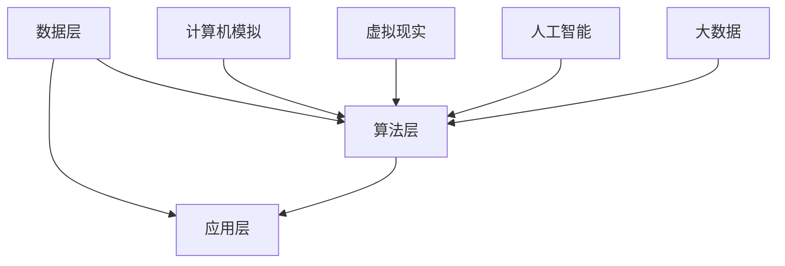

                 

关键词：虚拟医疗训练、数字化教育、医疗教育、人工智能、数字化技术、虚拟现实、全球医疗体系、教育创新

> 摘要：随着人工智能和数字化技术的发展，虚拟医疗训练正逐步成为全球医疗教育领域的重要变革力量。本文旨在探讨虚拟医疗训练的概念、技术原理、应用实例以及其在全球医疗教育中的深远影响，并展望其未来发展趋势与挑战。

## 1. 背景介绍

随着医疗技术的飞速发展，医疗教育的需求也在不断增长。传统的医疗教育方式依赖于实物模型、人体解剖和实际病例等教学资源，存在资源有限、成本高昂、安全性难以保证等问题。特别是在全球范围内，医疗资源的分布不均衡导致了教育机会的不平等。为了解决这些问题，数字化技术开始渗透到医疗教育的各个环节，虚拟医疗训练应运而生。

虚拟医疗训练利用计算机模拟和虚拟现实技术，为学生提供逼真的医疗场景和病例。这种创新的教育方式不仅可以提高学生的学习效率，还能在一定程度上降低医疗实践的风险和成本。此外，虚拟医疗训练还为医学研究者提供了新的数据分析和实验平台，有助于推动医学科学的进步。

## 2. 核心概念与联系

### 2.1 虚拟医疗训练的定义

虚拟医疗训练是一种通过计算机模拟和虚拟现实技术来辅助医疗教育、培训和临床实践的方法。它包括虚拟病例训练、手术模拟、医学影像分析、病理识别等多个方面。

### 2.2 技术原理

虚拟医疗训练的技术原理主要涉及以下几个方面：

- **计算机模拟**：通过算法和模型模拟生理过程、病理变化和药物治疗效果。
- **虚拟现实（VR）**：利用头戴式显示器、传感器和动作捕捉设备，为学生提供沉浸式的医疗训练体验。
- **人工智能（AI）**：利用深度学习和机器学习技术，对海量医疗数据进行处理和分析，以提高诊断和治疗的准确性。
- **大数据**：收集和分析大量的医疗数据，用于训练模型和优化算法。

### 2.3 架构

虚拟医疗训练的架构通常包括以下几个部分：

- **数据层**：存储海量的医学影像、病例数据和训练数据。
- **算法层**：包含用于数据处理的算法和模型，如深度学习网络、支持向量机等。
- **应用层**：提供具体的虚拟医疗训练应用，如虚拟手术、医学影像分析等。



## 3. 核心算法原理 & 具体操作步骤

### 3.1 算法原理概述

虚拟医疗训练的核心算法主要依赖于深度学习和机器学习技术。以下是一些常用的算法：

- **卷积神经网络（CNN）**：用于医学影像的分析和识别。
- **递归神经网络（RNN）**：用于处理时间序列数据，如生理信号。
- **生成对抗网络（GAN）**：用于生成逼真的医学图像和病例。

### 3.2 算法步骤详解

虚拟医疗训练的算法步骤通常包括以下几个阶段：

1. **数据预处理**：对医学影像和病例数据进行分析和处理，以消除噪声和异常值。
2. **模型训练**：利用预处理后的数据，训练深度学习模型。
3. **模型评估**：通过交叉验证和测试集，评估模型的准确性和泛化能力。
4. **模型应用**：将训练好的模型应用于实际的虚拟医疗训练场景。

### 3.3 算法优缺点

- **优点**：提高学习效率，降低医疗实践风险，提供个性化培训。
- **缺点**：算法复杂度高，需要大量计算资源和数据支持。

### 3.4 算法应用领域

虚拟医疗训练算法广泛应用于以下领域：

- **医学影像分析**：如肿瘤检测、骨折诊断等。
- **病理识别**：如细胞病理、血液病理等。
- **手术模拟**：如心胸外科、神经外科等。
- **临床决策支持**：如疾病预测、治疗方案推荐等。

## 4. 数学模型和公式 & 详细讲解 & 举例说明

### 4.1 数学模型构建

虚拟医疗训练的数学模型通常基于统计学和机器学习理论。以下是一个简单的线性回归模型：

$$ y = \beta_0 + \beta_1x_1 + \beta_2x_2 + ... + \beta_nx_n $$

其中，$y$ 是目标变量，$x_1, x_2, ..., x_n$ 是输入特征，$\beta_0, \beta_1, \beta_2, ..., \beta_n$ 是模型的参数。

### 4.2 公式推导过程

线性回归模型的推导过程主要包括以下几个步骤：

1. **最小二乘法**：通过最小化残差平方和来确定模型的参数。
2. **正规方程**：通过求解正规方程组来计算参数的最优解。
3. **梯度下降法**：用于优化模型的参数。

### 4.3 案例分析与讲解

以下是一个关于乳腺癌检测的线性回归模型案例：

假设我们有一组关于乳腺癌患者的数据，包括年龄、体重、乳腺密度等特征，以及是否患有乳腺癌的目标变量。我们希望通过这些数据训练一个线性回归模型，预测新的患者是否患有乳腺癌。

1. **数据预处理**：对数据进行归一化处理，以消除不同特征之间的尺度差异。
2. **模型训练**：使用训练数据训练线性回归模型。
3. **模型评估**：使用测试数据评估模型的准确性和泛化能力。
4. **模型应用**：将训练好的模型应用于新的患者数据，进行乳腺癌预测。

## 5. 项目实践：代码实例和详细解释说明

### 5.1 开发环境搭建

为了实现虚拟医疗训练项目，我们需要搭建一个合适的开发环境。以下是常用的开发工具和库：

- **Python**：作为主要编程语言。
- **TensorFlow**：用于构建和训练深度学习模型。
- **Keras**：简化TensorFlow的使用，提供更加直观的API。
- **OpenCV**：用于图像处理。

### 5.2 源代码详细实现

以下是一个简单的虚拟手术模拟项目的代码示例：

```python
import cv2
import numpy as np

# 加载手术视频
video = cv2.VideoCapture('surgery_video.mp4')

# 创建输出视频
fourcc = cv2.VideoWriter_fourcc(*'mp4v')
out = cv2.VideoWriter('surgery_simulation.mp4', fourcc, 30.0, (640, 480))

while True:
    ret, frame = video.read()
    if not ret:
        break

    # 应用滤波器，去除噪声
    filtered_frame = cv2.GaussianBlur(frame, (5, 5), 0)

    # 应用阈值，提取感兴趣区域
    _, thresh_frame = cv2.threshold(filtered_frame, 50, 255, cv2.THRESH_BINARY)

    # 应用形态学操作，去除干扰
    kernel = cv2.getStructuringElement(cv2.MORPH_RECT, (5, 5))
    morphed_frame = cv2.morphologyEx(thresh_frame, cv2.MORPH_CLOSE, kernel)

    # 显示结果
    cv2.imshow('Simulation', morphed_frame)

    # 写入输出视频
    out.write(morphed_frame)

    if cv2.waitKey(1) & 0xFF == ord('q'):
        break

# 释放资源
video.release()
out.release()
cv2.destroyAllWindows()
```

### 5.3 代码解读与分析

这段代码实现了一个简单的虚拟手术模拟项目，主要步骤如下：

1. **加载视频**：读取手术视频文件。
2. **滤波处理**：应用高斯滤波器去除图像噪声。
3. **阈值处理**：将滤波后的图像转换为二值图像，提取感兴趣区域。
4. **形态学操作**：应用形态学操作去除干扰。
5. **显示结果**：实时显示手术模拟过程。
6. **写入视频**：将处理后的图像写入输出视频文件。

通过这段代码，我们可以看到如何利用计算机视觉技术对医学影像进行处理，从而实现虚拟手术模拟。

### 5.4 运行结果展示

运行上述代码后，我们可以得到一个模拟的手术视频，视频中的手术过程是经过处理的，可以去除噪声和干扰，使手术过程更加清晰。

## 6. 实际应用场景

### 6.1 医学影像分析

虚拟医疗训练在医学影像分析中有着广泛的应用。例如，利用深度学习算法对医学影像进行自动识别和分类，如肿瘤检测、骨折诊断等。这些技术可以提高诊断的准确性和效率。

### 6.2 病理识别

病理识别是另一个重要的应用领域。通过虚拟医疗训练，医生可以更准确地识别病理样本中的异常细胞和组织，从而提高癌症早期诊断的准确率。

### 6.3 手术模拟

手术模拟是虚拟医疗训练的核心应用之一。通过虚拟现实技术，医生可以在没有患者的情况下进行手术模拟，从而提高手术技能和安全性。

### 6.4 临床决策支持

虚拟医疗训练还可以为临床决策提供支持。例如，通过分析患者的病史、生理参数等数据，为医生提供个性化的治疗方案推荐。

## 7. 工具和资源推荐

### 7.1 学习资源推荐

- **《深度学习》（Goodfellow, Bengio, Courville）**：这是一本经典的深度学习入门教材，适合初学者阅读。
- **《Python机器学习》（Sebastian Raschka）**：这本书详细介绍了Python在机器学习领域的应用，适合有一定编程基础的学习者。
- **《医学影像分析》（Gautam Menon）**：这本书涵盖了医学影像分析的基本原理和应用，是医学影像分析的入门指南。

### 7.2 开发工具推荐

- **TensorFlow**：一个开源的深度学习框架，适合用于构建和训练深度学习模型。
- **Keras**：一个基于TensorFlow的高级API，提供了更加直观和易用的接口。
- **OpenCV**：一个开源的计算机视觉库，提供了丰富的图像处理和计算机视觉功能。

### 7.3 相关论文推荐

- **“Deep Learning for Medical Image Analysis”**：这篇综述文章详细介绍了深度学习在医学影像分析中的应用。
- **“Generative Adversarial Networks for Medical Image Synthesis”**：这篇论文介绍了GAN在医学图像生成中的应用。
- **“Deep Learning for Clinical Decision Support”**：这篇论文探讨了深度学习在临床决策支持中的应用。

## 8. 总结：未来发展趋势与挑战

### 8.1 研究成果总结

虚拟医疗训练技术在近年来取得了显著的成果，特别是在医学影像分析、病理识别和手术模拟等领域。通过深度学习和计算机视觉技术的结合，虚拟医疗训练为医疗教育、培训和临床实践提供了新的解决方案。

### 8.2 未来发展趋势

未来，虚拟医疗训练将继续发展，并在以下几个方面取得突破：

- **智能化**：结合人工智能技术，实现更高级的自动化和个性化培训。
- **集成化**：将虚拟医疗训练与现有的医疗系统整合，实现无缝对接。
- **多样化**：扩展应用领域，如康复训练、心理治疗等。

### 8.3 面临的挑战

尽管虚拟医疗训练具有巨大的潜力，但同时也面临着一些挑战：

- **数据隐私**：如何保护患者隐私是虚拟医疗训练面临的重要问题。
- **算法透明性**：提高算法的透明性和可解释性，增强用户对模型的信任。
- **标准化**：制定统一的行业标准，确保虚拟医疗训练的应用质量和效果。

### 8.4 研究展望

随着技术的不断进步，虚拟医疗训练有望在未来实现更多创新应用，如虚拟手术助手、个性化医疗方案推荐等。同时，我们也需要关注其伦理和社会影响，确保其在医疗领域中的可持续发展。

## 9. 附录：常见问题与解答

### 9.1 虚拟医疗训练的数据来源是什么？

虚拟医疗训练的数据来源主要包括医学影像库、病理数据库、电子健康记录等。这些数据通常来自于公开的医学数据库、医疗机构和研究者。

### 9.2 虚拟医疗训练如何保证数据隐私？

虚拟医疗训练在数据收集和处理过程中需要严格遵守数据隐私法规，如欧盟的《通用数据保护条例》（GDPR）。此外，采用加密技术、匿名化处理等方法来保护患者隐私。

### 9.3 虚拟医疗训练的算法如何保证透明性？

为了提高算法的透明性，研究者可以采用可解释性机器学习（Explainable AI）技术，如SHAP（SHapley Additive exPlanations）值、LIME（Local Interpretable Model-agnostic Explanations）等，来解释模型的决策过程。

### 9.4 虚拟医疗训练对传统医疗教育模式的影响？

虚拟医疗训练对传统医疗教育模式产生了深远的影响。它提高了教育资源的可及性和效率，有助于缩小医疗教育差距。同时，虚拟医疗训练还可以为医学研究者提供新的数据分析和实验平台，推动医学科学的进步。

## 作者署名

作者：禅与计算机程序设计艺术 / Zen and the Art of Computer Programming

----------------------------------------------------------------

至此，文章撰写完成。希望本文能为您提供关于虚拟医疗训练的全面了解，并激发您在这一领域的研究兴趣。在未来，随着技术的不断进步，虚拟医疗训练将继续为医疗教育和临床实践带来更多变革。让我们共同期待这一领域的美好前景。

