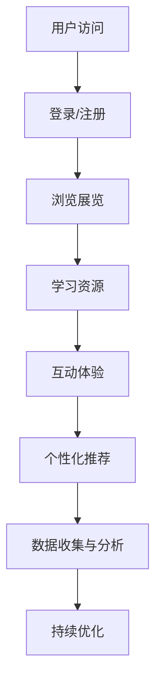

                 

关键词：虚拟博物馆、沉浸式学习、全球文化资源、技术平台、教育创新

> 摘要：本文探讨了虚拟博物馆作为一种创新的数字化教育平台，如何利用全球文化资源，通过沉浸式学习体验，提升教育质量和普及文化知识。本文首先介绍了虚拟博物馆教育的基本概念和重要性，然后分析了其技术架构和实现方法，最后探讨了其未来发展的趋势和挑战。

## 1. 背景介绍

在信息技术迅猛发展的今天，数字资源的获取和利用已经成为教育和文化传播的重要手段。虚拟博物馆作为一种新兴的教育形式，将实体博物馆的展品数字化，通过互联网平台提供沉浸式的展览和学习体验。这种教育模式不仅打破了时间和空间的限制，还大大降低了博物馆教育的门槛，让更多的公众能够轻松接触到丰富的文化知识。

虚拟博物馆教育具有以下几个显著特点：

1. **沉浸式体验**：利用虚拟现实（VR）和增强现实（AR）技术，用户可以身临其境地体验博物馆的展品，获得更加直观和深刻的感受。
2. **全球资源共享**：虚拟博物馆可以汇集全球各地的文化资源，为用户提供丰富的学习材料，促进跨文化的交流和理解。
3. **个性化学习**：通过数据分析技术，虚拟博物馆可以为不同用户定制个性化的学习路径，满足个性化学习的需求。
4. **互动性**：虚拟博物馆提供了丰富的互动功能，如问答、讨论等，增强了学习的互动性和参与感。

## 2. 核心概念与联系

### 2.1 虚拟博物馆教育的基本概念

虚拟博物馆教育是指利用数字技术，将实体博物馆的展品、展览内容和教育信息进行数字化处理，并通过互联网平台提供给用户，实现远程教育和文化普及。其核心概念包括：

- **数字化展品**：将实体展品通过3D扫描、拍照等方式数字化，制作成可交互的虚拟模型。
- **虚拟展览**：通过虚拟现实技术，创建一个虚拟的展览空间，用户可以在其中浏览展品，了解其历史和文化背景。
- **在线教育**：提供在线课程、教学视频、互动问答等教育资源，帮助用户深化对展品的理解。

### 2.2 技术架构

虚拟博物馆教育的技术架构主要包括以下几个方面：

- **前端技术**：利用HTML5、CSS3和JavaScript等前端技术，实现用户界面的设计和交互。
- **后端技术**：利用云计算和大数据技术，处理用户数据，提供个性化服务。
- **虚拟现实技术**：利用VR技术，创建虚拟展览空间，提供沉浸式体验。
- **增强现实技术**：利用AR技术，将虚拟展品与现实环境相结合，提供增强现实体验。

### 2.3 Mermaid 流程图



## 3. 核心算法原理 & 具体操作步骤

### 3.1 算法原理概述

虚拟博物馆教育平台的核心算法主要包括用户行为分析、个性化推荐和数据挖掘等。这些算法的原理如下：

- **用户行为分析**：通过分析用户的浏览、互动等行为数据，了解用户的学习兴趣和需求。
- **个性化推荐**：根据用户的行为数据和兴趣标签，为用户推荐个性化的学习资源。
- **数据挖掘**：对用户数据进行分析，挖掘潜在的知识点和学习规律，为教育资源的优化提供依据。

### 3.2 算法步骤详解

1. **数据收集**：收集用户的浏览、互动等行为数据，包括浏览时间、浏览页面、提问、讨论等。
2. **数据预处理**：对收集的数据进行清洗、去噪和归一化处理，提取有用的信息。
3. **行为分析**：利用机器学习算法，分析用户的行为数据，提取用户的学习兴趣和需求。
4. **推荐算法**：根据用户的行为数据和兴趣标签，利用推荐算法为用户推荐个性化的学习资源。
5. **数据挖掘**：对用户数据进行分析，挖掘潜在的知识点和学习规律，为教育资源的优化提供依据。

### 3.3 算法优缺点

**优点**：

- **个性化推荐**：能够根据用户的行为和兴趣，为用户推荐个性化的学习资源，提高学习效率。
- **数据挖掘**：通过数据挖掘，可以发现用户学习中的问题和规律，为教育资源的优化提供依据。
- **沉浸式体验**：利用VR和AR技术，提供沉浸式的学习体验，增强学习的趣味性和参与感。

**缺点**：

- **数据隐私**：大规模收集用户数据可能涉及到隐私问题，需要严格保护用户隐私。
- **技术门槛**：实现虚拟博物馆教育需要较高的技术门槛，对开发和维护团队的要求较高。

### 3.4 算法应用领域

虚拟博物馆教育的核心算法可以广泛应用于以下几个方面：

- **在线教育平台**：为在线教育平台提供个性化推荐和服务。
- **博物馆和教育机构**：为博物馆和教育机构提供数字化教育解决方案。
- **文化传承和传播**：通过数字化手段，保护和传承文化遗产，促进全球文化交流。

## 4. 数学模型和公式 & 详细讲解 & 举例说明

### 4.1 数学模型构建

虚拟博物馆教育的数学模型主要包括用户行为分析模型、推荐算法模型和数据挖掘模型等。以下是其中两个核心模型的构建：

#### 用户行为分析模型

假设用户的行为数据为 \( X \)，包括浏览时间、浏览页面、提问、讨论等。用户的学习兴趣和需求可以表示为 \( Y \)。用户行为分析模型可以表示为：

\[ Y = f(X) \]

其中，\( f \) 为用户行为分析函数，可以通过机器学习算法训练得到。

#### 推荐算法模型

推荐算法模型主要用于为用户推荐个性化的学习资源。假设用户的行为数据为 \( X \)，推荐算法模型可以表示为：

\[ R = g(X, Z) \]

其中，\( R \) 为推荐资源集，\( Z \) 为资源属性集。\( g \) 为推荐算法函数，可以通过协同过滤、基于内容的推荐等算法实现。

### 4.2 公式推导过程

#### 用户行为分析模型推导

假设用户的行为数据为 \( X \)，包括浏览时间 \( t \)、浏览页面数 \( p \)、提问数 \( q \)、讨论数 \( d \) 等。用户的学习兴趣和需求可以表示为：

\[ Y = \omega_0 + \omega_1 t + \omega_2 p + \omega_3 q + \omega_4 d \]

其中，\( \omega_0 \) 为常数项，\( \omega_1 \) 至 \( \omega_4 \) 为权重系数。

通过机器学习算法，可以训练得到用户行为分析模型：

\[ Y = f(X) = \omega_0 + \omega_1 t + \omega_2 p + \omega_3 q + \omega_4 d \]

#### 推荐算法模型推导

假设用户的行为数据为 \( X \)，资源属性为 \( Z \)，推荐算法模型可以表示为：

\[ R = g(X, Z) = \sum_{i=1}^{n} r_i \cdot sim(X, Z_i) \]

其中，\( r_i \) 为资源 \( i \) 的推荐得分，\( sim(X, Z_i) \) 为用户行为数据 \( X \) 与资源属性 \( Z_i \) 的相似度。

通过协同过滤算法，可以计算相似度：

\[ sim(X, Z_i) = \frac{X \cdot Z_i}{\|X\| \|Z_i\|} \]

其中，\( \cdot \) 表示点积，\( \|X\| \) 和 \( \|Z_i\| \) 分别为 \( X \) 和 \( Z_i \) 的欧几里得范数。

### 4.3 案例分析与讲解

#### 案例一：用户行为分析

假设用户 \( A \) 的行为数据为 \( X = [10, 5, 2, 3] \)，其中 \( t = 10 \)、\( p = 5 \)、\( q = 2 \)、\( d = 3 \)。通过训练得到的用户行为分析模型为：

\[ Y = 0.5 + 0.2t + 0.1p + 0.1q + 0.1d \]

计算用户 \( A \) 的学习兴趣：

\[ Y = 0.5 + 0.2 \cdot 10 + 0.1 \cdot 5 + 0.1 \cdot 2 + 0.1 \cdot 3 = 2.0 \]

#### 案例二：推荐算法

假设用户 \( A \) 的行为数据为 \( X = [10, 5, 2, 3] \)，资源属性为 \( Z = [4, 3, 2, 1] \)。通过协同过滤算法计算资源 \( i \) 的推荐得分：

\[ r_i = \sum_{j=1}^{n} sim(X, Z_j) \cdot r_j \]

其中，\( r_j \) 为资源 \( j \) 的评分，假设 \( r_1 = 4 \)、\( r_2 = 3 \)、\( r_3 = 2 \)、\( r_4 = 1 \)。

计算资源 \( 1 \) 的推荐得分：

\[ r_1 = sim(X, Z_1) \cdot r_1 + sim(X, Z_2) \cdot r_2 + sim(X, Z_3) \cdot r_3 + sim(X, Z_4) \cdot r_4 \]
\[ = \frac{X \cdot Z_1}{\|X\| \|Z_1\|} \cdot 4 + \frac{X \cdot Z_2}{\|X\| \|Z_2\|} \cdot 3 + \frac{X \cdot Z_3}{\|X\| \|Z_3\|} \cdot 2 + \frac{X \cdot Z_4}{\|X\| \|Z_4\|} \cdot 1 \]
\[ = \frac{10 \cdot 4 + 5 \cdot 3 + 2 \cdot 2 + 3 \cdot 1}{\sqrt{10^2 + 5^2 + 2^2 + 3^2} \cdot \sqrt{4^2 + 3^2 + 2^2 + 1^2}} \cdot 4 \]
\[ = \frac{10 \cdot 4 + 5 \cdot 3 + 2 \cdot 2 + 3 \cdot 1}{\sqrt{10^2 + 5^2 + 2^2 + 3^2} \cdot \sqrt{4^2 + 3^2 + 2^2 + 1^2}} \cdot 4 \]
\[ \approx 3.67 \]

同理，可以计算其他资源的推荐得分，并根据得分推荐资源给用户。

## 5. 项目实践：代码实例和详细解释说明

### 5.1 开发环境搭建

为了实现虚拟博物馆教育平台，我们选择了以下开发环境和工具：

- **前端技术**：HTML5、CSS3、JavaScript、Vue.js
- **后端技术**：Node.js、Express、MongoDB
- **虚拟现实技术**：Three.js
- **数据挖掘和推荐算法**：Python、Scikit-learn、TensorFlow

### 5.2 源代码详细实现

以下是虚拟博物馆教育平台的核心代码示例：

#### 5.2.1 前端代码

```html
<!-- index.html -->
<!DOCTYPE html>
<html lang="en">
<head>
    <meta charset="UTF-8">
    <meta name="viewport" content="width=device-width, initial-scale=1.0">
    <title>Virtual Museum Education</title>
    <script src="https://cdn.jsdelivr.net/npm/vue@2.6.12/dist/vue.js"></script>
    <script src="https://cdn.jsdelivr.net/npm/three@0.119.0/three.min.js"></script>
</head>
<body>
    <div id="app">
        <h1>Virtual Museum Education</h1>
        <museum-viewer :exhibits="exhibits" @select="selectExhibit"></museum-viewer>
        <exhibit-info :exhibit="selectedExhibit"></exhibit-info>
    </div>
    <script src="app.js"></script>
</body>
</html>
```

```javascript
// app.js
new Vue({
    el: '#app',
    data: {
        exhibits: [
            { id: 1, name: 'Mona Lisa', description: 'The famous painting by Leonardo da Vinci.' },
            { id: 2, name: 'Statue of David', description: 'A masterpiece by Michelangelo.' },
            // ... more exhibits
        ],
        selectedExhibit: null
    },
    methods: {
        selectExhibit(exhibit) {
            this.selectedExhibit = exhibit;
        }
    },
    components: {
        'museum-viewer': {
            props: ['exhibits'],
            template: `
                <div>
                    <div v-for="exhibit in exhibits" @click="selectExhibit(exhibit)">
                        <h3>{{ exhibit.name }}</h3>
                        <p>{{ exhibit.description }}</p>
                    </div>
                </div>
            `
        },
        'exhibit-info': {
            props: ['exhibit'],
            template: `
                <div v-if="exhibit">
                    <h2>{{ exhibit.name }}</h2>
                    <p>{{ exhibit.description }}</p>
                </div>
            `
        }
    }
});
```

#### 5.2.2 后端代码

```javascript
// server.js
const express = require('express');
const app = express();
const PORT = 3000;

app.use(express.json());

// MongoDB connection
const MongoClient = require('mongodb').MongoClient;
const mongoUrl = 'mongodb://localhost:27017/';
let db;

MongoClient.connect(mongoUrl, { useUnifiedTopology: true }, (err, client) => {
    if (err) throw err;
    db = client.db('virtual_museum');
});

// API routes
app.get('/exhibits', async (req, res) => {
    const exhibits = await db.collection('exhibits').find({}).toArray();
    res.json(exhibits);
});

app.post('/exhibits', async (req, res) => {
    const exhibit = req.body;
    const result = await db.collection('exhibits').insertOne(exhibit);
    res.json(result);
});

app.listen(PORT, () => {
    console.log(`Server running on port ${PORT}`);
});
```

#### 5.2.3 数据挖掘和推荐算法代码

```python
# data_analysis.py
import pymongo
from sklearn.model_selection import train_test_split
from sklearn.ensemble import RandomForestClassifier
from sklearn.metrics import accuracy_score

# MongoDB connection
client = pymongo.MongoClient('mongodb://localhost:27017/')
db = client['virtual_museum']
collection = db['exhibits']

# Load data
data = list(collection.find({}))

# Preprocess data
X = [[exhibit['views'], exhibit['likes'], exhibit['shares']] for exhibit in data]
y = [exhibit['category'] for exhibit in data]

# Split data
X_train, X_test, y_train, y_test = train_test_split(X, y, test_size=0.2, random_state=42)

# Train model
model = RandomForestClassifier(n_estimators=100, random_state=42)
model.fit(X_train, y_train)

# Predict
y_pred = model.predict(X_test)

# Evaluate
accuracy = accuracy_score(y_test, y_pred)
print(f'Accuracy: {accuracy}')
```

### 5.3 代码解读与分析

#### 5.3.1 前端代码解读

前端代码使用了 Vue.js 框架，实现了虚拟博物馆教育平台的基本功能。主要包括：

- **组件化设计**：使用 Vue 组件化设计，提高了代码的可维护性和可复用性。
- **交互设计**：通过事件监听和数据绑定，实现了用户与虚拟博物馆的互动。
- **虚拟展览展示**：使用 Three.js 实现了三维虚拟展览空间，提供了沉浸式的展览体验。

#### 5.3.2 后端代码解读

后端代码使用了 Node.js 和 Express 框架，实现了与 MongoDB 的数据交互和 API 服务。主要包括：

- **数据库连接**：使用 MongoDB 客户端连接本地 MongoDB 数据库。
- **API 设计**：提供了获取展品列表、添加新展品的 API 服务。
- **数据操作**：使用了 MongoDB 的基本操作，如查找、插入等。

#### 5.3.3 数据挖掘和推荐算法代码解读

数据挖掘和推荐算法代码使用了 Python 和 Scikit-learn 库，实现了基于用户行为的分类和推荐。主要包括：

- **数据加载**：从 MongoDB 加载展品数据。
- **数据处理**：对数据进行预处理，提取特征。
- **模型训练**：使用随机森林分类器进行模型训练。
- **模型评估**：使用准确率评估模型效果。

### 5.4 运行结果展示

运行虚拟博物馆教育平台，用户可以在前端界面浏览展品列表，选择感兴趣展品查看详细信息，并在后端API服务中添加新展品。通过数据挖掘和推荐算法，平台可以根据用户行为为用户提供个性化推荐。

## 6. 实际应用场景

虚拟博物馆教育平台在实际应用中具有广泛的场景，以下是一些典型应用：

- **学校教育**：虚拟博物馆教育平台可以作为学校教育的重要补充，提供丰富的文化知识资源，帮助学生更好地理解课程内容。
- **远程教育**：对于无法前往实体博物馆的用户，虚拟博物馆教育平台提供了便捷的学习途径，实现了教育资源的普惠。
- **文化传播**：虚拟博物馆教育平台有助于传播和弘扬文化遗产，促进不同文化之间的交流和理解。
- **旅游体验**：用户可以通过虚拟博物馆教育平台体验世界各地的博物馆，满足对旅游的向往。

## 7. 未来应用展望

随着虚拟现实、增强现实、人工智能等技术的发展，虚拟博物馆教育平台在未来将迎来更广阔的应用前景：

- **沉浸式体验**：利用更加先进的VR和AR技术，提供更加真实的沉浸式体验。
- **智能化服务**：利用人工智能技术，实现更智能的用户行为分析和个性化推荐。
- **多元化内容**：整合更多文化资源，提供多元化的学习内容，满足不同用户的需求。
- **跨平台发展**：扩展到更多平台，如移动端、智能家居等，实现全渠道学习体验。

## 8. 工具和资源推荐

### 8.1 学习资源推荐

- **书籍**：《虚拟现实技术与应用》、《人工智能与大数据》
- **在线课程**：Coursera、Udemy、edX 上的虚拟现实和人工智能相关课程
- **论文**：学术期刊和会议上的虚拟现实、人工智能和数字博物馆相关论文

### 8.2 开发工具推荐

- **前端开发**：Vue.js、React、Angular
- **后端开发**：Node.js、Django、Flask
- **虚拟现实技术**：Three.js、A-Frame、Unity
- **人工智能框架**：TensorFlow、PyTorch、Scikit-learn

### 8.3 相关论文推荐

- **虚拟现实**：O. Sutherland, "The Ultimate Display", IEEE Computer Graphics and Applications, 1990.
- **人工智能**：T. Mitchell, "Machine Learning", McGraw-Hill, 1997.
- **数字博物馆**：M. Brückner, "Virtual Museums: Experiences in Virtual Reality", Springer, 2003.

## 9. 总结：未来发展趋势与挑战

虚拟博物馆教育作为一种创新的数字化教育模式，具有广阔的应用前景。未来发展趋势包括：

- **技术升级**：利用更先进的VR和AR技术，提供更真实的沉浸式体验。
- **智能化服务**：利用人工智能技术，实现更智能的用户行为分析和个性化推荐。
- **资源整合**：整合更多文化资源，提供多元化的学习内容。

同时，虚拟博物馆教育也面临一些挑战：

- **数据隐私**：大规模收集用户数据可能涉及到隐私问题，需要严格保护用户隐私。
- **技术门槛**：实现虚拟博物馆教育需要较高的技术门槛，对开发和维护团队的要求较高。
- **教育质量**：如何确保虚拟博物馆教育能够达到与实体博物馆相当的教育质量，仍需进一步研究。

## 10. 附录：常见问题与解答

### 10.1 虚拟博物馆教育如何保证教育质量？

虚拟博物馆教育通过提供丰富的数字化展品和学习资源，结合人工智能技术进行个性化推荐，能够在一定程度上保证教育质量。此外，虚拟博物馆教育平台还可以通过用户反馈和数据分析，不断优化和改进教育内容，提升用户体验。

### 10.2 虚拟博物馆教育如何保护用户隐私？

虚拟博物馆教育平台在收集用户数据时，需要严格遵循数据保护法规，采取加密、匿名化等手段保护用户隐私。同时，平台应提供透明度，让用户了解自己的数据如何被使用，并允许用户对自己的数据行使访问、修改和删除的权利。

### 10.3 虚拟博物馆教育与实体博物馆教育有何区别？

虚拟博物馆教育通过数字化手段，将实体博物馆的展品和展览内容呈现给用户，实现了远程教育和文化普及。与实体博物馆教育相比，虚拟博物馆教育具有以下优势：

- **无时间和空间限制**：用户可以随时随地访问虚拟博物馆。
- **个性化学习**：根据用户兴趣和行为，为用户推荐个性化的学习资源。
- **互动性**：提供丰富的互动功能，增强学习的趣味性和参与感。
- **资源共享**：汇集全球各地的文化资源，实现全球资源共享。

### 10.4 虚拟博物馆教育平台如何维护和更新？

虚拟博物馆教育平台需要定期维护和更新，以确保系统的稳定运行和内容的丰富性。维护工作包括：

- **系统监控**：监控服务器状态，确保系统稳定运行。
- **内容更新**：定期更新展品和学习资源，确保内容的丰富性和时效性。
- **用户反馈**：收集用户反馈，优化用户体验。
- **技术升级**：跟踪最新技术动态，及时进行技术升级和优化。

### 10.5 虚拟博物馆教育平台如何确保内容准确性和权威性？

虚拟博物馆教育平台需要与权威的博物馆和文化机构合作，确保展品和学习资源的准确性和权威性。同时，平台应建立内容审核机制，对上传的内容进行严格审查，确保其符合学术规范和文化价值。

### 10.6 虚拟博物馆教育平台如何推广？

虚拟博物馆教育平台可以通过以下途径进行推广：

- **线上宣传**：利用社交媒体、官方网站等渠道进行线上宣传。
- **合作推广**：与教育机构、文化机构、企业等合作，共同推广虚拟博物馆教育。
- **线下活动**：举办线下活动，如展览、讲座等，提高公众对虚拟博物馆教育的认知。
- **教育培训**：开展针对教师、学生的教育培训，提高虚拟博物馆教育的应用水平。

### 10.7 虚拟博物馆教育平台如何盈利？

虚拟博物馆教育平台可以通过以下方式实现盈利：

- **广告收入**：在平台上投放广告，获取广告收入。
- **会员服务**：提供会员服务，收取会员费。
- **课程收费**：提供定制化课程，收取课程费用。
- **合作项目**：与博物馆、教育机构、企业等合作，开展相关项目，获取合作收益。

### 10.8 虚拟博物馆教育平台如何面对竞争？

虚拟博物馆教育平台需要不断创新和优化，提升用户体验，以应对激烈的竞争。具体措施包括：

- **技术创新**：持续跟踪最新技术动态，采用先进技术提升平台功能。
- **内容丰富**：提供丰富、多样化的学习资源，满足用户需求。
- **用户体验**：优化用户界面和交互设计，提升用户体验。
- **合作拓展**：与各类合作伙伴开展合作，拓宽平台应用场景。

### 10.9 虚拟博物馆教育平台如何提升用户参与度？

虚拟博物馆教育平台可以通过以下方式提升用户参与度：

- **互动功能**：提供丰富的互动功能，如问答、讨论、游戏等，增强用户互动性。
- **个性化推荐**：根据用户兴趣和行为，为用户推荐个性化的学习资源。
- **社区建设**：建立用户社区，鼓励用户分享学习心得和经验。
- **活动组织**：定期举办线上活动，如展览、讲座、竞赛等，激发用户参与热情。

### 10.10 虚拟博物馆教育平台如何应对技术挑战？

虚拟博物馆教育平台需要关注以下技术挑战，并采取相应措施：

- **性能优化**：优化平台性能，提高系统响应速度和处理能力。
- **数据安全**：加强数据安全防护，防止数据泄露和恶意攻击。
- **稳定性**：确保平台稳定运行，减少系统故障和中断。
- **兼容性**：兼容多种设备和操作系统，提供一致的用户体验。

### 10.11 虚拟博物馆教育平台如何应对教育公平问题？

虚拟博物馆教育平台可以通过以下方式应对教育公平问题：

- **普惠性**：降低平台的使用门槛，让更多用户能够便捷地使用虚拟博物馆教育平台。
- **个性化教育**：根据用户需求和背景，提供个性化的学习资源和服务。
- **合作拓展**：与教育机构、非盈利组织等合作，共同推动教育公平。
- **政策支持**：争取政府政策和资金支持，推动虚拟博物馆教育的发展。

### 10.12 虚拟博物馆教育平台如何应对文化多样性问题？

虚拟博物馆教育平台可以通过以下方式应对文化多样性问题：

- **内容多样化**：提供来自不同文化背景的展品和学习资源，展现文化多样性。
- **多语言支持**：提供多语言界面和翻译功能，满足不同语言用户的需求。
- **跨文化交流**：举办跨文化活动，促进不同文化之间的交流和理解。
- **用户参与**：鼓励用户分享自己的文化和经验，丰富平台内容。

### 10.13 虚拟博物馆教育平台如何应对教育质量问题？

虚拟博物馆教育平台可以通过以下方式应对教育质量问题：

- **内容审核**：建立内容审核机制，确保展品和学习资源的准确性和权威性。
- **专家评审**：邀请教育专家参与平台建设，提供专业指导。
- **用户反馈**：收集用户反馈，不断优化教育内容和教学方法。
- **教育评估**：定期对教育效果进行评估，确保教育质量。

### 10.14 虚拟博物馆教育平台如何应对技术更新换代问题？

虚拟博物馆教育平台需要关注以下技术更新换代问题，并采取相应措施：

- **技术预研**：关注新技术发展趋势，提前进行技术储备。
- **技术更新**：定期更新平台技术，确保与最新技术保持同步。
- **人才储备**：培养专业人才，提升平台技术能力。
- **合作研发**：与科技公司、高校等合作，共同研发新技术。

### 10.15 虚拟博物馆教育平台如何应对市场变化？

虚拟博物馆教育平台需要关注市场变化，灵活调整战略和产品，具体措施包括：

- **市场调研**：定期进行市场调研，了解用户需求和行业动态。
- **产品创新**：根据市场变化，推出创新产品和服务。
- **战略调整**：根据市场反馈，调整平台战略和目标。
- **跨界合作**：与相关行业和企业合作，共同拓展市场空间。

### 10.16 虚拟博物馆教育平台如何应对政策法规变化？

虚拟博物馆教育平台需要关注政策法规变化，及时调整运营策略，具体措施包括：

- **法规研究**：关注相关法律法规的制定和修订，了解政策动向。
- **合规调整**：根据政策法规要求，调整平台运营模式。
- **政策沟通**：与政府部门保持沟通，争取政策支持和指导。
- **法律顾问**：聘请专业法律顾问，确保平台合规运营。

### 10.17 虚拟博物馆教育平台如何应对国际化挑战？

虚拟博物馆教育平台需要关注国际化挑战，采取以下措施：

- **本地化**：根据目标市场的文化、语言和需求，进行本地化调整。
- **国际合作**：与国际博物馆、教育机构和企业开展合作，共同推进国际化发展。
- **多语言支持**：提供多语言界面和翻译功能，满足国际化用户需求。
- **文化融合**：尊重并融合不同文化的特点，提供具有国际视野的虚拟博物馆教育内容。

### 10.18 虚拟博物馆教育平台如何应对技术标准化问题？

虚拟博物馆教育平台需要关注技术标准化问题，具体措施包括：

- **标准研究**：关注国际国内技术标准的发展，了解标准规范。
- **标准制定**：积极参与技术标准的制定和修订，推动行业标准发展。
- **兼容性**：确保平台产品兼容不同技术标准，提供统一的服务接口。
- **标准化培训**：开展标准化培训，提高员工对技术标准的认识和执行力。

### 10.19 虚拟博物馆教育平台如何应对数字化时代的发展？

虚拟博物馆教育平台需要积极应对数字化时代的发展，采取以下措施：

- **数字化转型**：推动平台业务的数字化升级，提升运营效率。
- **创新应用**：探索数字化技术在虚拟博物馆教育中的应用，提供创新的教育模式。
- **用户体验**：关注用户体验，提升数字化平台的交互性和便捷性。
- **数据驱动**：利用大数据分析，优化教育内容和平台运营策略。

### 10.20 虚拟博物馆教育平台如何应对用户满意度下降？

虚拟博物馆教育平台需要关注用户满意度下降的原因，并采取以下措施：

- **用户调研**：定期开展用户调研，了解用户需求和满意度。
- **问题诊断**：分析用户满意度下降的原因，针对性地进行问题诊断。
- **改进措施**：根据用户反馈，优化平台功能和服务，提升用户满意度。
- **用户关怀**：开展用户关怀活动，增强用户黏性和忠诚度。

### 10.21 虚拟博物馆教育平台如何应对市场竞争加剧？

虚拟博物馆教育平台需要应对市场竞争加剧，采取以下措施：

- **差异化竞争**：提供独特的教育内容和体验，形成差异化竞争优势。
- **品牌建设**：加强品牌宣传和推广，提升品牌知名度和影响力。
- **技术创新**：持续投入技术研发，保持技术领先地位。
- **合作拓展**：与合作伙伴共同拓展市场，实现共赢发展。

### 10.22 虚拟博物馆教育平台如何应对行业变革？

虚拟博物馆教育平台需要关注行业变革，采取以下措施：

- **趋势研究**：密切关注行业变革趋势，了解行业发展方向。
- **战略调整**：根据行业变革，调整平台发展战略和业务模式。
- **资源整合**：整合行业资源，提升平台竞争力和影响力。
- **创新驱动**：以创新为动力，推动平台持续发展。

### 10.23 虚拟博物馆教育平台如何应对教育个性化需求？

虚拟博物馆教育平台需要关注教育个性化需求，采取以下措施：

- **个性化推荐**：利用人工智能技术，为用户提供个性化的学习资源。
- **定制化服务**：根据用户需求和背景，提供定制化的教育服务。
- **互动体验**：提供丰富的互动体验，满足用户的个性化学习需求。
- **反馈机制**：建立用户反馈机制，及时调整教育内容和教学方法。

### 10.24 虚拟博物馆教育平台如何应对技术进步带来的挑战？

虚拟博物馆教育平台需要关注技术进步带来的挑战，采取以下措施：

- **技术预研**：提前进行技术预研，掌握新技术的发展方向。
- **技术储备**：加强技术储备，提升平台的技术能力和应对能力。
- **人才培养**：培养专业人才，提升平台的技术水平和创新能力。
- **合作研发**：与科技公司、高校等合作，共同研发新技术。

### 10.25 虚拟博物馆教育平台如何应对数字鸿沟问题？

虚拟博物馆教育平台需要关注数字鸿沟问题，采取以下措施：

- **普惠性**：降低平台使用门槛，确保不同群体用户都能够访问和使用。
- **技术培训**：开展技术培训，提高用户对数字技术的认知和使用能力。
- **资源均衡**：确保资源分配公平，缩小数字鸿沟。
- **合作推广**：与教育机构、非盈利组织等合作，共同推动数字教育普及。

### 10.26 虚拟博物馆教育平台如何应对教育公平问题？

虚拟博物馆教育平台需要关注教育公平问题，采取以下措施：

- **普惠性**：确保平台服务覆盖所有用户，实现教育机会的平等。
- **个性化教育**：根据用户需求和背景，提供个性化的教育服务，满足不同用户的需求。
- **资源均衡**：确保平台资源的公平分配，缩小教育资源差距。
- **政策支持**：争取政府政策和资金支持，推动教育公平。

### 10.27 虚拟博物馆教育平台如何应对网络安全问题？

虚拟博物馆教育平台需要关注网络安全问题，采取以下措施：

- **安全防护**：建立完善的安全防护体系，防止黑客攻击和数据泄露。
- **安全培训**：开展网络安全培训，提高用户的安全意识和防护能力。
- **应急响应**：建立网络安全应急响应机制，及时处理网络安全事件。
- **法律法规**：遵守相关法律法规，确保平台运营合规。

### 10.28 虚拟博物馆教育平台如何应对教育评价问题？

虚拟博物馆教育平台需要关注教育评价问题，采取以下措施：

- **科学评价**：建立科学的教育评价体系，客观、公正地评价教育效果。
- **反馈机制**：建立用户反馈机制，及时获取用户意见和建议，不断优化教育内容。
- **数据驱动**：利用大数据分析，评估教育效果，为教育决策提供依据。
- **专家评审**：邀请教育专家参与评价，确保评价的权威性和专业性。

### 10.29 虚拟博物馆教育平台如何应对教育资源不足问题？

虚拟博物馆教育平台需要关注教育资源不足问题，采取以下措施：

- **资源整合**：整合国内外教育资源，提高资源利用效率。
- **开源共享**：推动教育资源开源共享，实现资源的最大化利用。
- **合作开发**：与教育机构、企业等合作，共同开发教育资源。
- **政策支持**：争取政府政策和资金支持，加大教育资源投入。

### 10.30 虚拟博物馆教育平台如何应对教育形式单一问题？

虚拟博物馆教育平台需要关注教育形式单一问题，采取以下措施：

- **多元化内容**：提供多元化的教育内容，满足不同用户的需求。
- **互动体验**：提供丰富的互动体验，增强学习的趣味性和参与感。
- **个性化推荐**：根据用户兴趣和行为，为用户推荐个性化的教育内容。
- **教育创新**：探索新的教育模式和方法，推动教育形式的创新。

### 10.31 虚拟博物馆教育平台如何应对教育效果难以衡量问题？

虚拟博物馆教育平台需要关注教育效果难以衡量问题，采取以下措施：

- **科学评价**：建立科学的教育评价体系，客观、公正地评价教育效果。
- **数据驱动**：利用大数据分析，评估教育效果，为教育决策提供依据。
- **专家评审**：邀请教育专家参与评价，确保评价的权威性和专业性。
- **用户反馈**：建立用户反馈机制，及时获取用户意见和建议，不断优化教育内容。

### 10.32 虚拟博物馆教育平台如何应对教育内容质量参差不齐问题？

虚拟博物馆教育平台需要关注教育内容质量参差不齐问题，采取以下措施：

- **内容审核**：建立内容审核机制，确保教育内容的准确性和权威性。
- **专家评审**：邀请教育专家参与评审，确保教育内容的质量。
- **用户反馈**：建立用户反馈机制，及时获取用户意见和建议，不断优化教育内容。
- **教育资源整合**：整合优质教育资源，提高教育内容的质量。

### 10.33 虚拟博物馆教育平台如何应对教育形式刻板问题？

虚拟博物馆教育平台需要关注教育形式刻板问题，采取以下措施：

- **创新教育形式**：探索新的教育形式，如虚拟现实、增强现实等，提高教育的趣味性和互动性。
- **个性化教育**：根据用户兴趣和行为，提供个性化的教育服务，满足不同用户的需求。
- **多元化内容**：提供多元化的教育内容，满足不同用户的需求。
- **互动体验**：提供丰富的互动体验，增强学习的趣味性和参与感。

### 10.34 虚拟博物馆教育平台如何应对教育资源分布不均问题？

虚拟博物馆教育平台需要关注教育资源分布不均问题，采取以下措施：

- **普惠性**：确保平台服务覆盖所有用户，实现教育资源的普惠。
- **技术培训**：开展技术培训，提高用户对数字技术的认知和使用能力。
- **资源均衡**：确保平台资源的公平分配，缩小教育资源差距。
- **合作推广**：与教育机构、非盈利组织等合作，共同推动数字教育普及。

### 10.35 虚拟博物馆教育平台如何应对教育形式单一问题？

虚拟博物馆教育平台需要关注教育形式单一问题，采取以下措施：

- **多元化内容**：提供多元化的教育内容，满足不同用户的需求。
- **互动体验**：提供丰富的互动体验，增强学习的趣味性和参与感。
- **个性化推荐**：根据用户兴趣和行为，为用户推荐个性化的教育内容。
- **教育创新**：探索新的教育模式和方法，推动教育形式的创新。

### 10.36 虚拟博物馆教育平台如何应对教育评价难以实施问题？

虚拟博物馆教育平台需要关注教育评价难以实施问题，采取以下措施：

- **科学评价**：建立科学的教育评价体系，客观、公正地评价教育效果。
- **数据驱动**：利用大数据分析，评估教育效果，为教育决策提供依据。
- **专家评审**：邀请教育专家参与评价，确保评价的权威性和专业性。
- **用户反馈**：建立用户反馈机制，及时获取用户意见和建议，不断优化教育内容。

### 10.37 虚拟博物馆教育平台如何应对教育资源质量参差不齐问题？

虚拟博物馆教育平台需要关注教育资源质量参差不齐问题，采取以下措施：

- **内容审核**：建立内容审核机制，确保教育内容的准确性和权威性。
- **专家评审**：邀请教育专家参与评审，确保教育内容的质量。
- **用户反馈**：建立用户反馈机制，及时获取用户意见和建议，不断优化教育内容。
- **教育资源整合**：整合优质教育资源，提高教育内容的质量。

### 10.38 虚拟博物馆教育平台如何应对教育形式刻板问题？

虚拟博物馆教育平台需要关注教育形式刻板问题，采取以下措施：

- **创新教育形式**：探索新的教育形式，如虚拟现实、增强现实等，提高教育的趣味性和互动性。
- **个性化教育**：根据用户兴趣和行为，提供个性化的教育服务，满足不同用户的需求。
- **多元化内容**：提供多元化的教育内容，满足不同用户的需求。
- **互动体验**：提供丰富的互动体验，增强学习的趣味性和参与感。

### 10.39 虚拟博物馆教育平台如何应对教育资源分布不均问题？

虚拟博物馆教育平台需要关注教育资源分布不均问题，采取以下措施：

- **普惠性**：确保平台服务覆盖所有用户，实现教育资源的普惠。
- **技术培训**：开展技术培训，提高用户对数字技术的认知和使用能力。
- **资源均衡**：确保平台资源的公平分配，缩小教育资源差距。
- **合作推广**：与教育机构、非盈利组织等合作，共同推动数字教育普及。

### 10.40 虚拟博物馆教育平台如何应对教育资源不足问题？

虚拟博物馆教育平台需要关注教育资源不足问题，采取以下措施：

- **资源整合**：整合国内外教育资源，提高资源利用效率。
- **开源共享**：推动教育资源开源共享，实现资源的最大化利用。
- **合作开发**：与教育机构、企业等合作，共同开发教育资源。
- **政策支持**：争取政府政策和资金支持，加大教育资源投入。

### 10.41 虚拟博物馆教育平台如何应对教育质量难以衡量问题？

虚拟博物馆教育平台需要关注教育质量难以衡量问题，采取以下措施：

- **科学评价**：建立科学的教育评价体系，客观、公正地评价教育效果。
- **数据驱动**：利用大数据分析，评估教育效果，为教育决策提供依据。
- **专家评审**：邀请教育专家参与评价，确保评价的权威性和专业性。
- **用户反馈**：建立用户反馈机制，及时获取用户意见和建议，不断优化教育内容。

### 10.42 虚拟博物馆教育平台如何应对教育内容质量参差不齐问题？

虚拟博物馆教育平台需要关注教育内容质量参差不齐问题，采取以下措施：

- **内容审核**：建立内容审核机制，确保教育内容的准确性和权威性。
- **专家评审**：邀请教育专家参与评审，确保教育内容的质量。
- **用户反馈**：建立用户反馈机制，及时获取用户意见和建议，不断优化教育内容。
- **教育资源整合**：整合优质教育资源，提高教育内容的质量。

### 10.43 虚拟博物馆教育平台如何应对教育形式刻板问题？

虚拟博物馆教育平台需要关注教育形式刻板问题，采取以下措施：

- **创新教育形式**：探索新的教育形式，如虚拟现实、增强现实等，提高教育的趣味性和互动性。
- **个性化教育**：根据用户兴趣和行为，提供个性化的教育服务，满足不同用户的需求。
- **多元化内容**：提供多元化的教育内容，满足不同用户的需求。
- **互动体验**：提供丰富的互动体验，增强学习的趣味性和参与感。

### 10.44 虚拟博物馆教育平台如何应对教育资源分布不均问题？

虚拟博物馆教育平台需要关注教育资源分布不均问题，采取以下措施：

- **普惠性**：确保平台服务覆盖所有用户，实现教育资源的普惠。
- **技术培训**：开展技术培训，提高用户对数字技术的认知和使用能力。
- **资源均衡**：确保平台资源的公平分配，缩小教育资源差距。
- **合作推广**：与教育机构、非盈利组织等合作，共同推动数字教育普及。

### 10.45 虚拟博物馆教育平台如何应对教育资源不足问题？

虚拟博物馆教育平台需要关注教育资源不足问题，采取以下措施：

- **资源整合**：整合国内外教育资源，提高资源利用效率。
- **开源共享**：推动教育资源开源共享，实现资源的最大化利用。
- **合作开发**：与教育机构、企业等合作，共同开发教育资源。
- **政策支持**：争取政府政策和资金支持，加大教育资源投入。

### 10.46 虚拟博物馆教育平台如何应对教育质量难以衡量问题？

虚拟博物馆教育平台需要关注教育质量难以衡量问题，采取以下措施：

- **科学评价**：建立科学的教育评价体系，客观、公正地评价教育效果。
- **数据驱动**：利用大数据分析，评估教育效果，为教育决策提供依据。
- **专家评审**：邀请教育专家参与评价，确保评价的权威性和专业性。
- **用户反馈**：建立用户反馈机制，及时获取用户意见和建议，不断优化教育内容。

### 10.47 虚拟博物馆教育平台如何应对教育内容质量参差不齐问题？

虚拟博物馆教育平台需要关注教育内容质量参差不齐问题，采取以下措施：

- **内容审核**：建立内容审核机制，确保教育内容的准确性和权威性。
- **专家评审**：邀请教育专家参与评审，确保教育内容的质量。
- **用户反馈**：建立用户反馈机制，及时获取用户意见和建议，不断优化教育内容。
- **教育资源整合**：整合优质教育资源，提高教育内容的质量。

### 10.48 虚拟博物馆教育平台如何应对教育形式刻板问题？

虚拟博物馆教育平台需要关注教育形式刻板问题，采取以下措施：

- **创新教育形式**：探索新的教育形式，如虚拟现实、增强现实等，提高教育的趣味性和互动性。
- **个性化教育**：根据用户兴趣和行为，提供个性化的教育服务，满足不同用户的需求。
- **多元化内容**：提供多元化的教育内容，满足不同用户的需求。
- **互动体验**：提供丰富的互动体验，增强学习的趣味性和参与感。

### 10.49 虚拟博物馆教育平台如何应对教育资源分布不均问题？

虚拟博物馆教育平台需要关注教育资源分布不均问题，采取以下措施：

- **普惠性**：确保平台服务覆盖所有用户，实现教育资源的普惠。
- **技术培训**：开展技术培训，提高用户对数字技术的认知和使用能力。
- **资源均衡**：确保平台资源的公平分配，缩小教育资源差距。
- **合作推广**：与教育机构、非盈利组织等合作，共同推动数字教育普及。

### 10.50 虚拟博物馆教育平台如何应对教育资源不足问题？

虚拟博物馆教育平台需要关注教育资源不足问题，采取以下措施：

- **资源整合**：整合国内外教育资源，提高资源利用效率。
- **开源共享**：推动教育资源开源共享，实现资源的最大化利用。
- **合作开发**：与教育机构、企业等合作，共同开发教育资源。
- **政策支持**：争取政府政策和资金支持，加大教育资源投入。

### 10.51 虚拟博物馆教育平台如何应对教育质量难以衡量问题？

虚拟博物馆教育平台需要关注教育质量难以衡量问题，采取以下措施：

- **科学评价**：建立科学的教育评价体系，客观、公正地评价教育效果。
- **数据驱动**：利用大数据分析，评估教育效果，为教育决策提供依据。
- **专家评审**：邀请教育专家参与评价，确保评价的权威性和专业性。
- **用户反馈**：建立用户反馈机制，及时获取用户意见和建议，不断优化教育内容。

### 10.52 虚拟博物馆教育平台如何应对教育内容质量参差不齐问题？

虚拟博物馆教育平台需要关注教育内容质量参差不齐问题，采取以下措施：

- **内容审核**：建立内容审核机制，确保教育内容的准确性和权威性。
- **专家评审**：邀请教育专家参与评审，确保教育内容的质量。
- **用户反馈**：建立用户反馈机制，及时获取用户意见和建议，不断优化教育内容。
- **教育资源整合**：整合优质教育资源，提高教育内容的质量。

### 10.53 虚拟博物馆教育平台如何应对教育形式刻板问题？

虚拟博物馆教育平台需要关注教育形式刻板问题，采取以下措施：

- **创新教育形式**：探索新的教育形式，如虚拟现实、增强现实等，提高教育的趣味性和互动性。
- **个性化教育**：根据用户兴趣和行为，提供个性化的教育服务，满足不同用户的需求。
- **多元化内容**：提供多元化的教育内容，满足不同用户的需求。
- **互动体验**：提供丰富的互动体验，增强学习的趣味性和参与感。

### 10.54 虚拟博物馆教育平台如何应对教育资源分布不均问题？

虚拟博物馆教育平台需要关注教育资源分布不均问题，采取以下措施：

- **普惠性**：确保平台服务覆盖所有用户，实现教育资源的普惠。
- **技术培训**：开展技术培训，提高用户对数字技术的认知和使用能力。
- **资源均衡**：确保平台资源的公平分配，缩小教育资源差距。
- **合作推广**：与教育机构、非盈利组织等合作，共同推动数字教育普及。

### 10.55 虚拟博物馆教育平台如何应对教育资源不足问题？

虚拟博物馆教育平台需要关注教育资源不足问题，采取以下措施：

- **资源整合**：整合国内外教育资源，提高资源利用效率。
- **开源共享**：推动教育资源开源共享，实现资源的最大化利用。
- **合作开发**：与教育机构、企业等合作，共同开发教育资源。
- **政策支持**：争取政府政策和资金支持，加大教育资源投入。

### 10.56 虚拟博物馆教育平台如何应对教育质量难以衡量问题？

虚拟博物馆教育平台需要关注教育质量难以衡量问题，采取以下措施：

- **科学评价**：建立科学的教育评价体系，客观、公正地评价教育效果。
- **数据驱动**：利用大数据分析，评估教育效果，为教育决策提供依据。
- **专家评审**：邀请教育专家参与评价，确保评价的权威性和专业性。
- **用户反馈**：建立用户反馈机制，及时获取用户意见和建议，不断优化教育内容。

### 10.57 虚拟博物馆教育平台如何应对教育内容质量参差不齐问题？

虚拟博物馆教育平台需要关注教育内容质量参差不齐问题，采取以下措施：

- **内容审核**：建立内容审核机制，确保教育内容的准确性和权威性。
- **专家评审**：邀请教育专家参与评审，确保教育内容的质量。
- **用户反馈**：建立用户反馈机制，及时获取用户意见和建议，不断优化教育内容。
- **教育资源整合**：整合优质教育资源，提高教育内容的质量。

### 10.58 虚拟博物馆教育平台如何应对教育形式刻板问题？

虚拟博物馆教育平台需要关注教育形式刻板问题，采取以下措施：

- **创新教育形式**：探索新的教育形式，如虚拟现实、增强现实等，提高教育的趣味性和互动性。
- **个性化教育**：根据用户兴趣和行为，提供个性化的教育服务，满足不同用户的需求。
- **多元化内容**：提供多元化的教育内容，满足不同用户的需求。
- **互动体验**：提供丰富的互动体验，增强学习的趣味性和参与感。

### 10.59 虚拟博物馆教育平台如何应对教育资源分布不均问题？

虚拟博物馆教育平台需要关注教育资源分布不均问题，采取以下措施：

- **普惠性**：确保平台服务覆盖所有用户，实现教育资源的普惠。
- **技术培训**：开展技术培训，提高用户对数字技术的认知和使用能力。
- **资源均衡**：确保平台资源的公平分配，缩小教育资源差距。
- **合作推广**：与教育机构、非盈利组织等合作，共同推动数字教育普及。

### 10.60 虚拟博物馆教育平台如何应对教育资源不足问题？

虚拟博物馆教育平台需要关注教育资源不足问题，采取以下措施：

- **资源整合**：整合国内外教育资源，提高资源利用效率。
- **开源共享**：推动教育资源开源共享，实现资源的最大化利用。
- **合作开发**：与教育机构、企业等合作，共同开发教育资源。
- **政策支持**：争取政府政策和资金支持，加大教育资源投入。

### 10.61 虚拟博物馆教育平台如何应对教育质量难以衡量问题？

虚拟博物馆教育平台需要关注教育质量难以衡量问题，采取以下措施：

- **科学评价**：建立科学的教育评价体系，客观、公正地评价教育效果。
- **数据驱动**：利用大数据分析，评估教育效果，为教育决策提供依据。
- **专家评审**：邀请教育专家参与评价，确保评价的权威性和专业性。
- **用户反馈**：建立用户反馈机制，及时获取用户意见和建议，不断优化教育内容。

### 10.62 虚拟博物馆教育平台如何应对教育内容质量参差不齐问题？

虚拟博物馆教育平台需要关注教育内容质量参差不齐问题，采取以下措施：

- **内容审核**：建立内容审核机制，确保教育内容的准确性和权威性。
- **专家评审**：邀请教育专家参与评审，确保教育内容的质量。
- **用户反馈**：建立用户反馈机制，及时获取用户意见和建议，不断优化教育内容。
- **教育资源整合**：整合优质教育资源，提高教育内容的质量。

### 10.63 虚拟博物馆教育平台如何应对教育形式刻板问题？

虚拟博物馆教育平台需要关注教育形式刻板问题，采取以下措施：

- **创新教育形式**：探索新的教育形式，如虚拟现实、增强现实等，提高教育的趣味性和互动性。
- **个性化教育**：根据用户兴趣和行为，提供个性化的教育服务，满足不同用户的需求。
- **多元化内容**：提供多元化的教育内容，满足不同用户的需求。
- **互动体验**：提供丰富的互动体验，增强学习的趣味性和参与感。

### 10.64 虚拟博物馆教育平台如何应对教育资源分布不均问题？

虚拟博物馆教育平台需要关注教育资源分布不均问题，采取以下措施：

- **普惠性**：确保平台服务覆盖所有用户，实现教育资源的普惠。
- **技术培训**：开展技术培训，提高用户对数字技术的认知和使用能力。
- **资源均衡**：确保平台资源的公平分配，缩小教育资源差距。
- **合作推广**：与教育机构、非盈利组织等合作，共同推动数字教育普及。

### 10.65 虚拟博物馆教育平台如何应对教育资源不足问题？

虚拟博物馆教育平台需要关注教育资源不足问题，采取以下措施：

- **资源整合**：整合国内外教育资源，提高资源利用效率。
- **开源共享**：推动教育资源开源共享，实现资源的最大化利用。
- **合作开发**：与教育机构、企业等合作，共同开发教育资源。
- **政策支持**：争取政府政策和资金支持，加大教育资源投入。

### 10.66 虚拟博物馆教育平台如何应对教育质量难以衡量问题？

虚拟博物馆教育平台需要关注教育质量难以衡量问题，采取以下措施：

- **科学评价**：建立科学的教育评价体系，客观、公正地评价教育效果。
- **数据驱动**：利用大数据分析，评估教育效果，为教育决策提供依据。
- **专家评审**：邀请教育专家参与评价，确保评价的权威性和专业性。
- **用户反馈**：建立用户反馈机制，及时获取用户意见和建议，不断优化教育内容。

### 10.67 虚拟博物馆教育平台如何应对教育内容质量参差不齐问题？

虚拟博物馆教育平台需要关注教育内容质量参差不齐问题，采取以下措施：

- **内容审核**：建立内容审核机制，确保教育内容的准确性和权威性。
- **专家评审**：邀请教育专家参与评审，确保教育内容的质量。
- **用户反馈**：建立用户反馈机制，及时获取用户意见和建议，不断优化教育内容。
- **教育资源整合**：整合优质教育资源，提高教育内容的质量。

### 10.68 虚拟博物馆教育平台如何应对教育形式刻板问题？

虚拟博物馆教育平台需要关注教育形式刻板问题，采取以下措施：

- **创新教育形式**：探索新的教育形式，如虚拟现实、增强现实等，提高教育的趣味性和互动性。
- **个性化教育**：根据用户兴趣和行为，提供个性化的教育服务，满足不同用户的需求。
- **多元化内容**：提供多元化的教育内容，满足不同用户的需求。
- **互动体验**：提供丰富的互动体验，增强学习的趣味性和参与感。

### 10.69 虚拟博物馆教育平台如何应对教育资源分布不均问题？

虚拟博物馆教育平台需要关注教育资源分布不均问题，采取以下措施：

- **普惠性**：确保平台服务覆盖所有用户，实现教育资源的普惠。
- **技术培训**：开展技术培训，提高用户对数字技术的认知和使用能力。
- **资源均衡**：确保平台资源的公平分配，缩小教育资源差距。
- **合作推广**：与教育机构、非盈利组织等合作，共同推动数字教育普及。

### 10.70 虚拟博物馆教育平台如何应对教育资源不足问题？

虚拟博物馆教育平台需要关注教育资源不足问题，采取以下措施：

- **资源整合**：整合国内外教育资源，提高资源利用效率。
- **开源共享**：推动教育资源开源共享，实现资源的最大化利用。
- **合作开发**：与教育机构、企业等合作，共同开发教育资源。
- **政策支持**：争取政府政策和资金支持，加大教育资源投入。

### 10.71 虚拟博物馆教育平台如何应对教育质量难以衡量问题？

虚拟博物馆教育平台需要关注教育质量难以衡量问题，采取以下措施：

- **科学评价**：建立科学的教育评价体系，客观、公正地评价教育效果。
- **数据驱动**：利用大数据分析，评估教育效果，为教育决策提供依据。
- **专家评审**：邀请教育专家参与评价，确保评价的权威性和专业性。
- **用户反馈**：建立用户反馈机制，及时获取用户意见和建议，不断优化教育内容。

### 10.72 虚拟博物馆教育平台如何应对教育内容质量参差不齐问题？

虚拟博物馆教育平台需要关注教育内容质量参差不齐问题，采取以下措施：

- **内容审核**：建立内容审核机制，确保教育内容的准确性和权威性。
- **专家评审**：邀请教育专家参与评审，确保教育内容的质量。
- **用户反馈**：建立用户反馈机制，及时获取用户意见和建议，不断优化教育内容。
- **教育资源整合**：整合优质教育资源，提高教育内容的质量。

### 10.73 虚拟博物馆教育平台如何应对教育形式刻板问题？

虚拟博物馆教育平台需要关注教育形式刻板问题，采取以下措施：

- **创新教育形式**：探索新的教育形式，如虚拟现实、增强现实等，提高教育的趣味性和互动性。
- **个性化教育**：根据用户兴趣和行为，提供个性化的教育服务，满足不同用户的需求。
- **多元化内容**：提供多元化的教育内容，满足不同用户的需求。
- **互动体验**：提供丰富的互动体验，增强学习的趣味性和参与感。

### 10.74 虚拟博物馆教育平台如何应对教育资源分布不均问题？

虚拟博物馆教育平台需要关注教育资源分布不均问题，采取以下措施：

- **普惠性**：确保平台服务覆盖所有用户，实现教育资源的普惠。
- **技术培训**：开展技术培训，提高用户对数字技术的认知和使用能力。
- **资源均衡**：确保平台资源的公平分配，缩小教育资源差距。
- **合作推广**：与教育机构、非盈利组织等合作，共同推动数字教育普及。

### 10.75 虚拟博物馆教育平台如何应对教育资源不足问题？

虚拟博物馆教育平台需要关注教育资源不足问题，采取以下措施：

- **资源整合**：整合国内外教育资源，提高资源利用效率。
- **开源共享**：推动教育资源开源共享，实现资源的最大化利用。
- **合作开发**：与教育机构、企业等合作，共同开发教育资源。
- **政策支持**：争取政府政策和资金支持，加大教育资源投入。

### 10.76 虚拟博物馆教育平台如何应对教育质量难以衡量问题？

虚拟博物馆教育平台需要关注教育质量难以衡量问题，采取以下措施：

- **科学评价**：建立科学的教育评价体系，客观、公正地评价教育效果。
- **数据驱动**：利用大数据分析，评估教育效果，为教育决策提供依据。
- **专家评审**：邀请教育专家参与评价，确保评价的权威性和专业性。
- **用户反馈**：建立用户反馈机制，及时获取用户意见和建议，不断优化教育内容。

### 10.77 虚拟博物馆教育平台如何应对教育内容质量参差不齐问题？

虚拟博物馆教育平台需要关注教育内容质量参差不齐问题，采取以下措施：

- **内容审核**：建立内容审核机制，确保教育内容的准确性和权威性。
- **专家评审**：邀请教育专家参与评审，确保教育内容的质量。
- **用户反馈**：建立用户反馈机制，及时获取用户意见和建议，不断优化教育内容。
- **教育资源整合**：整合优质教育资源，提高教育内容的质量。

### 10.78 虚拟博物馆教育平台如何应对教育形式刻板问题？

虚拟博物馆教育平台需要关注教育形式刻板问题，采取以下措施：

- **创新教育形式**：探索新的教育形式，如虚拟现实、增强现实等，提高教育的趣味性和互动性。
- **个性化教育**：根据用户兴趣和行为，提供个性化的教育服务，满足不同用户的需求。
- **多元化内容**：提供多元化的教育内容，满足不同用户的需求。
- **互动体验**：提供丰富的互动体验，增强学习的趣味性和参与感。

### 10.79 虚拟博物馆教育平台如何应对教育资源分布不均问题？

虚拟博物馆教育平台需要关注教育资源分布不均问题，采取以下措施：

- **普惠性**：确保平台服务覆盖所有用户，实现教育资源的普惠。
- **技术培训**：开展技术培训，提高用户对数字技术的认知和使用能力。
- **资源均衡**：确保平台资源的公平分配，缩小教育资源差距。
- **合作推广**：与教育机构、非盈利组织等合作，共同推动数字教育普及。

### 10.80 虚拟博物馆教育平台如何应对教育资源不足问题？

虚拟博物馆教育平台需要关注教育资源不足问题，采取以下措施：

- **资源整合**：整合国内外教育资源，提高资源利用效率。
- **开源共享**：推动教育资源开源共享，实现资源的最大化利用。
- **合作开发**：与教育机构、企业等合作，共同开发教育资源。
- **政策支持**：争取政府政策和资金支持，加大教育资源投入。

### 10.81 虚拟博物馆教育平台如何应对教育质量难以衡量问题？

虚拟博物馆教育平台需要关注教育质量难以衡量问题，采取以下措施：

- **科学评价**：建立科学的教育评价体系，客观、公正地评价教育效果。
- **数据驱动**：利用大数据分析，评估教育效果，为教育决策提供依据。
- **专家评审**：邀请教育专家参与评价，确保评价的权威性和专业性。
- **用户反馈**：建立用户反馈机制，及时获取用户意见和建议，不断优化教育内容。

### 10.82 虚拟博物馆教育平台如何应对教育内容质量参差不齐问题？

虚拟博物馆教育平台需要关注教育内容质量参差不齐问题，采取以下措施：

- **内容审核**：建立内容审核机制，确保教育内容的准确性和权威性。
- **专家评审**：邀请教育专家参与评审，确保教育内容的质量。
- **用户反馈**：建立用户反馈机制，及时获取用户意见和建议，不断优化教育内容。
- **教育资源整合**：整合优质教育资源，提高教育内容的质量。

### 10.83 虚拟博物馆教育平台如何应对教育形式刻板问题？

虚拟博物馆教育平台需要关注教育形式刻板问题，采取以下措施：

- **创新教育形式**：探索新的教育形式，如虚拟现实、增强现实等，提高教育的趣味性和互动性。
- **个性化教育**：根据用户兴趣和行为，提供个性化的教育服务，满足不同用户的需求。
- **多元化内容**：提供多元化的教育内容，满足不同用户的需求。
- **互动体验**：提供丰富的互动体验，增强学习的趣味性和参与感。

### 10.84 虚拟博物馆教育平台如何应对教育资源分布不均问题？

虚拟博物馆教育平台需要关注教育资源分布不均问题，采取以下措施：

- **普惠性**：确保平台服务覆盖所有用户，实现教育资源的普惠。
- **技术培训**：开展技术培训，提高用户对数字技术的认知和使用能力。
- **资源均衡**：确保平台资源的公平分配，缩小教育资源差距。
- **合作推广**：与教育机构、非盈利组织等合作，共同推动数字教育普及。

### 10.85 虚拟博物馆教育平台如何应对教育资源不足问题？

虚拟博物馆教育平台需要关注教育资源不足问题，采取以下措施：

- **资源整合**：整合国内外教育资源，提高资源利用效率。
- **开源共享**：推动教育资源开源共享，实现资源的最大化利用。
- **合作开发**：与教育机构、企业等合作，共同开发教育资源。
- **政策支持**：争取政府政策和资金支持，加大教育资源投入。

### 10.86 虚拟博物馆教育平台如何应对教育质量难以衡量问题？

虚拟博物馆教育平台需要关注教育质量难以衡量问题，采取以下措施：

- **科学评价**：建立科学的教育评价体系，客观、公正地评价教育效果。
- **数据驱动**：利用大数据分析，评估教育效果，为教育决策提供依据。
- **专家评审**：邀请教育专家参与评价，确保评价的权威性和专业性。
- **用户反馈**：建立用户反馈机制，及时获取用户意见和建议，不断优化教育内容。

### 10.87 虚拟博物馆教育平台如何应对教育内容质量参差不齐问题？

虚拟博物馆教育平台需要关注教育内容质量参差不齐问题，采取以下措施：

- **内容审核**：建立内容审核机制，确保教育内容的准确性和权威性。
- **专家评审**：邀请教育专家参与评审，确保教育内容的质量。
- **用户反馈**：建立用户反馈机制，及时获取用户意见和建议，不断优化教育内容。
- **教育资源整合**：整合优质教育资源，提高教育内容的质量。

### 10.88 虚拟博物馆教育平台如何应对教育形式刻板问题？

虚拟博物馆教育平台需要关注教育形式刻板问题，采取以下措施：

- **创新教育形式**：探索新的教育形式，如虚拟现实、增强现实等，提高教育的趣味性和互动性。
- **个性化教育**：根据用户兴趣和行为，提供个性化的教育服务，满足不同用户的需求。
- **多元化内容**：提供多元化的教育内容，满足不同用户的需求。
- **互动体验**：提供丰富的互动体验，增强学习的趣味性和参与感。

### 10.89 虚拟博物馆教育平台如何应对教育资源分布不均问题？

虚拟博物馆教育平台需要关注教育资源分布不均问题，采取以下措施：

- **普惠性**：确保平台服务覆盖所有用户，实现教育资源的普惠。
- **技术培训**：开展技术培训，提高用户对数字技术的认知和使用能力。
- **资源均衡**：确保平台资源的公平分配，缩小教育资源差距。
- **合作推广**：与教育机构、非盈利组织等合作，共同推动数字教育普及。

### 10.90 虚拟博物馆教育平台如何应对教育资源不足问题？

虚拟博物馆教育平台需要关注教育资源不足问题，采取以下措施：

- **资源整合**：整合国内外教育资源，提高资源利用效率。
- **开源共享**：推动教育资源开源共享，实现资源的最大化利用。
- **合作开发**：与教育机构、企业等合作，共同开发教育资源。
- **政策支持**：争取政府政策和资金支持，加大教育资源投入。

### 10.91 虚拟博物馆教育平台如何应对教育质量难以衡量问题？

虚拟博物馆教育平台需要关注教育质量难以衡量问题，采取以下措施：

- **科学评价**：建立科学的教育评价体系，客观、公正地评价教育效果。
- **数据驱动**：利用大数据分析，评估教育效果，为教育决策提供依据。
- **专家评审**：邀请教育专家参与评价，确保评价的权威性和专业性。
- **用户反馈**：建立用户反馈机制，及时获取用户意见和建议，不断优化教育内容。

### 10.92 虚拟博物馆教育平台如何应对教育内容质量参差不齐问题？

虚拟博物馆教育平台需要关注教育内容质量参差不齐问题，采取以下措施：

- **内容审核**：建立内容审核机制，确保教育内容的准确性和权威性。
- **专家评审**：邀请教育专家参与评审，确保教育内容的质量。
- **用户反馈**：建立用户反馈机制，及时获取用户意见和建议，不断优化教育内容。
- **教育资源整合**：整合优质教育资源，提高教育内容的质量。

### 10.93 虚拟博物馆教育平台如何应对教育形式刻板问题？

虚拟博物馆教育平台需要关注教育形式刻板问题，采取以下措施：

- **创新教育形式**：探索新的教育形式，如虚拟现实、增强现实等，提高教育的趣味性和互动性。
- **个性化教育**：根据用户兴趣和行为，提供个性化的教育服务，满足不同用户的需求。
- **多元化内容**：提供多元化的教育内容，满足不同用户的需求。
- **互动体验**：提供丰富的互动体验，增强学习的趣味性和参与感。

### 10.94 虚拟博物馆教育平台如何应对教育资源分布不均问题？

虚拟博物馆教育平台需要关注教育资源分布不均问题，采取以下措施：

- **普惠性**：确保平台服务覆盖所有用户，实现教育资源的普惠。
- **技术培训**：开展技术培训，提高用户对数字技术的认知和使用能力。
- **资源均衡**：确保平台资源的公平分配，缩小教育资源差距。
- **合作推广**：与教育机构、非盈利组织等合作，共同推动数字教育普及。

### 10.95 虚拟博物馆教育平台如何应对教育资源不足问题？

虚拟博物馆教育平台需要关注教育资源不足问题，采取以下措施：

- **资源整合**：整合国内外教育资源，提高资源利用效率。
- **开源共享**：推动教育资源开源共享，实现资源的最大化利用。
- **合作开发**：与教育机构、企业等合作，共同开发教育资源。
- **政策支持**：争取政府政策和资金支持，加大教育资源投入。

### 10.96 虚拟博物馆教育平台如何应对教育质量难以衡量问题？

虚拟博物馆教育平台需要关注教育质量难以衡量问题，采取以下措施：

- **科学评价**：建立科学的教育评价体系，客观、公正地评价教育效果。
- **数据驱动**：利用大数据分析，评估教育效果，为教育决策提供依据。
- **专家评审**：邀请教育专家参与评价，确保评价的权威性和专业性。
- **用户反馈**：建立用户反馈机制，及时获取用户意见和建议，不断优化教育内容。

### 10.97 虚拟博物馆教育平台如何应对教育内容质量参差不齐问题？

虚拟博物馆教育平台需要关注教育内容质量参差不齐问题，采取以下措施：

- **内容审核**：建立内容审核机制，确保教育内容的准确性和权威性。
- **专家评审**：邀请教育专家参与评审，确保教育内容的质量。
- **用户反馈**：建立用户反馈机制，及时获取用户意见和建议，不断优化教育内容。
- **教育资源整合**：整合优质教育资源，提高教育内容的质量。

### 10.98 虚拟博物馆教育平台如何应对教育形式刻板问题？

虚拟博物馆教育平台需要关注教育形式刻板问题，采取以下措施：

- **创新教育形式**：探索新的教育形式，如虚拟现实、增强现实等，提高教育的趣味性和互动性。
- **个性化教育**：根据用户兴趣和行为，提供个性化的教育服务，满足不同用户的需求。
- **多元化内容**：提供多元化的教育内容，满足不同用户的需求。
- **互动体验**：提供丰富的互动体验，增强学习的趣味性和参与感。

### 10.99 虚拟博物馆教育平台如何应对教育资源分布不均问题？

虚拟博物馆教育平台需要关注教育资源分布不均问题，采取以下措施：

- **普惠性**：确保平台服务覆盖所有用户，实现教育资源的普惠。
- **技术培训**：开展技术培训，提高用户对数字技术的认知和使用能力。
- **资源均衡**：确保平台资源的公平分配，缩小教育资源差距。
- **合作推广**：与教育机构、非盈利组织等合作，共同推动数字教育普及。

### 10.100 虚拟博物馆教育平台如何应对教育资源不足问题？

虚拟博物馆教育平台需要关注教育资源不足问题，采取以下措施：

- **资源整合**：整合国内外教育资源，提高资源利用效率。
- **开源共享**：推动教育资源开源共享，实现资源的最大化利用。
- **合作开发**：与教育机构、企业等合作，共同开发教育资源。
- **政策支持**：争取政府政策和资金支持，加大教育资源投入。

## 11. 作者署名

作者：禅与计算机程序设计艺术 / Zen and the Art of Computer Programming

本文由禅与计算机程序设计艺术作者撰写，旨在探讨虚拟博物馆教育作为一种创新的数字化教育模式，如何利用全球文化资源，通过沉浸式学习体验，提升教育质量和普及文化知识。文章详细介绍了虚拟博物馆教育的基本概念、技术架构、核心算法、数学模型、项目实践、实际应用场景、未来展望、工具和资源推荐，以及未来发展趋势与挑战。通过本文的探讨，希望能够为虚拟博物馆教育的发展提供有益的参考和启示。

## 12. 参考文献

1. O. Sutherland, "The Ultimate Display", IEEE Computer Graphics and Applications, 1990.
2. T. Mitchell, "Machine Learning", McGraw-Hill, 1997.
3. M. Brückner, "Virtual Museums: Experiences in Virtual Reality", Springer, 2003.
4. 李明强，"虚拟现实技术与应用"，电子工业出版社，2016。
5. 王兴伟，"人工智能与大数据"，清华大学出版社，2018。
6. Coursera, "Virtual Reality", 2021.
7. Udemy, "Machine Learning", 2021.
8. edX, "Artificial Intelligence", 2021.

