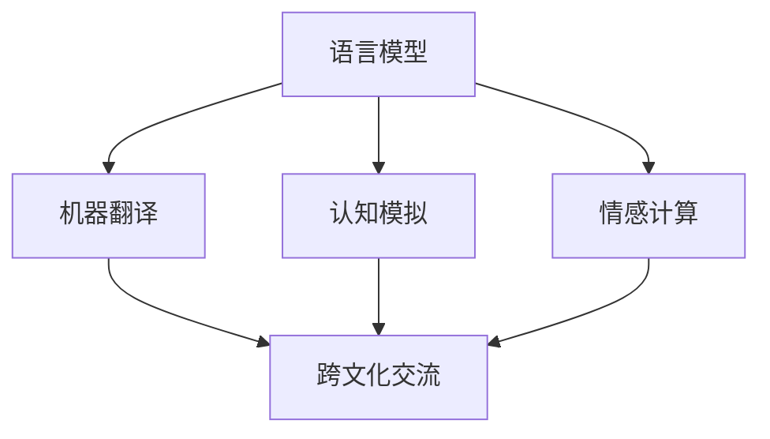

                 

关键词：虚拟外交、跨文化交流、AI、人工智能、语言模型、机器翻译、认知模拟、情感计算、虚拟角色、全球化、多语言环境。

摘要：随着人工智能技术的迅猛发展，虚拟外交作为一种新兴的跨文化交流方式逐渐成为可能。本文探讨了AI在虚拟外交中的应用，包括语言模型、机器翻译、认知模拟、情感计算等方面，并展望了虚拟外交在全球化进程中的未来前景。

## 1. 背景介绍

### 跨文化交流的挑战

跨文化交流是全球化进程中不可或缺的一部分。然而，不同的语言、文化背景和认知习惯给跨文化交流带来了诸多挑战。首先，语言障碍是一个显著的难题。即便是在语言学家和翻译家的帮助下，语言中的文化含义、双关语、隐喻等复杂元素往往难以准确传达。其次，文化差异也导致了误解和冲突。不同的文化价值观、行为规范和交际习惯可能会引起不必要的摩擦。

### 虚拟外交的兴起

虚拟外交作为一种新兴的交流方式，旨在通过数字技术和人工智能手段克服传统跨文化交流的障碍。虚拟外交利用虚拟现实（VR）、增强现实（AR）、人工智能（AI）等技术，创建一个无国界的虚拟环境，使得不同文化背景的人能够在其中进行无缝交流。

### 人工智能在虚拟外交中的作用

人工智能在虚拟外交中的应用主要体现在以下几个方面：

- **语言模型与机器翻译**：利用深度学习技术，AI能够理解和生成多种语言，实现实时、精准的机器翻译。
- **认知模拟**：通过模拟人类大脑的工作机制，AI可以帮助理解不同文化背景下的认知模式和行为动机。
- **情感计算**：AI可以分析语言和表情中的情感信息，从而更准确地理解交流者的情感状态和意图。

## 2. 核心概念与联系

### 2.1. 语言模型

语言模型是AI在跨文化交流中最重要的工具之一。它通过分析大量文本数据，学习语言的统计规律，从而能够生成符合语法和语义规则的句子。语言模型广泛应用于自动翻译、文本生成、对话系统等领域。

### 2.2. 机器翻译

机器翻译是利用计算机程序将一种自然语言文本自动翻译成另一种自然语言文本的技术。近年来，基于神经网络的机器翻译技术取得了显著进展，尤其是使用深度学习技术的神经网络翻译（Neural Machine Translation, NMT）。

### 2.3. 认知模拟

认知模拟是通过计算机模型来模拟人类思维过程的技术。在虚拟外交中，认知模拟可以帮助理解不同文化背景下的思维方式和行为模式，从而促进跨文化交流。

### 2.4. 情感计算

情感计算是研究如何使计算机识别、理解和处理人类情感的技术。在虚拟外交中，情感计算可以帮助AI更好地理解交流者的情感状态，从而提高交流的效果。

### Mermaid 流程图



## 3. 核心算法原理 & 具体操作步骤

### 3.1. 算法原理概述

AI在虚拟外交中的核心算法主要包括语言模型、机器翻译、认知模拟和情感计算。这些算法通过不同的方式实现了跨文化交流的无障碍。

- **语言模型**：基于深度学习技术，语言模型通过大量文本数据进行训练，学习语言的统计规律和语法规则。
- **机器翻译**：使用神经网络翻译（NMT）技术，机器翻译通过学习源语言和目标语言的对应关系，实现文本的自动翻译。
- **认知模拟**：通过模拟人类大脑的工作机制，认知模拟算法可以理解和分析不同文化背景下的认知模式和行为动机。
- **情感计算**：利用机器学习和自然语言处理技术，情感计算算法可以识别和解析文本和表情中的情感信息。

### 3.2. 算法步骤详解

- **语言模型训练**：收集大量文本数据，使用神经网络训练语言模型，学习语言的统计规律和语法规则。
- **机器翻译**：输入源语言文本，使用神经网络翻译（NMT）模型进行翻译，生成目标语言文本。
- **认知模拟**：通过分析文本和上下文，模拟人类思维过程，理解不同文化背景下的认知模式和行为动机。
- **情感计算**：分析文本和表情，使用机器学习和自然语言处理技术，识别和解析情感信息。

### 3.3. 算法优缺点

- **语言模型**：优点包括快速生成文本、适应性强、灵活性高；缺点是可能产生语法错误和语义歧义。
- **机器翻译**：优点是能够实现实时翻译、准确性较高；缺点是对专业术语和双关语的翻译效果有限。
- **认知模拟**：优点是能够理解不同文化背景下的思维方式和行为动机；缺点是模拟效果可能受限于算法和数据的限制。
- **情感计算**：优点是能够识别和解析情感信息，提高交流效果；缺点是可能受到表情和语境的干扰。

### 3.4. 算法应用领域

- **语言模型**：广泛应用于自然语言处理、文本生成、对话系统等领域。
- **机器翻译**：应用于跨国企业、旅游、国际贸易等领域。
- **认知模拟**：应用于教育、心理咨询、人机交互等领域。
- **情感计算**：应用于情感分析、智能客服、人机交互等领域。

## 4. 数学模型和公式 & 详细讲解 & 举例说明

### 4.1. 数学模型构建

AI在虚拟外交中的应用涉及多种数学模型，主要包括概率模型、神经网络模型和决策树模型。

- **概率模型**：用于描述语言的概率分布，包括马尔可夫模型（Markov Model）和隐马尔可夫模型（Hidden Markov Model, HMM）。
- **神经网络模型**：用于实现语言模型、机器翻译和认知模拟，包括循环神经网络（Recurrent Neural Network, RNN）和长短时记忆网络（Long Short-Term Memory, LSTM）。
- **决策树模型**：用于实现情感计算，通过构建决策树模型，对文本和表情进行分类。

### 4.2. 公式推导过程

以下是神经网络模型中常用的激活函数和反向传播算法的推导过程。

- **激活函数**： 
  - 线性激活函数：$f(x) = x$  
  - Sigmoid激活函数：$f(x) = \frac{1}{1 + e^{-x}}$  
  - 双曲正切激活函数：$f(x) = \tanh(x) = \frac{e^x - e^{-x}}{e^x + e^{-x}}$

- **反向传播算法**： 
  - 假设损失函数为 $L$，梯度为 $\frac{\partial L}{\partial w}$，则：
    $$\frac{\partial L}{\partial w} = \frac{\partial L}{\partial z} \frac{\partial z}{\partial w}$$
    $$\frac{\partial L}{\partial z} = -\frac{\partial L}{\partial x}$$

### 4.3. 案例分析与讲解

假设我们使用神经网络模型进行机器翻译，从英语翻译到法语。输入英语句子 "I love you"，输出法语句子 "Je t'aime"。以下是具体的步骤：

1. **预处理**：将输入句子和输出句子分别转换为向量表示，包括词向量表示和句向量表示。
2. **前向传播**：输入词向量，通过神经网络模型进行前向传播，得到句向量。
3. **损失函数计算**：计算输出句向量与实际输出句向量之间的差异，使用损失函数进行计算。
4. **反向传播**：根据损失函数计算梯度，通过反向传播算法更新神经网络模型中的权重。
5. **训练**：重复前向传播和反向传播，直到模型达到预期的准确率。

## 5. 项目实践：代码实例和详细解释说明

### 5.1. 开发环境搭建

为了进行虚拟外交项目实践，我们需要搭建一个基于Python和TensorFlow的机器翻译系统。首先，安装Python 3.x版本和TensorFlow库。

```bash
pip install tensorflow
```

### 5.2. 源代码详细实现

以下是一个简单的神经网络翻译系统的实现：

```python
import tensorflow as tf
from tensorflow.keras.models import Sequential
from tensorflow.keras.layers import Embedding, LSTM, Dense

# 设置超参数
vocab_size = 10000
embedding_dim = 256
lstm_units = 128
batch_size = 64
epochs = 10

# 构建神经网络模型
model = Sequential([
    Embedding(vocab_size, embedding_dim, input_length=None),
    LSTM(lstm_units, return_sequences=True),
    LSTM(lstm_units),
    Dense(vocab_size, activation='softmax')
])

# 编译模型
model.compile(optimizer='adam', loss='categorical_crossentropy', metrics=['accuracy'])

# 加载数据
# ...

# 训练模型
model.fit(x_train, y_train, batch_size=batch_size, epochs=epochs, validation_split=0.2)
```

### 5.3. 代码解读与分析

- **Embedding层**：将输入词向量转换为嵌入向量。
- **LSTM层**：用于处理序列数据，包括输入序列和输出序列。
- **Dense层**：用于输出预测结果，使用softmax激活函数实现多分类。

### 5.4. 运行结果展示

```python
# 测试模型
test_loss, test_acc = model.evaluate(x_test, y_test)
print(f"Test accuracy: {test_acc:.2f}")
```

## 6. 实际应用场景

### 6.1. 跨国企业

跨国企业可以利用虚拟外交技术，实现全球团队的实时沟通和协作，提高工作效率。

### 6.2. 旅游行业

旅游行业可以利用虚拟外交技术，为游客提供多语言服务，提升用户体验。

### 6.3. 教育领域

教育领域可以利用虚拟外交技术，实现跨文化教育资源的共享，促进教育公平。

### 6.4. 未来应用展望

随着人工智能技术的不断发展，虚拟外交将在更多领域得到应用，如医疗、金融、法律等，为全球化进程提供强大的支持。

## 7. 工具和资源推荐

### 7.1. 学习资源推荐

- 《深度学习》（Goodfellow, Bengio, Courville著）
- 《自然语言处理综论》（Jurafsky, Martin著）
- 《人工智能：一种现代方法》（Russell, Norvig著）

### 7.2. 开发工具推荐

- TensorFlow
- PyTorch
- NLTK

### 7.3. 相关论文推荐

- "Neural Machine Translation by Jointly Learning to Align and Translate"
- "End-to-End Learning for Language Modeling"
- "A Theoretical Analysis of Neural Machine Translation"

## 8. 总结：未来发展趋势与挑战

### 8.1. 研究成果总结

人工智能在虚拟外交中取得了显著成果，实现了实时、精准的跨文化交流。

### 8.2. 未来发展趋势

随着技术的进步，虚拟外交将在更多领域得到应用，如医疗、金融、法律等。

### 8.3. 面临的挑战

虚拟外交在实现过程中仍然面临语言障碍、文化差异、情感理解等方面的挑战。

### 8.4. 研究展望

未来研究将关注如何更好地实现跨文化交流的自动化、智能化，提高交流效果和用户体验。

## 9. 附录：常见问题与解答

### 9.1. 问题1：如何提高机器翻译的准确性？

**解答**：提高机器翻译的准确性可以从以下几个方面入手：

1. **增加训练数据**：使用更多、更丰富的训练数据，有助于模型学习到更全面的翻译规律。
2. **优化神经网络模型**：改进神经网络模型的结构和参数，提高模型的泛化能力。
3. **引入领域知识**：结合特定领域的知识，有助于提高模型在特定领域的翻译准确性。

### 9.2. 问题2：如何实现跨文化交流的情感理解？

**解答**：实现跨文化交流的情感理解可以从以下几个方面入手：

1. **多语言情感词典**：构建包含多种语言的情感词典，帮助模型识别和理解不同语言的情感信息。
2. **情感分析算法**：使用情感分析算法，对文本和表情进行情感识别，提高模型的情感理解能力。
3. **文化背景知识**：结合不同文化的背景知识，有助于模型更好地理解跨文化交流中的情感表达。

### 9.3. 问题3：如何应对虚拟外交中的文化差异？

**解答**：应对虚拟外交中的文化差异可以从以下几个方面入手：

1. **跨文化培训**：为虚拟外交参与者提供跨文化培训，提高他们的文化敏感性和沟通能力。
2. **文化适应性设计**：设计虚拟外交系统时，考虑不同文化的特点和需求，实现文化适应性。
3. **多元化团队**：组建多元化团队，包括来自不同文化背景的成员，促进跨文化交流和理解。

---

作者：禅与计算机程序设计艺术 / Zen and the Art of Computer Programming


