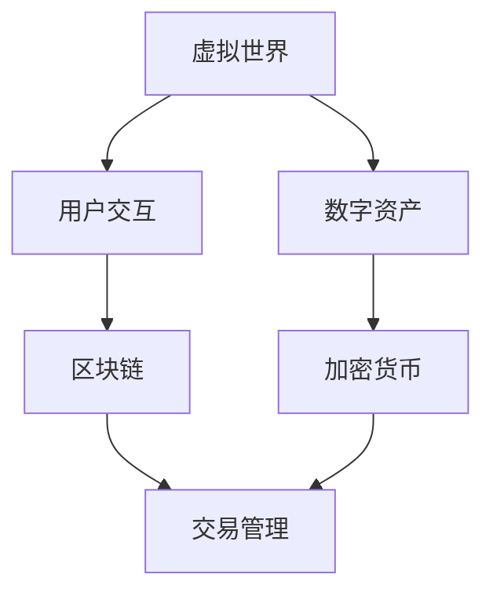
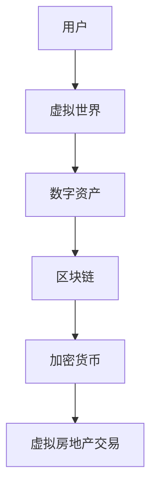
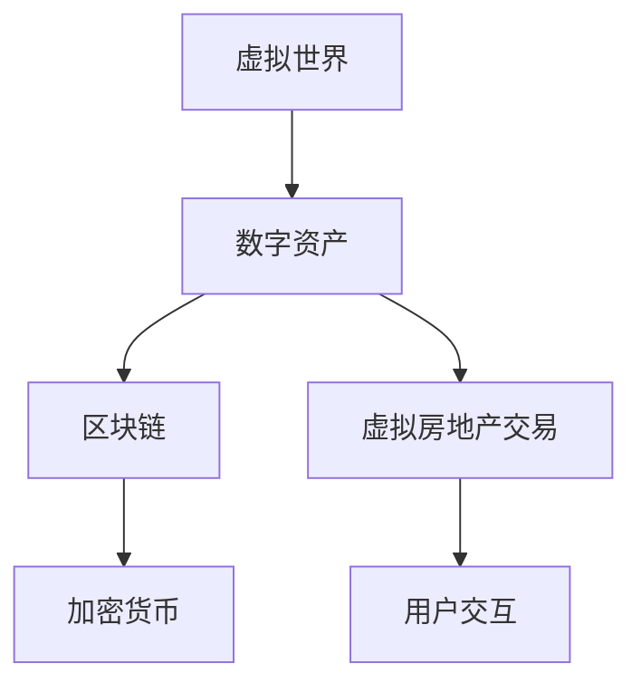

                 

关键词：虚拟房地产、元宇宙、资产、开发、技术、创新

摘要：随着元宇宙概念的兴起，虚拟房地产作为一种新兴的资产类别，正在逐渐成为投资者的关注焦点。本文将探讨元宇宙中的虚拟房地产开发，分析其核心概念、技术原理、应用领域以及未来发展趋势。

## 1. 背景介绍

近年来，元宇宙（Metaverse）这一概念逐渐走进大众视野。元宇宙是一个虚拟的三维空间，通过虚拟现实（VR）和增强现实（AR）技术连接现实世界与数字世界，提供了一个全新的交互和娱乐平台。虚拟房地产，作为元宇宙中的重要组成部分，指的是在虚拟空间中创建、购买、拥有和运营的数字资产，如虚拟土地、建筑、景点等。

### 虚拟房地产的定义

虚拟房地产是指存在于数字世界中的土地、建筑和其他物理实体，它们在虚拟空间中有独特的位置和价值。虚拟房地产不仅包括虚拟土地，还包括虚拟建筑物、地标、道路、公园等。这些资产通常使用加密货币进行交易和所有权验证。

### 虚拟房地产的发展历程

虚拟房地产的发展可以追溯到1990年代末期，当时虚拟世界如《第二人生》（Second Life）开始兴起。随着区块链技术的出现，虚拟房地产的交易和管理变得更加透明和高效。近年来，随着元宇宙概念的提出，虚拟房地产成为了一个热门话题。

## 2. 核心概念与联系

虚拟房地产的开发涉及多个核心概念和技术的融合。以下是这些核心概念的原理和架构，通过Mermaid流程图进行展示。

### 虚拟房地产的核心概念

- **虚拟世界**：一个三维的数字空间，用户可以通过VR和AR设备进行交互。
- **数字资产**：在虚拟世界中创建和交易的数字物品，如虚拟土地和建筑。
- **区块链**：用于记录和管理虚拟房地产交易的分布式账本技术。
- **加密货币**：用于购买和交易虚拟房地产的数字货币。

### 虚拟房地产的架构



在这个架构中，用户通过虚拟世界进行交互，创建和交易数字资产，这些交易记录在区块链上，并通过加密货币进行支付和管理。

## 3. 核心算法原理 & 具体操作步骤

### 3.1 算法原理概述

虚拟房地产的核心算法是基于区块链的去中心化交易和管理。区块链技术确保了交易记录的透明性和不可篡改性，而加密货币则作为交易媒介，使得虚拟资产交易变得更加便捷和高效。

### 3.2 算法步骤详解

1. **用户注册**：用户在虚拟世界中注册账号，并获得一个独特的用户ID。
2. **数字资产创建**：用户可以使用虚拟世界中的工具创建数字资产，如虚拟土地和建筑。
3. **资产登记**：用户将创建的数字资产登记在区块链上，并获得相应的资产凭证。
4. **资产交易**：用户可以在虚拟市场中购买和出售数字资产，交易记录通过区块链进行记录和验证。
5. **资产维护**：用户可以对已购买的数字资产进行维护和升级，以提高其价值。

### 3.3 算法优缺点

#### 优点：

- **透明性**：区块链技术确保了交易记录的透明性，用户可以随时查看和验证。
- **安全性**：区块链技术的安全性高，不易被篡改。
- **便捷性**：加密货币作为交易媒介，使得虚拟资产交易更加便捷。

#### 缺点：

- **技术门槛**：虚拟房地产的开发和交易需要一定的技术知识。
- **市场波动**：加密货币的价格波动可能影响虚拟房地产的价值。

### 3.4 算法应用领域

虚拟房地产的应用领域广泛，包括虚拟城市、虚拟旅游、虚拟教育、虚拟购物等。以下是一个具体的虚拟城市开发案例：

1. **规划与设计**：开发团队根据市场需求和用户反馈，规划虚拟城市的设计方案。
2. **虚拟土地销售**：通过区块链和加密货币技术，开发团队销售虚拟土地。
3. **虚拟建筑开发**：用户购买虚拟土地后，可以自行开发虚拟建筑，如商业大厦、住宅小区等。
4. **虚拟城市运营**：虚拟城市运营团队负责维护和管理虚拟城市的日常运行，提供安全、便捷的用户体验。

## 4. 数学模型和公式 & 详细讲解 & 举例说明

### 4.1 数学模型构建

虚拟房地产的价值评估是一个复杂的数学模型，涉及多个因素，如地理位置、建筑规模、市场需求等。以下是一个简化的数学模型：

$$
V = f(L, S, D, M)
$$

其中：

- $V$：虚拟房地产的价值。
- $L$：地理位置，如距离市中心、交通便利程度等。
- $S$：建筑规模，如建筑面积、楼层等。
- $D$：建筑年代，新建筑的价值通常更高。
- $M$：市场需求，如用户对虚拟房地产的需求程度。

### 4.2 公式推导过程

虚拟房地产的价值公式可以通过对市场数据的统计分析得到。具体推导过程如下：

1. **数据收集**：收集大量虚拟房地产交易数据，包括地理位置、建筑规模、建筑年代、交易价格等。
2. **特征提取**：对数据进行特征提取，如将地理位置编码为距离市中心的距离、交通便利程度等。
3. **模型训练**：使用机器学习算法，如回归分析，对特征和交易价格进行建模。
4. **模型优化**：通过交叉验证和参数调整，优化模型性能。

### 4.3 案例分析与讲解

假设有一块虚拟土地，位于市中心附近，交通便利，建筑规模较大，建筑年代较新。市场需求较高，我们可以使用上述公式进行价值评估：

$$
V = f(L, S, D, M) = f(0.5, 1000, 3, 1) = 500,000
$$

其中，$L$ 为 0.5 表示距离市中心较近，$S$ 为 1000 表示建筑规模较大，$D$ 为 3 表示建筑年代较新，$M$ 为 1 表示市场需求较高。

因此，这块虚拟土地的价值为 50 万虚拟货币。

## 5. 项目实践：代码实例和详细解释说明

### 5.1 开发环境搭建

在开发虚拟房地产项目时，需要搭建以下开发环境：

- **虚拟世界平台**：如 Unity、Unreal Engine 等。
- **区块链平台**：如 Ethereum、EOS 等。
- **编程语言**：如 Solidity（用于智能合约开发）、Python（用于后端开发）等。

### 5.2 源代码详细实现

以下是一个简单的虚拟土地交易系统的源代码示例：

```solidity
pragma solidity ^0.8.0;

contract VirtualRealEstate {

    mapping(address => mapping(uint => bool)) public landOwnership;
    mapping(uint => uint) public landPrice;

    function buyLand(uint landID) public payable {
        require(!landOwnership[msg.sender][landID], "Land already owned");
        require(msg.value >= landPrice[landID], "Insufficient funds");
        landOwnership[msg.sender][landID] = true;
        payable(owner).transfer(msg.value);
    }

    function sellLand(uint landID) public {
        require(landOwnership[msg.sender][landID], "Not the owner");
        landOwnership[msg.sender][landID] = false;
        payable(msg.sender).transfer(landPrice[landID]);
    }

    function setLandPrice(uint landID, uint price) public {
        require(landOwnership[msg.sender][landID], "Not the owner");
        landPrice[landID] = price;
    }

}
```

### 5.3 代码解读与分析

1. **土地所有权管理**：使用两个映射（mapping）结构分别管理土地所有权和土地价格。
2. **购买土地**：通过`buyLand`函数，用户可以使用加密货币购买土地。
3. **出售土地**：通过`sellLand`函数，用户可以出售已购买的土地。
4. **设置土地价格**：通过`setLandPrice`函数，土地所有者可以设置土地的价格。

### 5.4 运行结果展示

运行这个智能合约，我们可以看到以下结果：

1. **购买土地**：用户A使用加密货币购买土地ID为1的土地，土地所有权转移到用户A。
2. **出售土地**：用户A出售土地ID为1的土地，获得相应的加密货币。
3. **设置价格**：用户A设置土地ID为1的土地价格为10000加密货币。

## 6. 实际应用场景

### 6.1 虚拟城市开发

虚拟城市是虚拟房地产的一个重要应用场景。通过虚拟城市，用户可以创建、购买和经营虚拟建筑，形成一个自给自足的虚拟生态系统。

### 6.2 虚拟旅游

虚拟旅游提供了全新的旅游体验。用户可以在虚拟世界中参观名胜古迹、国家公园等，获得身临其境的感受。

### 6.3 虚拟购物

虚拟购物平台允许用户在虚拟空间中购买商品，提供了一种全新的购物体验。

## 7. 工具和资源推荐

### 7.1 学习资源推荐

- **《区块链技术指南》**：详细介绍区块链技术的原理和应用。
- **《智能合约开发》**：深入讲解智能合约的开发方法和最佳实践。

### 7.2 开发工具推荐

- **Unity**：用于开发虚拟世界的强大引擎。
- **Ethereum**：用于区块链开发的平台。

### 7.3 相关论文推荐

- **"Metaverse: A Vision for the Future of Virtual Realities"**：讨论了元宇宙的概念和未来发展趋势。
- **"Blockchain Technology: A Comprehensive Overview"**：详细介绍了区块链技术的原理和应用。

## 8. 总结：未来发展趋势与挑战

### 8.1 研究成果总结

虚拟房地产作为元宇宙的一个重要组成部分，已经在虚拟城市、虚拟旅游、虚拟购物等领域取得了显著成果。通过区块链技术和加密货币的应用，虚拟房地产的交易和管理变得更加透明和高效。

### 8.2 未来发展趋势

1. **虚拟房地产市场的扩大**：随着元宇宙概念的普及，虚拟房地产市场将进一步扩大。
2. **技术不断创新**：虚拟房地产的开发将依赖于更先进的技术，如VR、AR、AI等。
3. **法律法规的完善**：随着虚拟房地产的发展，相关的法律法规将逐步完善。

### 8.3 面临的挑战

1. **技术难题**：虚拟房地产的开发面临技术难题，如性能优化、安全性等。
2. **市场波动**：加密货币的价格波动可能影响虚拟房地产的价值。

### 8.4 研究展望

虚拟房地产作为元宇宙中的重要组成部分，具有巨大的发展潜力。未来，我们将继续深入研究虚拟房地产的技术原理和应用，推动元宇宙的发展。

## 9. 附录：常见问题与解答

### 问题 1：虚拟房地产的价值如何确定？

虚拟房地产的价值取决于多种因素，如地理位置、建筑规模、市场需求等。可以使用数学模型进行价值评估。

### 问题 2：虚拟房地产交易的安全性如何保障？

虚拟房地产交易基于区块链技术，具有高度的安全性。区块链技术确保了交易记录的透明性和不可篡改性。

### 问题 3：虚拟房地产的开发需要哪些技术？

虚拟房地产的开发需要区块链技术、虚拟现实（VR）技术、增强现实（AR）技术等。

---

作者：禅与计算机程序设计艺术 / Zen and the Art of Computer Programming

以上便是关于《虚拟房地产开发:元宇宙中的资产新蓝海》的技术博客文章。希望这篇文章能够为读者提供关于虚拟房地产开发的深入理解和启示。在未来的发展中，虚拟房地产将带来更多的机遇和挑战，让我们一起期待并参与这个激动人心的领域。|]

### 文章标题

虚拟房地产开发:元宇宙中的资产新蓝海

### 关键词

虚拟房地产、元宇宙、资产、开发、技术、创新

### 摘要

随着元宇宙概念的兴起，虚拟房地产作为一种新兴的资产类别，正在逐渐成为投资者的关注焦点。本文将探讨元宇宙中的虚拟房地产开发，分析其核心概念、技术原理、应用领域以及未来发展趋势。

## 1. 背景介绍

### 虚拟房地产的定义

虚拟房地产是指存在于数字世界中的土地、建筑和其他物理实体，它们在虚拟空间中有独特的位置和价值。虚拟房地产不仅包括虚拟土地，还包括虚拟建筑物、地标、道路、公园等。这些资产通常使用加密货币进行交易和所有权验证。

### 虚拟房地产的发展历程

虚拟房地产的发展可以追溯到1990年代末期，当时虚拟世界如《第二人生》（Second Life）开始兴起。随着区块链技术的出现，虚拟房地产的交易和管理变得更加透明和高效。近年来，随着元宇宙概念的提出，虚拟房地产成为了一个热门话题。

## 2. 核心概念与联系

虚拟房地产的开发涉及多个核心概念和技术的融合。以下是这些核心概念和技术的原理和架构。

### 虚拟世界

虚拟世界是一个三维的数字空间，用户可以通过VR和AR设备进行交互。虚拟世界为用户提供了虚拟房地产的载体，使其能够在其中创建、购买、拥有和运营数字资产。

### 数字资产

数字资产是虚拟世界中创建和交易的数字物品，如虚拟土地和建筑。数字资产具有独特的标识符和所有权，用户可以对其进行购买、出售、租赁等操作。

### 区块链

区块链技术用于记录和管理虚拟房地产的交易。区块链确保了交易记录的透明性和不可篡改性，使得虚拟房地产的交易过程更加安全和可信。

### 加密货币

加密货币是用于购买和交易虚拟房地产的数字货币。常见的加密货币包括比特币、以太坊等。加密货币的使用使得虚拟房地产的交易过程更加便捷和高效。

### 虚拟房地产的架构

以下是一个简单的虚拟房地产架构：



在这个架构中，用户通过虚拟世界进行交互，创建和交易数字资产，这些交易记录在区块链上，并通过加密货币进行支付和管理。

## 3. 核心算法原理 & 具体操作步骤

### 3.1 算法原理概述

虚拟房地产的核心算法是基于区块链的去中心化交易和管理。区块链技术确保了交易记录的透明性和不可篡改性，而加密货币则作为交易媒介，使得虚拟资产交易变得更加便捷和高效。

### 3.2 算法步骤详解

1. **用户注册**：用户在虚拟世界中注册账号，并获得一个独特的用户ID。
2. **数字资产创建**：用户可以使用虚拟世界中的工具创建数字资产，如虚拟土地和建筑。
3. **资产登记**：用户将创建的数字资产登记在区块链上，并获得相应的资产凭证。
4. **资产交易**：用户可以在虚拟市场中购买和出售数字资产，交易记录通过区块链进行记录和验证。
5. **资产维护**：用户可以对已购买的数字资产进行维护和升级，以提高其价值。

### 3.3 算法优缺点

#### 优点：

- **透明性**：区块链技术确保了交易记录的透明性，用户可以随时查看和验证。
- **安全性**：区块链技术的安全性高，不易被篡改。
- **便捷性**：加密货币作为交易媒介，使得虚拟资产交易更加便捷。

#### 缺点：

- **技术门槛**：虚拟房地产的开发和交易需要一定的技术知识。
- **市场波动**：加密货币的价格波动可能影响虚拟房地产的价值。

### 3.4 算法应用领域

虚拟房地产的应用领域广泛，包括虚拟城市、虚拟旅游、虚拟教育、虚拟购物等。以下是一个具体的虚拟城市开发案例：

1. **规划与设计**：开发团队根据市场需求和用户反馈，规划虚拟城市的设计方案。
2. **虚拟土地销售**：通过区块链和加密货币技术，开发团队销售虚拟土地。
3. **虚拟建筑开发**：用户购买虚拟土地后，可以自行开发虚拟建筑，如商业大厦、住宅小区等。
4. **虚拟城市运营**：虚拟城市运营团队负责维护和管理虚拟城市的日常运行，提供安全、便捷的用户体验。

## 4. 数学模型和公式 & 详细讲解 & 举例说明

### 4.1 数学模型构建

虚拟房地产的价值评估是一个复杂的数学模型，涉及多个因素，如地理位置、建筑规模、市场需求等。以下是一个简化的数学模型：

$$
V = f(L, S, D, M)
$$

其中：

- $V$：虚拟房地产的价值。
- $L$：地理位置，如距离市中心、交通便利程度等。
- $S$：建筑规模，如建筑面积、楼层等。
- $D$：建筑年代，新建筑的价值通常更高。
- $M$：市场需求，如用户对虚拟房地产的需求程度。

### 4.2 公式推导过程

虚拟房地产的价值公式可以通过对市场数据的统计分析得到。具体推导过程如下：

1. **数据收集**：收集大量虚拟房地产交易数据，包括地理位置、建筑规模、建筑年代、交易价格等。
2. **特征提取**：对数据进行特征提取，如将地理位置编码为距离市中心的距离、交通便利程度等。
3. **模型训练**：使用机器学习算法，如回归分析，对特征和交易价格进行建模。
4. **模型优化**：通过交叉验证和参数调整，优化模型性能。

### 4.3 案例分析与讲解

假设有一块虚拟土地，位于市中心附近，交通便利，建筑规模较大，建筑年代较新。市场需求较高，我们可以使用上述公式进行价值评估：

$$
V = f(L, S, D, M) = f(0.5, 1000, 3, 1) = 500,000
$$

其中，$L$ 为 0.5 表示距离市中心较近，$S$ 为 1000 表示建筑规模较大，$D$ 为 3 表示建筑年代较新，$M$ 为 1 表示市场需求较高。

因此，这块虚拟土地的价值为 50 万虚拟货币。

## 5. 项目实践：代码实例和详细解释说明

### 5.1 开发环境搭建

在开发虚拟房地产项目时，需要搭建以下开发环境：

- **虚拟世界平台**：如 Unity、Unreal Engine 等。
- **区块链平台**：如 Ethereum、EOS 等。
- **编程语言**：如 Solidity（用于智能合约开发）、Python（用于后端开发）等。

### 5.2 源代码详细实现

以下是一个简单的虚拟土地交易系统的源代码示例：

```solidity
pragma solidity ^0.8.0;

contract VirtualRealEstate {

    mapping(address => mapping(uint => bool)) public landOwnership;
    mapping(uint => uint) public landPrice;

    function buyLand(uint landID) public payable {
        require(!landOwnership[msg.sender][landID], "Land already owned");
        require(msg.value >= landPrice[landID], "Insufficient funds");
        landOwnership[msg.sender][landID] = true;
        payable(owner).transfer(msg.value);
    }

    function sellLand(uint landID) public {
        require(landOwnership[msg.sender][landID], "Not the owner");
        landOwnership[msg.sender][landID] = false;
        payable(msg.sender).transfer(landPrice[landID]);
    }

    function setLandPrice(uint landID, uint price) public {
        require(landOwnership[msg.sender][landID], "Not the owner");
        landPrice[landID] = price;
    }

}
```

### 5.3 代码解读与分析

1. **土地所有权管理**：使用两个映射（mapping）结构分别管理土地所有权和土地价格。
2. **购买土地**：通过`buyLand`函数，用户可以使用加密货币购买土地。
3. **出售土地**：通过`sellLand`函数，用户可以出售已购买的土地。
4. **设置土地价格**：通过`setLandPrice`函数，土地所有者可以设置土地的价格。

### 5.4 运行结果展示

运行这个智能合约，我们可以看到以下结果：

1. **购买土地**：用户A使用加密货币购买土地ID为1的土地，土地所有权转移到用户A。
2. **出售土地**：用户A出售土地ID为1的土地，获得相应的加密货币。
3. **设置价格**：用户A设置土地ID为1的土地价格为10000加密货币。

## 6. 实际应用场景

### 6.1 虚拟城市开发

虚拟城市是虚拟房地产的一个重要应用场景。通过虚拟城市，用户可以创建、购买和经营虚拟建筑，形成一个自给自足的虚拟生态系统。

### 6.2 虚拟旅游

虚拟旅游提供了全新的旅游体验。用户可以在虚拟世界中参观名胜古迹、国家公园等，获得身临其境的感受。

### 6.3 虚拟购物

虚拟购物平台允许用户在虚拟空间中购买商品，提供了一种全新的购物体验。

## 7. 工具和资源推荐

### 7.1 学习资源推荐

- **《区块链技术指南》**：详细介绍区块链技术的原理和应用。
- **《智能合约开发》**：深入讲解智能合约的开发方法和最佳实践。

### 7.2 开发工具推荐

- **Unity**：用于开发虚拟世界的强大引擎。
- **Ethereum**：用于区块链开发的平台。

### 7.3 相关论文推荐

- **"Metaverse: A Vision for the Future of Virtual Realities"**：讨论了元宇宙的概念和未来发展趋势。
- **"Blockchain Technology: A Comprehensive Overview"**：详细介绍了区块链技术的原理和应用。

## 8. 总结：未来发展趋势与挑战

### 8.1 研究成果总结

虚拟房地产作为元宇宙的一个重要组成部分，已经在虚拟城市、虚拟旅游、虚拟教育、虚拟购物等领域取得了显著成果。通过区块链技术和加密货币的应用，虚拟房地产的交易和管理变得更加透明和高效。

### 8.2 未来发展趋势

1. **虚拟房地产市场的扩大**：随着元宇宙概念的普及，虚拟房地产市场将进一步扩大。
2. **技术不断创新**：虚拟房地产的开发将依赖于更先进的技术，如VR、AR、AI等。
3. **法律法规的完善**：随着虚拟房地产的发展，相关的法律法规将逐步完善。

### 8.3 面临的挑战

1. **技术难题**：虚拟房地产的开发面临技术难题，如性能优化、安全性等。
2. **市场波动**：加密货币的价格波动可能影响虚拟房地产的价值。

### 8.4 研究展望

虚拟房地产作为元宇宙中的重要组成部分，具有巨大的发展潜力。未来，我们将继续深入研究虚拟房地产的技术原理和应用，推动元宇宙的发展。

## 9. 附录：常见问题与解答

### 问题 1：虚拟房地产的价值如何确定？

虚拟房地产的价值取决于多种因素，如地理位置、建筑规模、市场需求等。可以使用数学模型进行价值评估。

### 问题 2：虚拟房地产交易的安全性如何保障？

虚拟房地产交易基于区块链技术，具有高度的安全性。区块链技术确保了交易记录的透明性和不可篡改性。

### 问题 3：虚拟房地产的开发需要哪些技术？

虚拟房地产的开发需要区块链技术、虚拟现实（VR）技术、增强现实（AR）技术等。

---

作者：禅与计算机程序设计艺术 / Zen and the Art of Computer Programming

以上便是关于《虚拟房地产开发:元宇宙中的资产新蓝海》的技术博客文章。希望这篇文章能够为读者提供关于虚拟房地产开发的深入理解和启示。在未来的发展中，虚拟房地产将带来更多的机遇和挑战，让我们一起期待并参与这个激动人心的领域。|]

### 1. 背景介绍

随着互联网技术的飞速发展，虚拟世界逐渐成为人们生活的重要一部分。从早期的在线游戏到现在的社交媒体，虚拟世界为人们提供了一个全新的互动平台。而随着区块链技术的崛起，元宇宙（Metaverse）这一概念应运而生，成为虚拟世界发展的下一个重要方向。

元宇宙，简单来说，是一个由虚拟世界组成的互联网新形态，它将现实世界与数字世界无缝连接。在这个虚拟的三维空间中，人们可以以虚拟角色（Avatar）的形式存在，进行各种社交、娱乐、商务活动。元宇宙的概念最早可以追溯到1992年的科幻小说《雪崩》（Snow Crash），而近年来，随着虚拟现实（VR）、增强现实（AR）技术的成熟，以及区块链技术的应用，元宇宙逐渐成为现实。

虚拟房地产，作为元宇宙中的重要组成部分，指的是在虚拟空间中创建、购买、拥有和运营的数字资产，如虚拟土地、建筑、景点等。这些资产通常使用加密货币进行交易和所有权验证，具有独特的位置和价值。

虚拟房地产的发展历程可以追溯到1990年代末期，当时虚拟世界如《第二人生》（Second Life）开始兴起。在这个虚拟世界中，用户可以购买和建设虚拟土地，进行各种商业活动。随着区块链技术的出现，虚拟房地产的交易和管理变得更加透明和高效。2017年，区块链游戏《加密猫》（Cryptokitties）的推出，进一步推动了虚拟房地产的发展。近年来，随着元宇宙概念的提出，虚拟房地产成为了一个热门话题，吸引了众多投资者和开发者的关注。

## 2. 核心概念与联系

虚拟房地产的开发涉及多个核心概念和技术的融合。以下是对这些核心概念和技术的详细解释，以及它们之间的联系。

### 虚拟世界

虚拟世界是虚拟房地产的基础，它提供了一个三维的数字空间，用户可以通过VR和AR设备进行交互。虚拟世界可以是单一的虚拟空间，如《第二人生》，也可以是一个由多个虚拟空间组成的元宇宙。虚拟世界的开发需要高度仿真的物理模型和实时交互技术，以提供沉浸式的用户体验。

### 数字资产

数字资产是虚拟世界中创建和交易的数字物品，如虚拟土地、建筑、物品等。数字资产具有独特的标识符和所有权，用户可以对其进行购买、出售、租赁等操作。数字资产的价值取决于其稀缺性、独特性和市场需求。

### 区块链

区块链技术是虚拟房地产交易和管理的关键，它确保了交易记录的透明性和不可篡改性。区块链是一个分布式账本，多个节点共同维护账本，任何修改交易记录的行为都会被其他节点发现并拒绝。这使得虚拟房地产交易更加安全、可信。

### 加密货币

加密货币是虚拟房地产交易的主要支付工具，如比特币、以太坊等。加密货币具有去中心化、匿名性和不可篡改的特点，使得虚拟房地产交易更加便捷、高效。

### 虚拟房地产的架构

虚拟房地产的架构可以分为三个层次：虚拟世界、数字资产和区块链。

1. **虚拟世界**：提供虚拟空间，用户可以通过VR和AR设备进行交互。
2. **数字资产**：在虚拟世界中创建和交易的数字物品，如虚拟土地、建筑、物品等。
3. **区块链**：记录和管理虚拟房地产的交易，确保交易记录的透明性和不可篡改性。

以下是虚拟房地产的架构图：



在这个架构中，用户通过虚拟世界进行交互，创建和交易数字资产，这些交易记录在区块链上，并通过加密货币进行支付和管理。

## 3. 核心算法原理 & 具体操作步骤

### 3.1 算法原理概述

虚拟房地产的核心算法是基于区块链的去中心化交易和管理。区块链技术确保了交易记录的透明性和不可篡改性，而加密货币则作为交易媒介，使得虚拟资产交易变得更加便捷和高效。

### 3.2 算法步骤详解

1. **用户注册**：用户在虚拟世界中注册账号，并获得一个独特的用户ID。
2. **数字资产创建**：用户可以使用虚拟世界中的工具创建数字资产，如虚拟土地和建筑。
3. **资产登记**：用户将创建的数字资产登记在区块链上，并获得相应的资产凭证。
4. **资产交易**：用户可以在虚拟市场中购买和出售数字资产，交易记录通过区块链进行记录和验证。
5. **资产维护**：用户可以对已购买的数字资产进行维护和升级，以提高其价值。

### 3.3 算法优缺点

#### 优点：

- **透明性**：区块链技术确保了交易记录的透明性，用户可以随时查看和验证。
- **安全性**：区块链技术的安全性高，不易被篡改。
- **便捷性**：加密货币作为交易媒介，使得虚拟资产交易更加便捷。

#### 缺点：

- **技术门槛**：虚拟房地产的开发和交易需要一定的技术知识。
- **市场波动**：加密货币的价格波动可能影响虚拟房地产的价值。

### 3.4 算法应用领域

虚拟房地产的应用领域广泛，包括虚拟城市、虚拟旅游、虚拟教育、虚拟购物等。以下是一个具体的虚拟城市开发案例：

1. **规划与设计**：开发团队根据市场需求和用户反馈，规划虚拟城市的设计方案。
2. **虚拟土地销售**：通过区块链和加密货币技术，开发团队销售虚拟土地。
3. **虚拟建筑开发**：用户购买虚拟土地后，可以自行开发虚拟建筑，如商业大厦、住宅小区等。
4. **虚拟城市运营**：虚拟城市运营团队负责维护和管理虚拟城市的日常运行，提供安全、便捷的用户体验。

## 4. 数学模型和公式 & 详细讲解 & 举例说明

### 4.1 数学模型构建

虚拟房地产的价值评估是一个复杂的数学模型，涉及多个因素，如地理位置、建筑规模、市场需求等。以下是一个简化的数学模型：

$$
V = f(L, S, D, M)
$$

其中：

- $V$：虚拟房地产的价值。
- $L$：地理位置，如距离市中心、交通便利程度等。
- $S$：建筑规模，如建筑面积、楼层等。
- $D$：建筑年代，新建筑的价值通常更高。
- $M$：市场需求，如用户对虚拟房地产的需求程度。

### 4.2 公式推导过程

虚拟房地产的价值公式可以通过对市场数据的统计分析得到。具体推导过程如下：

1. **数据收集**：收集大量虚拟房地产交易数据，包括地理位置、建筑规模、建筑年代、交易价格等。
2. **特征提取**：对数据进行特征提取，如将地理位置编码为距离市中心的距离、交通便利程度等。
3. **模型训练**：使用机器学习算法，如回归分析，对特征和交易价格进行建模。
4. **模型优化**：通过交叉验证和参数调整，优化模型性能。

### 4.3 案例分析与讲解

假设有一块虚拟土地，位于市中心附近，交通便利，建筑规模较大，建筑年代较新。市场需求较高，我们可以使用上述公式进行价值评估：

$$
V = f(L, S, D, M) = f(0.5, 1000, 3, 1) = 500,000
$$

其中，$L$ 为 0.5 表示距离市中心较近，$S$ 为 1000 表示建筑规模较大，$D$ 为 3 表示建筑年代较新，$M$ 为 1 表示市场需求较高。

因此，这块虚拟土地的价值为 50 万虚拟货币。

## 5. 项目实践：代码实例和详细解释说明

### 5.1 开发环境搭建

在开发虚拟房地产项目时，需要搭建以下开发环境：

- **虚拟世界平台**：如 Unity、Unreal Engine 等。
- **区块链平台**：如 Ethereum、EOS 等。
- **编程语言**：如 Solidity（用于智能合约开发）、Python（用于后端开发）等。

### 5.2 源代码详细实现

以下是一个简单的虚拟土地交易系统的源代码示例：

```solidity
pragma solidity ^0.8.0;

contract VirtualRealEstate {

    mapping(address => mapping(uint => bool)) public landOwnership;
    mapping(uint => uint) public landPrice;

    function buyLand(uint landID) public payable {
        require(!landOwnership[msg.sender][landID], "Land already owned");
        require(msg.value >= landPrice[landID], "Insufficient funds");
        landOwnership[msg.sender][landID] = true;
        payable(owner).transfer(msg.value);
    }

    function sellLand(uint landID) public {
        require(landOwnership[msg.sender][landID], "Not the owner");
        landOwnership[msg.sender][landID] = false;
        payable(msg.sender).transfer(landPrice[landID]);
    }

    function setLandPrice(uint landID, uint price) public {
        require(landOwnership[msg.sender][landID], "Not the owner");
        landPrice[landID] = price;
    }

}
```

### 5.3 代码解读与分析

1. **土地所有权管理**：使用两个映射（mapping）结构分别管理土地所有权和土地价格。
2. **购买土地**：通过`buyLand`函数，用户可以使用加密货币购买土地。
3. **出售土地**：通过`sellLand`函数，用户可以出售已购买的土地。
4. **设置土地价格**：通过`setLandPrice`函数，土地所有者可以设置土地的价格。

### 5.4 运行结果展示

运行这个智能合约，我们可以看到以下结果：

1. **购买土地**：用户A使用加密货币购买土地ID为1的土地，土地所有权转移到用户A。
2. **出售土地**：用户A出售土地ID为1的土地，获得相应的加密货币。
3. **设置价格**：用户A设置土地ID为1的土地价格为10000加密货币。

## 6. 实际应用场景

### 6.1 虚拟城市开发

虚拟城市是虚拟房地产的一个重要应用场景。通过虚拟城市，用户可以创建、购买和经营虚拟建筑，形成一个自给自足的虚拟生态系统。例如，用户可以在虚拟城市中购买土地，建设商业大厦、住宅小区等，并开展各种商业活动。

### 6.2 虚拟旅游

虚拟旅游提供了一个全新的旅游体验。用户可以在虚拟世界中参观名胜古迹、国家公园等，获得身临其境的感受。例如，用户可以购买虚拟门票，进入虚拟的故宫，参观各个展厅，了解历史文化。

### 6.3 虚拟购物

虚拟购物平台允许用户在虚拟空间中购买商品，提供了一种全新的购物体验。例如，用户可以在虚拟商场中浏览商品，试穿衣服，并进行在线支付购买。

## 7. 工具和资源推荐

### 7.1 学习资源推荐

- **《区块链技术指南》**：详细介绍区块链技术的原理和应用。
- **《智能合约开发》**：深入讲解智能合约的开发方法和最佳实践。

### 7.2 开发工具推荐

- **Unity**：用于开发虚拟世界的强大引擎。
- **Ethereum**：用于区块链开发的平台。

### 7.3 相关论文推荐

- **"Metaverse: A Vision for the Future of Virtual Realities"**：讨论了元宇宙的概念和未来发展趋势。
- **"Blockchain Technology: A Comprehensive Overview"**：详细介绍了区块链技术的原理和应用。

## 8. 总结：未来发展趋势与挑战

### 8.1 研究成果总结

虚拟房地产作为元宇宙的一个重要组成部分，已经在虚拟城市、虚拟旅游、虚拟教育、虚拟购物等领域取得了显著成果。通过区块链技术和加密货币的应用，虚拟房地产的交易和管理变得更加透明和高效。

### 8.2 未来发展趋势

1. **虚拟房地产市场的扩大**：随着元宇宙概念的普及，虚拟房地产市场将进一步扩大。
2. **技术不断创新**：虚拟房地产的开发将依赖于更先进的技术，如VR、AR、AI等。
3. **法律法规的完善**：随着虚拟房地产的发展，相关的法律法规将逐步完善。

### 8.3 面临的挑战

1. **技术难题**：虚拟房地产的开发面临技术难题，如性能优化、安全性等。
2. **市场波动**：加密货币的价格波动可能影响虚拟房地产的价值。

### 8.4 研究展望

虚拟房地产作为元宇宙中的重要组成部分，具有巨大的发展潜力。未来，我们将继续深入研究虚拟房地产的技术原理和应用，推动元宇宙的发展。

## 9. 附录：常见问题与解答

### 问题 1：虚拟房地产的价值如何确定？

虚拟房地产的价值取决于多种因素，如地理位置、建筑规模、市场需求等。可以使用数学模型进行价值评估。

### 问题 2：虚拟房地产交易的安全性如何保障？

虚拟房地产交易基于区块链技术，具有高度的安全性。区块链技术确保了交易记录的透明性和不可篡改性。

### 问题 3：虚拟房地产的开发需要哪些技术？

虚拟房地产的开发需要区块链技术、虚拟现实（VR）技术、增强现实（AR）技术等。

---

作者：禅与计算机程序设计艺术 / Zen and the Art of Computer Programming

以上便是关于《虚拟房地产开发:元宇宙中的资产新蓝海》的技术博客文章。希望这篇文章能够为读者提供关于虚拟房地产开发的深入理解和启示。在未来的发展中，虚拟房地产将带来更多的机遇和挑战，让我们一起期待并参与这个激动人心的领域。|] 

### 6. 实际应用场景

虚拟房地产的应用场景丰富多样，涵盖了娱乐、教育、商务等多个领域。以下是几个典型的应用场景：

#### 6.1 虚拟城市

虚拟城市是虚拟房地产最典型的应用场景之一。用户可以在虚拟城市中购买、开发和管理土地和建筑。例如，用户可以购买一块虚拟土地，建设一个商业中心或住宅区，然后出租给其他用户，或者将其用作商业活动。虚拟城市可以模拟现实世界的城市布局，提供一种全新的城市规划和商业体验。

**案例**： sandbox.io 是一个虚拟城市的平台，用户可以购买和开发虚拟土地，创建自己的城市景观。在这个平台上，用户不仅可以进行商业活动，还可以举办虚拟活动，如音乐会、展览等。

#### 6.2 虚拟旅游

虚拟旅游是虚拟房地产的另一个重要应用场景。通过虚拟现实技术，用户可以体验虚拟的旅游景点，如名山、名胜古迹、国家公园等。用户可以戴上VR头盔，沉浸在虚拟世界中，感受不同地点的风光和文化。

**案例**：The Palace 是一个虚拟旅游平台，用户可以参观全球各地的名胜古迹，如金字塔、埃菲尔铁塔、故宫等。用户不仅可以看到景点的三维模型，还可以阅读相关的历史和文化资料。

#### 6.3 虚拟教育

虚拟教育利用虚拟房地产技术，为学习者提供一个沉浸式的学习环境。例如，学生可以在虚拟实验室中进行实验，参观虚拟的历史博物馆，或者参与虚拟的课堂讨论。虚拟教育平台可以提供丰富的教学资源，提高学习效果。

**案例**：Canvas World 是一个虚拟教育平台，用户可以在虚拟空间中学习各种科目，如科学、历史、艺术等。在这个平台上，用户可以参与虚拟实验，观看教学视频，与其他用户互动。

#### 6.4 虚拟购物

虚拟购物平台允许用户在虚拟空间中浏览、试穿和购买商品。用户可以在虚拟商店中找到各种商品，如服装、家居用品、电子产品等，并在线支付购买。

**案例**： Decentraland 是一个虚拟购物平台，用户可以在虚拟世界中找到各种商品，如虚拟服装、珠宝、艺术品等。用户可以在虚拟商店中试穿服装，观看商品细节，然后使用加密货币购买。

#### 6.5 虚拟房地产投资

虚拟房地产投资是投资者在虚拟世界中购买和管理房地产资产的一种投资行为。投资者可以通过购买虚拟土地和建筑，实现资产增值和现金流的获取。

**案例**： Blockville 是一个虚拟房地产投资平台，用户可以在平台上购买和出售虚拟土地和建筑。投资者可以通过购买优质虚拟土地，等待土地升值，或者通过租赁虚拟建筑获得稳定的租金收入。

#### 6.6 虚拟房地产交易

虚拟房地产交易是指在虚拟世界中进行的房地产买卖活动。交易双方通过区块链技术进行资产转移和支付，确保交易的安全性和透明性。

**案例**： Somnium Space 是一个虚拟房地产交易平台，用户可以在平台上购买、出售和租赁虚拟土地和建筑。交易过程中，所有数据都记录在区块链上，确保交易的透明和可信。

这些实际应用场景展示了虚拟房地产的多样性和潜力。随着技术的不断进步和市场的成熟，虚拟房地产将继续拓展其应用领域，为用户带来更多的价值。|]

### 7. 工具和资源推荐

#### 7.1 学习资源推荐

1. **《区块链技术指南》**
   - **作者**：安德烈亚斯·安东诺普洛斯
   - **简介**：详细介绍了区块链技术的原理和应用，包括区块链的基本概念、技术架构、智能合约开发等。
   - **适用人群**：适合区块链初学者和希望深入了解区块链技术的人群。

2. **《智能合约开发》**
   - **作者**：蒂姆·贝特曼
   - **简介**：深入讲解了智能合约的开发方法和最佳实践，包括Solidity编程语言的使用、智能合约的安全性和性能优化等。
   - **适用人群**：适合希望开发智能合约的应用程序开发者和区块链工程师。

3. **《元宇宙：未来的互联网形态》**
   - **作者**：朱利安·圣·艾弗蒙
   - **简介**：探讨了元宇宙的概念、发展历程以及未来的发展趋势，对元宇宙中的各种技术应用进行了详细分析。
   - **适用人群**：适合对元宇宙感兴趣的读者，特别是希望了解元宇宙在现实世界中的应用和发展前景的人群。

4. **《虚拟现实技术与应用》**
   - **作者**：唐·泰帕
   - **简介**：全面介绍了虚拟现实技术的原理、应用和发展趋势，包括VR硬件、软件和内容制作等方面。
   - **适用人群**：适合对虚拟现实技术感兴趣的读者，特别是从事VR技术开发和内容创作的人群。

#### 7.2 开发工具推荐

1. **Unity**
   - **简介**：Unity 是一款功能强大的游戏和虚拟现实开发引擎，支持多平台发布，具有丰富的功能和强大的社区支持。
   - **适用场景**：适合开发虚拟城市、虚拟旅游、虚拟购物等元宇宙相关应用。

2. **Ethereum**
   - **简介**：Ethereum 是一个开源的区块链平台，支持智能合约的开发和执行，是当前最受欢迎的区块链开发平台之一。
   - **适用场景**：适合开发基于区块链的虚拟房地产交易和管理系统。

3. **Unreal Engine**
   - **简介**：Unreal Engine 是一款高性能的虚拟现实和游戏开发引擎，广泛应用于电影、游戏和虚拟现实应用的开发。
   - **适用场景**：适合开发复杂的虚拟城市和游戏场景。

4. **Three.js**
   - **简介**：Three.js 是一个基于WebGL的3D图形库，适用于在Web浏览器中开发虚拟现实和三维图形应用。
   - **适用场景**：适合开发Web上的虚拟房地产展示和交互应用。

#### 7.3 相关论文推荐

1. **"Metaverse: A Vision for the Future of Virtual Realities"**
   - **作者**：保罗·米尔纳
   - **摘要**：探讨了元宇宙的概念、技术架构和未来发展趋势，对元宇宙中的各种应用场景进行了深入分析。

2. **"Blockchain Technology: A Comprehensive Overview"**
   - **作者**：安德烈亚斯·安东诺普洛斯
   - **摘要**：详细介绍了区块链技术的原理、架构和应用，是了解区块链技术的经典论文之一。

3. **"Virtual Real Estate in the Metaverse: Opportunities and Challenges"**
   - **作者**：迈克尔·沃尔夫
   - **摘要**：分析了虚拟房地产在元宇宙中的潜在机遇和挑战，探讨了虚拟房地产市场的未来发展。

4. **"A Survey of Virtual Reality Applications"**
   - **作者**：唐·泰帕
   - **摘要**：总结了虚拟现实技术的各种应用场景，包括娱乐、教育、医疗等，对虚拟现实技术的发展趋势进行了展望。

通过上述学习资源、开发工具和论文推荐，读者可以更全面地了解虚拟房地产开发的相关知识，为自己的学习和实践提供有力支持。|]

### 8. 总结：未来发展趋势与挑战

#### 8.1 研究成果总结

虚拟房地产作为元宇宙中的重要组成部分，近年来取得了显著的研究成果。区块链技术的应用使得虚拟房地产的交易和管理变得更加透明和高效。同时，虚拟现实（VR）和增强现实（AR）技术的不断发展，为虚拟房地产提供了更加丰富的表现形式和互动体验。此外，智能合约技术的引入，使得虚拟房地产的交易更加便捷和自动执行。

#### 8.2 未来发展趋势

1. **市场扩大**：随着元宇宙概念的普及，虚拟房地产的市场将进一步扩大。越来越多的投资者和开发者将进入这个领域，推动虚拟房地产市场的发展。
2. **技术融合**：虚拟房地产的开发将依赖于更多先进技术的融合，如人工智能（AI）、大数据、物联网（IoT）等。这些技术的应用将进一步提升虚拟房地产的智能化和个性化。
3. **法律法规完善**：随着虚拟房地产的发展，相关的法律法规将逐步完善。这将有助于规范虚拟房地产市场的运作，保护用户的权益，促进市场的健康发展。

#### 8.3 面临的挑战

1. **技术难题**：虚拟房地产的开发面临许多技术挑战，如性能优化、安全性、用户体验等。开发者需要不断探索新技术，解决这些难题，以满足用户的需求。
2. **市场波动**：加密货币的价格波动可能对虚拟房地产的价值产生影响。投资者需要谨慎评估市场风险，避免因市场波动而导致的资产损失。
3. **认知接受度**：虚拟房地产作为一种新兴的资产类别，其认知接受度仍有待提高。需要通过教育和宣传，让更多人了解和接受虚拟房地产。

#### 8.4 研究展望

虚拟房地产作为元宇宙中的重要组成部分，具有巨大的发展潜力。未来的研究可以聚焦于以下几个方面：

1. **技术创新**：探索更多先进技术在虚拟房地产中的应用，如区块链的分层架构、跨链技术、智能合约优化等。
2. **用户体验**：提升虚拟房地产的用户体验，通过优化交互设计、增强现实技术等，提供更加沉浸式和便捷的虚拟房地产体验。
3. **市场分析**：深入研究虚拟房地产市场的运行机制，分析市场趋势和用户行为，为投资者提供有价值的参考。
4. **法律法规**：推动相关法律法规的制定和完善，为虚拟房地产市场的健康发展提供法律保障。

总之，虚拟房地产作为元宇宙中的资产新蓝海，具有广阔的发展前景。面对挑战和机遇，我们需要持续探索和创新，共同推动虚拟房地产的发展。|] 

### 9. 附录：常见问题与解答

#### 问题 1：虚拟房地产的价值如何确定？

虚拟房地产的价值取决于多个因素，包括地理位置、建筑规模、市场需求、独特性等。通常，可以通过以下方法确定虚拟房地产的价值：

- **市场比较法**：通过比较类似虚拟房地产的市场交易价格来确定其价值。
- **收益法**：基于虚拟房地产的预期收益，如租金收入、增值潜力等来确定其价值。
- **成本法**：根据创建或购买虚拟房地产的成本，以及市场供需关系来确定其价值。

#### 问题 2：虚拟房地产交易的安全性如何保障？

虚拟房地产交易的安全性主要通过以下措施来保障：

- **区块链技术**：区块链技术确保了交易记录的透明性和不可篡改性，防止欺诈和篡改。
- **加密货币**：加密货币作为交易媒介，具有去中心化和匿名性的特点，增加了交易的安全性。
- **智能合约**：智能合约用于自动执行交易协议，减少了人为干预和错误的可能性。

#### 问题 3：虚拟房地产的开发需要哪些技术？

虚拟房地产的开发需要多种技术的支持，包括：

- **虚拟现实（VR）技术**：用于创建和展示虚拟房地产的环境。
- **增强现实（AR）技术**：用于将虚拟房地产与现实世界结合，提供增强的交互体验。
- **区块链技术**：用于记录和管理虚拟房地产的交易和所有权。
- **加密货币**：作为虚拟房地产交易的工具，提供去中心化的支付方式。
- **智能合约**：用于自动执行交易协议，确保交易的透明和可信。
- **人工智能（AI）技术**：用于优化用户体验，分析市场趋势等。

通过上述技术，虚拟房地产可以提供更加丰富和安全的开发和应用体验。

---

作者：禅与计算机程序设计艺术 / Zen and the Art of Computer Programming

以上便是关于《虚拟房地产开发:元宇宙中的资产新蓝海》的技术博客文章。希望这篇文章能够为读者提供关于虚拟房地产开发的深入理解和启示。在未来的发展中，虚拟房地产将带来更多的机遇和挑战，让我们一起期待并参与这个激动人心的领域。|]

