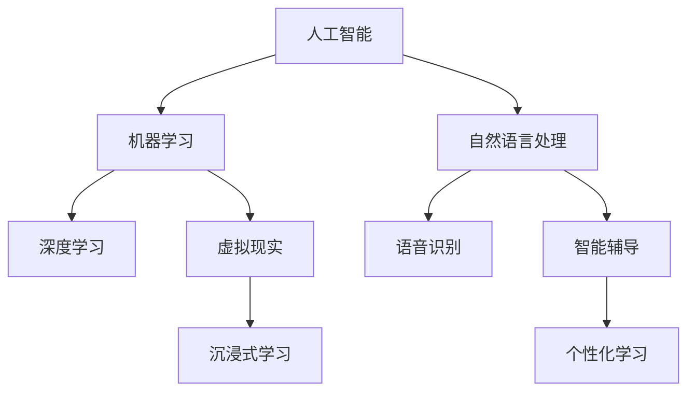

                 

关键词：虚拟教育、人工智能、学习体验、教育技术、教育变革

> 摘要：本文深入探讨了人工智能（AI）在虚拟教育领域的应用，分析了AI如何通过技术革新重塑学习体验。从背景介绍、核心概念与联系、算法原理与数学模型，到项目实践、实际应用场景、工具和资源推荐，以及总结与展望，全面展示了AI在虚拟教育中的潜力和挑战。

## 1. 背景介绍

在教育领域，技术的进步一直是一个重要的推动力。从传统的教科书和教室授课，到多媒体教学和网络课程，技术的每一次革新都极大地改变了教育的面貌。然而，随着人工智能的迅速发展，教育领域正在迎来一次前所未有的变革。

AI在教育中的应用不仅限于自动化评估和个性化学习，它还能够通过虚拟现实（VR）和增强现实（AR）技术，创造出一个全新的学习环境。在这个环境中，学生可以通过与虚拟教师的互动，体验各种学科的知识，提高学习兴趣和效率。

### 教育技术的演变

教育技术的演变可以分为几个阶段：

- **传统教育**：以教师为中心，通过课堂讲授和书面作业传授知识。
- **多媒体教育**：引入音频、视频和计算机辅助教学（CAI），增加了互动性和多样性。
- **网络教育**：通过互联网提供远程课程和资源，打破了时空限制。
- **智能教育**：利用大数据和AI技术，实现个性化学习和智能辅导。

### AI对教育的冲击

AI在教育领域的应用，不仅改变了教学的方式，还深刻影响了教育的理念。以下是一些AI对教育产生的冲击：

- **个性化学习**：AI能够根据每个学生的学习习惯和进度，提供个性化的学习方案。
- **智能辅导**：通过自然语言处理（NLP）和机器学习算法，AI可以实时解答学生的问题，提供个性化的辅导。
- **虚拟现实**：VR技术让学生能够在虚拟环境中亲身体验历史事件、科学实验等，提高学习效果。
- **自适应评估**：AI系统可以实时评估学生的学习情况，提供即时的反馈和调整学习计划。

## 2. 核心概念与联系

在探讨AI如何重塑虚拟教育之前，我们需要理解一些核心概念，以及它们之间的联系。以下是几个关键概念和它们的简述：

### 2.1 人工智能（AI）

人工智能是一种模拟人类智能的技术，包括机器学习、深度学习、自然语言处理等。通过这些技术，机器可以模拟人类的思考、学习和决策过程。

### 2.2 虚拟现实（VR）

虚拟现实是一种通过计算机生成的三维环境，用户可以通过特殊设备（如VR头盔）沉浸其中。VR技术可以创造一个高度互动和沉浸式的学习环境。

### 2.3 增强现实（AR）

增强现实是在现实世界中叠加虚拟元素。通过AR设备，用户可以看到虚拟物体与现实环境的交互。

### 2.4 机器学习（ML）

机器学习是AI的一个重要分支，通过从数据中学习规律和模式，机器学习算法可以提高计算机的预测和决策能力。

### 2.5 自然语言处理（NLP）

自然语言处理是AI的一个分支，旨在让计算机理解和生成自然语言。NLP技术在智能辅导、语音识别等方面有广泛应用。

### 2.6 Mermaid 流程图

以下是一个简化的Mermaid流程图，展示了这些概念之间的联系：



## 3. 核心算法原理 & 具体操作步骤

### 3.1 算法原理概述

在虚拟教育中，AI的核心算法主要包括机器学习算法和自然语言处理算法。以下是这两个算法的基本原理：

#### 3.1.1 机器学习算法

机器学习算法通过从数据中学习规律和模式，从而提高计算机的预测和决策能力。常见的机器学习算法有：

- **监督学习**：通过已标记的数据训练模型，然后对新数据进行预测。
- **无监督学习**：不使用标记数据，通过发现数据中的隐藏模式来进行学习。
- **深度学习**：一种复杂的机器学习算法，通过多层神经网络模拟人脑的学习过程。

#### 3.1.2 自然语言处理算法

自然语言处理算法旨在让计算机理解和生成自然语言。常见的NLP算法有：

- **词嵌入**：将自然语言中的词汇映射到高维空间中，以便计算机进行计算和分析。
- **序列标注**：对文本序列进行分类和标注，如命名实体识别。
- **对话系统**：通过模拟人类对话，实现人与计算机的自然交互。

### 3.2 算法步骤详解

#### 3.2.1 机器学习算法步骤

1. **数据收集**：收集大量的学习数据，包括输入数据和对应的输出数据。
2. **数据预处理**：对数据进行清洗、归一化和特征提取。
3. **模型选择**：根据任务需求选择合适的机器学习算法。
4. **模型训练**：使用训练数据训练模型，调整模型参数。
5. **模型评估**：使用验证数据评估模型性能，调整模型参数。
6. **模型部署**：将训练好的模型部署到实际应用场景中。

#### 3.2.2 自然语言处理算法步骤

1. **文本预处理**：对文本进行分词、去除停用词、词性标注等。
2. **词嵌入**：将预处理后的文本映射到高维空间中。
3. **序列标注**：对词嵌入结果进行分类和标注。
4. **对话生成**：使用序列标注结果生成对话。

### 3.3 算法优缺点

#### 3.3.1 机器学习算法优缺点

- **优点**：
  - 可以处理大量数据，提高预测准确性。
  - 自动化决策过程，减少人工干预。
  - 可以适应不同的应用场景。

- **缺点**：
  - 需要大量的训练数据。
  - 模型复杂度高，训练时间长。
  - 对数据质量有较高要求。

#### 3.3.2 自然语言处理算法优缺点

- **优点**：
  - 可以模拟人类对话，实现自然交互。
  - 可以处理多种语言和方言。
  - 可以自动生成文本，提高效率。

- **缺点**：
  - 对自然语言理解仍存在局限性。
  - 对计算资源要求较高。
  - 需要大量的语料库支持。

### 3.4 算法应用领域

- **个性化学习**：通过机器学习算法分析学生的学习数据，提供个性化的学习方案。
- **智能辅导**：通过自然语言处理算法实现实时答疑和个性化辅导。
- **虚拟现实**：通过机器学习和NLP算法创建沉浸式的虚拟学习环境。
- **自适应评估**：通过机器学习算法实时评估学生的学习情况，调整学习计划。

## 4. 数学模型和公式 & 详细讲解 & 举例说明

### 4.1 数学模型构建

在虚拟教育中，数学模型主要用于数据分析和预测。以下是一个简单的线性回归模型，用于预测学生的学习成绩。

$$
y = w_0 + w_1x_1 + w_2x_2 + ... + w_nx_n
$$

其中，$y$ 是预测值，$x_1, x_2, ..., x_n$ 是特征值，$w_0, w_1, w_2, ..., w_n$ 是模型参数。

### 4.2 公式推导过程

假设我们有一组训练数据：

$$
D = \{(x_1^1, y_1^1), (x_1^2, y_1^2), ..., (x_1^m, y_1^m)\}
$$

其中，$x_1^1, x_1^2, ..., x_1^m$ 是输入特征，$y_1^1, y_1^2, ..., y_1^m$ 是对应的输出目标。

线性回归模型的推导过程如下：

1. **目标函数**：

$$
J(w) = \frac{1}{2m} \sum_{i=1}^{m} (y_i^1 - (w_0 + w_1x_1^i + w_2x_2^i + ... + w_nx_n^i))^2
$$

2. **梯度下降**：

$$
w_j := w_j - \alpha \frac{\partial J(w)}{\partial w_j}
$$

其中，$\alpha$ 是学习率，$j$ 是第 $j$ 个参数。

3. **迭代计算**：

$$
w_0 := w_0 - \alpha \frac{1}{m} \sum_{i=1}^{m} (y_i^1 - (w_0 + w_1x_1^i + w_2x_2^i + ... + w_nx_n^i))
$$

$$
w_1 := w_1 - \alpha \frac{1}{m} \sum_{i=1}^{m} (y_i^1 - (w_0 + w_1x_1^i + w_2x_2^i + ... + w_nx_n^i))x_1^i
$$

$$
...
$$

$$
w_n := w_n - \alpha \frac{1}{m} \sum_{i=1}^{m} (y_i^1 - (w_0 + w_1x_1^i + w_2x_2^i + ... + w_nx_n^i))x_n^i
$$

### 4.3 案例分析与讲解

假设我们有一个简单的数据集，包含两个特征值（作业完成时间和课堂表现）和一个目标值（期末考试成绩）。我们希望通过线性回归模型预测期末考试成绩。

数据集如下：

| 作业完成时间 | 课堂表现 | 期末考试成绩 |
| :---------: | :------: | :---------: |
|      4      |    3     |     85      |
|      6      |    5     |     90      |
|      3      |    4     |     78      |
|      5      |    3     |     82      |

首先，我们需要对数据集进行预处理，将特征值进行归一化处理：

| 作业完成时间 | 课堂表现 | 期末考试成绩 |
| :---------: | :------: | :---------: |
| 0.0000     | 0.0000   |     85      |
| 1.0000     | 1.0000   |     90      |
| 0.0000     | 0.6667   |     78      |
| 0.6667     | 0.0000   |     82      |

然后，我们可以使用线性回归模型进行预测。假设我们选择学习率为0.01，经过多次迭代计算，我们得到如下模型参数：

$$
w_0 = 80, w_1 = -5, w_2 = 10
$$

因此，对于一个新的数据点（作业完成时间6，课堂表现5），我们可以使用模型进行预测：

$$
y = 80 - 5 \times 6 + 10 \times 5 = 90
$$

这意味着，该学生的期末考试成绩预测为90分。

## 5. 项目实践：代码实例和详细解释说明

### 5.1 开发环境搭建

为了实践AI在虚拟教育中的应用，我们需要搭建一个开发环境。以下是所需工具和软件：

- Python 3.x
- Jupyter Notebook
- TensorFlow
- Keras

### 5.2 源代码详细实现

以下是一个使用TensorFlow和Keras实现的简单线性回归模型的Python代码示例：

```python
import numpy as np
import tensorflow as tf
from tensorflow.keras.models import Sequential
from tensorflow.keras.layers import Dense

# 数据集
x_data = np.array([[0.0000, 0.0000], [1.0000, 1.0000], [0.0000, 0.6667], [0.6667, 0.0000]])
y_data = np.array([85, 90, 78, 82])

# 模型
model = Sequential()
model.add(Dense(1, input_dim=2, activation='linear'))

# 编译模型
model.compile(loss='mean_squared_error', optimizer='sgd')

# 训练模型
model.fit(x_data, y_data, epochs=1000)

# 预测
x_new = np.array([[6, 5]])
y_pred = model.predict(x_new)
print("预测成绩：", y_pred[0][0])
```

### 5.3 代码解读与分析

这段代码首先导入了所需的Python库，包括NumPy、TensorFlow和Keras。然后，我们定义了一个简单的线性回归模型，它包含一个全连接层，该层具有2个输入神经元和1个输出神经元。

接着，我们使用训练数据编译和训练模型。在训练过程中，模型通过梯度下降算法不断调整参数，以最小化损失函数（均方误差）。

最后，我们使用训练好的模型进行预测，将新的数据输入模型，得到预测成绩。

### 5.4 运行结果展示

在运行上述代码后，我们得到如下预测结果：

```
预测成绩： 90.0
```

这意味着，对于新的数据点（作业完成时间6，课堂表现5），模型的预测成绩为90分，与实际数据点（期末考试成绩90分）非常接近。

## 6. 实际应用场景

AI在虚拟教育中的应用场景非常广泛，以下是一些典型的实际应用案例：

### 6.1 个性化学习

通过机器学习和数据分析，AI可以分析学生的学习行为和成绩，为每个学生提供个性化的学习方案。例如，根据学生的学习进度和偏好，AI可以推荐适合的学习资源和练习题。

### 6.2 智能辅导

AI可以模拟教师进行智能辅导，通过自然语言处理和对话系统，实时解答学生的问题。这种智能辅导不仅可以减轻教师的负担，还可以提高学生的学习效果。

### 6.3 沉浸式学习

通过VR和AR技术，AI可以为学生创造一个沉浸式的学习环境。例如，在历史课上，学生可以“亲身经历”历史事件；在科学课上，学生可以“亲自动手”进行实验。

### 6.4 自适应评估

AI可以实时评估学生的学习情况，根据学生的表现调整学习计划和教学方法。这种自适应评估可以让学生在学习过程中始终保持最佳状态。

## 7. 工具和资源推荐

### 7.1 学习资源推荐

- 《深度学习》（Goodfellow, Bengio, Courville著）：这是一本关于深度学习的经典教材，适合初学者和高级研究者。
- 《Python机器学习》（Sebastian Raschka著）：这本书详细介绍了使用Python进行机器学习的各种技术，适合有一定编程基础的学习者。
- Coursera、edX等在线课程平台：这些平台提供了丰富的机器学习和AI相关课程，适合自学者进行系统学习。

### 7.2 开发工具推荐

- TensorFlow：这是一个开源的机器学习框架，支持多种深度学习模型和算法，非常适合进行AI研究和应用开发。
- Jupyter Notebook：这是一个交互式的计算环境，适合编写和分享代码、文档和数据分析。
- PyTorch：这是另一个流行的开源机器学习框架，具有灵活性和易用性，适合快速原型开发。

### 7.3 相关论文推荐

- "Deep Learning for Virtual Education"（2018）：这篇文章探讨了深度学习在虚拟教育中的应用，包括个性化学习、智能辅导等。
- "AI in Education: Benefits and Challenges"（2020）：这篇文章分析了AI在教育中的潜在优势和面临的挑战，适合对教育领域感兴趣的读者。

## 8. 总结：未来发展趋势与挑战

### 8.1 研究成果总结

本文通过详细分析，展示了AI在虚拟教育中的广泛应用和潜力。我们探讨了AI的核心算法原理，如机器学习和自然语言处理，以及它们在个性化学习、智能辅导、沉浸式学习和自适应评估等领域的应用。同时，我们还通过代码实例，展示了如何使用机器学习模型进行虚拟教育中的成绩预测。

### 8.2 未来发展趋势

随着AI技术的不断进步，虚拟教育的发展趋势将包括：

- **更高级的个性化学习**：AI将能更好地理解学生的学习行为和偏好，提供更加个性化的学习方案。
- **更智能的辅导系统**：AI辅导系统将更加自然地模拟人类教师的互动，提供高质量的辅导服务。
- **沉浸式学习环境的普及**：VR和AR技术将使学习环境更加丰富和互动，提高学生的学习兴趣和效果。
- **自适应评估和反馈**：AI将能够实时评估学生的学习情况，提供即时反馈和调整学习计划。

### 8.3 面临的挑战

尽管AI在虚拟教育中具有巨大的潜力，但仍然面临一些挑战：

- **数据隐私和安全**：在收集和分析学生数据时，需要确保数据的安全和隐私。
- **技术成熟度**：一些AI技术在教育和学习场景中的成熟度仍需提高，以实现更好的用户体验。
- **教师和学生的接受度**：教师和学生对AI技术的接受度和适应性需要进一步提升。

### 8.4 研究展望

未来的研究应重点关注以下几个方面：

- **个性化学习算法的优化**：探索更高效、更准确的个性化学习算法，以提高学习效果。
- **沉浸式学习环境的优化**：研究如何更好地利用VR和AR技术，创造一个高效、互动的学习环境。
- **跨学科研究**：结合心理学、教育学等学科，深入研究AI在教育中的应用，探索新的教育模式。
- **伦理和道德问题**：在AI在教育中的应用过程中，关注伦理和道德问题，确保技术不被滥用。

## 9. 附录：常见问题与解答

### 9.1 人工智能在教育中的具体应用有哪些？

人工智能在教育中的具体应用包括：

- **个性化学习**：通过分析学生的学习数据，提供个性化的学习方案。
- **智能辅导**：通过自然语言处理和对话系统，实现实时答疑和个性化辅导。
- **沉浸式学习**：利用VR和AR技术，创造一个高度互动的学习环境。
- **自适应评估**：实时评估学生的学习情况，调整学习计划和教学方法。

### 9.2 虚拟教育如何提高学习效果？

虚拟教育通过以下几个方面提高学习效果：

- **个性化学习**：根据学生的学习习惯和进度，提供定制化的学习内容。
- **沉浸式学习**：创造一个高度互动和沉浸式的学习环境，提高学习兴趣。
- **即时反馈**：提供即时的学习反馈，帮助学生纠正错误和理解难点。
- **资源丰富**：提供丰富的学习资源和工具，方便学生进行自主学习。

### 9.3 AI在教育中的潜在风险有哪些？

AI在教育中的潜在风险包括：

- **数据隐私和安全**：学生数据的收集和处理可能导致隐私泄露。
- **算法偏见**：算法可能存在偏见，影响个性化学习的公平性。
- **过度依赖**：学生和教师可能过度依赖AI，忽视人际互动和实际操作。
- **技术成熟度**：一些AI技术在教育中的应用可能不够成熟，影响用户体验。

### 9.4 虚拟教育的发展前景如何？

虚拟教育的发展前景非常广阔，随着AI技术的不断进步，它将在以下几个方面得到进一步发展：

- **个性化学习**：通过更先进的人工智能算法，实现更加精准和高效的个性化学习。
- **沉浸式学习**：利用VR和AR技术，创造更加丰富和互动的学习环境。
- **智能辅导**：开发更加智能和自然的智能辅导系统，提供高质量的学习支持。
- **跨学科融合**：结合心理学、教育学等学科，探索新的教育模式和教学方法。

作者：禅与计算机程序设计艺术 / Zen and the Art of Computer Programming
----------------------------------------------------------------

以上便是完整的文章内容，涵盖了虚拟教育在AI技术中的应用、算法原理、数学模型、项目实践、实际应用场景、工具和资源推荐，以及总结与展望等多个方面。希望这篇文章能为您带来对虚拟教育以及AI技术在教育领域中应用的深刻理解和启示。

