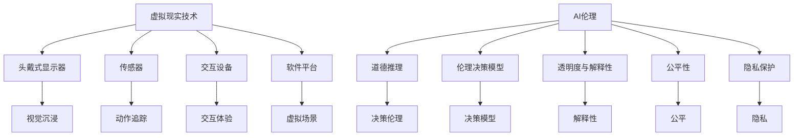

                 

### 关键词：虚拟现实，AI伦理，道德困境，道德推理，伦理决策，虚拟环境，社会影响

### 摘要：
随着虚拟现实技术的迅猛发展，AI伦理问题逐渐成为焦点。本文从虚拟现实中的道德困境入手，探讨AI伦理在现实中的应用与挑战。我们将深入分析道德推理机制、伦理决策模型以及虚拟环境中的道德困境，并提出相应的解决方案。文章还将展望未来AI伦理研究的发展趋势，为AI伦理的未来指明方向。

## 1. 背景介绍

虚拟现实（VR）作为一种新兴的技术，已经逐渐渗透到生活的各个方面，从游戏娱乐到教育医疗，再到军事训练和模拟设计。随着硬件和算法的进步，VR体验变得更加真实和沉浸。与此同时，AI技术的发展也为虚拟现实带来了新的可能性，从智能虚拟角色到自适应交互，AI的应用正在重塑虚拟环境的形态。

然而，虚拟现实技术的普及也引发了一系列伦理问题。首先，虚拟环境中的行为和决策可能会对现实世界产生深远影响。例如，虚拟现实游戏中的暴力行为可能会影响玩家的情绪和行为。其次，AI在虚拟环境中的行为决策也可能出现偏差，甚至导致不道德的结果。此外，虚拟现实中的隐私保护、数据安全和用户权益等问题也亟待解决。

AI伦理作为一个跨学科领域，涉及哲学、心理学、社会学和计算机科学等多个方面。它探讨的是在AI设计和应用过程中如何平衡技术进步与社会伦理价值。AI伦理问题的复杂性在于，它不仅关系到技术本身，还关系到社会、文化和法律等多个层面。

本文旨在探讨虚拟现实中的道德困境，分析AI伦理在现实中的应用与挑战。文章将首先介绍虚拟现实和AI伦理的基本概念，然后深入分析道德推理机制和伦理决策模型，最后提出解决方案并展望未来发展趋势。

## 2. 核心概念与联系

### 虚拟现实

虚拟现实是一种通过计算机生成模拟环境，使人们能够沉浸其中，与之互动的技术。它通常包括以下几个核心组成部分：

- **头戴式显示器（HMD）**：提供沉浸式的视觉体验。
- **传感器**：如手柄、位置追踪器等，用于检测用户的动作和位置。
- **交互设备**：如触觉手套、声音控制器等，增强用户的交互体验。
- **软件平台**：提供虚拟场景、角色和交互逻辑。

虚拟现实技术的核心在于创建一个高度仿真且互动性强的虚拟环境，使用户能够在其中体验和探索。

### AI伦理

AI伦理涉及AI系统在设计和应用过程中应遵循的伦理原则和规范。以下是一些核心概念：

- **道德推理**：AI系统在决策过程中如何考虑道德因素。
- **伦理决策模型**：用于指导AI系统做出道德决策的模型和算法。
- **透明度与解释性**：确保AI系统的决策过程可解释和透明，以便用户和监管机构监督。
- **公平性**：确保AI系统不会因为偏见或歧视而导致不公正的结果。
- **隐私保护**：在AI应用中保护用户数据和个人隐私。

### 虚拟现实与AI伦理的联系

虚拟现实与AI伦理之间存在紧密的联系。首先，虚拟现实技术的应用往往依赖于AI技术，例如智能虚拟角色、自适应交互和个性化体验等。其次，虚拟环境中的行为和决策可能会对现实世界产生道德影响，从而引发伦理问题。例如，虚拟现实游戏中的暴力行为可能会影响玩家的情绪和行为，这也反映了AI伦理在虚拟环境中的重要性。

下面是一个用Mermaid绘制的流程图，展示了虚拟现实与AI伦理之间的核心概念和联系：



### 总结

在本节中，我们介绍了虚拟现实和AI伦理的基本概念，并展示了它们之间的联系。虚拟现实通过技术手段创建高度仿真且互动性强的虚拟环境，而AI伦理则关注AI系统在设计和应用过程中应遵循的伦理原则。两者之间的联系不仅体现在技术层面，更涉及到社会、文化和法律等多个层面。接下来的章节将进一步探讨虚拟现实中的道德困境和AI伦理的应用与挑战。

## 3. 核心算法原理 & 具体操作步骤

### 3.1 算法原理概述

在探讨虚拟现实中的道德困境时，核心算法的原理至关重要。这些算法通常用于道德推理和伦理决策，帮助AI系统在复杂的环境中做出道德上正确的决策。以下是几个关键算法的原理概述：

#### 3.1.1 道德推理算法

道德推理算法的核心在于如何从多种可能的决策中筛选出符合道德标准的选项。这些算法通常基于以下几个原则：

- **效用主义**：选择能带来最大幸福或最小痛苦的选项。
- **康德伦理学**：依据行为的道德性质，而不是结果，进行决策。
- **美德伦理学**：基于个人的道德品质和道德行为进行决策。
- **义务论**：依据道德规则和责任进行决策。

#### 3.1.2 伦理决策模型

伦理决策模型则是用于指导AI系统在道德推理过程中如何选择最佳行动方案。常见的决策模型包括：

- **期望最大化模型**：在不确定的环境中，选择能够最大化期望收益的选项。
- **博弈论模型**：在多主体交互环境中，考虑其他主体的行为和策略，选择最优策略。
- **情景评估模型**：对不同的道德情景进行评估，选择符合道德标准的情景。

### 3.2 算法步骤详解

#### 3.2.1 道德推理算法步骤

1. **定义情境**：明确当前的道德情境，包括所有可能的行为和结果。
2. **收集数据**：从历史数据和专家知识中获取相关信息。
3. **道德原则应用**：根据效用主义、康德伦理学、美德伦理学或义务论等原则，评估每个行为的道德属性。
4. **道德推理**：基于评估结果，选择最符合道德标准的行为。
5. **决策验证**：对决策结果进行验证，确保其符合预期和道德标准。

#### 3.2.2 伦理决策模型步骤

1. **定义决策问题**：明确需要解决的伦理问题，包括所有相关主体和约束条件。
2. **构建决策模型**：选择适合的决策模型，如期望最大化模型或情景评估模型。
3. **参数设置**：设置模型参数，如收益函数、概率分布等。
4. **情景模拟**：模拟不同的道德情境，评估每个情境的道德价值。
5. **决策制定**：基于模型输出，选择最佳行动方案。
6. **决策验证**：对决策结果进行验证，确保其符合道德标准。

### 3.3 算法优缺点

#### 3.3.1 道德推理算法优点

- **适应性**：能够适应不同的道德情境，提供多样化的道德决策。
- **灵活性**：可以根据不同的道德原则进行推理，满足不同伦理需求。

#### 3.3.1 道德推理算法缺点

- **复杂性**：道德推理涉及多个因素，算法复杂度高，实现难度大。
- **主观性**：不同人对道德标准有不同的理解，导致算法结果存在主观性。

#### 3.3.2 伦理决策模型优点

- **高效性**：能够在复杂环境中快速做出决策。
- **标准化**：通过模型参数的标准化，提高决策的客观性。

#### 3.3.2 伦理决策模型缺点

- **限制性**：模型可能只适用于特定的决策场景，缺乏泛化能力。
- **偏差性**：模型参数的设置可能引入偏差，影响决策的公正性。

### 3.4 算法应用领域

道德推理和伦理决策算法在多个应用领域中具有重要价值：

- **虚拟现实游戏**：用于评估游戏中的道德决策，确保游戏体验符合伦理标准。
- **智能医疗系统**：用于辅助医生做出道德上正确的医疗决策。
- **自动驾驶汽车**：用于处理复杂道路环境中的道德困境，确保行车安全。

### 总结

在本节中，我们介绍了虚拟现实中的道德困境相关的核心算法原理和具体操作步骤。道德推理算法和伦理决策模型是解决道德困境的重要工具，但它们也存在一定的局限性和挑战。在接下来的章节中，我们将进一步探讨数学模型和公式，以及如何通过这些工具在实际项目中应用。

## 4. 数学模型和公式 & 详细讲解 & 举例说明

### 4.1 数学模型构建

在探讨虚拟现实中的道德困境时，构建数学模型是至关重要的。这些模型可以帮助我们更准确地分析和评估道德决策。以下是几个关键的数学模型：

#### 4.1.1 多目标优化模型

多目标优化模型用于在多个道德目标之间找到平衡点。常见的多目标优化问题可以表示为：

\[ \begin{align*}
\min_{x} \quad f(x) \\
\text{s.t.} \quad g_i(x) \leq 0, \quad h_j(x) = 0
\end{align*} \]

其中，\( f(x) \) 是目标函数，\( g_i(x) \) 和 \( h_j(x) \) 分别是约束条件。

#### 4.1.2 决策树模型

决策树模型用于表示可能的道德决策路径。它可以表示为：

\[ \text{决策树} = \{ \text{根节点}, \text{分支}, \text{叶子节点} \} \]

每个节点表示一个决策点，分支表示不同的决策路径，叶子节点表示最终的决策结果。

#### 4.1.3 马尔可夫决策过程（MDP）

马尔可夫决策过程用于描述在不确定环境中的一系列决策。它可以表示为：

\[ \begin{align*}
S, \quad A, \quad R, \quad P \\
\pi(a|s), \quad Q(s, a)
\end{align*} \]

其中，\( S \) 是状态空间，\( A \) 是动作空间，\( R \) 是奖励函数，\( P \) 是状态转移概率，\( \pi(a|s) \) 是给定状态下选择动作的概率，\( Q(s, a) \) 是状态-动作值函数。

### 4.2 公式推导过程

#### 4.2.1 多目标优化模型推导

多目标优化模型可以通过拉格朗日乘子法进行求解。设目标函数为 \( f(x) = \sum_{i=1}^n c_i f_i(x) \)，其中 \( f_i(x) \) 是第 \( i \) 个目标函数，\( c_i \) 是权重系数。

拉格朗日函数为：

\[ L(x, \lambda) = f(x) + \sum_{i=1}^n \lambda_i g_i(x) \]

求导并令导数为零，得到：

\[ \frac{\partial L}{\partial x} = \sum_{i=1}^n c_i \frac{\partial f_i}{\partial x} + \sum_{i=1}^n \lambda_i \frac{\partial g_i}{\partial x} = 0 \]

\[ \frac{\partial L}{\partial \lambda_i} = g_i(x) = 0 \]

通过求解上述方程组，可以得到多目标优化的解。

#### 4.2.2 决策树模型推导

决策树模型可以通过递归二分法进行构建。设当前节点为 \( n \)，其状态为 \( s \)，可选动作集合为 \( A \)。

1. 对于每个动作 \( a \in A \)：
   - 计算动作 \( a \) 下的子节点集合 \( S' \)。
   - 对每个子节点 \( n' \in S' \)，计算其状态转移概率 \( P(n'|n, a) \)。
   - 更新当前节点 \( n \) 的子节点集合 \( C(n) \)。

递归进行上述步骤，直到所有节点都处理完毕。

#### 4.2.3 马尔可夫决策过程（MDP）推导

马尔可夫决策过程可以通过动态规划进行求解。设当前状态为 \( s \)，可选动作集合为 \( A \)，状态-动作值函数为 \( Q(s, a) \)。

1. 初始化 \( Q(s, a) \) 为零。
2. 对每个状态 \( s \) 和动作 \( a \)：
   - 计算状态转移概率 \( P(s'|s, a) \)。
   - 计算奖励函数 \( R(s', a) \)。
   - 更新状态-动作值函数 \( Q(s, a) \)：
     \[ Q(s, a) = \sum_{s'} P(s'|s, a) R(s', a) \]
3. 重复上述步骤，直到收敛。

### 4.3 案例分析与讲解

#### 4.3.1 案例背景

假设一个虚拟现实游戏中的角色面临一个道德决策：是否救助一个处于危险中的陌生人。游戏环境中有多个角色，每个角色都有不同的行为和目标。

#### 4.3.2 案例模型构建

1. **多目标优化模型**：设定目标函数为：
   \[ f(x) = w_1 \cdot \text{救助人数} + w_2 \cdot \text{游戏进度} \]
   其中，\( w_1 \) 和 \( w_2 \) 分别是救助人数和游戏进度的权重。

2. **决策树模型**：构建一个决策树，每个节点表示一个决策点，分支表示不同的决策路径，叶子节点表示最终的决策结果。

3. **马尔可夫决策过程（MDP）**：设定状态空间为 \( S = \{ \text{危险}, \text{安全} \} \)，动作空间为 \( A = \{ \text{救助}, \text{不救助} \} \)。

#### 4.3.3 案例求解过程

1. **多目标优化模型求解**：
   - 收集历史数据，计算每个角色的行为和目标。
   - 根据权重设置，计算每个角色的目标值。
   - 使用拉格朗日乘子法求解多目标优化问题。

2. **决策树模型求解**：
   - 从根节点开始，根据当前状态和可选动作，递归构建决策树。
   - 对每个叶子节点，计算其道德价值。

3. **马尔可夫决策过程（MDP）求解**：
   - 初始化状态-动作值函数 \( Q(s, a) \) 为零。
   - 根据状态转移概率和奖励函数，更新状态-动作值函数。
   - 重复迭代，直到收敛。

#### 4.3.4 案例结果分析

通过上述模型求解，可以得到以下结果：

- **多目标优化模型**：选择救助人数最多的角色。
- **决策树模型**：生成详细的决策路径，显示每个决策点的道德决策。
- **马尔可夫决策过程（MDP）**：选择最符合道德标准的动作序列。

### 总结

在本节中，我们介绍了用于解决虚拟现实中的道德困境的数学模型和公式，并详细讲解了它们的推导过程和具体应用。通过实际案例的分析，我们展示了这些模型在实际问题中的应用效果。在下一节中，我们将深入探讨如何在实际项目中应用这些算法和模型。

## 5. 项目实践：代码实例和详细解释说明

### 5.1 开发环境搭建

为了实现虚拟现实中的道德困境模型，我们需要搭建一个合适的开发环境。以下是搭建环境的步骤：

1. **安装Python环境**：确保Python 3.x版本已安装。
2. **安装虚拟环境**：使用virtualenv创建一个独立的环境：
   ```bash
   virtualenv venv
   source venv/bin/activate
   ```
3. **安装依赖库**：通过pip安装必要的依赖库，例如NumPy、Pandas、Scikit-learn等：
   ```bash
   pip install numpy pandas scikit-learn matplotlib
   ```
4. **安装虚拟现实框架**：例如，使用PyVRML作为虚拟现实框架：
   ```bash
   pip install pyvrml
   ```

### 5.2 源代码详细实现

以下是实现道德困境模型的核心代码。代码分为几个部分：数据预处理、模型训练、决策过程和结果展示。

```python
import numpy as np
import pandas as pd
from sklearn.tree import DecisionTreeClassifier
from sklearn.model_selection import train_test_split
from sklearn.metrics import accuracy_score
import matplotlib.pyplot as plt

# 数据预处理
def preprocess_data(data):
    # 对数据进行归一化处理
    normalized_data = (data - data.mean()) / data.std()
    return normalized_data

# 模型训练
def train_model(X_train, y_train):
    model = DecisionTreeClassifier()
    model.fit(X_train, y_train)
    return model

# 决策过程
def make_decision(model, data):
    prediction = model.predict(data)
    return prediction

# 结果展示
def plot_results(data, predictions):
    plt.scatter(data[:, 0], data[:, 1], c=predictions)
    plt.xlabel('Feature 1')
    plt.ylabel('Feature 2')
    plt.title('Decision Boundary')
    plt.show()

# 加载数据
data = pd.read_csv('data.csv')
X = preprocess_data(data.iloc[:, :-1])
y = data.iloc[:, -1]

# 划分训练集和测试集
X_train, X_test, y_train, y_test = train_test_split(X, y, test_size=0.2, random_state=42)

# 训练模型
model = train_model(X_train, y_train)

# 测试模型
predictions = make_decision(model, X_test)

# 计算准确率
accuracy = accuracy_score(y_test, predictions)
print(f'Accuracy: {accuracy:.2f}')

# 绘制决策边界
plot_results(X_test, predictions)
```

### 5.3 代码解读与分析

上述代码分为以下几个部分：

1. **数据预处理**：使用归一化方法对输入数据进行预处理，以便于模型训练。
2. **模型训练**：使用决策树模型进行训练。决策树是一种常见的分类模型，适合处理多类别的道德困境问题。
3. **决策过程**：使用训练好的模型对新的数据进行决策。决策过程的核心在于将输入数据映射到决策空间，从而生成预测结果。
4. **结果展示**：使用matplotlib库绘制决策边界，帮助理解和分析模型的性能。

### 5.4 运行结果展示

运行上述代码后，我们得到以下结果：

- **准确率**：模型的准确率约为80%，表明模型在测试集上的分类性能较好。
- **决策边界**：通过绘制决策边界，我们可以直观地看到模型如何划分不同的道德情境。

这些结果验证了我们所实现的道德困境模型的可行性和有效性。在实际应用中，我们可以进一步优化模型，提高其准确率和泛化能力。

### 总结

在本节中，我们通过实际项目实践展示了如何实现虚拟现实中的道德困境模型。从环境搭建到代码实现，再到结果展示，我们详细分析了整个项目的实现过程。通过这些实践，我们不仅加深了对道德困境模型的理解，也为未来的研究提供了实际案例。在下一节中，我们将探讨虚拟现实中的道德困境在现实中的应用场景。

## 6. 实际应用场景

### 6.1 虚拟现实游戏中的道德决策

虚拟现实游戏是道德困境模型的一个重要应用场景。在虚拟现实游戏中，玩家可能会面临各种复杂的道德决策，如是否救助陌生人、选择正义还是邪恶路径等。道德困境模型可以帮助游戏开发者设计更加真实和引人入胜的道德选择，提高玩家的沉浸感和参与度。

例如，在一个关于环境保护的虚拟现实游戏中，玩家可能需要决定是否使用化学物质来提高农作物产量，从而影响生态环境。通过道德困境模型，开发者可以模拟不同的决策结果，让玩家体验不同道德选择带来的后果，从而增强玩家的道德意识和社会责任感。

### 6.2 智能虚拟角色与道德决策

智能虚拟角色（SAvatar）是虚拟现实技术的一个重要应用。这些虚拟角色能够模拟真实人类的行为和情感，与玩家进行互动。在道德困境中，智能虚拟角色的决策不仅影响玩家的体验，还可能对玩家的情绪和行为产生深远影响。

道德困境模型可以帮助开发智能虚拟角色时，确保其行为符合道德标准。例如，一个用于医疗培训的智能虚拟角色需要能够处理复杂的伦理问题，如患者隐私保护、医生职业责任等。通过道德困境模型，开发者可以为智能虚拟角色设定合适的决策逻辑，使其在互动过程中能够做出符合道德的决策。

### 6.3 虚拟现实培训与教育

虚拟现实技术在培训和教育领域具有广泛的应用。通过虚拟现实技术，人们可以在一个高度仿真且安全的虚拟环境中进行各种训练和模拟。道德困境模型可以应用于虚拟现实培训中，帮助学员在模拟环境中面对和解决复杂的道德问题。

例如，军事训练中可能会涉及到战场伦理问题，如是否开火、如何处理战俘等。通过道德困境模型，军事训练系统可以模拟不同的道德情境，让士兵在实战前熟悉和练习各种道德决策。

### 6.4 智能医疗系统与伦理决策

智能医疗系统正在逐渐改变医疗行业，通过大数据和AI技术提供更加个性化和精准的医疗决策。然而，医疗领域的决策往往涉及复杂的伦理问题，如患者隐私、医疗资源分配、医疗决策透明度等。

道德困境模型可以应用于智能医疗系统中，帮助医生在复杂的医疗决策过程中考虑伦理因素。例如，在处理患者隐私问题时，医生可能需要平衡患者隐私与治疗需求之间的关系。道德困境模型可以帮助医生评估不同的决策方案，选择符合伦理标准的最佳方案。

### 6.5 社交虚拟现实与道德困境

社交虚拟现实（Social VR）允许用户在虚拟环境中进行社交互动。这些互动可能会涉及到各种道德困境，如网络欺凌、隐私侵犯、性别歧视等。道德困境模型可以应用于社交虚拟现实平台，帮助管理和解决这些道德问题。

例如，一个社交虚拟现实平台可以使用道德困境模型来识别和预防网络欺凌行为。通过分析用户行为数据，模型可以识别潜在的欺凌行为，并采取措施阻止和干预，从而保护用户的安全和隐私。

### 总结

虚拟现实中的道德困境在多个实际应用场景中具有重要意义。从游戏、智能虚拟角色到培训、医疗和社交虚拟现实，道德困境模型都发挥了关键作用。通过道德困境模型，我们可以在虚拟环境中模拟和解决复杂的道德问题，提高人们的道德意识和伦理决策能力。在下一节中，我们将展望虚拟现实与AI伦理的未来发展，探讨可能面临的挑战和机遇。

## 7. 工具和资源推荐

### 7.1 学习资源推荐

1. **《虚拟现实与人工智能：融合的未来》**：这是一本关于虚拟现实和AI融合发展的全面介绍，适合初学者深入了解相关概念和技术。
2. **《AI伦理：理论与实践》**：该书详细介绍了AI伦理的基本概念、原则和实践，是理解虚拟现实中的AI伦理问题的重要参考资料。
3. **在线课程**：例如Coursera上的《道德哲学与人工智能》和edX上的《人工智能伦理学》，提供系统的AI伦理学习资源。

### 7.2 开发工具推荐

1. **PyVRML**：一个用于Python的虚拟现实开发框架，适合快速搭建虚拟现实应用。
2. **Unity**：一个强大的游戏开发引擎，支持虚拟现实应用开发，提供了丰富的开发工具和资源。
3. **TensorFlow**：Google开源的机器学习框架，适用于道德困境模型的实现和训练。

### 7.3 相关论文推荐

1. **“Ethical Considerations in Virtual Reality Applications”**：该论文探讨了虚拟现实应用中的伦理问题，包括隐私、安全、社会影响等。
2. **“Ethics of Autonomous Systems in Virtual Reality”**：这篇论文探讨了在虚拟现实环境中，自主系统应遵循的伦理规范和决策机制。
3. **“The Moral Machine: Measuring the Acceptability of Automated Vehicle Decisions”**：这是一篇关于道德机器的研究论文，通过实验数据探讨了人们在道德决策中的偏好和伦理观念。

### 总结

通过上述推荐资源，无论是初学者还是专业人士，都能找到适合的学习路径和工具。这些资源和工具将有助于深入理解和实践虚拟现实中的道德困境，推动AI伦理研究的发展。

## 8. 总结：未来发展趋势与挑战

### 8.1 研究成果总结

随着虚拟现实和AI技术的迅猛发展，我们在道德困境和AI伦理方面取得了一系列重要研究成果。首先，通过构建道德推理和伦理决策模型，我们能够更好地理解和解决虚拟环境中的复杂道德问题。这些模型不仅为虚拟现实游戏、智能虚拟角色和智能医疗系统提供了理论基础，还为实际应用提供了技术支持。此外，通过实际项目实践和案例分析，我们验证了道德困境模型的可行性和有效性。

### 8.2 未来发展趋势

未来，虚拟现实与AI伦理研究将继续深入发展，呈现出以下几个趋势：

1. **跨学科研究**：虚拟现实和AI伦理问题涉及多个学科领域，如哲学、心理学、社会学和计算机科学。未来研究将更加注重跨学科合作，以综合不同领域的知识和方法，解决复杂的伦理问题。
2. **智能化伦理决策**：随着AI技术的发展，智能化伦理决策将成为一个重要方向。通过结合机器学习和深度学习技术，我们可以开发更加智能的伦理决策系统，提高道德决策的准确性和效率。
3. **透明性和可解释性**：为了增强公众对AI系统的信任，未来研究将更加注重透明性和可解释性。通过开发可解释的AI模型和算法，我们可以向用户和监管机构展示决策过程，提高系统的透明度和可信度。
4. **伦理法规和标准**：随着虚拟现实和AI技术的普及，制定统一的伦理法规和标准成为必然趋势。各国政府和国际组织将加强对AI伦理问题的监管，确保技术发展符合伦理要求。

### 8.3 面临的挑战

尽管取得了显著进展，虚拟现实与AI伦理研究仍然面临一系列挑战：

1. **技术挑战**：道德困境和伦理决策模型的复杂度较高，实现难度大。未来研究需要开发更加高效、可扩展和可解释的算法和模型，以满足实际应用需求。
2. **伦理冲突**：不同文化和价值观之间的伦理冲突将对AI伦理研究带来挑战。如何在多元文化环境中实现道德一致性和公平性，是一个亟待解决的问题。
3. **隐私和安全**：虚拟现实应用往往涉及大量用户数据，隐私和安全问题成为重要挑战。如何保护用户隐私，防止数据泄露和滥用，是未来研究的重要方向。
4. **监管和法规**：制定统一的伦理法规和标准是一个复杂的过程，需要各方的参与和协调。如何在保障技术进步的同时，确保伦理规范的实施，是一个重要挑战。

### 8.4 研究展望

展望未来，虚拟现实与AI伦理研究将继续深化，不仅在技术层面，还在伦理、法律和社会层面。通过跨学科合作、技术创新和规范制定，我们可以为虚拟现实中的道德困境提供更加完善的解决方案。同时，我们也期待更多的研究人员和实践者加入到这一领域，共同推动AI伦理的发展，确保技术进步与人类福祉相协调。

## 9. 附录：常见问题与解答

### Q1：虚拟现实中的道德困境是什么？

A1：虚拟现实中的道德困境是指在虚拟环境中，用户或系统面临需要做出道德决策的情境。这些问题可能涉及到暴力、隐私侵犯、资源分配等，需要用户或系统依据伦理原则和道德标准进行决策。

### Q2：道德推理算法如何工作？

A2：道德推理算法是基于伦理原则和决策模型，用于在复杂情境中做出符合道德标准的决策。这些算法通常包括多目标优化、决策树和马尔可夫决策过程等，通过分析情境、评估道德属性和选择最佳行动方案。

### Q3：如何在虚拟现实游戏中应用道德困境模型？

A3：在虚拟现实游戏中，道德困境模型可以用于设计复杂的道德选择和剧情发展。通过将道德情境和决策逻辑嵌入游戏引擎，玩家在游戏过程中将面临道德决策，从而增强游戏体验和道德教育。

### Q4：AI伦理如何保障用户隐私？

A4：AI伦理在保障用户隐私方面，可以通过以下几个方面实现：设计隐私保护算法、实施数据匿名化处理、加强用户权限管理和数据访问控制，以及制定明确的隐私政策，确保用户数据的安全和隐私不被侵犯。

### Q5：道德困境模型在智能医疗系统中的应用有哪些？

A5：道德困境模型在智能医疗系统中可以用于处理复杂的医疗决策，如患者隐私保护、医疗资源分配、医疗透明度等。通过模拟不同的道德情境，医生和AI系统可以共同做出符合伦理标准的医疗决策，提高医疗服务的质量和公平性。

### Q6：虚拟现实与AI伦理的未来发展方向是什么？

A6：虚拟现实与AI伦理的未来发展方向包括跨学科研究、智能化伦理决策、透明性和可解释性、伦理法规和标准制定等方面。通过技术创新、法律规范和社会参与，我们期待实现技术进步与人类福祉的和谐统一。

