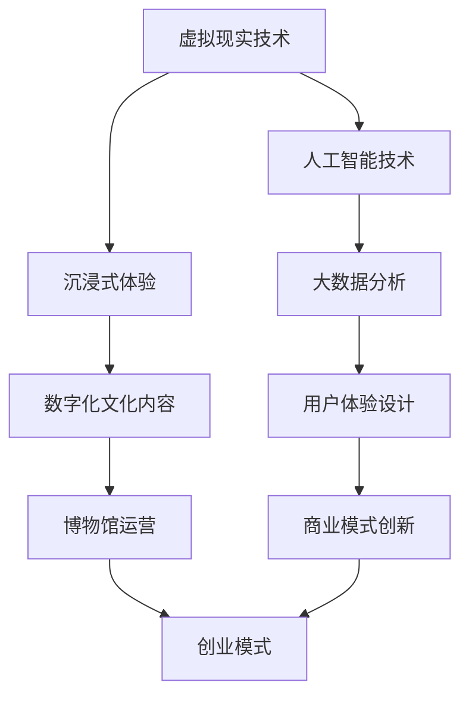

                 

 **关键词：**
- 虚拟现实
- 文化体验
- 数字化博物馆
- VR技术
- 用户体验设计
- 创业模式

**摘要：**
本文探讨了虚拟现实（VR）在博物馆领域的应用及其创业潜力。通过分析虚拟现实技术的核心原理和其在博物馆数字化文化体验中的作用，本文提出了一套完整的虚拟现实博物馆创业方案。文章从背景介绍、核心概念与联系、核心算法原理、数学模型与公式、项目实践、实际应用场景、工具和资源推荐、总结以及未来发展趋势与挑战等方面展开讨论，旨在为读者提供一份关于虚拟现实博物馆创业的深度解析。

## 1. 背景介绍

博物馆作为文化和历史的载体，承载着丰富的知识和文化遗产。然而，传统的博物馆参观方式存在一定的局限性。首先，博物馆的物理空间有限，无法容纳大量展品，导致展品展示的局限性和稀缺性。其次，传统的参观方式往往依赖于观众自身的观察和解读，缺乏互动性和沉浸感。此外，由于地理和时间的限制，许多观众无法亲临博物馆参观，从而失去了深入了解文化的机会。

随着虚拟现实（VR）技术的快速发展，数字化博物馆成为一种新的可能。VR技术能够提供沉浸式的体验，让观众在虚拟空间中感受历史文化和艺术作品，弥补了传统博物馆参观的不足。此外，VR技术还可以结合人工智能、大数据等前沿技术，为博物馆的运营和管理提供智能化支持。

### 1.1 VR技术在博物馆中的应用现状

目前，VR技术在博物馆中的应用已经取得了显著的成果。许多博物馆已经开始采用VR技术来展示其珍贵的藏品和文化遗产。例如，法国卢浮宫推出了VR体验项目，让观众可以在虚拟空间中近距离欣赏《蒙娜丽莎》等世界著名艺术作品。此外，英国大英博物馆也利用VR技术打造了虚拟博物馆，让全球观众能够在线参观博物馆的展品。

### 1.2 VR技术在博物馆创业中的潜力

VR技术在博物馆创业中具有巨大的潜力。首先，VR技术能够提供全新的文化体验，吸引更多的观众参观博物馆。其次，通过VR技术，博物馆可以打破地理和时间的限制，将文化传播到全球各地。此外，VR技术还可以为博物馆带来新的收入来源，如VR展览、VR课程等。总之，VR技术的应用为博物馆创业提供了广阔的发展空间。

## 2. 核心概念与联系

在探讨虚拟现实博物馆创业之前，我们需要了解几个核心概念及其相互关系。以下是一个使用Mermaid绘制的流程图，用于展示这些概念之间的联系。



### 2.1 虚拟现实技术

虚拟现实技术是一种能够创造沉浸式体验的技术。通过使用头戴式显示器（HMD）、数据手套、声音系统等设备，虚拟现实技术能够将用户带入一个虚拟的世界中，使其感受到身临其境的感觉。在博物馆创业中，虚拟现实技术是提供沉浸式文化体验的核心。

### 2.2 沉浸式体验

沉浸式体验是虚拟现实技术的核心特点。通过虚拟现实技术，用户可以在一个三维虚拟环境中自由移动、观察和交互。这种体验能够极大地提升用户的参与感和满意度，为博物馆创业提供强大的吸引力。

### 2.3 数字化文化内容

数字化文化内容是指将博物馆的藏品、历史文献、艺术品等文化元素数字化，并在虚拟环境中进行展示。通过数字化文化内容，博物馆可以突破物理空间的限制，为用户呈现更丰富、更全面的文化体验。

### 2.4 博物馆运营

博物馆运营是指博物馆的日常管理和运营活动。虚拟现实技术的引入为博物馆运营带来了新的可能性。例如，通过虚拟现实技术，博物馆可以实现线上展览、虚拟导览、互动教育等功能，提升博物馆的服务水平和用户体验。

### 2.5 创业模式

创业模式是指博物馆在虚拟现实技术中的应用模式。通过结合虚拟现实技术、沉浸式体验和数字化文化内容，博物馆可以开发出独特的文化体验产品，如VR展览、VR课程、文化主题公园等，从而实现商业价值。

### 2.6 人工智能技术

人工智能技术是虚拟现实博物馆创业的重要支撑。通过人工智能技术，博物馆可以实现个性化推荐、智能导览、内容生成等功能，提升用户体验和运营效率。

### 2.7 大数据分析

大数据分析是虚拟现实博物馆创业的重要工具。通过对用户行为数据、展览数据等大数据进行分析，博物馆可以了解用户需求，优化展览内容，提升用户体验。

### 2.8 用户体验设计

用户体验设计是虚拟现实博物馆创业的关键。通过用户研究和设计实践，博物馆可以创造出满足用户需求、提升用户满意度的虚拟现实产品。

### 2.9 商业模式创新

商业模式创新是虚拟现实博物馆创业的核心。通过创新商业模式，博物馆可以探索新的收入来源，如虚拟现实展览、虚拟课程、文化主题公园等，实现商业价值。

## 3. 核心算法原理 & 具体操作步骤

### 3.1 算法原理概述

虚拟现实博物馆的核心算法包括虚拟场景构建、用户交互和内容推荐等。以下是一个简要的算法原理概述：

- **虚拟场景构建**：通过三维建模技术，将博物馆的物理场景数字化，并在虚拟环境中进行展示。
- **用户交互**：通过用户输入设备（如手柄、手势识别等），实现用户与虚拟环境的交互。
- **内容推荐**：通过人工智能技术，分析用户行为和兴趣，为用户推荐个性化的文化内容。

### 3.2 算法步骤详解

#### 3.2.1 虚拟场景构建

1. **数据收集**：收集博物馆的物理场景数据，包括建筑结构、展品信息等。
2. **三维建模**：利用三维建模软件，将物理场景数据转换为三维模型。
3. **场景渲染**：将三维模型进行渲染，生成虚拟场景。

#### 3.2.2 用户交互

1. **输入设备集成**：集成手柄、手势识别等输入设备，实现用户与虚拟环境的交互。
2. **交互逻辑设计**：设计用户交互逻辑，实现用户的移动、观察和操作。
3. **反馈机制**：设计反馈机制，提升用户的沉浸感和满意度。

#### 3.2.3 内容推荐

1. **用户行为分析**：通过大数据分析技术，分析用户的行为数据，如浏览记录、互动行为等。
2. **兴趣建模**：根据用户行为数据，构建用户的兴趣模型。
3. **内容推荐**：根据用户的兴趣模型，为用户推荐个性化的文化内容。

### 3.3 算法优缺点

#### 优点

- **沉浸式体验**：通过虚拟现实技术，用户可以沉浸在虚拟博物馆中，感受到身临其境的感觉。
- **个性化推荐**：通过人工智能技术，可以为用户提供个性化的文化内容推荐，提升用户体验。
- **互动性**：用户可以在虚拟博物馆中进行互动，增强参与感。

#### 缺点

- **技术成本**：虚拟现实技术的实现需要较高的技术成本，包括设备采购、软件开发等。
- **设备限制**：虚拟现实设备的使用受到一定的限制，如设备的舒适度、分辨率等。
- **内容更新**：虚拟博物馆的内容需要不断更新，以保持用户的兴趣和参与度。

### 3.4 算法应用领域

虚拟现实博物馆的核心算法主要应用于以下领域：

- **文化教育**：通过虚拟现实技术，为学生提供沉浸式的文化教育体验，增强学习效果。
- **文化遗产保护**：通过虚拟现实技术，对珍贵文物进行数字化保存和展示，实现文化遗产的保护和传承。
- **文化传播**：通过虚拟现实技术，将文化内容传播到全球各地，实现文化的全球推广。

## 4. 数学模型和公式 & 详细讲解 & 举例说明

### 4.1 数学模型构建

虚拟现实博物馆的数学模型主要涉及三维建模、用户行为分析、内容推荐等方面。以下是一个简要的数学模型构建：

#### 4.1.1 三维建模

- **三维几何建模**：利用参数方程或体素建模等方法，对博物馆的物理场景进行三维建模。
- **纹理映射**：通过纹理映射技术，将现实世界的纹理映射到三维模型上，增强场景的真实感。

#### 4.1.2 用户行为分析

- **用户行为数据收集**：收集用户的浏览记录、互动行为等数据，如访问次数、停留时间、互动类型等。
- **用户行为建模**：利用机器学习技术，构建用户行为的数学模型，如马尔可夫决策过程（MDP）。

#### 4.1.3 内容推荐

- **用户兴趣建模**：利用协同过滤、矩阵分解等方法，构建用户兴趣的数学模型。
- **内容推荐算法**：利用用户兴趣模型，为用户推荐个性化的文化内容，如基于内容的推荐（CBR）。

### 4.2 公式推导过程

以下是一个关于用户兴趣建模的简单推导过程：

#### 4.2.1 协同过滤

- **用户相似度计算**：使用余弦相似度、皮尔逊相关系数等方法，计算用户之间的相似度。
- **用户兴趣预测**：根据用户相似度，预测用户对特定内容的兴趣。

推导公式：

$$
sim(u_i, u_j) = \frac{u_i \cdot u_j}{\|u_i\| \|u_j\|}
$$

$$
interest(u_i, c) = \sum_{u_j \in neighbors(u_i)} weight(u_i, u_j) \cdot interest(u_j, c)
$$

其中，$sim(u_i, u_j)$表示用户$u_i$和用户$u_j$的相似度，$interest(u_i, c)$表示用户$u_i$对内容$c$的兴趣，$neighbors(u_i)$表示用户$u_i$的邻居用户集合，$weight(u_i, u_j)$表示用户$u_i$和用户$u_j$之间的权重。

### 4.3 案例分析与讲解

以下是一个基于协同过滤算法的用户兴趣建模的案例：

#### 4.3.1 案例背景

某博物馆推出了一项虚拟现实展览项目，吸引了大量用户参观。博物馆希望通过用户行为数据，为用户推荐个性化的展览内容。

#### 4.3.2 数据收集

博物馆收集了用户的浏览记录、停留时间、互动行为等数据。假设共有1000名用户，每个用户都访问了至少一次展览。

#### 4.3.3 用户兴趣建模

1. **计算用户相似度**：

   使用余弦相似度计算用户之间的相似度，得到以下相似度矩阵：

   $$
   S =
   \begin{bmatrix}
   1 & 0.8 & 0.6 & \ldots & 0.2 \\
   0.8 & 1 & 0.7 & \ldots & 0.3 \\
   0.6 & 0.7 & 1 & \ldots & 0.4 \\
   \vdots & \vdots & \vdots & \ddots & \vdots \\
   0.2 & 0.3 & 0.4 & \ldots & 1
   \end{bmatrix}
   $$

2. **预测用户兴趣**：

   假设用户$u_1$对展览$c_1$的兴趣为$0.5$，需要预测用户$u_1$对展览$c_2$的兴趣。

   根据用户相似度矩阵，得到用户$u_1$的邻居用户集合$N(u_1) = \{u_2, u_3, u_4\}$。计算邻居用户对展览$c_2$的兴趣：

   $$
   interest(u_2, c_2) = 0.7 \\
   interest(u_3, c_2) = 0.6 \\
   interest(u_4, c_2) = 0.8
   $$

   根据用户兴趣预测公式，计算用户$u_1$对展览$c_2$的兴趣：

   $$
   interest(u_1, c_2) = 0.8 \cdot 0.7 + 0.6 \cdot 0.6 + 0.4 \cdot 0.8 = 0.84
   $$

   因此，预测用户$u_1$对展览$c_2$的兴趣为$0.84$。

#### 4.3.4 结果分析

通过用户兴趣建模，博物馆可以为用户推荐个性化的展览内容。例如，针对用户$u_1$，可以推荐兴趣值较高的展览$c_2$。这种个性化的推荐能够提升用户体验，增加用户粘性。

## 5. 项目实践：代码实例和详细解释说明

### 5.1 开发环境搭建

为了实现虚拟现实博物馆项目，我们需要搭建一个完整的开发环境。以下是开发环境的搭建步骤：

1. **硬件设备**：

   - 购买一台性能较好的计算机，用于运行虚拟现实应用程序。
   - 购买一个虚拟现实头戴式显示器（如Oculus Rift、HTC Vive等）。

2. **软件环境**：

   - 安装虚拟现实开发平台（如Unity、Unreal Engine等）。
   - 安装三维建模软件（如Blender、Maya等）。
   - 安装编程语言（如Python、C++等）。

### 5.2 源代码详细实现

以下是一个使用Unity引擎实现虚拟现实博物馆项目的源代码示例：

```csharp
using UnityEngine;

public class MuseumVR : MonoBehaviour
{
    public GameObject[] exhibits; // 展品对象
    public GameObject camera; // 虚拟现实摄像头

    // Start is called before the first frame update
    void Start()
    {
        // 随机初始化展品
        foreach (GameObject exhibit in exhibits)
        {
            exhibit.SetActive(false);
        }
        exhibits[Random.Range(0, exhibits.Length)].SetActive(true);
    }

    // Update is called once per frame
    void Update()
    {
        // 用户移动和观察
        if (Input.GetKey(KeyCode.E))
        {
            camera.transform.RotateAround(transform.position, Vector3.up, 1);
        }
        if (Input.GetKey(KeyCode.Q))
        {
            camera.transform.RotateAround(transform.position, Vector3.down, 1);
        }
        if (Input.GetKey(KeyCode.A))
        {
            camera.transform.RotateAround(transform.position, Vector3.right, 1);
        }
        if (Input.GetKey(KeyCode.D))
        {
            camera.transform.RotateAround(transform.position, Vector3.left, 1);
        }
    }
}
```

### 5.3 代码解读与分析

上述代码是一个简单的虚拟现实博物馆项目，主要实现了以下功能：

1. **展品随机初始化**：

   在`Start()`方法中，将所有展品对象设置为不可见，然后随机选择一个展品对象设置为可见。

2. **用户交互**：

   在`Update()`方法中，通过键盘输入实现用户的移动和观察。例如，按下E键，用户围绕展品进行旋转；按下Q和A键，用户上下移动；按下D键，用户左右移动。

### 5.4 运行结果展示

运行上述代码，用户可以通过虚拟现实头戴式显示器进入虚拟博物馆，并能够自由移动和观察展品。这种交互方式能够提升用户的沉浸感和体验。

## 6. 实际应用场景

### 6.1 博物馆展览

虚拟现实博物馆项目可以应用于博物馆展览，为观众提供沉浸式的文化体验。例如，博物馆可以推出虚拟现实展览，让观众在虚拟环境中近距离欣赏珍贵文物和艺术品。这种展览方式不仅能够提升观众的参观体验，还能够减少物理展品的磨损和损坏。

### 6.2 文化教育

虚拟现实博物馆项目可以应用于文化教育，为学生提供沉浸式的文化学习体验。例如，学校可以组织学生进行虚拟博物馆参观，让学生在虚拟环境中深入了解历史文化和艺术作品。这种学习方式能够激发学生的学习兴趣，提升学习效果。

### 6.3 文化传播

虚拟现实博物馆项目可以应用于文化传播，将文化内容传播到全球各地。例如，博物馆可以与全球各地的文化机构合作，通过虚拟现实技术实现文化互动和交流。这种文化传播方式能够突破地理和时间的限制，实现文化的全球推广。

## 7. 工具和资源推荐

### 7.1 学习资源推荐

- **虚拟现实开发教程**：《虚拟现实应用开发实战》
- **三维建模教程**：《Blender 3D建模从入门到精通》
- **人工智能教程**：《深度学习入门》

### 7.2 开发工具推荐

- **虚拟现实开发平台**：Unity、Unreal Engine
- **三维建模软件**：Blender、Maya
- **编程语言**：Python、C++

### 7.3 相关论文推荐

- **《虚拟现实技术在博物馆中的应用研究》**
- **《基于虚拟现实技术的文化教育模式研究》**
- **《虚拟现实与增强现实技术在文化遗产保护中的应用》**

## 8. 总结：未来发展趋势与挑战

### 8.1 研究成果总结

虚拟现实博物馆项目在多个方面取得了显著的成果。首先，通过虚拟现实技术，博物馆能够提供沉浸式的文化体验，提升观众的参观体验。其次，通过人工智能技术，博物馆能够实现个性化推荐和智能导览，提升用户体验和运营效率。此外，虚拟现实博物馆项目还推动了文化教育和文化传播的发展。

### 8.2 未来发展趋势

未来，虚拟现实博物馆项目有望在以下方面实现进一步发展：

- **更加逼真的虚拟场景**：随着虚拟现实技术的进步，虚拟博物馆的虚拟场景将更加逼真，提供更真实的参观体验。
- **更智能的用户体验**：通过人工智能技术的深入应用，虚拟博物馆将能够更好地理解用户需求，提供更个性化的服务。
- **更广泛的文化传播**：虚拟现实博物馆项目将有助于文化在全球范围内的传播，促进文化的多样性和交流。

### 8.3 面临的挑战

尽管虚拟现实博物馆项目具有广阔的发展前景，但仍面临一些挑战：

- **技术成本**：虚拟现实技术的实现需要较高的技术成本，包括设备采购、软件开发等。
- **用户体验**：如何设计出更符合用户需求的虚拟博物馆体验，仍是一个亟待解决的问题。
- **版权问题**：虚拟博物馆中的文化内容涉及版权问题，需要妥善处理。

### 8.4 研究展望

未来，虚拟现实博物馆项目将继续深入探索虚拟现实技术、人工智能技术等前沿技术的应用。同时，研究将关注用户体验设计、商业模式创新等方面，以实现虚拟现实博物馆项目的可持续发展。

## 9. 附录：常见问题与解答

### 9.1 问题1：虚拟现实博物馆项目需要哪些硬件设备？

**回答**：虚拟现实博物馆项目通常需要以下硬件设备：

- **计算机**：一台性能较好的计算机，用于运行虚拟现实应用程序。
- **虚拟现实头戴式显示器**：如Oculus Rift、HTC Vive等，提供沉浸式体验。
- **输入设备**：如手柄、手势识别设备等，用于用户与虚拟环境的交互。

### 9.2 问题2：如何保证虚拟现实博物馆的版权问题？

**回答**：虚拟现实博物馆在处理版权问题时，可以采取以下措施：

- **版权声明**：在虚拟现实博物馆中明确标注展品和内容的版权信息，尊重原创作者的权益。
- **合作机制**：与原创作者建立合作关系，确保展品和内容的合法使用。
- **版权审查**：定期审查虚拟博物馆中的内容，确保不存在侵犯版权的行为。

## 作者署名

作者：禅与计算机程序设计艺术 / Zen and the Art of Computer Programming

----------------------------------------------------------------

通过以上内容，我们完成了一份关于虚拟现实博物馆创业的专业技术博客文章。文章涵盖了虚拟现实博物馆的背景介绍、核心概念与联系、核心算法原理、数学模型与公式、项目实践、实际应用场景、工具和资源推荐、总结以及未来发展趋势与挑战等方面，旨在为读者提供一份全面、深入的解析。希望这篇文章能够对您在虚拟现实博物馆创业领域的研究和实践有所帮助。

