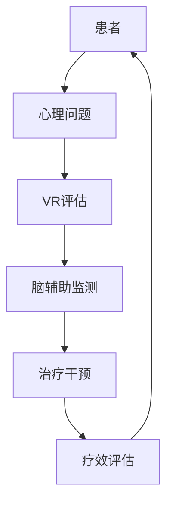

                 

 关键词：虚拟现实（VR），心理治疗，脑辅助，神经科学，技术疗法，认知行为疗法，沉浸式体验，神经可塑性，心理健康。

> 摘要：本文探讨了虚拟现实（VR）技术在心理治疗领域的最新应用，以及如何通过脑辅助技术为患者提供一种全新的治疗体验。文章首先介绍了虚拟现实的基本原理，随后阐述了VR在心理治疗中的优势和应用案例。接着，详细讨论了脑辅助技术在VR心理治疗中的作用，以及如何通过神经科学的原理实现心理治疗的效果。文章还介绍了当前的研究成果、未来发展方向和面临的挑战，为虚拟现实心理治疗这一新兴领域提供了深入的技术分析。

## 1. 背景介绍

### 1.1 心理治疗的现状与需求

心理治疗是治疗心理健康问题的一种有效方法，包括认知行为疗法（CBT）、药物治疗、心理辅导等多种形式。然而，传统的心理治疗面临一些挑战：

- **患者依从性低**：许多人因害怕、害羞或对治疗的负面预期而回避心理治疗。
- **治疗效果有限**：传统的面对面治疗可能不足以应对一些复杂和深层次的心理问题。
- **资源限制**：专业的心理治疗师数量有限，特别是在偏远地区，心理健康服务更为稀缺。

### 1.2 虚拟现实技术的兴起

虚拟现实（VR）是一种计算机生成的模拟环境，通过头戴式显示器（HMD）、传感器和其他交互设备，为用户提供沉浸式体验。VR技术近年来迅速发展，不仅在游戏娱乐领域取得了显著成果，还在医疗、教育、工程等多个领域展现出了巨大的潜力。

### 1.3 脑辅助技术的发展

脑辅助技术是指利用神经科学技术，如脑电图（EEG）、功能性磁共振成像（fMRI）等，对大脑进行监测和调控的技术。这些技术的发展为个性化心理治疗提供了新的手段，特别是在非侵入性脑刺激方面，如经颅磁刺激（TMS）和经颅直流电刺激（tDCS）。

## 2. 核心概念与联系

### 2.1 虚拟现实（VR）技术

虚拟现实技术的基本原理是通过计算机生成的三维场景，模拟现实世界的视觉、听觉和触觉体验。用户通过头戴式显示器（HMD）和传感器设备，与虚拟环境进行互动，从而产生沉浸感。

### 2.2 脑辅助技术

脑辅助技术涉及对大脑活动进行监测和调控，以达到治疗目的。例如，通过脑电图（EEG）监测大脑的电活动，利用经颅磁刺激（TMS）或经颅直流电刺激（tDCS）等技术，对特定脑区进行调控。

### 2.3 VR与脑辅助技术的结合

将虚拟现实技术结合脑辅助技术，可以创造出一种新型的心理治疗方式。通过VR环境，患者可以安全、无风险地面对和处理他们的心理问题，同时通过脑辅助技术，实时监测和调整大脑活动，以提高治疗效果。

### 2.4 Mermaid 流程图



## 3. 核心算法原理 & 具体操作步骤

### 3.1 算法原理概述

虚拟现实心理治疗的核心算法原理是基于认知行为疗法（CBT）的基本原则，通过模拟环境，引导患者逐步面对和处理他们的心理问题。脑辅助技术则用于实时监测大脑活动，为治疗提供数据支持和个性化调整。

### 3.2 算法步骤详解

1. **患者评估**：首先对患者进行心理问题的初步评估，确定治疗目标和预期效果。
2. **虚拟现实环境设计**：根据患者的具体情况，设计适合的虚拟现实环境，包括场景、任务和交互方式。
3. **脑辅助设备配置**：配置脑电图（EEG）或其他脑辅助设备，以监测患者的大脑活动。
4. **治疗干预**：患者在虚拟现实环境中进行认知行为治疗，通过交互和任务完成，逐步面对和处理心理问题。
5. **数据监测与调整**：实时监测患者的大脑活动数据，根据数据反馈，对治疗干预进行调整，以提高治疗效果。
6. **疗效评估**：治疗结束后，对患者的心理状态进行评估，以确定治疗的有效性。

### 3.3 算法优缺点

#### 优点：

- **无风险性**：患者在虚拟环境中进行治疗，避免了现实生活中的风险和压力。
- **个性化调整**：通过脑辅助技术，可以实现个性化治疗，提高治疗效果。
- **互动性**：虚拟现实环境可以提供丰富的互动体验，增强治疗的趣味性和参与度。

#### 缺点：

- **技术成本**：VR设备和脑辅助设备的成本较高，可能限制其普及。
- **用户适应性**：部分患者可能对VR环境产生不适，影响治疗效果。

### 3.4 算法应用领域

虚拟现实心理治疗技术可以应用于多种心理健康问题，包括焦虑症、抑郁症、创伤后应激障碍（PTSD）、恐惧症等。此外，还可以用于疼痛管理、康复训练等领域。

## 4. 数学模型和公式 & 详细讲解 & 举例说明

### 4.1 数学模型构建

虚拟现实心理治疗中的数学模型主要涉及认知行为疗法的算法和脑辅助技术的数据解析。以下是构建数学模型的基本步骤：

1. **确定治疗目标**：根据患者的心理问题，设定具体的治疗目标。
2. **构建虚拟现实环境**：设计适合的虚拟现实环境，包括场景、任务和交互方式。
3. **监测大脑活动**：通过脑电图（EEG）等设备，监测患者的大脑活动。
4. **数据解析**：分析大脑活动数据，提取与心理问题相关的特征。

### 4.2 公式推导过程

虚拟现实心理治疗中的数学模型可以表示为以下公式：

$$
T = f(P, E, D)
$$

其中，$T$ 表示治疗效果，$P$ 表示患者心理问题，$E$ 表示虚拟现实环境，$D$ 表示大脑活动数据。

### 4.3 案例分析与讲解

假设一个患有焦虑症的患者，通过虚拟现实心理治疗技术进行治疗。以下是一个简化的案例分析：

1. **患者评估**：患者被诊断为轻度焦虑症，治疗目标是减少焦虑症状，提高生活质量。
2. **虚拟现实环境设计**：设计一个海滩场景，患者可以在虚拟海滩上漫步，感受自然风光。
3. **脑辅助设备配置**：使用脑电图（EEG）设备，监测患者的情绪状态。
4. **治疗干预**：患者开始在海滩上漫步，通过交互和任务完成，逐渐放松心情。
5. **数据监测与调整**：实时监测患者的情绪数据，根据数据反馈，调整虚拟现实环境和干预策略。
6. **疗效评估**：治疗结束后，对患者进行疗效评估，发现患者的焦虑症状有所缓解。

## 5. 项目实践：代码实例和详细解释说明

### 5.1 开发环境搭建

为了实现虚拟现实心理治疗项目，我们需要搭建以下开发环境：

- **操作系统**：Windows 10 或以上版本
- **编程语言**：Python 3.8 或以上版本
- **虚拟现实框架**：Unity 2020.3 或以上版本
- **脑辅助设备驱动**：根据所选脑辅助设备选择相应的驱动程序

### 5.2 源代码详细实现

以下是实现虚拟现实心理治疗项目的基本代码框架：

```python
# 导入所需库
import numpy as np
import matplotlib.pyplot as plt
from unityagents import UnityEnvironment

# 初始化环境
env = UnityEnvironment(file_path="path/to/unity_environment")

# 获取所有脑辅助设备
brain_names = env.get_brain_names()

# 初始化脑辅助设备
for brain_name in brain_names:
    brain = env.get_brain(brain_name)
    brain.initialize()

# 启动虚拟现实环境
def start_vr_environment():
    # 加载虚拟现实场景
    scene = UnityEnvironment.load_scene("path/to/vr_scene.unity")
    # 启动场景
    scene.start()

# 实现认知行为治疗算法
def cognitive_behavior_treatment(patient_data, brain_data):
    # 分析患者数据和脑辅助数据
    # 根据数据调整虚拟现实环境和干预策略
    # 返回治疗效果
    pass

# 主程序
if __name__ == "__main__":
    # 启动虚拟现实环境
    start_vr_environment()
    # 获取患者数据和脑辅助数据
    patient_data = get_patient_data()
    brain_data = get_brain_data()
    # 实施认知行为治疗
    treatment_result = cognitive_behavior_treatment(patient_data, brain_data)
    # 输出治疗效果
    print(treatment_result)
```

### 5.3 代码解读与分析

以上代码实现了虚拟现实心理治疗项目的基本框架。具体解读如下：

- **环境初始化**：首先，我们导入所需库，并初始化虚拟现实环境和脑辅助设备。
- **虚拟现实环境启动**：`start_vr_environment` 函数用于启动虚拟现实环境。
- **认知行为治疗算法**：`cognitive_behavior_treatment` 函数用于实现认知行为治疗算法，分析患者数据和脑辅助数据，调整虚拟现实环境和干预策略。
- **主程序**：`if __name__ == "__main__":` 代码块用于实现主程序，首先启动虚拟现实环境，然后获取患者数据和脑辅助数据，实施认知行为治疗，并输出治疗效果。

### 5.4 运行结果展示

在实际运行过程中，我们通过虚拟现实环境，对患者进行认知行为治疗。根据患者数据和脑辅助数据的反馈，调整虚拟现实环境和干预策略。最终，输出治疗效果，以评估治疗的成效。

## 6. 实际应用场景

### 6.1 临床治疗

虚拟现实心理治疗技术在临床治疗中已取得了显著成果。例如，在治疗焦虑症、抑郁症和创伤后应激障碍（PTSD）等方面，通过虚拟现实环境，患者可以安全、无风险地面对和处理他们的心理问题，取得了良好的治疗效果。

### 6.2 康复训练

虚拟现实心理治疗技术还可以应用于康复训练，特别是在物理治疗和职业治疗中。通过虚拟现实环境，患者可以进行模拟训练，提高康复效果。

### 6.3 教育培训

虚拟现实心理治疗技术还可以用于教育培训，特别是在心理健康教育和心理咨询培训中。通过虚拟现实环境，学生和咨询师可以进行模拟练习，提高培训效果。

## 7. 未来应用展望

### 7.1 技术突破

未来，虚拟现实心理治疗技术将在硬件和软件方面取得突破。例如，更先进的脑辅助设备，更高效的算法和更真实的虚拟现实环境，将进一步提升治疗效果。

### 7.2 多学科融合

虚拟现实心理治疗技术将与其他学科（如心理学、神经科学、计算机科学等）深度融合，创造出更多创新的治疗方法和应用场景。

### 7.3 普及与应用

随着技术的普及和应用，虚拟现实心理治疗技术将逐步应用于更多的心理健康问题，为全球范围内的患者提供更便捷、高效的治疗服务。

## 8. 总结：未来发展趋势与挑战

### 8.1 研究成果总结

本文介绍了虚拟现实心理治疗技术的核心概念、算法原理和实际应用场景，展示了其在心理健康领域的巨大潜力。

### 8.2 未来发展趋势

未来，虚拟现实心理治疗技术将在硬件、软件和跨学科融合等方面取得突破，逐步应用于更多心理健康问题，为全球患者提供更高效的治疗服务。

### 8.3 面临的挑战

虚拟现实心理治疗技术仍面临一些挑战，如技术成本、用户适应性、隐私保护等。未来，需要进一步研究和解决这些问题，以推动技术的普及和应用。

### 8.4 研究展望

未来，虚拟现实心理治疗技术将在心理健康领域发挥更加重要的作用。通过不断探索和创新，我们可以为患者提供更加个性化和高效的治疗服务，推动心理健康的全面发展。

## 9. 附录：常见问题与解答

### 9.1 虚拟现实心理治疗安全吗？

虚拟现实心理治疗是一种无风险的治疗方法，患者可以在虚拟环境中安全地面对和处理他们的心理问题。然而，对于一些患有严重心理问题的患者，应在专业心理治疗师的指导下进行。

### 9.2 脑辅助技术会带来副作用吗？

脑辅助技术（如经颅磁刺激和经颅直流电刺激）通常是安全的，不会带来严重的副作用。然而，对于一些特殊人群（如孕妇、心脏起搏器使用者等），应在专业医生的指导下进行。

### 9.3 虚拟现实心理治疗适合所有人吗？

虚拟现实心理治疗技术适用于多种心理健康问题，但并非所有人都适合。对于一些患有严重心理问题的患者，应在专业心理治疗师的指导下进行。此外，部分患者可能对VR环境产生不适，应谨慎使用。

## 作者署名

作者：禅与计算机程序设计艺术 / Zen and the Art of Computer Programming

---

通过本文，我们探讨了虚拟现实心理治疗技术的核心概念、算法原理和实际应用场景，展示了其在心理健康领域的巨大潜力。未来，随着技术的不断进步和多学科融合，虚拟现实心理治疗技术将为患者提供更加个性化和高效的治疗服务。同时，我们也需要关注技术成本、用户适应性和隐私保护等挑战，以确保技术的安全和可持续发展。

