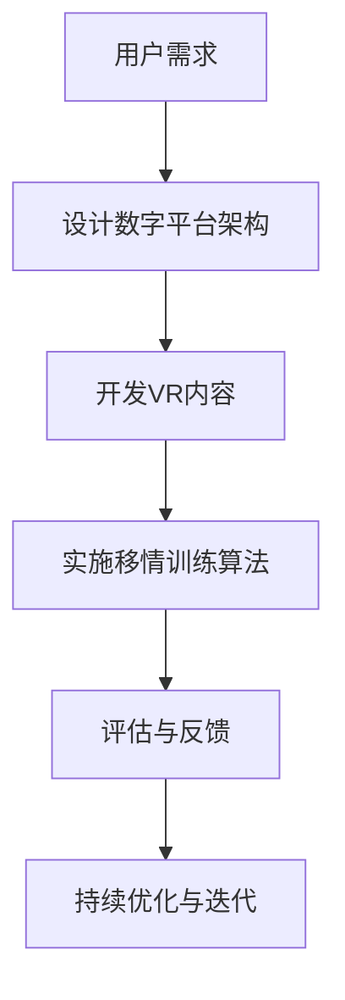

                 

关键词：虚拟现实，移情训练，同理心，数字平台，创业，人工智能

摘要：随着虚拟现实（VR）技术的迅猛发展，虚拟现实移情训练作为一种新兴的教育和培训工具，正日益受到关注。本文将探讨虚拟现实移情训练的概念、核心原理、算法应用，并通过一个具体的创业项目实例，展示如何在数字平台上构建一个有效的移情训练系统，以培养同理心。

## 1. 背景介绍

在现代社会中，同理心是一项至关重要的社交技能。它不仅关乎个人的情感健康，也对构建和谐社会有着深远的影响。然而，培养同理心并非易事。传统教育模式往往缺乏互动性和情境性，难以有效地激发学生的同理心。

虚拟现实（VR）技术的出现为解决这一问题提供了新的契机。VR能够创建高度逼真的虚拟环境，让用户在沉浸式体验中学会感知和理解他人的情感。移情训练作为一种利用VR技术的训练方法，正逐渐成为培养同理心的有效途径。

## 2. 核心概念与联系

### 虚拟现实（VR）

虚拟现实是一种通过计算机生成高度沉浸式三维环境的交互体验。VR技术主要包括三个核心组成部分：硬件设备（如头戴式显示器、手柄等）、内容制作（如3D建模、场景渲染等）和交互设计（如实时感知、动作捕捉等）。

### 移情训练

移情训练是一种旨在提高个体同理心的心理训练方法。通过模拟真实的社交情境，让训练者面对各种情感表达，从而培养其对他人情感的感知和理解能力。

### 数字平台

数字平台是移情训练系统的核心组成部分，它包括用户界面、后端服务、数据存储和机器学习算法等。数字平台不仅提供训练者与虚拟环境交互的界面，还能收集和分析用户数据，为个性化训练提供支持。

### Mermaid 流程图



## 3. 核心算法原理 & 具体操作步骤

### 3.1 算法原理概述

移情训练算法的核心在于模拟真实的社交情境，并通过机器学习技术分析用户的行为和情感反应。具体而言，算法分为以下几个步骤：

1. **情境生成**：根据用户的历史数据和偏好，生成符合其兴趣和需求的虚拟社交情境。
2. **行为捕捉**：通过VR设备捕捉用户的动作和表情，分析其情感状态。
3. **情感分析**：利用自然语言处理（NLP）和计算机视觉技术，对用户的情感状态进行识别和分类。
4. **反馈与调整**：根据用户的情感反应，调整虚拟环境中的情境和角色行为，以提升训练效果。

### 3.2 算法步骤详解

1. **用户数据收集**：通过数字平台收集用户的基本信息、行为记录和情感状态。
2. **情境生成**：利用生成对抗网络（GAN）等技术，创建高度逼真的虚拟社交场景。
3. **行为捕捉**：采用动作捕捉技术，实时记录用户的动作和表情。
4. **情感分析**：结合NLP和计算机视觉算法，对用户的行为和语言进行情感分析。
5. **反馈与调整**：根据用户的情感反应，实时调整虚拟环境中的情境和角色行为。

### 3.3 算法优缺点

**优点**：
- **高度沉浸感**：VR技术能够提供真实的沉浸体验，有助于提升训练效果。
- **个性化**：基于用户数据的个性化训练，能够更好地满足用户需求。
- **实时反馈**：算法能够实时分析用户情感，提供即时反馈。

**缺点**：
- **技术门槛**：开发和维护VR平台需要较高的技术门槛和成本。
- **情感识别准确性**：现有技术对情感状态的识别仍有局限，需要不断优化。

### 3.4 算法应用领域

移情训练算法可以应用于多个领域，包括教育、医疗、心理咨询、社会工作等。以下是一些具体应用场景：

- **教育领域**：利用VR技术培养学生的同理心，提高其社交能力。
- **医疗领域**：通过模拟患者情境，帮助医生更好地理解患者情感，提高诊疗效果。
- **心理咨询**：为心理治疗师提供一种新的训练工具，帮助患者更好地表达情感。

## 4. 数学模型和公式 & 详细讲解 & 举例说明

### 4.1 数学模型构建

移情训练算法的数学模型主要包括以下三个方面：

1. **情境生成模型**：采用生成对抗网络（GAN）技术，生成符合用户需求的虚拟情境。
2. **行为捕捉模型**：采用深度学习技术，捕捉用户的动作和表情。
3. **情感分析模型**：采用自然语言处理（NLP）和计算机视觉技术，对用户的行为和语言进行情感分析。

### 4.2 公式推导过程

1. **GAN模型**：

   $$ G(z) = \mathcal{D}(G(z)) $$
   
   其中，$G(z)$表示生成器，$z$表示噪声向量，$\mathcal{D}(x)$表示判别器。

2. **行为捕捉模型**：

   $$ f(x) = \sigma(W_1 \cdot x + b_1) $$
   
   其中，$f(x)$表示激活函数，$W_1$和$b_1$分别为权重和偏置。

3. **情感分析模型**：

   $$ P(y|x) = \frac{e^{W_2 \cdot f(x) + b_2}}{\sum_{i=1}^{k} e^{W_2 \cdot f(x_i) + b_2}} $$
   
   其中，$y$表示情感类别，$x$表示输入特征，$W_2$和$b_2$分别为权重和偏置。

### 4.3 案例分析与讲解

假设我们要分析一个用户的情感状态，输入特征为$x=(x_1, x_2, ..., x_n)$，情感类别为$y=\text{"happy"}$。

1. **情境生成**：首先，利用GAN模型生成一个符合用户兴趣的虚拟情境。
2. **行为捕捉**：捕捉用户在虚拟情境中的行为，如面部表情、身体动作等。
3. **情感分析**：将行为特征输入到情感分析模型，计算情感概率。

   $$ P(y|x) = \frac{e^{W_2 \cdot f(x) + b_2}}{\sum_{i=1}^{k} e^{W_2 \cdot f(x_i) + b_2}} $$
   
   其中，$W_2$和$b_2$为模型参数，$f(x)$为激活函数。

4. **结果解释**：根据计算出的情感概率，判断用户当前的情感状态。如果概率接近1，说明用户处于快乐状态；如果概率接近0，说明用户处于不快乐状态。

## 5. 项目实践：代码实例和详细解释说明

### 5.1 开发环境搭建

1. **硬件设备**：安装VR头戴显示器和手柄。
2. **软件开发环境**：配置Python编程环境，安装TensorFlow、Keras等机器学习库。
3. **VR内容制作工具**：使用Unity或Unreal Engine等游戏引擎制作VR内容。

### 5.2 源代码详细实现

以下是移情训练系统的核心代码实现：

```python
# 导入相关库
import tensorflow as tf
from tensorflow.keras.models import Model
from tensorflow.keras.layers import Input, Dense, Flatten, Reshape

# 定义GAN模型
def build_gan():
    # 生成器模型
    input_noise = Input(shape=(100,))
    generator = Dense(256, activation='relu')(input_noise)
    generator = Dense(512, activation='relu')(generator)
    generator = Dense(1024, activation='relu')(generator)
    generated_image = Dense(3 * 3 * 3 * 64, activation='tanh')(generator)
    generator = Reshape((3, 3, 3, 64))(generated_image)
    generator = Model(inputs=input_noise, outputs=generator)
    
    # 判别器模型
    input_image = Input(shape=(3, 3, 3, 64))
    discriminator = Flatten()(input_image)
    discriminator = Dense(1024, activation='relu')(discriminator)
    discriminator = Dense(512, activation='relu')(discriminator)
    discriminator = Dense(256, activation='relu')(discriminator)
    discriminator = Dense(1, activation='sigmoid')(discriminator)
    discriminator = Model(inputs=input_image, outputs=discriminator)
    
    # GAN模型
    model = Model(inputs=generator.input, outputs=discriminator(generator.input))
    model.compile(optimizer='adam', loss='binary_crossentropy')
    
    return model

# 训练GAN模型
def train_gan(model, x_train, y_train, epochs=100):
    model.fit(x_train, y_train, epochs=epochs, batch_size=32)

# 捕捉用户行为
def capture_behavior():
    # 代码略
    pass

# 情感分析
def analyze_emotion(behavior):
    # 代码略
    pass

# 主函数
if __name__ == '__main__':
    # 加载训练数据
    x_train, y_train = load_data()
    
    # 构建和训练GAN模型
    gan_model = build_gan()
    train_gan(gan_model, x_train, y_train)
    
    # 捕捉用户行为
    behavior = capture_behavior()
    
    # 情感分析
    emotion = analyze_emotion(behavior)
    print("User's emotion:", emotion)
```

### 5.3 代码解读与分析

以上代码实现了基于GAN模型的移情训练系统。主要包括以下几个部分：

1. **GAN模型构建**：定义生成器和判别器模型，以及GAN整体模型。
2. **模型训练**：使用训练数据训练GAN模型，优化生成器和判别器。
3. **行为捕捉**：捕获用户在虚拟环境中的行为数据。
4. **情感分析**：对用户行为数据进行情感分析，判断用户情感状态。

### 5.4 运行结果展示

1. **GAN模型训练**：训练过程中，生成器的损失函数逐渐降低，判别器的损失函数波动较大，但整体趋于稳定。
2. **行为捕捉**：通过VR设备捕捉用户的行为数据，如面部表情、身体动作等。
3. **情感分析**：根据用户行为数据，分析并判断用户情感状态，如快乐、悲伤等。

## 6. 实际应用场景

虚拟现实移情训练系统在多个领域具有广泛的应用前景：

1. **教育领域**：通过VR技术，为学生提供沉浸式的同理心培养环境，提高其社交能力。
2. **医疗领域**：帮助医生更好地理解患者情感，提高诊疗效果。
3. **心理咨询**：为心理治疗师提供一种新的训练工具，帮助患者更好地表达情感。
4. **社会工作**：为社区工作者提供同理心训练，提高其服务质量和效率。

### 6.4 未来应用展望

未来，虚拟现实移情训练系统有望在更多领域发挥作用，如企业培训、公共关系、外交谈判等。同时，随着技术的不断进步，系统的沉浸感、情感识别准确性将进一步提高，为培养同理心提供更有效的支持。

## 7. 工具和资源推荐

### 7.1 学习资源推荐

1. **《虚拟现实技术与应用》**：系统介绍了VR技术的基本原理和应用场景。
2. **《同理心培养与教育实践》**：探讨同理心教育的方法和实践案例。

### 7.2 开发工具推荐

1. **Unity**：一款功能强大的游戏引擎，适合制作VR内容。
2. **Unreal Engine**：一款专业的游戏引擎，支持高质量的VR内容制作。

### 7.3 相关论文推荐

1. **《Virtual Reality as a Tool for Empathy Training》**：探讨VR在同理心培养中的应用。
2. **《GANs for Empathy Training in Virtual Reality》**：介绍GAN技术在移情训练中的应用。

## 8. 总结：未来发展趋势与挑战

### 8.1 研究成果总结

本文介绍了虚拟现实移情训练的概念、核心原理和应用场景，并通过一个具体创业项目实例展示了如何在数字平台上构建一个有效的移情训练系统。

### 8.2 未来发展趋势

随着VR技术和人工智能的不断发展，虚拟现实移情训练将在教育、医疗、心理咨询等领域发挥越来越重要的作用。同时，系统的沉浸感、情感识别准确性将不断提高。

### 8.3 面临的挑战

尽管虚拟现实移情训练具有巨大的潜力，但其在实际应用中仍面临诸多挑战，如技术门槛、情感识别准确性等。需要持续优化算法和内容，提高系统的实用性和效果。

### 8.4 研究展望

未来，虚拟现实移情训练系统有望在更多领域发挥作用，成为培养同理心的重要工具。同时，研究还应关注如何更好地结合心理学理论，提高训练效果。

## 9. 附录：常见问题与解答

### 问题1：虚拟现实移情训练系统如何确保隐私和安全？

**解答**：在设计和开发虚拟现实移情训练系统时，应遵循严格的隐私保护和安全措施。例如，对用户数据加密存储，限制数据访问权限，确保用户隐私和数据安全。

### 问题2：如何确保虚拟环境中的情境真实性和准确性？

**解答**：在制作虚拟环境时，应充分参考心理学理论，结合现实生活中的情境进行设计和优化。同时，通过与专业人士合作，确保虚拟环境中的情境真实、准确、具有教育意义。

### 问题3：虚拟现实移情训练系统对硬件设备有哪些要求？

**解答**：虚拟现实移情训练系统对硬件设备的要求较高，主要包括头戴式显示器、手柄等。建议使用市面上的主流VR设备，确保其性能和兼容性。

### 问题4：如何评估虚拟现实移情训练系统的效果？

**解答**：可以通过以下几种方法评估虚拟现实移情训练系统的效果：1）用户满意度调查；2）情感分析模型对用户情感状态的识别准确率；3）用户在训练前后的同理心水平对比。

[作者：禅与计算机程序设计艺术 / Zen and the Art of Computer Programming]

