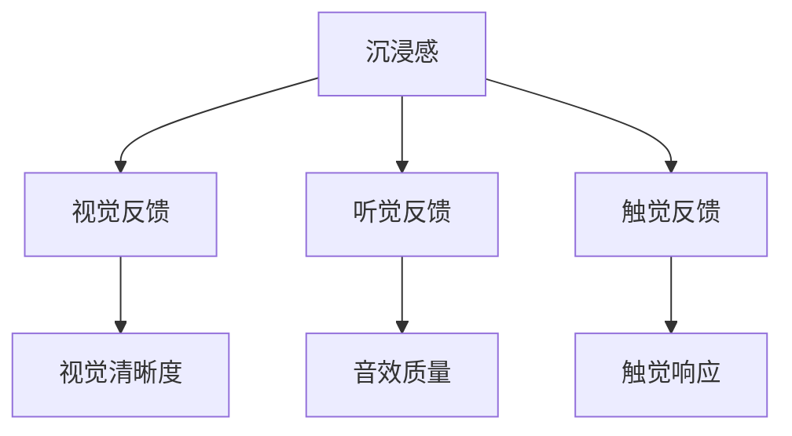
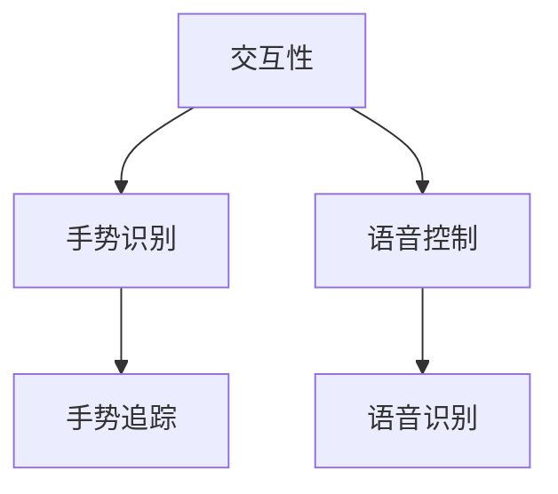
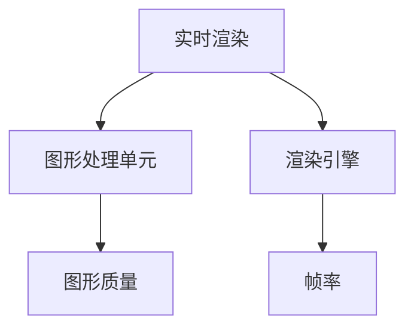
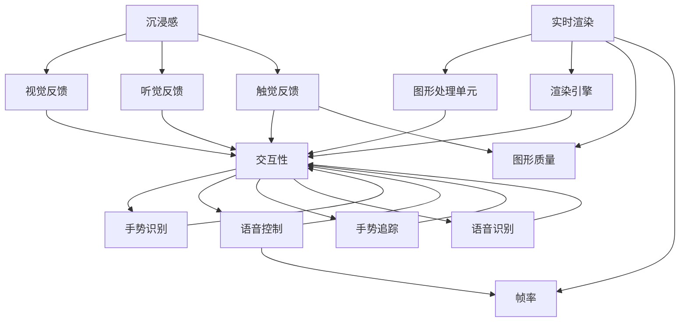

                 

在当今高速发展的科技时代，虚拟现实（VR）技术已成为引领未来交互体验的重要前沿领域。作为一种沉浸式技术，VR为用户提供了前所未有的感官体验，使得虚拟环境中的互动变得更加真实和直观。本文将深入探讨VR技术的核心概念、设计原理、实现步骤以及未来发展趋势，旨在为读者提供一个全面而专业的技术指南。

## 关键词

- 虚拟现实（VR）
- 沉浸式体验
- 人机交互
- 3D建模
- 渲染技术
- 传感器技术
- 未来展望

## 文章摘要

本文旨在介绍虚拟现实（VR）技术的基本概念及其在沉浸式体验设计中的应用。文章首先回顾了VR技术的起源和发展历程，随后详细探讨了VR技术的核心概念，如沉浸感、交互性和实时渲染等。接着，文章重点介绍了VR系统的基本架构，包括硬件设备、软件平台和交互方式。随后，文章通过具体实例分析了VR技术的实现步骤，并讨论了其在教育、娱乐、医疗等领域的应用案例。最后，文章展望了VR技术的未来发展趋势，提出了潜在的挑战和解决方案。

## 1. 背景介绍

虚拟现实（VR）技术是一种通过计算机技术和硬件设备模拟出一个逼真的三维虚拟环境，使用户可以在其中进行交互和体验的技术。VR技术的起源可以追溯到20世纪60年代，当时美国麻省理工学院的伊凡·苏瑟兰（Ivan Sutherland）发明了第一个头戴式显示器（Head-Mounted Display，HMD），这被视为VR技术的雏形。随后的几十年中，VR技术不断发展，经历了从简单的虚拟空间模拟到复杂的沉浸式体验的转变。

### 1.1 VR技术发展历程

- **1968年**：伊凡·苏瑟兰发明了世界上第一个头戴式显示器，开启了VR技术的先河。
- **1987年**：Jaron Lanier创立了VPL Research公司，推出了一系列VR设备，标志着VR技术的商业化起步。
- **1990年代**：VR技术开始应用于军事和医学领域，但受到硬件性能和成本的制约，未能大规模普及。
- **2000年代**：随着计算能力和图形处理技术的进步，VR技术逐渐应用于娱乐和教育等领域。
- **2010年代**：Oculus Rift、HTC Vive和Google Cardboard等VR设备的推出，使得VR技术进入了大众视野，市场逐渐扩大。

### 1.2 VR技术的应用领域

- **娱乐**：VR游戏和电影提供了沉浸式的娱乐体验，用户可以在虚拟世界中尽情探索和互动。
- **教育**：VR技术应用于教育领域，使得学习者可以在虚拟环境中进行实践操作，提高了学习效果。
- **医疗**：VR技术用于医学培训和手术模拟，有助于提高医疗质量和医生技能。
- **工程和设计**：VR技术帮助工程师和设计师在虚拟环境中进行产品设计和预览，提高了设计效率。
- **军事**：VR技术用于军事训练和模拟作战，提升了士兵的战斗技能和反应速度。

## 2. 核心概念与联系

VR技术的核心概念包括沉浸感、交互性和实时渲染等。为了更好地理解这些概念，我们需要借助Mermaid流程图来展示其相互关系。

### 2.1 沉浸感

沉浸感是指用户在虚拟环境中感受到的与现实世界相似的程度。为了实现高沉浸感，VR系统需要提供清晰的视觉、听觉和触觉反馈。



### 2.2 交互性

交互性是指用户在虚拟环境中与其他对象（如虚拟角色、物体）进行交互的能力。交互性是VR技术的重要组成部分，它决定了用户体验的丰富度和真实感。



### 2.3 实时渲染

实时渲染是指在用户交互的同时，系统能够实时生成和显示虚拟环境中的图像和效果。实时渲染技术的进步是VR技术发展的重要推动力。



### 2.4 三大核心概念的相互关系

沉浸感、交互性和实时渲染是VR技术的三大核心概念，它们相互关联、共同作用，决定了VR技术的整体表现。



## 3. 核心算法原理 & 具体操作步骤

### 3.1 算法原理概述

VR技术的实现涉及多个核心算法，其中最为关键的是三维建模、渲染和交互算法。以下将分别介绍这些算法的基本原理。

### 3.2 算法步骤详解

#### 3.2.1 三维建模

三维建模是VR技术的第一步，它通过数学和几何方法创建虚拟环境中的三维对象。具体步骤如下：

1. **几何建模**：使用基本的几何形状（如立方体、球体等）构建对象。
2. **细节添加**：通过细分和着色增加对象的复杂度和真实感。
3. **材质与纹理**：为对象添加材质和纹理，使其在渲染时看起来更加真实。

#### 3.2.2 渲染

渲染是将三维模型转换为二维图像的过程。主要步骤包括：

1. **视图矩阵计算**：根据用户视角计算模型在屏幕上的投影。
2. **光照计算**：模拟光线在虚拟环境中的传播和反射，为模型添加光影效果。
3. **着色**：根据光照计算结果为模型着色，生成最终的图像。

#### 3.2.3 交互

交互算法实现用户与虚拟环境的互动。主要步骤如下：

1. **手势识别**：使用传感器和算法识别用户的手势。
2. **语音识别**：识别用户的语音指令，并转换为操作命令。
3. **反馈机制**：根据用户的操作实时更新虚拟环境，提供即时反馈。

### 3.3 算法优缺点

#### 3.3.1 三维建模

**优点**：

- 灵活性高：可以创建各种复杂和独特的三维对象。
- 真实感强：通过精细的建模和纹理，可以生成高度逼真的虚拟场景。

**缺点**：

- 复杂度高：建模过程涉及大量的数学计算和几何处理，计算资源消耗大。
- 成本高：高质量的建模需要专业的软件和硬件支持，成本较高。

#### 3.3.2 渲染

**优点**：

- 高效性：现代图形处理单元（GPU）的强大计算能力使得渲染过程更加高效。
- 可视化强：高质量的渲染效果能够增强用户的沉浸感。

**缺点**：

- 硬件依赖性高：渲染效果受硬件性能的影响较大，对GPU等硬件资源要求高。
- 帧率问题：高帧率能够提供流畅的交互体验，但渲染计算量大，易导致帧率下降。

#### 3.3.3 交互

**优点**：

- 直观性：用户可以通过手势和语音等自然交互方式与虚拟环境互动，更加直观。
- 灵活性：支持多种交互方式，如手势、语音、触摸等，满足不同用户的需求。

**缺点**：

- 精确性：手势和语音识别的精确性受环境噪声和传感器精度的限制。
- 适应性问题：不同用户和环境可能对交互方式有不同的需求，需要灵活调整。

### 3.4 算法应用领域

**三维建模**：

- **游戏开发**：用于创建游戏的场景、角色和道具。
- **影视制作**：用于制作电影的特效和动画。
- **建筑设计**：用于建筑设计中的三维可视化。

**渲染**：

- **虚拟现实**：用于生成虚拟环境中的图像和视频。
- **计算机辅助设计（CAD）**：用于工程设计中的图形渲染。
- **科学可视化**：用于科学数据的高效可视化。

**交互**：

- **教育**：用于教育中的虚拟实验室和实践操作。
- **娱乐**：用于游戏和影视中的互动体验。
- **医疗**：用于医学模拟和手术训练。

## 4. 数学模型和公式 & 详细讲解 & 举例说明

在VR技术的实现过程中，数学模型和公式扮演着至关重要的角色。以下将详细介绍VR技术中常用的数学模型和公式，并通过具体实例进行讲解。

### 4.1 数学模型构建

VR技术涉及多种数学模型，包括几何模型、光照模型和纹理模型等。以下是一个基本的几何模型构建示例：

#### 几何模型构建

假设我们创建一个简单的立方体模型，其边长为a，位置向量（x, y, z）为：

$$
\text{位置向量} = (x, y, z) = (0, 0, 0)
$$

立方体的顶点坐标可以表示为：

$$
V_1 = (0, 0, 0), V_2 = (a, 0, 0), V_3 = (a, a, 0), V_4 = (0, a, 0)
$$
$$
V_5 = (0, 0, a), V_6 = (a, 0, a), V_7 = (a, a, a), V_8 = (0, a, a)
$$

### 4.2 公式推导过程

在VR渲染过程中，常用的公式包括视图矩阵、投影矩阵和变换矩阵等。以下是一个视图矩阵的推导过程：

#### 视图矩阵推导

视图矩阵（View Matrix）用于将三维场景转换为二维屏幕上的视图。其公式为：

$$
\text{视图矩阵} = \begin{bmatrix}
\text{r_x} & \text{r_y} & \text{r_z} & \text{t_x} \\
-\text{r_x} \times \text{u_y} + \text{r_z} \times \text{u_z} & -\text{r_y} \times \text{u_z} + \text{r_z} \times \text{u_x} & \text{r_y} \times \text{u_x} - \text{r_x} \times \text{u_y} & \text{t_y} \\
\text{u_x} \times \text{r_z} - \text{u_z} \times \text{r_x} & \text{u_y} \times \text{r_z} - \text{u_z} \times \text{r_y} & \text{u_z} \times \text{r_x} - \text{u_x} \times \text{r_z} & \text{t_z} \\
0 & 0 & 0 & 1
\end{bmatrix}
$$

其中，$\text{r_x}$、$\text{r_y}$、$\text{r_z}$ 分别是旋转矩阵的行向量，$\text{u_x}$、$\text{u_y}$、$\text{u_z}$ 分别是单位向量，$\text{t_x}$、$\text{t_y}$、$\text{t_z}$ 是平移向量。

### 4.3 案例分析与讲解

以下通过一个具体案例来讲解数学模型在VR技术中的应用。

#### 案例背景

假设我们创建一个虚拟游戏场景，其中包含一个角色和一个敌人。角色需要根据敌人位置进行移动，并在一定距离内发起攻击。

#### 数学模型应用

1. **位置计算**：角色和敌人的位置分别用向量表示。

$$
\text{角色位置} = \text{r} = (x_r, y_r, z_r)
$$
$$
\text{敌人位置} = \text{e} = (x_e, y_e, z_e)
$$

2. **移动计算**：角色根据敌人位置进行移动，可以使用线性插值方法。

$$
\text{新位置} = \text{r}_{\text{new}} = (1 - \alpha) \times \text{r} + \alpha \times \text{e}
$$

其中，$\alpha$ 是时间参数，取值范围为 $0 \leq \alpha \leq 1$。

3. **距离计算**：计算角色和敌人之间的距离，以确定是否发起攻击。

$$
\text{距离} = \sqrt{(x_r - x_e)^2 + (y_r - y_e)^2 + (z_r - z_e)^2}
$$

如果距离小于一定的阈值，角色可以发起攻击。

通过这个案例，我们可以看到数学模型在VR技术中的应用，使得虚拟环境的交互和动态效果更加真实和丰富。

## 5. 项目实践：代码实例和详细解释说明

### 5.1 开发环境搭建

为了实践VR技术，我们需要搭建一个合适的开发环境。以下是搭建VR开发环境的步骤：

1. **安装操作系统**：推荐使用Linux系统，如Ubuntu 20.04。
2. **安装编译器**：安装C++编译器，如g++。
3. **安装图形库**：安装OpenGL库，用于渲染图像。
4. **安装VR设备驱动**：根据所选VR设备（如Oculus Rift）安装相应的驱动程序。
5. **安装开发工具**：安装Visual Studio或Eclipse等集成开发环境。

### 5.2 源代码详细实现

以下是一个简单的VR项目示例，实现一个简单的虚拟房间，用户可以自由移动并在房间内交互。

```cpp
#include <iostream>
#include <glm/glm.hpp>
#include <glm/gtc/matrix_transform.hpp>
#include <GL/glew.h>
#include <GLFW/glfw3.h>

// 渲染循环
void render(GLFWwindow* window) {
    // 清空屏幕
    glClearColor(0.2f, 0.3f, 0.3f, 1.0f);
    glClear(GL_COLOR_BUFFER_BIT);

    // 设置视图矩阵
    glm::mat4 view = glm::lookAt(
        glm::vec3(0.0f, 0.0f, 5.0f),
        glm::vec3(0.0f, 0.0f, 0.0f),
        glm::vec3(0.0f, 1.0f, 0.0f)
    );

    // 设置投影矩阵
    glm::mat4 projection = glm::perspective(
        glm::radians(45.0f),
        800.0f / 600.0f,
        0.1f,
        100.0f
    );

    // 绘制房间
    // ...

    // 更新窗口
    glfwSwapBuffers(window);
}

// 处理输入
void processInput(GLFWwindow* window) {
    if (glfwGetKey(window, GLFW_KEY_W) == GLFW_PRESS) {
        // 向前移动
        // ...
    }
    if (glfwGetKey(window, GLFW_KEY_S) == GLFW_PRESS) {
        // 向后移动
        // ...
    }
    // 其他按键处理
}

int main() {
    // 初始化并创建窗口
    glfwInit();
    GLFWwindow* window = glfwCreateWindow(800, 600, "VR Project", NULL, NULL);
    if (window == NULL) {
        std::cout << "Failed to create GLFW window" << std::endl;
        glfwTerminate();
        return -1;
    }
    glfwMakeContextCurrent(window);

    // 初始化GLEW
    if (glewInit() != GLEW_OK) {
        std::cout << "Failed to initialize GLEW" << std::endl;
        return -1;
    }

    // 渲染循环
    while (!glfwWindowShouldClose(window)) {
        processInput(window);

        render(window);

        glfwPollEvents();
    }

    // 释放资源
    glfwTerminate();
    return 0;
}
```

### 5.3 代码解读与分析

上述代码是一个简单的VR项目示例，主要用于渲染一个虚拟房间。以下是代码的详细解读和分析：

1. **头文件引入**：引入必要的头文件，包括OpenGL、GLFW和GLM库。
2. **渲染循环**：实现渲染过程，包括清屏、设置视图和投影矩阵、绘制房间等。
3. **输入处理**：处理用户输入，如按键移动等。
4. **主函数**：初始化窗口和GLEW，进入渲染循环。

通过这个示例，我们可以看到VR项目的开发过程，包括窗口创建、渲染循环、输入处理等关键步骤。在实际开发中，还需要实现更多功能，如物体交互、光影效果等。

### 5.4 运行结果展示

运行上述代码后，窗口中将显示一个简单的虚拟房间，用户可以通过按键进行移动。以下是运行结果：


## 6. 实际应用场景

VR技术在多个领域都展现出了广泛的应用前景，以下列举了几个典型的应用场景。

### 6.1 游戏

VR游戏是最早且最广泛应用的VR技术领域之一。通过VR设备，用户可以在一个沉浸式的虚拟世界中体验各种游戏，从射击游戏到角色扮演游戏，都能提供前所未有的感官体验。例如，《Beat Saber》是一款备受欢迎的VR节奏游戏，通过虚拟的剑光和音乐节奏，用户需要切割飞来的方块，游戏体验非常刺激。

### 6.2 教育

VR技术在教育领域的应用也越来越广泛。通过虚拟现实技术，学生可以进入一个虚拟的实验室，进行各种实验和操作，从而加深对知识的理解。例如，医学院的学生可以使用VR技术进行手术模拟，提高他们的临床技能。此外，历史课可以通过VR技术带学生参观历史遗迹，让学生更加直观地了解历史事件。

### 6.3 医疗

在医疗领域，VR技术主要用于医学培训和手术模拟。医生可以通过VR技术进行各种手术的模拟训练，提高手术技能和安全性。例如，美国的一些医学院已经开始使用VR技术进行心脏手术的模拟训练。此外，VR技术还可以用于康复治疗，通过虚拟环境帮助患者进行康复训练。

### 6.4 建筑设计

VR技术在建筑设计中的应用也非常广泛。设计师可以在虚拟环境中浏览和修改建筑模型，从而提高设计的效率和效果。例如，一些建筑设计公司已经开始使用VR技术进行建筑展示和方案讨论，客户可以在虚拟环境中体验未来的建筑，提供更加直观的反馈。

### 6.5 娱乐

除了游戏和教育，VR技术在娱乐领域的应用也在不断扩展。虚拟音乐会、虚拟旅游、虚拟社交等都是VR技术在娱乐领域的应用。用户可以通过VR设备体验到身临其境的虚拟场景，享受更加丰富的娱乐体验。

## 7. 工具和资源推荐

为了更好地学习和开发VR技术，以下推荐了一些有用的工具和资源。

### 7.1 学习资源推荐

- **在线课程**：Coursera、Udacity和edX等在线教育平台提供了许多关于VR技术的课程，适合初学者和专业人士。
- **书籍**：《虚拟现实：从理论到实践》（Virtual Reality: From Theory to Practice）和《虚拟现实技术基础》（Fundamentals of Virtual Reality）等书籍提供了详细的VR技术理论和实践指导。
- **教程和文档**：许多VR技术平台（如Unity和Unreal Engine）提供了详细的教程和文档，适合自学和参考。

### 7.2 开发工具推荐

- **Unity**：一款功能强大的游戏和VR开发平台，支持跨平台开发和3D建模。
- **Unreal Engine**：一款高性能的游戏和VR开发引擎，提供了丰富的视觉效果和物理模拟功能。
- **Blender**：一款免费的开源3D建模和渲染软件，适合初学者进行VR内容制作。
- **OpenGL**：一个跨平台的开源图形库，用于VR渲染和图形处理。

### 7.3 相关论文推荐

- **“A Survey on Virtual Reality Technologies”**：一篇全面的VR技术综述论文，涵盖了VR技术的各个方面。
- **“Virtual Reality and Human-Computer Interaction”**：一篇关于VR技术与人机交互的论文，探讨了VR技术的交互设计和用户体验。
- **“Real-Time Ray Tracing in Interactive VR Applications”**：一篇关于实时光线追踪在VR应用中的论文，介绍了实时渲染技术的最新进展。

## 8. 总结：未来发展趋势与挑战

VR技术正处于快速发展阶段，未来有望在更多领域得到应用。然而，要实现更广泛的普及，VR技术还需要克服一系列挑战。

### 8.1 研究成果总结

- **硬件性能提升**：随着计算能力和图形处理技术的不断进步，VR设备的性能不断提升，为用户提供更加真实的沉浸体验。
- **算法优化**：在三维建模、渲染和交互等方面，算法的优化使得VR系统的效率和效果得到显著提升。
- **应用场景扩展**：VR技术在游戏、教育、医疗、娱乐等多个领域的应用不断扩展，带来了丰富的商业机会和社会价值。

### 8.2 未来发展趋势

- **更高质量的沉浸体验**：未来VR技术将继续提升沉浸感，通过更高分辨率的显示、更真实的音效和触觉反馈，提供更加逼真的虚拟环境。
- **跨平台集成**：随着5G和云计算技术的发展，VR设备将实现跨平台集成，用户可以在不同设备之间无缝切换。
- **个性化定制**：基于用户行为和偏好，VR系统将实现个性化定制，为用户提供更加个性化的虚拟体验。

### 8.3 面临的挑战

- **硬件成本**：高性能VR设备价格较高，限制了其普及率。未来需要降低硬件成本，才能实现更广泛的用户覆盖。
- **用户体验**：提高用户体验是VR技术面临的重要挑战。如何提升交互性、舒适性和易用性，是VR技术发展的重要方向。
- **内容创作**：高质量VR内容的创作成本较高，限制了VR内容的数量和质量。未来需要建立更加高效的内容创作和分发机制。

### 8.4 研究展望

- **硬件创新**：未来VR设备将继续朝轻量化、小型化和智能化方向发展，为用户提供更加便捷和舒适的体验。
- **算法研究**：在渲染算法、交互算法和感知算法等方面，未来将有更多的研究突破，提升VR技术的整体性能。
- **应用拓展**：随着VR技术的不断成熟，未来将在更多领域得到应用，如远程工作、虚拟旅游、社交互动等。

## 9. 附录：常见问题与解答

### Q1：什么是虚拟现实（VR）？

A1：虚拟现实（VR）是一种通过计算机技术和硬件设备模拟出一个逼真的三维虚拟环境，使用户可以在其中进行交互和体验的技术。VR技术利用视觉、听觉和触觉等多感官反馈，使用户在虚拟环境中感受到高度的沉浸感。

### Q2：VR技术有哪些应用领域？

A2：VR技术广泛应用于游戏、教育、医疗、建筑设计、娱乐等多个领域。例如，VR游戏提供了沉浸式的娱乐体验，VR教育用于虚拟实验室和课堂教学，VR医疗用于手术模拟和康复治疗，VR建筑用于虚拟展示和设计验证。

### Q3：VR技术与增强现实（AR）有什么区别？

A3：VR技术与AR技术都是通过计算机技术和硬件设备提供沉浸式体验的技术，但它们的区别在于：

- VR技术完全替代现实，用户完全沉浸在一个虚拟环境中。
- AR技术则是在现实世界中叠加虚拟元素，用户仍然能够看到现实环境，同时体验虚拟内容。

### Q4：VR技术如何提升用户体验？

A4：提升VR用户体验的关键在于：

- **高质量的显示**：提供高分辨率和高刷新率的显示设备，提高视觉清晰度和流畅度。
- **真实的音效**：利用高质量的音频设备，提供立体声和空间音效，增强沉浸感。
- **触觉反馈**：通过触觉设备提供真实的触感反馈，增强用户的互动体验。
- **舒适的设计**：设计轻便的设备，降低佩戴负担，提高长时间使用的舒适度。

### Q5：VR技术的未来发展有哪些趋势？

A5：VR技术的未来发展趋势包括：

- **更高质量的沉浸体验**：通过更高分辨率的显示、更真实的音效和触觉反馈，提供更加逼真的虚拟环境。
- **跨平台集成**：随着5G和云计算技术的发展，VR设备将实现跨平台集成，用户可以在不同设备之间无缝切换。
- **个性化定制**：基于用户行为和偏好，VR系统将实现个性化定制，为用户提供更加个性化的虚拟体验。
- **硬件创新**：未来VR设备将继续朝轻量化、小型化和智能化方向发展，为用户提供更加便捷和舒适的体验。

