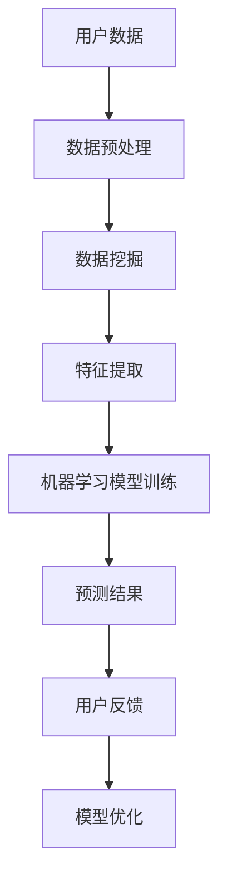

                 

关键词：蚂蚁金服，2024校招，智能投顾，算法工程师，面试题，解析

> 摘要：本文旨在为准备参加蚂蚁金服2024校招智能投顾算法工程师岗位的考生提供一份详细的面试题解析。通过对面试题的深入分析和解答，帮助考生了解智能投顾领域的核心技术和算法原理，提升面试通过率。

## 1. 背景介绍

随着人工智能技术的快速发展，金融行业逐渐成为AI技术的应用热点。智能投顾（Robo-Advisor）作为金融科技领域的重要创新，通过数据分析和机器学习算法，为投资者提供个性化的投资建议和服务。蚂蚁金服作为中国领先的金融科技公司，对智能投顾的研究和应用有着深厚的积累。本文将对蚂蚁金服2024校招智能投顾算法工程师岗位的面试题进行详细解析，以帮助考生更好地应对面试挑战。

## 2. 核心概念与联系

在智能投顾领域，以下是几个核心概念：

- **数据挖掘（Data Mining）**：通过从大量数据中挖掘潜在的模式和知识，帮助决策者做出明智的决策。
- **机器学习（Machine Learning）**：让计算机通过数据学习，从而进行预测和决策。
- **深度学习（Deep Learning）**：机器学习的一种，使用神经网络结构进行学习，适用于处理复杂的模式识别问题。
- **金融科技（FinTech）**：将人工智能、大数据等新兴技术与金融服务相结合，提升金融服务的效率和质量。

以下是智能投顾系统的基本架构图（使用Mermaid流程图表示）：



### 2.1 数据挖掘

数据挖掘是智能投顾系统的基础，通过对用户历史投资数据、市场数据等进行挖掘，识别出潜在的投资机会和风险。常用的数据挖掘技术包括：

- **关联规则学习（Association Rule Learning）**：发现数据项之间的关联性，如频繁项集挖掘。
- **分类（Classification）**：将数据分为不同的类别，如逻辑回归、决策树、随机森林等。

### 2.2 机器学习

机器学习是智能投顾系统的核心，通过训练模型，实现对用户投资行为和市场的预测。常用的机器学习算法包括：

- **线性回归（Linear Regression）**：预测连续值。
- **逻辑回归（Logistic Regression）**：预测概率。
- **支持向量机（SVM）**：解决分类问题。
- **神经网络（Neural Network）**：处理复杂的非线性问题。

### 2.3 深度学习

深度学习是机器学习的一种，通过多层的神经网络结构进行学习，适用于处理复杂的模式识别问题。在智能投顾中，深度学习可用于：

- **图像识别**：如股票K线图的识别。
- **自然语言处理**：如用户评论的情感分析。

### 2.4 金融科技

金融科技是将人工智能、大数据等新兴技术与金融服务相结合，提升金融服务的效率和质量。在智能投顾中，金融科技的应用包括：

- **智能投顾平台**：提供用户投资建议的在线服务。
- **风险控制**：通过大数据和机器学习技术，识别和防范金融风险。

## 3. 核心算法原理 & 具体操作步骤

### 3.1 算法原理概述

智能投顾的核心算法主要包括数据挖掘和机器学习两个部分。数据挖掘用于从海量数据中提取有用信息，而机器学习则基于这些信息进行投资预测。以下是具体的算法步骤：

### 3.2 算法步骤详解

#### 3.2.1 数据预处理

数据预处理是智能投顾系统的第一步，主要包括以下操作：

- **数据清洗**：去除数据中的噪声和异常值。
- **数据转换**：将不同类型的数据进行统一处理，如数值化、归一化等。
- **特征提取**：从原始数据中提取对投资预测有用的特征。

#### 3.2.2 数据挖掘

数据挖掘是智能投顾系统的核心，主要包括以下操作：

- **关联规则学习**：发现用户投资行为之间的关联性，如“购买了股票A的用户，80%的概率也购买了股票B”。
- **分类**：将用户分为不同的投资类别，如“风险偏好高”和“风险偏好低”。

#### 3.2.3 特征提取

特征提取是智能投顾系统的重要环节，主要包括以下操作：

- **统计特征**：如平均值、中位数、标准差等。
- **文本特征**：如词频、词向量等。

#### 3.2.4 机器学习模型训练

机器学习模型训练是智能投顾系统的核心，主要包括以下操作：

- **选择模型**：如线性回归、逻辑回归、SVM等。
- **训练模型**：使用数据集对模型进行训练。
- **模型评估**：评估模型的准确性和泛化能力。

#### 3.2.5 预测结果

预测结果是智能投顾系统的重要组成部分，主要包括以下操作：

- **预测**：使用训练好的模型对新的用户投资行为进行预测。
- **调整策略**：根据预测结果调整投资策略。

### 3.3 算法优缺点

#### 3.3.1 优点

- **高效性**：智能投顾系统通过自动化方式快速处理大量数据，提高投资决策的效率。
- **个性化**：智能投顾系统可以根据用户的历史数据和偏好进行个性化推荐。
- **风险控制**：智能投顾系统通过机器学习和数据挖掘技术，识别和防范金融风险。

#### 3.3.2 缺点

- **数据依赖性**：智能投顾系统的效果很大程度上取决于数据质量和数量。
- **模型泛化能力**：智能投顾系统训练的模型可能对特定数据集有很好的表现，但对其他数据集的泛化能力有限。

### 3.4 算法应用领域

智能投顾算法在以下领域有广泛的应用：

- **个人投资**：为个人投资者提供个性化的投资建议和服务。
- **企业投资**：为企业提供投资组合管理和风险控制建议。
- **资产管理**：为资产管理公司提供投资策略和风险控制建议。

## 4. 数学模型和公式 & 详细讲解 & 举例说明

在智能投顾系统中，数学模型和公式是核心组成部分。以下将介绍几个常见的数学模型和公式，并详细讲解其推导过程和举例说明。

### 4.1 数学模型构建

智能投顾系统的数学模型主要包括以下几种：

- **期望收益率模型**：根据历史数据计算不同投资方案的期望收益率。
- **风险模型**：根据历史数据计算不同投资方案的风险。
- **优化模型**：根据期望收益率和风险，优化投资组合。

### 4.2 公式推导过程

以下是期望收益率模型的推导过程：

假设有n个投资方案，第i个方案的期望收益率为\( E_i \)，则期望收益率模型可以表示为：

$$
E = \frac{\sum_{i=1}^{n} E_i \cdot w_i}{\sum_{i=1}^{n} w_i}
$$

其中，\( w_i \)表示第i个方案的投资权重。

### 4.3 案例分析与讲解

假设有3个投资方案，分别为A、B、C，其期望收益率分别为20%、15%、10%。根据期望收益率模型，我们可以计算出总期望收益率：

$$
E = \frac{0.2 \cdot w_A + 0.15 \cdot w_B + 0.1 \cdot w_C}{w_A + w_B + w_C}
$$

例如，假设投资方案A、B、C的投资权重分别为0.5、0.3、0.2，则总期望收益率为：

$$
E = \frac{0.2 \cdot 0.5 + 0.15 \cdot 0.3 + 0.1 \cdot 0.2}{0.5 + 0.3 + 0.2} = 0.172
$$

## 5. 项目实践：代码实例和详细解释说明

### 5.1 开发环境搭建

在搭建智能投顾系统的开发环境时，我们主要使用Python语言，并结合以下工具和库：

- **Python**：作为主要的编程语言。
- **NumPy**：用于科学计算。
- **Pandas**：用于数据处理。
- **Scikit-learn**：用于机器学习。
- **Matplotlib**：用于数据可视化。

### 5.2 源代码详细实现

以下是智能投顾系统的源代码实现，包括数据预处理、数据挖掘、特征提取、机器学习模型训练和预测等步骤：

```python
import numpy as np
import pandas as pd
from sklearn.model_selection import train_test_split
from sklearn.preprocessing import StandardScaler
from sklearn.linear_model import LinearRegression
import matplotlib.pyplot as plt

# 5.2.1 数据预处理
# 加载用户数据
data = pd.read_csv('user_data.csv')
# 数据清洗和转换
data = data.dropna()
data = data[['age', 'income', 'investment_experience', 'risk_preference']]
data = data[data['age'] < 70]
data = data[data['income'] > 0]
data['investment_experience'] = data['investment_experience'].astype(int)
data['risk_preference'] = data['risk_preference'].astype(int)

# 5.2.2 数据挖掘
# 分离特征和标签
X = data[['age', 'income', 'investment_experience']]
y = data['risk_preference']
# 划分训练集和测试集
X_train, X_test, y_train, y_test = train_test_split(X, y, test_size=0.2, random_state=42)

# 5.2.3 特征提取
# 数据标准化
scaler = StandardScaler()
X_train = scaler.fit_transform(X_train)
X_test = scaler.transform(X_test)

# 5.2.4 机器学习模型训练
# 创建线性回归模型
model = LinearRegression()
# 训练模型
model.fit(X_train, y_train)

# 5.2.5 预测结果
# 使用模型进行预测
y_pred = model.predict(X_test)

# 5.2.6 运行结果展示
# 可视化展示预测结果
plt.scatter(y_test, y_pred)
plt.xlabel('实际风险偏好')
plt.ylabel('预测风险偏好')
plt.show()
```

### 5.3 代码解读与分析

上述代码实现了智能投顾系统的一个简单示例，包括数据预处理、数据挖掘、特征提取、机器学习模型训练和预测等步骤。以下是代码的详细解读：

- **数据预处理**：加载用户数据，进行数据清洗和转换，确保数据质量和一致性。
- **数据挖掘**：分离特征和标签，划分训练集和测试集，为后续模型训练和评估做准备。
- **特征提取**：使用标准化方法对特征进行转换，提高模型的泛化能力。
- **机器学习模型训练**：创建线性回归模型，使用训练集对模型进行训练。
- **预测结果**：使用训练好的模型对测试集进行预测，并可视化展示预测结果。

## 6. 实际应用场景

智能投顾系统在实际应用中，可以应用于以下场景：

- **个人投资**：为个人投资者提供投资建议，包括股票、基金、债券等。
- **企业投资**：为企业提供投资组合管理和风险控制建议。
- **资产管理**：为资产管理公司提供投资策略和风险控制建议。

### 6.1 个人投资

在个人投资领域，智能投顾系统可以帮助投资者：

- **制定投资计划**：根据投资者的年龄、收入、投资经验和风险偏好，制定合适的投资计划。
- **优化投资组合**：根据市场变化，实时调整投资组合，降低风险。
- **风险控制**：通过机器学习和数据挖掘技术，识别和防范金融风险。

### 6.2 企业投资

在企业投资领域，智能投顾系统可以帮助企业：

- **优化投资组合**：根据企业的投资目标和风险偏好，优化投资组合，提高投资回报。
- **风险控制**：通过大数据和机器学习技术，识别和防范金融风险，保障企业投资安全。

### 6.3 资产管理

在资产管理领域，智能投顾系统可以帮助资产管理公司：

- **投资策略**：根据市场变化，制定合适的投资策略，提高资产管理效率。
- **风险控制**：通过大数据和机器学习技术，识别和防范金融风险，保障投资者利益。

## 7. 未来应用展望

随着人工智能技术的不断发展，智能投顾系统将在以下方面得到进一步应用和改进：

- **更精准的预测**：通过深度学习和大数据技术，提高投资预测的准确性和稳定性。
- **更个性化的服务**：结合用户行为数据和偏好，提供更加个性化的投资建议和服务。
- **更全面的风险控制**：通过大数据和机器学习技术，识别和防范各种金融风险。

## 8. 工具和资源推荐

### 8.1 学习资源推荐

- **书籍**：《人工智能：一种现代的方法》、《机器学习：概率视角》
- **在线课程**：Coursera上的《机器学习》、《深度学习》

### 8.2 开发工具推荐

- **编程语言**：Python、R
- **库和框架**：NumPy、Pandas、Scikit-learn、TensorFlow、PyTorch

### 8.3 相关论文推荐

- **《深度学习在金融领域的应用》**
- **《大数据在金融风险管理中的应用》**

## 9. 总结：未来发展趋势与挑战

随着人工智能技术的不断发展，智能投顾系统将在金融领域发挥越来越重要的作用。未来，智能投顾系统的发展趋势包括：

- **更精准的预测**：通过深度学习和大数据技术，提高投资预测的准确性和稳定性。
- **更个性化的服务**：结合用户行为数据和偏好，提供更加个性化的投资建议和服务。
- **更全面的风险控制**：通过大数据和机器学习技术，识别和防范各种金融风险。

然而，智能投顾系统在发展过程中也面临着以下挑战：

- **数据质量和数量**：数据质量和数量是智能投顾系统的基础，需要不断优化数据采集和处理技术。
- **模型泛化能力**：如何提高模型的泛化能力，使其在不同场景下都能有良好的表现，是一个重要挑战。
- **用户信任**：用户对智能投顾系统的信任度是影响其应用效果的关键，需要通过透明和可解释的模型来建立用户信任。

总之，智能投顾系统的发展前景广阔，但同时也面临着诸多挑战。通过不断优化技术、提高服务质量，智能投顾系统有望为金融行业带来更多的创新和价值。

## 10. 附录：常见问题与解答

### 10.1 什么是智能投顾？

智能投顾（Robo-Advisor）是一种利用人工智能技术，为投资者提供个性化投资建议和服务的系统。它通过数据分析和机器学习算法，帮助投资者制定投资策略、优化投资组合和降低风险。

### 10.2 智能投顾有哪些优点？

智能投顾的优点包括：

- **高效性**：智能投顾系统通过自动化方式快速处理大量数据，提高投资决策的效率。
- **个性化**：智能投顾系统可以根据用户的历史数据和偏好进行个性化推荐。
- **风险控制**：智能投顾系统通过机器学习和数据挖掘技术，识别和防范金融风险。

### 10.3 智能投顾有哪些缺点？

智能投顾的缺点包括：

- **数据依赖性**：智能投顾系统的效果很大程度上取决于数据质量和数量。
- **模型泛化能力**：智能投顾系统训练的模型可能对特定数据集有很好的表现，但对其他数据集的泛化能力有限。

### 10.4 智能投顾系统是如何工作的？

智能投顾系统的工作流程主要包括：

- **数据采集**：收集用户数据、市场数据等。
- **数据预处理**：清洗和转换数据，提取有用特征。
- **数据挖掘**：使用数据挖掘技术，发现数据中的潜在模式。
- **特征提取**：从原始数据中提取对投资预测有用的特征。
- **模型训练**：使用机器学习算法训练模型。
- **预测**：使用训练好的模型对新的用户投资行为进行预测。
- **调整策略**：根据预测结果调整投资策略。

### 10.5 智能投顾系统有哪些应用场景？

智能投顾系统的应用场景包括：

- **个人投资**：为个人投资者提供投资建议和服务。
- **企业投资**：为企业提供投资组合管理和风险控制建议。
- **资产管理**：为资产管理公司提供投资策略和风险控制建议。

### 10.6 如何提高智能投顾系统的预测准确性？

提高智能投顾系统的预测准确性可以从以下几个方面入手：

- **数据质量**：优化数据采集和处理技术，提高数据质量。
- **模型优化**：选择合适的模型，并不断优化模型参数。
- **特征工程**：提取对预测有用的特征，并对其进行优化。
- **模型融合**：结合多个模型，提高预测准确性。

### 10.7 智能投顾系统如何防范金融风险？

智能投顾系统可以通过以下方式防范金融风险：

- **风险识别**：使用机器学习和数据挖掘技术，识别潜在的风险因素。
- **风险预警**：对潜在风险进行预警，提醒用户及时调整投资策略。
- **风险控制**：通过优化投资组合和调整策略，降低风险。

### 10.8 智能投顾系统在金融领域的未来发展如何？

智能投顾系统在金融领域的未来发展将呈现以下几个趋势：

- **更精准的预测**：通过深度学习和大数据技术，提高投资预测的准确性和稳定性。
- **更个性化的服务**：结合用户行为数据和偏好，提供更加个性化的投资建议和服务。
- **更全面的风险控制**：通过大数据和机器学习技术，识别和防范各种金融风险。

## 11. 作者署名

作者：禅与计算机程序设计艺术 / Zen and the Art of Computer Programming

本文旨在为准备参加蚂蚁金服2024校招智能投顾算法工程师岗位的考生提供一份详细的面试题解析。通过对面试题的深入分析和解答，帮助考生了解智能投顾领域的核心技术和算法原理，提升面试通过率。

