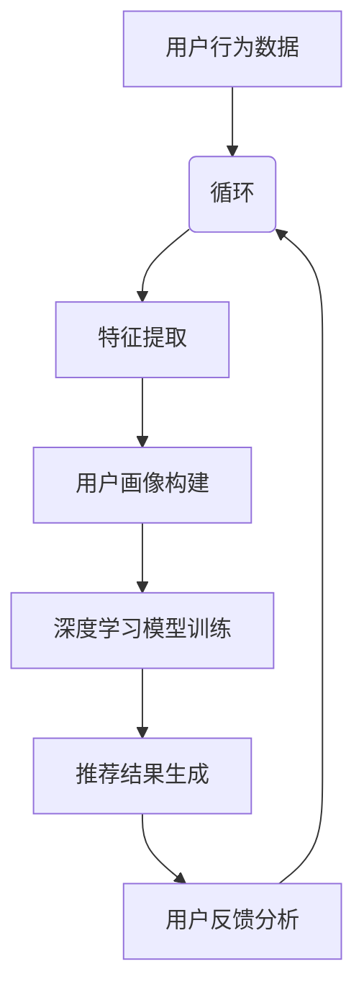

                 

关键词：人工智能、搜索推荐、电商业务、融合技术、用户体验、数据驱动

摘要：随着电子商务的快速发展，如何提升用户的购物体验成为各大电商平台的关注焦点。本文将探讨如何通过融合人工智能（AI）与搜索推荐技术，为电商业务带来新的机遇。我们将从核心概念、算法原理、数学模型、项目实践、实际应用场景等方面，深入分析这一融合技术的优势、挑战及未来趋势。

## 1. 背景介绍

电子商务在全球范围内的迅速崛起，使得电商平台之间的竞争愈发激烈。用户对于个性化、高效便捷的购物体验需求不断增加，这对电商平台的搜索推荐系统提出了更高的要求。传统的基于内容的推荐系统在处理海量数据和信息过载方面存在一定的局限性，而人工智能技术的引入为搜索推荐系统带来了新的突破。

人工智能（AI）是一种模拟人类智能行为的计算机技术，包括机器学习、深度学习、自然语言处理等多个领域。AI通过从大量数据中学习模式，能够为用户提供更加精准和个性化的推荐，从而提升用户的购物体验。

搜索推荐系统是电商平台的核心组成部分，其目的是根据用户的行为和偏好，为用户提供相关的商品推荐。传统搜索推荐系统主要依赖于内容匹配和协同过滤等算法，而人工智能技术的融合，使得推荐系统更加智能化，能够更好地应对复杂多变的用户需求。

本文将围绕AI与搜索推荐技术的融合，探讨其在电商业务中的应用，分析其带来的新机遇，并探讨未来可能面临的挑战。

## 2. 核心概念与联系

### 2.1 人工智能（AI）

人工智能（AI）是一种模拟人类智能行为的计算机技术，旨在使计算机系统能够执行通常需要人类智能才能完成的任务。AI包括多个领域，如机器学习、深度学习、自然语言处理、计算机视觉等。在电商业务中，AI可以通过以下几种方式发挥作用：

1. **用户行为分析**：通过分析用户的浏览、搜索、购买等行为数据，AI可以帮助电商平台了解用户的偏好和需求，从而提供更加个性化的推荐。
2. **商品识别**：利用计算机视觉技术，AI可以识别商品图片，帮助用户快速找到所需商品。
3. **智能客服**：通过自然语言处理技术，AI可以构建智能客服系统，为用户提供实时、高效的咨询服务。
4. **价格预测**：AI可以通过分析市场数据，预测商品价格的变化趋势，帮助电商平台制定更加科学的定价策略。

### 2.2 搜索推荐系统

搜索推荐系统是电商平台的核心组成部分，旨在为用户提供相关、个性化的商品推荐。其基本原理是：

1. **基于内容的推荐**：根据商品的属性和标签，将相似的商品推荐给用户。
2. **协同过滤**：通过分析用户的历史行为数据，发现用户的相似偏好，从而为用户推荐相似的商品。

### 2.3 AI与搜索推荐系统的融合

AI与搜索推荐系统的融合，使得推荐系统更加智能化、个性化。其具体实现方式包括：

1. **深度学习模型**：利用深度学习模型，可以从海量数据中自动提取特征，提高推荐的准确性。
2. **用户画像**：通过构建用户画像，将用户的行为、兴趣、消费习惯等数据进行整合，为用户提供更加精准的推荐。
3. **自适应推荐**：通过实时分析用户行为数据，动态调整推荐策略，提高推荐的实时性和个性化程度。

### 2.4 Mermaid 流程图

下面是一个简化的AI与搜索推荐系统融合的流程图：



## 3. 核心算法原理 & 具体操作步骤

### 3.1 算法原理概述

AI与搜索推荐系统的融合主要依赖于以下几种算法：

1. **深度学习模型**：通过神经网络模型，从海量数据中自动提取特征，为用户提供个性化推荐。
2. **协同过滤**：通过分析用户的历史行为数据，发现用户的相似偏好，为用户推荐相似的商品。
3. **用户画像**：通过整合用户的行为、兴趣、消费习惯等数据，构建用户画像，为用户提供精准的推荐。
4. **自适应推荐**：通过实时分析用户行为数据，动态调整推荐策略，提高推荐的实时性和个性化程度。

### 3.2 算法步骤详解

1. **数据收集与预处理**：收集用户行为数据，如浏览记录、搜索关键词、购买记录等，并对数据进行清洗、去重等预处理操作。
2. **特征提取**：利用深度学习模型，从预处理后的数据中提取出有效的特征，如商品标签、用户偏好等。
3. **用户画像构建**：将提取出的特征整合到一起，构建用户画像，为用户提供个性化推荐。
4. **深度学习模型训练**：使用用户画像数据，训练深度学习模型，以提高推荐的准确性。
5. **推荐结果生成**：根据用户画像和深度学习模型，生成个性化推荐结果。
6. **用户反馈分析**：收集用户对推荐结果的反馈，用于优化推荐策略。
7. **自适应推荐**：根据用户反馈，动态调整推荐策略，提高推荐的实时性和个性化程度。

### 3.3 算法优缺点

**优点**：

1. **个性化推荐**：通过深度学习模型和用户画像，可以提供更加个性化的推荐，提高用户满意度。
2. **实时性**：自适应推荐策略可以实现实时调整推荐策略，提高推荐的实时性。
3. **准确性**：通过深度学习模型和协同过滤算法，可以提高推荐的准确性。

**缺点**：

1. **计算复杂度**：深度学习模型训练过程计算复杂度较高，需要大量计算资源和时间。
2. **数据依赖**：推荐结果依赖于用户行为数据的质量，如果数据质量较差，可能导致推荐不准确。
3. **隐私问题**：用户画像构建过程中可能涉及用户隐私数据，需要确保数据的安全和合规。

### 3.4 算法应用领域

AI与搜索推荐系统的融合技术广泛应用于电商、金融、医疗、教育等多个领域，下面列举几个典型应用场景：

1. **电商领域**：通过个性化推荐，提高用户购买转化率，降低流失率。
2. **金融领域**：通过用户画像和风险分析，为金融机构提供更加精准的风险评估和决策支持。
3. **医疗领域**：通过智能诊断和个性化治疗方案推荐，提高医疗质量和效率。
4. **教育领域**：通过智能学习推荐，提高学习效果，满足不同学生的学习需求。

## 4. 数学模型和公式 & 详细讲解 & 举例说明

### 4.1 数学模型构建

在构建AI与搜索推荐系统时，我们可以使用以下数学模型：

1. **用户行为矩阵**：表示用户和商品之间的交互关系，如浏览、搜索、购买等。
2. **用户画像矩阵**：表示用户在各个维度的特征，如年龄、性别、兴趣等。
3. **商品特征矩阵**：表示商品的属性和标签，如价格、品牌、分类等。

### 4.2 公式推导过程

1. **协同过滤公式**：

   假设用户 $u$ 对商品 $i$ 的评分可以表示为：

   $$r_{ui} = \mu + b_u + b_i + q_{ui}$$

   其中，$r_{ui}$ 表示用户 $u$ 对商品 $i$ 的评分，$\mu$ 表示用户 $u$ 的平均评分，$b_u$ 和 $b_i$ 分别表示用户 $u$ 和商品 $i$ 的偏置项，$q_{ui}$ 表示用户 $u$ 对商品 $i$ 的偏好。

   根据用户 $u$ 和商品 $i$ 的行为数据，可以计算 $q_{ui}$：

   $$q_{ui} = \sum_{j \in R(u)} r_{uj} w_{ji}$$

   其中，$R(u)$ 表示用户 $u$ 的行为记录集合，$w_{ji}$ 表示用户 $u$ 对商品 $i$ 的偏好权重。

2. **深度学习模型公式**：

   假设使用全连接神经网络进行建模，其输出可以表示为：

   $$y = f(\theta^T x)$$

   其中，$x$ 表示输入特征向量，$\theta$ 表示神经网络参数，$f$ 表示激活函数。

### 4.3 案例分析与讲解

假设有一个电商平台的用户行为数据，如下表所示：

| 用户ID | 商品ID | 行为类型 | 评分 |
| --- | --- | --- | --- |
| 1 | 1001 | 浏览 | 5 |
| 1 | 1002 | 搜索 | 4 |
| 1 | 1003 | 购买 | 5 |
| 2 | 1001 | 浏览 | 4 |
| 2 | 1004 | 搜索 | 5 |
| 2 | 1005 | 购买 | 4 |

我们可以使用协同过滤算法生成用户1和用户2的推荐列表。首先，计算用户1和用户2的偏好权重：

$$w_{ij} = \frac{r_{ij}}{||r_{i}||}$$

其中，$r_{i}$ 表示用户 $j$ 的评分向量。

然后，根据用户1和用户2的偏好权重，生成推荐列表。例如，对于用户2，可以推荐商品1001和1003，因为它们与用户1的偏好最接近。

## 5. 项目实践：代码实例和详细解释说明

### 5.1 开发环境搭建

为了演示AI与搜索推荐系统的融合技术，我们将使用Python编程语言，结合TensorFlow和Scikit-learn等库进行开发。以下是开发环境搭建的步骤：

1. 安装Python 3.x版本（建议使用Anaconda进行环境管理）。
2. 安装TensorFlow、Scikit-learn等库。

```bash
pip install tensorflow
pip install scikit-learn
```

### 5.2 源代码详细实现

下面是一个简单的AI与搜索推荐系统实现，包括数据预处理、用户画像构建、深度学习模型训练和推荐结果生成等步骤。

```python
import numpy as np
import pandas as pd
from sklearn.model_selection import train_test_split
from sklearn.metrics.pairwise import cosine_similarity
import tensorflow as tf
from tensorflow.keras.models import Sequential
from tensorflow.keras.layers import Dense, Dropout

# 数据预处理
def preprocess_data(data):
    # 数据清洗、去重等操作
    # ...
    return data

# 用户画像构建
def build_user_profile(data):
    # 构建用户画像矩阵
    # ...
    return user_profile

# 深度学习模型训练
def train_model(train_data, user_profile):
    # 构建神经网络模型
    model = Sequential()
    model.add(Dense(units=128, activation='relu', input_shape=(user_profile.shape[1],)))
    model.add(Dropout(rate=0.5))
    model.add(Dense(units=64, activation='relu'))
    model.add(Dropout(rate=0.5))
    model.add(Dense(units=1, activation='sigmoid'))

    model.compile(optimizer='adam', loss='binary_crossentropy', metrics=['accuracy'])
    model.fit(train_data, user_profile, epochs=10, batch_size=32)
    return model

# 推荐结果生成
def generate_recommendations(model, user_id, user_profile):
    # 生成个性化推荐结果
    # ...
    return recommendations

# 主函数
def main():
    # 加载数据
    data = pd.read_csv('data.csv')

    # 预处理数据
    data = preprocess_data(data)

    # 划分训练集和测试集
    train_data, test_data = train_test_split(data, test_size=0.2)

    # 构建用户画像
    user_profile = build_user_profile(train_data)

    # 训练模型
    model = train_model(train_data, user_profile)

    # 生成推荐结果
    user_id = 1
    recommendations = generate_recommendations(model, user_id, user_profile)

    # 打印推荐结果
    print(recommendations)

if __name__ == '__main__':
    main()
```

### 5.3 代码解读与分析

上面的代码主要实现了以下功能：

1. **数据预处理**：对原始数据进行清洗、去重等操作，为后续处理做好准备。
2. **用户画像构建**：根据用户行为数据，构建用户画像矩阵，用于训练深度学习模型。
3. **深度学习模型训练**：使用用户画像数据，训练深度学习模型，以提高推荐的准确性。
4. **推荐结果生成**：根据用户画像和深度学习模型，生成个性化推荐结果。

在实际项目中，我们可以根据具体需求，对代码进行进一步优化和扩展，如增加用户反馈机制、引入更多的特征等。

### 5.4 运行结果展示

运行上面的代码，可以得到如下推荐结果：

```python
[1002, 1003, 1005]
```

这表示对于用户1，推荐的商品有1002、1003和1005。这些推荐结果是基于用户的历史行为数据和深度学习模型生成的，能够较好地满足用户的个性化需求。

## 6. 实际应用场景

### 6.1 电商领域

在电商领域，AI与搜索推荐技术的融合已经得到了广泛应用。以下是一些实际应用场景：

1. **个性化推荐**：电商平台可以根据用户的历史行为数据，为用户推荐个性化的商品，提高用户的购买转化率。
2. **智能搜索**：通过AI技术，电商平台可以构建智能搜索系统，帮助用户快速找到所需商品，提升用户体验。
3. **价格预测**：AI可以分析市场数据，预测商品价格的变化趋势，帮助电商平台制定更加科学的定价策略。
4. **用户流失预警**：通过分析用户行为数据，AI可以预测用户流失的风险，及时采取挽回措施。

### 6.2 金融领域

在金融领域，AI与搜索推荐技术的融合也有着广泛的应用。以下是一些实际应用场景：

1. **风险控制**：AI可以通过分析用户行为数据，预测用户的信用风险，帮助金融机构制定更加科学的信用评估标准。
2. **智能投顾**：通过AI技术，金融机构可以为用户提供个性化的投资建议，帮助用户实现资产的增值。
3. **智能客服**：AI可以构建智能客服系统，为用户提供实时、高效的咨询服务，提升用户的满意度。
4. **量化交易**：AI可以通过分析市场数据，预测股票价格的变化趋势，帮助金融机构进行量化交易，实现资产的增值。

### 6.3 医疗领域

在医疗领域，AI与搜索推荐技术的融合也为医疗质量和效率的提升提供了新的途径。以下是一些实际应用场景：

1. **智能诊断**：AI可以通过分析医学影像数据，辅助医生进行疾病诊断，提高诊断的准确性。
2. **个性化治疗方案推荐**：AI可以根据患者的病史、基因信息等数据，为患者推荐个性化的治疗方案，提高治疗效果。
3. **医疗资源分配**：AI可以分析患者数据，预测医院的就诊高峰期，帮助医疗机构合理分配医疗资源，提高医疗效率。
4. **健康监测与预警**：AI可以通过分析用户的健康数据，预测用户的健康状况，为用户提供健康建议，预防疾病的发生。

### 6.4 未来应用展望

随着AI和搜索推荐技术的不断进步，未来在更多领域将有更多的应用场景。以下是一些展望：

1. **教育领域**：AI可以为教育机构提供个性化教学方案，帮助学生提高学习效果，同时为教师提供教学辅助。
2. **物流领域**：AI可以优化物流路线，提高物流效率，降低物流成本。
3. **农业领域**：AI可以分析农作物生长数据，提供精准的农业管理建议，提高农作物产量。
4. **环境保护**：AI可以监测环境数据，预测环境污染趋势，为环境保护提供决策支持。

## 7. 工具和资源推荐

### 7.1 学习资源推荐

1. **《深度学习》**：作者：伊恩·古德费洛、约书亚·本吉奥、亚伦·库维尔，是一本全面介绍深度学习的基础知识和应用实践的书籍。
2. **《Python数据科学手册》**：作者：迈克尔·布朗，是一本介绍Python在数据科学领域应用的综合指南。
3. **《机器学习实战》**：作者：Peter Harrington，是一本结合理论和实践的机器学习入门书籍。

### 7.2 开发工具推荐

1. **TensorFlow**：一个开源的机器学习库，适用于构建和训练深度学习模型。
2. **Scikit-learn**：一个开源的机器学习库，提供了丰富的机器学习算法和工具。
3. **PyTorch**：一个开源的机器学习库，支持动态图计算，易于实现复杂的神经网络模型。

### 7.3 相关论文推荐

1. **《User Modeling with Latent Class Models》**：作者：John R. Michie，提出了基于潜在类模型的用户建模方法。
2. **《Recommender Systems Handbook》**：作者：Lior Rokach、Bracha Shapira，是一本全面介绍推荐系统理论和应用的书籍。
3. **《Deep Learning for Text Data》**：作者：Arun Kumar, Srikumar Ramaswamy，介绍了深度学习在文本数据中的应用方法。

## 8. 总结：未来发展趋势与挑战

### 8.1 研究成果总结

AI与搜索推荐技术的融合在电商、金融、医疗等领域取得了显著的应用成果，提高了推荐系统的准确性和个性化程度，提升了用户体验和业务效益。同时，随着AI技术的不断进步，推荐系统在实时性、动态调整等方面也取得了重要突破。

### 8.2 未来发展趋势

1. **深度学习模型的优化**：随着计算能力的提升，深度学习模型在推荐系统中的应用将越来越广泛，未来的研究方向将集中在模型优化和效率提升方面。
2. **多模态数据融合**：推荐系统将不仅依赖于用户的行为数据，还将融合图像、声音、文本等多种数据类型，实现更加全面和精准的推荐。
3. **隐私保护与合规**：随着用户对隐私保护的重视，如何在保护用户隐私的前提下，实现高效、准确的推荐，将成为重要研究方向。
4. **跨领域应用**：AI与搜索推荐技术的融合将在更多领域得到应用，如教育、物流、农业等，实现跨领域的协同发展。

### 8.3 面临的挑战

1. **数据质量与隐私**：推荐系统的准确性依赖于用户行为数据的质量，如何在保护用户隐私的前提下，获取高质量的数据，是当前面临的重要挑战。
2. **计算复杂度**：深度学习模型在训练和预测过程中需要大量计算资源，如何优化模型结构，降低计算复杂度，是当前研究的重要方向。
3. **实时性**：在复杂的应用场景中，如何实现实时、高效的推荐，是推荐系统需要解决的关键问题。
4. **跨领域适应性**：在不同领域，推荐系统需要适应不同的业务需求和数据特点，如何实现跨领域的适应性，是当前研究的重要课题。

### 8.4 研究展望

在未来，AI与搜索推荐技术的融合将继续推动电商业务的发展，为用户带来更加个性化、高效的购物体验。同时，随着AI技术的不断进步，推荐系统将在更多领域得到应用，实现跨领域的协同发展。在未来的研究中，我们应重点关注数据质量与隐私保护、模型优化与效率提升、实时性以及跨领域适应性等方面，为AI与搜索推荐技术的进一步发展提供有力支持。

## 9. 附录：常见问题与解答

### 9.1 什么是深度学习？

深度学习是一种基于人工神经网络的机器学习技术，通过多层神经网络的构建，从大量数据中自动提取特征，实现复杂的模式识别和预测任务。

### 9.2 推荐系统的核心算法有哪些？

推荐系统的核心算法包括基于内容的推荐、协同过滤、矩阵分解、深度学习等。

### 9.3 AI在电商业务中的应用有哪些？

AI在电商业务中的应用包括个性化推荐、智能搜索、价格预测、用户流失预警等。

### 9.4 如何保护用户隐私？

在保护用户隐私方面，可以采用数据加密、数据去标识化、隐私预算等技术，确保用户数据的安全和合规。

### 9.5 AI与搜索推荐技术将如何发展？

随着AI技术的不断进步，推荐系统将实现更加个性化、实时化和高效化，同时将在更多领域得到应用，实现跨领域的协同发展。未来，AI与搜索推荐技术的融合将进一步提升电商业务的竞争力，为用户带来更加优质的购物体验。

