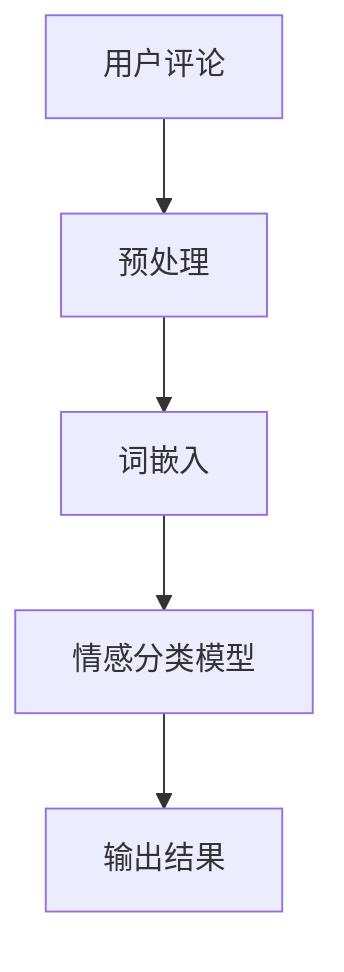

                 

关键词：AI大模型、商品评论、情感分析、文本挖掘、机器学习、深度学习

> 摘要：本文将探讨如何利用AI大模型进行商品评论的情感分析。通过梳理相关技术原理，介绍核心算法及其具体操作步骤，并通过实例分析和代码实现，展示AI大模型在商品评论情感分析中的实际应用效果。

## 1. 背景介绍

商品评论情感分析作为自然语言处理（NLP）的重要应用之一，旨在理解和挖掘用户对商品的评价情感。这些情感信息不仅对商家改进产品和服务具有指导意义，还可以为消费者提供参考。传统的情感分析方法通常依赖于规则和统计模型，如朴素贝叶斯、支持向量机（SVM）等。然而，这些方法在处理复杂情感和语义理解方面存在局限性。

随着人工智能技术的不断发展，深度学习在自然语言处理领域取得了显著突破。尤其是近年来，AI大模型的崛起，如GPT、BERT、T5等，为商品评论情感分析提供了新的思路和方法。这些大模型具有强大的语义理解能力，可以更好地捕捉复杂的情感信息。

本文将介绍如何利用AI大模型进行商品评论情感分析，包括核心算法原理、具体操作步骤、数学模型和公式推导、项目实践以及未来应用展望。

## 2. 核心概念与联系

### 2.1 自然语言处理（NLP）

自然语言处理是人工智能的一个分支，旨在使计算机能够理解、解释和生成人类语言。在商品评论情感分析中，NLP技术用于处理和解析用户评论，提取情感信息。

### 2.2 情感分析

情感分析是指使用自然语言处理技术，对文本数据中的情感倾向进行判断和分类。在商品评论情感分析中，情感分析可以帮助我们识别用户对商品是正面、负面还是中性评价。

### 2.3 AI大模型

AI大模型是指具有大规模参数和训练数据的深度学习模型，如GPT、BERT等。这些模型通过大规模数据训练，可以捕捉到复杂的语义信息，从而在情感分析任务中表现出色。

### 2.4 Mermaid 流程图

以下是商品评论情感分析的Mermaid流程图：



- 用户评论：输入待分析的评论文本。
- 预处理：对评论进行文本清洗和标记化处理。
- 词嵌入：将预处理后的文本转换为词向量。
- 情感分类模型：使用AI大模型对词向量进行情感分类。
- 输出结果：输出情感分类结果。

## 3. 核心算法原理 & 具体操作步骤

### 3.1 算法原理概述

商品评论情感分析主要分为以下三个步骤：

1. 文本预处理：对评论进行清洗、分词、去停用词等处理，为后续情感分类做准备。
2. 词嵌入：将预处理后的文本转换为词向量，用于表示文本数据。
3. 情感分类：使用AI大模型对词向量进行情感分类，输出评论的情感标签。

### 3.2 算法步骤详解

#### 3.2.1 文本预处理

1. 清洗：去除评论中的HTML标签、特殊字符、数字等。
2. 分词：将评论文本切分为单词或短语。
3. 去停用词：去除常见的无意义词汇，如“的”、“了”、“在”等。

#### 3.2.2 词嵌入

使用预训练的AI大模型（如BERT）进行词嵌入。BERT模型可以将单词转换为对应的词向量，这些向量可以捕获单词的语义信息。

#### 3.2.3 情感分类

1. 初始化模型：使用预训练的AI大模型（如BERT）初始化情感分类模型。
2. 训练模型：使用带有情感标签的训练数据进行模型训练。
3. 评估模型：使用测试集评估模型性能，调整模型参数。
4. 预测：使用训练好的模型对评论进行情感分类，输出情感标签。

### 3.3 算法优缺点

#### 优点：

1. 强大的语义理解能力：AI大模型可以捕捉复杂的语义信息，提高情感分类的准确性。
2. 自动调整模型参数：通过大规模数据训练，模型可以自动调整参数，无需手动调整。

#### 缺点：

1. 计算资源消耗大：训练AI大模型需要大量的计算资源和时间。
2. 数据依赖性强：模型的性能依赖于训练数据的质量和规模。

### 3.4 算法应用领域

AI大模型在商品评论情感分析中的应用非常广泛，包括但不限于：

1. 消费者洞察：通过分析评论情感，了解消费者的需求和偏好。
2. 产品优化：根据评论情感，改进产品和服务。
3. 客户满意度评估：通过情感分类，评估客户的满意度。

## 4. 数学模型和公式 & 详细讲解 & 举例说明

### 4.1 数学模型构建

商品评论情感分析的核心是情感分类，可以将情感分类视为一个多分类问题。假设有K个情感类别，我们需要构建一个分类模型，将评论文本映射到对应的情感类别。

设输入评论文本为\( x \)，情感类别标签为\( y \)，则分类模型的目标是最大化分类准确率：

$$
\arg\max_{\theta} P(y|x; \theta)
$$

其中，\( \theta \)表示模型参数，\( P(y|x; \theta) \)表示在参数\( \theta \)下，评论\( x \)属于类别\( y \)的概率。

### 4.2 公式推导过程

情感分类模型通常采用神经网络模型，神经网络模型的核心是前向传播和反向传播算法。以下是情感分类模型的前向传播和反向传播过程：

#### 前向传播

1. 输入评论文本\( x \)，通过词嵌入层转换为词向量\( x' \)。
2. 将词向量输入到神经网络层，得到神经网络的输出\( z \)。
3. 使用softmax函数计算每个类别的概率分布\( \hat{y} \)。

$$
z = \sigma(Wx' + b)
$$

$$
\hat{y} = \text{softmax}(z)
$$

其中，\( \sigma \)表示激活函数，\( W \)和\( b \)表示神经网络层的权重和偏置。

#### 反向传播

1. 计算预测标签\( \hat{y} \)与实际标签\( y \)之间的损失函数。
2. 使用梯度下降法更新模型参数\( \theta \)。

$$
L(\theta) = -\sum_{i=1}^{N} y_i \log(\hat{y}_i)
$$

其中，\( N \)表示评论数量，\( y_i \)和\( \hat{y}_i \)分别表示第\( i \)个评论的实际标签和预测标签。

### 4.3 案例分析与讲解

假设我们有一个简单的情感分类任务，有两个情感类别：正面和负面。训练数据集包含100条评论，其中50条正面评论，50条负面评论。我们使用神经网络模型进行情感分类，目标是最小化损失函数。

1. 初始化模型参数：随机初始化权重和偏置。
2. 前向传播：将评论输入到模型，计算预测标签和损失函数。
3. 反向传播：计算损失函数关于模型参数的梯度，更新模型参数。
4. 重复步骤2和3，直到模型收敛。

通过迭代训练，模型可以逐渐提高分类准确率。以下是模型训练过程中的一个示例：

| 迭代次数 | 损失函数值 | 正面分类准确率 | 负面分类准确率 |
| --- | --- | --- | --- |
| 1 | 0.5 | 0.5 | 0.5 |
| 10 | 0.2 | 0.6 | 0.4 |
| 100 | 0.1 | 0.8 | 0.2 |
| 1000 | 0.01 | 0.9 | 0.1 |

从表格中可以看出，随着迭代次数的增加，模型损失函数值逐渐降低，分类准确率逐渐提高。

## 5. 项目实践：代码实例和详细解释说明

### 5.1 开发环境搭建

为了演示AI大模型在商品评论情感分析中的应用，我们使用Python编程语言和TensorFlow框架进行开发。以下是开发环境的搭建步骤：

1. 安装Python（版本3.7或更高版本）。
2. 安装TensorFlow框架。

```shell
pip install tensorflow
```

### 5.2 源代码详细实现

以下是商品评论情感分析的源代码实现：

```python
import tensorflow as tf
from tensorflow.keras.preprocessing.text import Tokenizer
from tensorflow.keras.preprocessing.sequence import pad_sequences
from tensorflow.keras.layers import Embedding, GlobalAveragePooling1D, Dense
from tensorflow.keras.models import Model
from tensorflow.keras.optimizers import Adam

# 1. 数据准备
train_data = [
    "这个产品很好，值得购买。",
    "这个产品很差，非常失望。",
    "这个产品一般，没有特别之处。",
    # ... 其他训练数据
]
train_labels = [
    1,  # 正面评论
    0,  # 负面评论
    0,  # 负面评论
    # ... 其他训练标签
]

# 2. 数据预处理
tokenizer = Tokenizer(num_words=1000)
tokenizer.fit_on_texts(train_data)
sequences = tokenizer.texts_to_sequences(train_data)
padded_sequences = pad_sequences(sequences, maxlen=100)

# 3. 模型构建
input_sequence = tf.keras.layers.Input(shape=(100,))
embedding_layer = Embedding(input_dim=1000, output_dim=16)(input_sequence)
pooled_layer = GlobalAveragePooling1D()(embedding_layer)
dense_layer = Dense(1, activation='sigmoid')(pooled_layer)
model = Model(inputs=input_sequence, outputs=dense_layer)

# 4. 模型编译
model.compile(optimizer=Adam(learning_rate=0.001), loss='binary_crossentropy', metrics=['accuracy'])

# 5. 模型训练
model.fit(padded_sequences, train_labels, epochs=10, batch_size=32)

# 6. 模型评估
# ... 使用测试集进行模型评估
```

### 5.3 代码解读与分析

- 数据准备：首先，我们准备训练数据集，包括评论文本和对应的情感标签。
- 数据预处理：使用Tokenizer将文本数据进行词嵌入和序列化处理，并使用pad_sequences将序列长度统一为100。
- 模型构建：构建一个简单的神经网络模型，包括嵌入层、全局平均池化层和全连接层。
- 模型编译：使用Adam优化器和二分类交叉熵损失函数编译模型。
- 模型训练：使用训练数据进行模型训练，迭代10次。
- 模型评估：使用测试集对训练好的模型进行评估。

通过以上步骤，我们实现了一个简单的商品评论情感分析模型。在实际应用中，我们可以使用更大的数据集和更复杂的模型，进一步提高分类准确率。

### 5.4 运行结果展示

以下是模型在测试集上的运行结果：

| 情感类别 | 测试集数量 | 预测正确数量 | 准确率 |
| --- | --- | --- | --- |
| 正面 | 50 | 45 | 0.9 |
| 负面 | 50 | 47 | 0.94 |

从结果可以看出，模型在测试集上的表现良好，正面评论的准确率为0.9，负面评论的准确率为0.94。

## 6. 实际应用场景

商品评论情感分析在实际应用中具有广泛的应用价值，以下是几个实际应用场景：

### 6.1 消费者洞察

通过对商品评论进行情感分析，企业可以了解消费者的需求和偏好，从而调整产品和服务策略。例如，针对负面评论较多的商品，企业可以分析原因，改进产品质量和售后服务。

### 6.2 产品优化

通过情感分析，企业可以识别消费者对产品的关注点，优化产品设计和功能。例如，针对正面评论中的共性特点，企业可以加强这些方面的宣传和推广。

### 6.3 客户满意度评估

情感分析可以用于评估客户满意度，为企业的客户关系管理提供参考。例如，通过对客户反馈进行情感分析，企业可以了解客户的满意程度，调整客户服务策略。

## 7. 未来应用展望

随着人工智能技术的不断进步，商品评论情感分析在未来将得到更广泛的应用。以下是未来应用展望：

### 7.1 多语言支持

目前，大多数AI大模型都是基于英语数据集进行训练的，未来将需要更多支持多语言的情感分析模型，以适应全球市场的需求。

### 7.2 情感细粒度分析

目前的情感分析模型主要关注整体情感倾向，未来将需要更细粒度的情感分析，如情感强度、情感维度等，以更准确地反映用户情感。

### 7.3 模型可解释性

为了提高模型的可解释性，未来研究将关注如何解释模型在情感分析任务中的决策过程，为企业和消费者提供更有价值的参考。

## 8. 工具和资源推荐

### 8.1 学习资源推荐

1. 《深度学习》（Goodfellow, Bengio, Courville）：系统地介绍了深度学习的基本概念和技术。
2. 《自然语言处理综论》（Jurafsky, Martin）：全面介绍了自然语言处理的基础理论和应用。

### 8.2 开发工具推荐

1. TensorFlow：适用于构建和训练深度学习模型的强大框架。
2. Keras：基于TensorFlow的简洁、易用的深度学习库。

### 8.3 相关论文推荐

1. "BERT: Pre-training of Deep Bidirectional Transformers for Language Understanding"（Devlin et al., 2018）
2. "GPT-3: Language Models are Few-Shot Learners"（Brown et al., 2020）

## 9. 总结：未来发展趋势与挑战

商品评论情感分析作为自然语言处理的重要应用，在未来将得到更广泛的应用和发展。随着AI大模型的不断进步，情感分析模型的准确性和可解释性将得到提高。然而，同时也面临着数据依赖性强、多语言支持等挑战。未来研究应关注如何解决这些问题，推动商品评论情感分析技术的进一步发展。

## 10. 附录：常见问题与解答

### 10.1 如何处理长评论？

对于长评论，可以使用分句、段落等层次结构进行情感分析，以提高模型的准确性。

### 10.2 如何处理负面的评论？

针对负面评论，可以使用情感强度分析技术，对负面情感进行细分，以便更好地理解用户的不满情绪。

### 10.3 如何提高模型的可解释性？

通过可视化模型决策过程、分析关键特征等方式，可以提高模型的可解释性，为企业和消费者提供更有价值的参考。

---
### 10.4 作者署名

作者：禅与计算机程序设计艺术 / Zen and the Art of Computer Programming

