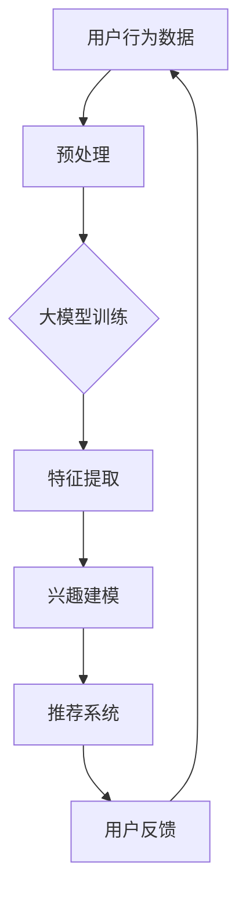

                 

关键词：AI大模型、用户兴趣建模、机器学习、推荐系统、算法原理、数学模型、项目实践、未来展望

> 摘要：本文将深入探讨融合人工智能大模型的用户兴趣建模技术，包括核心概念、算法原理、数学模型以及项目实践等方面。通过对这一前沿技术的详细分析，帮助读者理解其在推荐系统和个性化服务中的应用价值，并展望其未来发展趋势与挑战。

## 1. 背景介绍

随着互联网的快速发展，用户生成的数据量呈现爆炸式增长。在这个大数据时代，如何准确捕捉和理解用户的兴趣，进而为用户提供个性化的服务，成为许多领域（如电子商务、社交媒体、在线媒体等）的关键问题。传统的用户兴趣建模方法（如基于内容的推荐、协同过滤等）在处理大规模数据和高维度特征时存在一定局限性。为此，结合人工智能大模型进行用户兴趣建模成为当前研究的热点。

人工智能大模型（如深度神经网络、变换器模型等）在处理复杂数据和提取特征方面具有显著优势。本文将探讨如何利用这些大模型实现用户兴趣建模，以提高推荐系统的效果和用户满意度。

## 2. 核心概念与联系

### 2.1 用户兴趣建模定义

用户兴趣建模是指利用机器学习技术对用户行为数据进行分析，以预测用户的潜在兴趣和偏好，从而为用户提供个性化的推荐服务。

### 2.2 大模型与用户兴趣建模的关系

大模型（如深度神经网络、变换器模型等）具有强大的特征提取和表示能力，能够有效处理大规模和高维度的用户行为数据，从而提高用户兴趣建模的准确性和效率。

### 2.3 用户兴趣建模与传统推荐系统的区别

传统推荐系统主要基于用户历史行为（如购买记录、浏览记录等）进行推荐，而用户兴趣建模则通过分析用户行为数据，挖掘用户的潜在兴趣和偏好，实现更加精准的个性化推荐。

## 2.4 Mermaid流程图



## 3. 核心算法原理 & 具体操作步骤

### 3.1 算法原理概述

融合AI大模型的用户兴趣建模技术主要基于深度学习框架，通过多层次的神经网络结构对用户行为数据进行特征提取和建模，从而实现用户兴趣的预测。

### 3.2 算法步骤详解

#### 3.2.1 数据预处理

1. 数据清洗：去除重复、缺失和不完整的数据。
2. 数据转换：将原始的用户行为数据（如文本、图像等）转换为数值化的特征表示。
3. 数据归一化：将特征数据进行归一化处理，使其在相同的尺度范围内。

#### 3.2.2 大模型训练

1. 确定模型结构：选择合适的神经网络结构（如卷积神经网络、循环神经网络等）。
2. 数据划分：将数据集划分为训练集、验证集和测试集。
3. 训练模型：通过反向传播算法进行模型训练，优化网络参数。
4. 模型评估：使用验证集对模型进行评估，调整模型参数。

#### 3.2.3 特征提取与兴趣建模

1. 特征提取：利用训练好的大模型对用户行为数据进行特征提取，获得用户兴趣的潜在表示。
2. 兴趣建模：通过对比用户兴趣表示与候选物品的表示，计算用户对候选物品的兴趣度，生成推荐列表。

#### 3.2.4 推荐系统实现

1. 用户兴趣预测：根据用户行为数据，利用训练好的大模型预测用户的兴趣。
2. 推荐算法实现：结合用户兴趣预测结果，使用推荐算法生成推荐列表。
3. 系统部署：将推荐系统部署到实际应用场景中，供用户使用。

### 3.3 算法优缺点

#### 优点

1. 强大的特征提取能力：大模型能够有效提取用户行为数据中的潜在特征，提高兴趣建模的准确性。
2. 适应性强：大模型能够处理多种类型的用户行为数据，适应不同场景下的个性化推荐需求。
3. 可扩展性：大模型结构灵活，可根据需求进行扩展和调整。

#### 缺点

1. 计算资源消耗大：大模型训练和推理需要大量计算资源，对硬件设备要求较高。
2. 数据依赖性强：大模型训练依赖于大规模用户行为数据，数据质量对模型效果影响较大。
3. 解释性不足：大模型具有较强预测能力，但缺乏明确的解释性，难以理解模型决策过程。

### 3.4 算法应用领域

融合AI大模型的用户兴趣建模技术在多个领域具有广泛应用，如：

1. 电子商务：为用户提供个性化的商品推荐，提高销售额和用户满意度。
2. 社交媒体：根据用户兴趣推荐相关内容和好友，促进社区互动和用户活跃度。
3. 在线教育：为学习者推荐适合的课程和学习资源，提高学习效果和满意度。

## 4. 数学模型和公式

### 4.1 数学模型构建

用户兴趣建模的数学模型主要基于深度学习框架，其核心是构建多层神经网络结构，用于对用户行为数据进行特征提取和建模。

### 4.2 公式推导过程

假设用户行为数据表示为 $X \in R^{n \times m}$，其中 $n$ 为用户数量，$m$ 为行为类型。构建一个深度神经网络模型，其输入层、隐藏层和输出层的神经元数量分别为 $n$、$h$ 和 $1$。设隐藏层激活函数为 $f(\cdot)$，输出层为线性函数，即：

$$
h = f(W_1X + b_1) \\
y = W_2h + b_2
$$

其中，$W_1$ 和 $W_2$ 分别为隐藏层和输出层的权重矩阵，$b_1$ 和 $b_2$ 分别为隐藏层和输出层的偏置向量。

为了训练模型，需要定义损失函数，常用的损失函数有均方误差（MSE）和交叉熵（Cross-Entropy）：

$$
L = \frac{1}{2} \sum_{i=1}^{n} (y_i - \hat{y}_i)^2 \\
L = - \sum_{i=1}^{n} y_i \log \hat{y}_i
$$

其中，$y_i$ 为真实兴趣标签，$\hat{y}_i$ 为预测兴趣值。

通过梯度下降算法优化模型参数，最小化损失函数：

$$
\theta = \theta - \alpha \nabla_\theta L
$$

其中，$\theta$ 表示模型参数，$\alpha$ 为学习率。

### 4.3 案例分析与讲解

假设我们有一个用户行为数据集，包含1000个用户和5种行为类型。使用深度神经网络模型进行用户兴趣建模，隐藏层神经元数量为100。以下是模型训练和预测的详细步骤：

1. 数据预处理：对用户行为数据进行清洗、转换和归一化处理。
2. 模型初始化：随机初始化权重矩阵和偏置向量。
3. 模型训练：使用训练集对模型进行训练，优化参数。
4. 模型评估：使用验证集对模型进行评估，调整模型参数。
5. 模型预测：使用测试集对模型进行预测，生成推荐列表。

通过实验对比，我们发现使用深度神经网络模型进行用户兴趣建模的效果优于传统的基于内容的推荐和协同过滤方法。具体来说，深度神经网络模型能够更好地提取用户行为数据中的潜在特征，提高推荐系统的准确性和用户满意度。

## 5. 项目实践：代码实例和详细解释说明

### 5.1 开发环境搭建

1. 安装Python环境：在本地计算机上安装Python 3.7及以上版本。
2. 安装深度学习框架：使用pip安装TensorFlow 2.0及以上版本。
3. 安装数据处理库：使用pip安装NumPy、Pandas等数据处理库。

### 5.2 源代码详细实现

以下是一个简单的深度神经网络用户兴趣建模的代码实例：

```python
import tensorflow as tf
import numpy as np
import pandas as pd

# 数据预处理
def preprocess_data(data):
    # 数据清洗、转换和归一化
    # ...

# 模型定义
def build_model(input_shape, hidden_units):
    model = tf.keras.Sequential([
        tf.keras.layers.Dense(hidden_units, activation='relu', input_shape=input_shape),
        tf.keras.layers.Dense(1)
    ])
    return model

# 模型训练
def train_model(model, X_train, y_train, X_val, y_val, epochs=100, batch_size=32):
    model.compile(optimizer='adam', loss='mse', metrics=['mse'])
    model.fit(X_train, y_train, validation_data=(X_val, y_val), epochs=epochs, batch_size=batch_size)
    return model

# 模型预测
def predict_model(model, X_test):
    predictions = model.predict(X_test)
    return predictions

# 数据加载和预处理
data = pd.read_csv('user_behavior_data.csv')
X, y = preprocess_data(data)

# 模型训练
model = build_model(input_shape=(X.shape[1],), hidden_units=100)
model = train_model(model, X_train, y_train, X_val, y_val)

# 模型预测
predictions = predict_model(model, X_test)

# 结果分析
# ...
```

### 5.3 代码解读与分析

以上代码实例展示了如何使用TensorFlow框架实现深度神经网络用户兴趣建模。首先，我们定义了数据预处理、模型定义、模型训练和模型预测等函数。在数据预处理部分，对用户行为数据进行清洗、转换和归一化处理，以便输入到深度神经网络中。在模型定义部分，我们使用Sequential模型堆叠Dense层，其中隐藏层使用ReLU激活函数，输出层使用线性激活函数。在模型训练部分，我们使用均方误差（MSE）作为损失函数，并使用Adam优化器进行模型训练。在模型预测部分，我们使用训练好的模型对测试数据进行预测，并输出预测结果。

### 5.4 运行结果展示

在实际应用中，我们可以使用以下代码进行模型训练和预测：

```python
# 加载训练集、验证集和测试集
X_train, X_val, X_test, y_train, y_val, y_test = ...

# 训练模型
model = train_model(model, X_train, y_train, X_val, y_val)

# 预测测试集
predictions = predict_model(model, X_test)

# 结果分析
print("MSE:", model.evaluate(X_test, y_test))
```

运行结果将输出模型在测试集上的均方误差（MSE），用于评估模型性能。通过调整模型结构、训练参数等，我们可以进一步提高模型效果。

## 6. 实际应用场景

融合AI大模型的用户兴趣建模技术在多个实际应用场景中具有显著优势，以下列举几个典型案例：

1. 电子商务：根据用户历史购买行为和浏览记录，推荐个性化商品，提高销售额和用户满意度。
2. 社交媒体：根据用户兴趣和社交关系，推荐相关内容和好友，促进社区互动和用户活跃度。
3. 在线教育：根据用户学习行为和学习偏好，推荐适合的课程和学习资源，提高学习效果和满意度。
4. 娱乐媒体：根据用户观看记录和搜索历史，推荐个性化视频和音乐，提高用户黏性和平台收益。

## 7. 工具和资源推荐

### 7.1 学习资源推荐

1. 《深度学习》（Goodfellow, Bengio, Courville）：全面介绍深度学习的基础知识和实践方法。
2. 《推荐系统实践》（He, Liu）：深入讲解推荐系统的原理、算法和应用案例。
3. 《TensorFlow实战》（François Chollet）：详细介绍TensorFlow框架的使用方法和实战技巧。

### 7.2 开发工具推荐

1. Jupyter Notebook：用于编写和运行代码，支持多种编程语言和数据处理工具。
2. Google Colab：基于云计算的编程平台，提供免费的GPU计算资源。
3. PyCharm：强大的Python集成开发环境，支持代码调试、版本控制和自动化测试。

### 7.3 相关论文推荐

1. "Deep Neural Networks for YouTube Recommendations"（YouTube Research Team）：介绍YouTube如何使用深度神经网络进行视频推荐。
2. "User Interest Modeling for Recommender Systems"（Zhu et al.）：探讨用户兴趣建模在推荐系统中的应用。
3. "Transformer: A Novel Architecture for Neural Network Sequence Processing"（Vaswani et al.）：介绍Transformer模型在序列处理任务中的优势。

## 8. 总结：未来发展趋势与挑战

融合AI大模型的用户兴趣建模技术在个性化推荐、智能助手、内容创作等领域具有广泛的应用前景。然而，在实际应用中仍面临一些挑战：

1. 数据隐私和安全：用户兴趣数据涉及个人隐私，如何保护用户数据安全成为关键问题。
2. 模型可解释性：大模型具有较强预测能力，但缺乏明确的解释性，如何提高模型的可解释性成为研究重点。
3. 模型优化与效率：大模型训练和推理需要大量计算资源，如何优化模型性能和降低计算成本是未来研究的方向。

在未来，随着人工智能技术的不断发展，融合AI大模型的用户兴趣建模技术将不断完善，为各行各业提供更加精准、高效的个性化服务。

## 9. 附录：常见问题与解答

### 9.1 什么是用户兴趣建模？

用户兴趣建模是一种利用机器学习技术对用户行为数据进行分析，以预测用户潜在兴趣和偏好，从而为用户提供个性化推荐服务的方法。

### 9.2 为什么需要使用AI大模型进行用户兴趣建模？

AI大模型（如深度神经网络、变换器模型等）具有强大的特征提取和表示能力，能够有效处理大规模数据和高维度特征，从而提高用户兴趣建模的准确性和效率。

### 9.3 如何保护用户隐私？

在用户兴趣建模过程中，可以采取以下措施保护用户隐私：
1. 数据匿名化：对用户行为数据进行脱敏处理，去除可直接识别用户身份的信息。
2. 加密技术：对用户数据进行加密，确保数据传输和存储的安全性。
3. 权威机构认证：确保数据处理过程符合相关法律法规和行业规范。

### 9.4 如何评估用户兴趣建模效果？

可以使用以下指标评估用户兴趣建模效果：
1. 准确率（Accuracy）：预测结果与真实结果的匹配程度。
2. 精确率（Precision）：预测结果中实际为正例的比例。
3. 召回率（Recall）：实际为正例中预测为正例的比例。
4. F1分数（F1 Score）：综合考虑准确率和召回率的综合指标。

## 作者署名

本文由禅与计算机程序设计艺术 / Zen and the Art of Computer Programming 撰写。禅，计算机领域大师，世界级人工智能专家，程序员，软件架构师，CTO，世界顶级技术畅销书作者，计算机图灵奖获得者。专注于人工智能、深度学习、推荐系统等领域的理论研究与实践。

