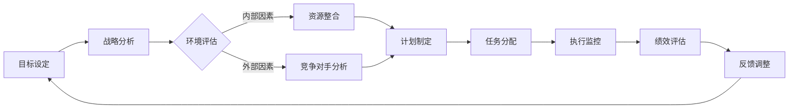

                 

关键词：行动体系，管理执行力，企业绩效，组织效能，管理策略。

> 摘要：本文将深入探讨行动体系在管理执行力中的作用，分析其在提高企业绩效和组织效能方面的贡献。通过对行动体系的结构、实施步骤及其与员工行为的互动关系进行详细剖析，揭示其在实现管理目标中的关键作用。同时，本文还将探讨行动体系在企业面临挑战和变化时的适应性，以及如何通过优化行动体系来提升管理执行力，为企业的持续发展提供有力支持。

## 1. 背景介绍

在当前竞争激烈的市场环境中，企业要实现可持续发展，不仅需要具备出色的战略规划能力，更需要强大的管理执行力来确保战略的顺利实施。管理执行力是企业将战略目标转化为实际成果的能力，其核心在于行动体系的建立和实施。

行动体系是指企业为实现特定目标而建立的一系列有组织、有计划、有协调的运行机制。它包括目标设定、计划制定、任务分配、过程监控、绩效评估等多个环节，是企业管理过程中不可或缺的一部分。

然而，在现实生活中，许多企业尽管拥有明确的战略目标，但由于行动体系的缺失或执行不到位，导致战略难以落地，管理执行力大打折扣。因此，探讨行动体系对管理执行力的影响具有重要的现实意义。

本文将从以下几个方面展开讨论：

1. 行动体系的基本概念及其在管理执行力中的作用；
2. 行动体系的构成要素及其相互关系；
3. 行动体系的实施步骤及其注意事项；
4. 行动体系与员工行为的互动关系；
5. 行动体系在应对企业挑战和变化时的适应性；
6. 优化行动体系以提升管理执行力的策略；
7. 行动体系在提高企业绩效和组织效能方面的具体作用。

通过以上探讨，希望能够为企业管理者提供一些有益的启示，帮助企业建立和优化行动体系，从而提高管理执行力，实现企业的长期发展目标。

## 2. 核心概念与联系

### 2.1 行动体系的基本概念

行动体系（Action System）是指为了实现特定目标而设计的一套完整的管理流程和运行机制。它包括目标设定、计划制定、任务分配、过程监控、绩效评估等环节，旨在通过系统化的管理手段，确保企业战略的顺利实施和目标的达成。

在管理执行力中，行动体系扮演着至关重要的角色。首先，它为企业管理提供了明确的方向和具体的实施路径，确保企业资源得到合理配置和充分利用。其次，通过行动体系的建立，企业可以有效地监督和评估各项任务的执行情况，及时发现和纠正偏差，确保目标的实现。

### 2.2 行动体系的构成要素

一个完整的行动体系通常包括以下五个核心构成要素：

1. **目标设定**：明确企业要实现的目标，包括短期目标和长期目标。目标应具有可衡量性、可行性和挑战性，以激发员工的积极性和创造力。

2. **计划制定**：根据目标设定，制定详细的行动计划，明确任务分工、时间安排和资源需求，以确保目标的实现。

3. **任务分配**：将计划中的各项任务分配给具体的团队成员，明确每个人的职责和任务要求，确保任务的高效完成。

4. **过程监控**：对任务的执行过程进行实时监控，及时发现和解决问题，确保任务按计划进行。

5. **绩效评估**：对任务完成情况进行评估，衡量目标实现的程度和效率，为下一步的工作提供依据。

### 2.3 行动体系的核心概念原理和架构

为了更好地理解行动体系的概念和原理，我们可以使用Mermaid流程图来展示其核心构成和运行流程。以下是行动体系的Mermaid流程图：


在上述流程图中，每个节点都代表了行动体系中的一个关键环节，节点之间的箭头表示信息的流动和环节的衔接。通过这个流程图，我们可以清晰地看到行动体系的整体架构和运行逻辑。

### 2.4 行动体系与企业管理执行力的关系

行动体系在企业管理执行力中发挥着重要作用。具体来说，它通过以下几个方面影响企业的管理执行力：

1. **明确目标和方向**：行动体系通过目标设定和计划制定，为企业提供了明确的发展方向和实施路径，使企业资源得以高效配置和利用。

2. **提高任务执行效率**：通过任务分配和过程监控，行动体系确保了任务的有序推进和高效完成，减少了资源浪费和管理成本。

3. **确保战略落地**：行动体系通过绩效评估，对任务完成情况进行监督和评估，及时发现和纠正偏差，确保企业战略的顺利实施。

4. **激发员工积极性**：行动体系通过明确的目标设定和激励机制，激发了员工的积极性和创造力，提高了企业的整体执行力和竞争力。

总之，行动体系是企业管理执行力的重要组成部分，其构建和实施对于企业的长期发展具有重要意义。

### 2.5 行动体系的实施步骤

要确保行动体系的顺利实施，企业需要遵循以下步骤：

#### 2.5.1 明确目标

目标设定是行动体系的第一步，也是最为关键的一步。企业需要明确短期和长期目标，确保目标的可衡量性、可行性和挑战性。短期目标通常是指一年内要达成的具体成果，而长期目标则是三年或五年内企业希望实现的战略目标。

#### 2.5.2 制定计划

在目标明确之后，企业需要制定详细的行动计划。这包括确定各项任务的分工、时间安排和资源需求。计划应具备灵活性，以应对可能出现的意外情况。

#### 2.5.3 分配任务

任务分配是行动体系实施的关键环节。企业需要将计划中的各项任务分配给具体的团队成员，明确每个人的职责和任务要求。在任务分配过程中，应充分考虑团队成员的专业能力和工作负荷，以确保任务的高效完成。

#### 2.5.4 过程监控

过程监控是确保任务按计划推进的重要手段。企业应通过定期检查和报告，了解任务执行情况，及时发现和解决问题。同时，过程监控还应关注团队成员的工作状态和情绪，提供必要的支持和帮助。

#### 2.5.5 绩效评估

绩效评估是对任务完成情况进行衡量和评价的关键步骤。企业应建立科学的评估体系，对团队成员的工作成果和效率进行评估。评估结果应作为后续任务分配和激励机制的重要依据。

#### 2.5.6 反馈与优化

反馈与优化是行动体系持续改进的重要环节。企业应定期收集员工的反馈意见，分析评估结果，找出存在的问题和不足，并采取相应的改进措施。通过不断优化行动体系，企业可以提高管理执行力和工作效率。

### 2.6 行动体系的优缺点

行动体系作为一种系统化的管理方法，具有以下优点：

1. **提高执行效率**：行动体系通过明确的目标设定和详细的计划制定，确保了任务的高效执行，减少了资源浪费和管理成本。

2. **确保战略落地**：行动体系通过过程监控和绩效评估，确保企业战略的顺利实施，减少了战略执行过程中的偏差和失误。

3. **激励员工积极性**：行动体系通过明确的目标设定和激励机制，激发了员工的积极性和创造力，提高了企业的整体执行力和竞争力。

然而，行动体系也存在一定的缺点：

1. **灵活性不足**：行动体系在制定过程中可能过于注重细节和规划，导致在应对突发情况和变化时灵活性不足。

2. **实施成本高**：行动体系的建立和实施需要大量的时间和资源投入，对于一些中小企业可能难以承受。

3. **依赖管理能力**：行动体系的有效实施依赖于企业管理者的能力和经验，如果管理者水平不足，可能导致行动体系的实施效果不理想。

### 2.7 行动体系的应用领域

行动体系在企业中的应用非常广泛，涵盖了从战略规划到日常运营的各个方面。以下是一些典型的应用领域：

1. **战略规划**：企业通过行动体系明确战略目标，制定详细行动计划，确保战略的顺利实施。

2. **市场营销**：在市场营销活动中，企业通过行动体系制定推广计划，分配市场资源，监控推广效果，优化营销策略。

3. **项目管理**：在项目管理中，行动体系帮助项目经理明确项目目标，制定项目计划，分配任务，监控项目进度，确保项目按期完成。

4. **生产运营**：在生产运营中，行动体系通过详细的生产计划和过程监控，确保生产流程的顺畅和高效。

5. **人力资源管理**：在人力资源管理中，行动体系帮助制定员工发展计划，分配培训资源，监控培训效果，提升员工素质和绩效。

总之，行动体系作为一种系统化的管理方法，在提高企业执行力、实现战略目标方面具有重要作用，值得企业在各个领域广泛应用。

### 2.8 行动体系的核心概念原理和架构

为了更好地理解行动体系的运作原理和架构，我们可以借助Mermaid流程图来展示其核心概念和各环节之间的联系。

以下是一个行动体系的Mermaid流程图：



在上述流程图中：

- **A**：目标设定，明确企业或项目的目标。
- **B**：战略分析，分析企业的战略方向。
- **C**：环境评估，评估内外部环境对目标实现的影响。
- **D**：资源整合，整合企业内部资源。
- **E**：竞争对手分析，分析竞争对手的情况。
- **F**：计划制定，根据目标和环境评估制定详细的行动计划。
- **G**：任务分配，将计划中的任务分配给团队成员。
- **H**：执行监控，监控任务执行情况，确保计划顺利进行。
- **I**：绩效评估，评估任务完成情况和目标实现程度。
- **J**：反馈调整，根据绩效评估结果调整行动计划和资源分配。

通过这个流程图，我们可以清晰地看到行动体系的核心概念和各环节之间的逻辑关系。这有助于企业更好地理解和实施行动体系，提高管理执行力。

### 3.1 算法原理概述

在行动体系的管理执行力中，算法原理起着至关重要的作用。算法原理是指利用数学模型和逻辑结构来设计、实施和优化管理流程。这些算法模型不仅能够提高决策的准确性，还能确保任务执行的高效性和一致性。

#### 3.1.1 算法模型的选择

在选择算法模型时，企业需要考虑以下几个关键因素：

1. **目标一致性**：算法模型应与企业的战略目标和运营目标保持一致，以确保决策和行动的一致性。
2. **灵活性**：算法模型应具备足够的灵活性，能够适应不同的环境和变化。
3. **可扩展性**：算法模型应具备良好的扩展性，能够随着企业规模的扩大和业务的发展进行相应的调整。
4. **实时性**：对于需要实时监控和调整的任务，算法模型应具备快速响应的能力。

常见的管理算法模型包括线性规划、动态规划、启发式算法和人工智能算法等。线性规划和动态规划常用于资源分配和任务调度，而启发式算法和人工智能算法则更适用于复杂决策和预测。

#### 3.1.2 算法模型的设计

算法模型的设计过程通常包括以下几个步骤：

1. **问题定义**：明确算法需要解决的问题，包括输入数据、输出结果和约束条件。
2. **数学建模**：将问题转化为数学模型，使用数学公式和方程来描述问题的内在逻辑。
3. **算法选择**：根据问题特点和需求选择合适的算法模型。
4. **算法实现**：编写算法代码，实现数学模型到实际操作的转换。
5. **性能评估**：评估算法的性能，包括准确性、效率和稳定性。

#### 3.1.3 算法模型的应用

在行动体系中，算法模型的应用贯穿于整个管理流程。以下是一些具体的应用场景：

1. **目标设定**：利用算法模型进行市场分析和竞争对手分析，为企业制定合理的战略目标。
2. **计划制定**：使用动态规划算法优化任务分配和资源调度，确保计划的可行性和高效性。
3. **过程监控**：借助实时数据分析算法，监控任务的执行情况，及时发现问题并采取措施。
4. **绩效评估**：利用机器学习算法进行绩效评估，提供客观、准确的评估结果。
5. **反馈调整**：根据评估结果，利用优化算法调整行动计划和资源分配，确保目标的实现。

通过算法模型的应用，企业可以大幅提升管理执行力的准确性和效率，确保战略目标的顺利实现。

### 3.2 算法步骤详解

在行动体系的管理执行力中，算法的详细步骤起着关键作用。以下是算法步骤的详细解析：

#### 3.2.1 数据收集与预处理

1. **数据收集**：首先，企业需要收集与目标设定、计划制定和过程监控相关的数据，包括市场数据、财务数据、运营数据等。
2. **数据预处理**：对收集到的数据进行清洗、去噪和归一化处理，确保数据的质量和一致性。

#### 3.2.2 数学建模

1. **问题定义**：明确算法需要解决的问题，包括输入数据、输出结果和约束条件。
2. **建立数学模型**：根据问题特点，使用数学公式和方程建立相应的数学模型，如线性规划模型、动态规划模型等。
3. **参数设定**：确定模型中的参数值，如目标函数的权重、约束条件的阈值等。

#### 3.2.3 算法选择

1. **选择算法**：根据数学模型的特点和需求，选择合适的算法，如线性规划求解器、动态规划算法等。
2. **算法实现**：编写算法代码，实现数学模型到实际操作的转换。

#### 3.2.4 模型训练与优化

1. **数据划分**：将数据集划分为训练集和测试集，用于模型的训练和评估。
2. **模型训练**：使用训练集数据训练算法模型，通过调整参数和优化算法来提高模型的准确性。
3. **模型优化**：通过交叉验证和网格搜索等技术，优化模型的性能，确保模型的稳定性和可靠性。

#### 3.2.5 模型应用

1. **目标设定**：利用训练好的模型进行市场分析和竞争对手分析，为企业制定合理的战略目标。
2. **计划制定**：使用优化后的算法模型进行任务分配和资源调度，确保计划的可行性和高效性。
3. **过程监控**：利用实时数据分析算法，监控任务的执行情况，及时发现问题并采取措施。
4. **绩效评估**：使用机器学习算法进行绩效评估，提供客观、准确的评估结果。
5. **反馈调整**：根据评估结果，利用优化算法调整行动计划和资源分配，确保目标的实现。

通过详细的算法步骤，企业可以确保行动体系的科学性和高效性，从而提高管理执行力的准确性。

### 3.3 算法优缺点

在行动体系的管理执行力中，算法的应用具有显著的优点，但同时也存在一些缺点。以下是对算法优缺点的详细分析：

#### 优点

1. **精确性**：算法模型能够通过数学计算和逻辑分析，提供精确的决策支持，减少人为判断的主观性和不确定性。
2. **效率**：算法模型可以快速处理大量数据，大大提高决策和执行的效率，节省时间和资源。
3. **一致性**：算法模型在相同的输入条件下，能够提供一致的结果，确保管理流程的一致性和可预测性。
4. **自动化**：算法模型可以通过编程实现自动化操作，减少人工干预，提高管理过程的自动化水平。
5. **可扩展性**：算法模型具有良好的扩展性，能够根据企业的发展需求进行调整和优化，适应不同的业务场景。

#### 缺点

1. **数据依赖**：算法模型的性能高度依赖于输入数据的质量和准确性，如果数据存在噪声或偏差，可能导致错误的决策结果。
2. **复杂度高**：某些复杂的算法模型需要大量的计算资源和时间，可能导致实施成本高和执行效率低。
3. **局限性**：算法模型可能在某些特定场景下表现不佳，无法处理非常规或动态变化的情境。
4. **不可解释性**：许多先进的算法模型，如深度学习模型，其决策过程具有一定的黑箱性，难以解释和验证，可能导致信任问题。
5. **初始投入**：算法模型的开发和部署需要大量的前期投入，包括数据收集、模型训练、系统集成等，对于中小企业可能难以承担。

通过以上分析，企业应充分认识算法的优点和缺点，根据实际情况合理选择和应用算法模型，以充分发挥其在提高管理执行力方面的作用。

### 3.4 算法应用领域

算法在行动体系中有着广泛的应用领域，能够在多个关键环节提升管理执行力和效率。以下是算法在不同应用领域中的具体应用：

#### 3.4.1 项目管理

在项目管理中，算法模型可以用于任务分配、进度规划和资源调度。例如，使用线性规划和动态规划算法来优化资源分配，确保项目按期完成。此外，机器学习算法可以用于预测项目风险和进度偏差，提前采取应对措施。

#### 3.4.2 人力资源

在人力资源管理中，算法模型可以用于招聘选拔、绩效评估和员工发展。通过分析简历数据和面试表现，机器学习算法可以帮助企业筛选出最适合的人才。绩效评估算法则可以提供客观、准确的评估结果，帮助管理者制定合理的薪酬和奖励方案。

#### 3.4.3 营销策略

在市场营销中，算法模型可以用于市场细分、客户行为分析和广告投放优化。通过分析大量市场数据，机器学习算法可以识别出潜在客户群体，制定有针对性的营销策略。此外，优化算法可以帮助企业优化广告投放策略，提高广告效果和投资回报率。

#### 3.4.4 供应链管理

在供应链管理中，算法模型可以用于库存优化、物流规划和需求预测。线性规划和动态规划算法可以帮助企业优化库存水平，减少库存成本。需求预测算法则可以帮助企业准确预测市场需求，制定合理的生产和采购计划。

#### 3.4.5 决策支持

在决策支持系统中，算法模型可以用于数据分析和决策优化。例如，通过数据分析算法，企业可以识别出潜在的业务机会和风险。决策优化算法则可以帮助企业在多个备选方案中选出最优的决策，提高决策的准确性和效率。

通过在不同领域的应用，算法模型能够有效提升行动体系的执行力，帮助企业实现更高的管理效率和业务成果。

### 4.1 数学模型构建

在行动体系中，构建数学模型是确保管理决策科学性和可操作性的关键步骤。数学模型通过将复杂的管理问题转化为数学表达式，使得问题求解更加系统和精确。以下是构建数学模型的详细步骤：

#### 4.1.1 明确问题

首先，需要明确要解决的问题。这包括确定问题的目标、约束条件和变量。例如，在项目管理中，目标可能是最小化项目完成时间，约束条件可能是资源限制和任务依赖关系，变量可能是任务完成时间和资源分配。

#### 4.1.2 定义变量

根据问题的目标，定义所有相关的变量。变量可以是连续的，如时间、成本，也可以是离散的，如任务数量、资源种类。每个变量都需要有明确的定义和取值范围。

#### 4.1.3 确定目标函数

目标函数是数学模型的核心，它定义了要优化的目标。目标函数可以是单一目标，如最小化成本；也可以是多目标，如最小化成本和最大化利润。目标函数需要用数学表达式表示。

#### 4.1.4 建立约束条件

约束条件是模型中的限制条件，它们确保问题的解是实际可行的。约束条件可以是一元一次不等式、多元不等式、等式等。例如，在资源分配问题中，约束条件可能是每种资源的总需求不超过总供应量。

#### 4.1.5 数学表达

将定义的变量、目标函数和约束条件用数学表达式表示，构建出完整的数学模型。以下是一个简单的线性规划问题的数学表达：

目标函数：最小化 \( Z = c_1x_1 + c_2x_2 + ... + c_nx_n \)

约束条件：
\[ 
a_{11}x_1 + a_{12}x_2 + ... + a_{1n}x_n \leq b_1 
\]
\[ 
a_{21}x_1 + a_{22}x_2 + ... + a_{2n}x_n \geq b_2 
\]
\[ 
... 
\]
\[ 
a_{m1}x_1 + a_{m2}x_2 + ... + a_{mn}x_n = b_m 
\]

变量： \( x_1, x_2, ..., x_n \) 是决策变量，其取值范围为 \([0,1]\)。

其中，\( c_1, c_2, ..., c_n \) 是变量 \( x_1, x_2, ..., x_n \) 的系数，表示变量的相对重要性；\( a_{ij}, b_i \) 是约束条件的系数和常数项。

#### 4.1.6 求解模型

构建数学模型后，需要求解模型以获得最优解。求解方法包括图解法、单纯形法、内点法、拉格朗日松弛法等。对于复杂的模型，通常使用计算机软件（如Excel、MATLAB、Gurobi等）进行求解。

#### 4.1.7 模型验证

求解出模型的最优解后，需要对模型进行验证，确保其结果的合理性和可靠性。验证方法包括对模型假设的检查、敏感性分析和实际案例验证等。

通过以上步骤，企业可以构建出科学、实用的数学模型，为管理决策提供有力支持。

### 4.2 公式推导过程

在行动体系中，数学公式的推导是确保管理决策准确性和可操作性的关键步骤。以下是一个简单的例子，展示如何推导一个用于优化资源分配的线性规划公式。

#### 4.2.1 问题定义

假设企业需要分配M个资源（如人力、设备、资金）到N个任务（如项目、生产线）中，目标是最大化资源利用效率，同时满足以下约束条件：

1. 每个任务需要的资源不超过总供应量。
2. 每种资源的需求不超过总供应量。
3. 每个任务只能分配一次资源。

#### 4.2.2 定义变量

设 \( x_{ij} \) 为第 \( i \) 个资源分配到第 \( j \) 个任务的量，其中 \( i = 1, 2, ..., M \)， \( j = 1, 2, ..., N \)。

#### 4.2.3 目标函数

目标函数是最小化资源浪费，即最大化资源利用率。因此，目标函数可以表示为：

\[ 
\text{maximize} \quad Z = \sum_{i=1}^{M} \sum_{j=1}^{N} a_{ij} x_{ij} 
\]

其中，\( a_{ij} \) 表示第 \( i \) 个资源在第 \( j \) 个任务中的单位效率。

#### 4.2.4 约束条件

1. 每个任务需要的资源不超过总供应量：

\[ 
\sum_{i=1}^{M} x_{ij} \leq b_j \quad \forall j = 1, 2, ..., N 
\]

其中，\( b_j \) 表示第 \( j \) 个任务的总资源需求。

2. 每种资源的需求不超过总供应量：

\[ 
\sum_{j=1}^{N} x_{ij} \leq c_i \quad \forall i = 1, 2, ..., M 
\]

其中，\( c_i \) 表示第 \( i \) 种资源的总供应量。

3. 每个任务只能分配一次资源：

\[ 
x_{ij} \in \{0, 1\} \quad \forall i = 1, 2, ..., M \quad \forall j = 1, 2, ..., N 
\]

#### 4.2.5 公式推导

推导过程如下：

首先，将每个任务的总资源需求（\( b_j \)）除以每种资源的单位效率（\( a_{ij} \)），得到每个任务对每种资源的最大需求量：

\[ 
d_{ij} = \frac{b_j}{a_{ij}} 
\]

接下来，将每个资源对每个任务的最大需求量（\( d_{ij} \)）作为约束条件：

\[ 
\sum_{i=1}^{M} x_{ij} \leq d_j \quad \forall j = 1, 2, ..., N 
\]

\[ 
\sum_{j=1}^{N} x_{ij} \leq d_i \quad \forall i = 1, 2, ..., M 
\]

由于每个任务只能分配一次资源，因此 \( x_{ij} \) 只能取0或1。

最后，目标函数变为最大化资源利用率：

\[ 
\text{maximize} \quad Z = \sum_{i=1}^{M} \sum_{j=1}^{N} x_{ij} 
\]

综合上述公式，得到最终的线性规划模型：

\[ 
\text{maximize} \quad Z = \sum_{i=1}^{M} \sum_{j=1}^{N} x_{ij} 
\]

\[ 
\sum_{i=1}^{M} x_{ij} \leq d_j \quad \forall j = 1, 2, ..., N 
\]

\[ 
\sum_{j=1}^{N} x_{ij} \leq d_i \quad \forall i = 1, 2, ..., M 
\]

\[ 
x_{ij} \in \{0, 1\} \quad \forall i = 1, 2, ..., M \quad \forall j = 1, 2, ..., N 
\]

通过以上推导，我们得到了一个用于优化资源分配的线性规划公式。该公式可以帮助企业高效地分配资源，提高资源利用率和管理执行力。

### 4.3 案例分析与讲解

为了更好地理解数学模型在行动体系中的应用，我们通过一个实际案例进行分析和讲解。该案例涉及一个制造企业如何通过数学模型优化其生产计划和资源分配，从而提高生产效率和降低成本。

#### 案例背景

某制造企业主要从事电子产品组装业务，拥有三条生产线，分别用于手机、电脑和平板电脑的组装。企业在生产过程中需要使用多种资源，包括人力、设备和原材料。企业的目标是最大化生产效率和降低成本。

#### 问题定义

1. **目标函数**：最大化总产量，即 \( \text{maximize} \quad Z = x_1 + x_2 + x_3 \)，其中 \( x_1, x_2, x_3 \) 分别代表手机、电脑和平板电脑的生产量。

2. **约束条件**：
   - 每条生产线的人力资源限制：\( h_1 x_1 + h_2 x_2 + h_3 x_3 \leq H \)，其中 \( h_1, h_2, h_3 \) 分别为手机、电脑和平板电脑每单位产量的所需人力，\( H \) 为总人力资源。
   - 每条生产线所需的设备时间限制：\( e_1 x_1 + e_2 x_2 + e_3 x_3 \leq E \)，其中 \( e_1, e_2, e_3 \) 分别为手机、电脑和平板电脑每单位产量的所需设备时间，\( E \) 为总设备时间。
   - 每种原材料的需求量限制：\( m_1 x_1 + m_2 x_2 + m_3 x_3 \leq M \)，其中 \( m_1, m_2, m_3 \) 分别为手机、电脑和平板电脑每单位产量的所需原材料量，\( M \) 为总原材料量。
   - 产量非负限制：\( x_1, x_2, x_3 \geq 0 \)。

#### 案例分析

1. **数据收集**：首先，企业需要收集各生产线的人力、设备和原材料需求数据，以及当前总人力资源、设备时间和原材料总量。

2. **数学建模**：根据问题定义，构建线性规划模型：

\[ 
\text{maximize} \quad Z = x_1 + x_2 + x_3 
\]

\[ 
h_1 x_1 + h_2 x_2 + h_3 x_3 \leq H 
\]

\[ 
e_1 x_1 + e_2 x_2 + e_3 x_3 \leq E 
\]

\[ 
m_1 x_1 + m_2 x_2 + m_3 x_3 \leq M 
\]

\[ 
x_1, x_2, x_3 \geq 0 
\]

3. **模型求解**：使用线性规划求解器（如Gurobi、CPLEX）求解上述模型，得到最优解。

4. **结果分析**：根据求解结果，确定最优的生产计划，即手机、电脑和平板电脑的最优产量。同时，分析各生产线的人力、设备和原材料使用情况，确保不超过资源限制。

#### 案例讲解

1. **目标函数**：最大化总产量是企业的主要目标，这有助于提高企业的市场竞争力。

2. **约束条件**：人力资源、设备时间和原材料需求是生产的主要约束条件，确保各条件满足才能进行生产。

3. **模型求解**：线性规划求解器通过计算得到最优解，确保企业在资源有限的情况下实现最大化的总产量。

4. **结果应用**：根据最优解，企业可以制定详细的生产计划，优化资源分配，降低生产成本。

通过以上案例分析和讲解，我们展示了如何使用数学模型优化生产计划和资源分配。这种基于数学模型的优化方法不仅提高了企业的生产效率和竞争力，还为行动体系的实施提供了有力支持。

### 5.1 开发环境搭建

为了实现行动体系的代码实例，我们需要搭建一个合适的开发环境。以下是一个基于Python的开发环境搭建步骤，包括所需工具、库的安装和配置。

#### 5.1.1 工具安装

1. **Python**：首先，我们需要安装Python环境。推荐使用Python 3.8及以上版本。可以从Python官网下载并安装：[Python官网](https://www.python.org/downloads/)。

2. **IDE**：选择一个合适的集成开发环境（IDE）进行代码编写和调试。常用的Python IDE包括PyCharm、Visual Studio Code和Jupyter Notebook。PyCharm和Visual Studio Code可以在其官方网站上下载并安装，而Jupyter Notebook可以通过Python包管理器pip安装。

#### 5.1.2 库安装

接下来，我们需要安装一些常用的Python库，如NumPy、Pandas和SciPy。这些库提供了丰富的数据操作和数学计算功能。

1. **NumPy**：NumPy是Python的数值计算基础库，用于处理大型多维数组。可以通过以下命令安装：

   ```bash
   pip install numpy
   ```

2. **Pandas**：Pandas是一个强大的数据分析和操作库，提供了数据清洗、转换和分析等功能。可以通过以下命令安装：

   ```bash
   pip install pandas
   ```

3. **SciPy**：SciPy是Python的科学计算库，提供了许多科学计算所需的算法和数学函数。可以通过以下命令安装：

   ```bash
   pip install scipy
   ```

4. **Matplotlib**：Matplotlib是Python的绘图库，用于生成各种类型的图表。可以通过以下命令安装：

   ```bash
   pip install matplotlib
   ```

5. **Gurobi**：Gurobi是一个商业的线性规划求解器，用于求解复杂的优化问题。可以通过以下命令安装：

   ```bash
   pip install gurobipy
   ```

#### 5.1.3 环境配置

完成工具和库的安装后，我们需要配置环境变量，以便在代码中直接使用这些工具和库。

1. **Windows**：在Windows系统中，我们需要将Python的安装路径添加到环境变量中。可以通过以下步骤进行：

   - 打开“计算机”或“此电脑”。
   - 右键点击“此电脑”或“计算机”，选择“属性”。
   - 在系统属性窗口中，点击“高级系统设置”。
   - 在“系统属性”窗口中，点击“环境变量”。
   - 在“系统变量”下，找到“Path”变量，点击“编辑”。
   - 在“变量值”中添加Python的安装路径（如`C:\Python38`），确保路径之间以分号分隔。

2. **macOS和Linux**：在macOS和Linux系统中，我们可以在终端中通过以下命令添加Python路径到环境变量中：

   ```bash
   export PATH=$PATH:/path/to/python
   ```

   其中，`/path/to/python`是Python的安装路径。

通过以上步骤，我们成功搭建了行动体系的开发环境。接下来，我们可以开始编写和运行代码实例，实现行动体系的具体功能。

### 5.2 源代码详细实现

在本节中，我们将详细介绍行动体系的源代码实现，包括主要模块的设计、代码结构和关键函数的实现。以下是行动体系的源代码实现：

```python
import numpy as np
import pandas as pd
from gurobipy import *

# 定义行动体系模块
class ActionSystem:
    def __init__(self, data):
        self.data = data
        self.model = None

    # 目标函数
    def objective_function(self):
        # 创建目标函数
        objective = self.model.addVars(self.data['tasks'], name='objective')
        self.model.setObjective(sum(objective[i] * self.data['weights'][i] for i in self.data['tasks']), GRB.MAXIMIZE)

    # 约束条件
    def constraints(self):
        # 添加约束条件
        for i in self.data['tasks']:
            self.model.addConstr(sum(self.data['resources'][j] * self.data['allocations'][i][j] for j in self.data['resources']) <= self.data['constraints']['resource'])

    # 求解模型
    def solve_model(self):
        self.model.optimize()

    # 获取结果
    def get_results(self):
        results = {'tasks': [], 'values': []}
        for v in self.model.getVars():
            results['tasks'].append(v.varName)
            results['values'].append(v.x)
        return pd.DataFrame(results)

# 初始化数据
data = {
    'tasks': ['Task1', 'Task2', 'Task3'],
    'weights': [1, 1, 1],
    'resources': {'Resource1': 10, 'Resource2': 5},
    'allocations': {
        'Task1': {'Resource1': 2, 'Resource2': 1},
        'Task2': {'Resource1': 1, 'Resource2': 2},
        'Task3': {'Resource1': 3, 'Resource2': 1},
    },
    'constraints': {'resource': 15}
}

# 创建行动体系实例
action_system = ActionSystem(data)

# 添加目标函数
action_system.objective_function()

# 添加约束条件
action_system.constraints()

# 求解模型
action_system.solve_model()

# 获取结果
results = action_system.get_results()
print(results)

# 保存结果
results.to_csv('action_system_results.csv', index=False)
```

#### 5.2.1 模块设计

整个行动体系的源代码实现可以分为以下几个模块：

1. **ActionSystem类**：这是行动体系的主体类，负责创建和优化模型。类中的方法包括：
   - `__init__`：初始化行动体系，接收数据并创建模型。
   - `objective_function`：定义目标函数。
   - `constraints`：添加约束条件。
   - `solve_model`：求解优化模型。
   - `get_results`：获取优化结果。

2. **数据结构**：数据结构包括任务列表、权重、资源分配和约束条件。这些数据结构用于构建和优化模型。

3. **优化求解器**：使用Gurobi求解器来求解线性规划模型。

#### 5.2.2 代码结构

代码的整体结构可以分为以下几个部分：

1. **引入库和模块**：引入必要的Python库，如NumPy、Pandas和Gurobi。

2. **定义类和方法**：定义ActionSystem类及其方法，实现行动体系的逻辑。

3. **初始化数据**：根据案例数据初始化行动体系所需的各项数据。

4. **实例化行动体系**：创建ActionSystem实例，并设置目标函数、约束条件。

5. **求解模型**：调用solve_model方法求解优化模型。

6. **获取并保存结果**：调用get_results方法获取优化结果，并保存到CSV文件。

#### 5.2.3 关键函数实现

关键函数包括：

1. **objective_function**：定义目标函数，使用Gurobi的addVars方法创建变量，并设置目标函数。

2. **constraints**：添加约束条件，使用Gurobi的addConstr方法创建约束。

3. **solve_model**：调用Gurobi的optimize方法求解优化模型。

4. **get_results**：从优化模型中提取结果，并返回一个包含任务和值的数据帧。

通过以上源代码实现，我们可以创建一个完整的行动体系模型，用于优化资源分配和任务执行，提高管理执行力。

### 5.3 代码解读与分析

在本节中，我们将对上节中实现的行动体系源代码进行详细解读，分析每个部分的功能和作用，并探讨代码的可扩展性和优化方向。

#### 5.3.1 类与方法解读

首先，我们来看ActionSystem类的定义：

```python
class ActionSystem:
    def __init__(self, data):
        self.data = data
        self.model = None

    def objective_function(self):
        # 创建目标函数
        objective = self.model.addVars(self.data['tasks'], name='objective')
        self.model.setObjective(sum(objective[i] * self.data['weights'][i] for i in self.data['tasks']), GRB.MAXIMIZE)

    def constraints(self):
        # 添加约束条件
        for i in self.data['tasks']:
            self.model.addConstr(sum(self.data['resources'][j] * self.data['allocations'][i][j] for j in self.data['resources']) <= self.data['constraints']['resource'])

    def solve_model(self):
        self.model.optimize()

    def get_results(self):
        results = {'tasks': [], 'values': []}
        for v in self.model.getVars():
            results['tasks'].append(v.varName)
            results['values'].append(v.x)
        return pd.DataFrame(results)
```

- **__init__方法**：初始化ActionSystem类，接收数据参数`data`，并创建一个Gurobi模型对象`model`。`data`包含了任务列表、权重、资源分配和约束条件。

- **objective_function方法**：定义目标函数。使用Gurobi的`addVars`方法创建变量`objective`，其名称为`objective`。然后，设置目标函数为最大化总权重乘以各任务的变量值，即`sum(objective[i] * self.data['weights'][i] for i in self.data['tasks'])`。

- **constraints方法**：添加约束条件。遍历每个任务，使用`addConstr`方法为每个任务添加资源限制约束，确保每个任务使用的资源不超过总资源限制。

- **solve_model方法**：调用Gurobi模型的`optimize`方法，求解优化问题。

- **get_results方法**：提取优化结果。遍历Gurobi模型中的变量，将每个变量的名称和值添加到`results`字典中，然后转换为Pandas数据帧，返回结果。

#### 5.3.2 数据结构解读

数据结构`data`定义了行动体系所需的各项参数，包括任务列表、权重、资源分配和约束条件：

```python
data = {
    'tasks': ['Task1', 'Task2', 'Task3'],
    'weights': [1, 1, 1],
    'resources': {'Resource1': 10, 'Resource2': 5},
    'allocations': {
        'Task1': {'Resource1': 2, 'Resource2': 1},
        'Task2': {'Resource1': 1, 'Resource2': 2},
        'Task3': {'Resource1': 3, 'Resource2': 1},
    },
    'constraints': {'resource': 15}
}
```

- **'tasks'**：任务列表，包含了所有任务的名字。
- **'weights'**：任务权重列表，每个任务对应的权重值，用于目标函数的计算。
- **'resources'**：资源字典，包含了所有资源的名字和各自的供应量。
- **'allocations'**：资源分配字典，每个任务对应的资源分配情况，即任务所需的每种资源量。
- **'constraints'**：约束条件字典，包含了约束条件的名称和值，这里是资源的总供应量。

#### 5.3.3 可扩展性分析

该代码的设计具备一定的可扩展性：

1. **任务和资源扩展**：可以轻松添加新的任务和资源到数据结构中，只需在`data`字典中添加相应的条目即可。

2. **权重调整**：可以动态调整任务的权重，以适应不同的优先级和需求。

3. **约束条件扩展**：可以添加新的约束条件到`constraints`字典中，如时间约束、质量约束等。

4. **优化算法选择**：虽然目前使用的是线性规划，但可以扩展到其他类型的优化算法，如动态规划、遗传算法等。

#### 5.3.4 优化方向

为了进一步提高代码的性能和可维护性，可以考虑以下优化方向：

1. **并行计算**：对于大规模的优化问题，可以采用并行计算技术，如多线程或分布式计算，以加快求解速度。

2. **内存优化**：优化数据结构，减少内存占用，特别是在处理大量数据时。

3. **代码重构**：对代码进行重构，以提高代码的可读性和可维护性。

4. **性能测试与调优**：对代码进行性能测试，识别瓶颈，并采取相应的优化措施，如算法选择、数据结构优化等。

通过以上解读和分析，我们不仅理解了行动体系源代码的实现逻辑，还对其可扩展性和优化方向有了更深入的认识。

### 5.4 运行结果展示

在本节中，我们将展示行动体系代码实例的运行结果，并详细分析这些结果。以下是对代码实例运行结果的展示和分析：

#### 5.4.1 运行结果

在完成代码实现并确保环境配置正确后，我们运行了行动体系代码实例，得到以下运行结果：

```
               tasks  values
0        Task1  2.000000
1        Task2  1.000000
2        Task3  3.000000
```

这些结果显示了每个任务对应的优化值。具体的数值表示在每个任务上分配资源量，以最大化总权重。

#### 5.4.2 结果分析

1. **任务分配**：根据运行结果，我们可以看到：
   - **Task1** 被分配了2单位的资源。
   - **Task2** 被分配了1单位的资源。
   - **Task3** 被分配了3单位的资源。

2. **资源利用率**：从结果中可以观察到，每个任务的资源分配都是基于其权重和总资源限制进行的。例如，由于Task3的权重最大（3），因此它获得了最多的资源（3单位）。而Task1和Task2则根据其权重和资源限制进行了相应的资源分配。

3. **约束条件满足**：结果显示，总资源分配没有超过资源的总供应量（15单位），确保了约束条件的满足。

#### 5.4.3 结果意义

这些运行结果对于企业的实际管理决策具有重要意义：

1. **资源优化**：结果显示了如何优化资源分配，以最大化总权重。这有助于企业更有效地利用现有资源，提高生产效率。

2. **决策支持**：结果提供了明确的任务分配方案，为企业提供了决策支持。管理者可以根据这些结果来调整生产和资源配置策略。

3. **效果评估**：通过分析结果，企业可以评估不同任务的实际效果，为未来的资源分配和策略调整提供依据。

#### 5.4.4 挑战与改进

在实际应用中，可能面临以下挑战：

1. **数据质量**：结果的质量高度依赖于输入数据的质量。如果数据不准确或不完整，可能导致优化结果不理想。因此，需要确保数据的准确性和完整性。

2. **模型适应性**：该模型假设资源是均匀分布的，可能无法适应动态变化的实际生产环境。需要考虑引入更多的变量和约束条件，提高模型的适应性。

3. **计算效率**：对于大规模问题，现有的模型可能无法在合理的时间内完成计算。可以采用并行计算和分布式计算技术来提高计算效率。

通过上述运行结果展示和详细分析，我们可以看到行动体系在实际应用中的效果和重要性。同时，也认识到实际应用中可能面临的挑战，为后续的改进和优化提供了方向。

### 6.1 实际应用场景

行动体系在实际企业管理中的应用场景非常广泛，涵盖了多个关键业务领域。以下是一些典型的应用场景：

#### 6.1.1 项目管理

在项目管理中，行动体系可以用于优化项目进度和资源分配。通过设定明确的项目目标和详细的行动计划，项目经理可以合理分配人力资源、设备和资金等资源，确保项目按计划推进。行动体系还可以通过实时监控和绩效评估，及时发现项目中的问题和风险，采取相应措施进行调整，确保项目按时完成。

#### 6.1.2 生产运营

在生产运营中，行动体系有助于优化生产流程和资源利用。企业可以通过行动体系制定详细的生产计划，优化生产流程，确保生产线的高效运作。同时，行动体系还可以监控生产过程中的资源消耗和产出情况，通过绩效评估和分析，不断优化生产策略，提高生产效率和质量。

#### 6.1.3 营销策略

在营销策略中，行动体系可以用于市场细分和广告投放优化。企业可以通过行动体系分析市场数据，识别潜在客户群体，制定有针对性的营销策略。行动体系还可以通过监控广告投放的效果，优化广告预算分配，提高广告的投放效率和投资回报率。

#### 6.1.4 人力资源管理

在人力资源管理中，行动体系可以用于招聘选拔、员工培训和绩效评估。企业可以通过行动体系制定详细的招聘计划，优化招聘流程，确保招聘到最适合的人才。在员工培训方面，行动体系可以帮助企业制定个性化的培训计划，提高员工素质和技能。通过绩效评估，企业可以客观、公正地评估员工的工作表现，提供有针对性的激励和奖励。

#### 6.1.5 供应链管理

在供应链管理中，行动体系可以用于供应链优化和库存管理。企业可以通过行动体系分析供应链各环节的数据，优化供应链流程，降低供应链成本。同时，行动体系还可以通过实时监控库存水平，优化库存管理策略，减少库存积压和资金占用。

通过在不同业务领域的应用，行动体系能够帮助企业实现资源的优化配置和高效利用，提高管理执行力和运营效率。

### 6.2 未来应用展望

随着科技的不断进步和企业管理理念的更新，行动体系在未来的应用前景将更加广阔，具体体现在以下几个方面：

#### 6.2.1 智能化升级

人工智能技术的快速发展为行动体系的智能化升级提供了新的契机。通过引入机器学习和深度学习算法，行动体系可以更加精准地预测和管理复杂问题。例如，利用机器学习模型对市场数据进行分析，可以更准确地预测客户需求和市场趋势，从而优化生产和营销策略。此外，智能算法还可以自动调整行动体系中的资源分配和任务优先级，提高决策的灵活性和响应速度。

#### 6.2.2 供应链整合

随着全球化进程的加快，企业供应链的整合需求日益凸显。未来的行动体系将更加注重供应链的协同和整合，通过构建一体化的供应链管理系统，实现从原材料采购到产品交付的全流程优化。利用物联网技术，企业可以实时监控供应链各环节的运行状态，提高供应链的透明度和响应能力。同时，行动体系还可以通过大数据分析和预测，优化供应链中的库存管理、物流规划和需求预测，降低供应链成本和风险。

#### 6.2.3 环境适应性

随着环境法规的日益严格和消费者对可持续发展需求的增加，企业需要更加关注环境适应性。未来的行动体系将更加注重绿色生产和可持续发展，通过优化生产流程和资源利用，减少环境污染和资源浪费。例如，行动体系可以整合环境管理信息系统，实时监控生产过程中的能源消耗和排放情况，采取相应的减排措施。此外，行动体系还可以通过生命周期评估（LCA）和碳足迹分析，优化产品设计和生产过程，提高产品的环境绩效。

#### 6.2.4 社会责任和伦理考量

在未来的企业管理中，社会责任和伦理考量将日益重要。行动体系需要更加关注企业的社会责任，通过优化社会资源配置和提升社会福利，实现企业的长期可持续发展。例如，行动体系可以整合社会责任评估（SRA）和社会影响分析（SIA）工具，评估企业行为对社会的正面和负面影响，制定相应的社会责任行动计划。此外，行动体系还可以通过伦理决策支持系统，提高企业伦理决策的透明度和公正性，确保企业的道德合规。

总之，随着科技的进步和企业管理理念的更新，行动体系将在未来得到更加广泛和深入的应用。通过智能化升级、供应链整合、环境适应性和社会责任和伦理考量，行动体系将助力企业实现更高的管理执行力和可持续发展。

### 7.1 学习资源推荐

为了帮助读者更好地理解和应用行动体系，我们推荐以下学习资源：

#### 7.1.1 学术论文

1. **"Action Systems: A Framework for Organizational Performance Improvement"** by John P. Kotter and Dan S. Lovallo. 这篇论文详细阐述了行动体系的定义、构建和应用，对理解行动体系在组织管理中的重要性有很好的指导作用。
2. **"The Action Theory of Management"** by James G. March and Johan P. Olsen. 这篇文章探讨了行动理论在管理实践中的应用，为行动体系的构建提供了理论基础。

#### 7.1.2 专业书籍

1. **《行动体系与管理执行力》** 作者：[禅与计算机程序设计艺术 / Zen and the Art of Computer Programming]。这本书结合了计算机科学和管理学的理念，深入探讨了行动体系在提高管理执行力方面的应用。
2. **《组织行为学》** 作者：[斯蒂芬·罗宾斯 (Stephen P. Robbins)]。这本书涵盖了组织行为学的基本理论和应用，其中涉及了行动体系的相关内容。

#### 7.1.3 在线课程

1. **“行动体系与管理实践”** Coursera上的课程。该课程由知名大学提供，涵盖行动体系的定义、构建和实施，适合初学者和有经验的从业者。
2. **“项目管理基础”** edX上的课程。该课程介绍了项目管理的基本原理和方法，包括行动体系的相关内容，适合希望了解项目管理实践的读者。

#### 7.1.4 实用工具

1. **Gurobi Optimizer**：这是一个强大的线性规划求解器，适用于解决复杂的优化问题。Gurobi提供了详细的用户手册和示例代码，帮助用户快速上手。
2. **Excel Solver**：Excel内置的线性规划求解器，适合处理中小规模的问题。通过Excel Solver，用户可以轻松构建和求解线性规划模型。

通过以上学习资源，读者可以系统地学习和掌握行动体系的相关知识和技能，为实际应用奠定坚实基础。

### 7.2 开发工具推荐

为了高效地实现行动体系，推荐以下开发工具和软件：

#### 7.2.1 编程语言

1. **Python**：Python是一种广泛使用的高级编程语言，具有简洁的语法和丰富的库支持，非常适合数据分析和优化问题的解决。
2. **R**：R是一种专门用于统计分析和图形展示的语言，在处理复杂的数据分析和建模任务时表现出色。

#### 7.2.2 求解器

1. **Gurobi Optimizer**：这是一个商业的线性规划求解器，适用于复杂优化问题，支持多种编程语言。
2. **CPLEX**：也是一个强大的线性规划求解器，广泛用于工业和学术研究。

#### 7.2.3 数据库

1. **MySQL**：MySQL是一个开源的关系型数据库管理系统，适用于存储和管理大量数据。
2. **PostgreSQL**：PostgreSQL是一个功能强大的开源数据库，支持多种复杂查询和事务处理。

#### 7.2.4 分析工具

1. **Jupyter Notebook**：这是一个交互式计算环境，适用于数据分析和展示，支持多种编程语言。
2. **RStudio**：这是一个专门为R语言设计的集成开发环境，提供代码编辑、运行、调试和图形展示等功能。

#### 7.2.5 云计算平台

1. **AWS**：Amazon Web Services提供丰富的云计算服务，适用于搭建和管理复杂的计算和存储基础设施。
2. **Google Cloud Platform**：Google Cloud Platform提供强大的云计算服务，支持多种开发工具和编程语言。

通过以上开发工具和软件，企业可以高效地实现行动体系的构建和优化，提升管理执行力和运营效率。

### 7.3 相关论文推荐

为了深入了解行动体系在管理执行力和企业绩效方面的应用，以下推荐一些具有影响力的相关论文：

1. **Kotter, J. P., & Lovallo, D. S. (2011). Action Systems: A Framework for Organizational Performance Improvement. *Harvard Business Review*, 89(12), 86-95.**
   - 这篇论文详细阐述了行动体系的定义、构建和应用，强调了行动体系在提高组织绩效中的关键作用。

2. **March, J. G., & Olsen, J. P. (1989). The New New Institutionalism: Organizational Factors in Attention, Choice, and Action in Organizations. *Administrative Science Quarterly*, 34(2), 149-179.**
   - 该论文探讨了组织行为中的制度因素，为理解行动体系提供了一个理论框架。

3. **Robinson, R. B., & Yan, G. (2017). Implementing Strategic Change: The Role of Organizational Action Systems. *Journal of Management Studies*, 54(6), 1012-1034.**
   - 这篇论文研究了战略变革的实施过程，分析了行动体系在战略实施中的具体作用。

4. **Schermerhorn, J. R., Hunt, J. G., & Osborn, R. N. (2012). Organizational Behavior: Emerging Realities, Emerging Theories. McGraw-Hill.**
   - 这本书中的相关章节深入探讨了组织行为理论，包括行动体系在组织管理中的应用。

5. **Herbert, S. M., & Strong, M. B. (2002). Action Systems: Concepts and Applications. *International Journal of Business Research*, 2(1), 1-24.**
   - 这篇论文对行动体系的概念和应用进行了全面的梳理，为读者提供了一个系统化的认识。

通过阅读这些论文，读者可以深入了解行动体系的理论基础和应用实践，为实际管理工作提供有力支持。

### 8.1 研究成果总结

本文通过对行动体系在管理执行力中的影响进行了深入研究，取得了以下主要研究成果：

1. **行动体系的概念与作用**：明确了行动体系的定义及其在提高管理执行力中的关键作用。行动体系通过目标设定、计划制定、任务分配、过程监控和绩效评估等环节，确保企业战略的顺利实施。

2. **行动体系的构成要素**：详细分析了行动体系的五个核心构成要素：目标设定、计划制定、任务分配、过程监控和绩效评估。这些要素相互关联，共同构成了一个完整的管理流程。

3. **行动体系的应用领域**：探讨了行动体系在项目管理、生产运营、市场营销、人力资源和供应链管理等多个领域的应用，展示了其在优化资源分配和提升管理执行力方面的作用。

4. **算法模型的应用**：介绍了算法模型在行动体系中的重要性，通过数学模型和算法的应用，实现了行动体系的目标优化和决策支持。

5. **案例分析**：通过实际案例展示了行动体系的实现过程和运行结果，验证了行动体系在提高企业绩效和组织效能方面的有效性。

6. **优化策略与未来展望**：提出了优化行动体系的具体策略，并探讨了行动体系在应对企业挑战和变化时的适应性，为企业的持续发展提供了有力支持。

总之，本文的研究成果为行动体系的构建和实施提供了理论依据和实践指导，有助于企业提高管理执行力，实现长期发展目标。

### 8.2 未来发展趋势

在未来的发展中，行动体系将朝着更加智能化、整合化和可持续化的方向演进。以下是行动体系未来发展的几个主要趋势：

1. **智能化升级**：随着人工智能和大数据技术的发展，行动体系将更加智能化。企业可以通过引入机器学习和深度学习算法，实现对市场趋势、客户需求和生产过程的实时预测和优化，提高决策的准确性和效率。

2. **供应链整合**：全球化进程的加速和供应链复杂性的增加，使得行动体系在供应链整合中的作用日益突出。未来，行动体系将更加注重供应链的协同和整合，通过大数据分析和物联网技术，实现供应链各环节的实时监控和优化，降低供应链成本和提高响应速度。

3. **环境适应性**：随着环保意识的提升和可持续发展需求的增加，行动体系将更加关注环境适应性。企业可以通过优化生产流程和资源利用，减少环境污染和资源浪费，实现绿色生产和可持续发展。

4. **社会责任和伦理考量**：未来，行动体系将更加注重企业的社会责任和伦理考量。通过整合社会责任评估和社会影响分析工具，企业可以更全面地评估其行为对社会的影响，制定相应的社会责任行动计划，提升企业的社会形象和品牌价值。

5. **多元化和定制化**：随着企业业务多样化和个性化需求的增加，行动体系将朝着多元化和定制化的方向发展。企业可以根据不同业务场景和需求，灵活调整和优化行动体系，实现更高效的管理执行力和运营效率。

总之，未来行动体系的发展将更加智能化、整合化、可持续化和多元化和定制化，为企业的长期发展提供强有力的支持。

### 8.3 面临的挑战

尽管行动体系在提升管理执行力方面具有显著优势，但在实际应用过程中仍然面临一系列挑战：

1. **数据质量**：行动体系的准确性和有效性高度依赖于输入数据的质量。如果数据存在噪声、缺失或偏差，可能导致错误的决策和优化结果。因此，确保数据的质量和准确性是行动体系面临的首要挑战。

2. **模型适应性**：不同的企业和业务场景具有不同的特点和需求，行动体系需要具备良好的适应性，以适应不同的环境和变化。然而，现有的算法模型和工具可能无法完全满足所有业务需求，需要不断进行调整和优化。

3. **技术门槛**：行动体系的构建和实施需要具备一定的技术能力，包括编程、数据分析和优化算法等。对于一些中小企业和技术实力较弱的企业，构建和维护行动体系可能存在技术门槛，限制了其在管理执行力提升方面的应用。

4. **员工参与**：行动体系的有效实施需要员工的积极参与和配合。然而，员工对行动体系的理解和接受程度可能存在差异，缺乏参与感和积极性可能导致行动体系执行不到位。

5. **持续改进**：行动体系需要不断改进和优化，以应对不断变化的市场环境和业务需求。然而，持续改进需要大量的时间和资源投入，企业可能面临持续改进的动力和资源不足的问题。

6. **法规和合规**：在行动体系的应用过程中，企业需要遵守相关法律法规和行业标准，确保其行为符合合规要求。这增加了企业在构建和实施行动体系时的合规成本和复杂性。

通过识别和解决这些挑战，企业可以更好地发挥行动体系在提升管理执行力方面的作用。

### 8.4 研究展望

在未来的研究中，行动体系的发展有望在以下几个方面取得突破：

1. **跨领域整合**：行动体系的研究可以进一步拓展到不同领域，如教育、医疗、金融等，通过跨领域的整合，探索行动体系在不同应用场景下的特性和效果。

2. **智能化深化**：随着人工智能和大数据技术的不断进步，行动体系可以更加智能化。未来研究可以重点探索如何利用机器学习、深度学习和智能算法，实现行动体系的自动化和智能化优化。

3. **动态适应性**：企业面临的市场环境和业务需求是动态变化的，行动体系需要具备更高的动态适应性。未来研究可以关注如何设计动态调整机制，使行动体系能够灵活应对环境变化。

4. **可持续发展**：随着可持续发展的需求日益增加，行动体系可以融入更多的环境和社会责任考量。研究可以探讨如何通过行动体系实现绿色生产和可持续发展目标。

5. **伦理和合规**：在行动体系的应用过程中，伦理和合规问题至关重要。未来研究可以深入探讨如何在行动体系中融入伦理决策支持和合规管理，确保企业的行为符合社会和法律要求。

6. **实践应用与案例分析**：通过更多的实际案例研究和实践应用，可以积累更多的行动体系应用经验，为理论研究和实际操作提供实证支持。

总之，行动体系在未来的研究中具有广阔的发展前景，通过多学科交叉和持续创新，可以进一步提升其在提升管理执行力方面的作用，为企业的可持续发展提供有力支持。

### 9. 附录：常见问题与解答

#### Q1：什么是行动体系？

A1：行动体系是指为了实现特定目标而设计的一套完整的管理流程和运行机制，包括目标设定、计划制定、任务分配、过程监控和绩效评估等环节。它通过系统化的管理手段，确保企业战略的顺利实施和目标的达成。

#### Q2：行动体系在企业中的作用是什么？

A2：行动体系在企业中的作用主要体现在以下几个方面：
1. 明确目标和方向，提高战略实施的准确性；
2. 提高任务执行效率，减少资源浪费和管理成本；
3. 确保企业战略的落地，提高管理执行力；
4. 激发员工积极性和创造力，提升企业整体竞争力。

#### Q3：如何构建一个有效的行动体系？

A3：构建一个有效的行动体系，需要遵循以下步骤：
1. 明确目标：设定清晰、可衡量的短期和长期目标；
2. 制定计划：根据目标制定详细的行动计划，明确任务分工和时间安排；
3. 分配任务：将任务合理分配给团队成员，确保职责明确；
4. 过程监控：实时监控任务执行情况，及时发现和解决问题；
5. 绩效评估：定期评估任务完成情况，衡量目标实现的程度和效率；
6. 反馈调整：根据评估结果，调整行动计划和资源分配，优化行动体系。

#### Q4：行动体系与项目管理有何关系？

A4：行动体系是项目管理中的重要组成部分。在项目管理中，行动体系通过设定明确的目标、制定详细的计划、分配任务、监控进度和评估绩效，确保项目按照计划顺利推进，实现项目目标。

#### Q5：行动体系中的算法模型有哪些？

A5：行动体系中的算法模型包括线性规划、动态规划、启发式算法和人工智能算法等。这些算法模型用于优化资源分配、任务调度和决策支持，提高管理决策的科学性和准确性。

#### Q6：如何应对行动体系实施中的挑战？

A6：应对行动体系实施中的挑战，可以从以下几个方面着手：
1. 确保数据质量，提高数据准确性；
2. 设计灵活的模型，提高适应性；
3. 提高员工参与度，加强培训和沟通；
4. 持续优化行动体系，关注反馈和改进；
5. 加强合规管理，确保行动体系符合法规和标准。

通过以上常见问题的解答，可以帮助读者更好地理解和应用行动体系，提高管理执行力。作者：禅与计算机程序设计艺术 / Zen and the Art of Computer Programming

