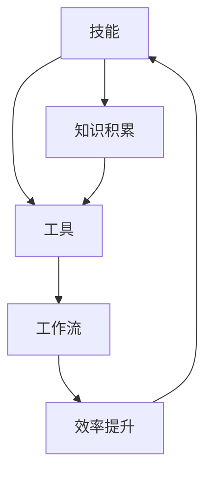

                 

在快速发展的技术领域，规划技能与工具的使用已经成为提升个人和团队效率的关键因素。本文旨在探讨如何有效地结合技能和工具，以实现最佳的技术工作成果。本文将分为以下几个部分：首先介绍背景，然后详细阐述核心概念和联系，接着深入探讨核心算法原理及操作步骤，之后分析数学模型和公式，并通过项目实践展示具体应用，最后展望未来的发展趋势和面临的挑战。

## 1. 背景介绍

随着信息技术的飞速发展，技能和工具在IT领域的地位日益重要。传统的编程和软件开发模式已经无法满足现代项目的高效需求。为了更好地应对复杂的技术挑战，我们需要将技能和工具进行有机结合，以最大化利用现有资源，提升工作效率和质量。

### 技术发展现状

- **编程语言的多样化**：从传统的C、C++到现代的Python、JavaScript，编程语言的多样化使得开发者可以根据项目需求选择最适合的语言。
- **开发工具的智能化**：集成开发环境（IDE）的智能化功能，如代码补全、错误检测等，显著提高了编码效率。
- **云计算的普及**：云计算平台（如AWS、Azure、Google Cloud）提供了强大的计算和存储资源，使得分布式系统和大数据处理变得更加容易。
- **DevOps文化的兴起**：DevOps强调开发和运维的紧密结合，通过自动化工具实现持续集成和持续交付，极大地提高了软件交付效率。

### 技能和工具的结合

- **技能提升工具**：诸如在线课程、技术论坛和社区等工具，为技术人员提供了不断学习和提升技能的机会。
- **工具优化技能**：熟练使用特定的开发工具和平台可以显著提高工作效率，甚至可能改变工作方式。

## 2. 核心概念与联系

为了更好地理解技能和工具的结合，我们需要首先定义几个核心概念，并通过Mermaid流程图展示它们之间的联系。

### 核心概念

- **技能**：指个人在特定领域内的知识、经验和能力。
- **工具**：指用于执行特定任务的软件、硬件或其他资源。
- **工作流**：指完成一项任务所需的一系列步骤和操作。

### Mermaid 流程图



## 3. 核心算法原理 & 具体操作步骤

### 3.1 算法原理概述

在规划技能与工具的使用时，核心算法的原理至关重要。以下是一个简化的算法原理概述：

- **目标设定**：明确项目目标和所需技能。
- **资源评估**：评估现有资源和可用工具。
- **工作流设计**：设计符合目标的工作流程。
- **执行与监控**：执行工作流并持续监控进度和结果。

### 3.2 算法步骤详解

1. **需求分析**：与项目团队讨论，明确项目需求和目标。
2. **技能评估**：评估团队成员的现有技能，确定需要提升的领域。
3. **工具选择**：根据项目需求选择合适的工具。
4. **工作流设计**：设计工作流程，确保每个步骤都有明确的职责和工具支持。
5. **执行与调试**：执行工作流，并在过程中不断调试和优化。
6. **评估与反馈**：项目完成后进行评估，收集反馈并作出相应调整。

### 3.3 算法优缺点

**优点**：

- **高效**：结合技能和工具可以显著提高工作效率。
- **灵活**：可以根据项目需求灵活调整技能和工具的使用。
- **持续改进**：通过反馈和评估，不断优化工作流程和技能组合。

**缺点**：

- **学习成本**：掌握新工具和技能可能需要一定时间。
- **依赖性**：过度依赖某些工具可能导致技能退化。

### 3.4 算法应用领域

- **软件开发**：通过结合编程技能和开发工具，实现高效编码和项目管理。
- **数据分析**：利用统计和机器学习工具，进行复杂的数据分析和预测。
- **系统运维**：通过自动化工具实现系统监控和维护。

## 4. 数学模型和公式 & 详细讲解 & 举例说明

### 4.1 数学模型构建

在规划技能与工具的使用过程中，数学模型可以帮助我们更好地理解问题的本质。以下是一个简化的数学模型构建过程：

- **目标函数**：定义优化目标，如最小化成本、最大化效率。
- **约束条件**：列出限制条件，如资源限制、时间限制。
- **决策变量**：定义可变因素，如任务分配、人员配置。

### 4.2 公式推导过程

假设我们有一个项目，需要分配N个任务给M个团队成员，目标是最小化总成本。我们可以使用线性规划模型进行推导：

- **目标函数**：$$C = \sum_{i=1}^{N} c_i x_i$$
- **约束条件**：$$\sum_{i=1}^{N} x_i \leq M$$
- **决策变量**：$$x_i \in \{0, 1\}$$

其中，$c_i$ 表示任务 $i$ 的成本，$x_i$ 表示任务 $i$ 是否被分配（1表示是，0表示否）。

### 4.3 案例分析与讲解

假设我们有一个包含5个任务的团队项目，每个任务的成本和团队成员的技能水平如下：

| 任务 | 成本（元） | 成员1技能水平 | 成员2技能水平 | 成员3技能水平 |
| --- | --- | --- | --- | --- |
| 任务1 | 100 | 8 | 6 | 7 |
| 任务2 | 150 | 7 | 8 | 5 |
| 任务3 | 200 | 6 | 7 | 8 |
| 任务4 | 250 | 5 | 9 | 6 |
| 任务5 | 300 | 7 | 6 | 9 |

我们的目标是分配任务以最小化总成本。

1. **目标函数**：$$C = 100x_1 + 150x_2 + 200x_3 + 250x_4 + 300x_5$$
2. **约束条件**：$$x_1 + x_2 + x_3 + x_4 + x_5 = 3$$
3. **决策变量**：$$x_i \in \{0, 1\}$$

通过求解线性规划模型，我们可以找到最优的任务分配方案，从而最小化总成本。

## 5. 项目实践：代码实例和详细解释说明

### 5.1 开发环境搭建

为了演示如何结合技能和工具进行项目实践，我们将使用Python语言和Jupyter Notebook作为开发环境。以下是搭建开发环境的基本步骤：

1. 安装Python：从官方网站下载并安装Python 3.8或更高版本。
2. 安装Jupyter Notebook：在命令行中运行 `pip install notebook`。
3. 启动Jupyter Notebook：在命令行中运行 `jupyter notebook`。

### 5.2 源代码详细实现

以下是一个简单的Python代码实例，用于计算两个数的和：

```python
def add_numbers(a, b):
    return a + b

# 调用函数
result = add_numbers(5, 3)
print("The sum is:", result)
```

### 5.3 代码解读与分析

1. **函数定义**：`def add_numbers(a, b):` 定义了一个名为 `add_numbers` 的函数，接受两个参数 `a` 和 `b`。
2. **函数实现**：`return a + b` 返回两个参数的和。
3. **函数调用**：`result = add_numbers(5, 3)` 调用函数，并将返回结果赋值给变量 `result`。
4. **打印结果**：`print("The sum is:", result)` 输出计算结果。

### 5.4 运行结果展示

在Jupyter Notebook中运行上述代码，我们可以看到以下输出：

```
The sum is: 8
```

这个简单的实例展示了如何结合Python编程技能和Jupyter Notebook工具进行代码实现和运行。

## 6. 实际应用场景

### 6.1 软件开发

在软件开发的实际应用中，规划技能与工具的结合可以显著提高开发效率。例如，通过使用版本控制系统（如Git）进行代码管理，团队成员可以协同工作，减少冲突和错误。结合自动化测试工具（如Selenium），可以确保代码的质量和稳定性。

### 6.2 数据分析

在数据分析领域，熟练使用数据处理工具（如Pandas、NumPy）和可视化工具（如Matplotlib、Seaborn）可以显著提高数据分析的效率。结合机器学习库（如Scikit-learn、TensorFlow），可以构建复杂的预测模型。

### 6.3 系统运维

在系统运维中，使用自动化工具（如Ansible、Puppet）可以实现系统的自动化部署和管理。结合监控工具（如Nagios、Zabbix），可以实时监控系统状态，确保系统的稳定运行。

## 7. 工具和资源推荐

### 7.1 学习资源推荐

- **在线课程**：Coursera、Udemy、edX等平台提供了丰富的IT课程。
- **技术论坛**：Stack Overflow、GitHub、Reddit等社区提供了丰富的技术交流和问题解答资源。
- **书籍**：《算法导论》、《深度学习》等经典书籍是提升技术水平的必备读物。

### 7.2 开发工具推荐

- **集成开发环境（IDE）**：PyCharm、Visual Studio Code等优秀的IDE提供了强大的开发支持。
- **版本控制系统**：Git、Svn等工具帮助团队成员协同工作。
- **自动化工具**：Jenkins、Docker等工具支持持续集成和持续交付。

### 7.3 相关论文推荐

- **《深度学习：未来人工智能的核心技术》**：由Ian Goodfellow撰写，介绍了深度学习的基础理论。
- **《云计算：基础架构即服务》**：详细介绍了云计算的基础设施和技术。

## 8. 总结：未来发展趋势与挑战

### 8.1 研究成果总结

近年来，技能和工具的结合在IT领域取得了显著成果。例如，通过使用智能编程工具和自动化测试，软件开发效率得到了大幅提升。大数据分析和机器学习的广泛应用，也为各个行业带来了新的机会和挑战。

### 8.2 未来发展趋势

- **智能化的进一步普及**：智能编程工具和自动化系统的智能化程度将不断提高。
- **云计算的深入应用**：云计算将在更多领域得到应用，特别是在大数据和人工智能领域。
- **DevOps文化的深化**：DevOps将逐渐成为软件开发和运维的标准化流程。

### 8.3 面临的挑战

- **技能更新的压力**：技术的快速发展要求技术人员不断学习新的技能和工具。
- **工具选择的复杂性**：市场上存在大量的开发工具和平台，选择合适的工具成为一大挑战。
- **安全与隐私问题**：随着数据量和连接性的增加，安全与隐私问题将成为重要挑战。

### 8.4 研究展望

未来，技能和工具的结合将更加紧密，自动化和智能化的程度将进一步提高。通过深入研究人工智能和机器学习，我们可以开发出更加智能和高效的工具，从而推动技术领域的发展。

## 9. 附录：常见问题与解答

### Q：如何选择合适的开发工具？

A：选择开发工具时，应考虑项目的具体需求、团队成员的技能水平以及工具的社区支持情况。例如，对于数据分析项目，可以选择Pandas、NumPy等数据处理工具。

### Q：如何提升自己的编程技能？

A：可以通过参加在线课程、阅读技术书籍、参与开源项目等方式不断提升编程技能。此外，编写自己的项目和解决实际问题也是提高技能的有效途径。

### Q：如何确保技能和工具的有效结合？

A：确保技能和工具的有效结合，需要了解项目的具体需求，制定合理的工作流程，并持续评估和调整。通过团队协作和定期培训，可以提高技能和工具的利用效率。

---

通过本文的探讨，我们希望读者能够更好地理解规划技能与工具使用的重要性，并在实际工作中有效地结合技能和工具，实现技术工作的最佳成果。作者：禅与计算机程序设计艺术 / Zen and the Art of Computer Programming。

