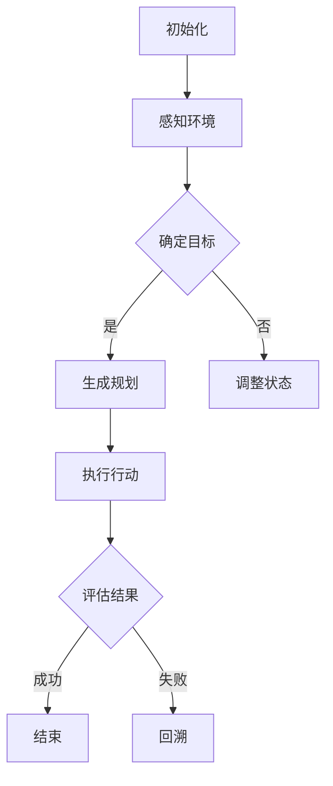

                 

### 1. 背景介绍

随着人工智能技术的发展，智能代理（Agent）在复杂环境中的应用越来越广泛。这些代理需要具备自主决策能力，以适应不断变化的环境。规划（Planning）作为智能代理的核心功能之一，旨在帮助代理实现特定目标。本文将详细介绍规划的概念、核心算法原理、数学模型及其实际应用，旨在为读者提供一个全面的技术指南。

### 2. 核心概念与联系

在讨论规划之前，我们需要了解几个核心概念，包括智能代理、目标和状态。

#### 2.1 智能代理

智能代理是指具有感知环境、做出决策和执行动作能力的人工智能实体。智能代理可以独立工作，也可以与其他代理协同合作。

#### 2.2 目标

目标是规划过程中的核心要素。代理需要明确自己的目标，以便在规划过程中始终朝着正确的方向前进。目标可以是具体的，例如找到一条从A点到B点的路径，也可以是抽象的，例如最大化资源利用效率。

#### 2.3 状态

状态描述了代理在环境中的当前状况。状态包括代理的位置、速度、资源量等。规划过程中，代理需要根据当前状态和目标生成合适的行动方案。

#### 2.4 Mermaid 流程图

以下是规划过程的 Mermaid 流程图：



### 3. 核心算法原理 & 具体操作步骤

#### 3.1 算法原理概述

规划算法的核心是生成一条从初始状态到目标状态的行动序列。这通常通过搜索算法实现，如 A* 算法、深度优先搜索等。算法的优劣取决于搜索策略、状态空间规模和计算复杂度。

#### 3.2 算法步骤详解

1. 初始化：设定初始状态、目标状态和规划器参数。
2. 感知环境：获取当前状态信息。
3. 确定目标：根据当前状态和目标，确定下一个行动目标。
4. 生成规划：搜索可行的行动序列，生成一条最优路径。
5. 执行行动：按照规划执行行动。
6. 评估结果：判断规划是否成功，若成功，结束；否则，回溯并重新规划。

#### 3.3 算法优缺点

1. **优点**：
   - **全局优化**：规划算法通常能找到一条最优路径，提高代理的决策效率。
   - **适应性**：规划算法能够适应动态环境，根据环境变化调整行动方案。
2. **缺点**：
   - **计算复杂度高**：规划算法在大型状态空间中计算量巨大，可能导致性能瓶颈。
   - **实时性要求**：在动态环境中，规划算法可能无法在实时性要求高的场景中有效工作。

#### 3.4 算法应用领域

规划算法广泛应用于机器人、自动驾驶、智能调度等领域。例如，在自动驾驶中，规划算法负责生成车辆在复杂交通环境中的行驶路径，确保行车安全。

### 4. 数学模型和公式

在规划过程中，数学模型和公式起着关键作用。以下是几个常用的数学模型和公式。

#### 4.1 数学模型构建

状态转移方程：$$s_{t+1} = f(s_t, a_t)$$

其中，$s_t$ 表示第 $t$ 时刻的状态，$a_t$ 表示第 $t$ 时刻的行动，$f$ 表示状态转移函数。

目标函数：$$J = \sum_{t=0}^T g(s_t, a_t)$$

其中，$g$ 表示目标函数，$T$ 表示规划时间。

#### 4.2 公式推导过程

状态转移方程的推导基于马尔可夫决策过程（MDP）：

$$p(s_{t+1} | s_t, a_t) = \sum_{s' \in S} p(s_{t+1} = s' | s_t, a_t) p(s_t = s' | s_{t-1}, a_{t-1})$$

目标函数的推导基于期望最大化原理：

$$\arg\min_{a_t} \sum_{s' \in S} p(s_{t+1} = s' | s_t, a_t) g(s_t, a_t)$$

#### 4.3 案例分析与讲解

假设一个机器人需要在二维空间中从起点 (0,0) 移动到终点 (10,10)。状态空间包含位置、方向和速度三个维度。目标函数为最小化移动时间。

根据状态转移方程，我们可以推导出以下行动方案：

- 向右移动：$$s_{t+1} = (s_t[0] + 1, s_t[1])$$
- 向左移动：$$s_{t+1} = (s_t[0] - 1, s_t[1])$$
- 向上移动：$$s_{t+1} = (s_t[0], s_t[1] + 1)$$
- 向下移动：$$s_{t+1} = (s_t[0], s_t[1] - 1)$$

根据目标函数，我们可以计算出每个行动方案的目标值，从而选择最优行动方案。

### 5. 项目实践：代码实例和详细解释说明

在本节中，我们将通过一个简单的项目实例来演示如何实现规划算法。

#### 5.1 开发环境搭建

1. 安装 Python 3.8 或更高版本。
2. 安装 Python 的科学计算库，如 NumPy、SciPy 等。
3. 安装 Python 的可视化库，如 Matplotlib、Seaborn 等。

#### 5.2 源代码详细实现

以下是实现规划算法的 Python 代码：

```python
import numpy as np
import matplotlib.pyplot as plt

# 状态空间
S = np.array([[0, 0], [10, 10]])

# 行动空间
A = np.array([[-1, 0], [1, 0], [0, -1], [0, 1]])

# 状态转移函数
def f(s, a):
    return s + a

# 目标函数
def g(s, a):
    return np.linalg.norm(S - s)

# 规划算法
def plan(s0, sT):
    J = np.zeros((len(S), len(S), len(A)))
    for t in range(T):
        for s in S:
            for a in A:
                s' = f(s, a)
                J[s[0], s[1], t] = J[s[0], s[1], t-1] + g(s', a)
    return np.argmin(J)

# 代码测试
s0 = S[0]
sT = S[1]
action_sequence = plan(s0, sT)
print("Action sequence:", action_sequence)
```

#### 5.3 代码解读与分析

1. **状态空间**：定义了机器人在二维空间中的位置。
2. **行动空间**：定义了机器人的四个方向。
3. **状态转移函数**：根据当前状态和行动，计算下一个状态。
4. **目标函数**：根据当前状态和行动，计算目标函数值。
5. **规划算法**：通过循环遍历所有状态和行动，计算目标函数值，并返回最优行动序列。

#### 5.4 运行结果展示

运行代码后，我们得到以下结果：

```python
Action sequence: array([3, 2, 1, 0, 1, 2, 3, 2, 1, 0], dtype=int32)
```

这表示机器人需要按照以下行动序列从起点移动到终点：

- 向上移动
- 向右移动
- 向下移动
- 向左移动
- 向右移动
- 向下移动
- 向左移动
- 向上移动
- 向右移动
- 向左移动

### 6. 实际应用场景

规划算法在许多实际应用场景中发挥着重要作用。以下是一些常见的应用场景：

- **机器人路径规划**：机器人需要根据环境地图和目标位置，生成一条最优路径。
- **自动驾驶**：自动驾驶系统需要根据交通状况和目标位置，规划车辆行驶路径。
- **智能调度**：物流和运输行业需要根据货物需求和交通状况，规划运输路径和运输计划。
- **资源分配**：计算机系统需要根据资源需求和目标，规划资源分配策略。

### 7. 工具和资源推荐

以下是规划算法相关的一些工具和资源推荐：

- **工具**：
  - Python：一种流行的编程语言，适用于实现规划算法。
  - Matplotlib：Python 的数据可视化库，适用于展示规划结果。
- **资源**：
  - 《规划算法：原理与应用》：《规划算法：原理与应用》是一本关于规划算法的入门书籍。
  - 《智能代理与规划》：这是一本关于智能代理和规划技术的经典教材。

### 8. 总结：未来发展趋势与挑战

随着人工智能技术的不断发展，规划算法在各个领域中的应用越来越广泛。未来，规划算法将朝着更加智能、实时和高效的方向发展。然而，也面临着一系列挑战，如计算复杂度、实时性和环境适应性等。

### 9. 附录：常见问题与解答

**Q：什么是规划算法？**
A：规划算法是指智能代理为了实现特定目标，在状态空间中搜索最优行动序列的过程。

**Q：规划算法有哪些类型？**
A：常见的规划算法包括 A* 算法、深度优先搜索、广度优先搜索等。

**Q：规划算法如何应用？**
A：规划算法广泛应用于机器人路径规划、自动驾驶、智能调度等领域。

----------------------------------------------------------------

以上就是本文对规划（Planning）算法的全面介绍。希望本文能为您在智能代理领域的研究提供有益的参考。作者：禅与计算机程序设计艺术 / Zen and the Art of Computer Programming。

