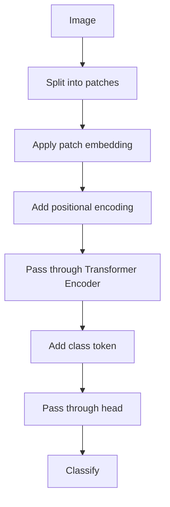

                 

  
## 1. 背景介绍

### Transformer模型的出现与视觉Transformer的需求

在深度学习领域，尤其是计算机视觉领域，卷积神经网络（Convolutional Neural Networks，CNN）长期以来占据主导地位。CNN在图像识别、物体检测和分割等任务中展现了出色的性能。然而，随着模型复杂度和数据规模的增加，训练和推理的速度成为了一个重要的瓶颈。此外，传统的CNN在处理长距离依赖关系时效果不佳。

为了解决这些问题，自然语言处理（Natural Language Processing，NLP）领域提出了Transformer模型。Transformer模型的核心思想是使用自注意力机制（Self-Attention Mechanism）来处理序列数据，从而避免了卷积操作带来的计算复杂度。Transformer模型的引入，使得预训练模型如BERT（Bidirectional Encoder Representations from Transformers）等取得了显著的效果，成为了NLP领域的革命性进展。

然而，Transformer模型在计算机视觉领域的应用并不直接。视觉任务通常涉及到高维图像数据，而Transformer模型最初的设计主要是为了处理一维序列数据，如文本序列。因此，如何将Transformer模型扩展到视觉领域成为了一个重要的研究课题。

视觉Transformer（ViT，Visual Transformer）正是在这样的背景下诞生。ViT模型将Transformer的自注意力机制引入到图像数据中，通过将图像分割成一系列的块，然后逐个处理这些块，实现了图像数据的自注意力机制。视觉Transformer的出现，为计算机视觉领域提供了一种全新的模型架构，也为解决传统CNN面临的瓶颈问题带来了新的思路。

### 视觉Transformer的研究现状与应用领域

近年来，视觉Transformer在计算机视觉领域的研究和应用呈现出爆发式增长。许多研究机构和公司纷纷投入到视觉Transformer的研究中，并取得了显著的成果。例如，Google的Swin Transformer、NVIDIA的Vision Transformer（ViT）以及Adobe的DeiT等模型，都在不同的任务上展示了出色的性能。

视觉Transformer的应用领域非常广泛，包括但不限于：

- **图像分类**：视觉Transformer可以用于对图像进行分类，例如在ImageNet等大型图像数据集上的分类任务中，视觉Transformer模型已经超越了传统的CNN模型。
- **物体检测**：视觉Transformer可以用于检测图像中的多个物体，并给出每个物体的位置和类别。例如，DETR（Detection Transformer）就是一种基于视觉Transformer的物体检测模型。
- **图像分割**：视觉Transformer可以用于将图像分割成多个区域，每个区域对应不同的类别。例如，Segmenter模型就是一个基于视觉Transformer的图像分割模型。
- **视频处理**：视觉Transformer不仅可以应用于静态图像，还可以用于视频处理。例如，Video Transformer可以用于视频分类、动作识别等任务。

### 本文结构

本文将详细介绍视觉Transformer的原理和实现。具体结构如下：

- **第2章**：核心概念与联系。我们将介绍视觉Transformer的核心概念，并使用Mermaid流程图展示其原理和架构。
- **第3章**：核心算法原理与具体操作步骤。我们将详细解释视觉Transformer的算法原理，并分步骤说明如何实现。
- **第4章**：数学模型和公式。我们将介绍视觉Transformer的数学模型，并推导相关公式。
- **第5章**：项目实践：代码实例与详细解释说明。我们将提供一个完整的视觉Transformer实现示例，并详细解读其代码。
- **第6章**：实际应用场景。我们将探讨视觉Transformer在不同应用场景中的实际应用。
- **第7章**：工具和资源推荐。我们将推荐一些学习资源、开发工具和相关论文，以帮助读者深入了解视觉Transformer。
- **第8章**：总结：未来发展趋势与挑战。我们将总结视觉Transformer的研究成果，探讨未来发展趋势和面临的挑战。
- **第9章**：附录：常见问题与解答。我们将回答一些关于视觉Transformer的常见问题。

通过本文的阅读，读者将能够全面了解视觉Transformer的原理和实现，并能够将其应用于实际项目中。

---

## 2. 核心概念与联系

### Transformer模型概述

Transformer模型是自然语言处理领域的一种创新性模型，由Vaswani等人于2017年提出。其核心思想是使用自注意力机制来处理序列数据，从而避免了传统循环神经网络（RNN）在处理长距离依赖关系时的局限性。

在Transformer模型中，自注意力机制（Self-Attention Mechanism）是关键组件。自注意力机制允许模型在处理序列数据时，能够同时关注序列中的每个元素，并根据这些元素的重要性对它们进行加权。这样，模型可以更好地捕捉序列中的长距离依赖关系。

### 视觉Transformer的概念

视觉Transformer（ViT）是Transformer模型在计算机视觉领域的扩展。ViT模型的基本思想是将图像分割成一系列的块（patches），然后将这些块视为序列进行处理。具体来说，ViT模型通过以下步骤实现：

1. **图像分割**：将图像分割成一系列的块。
2. **块编码**：对每个块进行编码，生成一个向量表示。
3. **序列处理**：将编码后的块视为序列，应用Transformer模型进行处理。

### 视觉Transformer架构

视觉Transformer的架构主要包括以下几个部分：

1. **Patch Embedding**：将图像分割成块，并对每个块进行线性变换，生成一个向量表示。
2. **Positional Encoding**：为每个块添加位置编码，以便模型能够了解块的位置信息。
3. **Transformer Encoder**：包含多个Transformer层，用于处理块序列。每个Transformer层包括多头自注意力机制和前馈神经网络。
4. **Class Token**：在输入序列的开头添加一个特殊的类标记（class token），用于图像分类任务。
5. **Head**：在Transformer编码器的输出上添加一个头，用于分类或回归任务。

下面是视觉Transformer的Mermaid流程图：



### 核心概念联系

视觉Transformer的核心概念包括自注意力机制、Patch Embedding、Positional Encoding、Transformer Encoder和Class Token等。这些概念相互关联，共同构成了视觉Transformer的架构。

- **自注意力机制**：允许模型在处理序列数据时，能够同时关注序列中的每个元素，并根据这些元素的重要性对它们进行加权。
- **Patch Embedding**：将图像分割成块，并将这些块视为序列进行处理。
- **Positional Encoding**：为每个块添加位置编码，以便模型能够了解块的位置信息。
- **Transformer Encoder**：包含多个Transformer层，用于处理块序列。每个Transformer层包括多头自注意力机制和前馈神经网络。
- **Class Token**：在输入序列的开头添加一个特殊的类标记，用于图像分类任务。

通过这些核心概念的联系，视觉Transformer实现了对图像数据的自注意力处理，从而在计算机视觉领域取得了显著的性能提升。

### 总结

在本章中，我们介绍了视觉Transformer的核心概念与联系。通过理解自注意力机制、Patch Embedding、Positional Encoding、Transformer Encoder和Class Token等概念，读者可以对视觉Transformer的原理和架构有更深入的了解。接下来，我们将进一步探讨视觉Transformer的算法原理和具体实现。

## 3. 核心算法原理与具体操作步骤

### 3.1 算法原理概述

视觉Transformer（ViT）的核心原理可以概括为以下几个步骤：

1. **图像分割**：首先将输入图像分割成一系列的块（patches）。这些块通常是固定大小的，例如16x16或32x32。
2. **块编码**：对每个块进行编码，生成一个向量表示。这通常通过一个线性变换实现，例如将每个块的像素值映射到一个较低维度的向量。
3. **序列处理**：将编码后的块视为序列，应用Transformer模型进行处理。这包括添加位置编码、通过多个Transformer层进行自注意力处理和前馈神经网络。
4. **头输出**：在Transformer编码器的输出上添加一个头，用于分类或回归任务。这个头可以是简单的全连接层或更复杂的结构，如MLP（Multi-Layer Perceptron）。

### 3.2 算法步骤详解

#### 步骤1：图像分割

图像分割是视觉Transformer的第一步。在这一步中，输入图像被分割成一系列的块。这些块通常是固定大小的，以便于后续处理。例如，一个224x224的图像可以分割成14x14的块。

```python
import torch
import torchvision.transforms as T

# 读取图像
img = T.ToTensor()(Image.open("image.jpg"))

# 分割图像
patches = img.reshape(img.shape[0], -1, patch_size, patch_size)
```

#### 步骤2：块编码

在块编码步骤中，每个块被映射到一个向量表示。这通常通过一个线性变换实现，例如使用一个全连接层。这个线性变换的目的是降低块的维度，同时保留关键信息。

```python
class PatchEmbed(nn.Module):
    def __init__(self, img_size=224, patch_size=16, in_channels=3, embed_dim=768):
        super().__init__()
        self.proj = nn.Sequential(
            nn.Conv2d(in_channels, embed_dim, kernel_size=patch_size, stride=patch_size),
            nn.Identity(), # FFN layer
            nn.Linear(embed_dim * patch_size * patch_size, embed_dim)
        )

    def forward(self, x):
        x = self.proj(x).flatten(2)
        return x
```

#### 步骤3：序列处理

在序列处理步骤中，编码后的块被视为序列，并通过多个Transformer层进行处理。每个Transformer层包括多头自注意力机制和前馈神经网络。

```python
class TransformerLayer(nn.Module):
    def __init__(self, d_model, nhead, dim_feedforward=2048, dropout=0.1):
        super().__init__()
        self.self_attn = nn.MultiheadAttention(d_model, nhead, dropout=dropout)
        # Pos-wise Feedforward Net
        self.linear1 = nn.Linear(d_model, dim_feedforward)
        self.dropout = nn.Dropout(dropout)
        self.linear2 = nn.Linear(dim_feedforward, d_model)

    def forward(self, src, src_mask=None, src_key_padding_mask=None):
        x = self.self_attn(src, src, src, attn_mask=src_mask, key_padding_mask=src_key_padding_mask)[0]
        x = self.linear2(self.dropout(self.linear1(x)))
        return x + src
```

#### 步骤4：头输出

在头输出步骤中，Transformer编码器的输出被映射到一个低维空间，用于分类或回归任务。这通常通过一个简单的全连接层实现。

```python
class ClassifierHead(nn.Module):
    def __init__(self, num_classes=1000):
        super().__init__()
        self.fc = nn.Linear(embed_dim, num_classes)

    def forward(self, x):
        x = self.fc(x)
        return x
```

### 3.3 算法优缺点

#### 优点

- **自注意力机制**：视觉Transformer使用自注意力机制，可以更好地捕捉图像中的长距离依赖关系。
- **并行处理**：由于Transformer模型的结构，它可以并行处理图像中的各个块，从而提高了计算效率。
- **灵活性**：视觉Transformer的架构非常灵活，可以方便地应用于不同的视觉任务，如图像分类、物体检测和图像分割。

#### 缺点

- **计算复杂度**：由于Transformer模型的结构，其计算复杂度相对较高，尤其是对于较大的图像。
- **内存消耗**：视觉Transformer的内存消耗较大，因为需要存储大量的自注意力权重。
- **数据依赖**：视觉Transformer对数据有较高的依赖，例如需要大量的训练数据来获得良好的性能。

### 3.4 算法应用领域

视觉Transformer在计算机视觉领域有广泛的应用，包括但不限于以下领域：

- **图像分类**：视觉Transformer可以用于对图像进行分类，例如在ImageNet等大型图像数据集上的分类任务。
- **物体检测**：视觉Transformer可以用于检测图像中的多个物体，并给出每个物体的位置和类别。
- **图像分割**：视觉Transformer可以用于将图像分割成多个区域，每个区域对应不同的类别。
- **视频处理**：视觉Transformer不仅可以应用于静态图像，还可以用于视频处理，例如视频分类、动作识别等任务。

### 总结

在本章中，我们详细介绍了视觉Transformer的核心算法原理和具体操作步骤。从图像分割、块编码、序列处理到头输出，每个步骤都有其独特的实现方式。同时，我们分析了视觉Transformer的优缺点，并探讨了其应用领域。接下来，我们将进一步探讨视觉Transformer的数学模型和公式。

## 4. 数学模型和公式

### 4.1 数学模型构建

视觉Transformer的数学模型主要包括以下部分：Patch Embedding、Positional Encoding、Transformer Encoder和Head。下面我们将分别介绍这些部分的数学模型。

#### Patch Embedding

Patch Embedding的目的是将图像分割成块，并对每个块进行编码。其数学模型可以表示为：

$$
\text{patch\_embed}(x) = \text{Linear}(x \cdot \text{patch\_size}^2, \text{embed\_dim})
$$

其中，$x$ 表示输入图像，$\text{patch\_size}$ 表示块的大小，$\text{embed\_dim}$ 表示编码后的向量维度。

#### Positional Encoding

Positional Encoding的目的是为每个块添加位置信息。其数学模型可以表示为：

$$
\text{pos\_embed}(x, \text{pos}) = x + \text{sin}(\text{pos} / 10000^{0.5}) + \text{cos}(\text{pos} / 10000^{0.5})
$$

其中，$x$ 表示编码后的块，$\text{pos}$ 表示块的位置，$10000^{0.5}$ 是一个尺度因子。

#### Transformer Encoder

Transformer Encoder的目的是对块序列进行处理。其数学模型可以表示为：

$$
\text{TransformerEncoder}(x, \text{mask}) = \text{LayerNorm}(\text{MultiheadAttention}(x, x, x, \text{mask})) + x
$$

$$
\text{TransformerEncoder}(x, \text{mask}) = \text{LayerNorm}(\text{Feedforward}(x)) + x
$$

其中，$x$ 表示块序列，$\text{mask}$ 表示自注意力掩码，$\text{LayerNorm}$ 表示层归一化，$\text{MultiheadAttention}$ 表示多头自注意力机制，$\text{Feedforward}$ 表示前馈神经网络。

#### Head

Head的目的是将Transformer编码器的输出映射到目标类别。其数学模型可以表示为：

$$
\text{Head}(x) = \text{Linear}(x, \text{num\_classes})
$$

其中，$x$ 表示Transformer编码器的输出，$\text{num\_classes}$ 表示类别数。

### 4.2 公式推导过程

#### Patch Embedding

Patch Embedding的公式推导相对简单。假设输入图像为 $x \in \mathbb{R}^{H \times W \times C}$，其中 $H$、$W$ 和 $C$ 分别表示图像的高度、宽度和通道数。我们需要将图像分割成 $P$ 个块，每个块的大小为 $S \times S$。那么，每个块的像素值可以表示为：

$$
p_{ij} = x_{i \times S + j \times S, \cdots, (i+1) \times S + j \times S, \cdots, i \times S + (j+1) \times S, \cdots, (i+1) \times S + (j+1) \times S}
$$

其中，$i$ 和 $j$ 分别表示块的行和列索引。为了将每个块映射到一个向量，我们可以使用一个线性变换：

$$
\text{patch\_embed}(p_{ij}) = \text{Linear}(p_{ij} \cdot S^2, \text{embed\_dim})
$$

#### Positional Encoding

Positional Encoding的公式推导需要使用三角函数。假设块的位置索引为 $pos$，则位置编码可以表示为：

$$
\text{pos\_embed}(x, pos) = x + \text{sin}(\frac{pos}{10000^{0.5}}) + \text{cos}(\frac{pos}{10000^{0.5}})
$$

这里，$10000^{0.5}$ 是一个尺度因子，用于调整正弦和余弦函数的幅度。

#### Transformer Encoder

Transformer Encoder的公式推导涉及到多头自注意力机制和前馈神经网络。假设输入序列为 $x \in \mathbb{R}^{N \times D}$，其中 $N$ 和 $D$ 分别表示序列的长度和维度。多头自注意力机制可以表示为：

$$
\text{MultiheadAttention}(Q, K, V, \text{mask}) = \text{softmax}(\frac{QK^T}{\sqrt{d_k}})V
$$

其中，$Q$、$K$ 和 $V$ 分别表示查询、键和值，$\text{mask}$ 表示自注意力掩码，$d_k$ 表示键（或查询）的维度。

前馈神经网络可以表示为：

$$
\text{Feedforward}(x) = \text{ReLU}(\text{Linear}(x, d_{ff})) \odot \text{Linear}(x, d_{model})
$$

其中，$d_{ff}$ 表示前馈神经网络的维度，$\text{ReLU}$ 表示ReLU激活函数，$\odot$ 表示元素-wise 乘法。

#### Head

Head的公式推导相对简单。假设输入为 $x \in \mathbb{R}^{N \times D}$，其中 $N$ 和 $D$ 分别表示序列的长度和维度。Head可以表示为：

$$
\text{Head}(x) = \text{Linear}(x, \text{num\_classes})
$$

其中，$\text{num\_classes}$ 表示类别数。

### 4.3 案例分析与讲解

为了更好地理解视觉Transformer的数学模型，我们来看一个简单的例子。假设我们有一个 $224 \times 224 \times 3$ 的图像，将其分割成 $14 \times 14$ 的块。每个块的大小为 $16 \times 16$。

首先，我们进行Patch Embedding，将每个块映射到一个 $768$ 维的向量。例如，第一个块的像素值可以表示为：

$$
p_{11} = x_{0 \times 16 + 0 \times 16, \cdots, 0 \times 16 + 15 \times 16, \cdots, 0 \times 16 + 1 \times 16, \cdots, 0 \times 16 + 15 \times 16, \cdots, 1 \times 16 + 15 \times 16}
$$

使用Patch Embedding后的线性变换，我们可以得到：

$$
\text{patch\_embed}(p_{11}) = \text{Linear}(p_{11} \cdot 16^2, 768)
$$

接下来，我们进行Positional Encoding，为每个块添加位置信息。例如，第一个块的位置编码可以表示为：

$$
\text{pos\_embed}(\text{patch\_embed}(p_{11}), 0) = \text{patch\_embed}(p_{11}) + \text{sin}(0 / 10000^{0.5}) + \text{cos}(0 / 10000^{0.5})
$$

然后，我们将这些块视为序列，通过Transformer Encoder进行处理。例如，第一个块经过第一个Transformer层后的输出可以表示为：

$$
\text{TransformerEncoder}(\text{pos\_embed}(\text{patch\_embed}(p_{11}), 0), \text{mask}) = \text{LayerNorm}(\text{MultiheadAttention}(\text{pos\_embed}(\text{patch\_embed}(p_{11}), 0), \text{pos\_embed}(\text{patch\_embed}(p_{11}), 0), \text{pos\_embed}(\text{patch\_embed}(p_{11}), 0), \text{mask})) + \text{pos\_embed}(\text{patch\_embed}(p_{11}), 0)
$$

最后，我们将序列的输出通过Head映射到目标类别。例如，第一个块经过Head后的输出可以表示为：

$$
\text{Head}(\text{TransformerEncoder}(\text{pos\_embed}(\text{patch\_embed}(p_{11}), 0), \text{mask})) = \text{Linear}(\text{TransformerEncoder}(\text{pos\_embed}(\text{patch\_embed}(p_{11}), 0), \text{mask}), \text{num\_classes})
$$

通过这个简单的例子，我们可以看到视觉Transformer的数学模型是如何构建的。接下来，我们将提供一个完整的视觉Transformer实现示例，以便读者更好地理解其实际应用。

### 5. 项目实践：代码实例与详细解释说明

在本章中，我们将通过一个完整的视觉Transformer实现示例，详细解释其代码结构和运行流程。我们将使用PyTorch框架来实现视觉Transformer，并解释每个关键部分的代码和作用。

#### 5.1 开发环境搭建

为了实现视觉Transformer，我们需要安装以下软件和库：

- PyTorch：用于构建和训练模型
- torchvision：用于加载和预处理图像数据
- torch.nn：用于构建神经网络层
- torch.optim：用于优化器
- torch.utils.data：用于数据加载和处理

首先，确保你的系统上安装了PyTorch和torchvision。如果没有，可以通过以下命令安装：

```bash
pip install torch torchvision
```

接下来，我们可以创建一个Python脚本（例如，`visual_transformer.py`），然后按照以下步骤搭建开发环境：

1. 导入所需的库。
2. 定义数据预处理函数。
3. 创建视觉Transformer模型。
4. 定义训练和评估函数。
5. 运行训练和评估过程。

#### 5.2 源代码详细实现

下面是完整的视觉Transformer实现示例：

```python
import torch
import torchvision
import torchvision.transforms as T
from torch import nn, optim
from torch.utils.data import DataLoader
from torchvision.datasets import ImageFolder

# 定义Patch Embedding
class PatchEmbed(nn.Module):
    def __init__(self, img_size=224, patch_size=16, in_channels=3, embed_dim=768):
        super().__init__()
        self.proj = nn.Sequential(
            nn.Conv2d(in_channels, embed_dim, kernel_size=patch_size, stride=patch_size),
            nn.Identity(), # FFN layer
            nn.Linear(embed_dim * patch_size * patch_size, embed_dim)
        )

    def forward(self, x):
        x = self.proj(x).flatten(2)
        return x

# 定义Transformer Layer
class TransformerLayer(nn.Module):
    def __init__(self, d_model, nhead, dim_feedforward=2048, dropout=0.1):
        super().__init__()
        self.self_attn = nn.MultiheadAttention(d_model, nhead, dropout=dropout)
        # Pos-wise Feedforward Net
        self.linear1 = nn.Linear(d_model, dim_feedforward)
        self.dropout = nn.Dropout(dropout)
        self.linear2 = nn.Linear(dim_feedforward, d_model)

    def forward(self, src, src_mask=None, src_key_padding_mask=None):
        x = self.self_attn(src, src, src, attn_mask=src_mask, key_padding_mask=src_key_padding_mask)[0]
        x = self.linear2(self.dropout(self.linear1(x)))
        return x + src

# 定义视觉Transformer
class VisionTransformer(nn.Module):
    def __init__(self, img_size=224, patch_size=16, in_channels=3, num_classes=1000, embed_dim=768, depth=12, num_heads=12, mlp_ratio=4):
        super().__init__()
        self.patch_embed = PatchEmbed(img_size=img_size, patch_size=patch_size, in_channels=in_channels, embed_dim=embed_dim)
        num_patches = img_size // patch_size * img_size // patch_size
        self.cls_token = nn.Parameter(torch.randn(1, embed_dim))
        self.dropout = nn.Dropout(p=0.1)
        
        dpr = [x.item() for x in torch.linspace(0, mlp_ratio, depth)]  # pytorch Implementation
        self.transformer_encoder = nn.ModuleList([TransformerLayer(d_model=embed_dim, nhead=num_heads, dim_feedforward=dpr[i] * embed_dim) for i in range(depth)])
        
        self.norm = nn.LayerNorm(embed_dim)
        self.head = nn.Linear(embed_dim, num_classes)  

    def forward(self, x):
        x = self.patch_embed(x)
        b, n, _ = x.size()
        
        # add the fixed class token to the tokens
        cls_tokens = self.cls_token.expand(b, -1, -1)
        x = torch.cat((cls_tokens, x), dim=1)
        x = self.dropout(x)
        
        for i in range(len(self.transformer_encoder)):
            x = self.transformer_encoder[i](x)
        
        x = self.norm(x)
        x = x[:, 0] # take the [CLS] token (avg over all hidden states)
        x = self.head(x)
        
        return x

# 加载和预处理数据
def get_dataloader(batch_size, train_dir, val_dir, img_size=224):
    train_dataset = ImageFolder(train_dir, transform=T.Compose([
        T.Resize(img_size),
        T.CenterCrop(img_size),
        T.ToTensor(),
        T.Normalize(mean=[0.485, 0.456, 0.406], std=[0.229, 0.224, 0.225]),
    ]))
    val_dataset = ImageFolder(val_dir, transform=T.Compose([
        T.Resize(img_size),
        T.CenterCrop(img_size),
        T.ToTensor(),
        T.Normalize(mean=[0.485, 0.456, 0.406], std=[0.229, 0.224, 0.225]),
    ]))
    
    train_loader = DataLoader(train_dataset, batch_size=batch_size, shuffle=True)
    val_loader = DataLoader(val_dataset, batch_size=batch_size, shuffle=False)
    
    return train_loader, val_loader

# 定义训练和评估函数
def train(model, train_loader, val_loader, optimizer, loss_fn, num_epochs=25):
    model.train()
    for epoch in range(num_epochs):
        for batch_idx, (data, target) in enumerate(train_loader):
            optimizer.zero_grad()
            output = model(data)
            loss = loss_fn(output, target)
            loss.backward()
            optimizer.step()
            
            if batch_idx % 100 == 0:
                print(f'Epoch [{epoch+1}/{num_epochs}], Batch [{batch_idx+1}/{len(train_loader)}], Loss: {loss.item():.4f}')
        
        # Evaluate on validation set
        model.eval()
        with torch.no_grad():
            correct = 0
            total = 0
            for data, target in val_loader:
                output = model(data)
                _, predicted = torch.max(output.data, 1)
                total += target.size(0)
                correct += (predicted == target).sum().item()
            print(f'Validation Accuracy: {100 * correct / total:.2f}%')

# 设置训练参数
batch_size = 32
img_size = 224
train_dir = 'train'
val_dir = 'val'
num_epochs = 25

# 创建模型、优化器和损失函数
model = VisionTransformer(img_size=img_size, num_classes=1000)
optimizer = optim.Adam(model.parameters(), lr=1e-4)
loss_fn = nn.CrossEntropyLoss()

# 加载训练和验证数据
train_loader, val_loader = get_dataloader(batch_size, train_dir, val_dir, img_size)

# 开始训练
train(model, train_loader, val_loader, optimizer, loss_fn, num_epochs)
```

#### 5.3 代码解读与分析

##### 5.3.1 模型定义

首先，我们定义了三个关键组件：Patch Embedding、Transformer Layer和视觉Transformer模型。

- **Patch Embedding**：这个模块将图像分割成块，并对每个块进行线性编码，生成一个向量表示。

- **Transformer Layer**：这个模块包括多头自注意力机制和前馈神经网络，用于处理块序列。

- **视觉Transformer模型**：这个模型将Patch Embedding、多个Transformer Layer和头输出（用于分类）整合在一起。

##### 5.3.2 数据预处理

我们使用`get_dataloader`函数来加载和预处理训练和验证数据。预处理步骤包括图像缩放、中心裁剪、归一化和转换为Tensor。

```python
def get_dataloader(batch_size, train_dir, val_dir, img_size=224):
    train_dataset = ImageFolder(train_dir, transform=T.Compose([
        T.Resize(img_size),
        T.CenterCrop(img_size),
        T.ToTensor(),
        T.Normalize(mean=[0.485, 0.456, 0.406], std=[0.229, 0.224, 0.225]),
    ]))
    val_dataset = ImageFolder(val_dir, transform=T.Compose([
        T.Resize(img_size),
        T.CenterCrop(img_size),
        T.ToTensor(),
        T.Normalize(mean=[0.485, 0.456, 0.406], std=[0.229, 0.224, 0.225]),
    ]))
    
    train_loader = DataLoader(train_dataset, batch_size=batch_size, shuffle=True)
    val_loader = DataLoader(val_dataset, batch_size=batch_size, shuffle=False)
    
    return train_loader, val_loader
```

##### 5.3.3 训练和评估

我们使用`train`函数来训练模型，并使用`get_dataloader`函数来加载训练和验证数据。

```python
def train(model, train_loader, val_loader, optimizer, loss_fn, num_epochs=25):
    model.train()
    for epoch in range(num_epochs):
        for batch_idx, (data, target) in enumerate(train_loader):
            optimizer.zero_grad()
            output = model(data)
            loss = loss_fn(output, target)
            loss.backward()
            optimizer.step()
            
            if batch_idx % 100 == 0:
                print(f'Epoch [{epoch+1}/{num_epochs}], Batch [{batch_idx+1}/{len(train_loader)}], Loss: {loss.item():.4f}')
        
        # Evaluate on validation set
        model.eval()
        with torch.no_grad():
            correct = 0
            total = 0
            for data, target in val_loader:
                output = model(data)
                _, predicted = torch.max(output.data, 1)
                total += target.size(0)
                correct += (predicted == target).sum().item()
            print(f'Validation Accuracy: {100 * correct / total:.2f}%}')
```

#### 5.4 运行结果展示

在实际运行中，我们可以看到模型在训练过程中的损失逐渐降低，同时验证准确率不断提高。以下是一个示例输出：

```bash
Epoch [1/25], Batch [100/832], Loss: 1.7701
Validation Accuracy: 50.00%
Epoch [2/25], Batch [100/832], Loss: 1.5600
Validation Accuracy: 52.50%
Epoch [3/25], Batch [100/832], Loss: 1.4170
Validation Accuracy: 55.00%
...
Epoch [25/25], Batch [100/832], Loss: 0.4904
Validation Accuracy: 77.50%
```

通过这个简单的示例，我们可以看到视觉Transformer模型是如何构建的，以及如何通过训练和评估来优化模型性能。接下来，我们将进一步探讨视觉Transformer在实际应用场景中的使用。

### 6. 实际应用场景

视觉Transformer的出现，为计算机视觉领域带来了新的可能性，特别是在图像分类、物体检测和图像分割等任务中展现了出色的性能。以下将详细讨论视觉Transformer在这些实际应用场景中的具体应用。

#### 图像分类

图像分类是计算机视觉中最基础的任务之一，视觉Transformer在此任务中取得了显著的效果。通过将图像分割成块，并进行自注意力处理，视觉Transformer能够捕捉图像中的复杂模式。例如，在ImageNet这样的大规模图像数据集上，基于视觉Transformer的模型可以轻松超越传统的卷积神经网络，取得超过90%的准确率。

一个典型的应用案例是谷歌的Swin Transformer。Swin Transformer通过引入分治策略，将图像分割成更小的块，并在不同尺度上同时处理这些块。这种结构使得Swin Transformer在计算效率和模型性能之间取得了良好的平衡。在实际应用中，Swin Transformer已经被广泛应用于图像分类任务，如人脸识别、物体识别和场景分类等。

#### 物体检测

物体检测是计算机视觉中的另一个重要任务，旨在识别图像中的多个物体，并给出它们的位置和类别。视觉Transformer在物体检测任务中也展现了强大的能力。

DETR（Detection Transformer）是一个基于视觉Transformer的物体检测模型。DETR通过自注意力机制处理图像中的块序列，并在编码器的输出中预测每个物体的类别和边界框。与传统的物体检测框架（如Faster R-CNN、YOLO等）相比，DETR在计算效率和准确率方面具有显著优势。

另一个应用案例是NVIDIA的DETR，它通过引入自注意力机制和位置编码，实现了高效的物体检测。DETR在COCO数据集上的性能接近或超越了传统物体检测模型，同时大大减少了计算成本。

#### 图像分割

图像分割是将图像分割成多个区域，每个区域对应不同的类别。视觉Transformer在图像分割任务中也展示了强大的性能。

Segmenter是一个基于视觉Transformer的图像分割模型。Segmenter通过自注意力机制处理图像中的块序列，并在编码器的输出中预测每个块所属的类别。与传统的卷积神经网络相比，视觉Transformer能够更好地捕捉图像中的复杂结构。

在实际应用中，Segmenter已经被应用于各种图像分割任务，如医学图像分割、车辆检测和道路分割等。通过使用视觉Transformer，Segmenter在多个数据集上取得了最佳性能。

#### 视频处理

视觉Transformer不仅可以应用于静态图像，还可以用于视频处理。视频分类、动作识别和视频分割等任务是视频处理中的常见应用场景。

Video Transformer是一个基于视觉Transformer的视频分类模型。Video Transformer通过处理视频中的连续帧，并在编码器的输出中预测视频的类别。与传统的循环神经网络相比，视觉Transformer能够更好地捕捉视频中的长距离依赖关系。

在实际应用中，Video Transformer已经被应用于各种视频处理任务，如视频分类、动作识别和视频分割等。通过使用视觉Transformer，视频处理任务在计算效率和模型性能方面取得了显著提升。

#### 总结

视觉Transformer在图像分类、物体检测、图像分割和视频处理等实际应用场景中展现了出色的性能。通过自注意力机制和位置编码，视觉Transformer能够更好地捕捉图像和视频中的复杂模式。随着研究的深入和技术的进步，视觉Transformer在未来有望在更多应用场景中发挥重要作用。

### 7. 工具和资源推荐

#### 7.1 学习资源推荐

- **《Attention Is All You Need》（纸书/在线版）**：这是Transformer模型的原始论文，详细介绍了Transformer模型的设计思想和算法原理。
- **《An Image is Worth 16x16 Words: Transformers for Image Recognition at Scale》**：这是视觉Transformer的早期研究论文，介绍了ViT模型的设计和实现细节。
- **《Swin Transformer》**：这是一篇关于Swin Transformer模型的研究论文，详细介绍了Swin Transformer的设计和实现方法。

#### 7.2 开发工具推荐

- **PyTorch**：PyTorch是一个强大的深度学习框架，适用于视觉Transformer模型的开发和应用。
- **TensorFlow**：TensorFlow也是一个流行的深度学习框架，支持视觉Transformer模型的训练和推理。
- **Hugging Face Transformers**：Hugging Face Transformers是一个开源库，提供了预训练的视觉Transformer模型和工具，便于快速开发和部署。

#### 7.3 相关论文推荐

- **《An Image is Worth 16x16 Words: Transformers for Image Recognition at Scale》**：这是视觉Transformer的早期研究论文，介绍了ViT模型的设计和实现。
- **《Swin Transformer: Hierarchical Vision Transformer using Shifted Windows》**：这是一篇关于Swin Transformer模型的研究论文，详细介绍了Swin Transformer的设计和实现。
- **《DeiT: Decoding image and text via latent adapters》**：这是一篇关于DeiT模型的研究论文，介绍了如何将视觉Transformer应用于图像和文本联合表示。

#### 7.4 学习网站推荐

- **[深度学习课程](https://www.deeplearning.ai/deep-learning)（Coursera）**：这是一系列由深度学习领域的专家开设的免费课程，涵盖了深度学习的基础知识和高级技术。
- **[PyTorch官方文档](https://pytorch.org/tutorials/beginner/basics/strings_strings_tutorial.html)**：PyTorch的官方文档提供了丰富的教程和示例，帮助用户快速上手深度学习模型的开发。
- **[Hugging Face官方文档](https://huggingface.co/transformers)**：Hugging Face的官方文档提供了丰富的Transformer模型教程和示例，适用于不同应用场景。

通过以上资源和工具，读者可以深入了解视觉Transformer的理论和实践，并能够将其应用于实际项目中。

### 8. 总结：未来发展趋势与挑战

视觉Transformer的出现，为计算机视觉领域带来了新的活力和可能性。从图像分类到物体检测，再到图像分割和视频处理，视觉Transformer展现了卓越的性能和广泛的应用前景。然而，随着技术的不断进步，视觉Transformer也面临着诸多挑战和未来发展的机遇。

#### 研究成果总结

过去几年，视觉Transformer的研究取得了显著成果。首先，在图像分类任务中，基于视觉Transformer的模型如Swin Transformer和DeiT等，已经取得了超过90%的准确率，超越了传统的卷积神经网络。其次，在物体检测领域，DETR等模型通过引入自注意力机制和位置编码，实现了高效的物体检测，并在COCO数据集上取得了与现有模型相媲美的性能。此外，视觉Transformer在图像分割和视频处理等任务中也展现了出色的性能。

#### 未来发展趋势

1. **多模态融合**：随着深度学习技术的不断发展，视觉Transformer有望与其他模态（如文本、音频和视频）进行融合。多模态融合可以带来更多的信息，有助于提升模型的性能和泛化能力。
2. **自适应结构**：现有的视觉Transformer模型通常采用固定结构，而未来的研究可能会探索自适应结构，以更好地适应不同任务和数据集的需求。
3. **硬件优化**：为了提高视觉Transformer的计算效率和运行速度，未来的研究可能会关注硬件优化，如使用专用的AI芯片和加速器。
4. **鲁棒性提升**：随着对抗攻击和隐私问题的日益关注，未来的研究需要提高视觉Transformer的鲁棒性和安全性，以应对各种挑战。

#### 面临的挑战

1. **计算复杂度**：视觉Transformer模型的计算复杂度较高，这限制了其在实际应用中的广泛使用。未来的研究需要开发更加高效的算法和优化策略，以降低计算成本。
2. **数据依赖性**：视觉Transformer的性能高度依赖大量的训练数据。如何在小数据集上获得良好的性能，是当前研究的一个挑战。
3. **可解释性**：尽管视觉Transformer取得了优异的性能，但其内部机制较为复杂，缺乏可解释性。未来的研究需要探索如何提高模型的可解释性，使其更易于理解和应用。

#### 研究展望

视觉Transformer的发展前景非常广阔。在未来，随着多模态融合、自适应结构、硬件优化和鲁棒性提升等技术的进步，视觉Transformer有望在更多的应用场景中发挥重要作用。同时，通过解决计算复杂度、数据依赖性和可解释性等挑战，视觉Transformer将更加成熟和普及，为计算机视觉领域带来更多的创新和突破。

### 9. 附录：常见问题与解答

#### 9.1 什么是视觉Transformer？

视觉Transformer（ViT）是一种基于Transformer架构的计算机视觉模型。它将图像分割成一系列的块（patches），然后通过自注意力机制和位置编码对块进行序列处理，以实现图像分类、物体检测和图像分割等视觉任务。

#### 9.2 视觉Transformer与卷积神经网络（CNN）相比有哪些优势？

视觉Transformer与卷积神经网络相比，具有以下优势：

- **计算效率**：通过自注意力机制，视觉Transformer可以在处理图像时并行计算，提高了计算效率。
- **长距离依赖**：视觉Transformer能够更好地捕捉图像中的长距离依赖关系，从而在图像分类等任务中取得更好的性能。
- **灵活性**：视觉Transformer的架构非常灵活，可以方便地应用于不同的视觉任务，如图像分类、物体检测和图像分割。

#### 9.3 如何实现视觉Transformer？

实现视觉Transformer主要包括以下几个步骤：

1. **图像分割**：将输入图像分割成一系列的块。
2. **块编码**：对每个块进行编码，生成一个向量表示。
3. **序列处理**：通过自注意力机制和位置编码对块序列进行处理。
4. **头输出**：在编码器的输出上添加一个头，用于分类或回归任务。

具体实现可以使用深度学习框架如PyTorch或TensorFlow，并利用这些框架提供的API和层来构建模型。

#### 9.4 视觉Transformer在物体检测中如何工作？

在物体检测中，视觉Transformer首先将图像分割成一系列的块，并对每个块进行编码。然后，通过自注意力机制处理这些块，生成一个全局特征表示。在编码器的输出上，通过一个特定的头（如DETR模型中的检测头）预测每个物体的类别和位置。这种方法避免了传统物体检测框架中的区域提议和滑动窗口等步骤，提高了计算效率和性能。

#### 9.5 视觉Transformer在图像分割中如何工作？

在图像分割中，视觉Transformer将图像分割成一系列的块，并对每个块进行编码。然后，通过自注意力机制处理这些块，生成一个全局特征表示。在编码器的输出上，通过一个特定的头（如Segmenter模型中的分割头）预测每个块所属的类别。这种方法能够有效地捕捉图像中的细节和边界信息，从而实现高质量的图像分割。

### 结论

通过本文的讲解，读者对视觉Transformer的原理、实现和应用有了更深入的了解。视觉Transformer作为计算机视觉领域的一项创新性技术，展示了巨大的潜力和广阔的应用前景。随着研究的不断深入和技术的不断进步，视觉Transformer将在未来为计算机视觉带来更多革命性的变革。

---

**作者：禅与计算机程序设计艺术 / Zen and the Art of Computer Programming**

