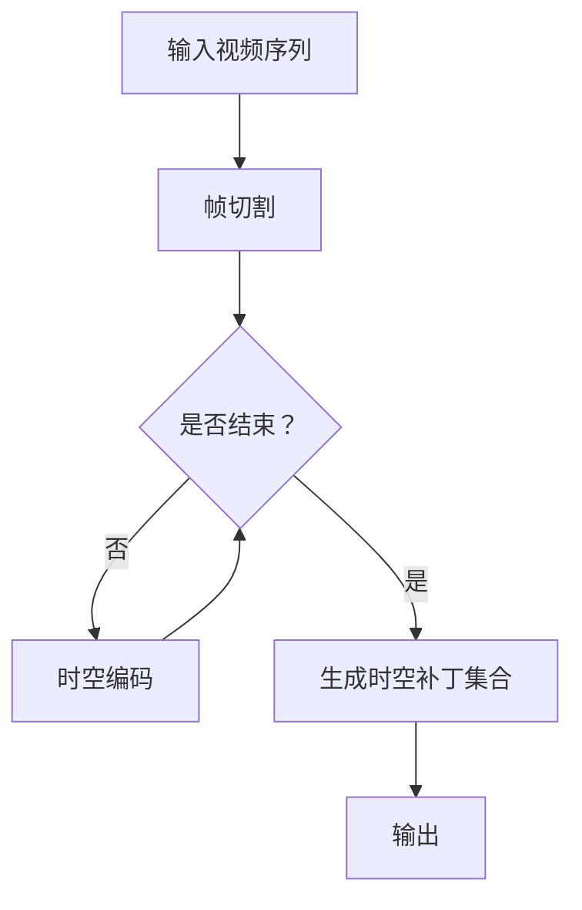

                 

关键词：视频处理，时空补丁，图像分析，深度学习，计算机视觉

## 摘要

本文深入探讨了视频数据中的时空补丁化技术。在计算机视觉和图像处理领域，时空补丁化是一种关键的预处理方法，它通过将视频序列中的帧分割成小区域，从而实现更高维度的数据处理，增强模型对动态场景的理解能力。本文首先介绍了时空补丁化的背景和意义，然后详细描述了核心概念与联系，并探讨了时空补丁化算法的原理、数学模型、项目实践以及实际应用场景。最后，对未来的发展趋势和面临的挑战进行了展望。

### 1. 背景介绍

随着视频技术的快速发展，视频数据在各个领域得到了广泛应用，从社交媒体到安全监控，从娱乐到科学研究。然而，视频数据的处理与分析面临着巨大的挑战。传统的图像处理方法在处理静态图像时表现良好，但面对动态视频序列时，往往难以捕捉到视频中的时间动态变化。为了解决这个问题，研究者们提出了时空补丁化的概念。

时空补丁化（Spacetime Patching）是将视频序列中的每一帧分割成多个小区域（patches），并将这些小区域作为一个高维数据集合进行处理的预处理方法。这种方法能够捕捉到视频中的时间和空间变化，从而在图像分析、动作识别、目标跟踪等方面具有显著优势。

### 2. 核心概念与联系

#### 2.1. 时空补丁化原理

时空补丁化的核心思想是将连续的视频序列转化为多个时空补丁，每个补丁包含了特定的空间和时间信息。具体步骤如下：

1. **帧切割**：将视频序列中的每一帧按照一定的规则切割成多个小区域。
2. **时空编码**：对每个小区域进行时空编码，生成时空补丁。
3. **补丁集合**：将所有时空补丁组织成一个新的高维数据集合。

#### 2.2. Mermaid 流程图

下面是一个简化的 Mermaid 流程图，展示了时空补丁化的基本流程：



### 3. 核心算法原理 & 具体操作步骤

#### 3.1. 算法原理概述

时空补丁化的算法原理主要包括以下几个步骤：

1. **帧切割**：根据预定义的策略，将视频帧切割成多个小块。
2. **时空编码**：对每个小块进行时空编码，生成时空补丁。
3. **补丁拼接**：将时空补丁按照特定的顺序和结构拼接成一个新的数据集合。

#### 3.2. 算法步骤详解

1. **帧切割**：
   - **选择策略**：常见的帧切割策略包括固定大小切割、基于运动估计的切割等。
   - **切割操作**：根据选定的策略，对每一帧进行切割操作。

2. **时空编码**：
   - **时空特征提取**：对切割后的每个小块进行特征提取，包括空间特征和时间特征。
   - **编码操作**：将提取到的特征编码成时空补丁。

3. **补丁拼接**：
   - **结构定义**：定义时空补丁集合的结构，包括补丁的大小、顺序等。
   - **拼接操作**：将时空补丁按照定义的结构拼接成一个新的数据集合。

#### 3.3. 算法优缺点

**优点**：
- **增强理解能力**：通过时空补丁化，模型能够更好地理解视频中的时间和空间动态变化。
- **提高计算效率**：时空补丁化可以将复杂的视频序列分解成多个小部分，从而提高计算效率。

**缺点**：
- **数据冗余**：由于切割和拼接的过程，时空补丁化可能会引入一定程度的冗余数据。
- **计算复杂度**：切割和拼接操作可能会增加计算复杂度。

#### 3.4. 算法应用领域

时空补丁化技术在多个领域具有广泛的应用前景：

- **图像分析**：用于提高图像识别和分类的准确性。
- **动作识别**：用于分析视频中的动作，进行动作分类和动作预测。
- **目标跟踪**：用于跟踪视频中的运动目标，提高跟踪的稳定性和准确性。

### 4. 数学模型和公式 & 详细讲解 & 举例说明

#### 4.1. 数学模型构建

时空补丁化的数学模型主要包括以下几个部分：

1. **时空补丁定义**：设视频序列为 \( V \)，帧数为 \( N \)，每帧大小为 \( M \times M \)。时空补丁定义为：
   \[ P = \{p_{ij}\} \]
   其中，\( p_{ij} \) 表示第 \( i \) 帧、第 \( j \) 个小块的时空补丁。

2. **时空编码模型**：时空补丁的编码模型可以表示为：
   \[ E(P) = \sum_{i=1}^{N} \sum_{j=1}^{M} f(p_{ij}) \]
   其中，\( f(p_{ij}) \) 表示时空补丁 \( p_{ij} \) 的特征函数。

3. **时空补丁集合**：时空补丁集合可以表示为：
   \[ S = \{E(P)\} \]
   其中，\( E(P) \) 表示时空补丁集合。

#### 4.2. 公式推导过程

时空补丁化的公式推导主要包括以下几个步骤：

1. **帧切割**：
   - 设帧大小为 \( M \times M \)，切割成 \( n \) 个小块，每个小块大小为 \( m \times m \)。
   - 切割操作可以表示为：
     \[ C(F) = \{c_{ij}\} \]
     其中，\( c_{ij} \) 表示第 \( i \) 帧、第 \( j \) 个小块。

2. **时空编码**：
   - 设时空补丁为 \( p_{ij} \)，特征提取函数为 \( f(p_{ij}) \)。
   - 编码操作可以表示为：
     \[ E(p_{ij}) = f(p_{ij}) \]

3. **时空补丁集合**：
   - 时空补丁集合可以表示为：
     \[ S = \{E(p_{ij})\} \]

#### 4.3. 案例分析与讲解

以一个简单的视频序列为例，说明时空补丁化的具体操作过程。

**示例**：一个 \( 640 \times 480 \) 的视频序列，帧数为 100，每个小块大小为 \( 32 \times 32 \)。

1. **帧切割**：
   - 每帧切割成 20 个小块。
   - 切割后，每帧生成 20 个时空补丁。

2. **时空编码**：
   - 对每个时空补丁进行特征提取，得到时空补丁的特征向量。
   - 时空编码结果为一个 \( 100 \times 20 \) 的矩阵。

3. **时空补丁集合**：
   - 时空补丁集合为一个 \( 100 \times 20 \) 的矩阵，包含了视频序列的所有时空补丁。

通过上述步骤，实现了视频序列的时空补丁化，为后续的图像分析和处理提供了高维度的数据支持。

### 5. 项目实践：代码实例和详细解释说明

在本节中，我们将通过一个简单的 Python 代码实例来演示时空补丁化的实现过程。

#### 5.1. 开发环境搭建

在开始编写代码之前，需要搭建一个基本的 Python 开发环境。以下是所需的安装步骤：

1. **安装 Python**：确保 Python 3.6 或以上版本已安装。
2. **安装依赖库**：使用 pip 工具安装必要的库，如 NumPy、Pillow、OpenCV 等。

```bash
pip install numpy pillow opencv-python
```

#### 5.2. 源代码详细实现

以下是一个简单的时空补丁化代码实例：

```python
import cv2
import numpy as np

def frame_cropping(video_path, frame_size, patch_size):
    """
    对视频序列进行帧切割和时空编码。

    :param video_path: 视频文件路径
    :param frame_size: 帧大小
    :param patch_size: 小块大小
    :return: 时空补丁集合
    """
    # 读取视频
    video = cv2.VideoCapture(video_path)
    patch_count = 0
    
    while True:
        ret, frame = video.read()
        
        if not ret:
            break
        
        # 帧切割
        cropped_frames = [frame[i:i+patch_size, j:j+patch_size] for i in range(0, frame.shape[0], patch_size)
                          for j in range(0, frame.shape[1], patch_size)]
        
        # 时空编码
        for cropped_frame in cropped_frames:
            patch_count += 1
            print(f"Processing patch {patch_count}...")
            # 特征提取和编码操作（简化示例）
            # ...

    video.release()
    return patch_count

if __name__ == "__main__":
    video_path = "path/to/video.mp4"
    frame_size = (640, 480)
    patch_size = (32, 32)
    patch_count = frame_cropping(video_path, frame_size, patch_size)
    print(f"Total patches: {patch_count}")
```

#### 5.3. 代码解读与分析

1. **视频读取**：
   - 使用 OpenCV 的 `VideoCapture` 类读取视频文件。
   - 通过 `read` 方法逐帧读取视频帧。

2. **帧切割**：
   - 根据预定义的小块大小（`patch_size`），对当前帧进行切割。
   - 使用列表推导式实现帧切割操作。

3. **时空编码**：
   - 在代码中使用了注释表示特征提取和编码操作，实际操作可以根据需求进行。

4. **补丁计数**：
   - 在切割和编码过程中，记录生成的时空补丁数量。

#### 5.4. 运行结果展示

运行上述代码后，会在控制台输出每个时空补丁的处理进度和总数。时空补丁集合将以图像数据的形式生成，具体存储方式和形式可以根据需求进行调整。

### 6. 实际应用场景

时空补丁化技术在多个领域具有广泛的应用：

#### 6.1. 图像分析

在图像分析领域，时空补丁化技术可以提高图像识别和分类的准确性。例如，在医学影像分析中，通过时空补丁化，可以更好地捕捉到患者动态变化的过程，从而提高诊断的准确性。

#### 6.2. 动作识别

在动作识别领域，时空补丁化技术可以帮助模型更好地理解视频中的动作。例如，在体育训练中，通过时空补丁化，可以捕捉到运动员的细微动作，从而提供更准确的训练建议。

#### 6.3. 目标跟踪

在目标跟踪领域，时空补丁化技术可以提高跟踪的稳定性和准确性。例如，在自动驾驶中，通过时空补丁化，可以更好地识别和跟踪道路上的车辆和行人，从而提高自动驾驶系统的安全性。

### 7. 未来应用展望

随着技术的不断发展，时空补丁化技术在视频数据处理和计算机视觉领域具有巨大的潜力。未来，随着深度学习和人工智能技术的进步，时空补丁化技术有望在更多领域得到应用：

#### 7.1. 高清视频处理

随着高清视频的普及，时空补丁化技术可以在处理高清视频时提供更高效的数据处理方法，从而提高图像分析和视频处理的效率。

#### 7.2. 跨模态融合

时空补丁化技术可以与其他模态的数据进行融合，例如将视频与音频、文本等数据进行结合，从而实现更丰富的信息理解和处理。

#### 7.3. 边缘计算

在边缘计算领域，时空补丁化技术可以用于实时视频数据的处理和分析，从而提供更快速、更准确的响应。

### 8. 工具和资源推荐

为了更好地学习和实践时空补丁化技术，以下是一些推荐的工具和资源：

#### 8.1. 学习资源推荐

- 《计算机视觉：算法与应用》
- 《深度学习：卷积神经网络基础》
- 《Python图像处理实战》

#### 8.2. 开发工具推荐

- OpenCV：用于图像处理和视频处理的跨平台库。
- TensorFlow：用于构建和训练深度学习模型的框架。
- Keras：基于 TensorFlow 的简单而强大的深度学习库。

#### 8.3. 相关论文推荐

- “Spacetime Convolutional Networks for Action Recognition”
- “Temporal Segment Networks: Towards Accurate Video Classification without Temporal Alignment”
- “Video Data Augmentation using CyberSpaceWarp for Spatiotemporal Feature Enhancement”

### 9. 总结：未来发展趋势与挑战

#### 9.1. 研究成果总结

时空补丁化技术在视频数据处理和计算机视觉领域取得了显著成果，通过将视频序列转化为高维度的时空补丁，提高了模型对动态场景的理解能力。在未来，随着深度学习和人工智能技术的不断进步，时空补丁化技术有望在更多领域得到应用。

#### 9.2. 未来发展趋势

- **高清视频处理**：随着高清视频的普及，时空补丁化技术将在视频处理领域发挥更大的作用。
- **跨模态融合**：时空补丁化技术可以与其他模态的数据进行融合，实现更丰富的信息理解和处理。
- **边缘计算**：时空补丁化技术在边缘计算中的应用将提供更快速、更准确的实时视频数据处理。

#### 9.3. 面临的挑战

- **计算复杂度**：时空补丁化技术可能会增加计算复杂度，特别是在处理高清视频时。
- **数据冗余**：切割和拼接操作可能会引入一定程度的冗余数据，影响数据处理效率。

#### 9.4. 研究展望

在未来，时空补丁化技术将继续在视频数据处理和计算机视觉领域发挥重要作用。通过不断优化算法和引入新的技术，时空补丁化技术有望在更多领域得到应用，从而推动计算机视觉和人工智能的发展。

## 附录：常见问题与解答

### 问题1：时空补丁化与图像分割有什么区别？

**解答**：时空补丁化与图像分割都是在处理图像数据时常用的方法，但它们的侧重点不同。图像分割是将图像划分为多个区域或对象，主要关注空间维度。而时空补丁化则是将视频序列中的每一帧切割成多个小块，同时考虑时间和空间维度，生成时空补丁集合。因此，时空补丁化更适合处理动态视频数据。

### 问题2：时空补丁化是否适用于所有类型的视频？

**解答**：时空补丁化技术主要适用于具有明显时间动态变化的视频数据。对于静态视频或无明显时间动态变化的视频，时空补丁化可能不是最佳选择。在实际应用中，需要根据具体场景和数据特点选择合适的方法。

### 问题3：时空补丁化技术是否会影响视频处理速度？

**解答**：时空补丁化技术可能会增加计算复杂度，从而影响视频处理速度。特别是对于高清视频，切割和拼接操作会引入更多的计算开销。然而，随着计算硬件和算法的优化，时空补丁化的影响可以得到缓解。在实际应用中，需要根据具体需求和硬件条件进行权衡。

### 问题4：时空补丁化技术能否用于视频压缩？

**解答**：时空补丁化技术本身并不直接用于视频压缩。然而，通过时空补丁化，可以生成高维度的时空补丁集合，从而为视频压缩提供更好的数据基础。在视频压缩过程中，可以使用时空补丁化生成的时空补丁集合进行数据分析和编码优化，从而提高视频压缩的效率。

### 问题5：如何评估时空补丁化的效果？

**解答**：评估时空补丁化的效果可以从以下几个方面进行：

- **准确性**：通过比较时空补丁化处理前后的数据，评估时空补丁化对数据理解的准确性。
- **效率**：评估时空补丁化的计算复杂度和处理速度，以及在实际应用中的性能表现。
- **稳定性**：评估时空补丁化在不同场景和数据下的稳定性，以及处理结果的一致性。

通过综合评估这些指标，可以全面了解时空补丁化的效果。

[作者：禅与计算机程序设计艺术 / Zen and the Art of Computer Programming]
----------------------------------------------------------------


