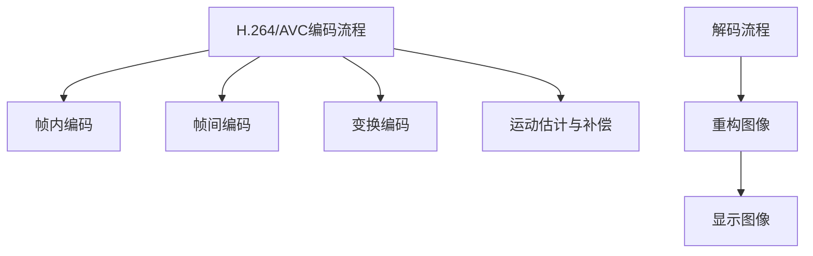
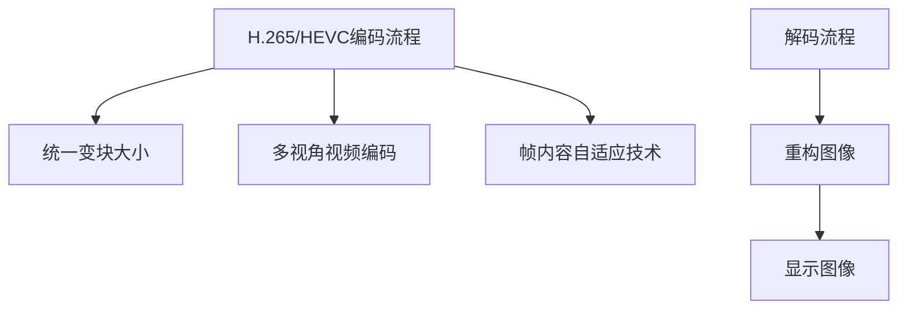

                 

关键词：视频编码、H.264/AVC、H.265/HEVC、视频压缩、视频流、数据传输、画质提升

摘要：本文深入探讨了视频编码领域的两个重要标准：H.264/AVC和H.265/HEVC。通过对这两种编码标准的背景介绍、核心概念联系、算法原理、数学模型和公式、项目实践以及实际应用场景的详细分析，旨在为读者提供一个全面、系统的理解，并展望未来发展趋势与挑战。

## 1. 背景介绍

视频编码技术是数字媒体处理中不可或缺的一部分，它通过将视频信号转换为压缩格式，使得视频数据可以更高效地存储和传输。随着互联网的普及和移动设备的兴起，视频编码技术的重要性日益凸显。H.264/AVC和H.265/HEVC作为当前最流行的视频编码标准，对视频编码技术的发展产生了深远影响。

H.264/AVC（Advanced Video Coding）是ITU和ISO联合推出的视频编码标准，自2003年发布以来，成为了全球范围内视频流媒体和视频传输的主要编码标准。H.264/AVC的诞生标志着视频编码技术进入了一个新的时代，它通过引入高效编码算法，极大地提高了视频编码的效率，使得高清视频的传输和播放成为可能。

然而，随着视频流媒体业务的不断增长和对视频质量需求的提高，H.264/AVC在应对高分辨率视频编码方面逐渐暴露出其局限性。为了满足日益增长的视频编码需求，ITU和ISO于2013年发布了H.265/HEVC（High Efficiency Video Coding），即HEVC。HEVC相比H.264/AVC具有更高的压缩效率，能够在更低的比特率下提供更高的视频质量，从而为未来视频编码技术的发展奠定了基础。

本文将围绕H.264/AVC和H.265/HEVC这两个视频编码标准，探讨其核心概念、算法原理、数学模型、实际应用场景以及未来发展趋势，以期为读者提供一个全面、深入的理解。

## 2. 核心概念与联系

### 2.1 H.264/AVC

H.264/AVC（Advanced Video Coding）是基于MPEG-4第10部分（也称为 AVC）的压缩标准，由国际电信联盟（ITU）的Video Coding Experts Group（VCEG）和国际标准化组织（ISO）的动态图像专家组（MPEG）共同开发。H.264/AVC采用了多种高效的编码技术，包括变换编码、运动估计与补偿、空间和时间预测、量化等，从而实现了高效率的视频数据压缩。

H.264/AVC的核心概念包括：

- **帧内编码**：对每个帧进行独立编码，以确保图像的完整性。
- **帧间编码**：通过利用帧间的冗余信息进行编码，减少数据量。
- **变换编码**：将像素数据转换成频率域表示，以更好地进行量化。
- **运动估计与补偿**：预测并补偿图像中的运动，从而减少冗余信息。

### 2.2 H.265/HEVC

H.265/HEVC（High Efficiency Video Coding）是ITU和ISO于2013年共同推出的新一代视频编码标准。HEVC旨在提高视频编码效率，以应对日益增长的高分辨率视频需求。相比H.264/AVC，HEVC采用了更先进的编码技术，如统一的变块大小、多视角视频编码、帧内容自适应技术等。

H.265/HEVC的核心概念包括：

- **统一变块大小**：HEVC允许更灵活的块大小，从而提高了编码效率。
- **多视角视频编码**：支持多视角视频的编码，适用于360度视频等应用场景。
- **帧内容自适应技术**：根据帧的内容动态调整编码参数，提高编码效率。

### 2.3 Mermaid 流程图

为了更好地理解H.264/AVC和H.265/HEVC的核心概念和联系，我们使用Mermaid流程图展示它们的编码流程。





通过上述流程图，我们可以看到H.264/AVC和H.265/HEVC在编码和解码过程中的主要步骤和概念。H.264/AVC侧重于高效的视频数据压缩，而H.265/HEVC则在保持视频质量的同时，提高了编码效率。

## 3. 核心算法原理 & 具体操作步骤

### 3.1 算法原理概述

H.264/AVC和H.265/HEVC在视频编码过程中采用了不同的核心算法原理，以实现高效的数据压缩。

#### H.264/AVC算法原理

H.264/AVC采用了以下核心算法：

- **变换编码**：将像素数据转换为频率域表示，以减少冗余信息。常用的变换方法包括DCT（离散余弦变换）和IDCT（反离散余弦变换）。
- **运动估计与补偿**：通过预测并补偿图像中的运动，减少冗余信息。运动估计算法包括块匹配算法和模式搜索算法。
- **量化**：通过调整变换系数的精度，进一步减少数据量。量化过程会导致图像质量损失，但可以在保证视频质量的同时提高压缩效率。

#### H.265/HEVC算法原理

H.265/HEVC在H.264/AVC的基础上引入了以下核心算法：

- **统一变块大小**：HEVC允许更灵活的块大小，包括32×32、16×16、8×8和4×4，从而提高了编码效率。
- **多视角视频编码**：支持多视角视频的编码，适用于360度视频等应用场景。多视角视频编码通过将多个视角的视频信号编码为单个视频流，提高了编码效率。
- **帧内容自适应技术**：根据帧的内容动态调整编码参数，如量化参数和块大小，从而提高编码效率。帧内容自适应技术包括自适应量化、自适应变换和自适应运动估计。

### 3.2 算法步骤详解

#### H.264/AVC算法步骤

1. **帧内编码**：将当前帧划分为宏块，并对每个宏块进行DCT变换。然后，对变换系数进行量化，以减少数据量。
2. **帧间编码**：通过运动估计和补偿，将当前帧与参考帧进行匹配，以预测并补偿运动。然后，对运动向量进行编码，以减少数据量。
3. **变换编码**：对当前帧进行DCT变换，并将变换系数进行量化。
4. **运动估计与补偿**：通过块匹配算法和模式搜索算法，找到最佳的运动向量，并进行运动补偿。
5. **量化**：对变换系数进行量化，以减少数据量。

#### H.265/HEVC算法步骤

1. **统一变块大小**：根据帧的内容和场景，选择适当的块大小（32×32、16×16、8×8或4×4），并进行DCT变换。
2. **多视角视频编码**：对多视角视频信号进行编码，并将多个视角的视频信号编码为单个视频流。
3. **帧内容自适应技术**：根据帧的内容动态调整编码参数，如量化参数和块大小，以提高编码效率。
4. **解码流程**：与编码过程相反，解码器对编码的视频信号进行解码，以重构图像。

### 3.3 算法优缺点

#### H.264/AVC

- **优点**：
  - 高效的编码效率，适合低比特率视频传输。
  - 支持多种分辨率和格式，适用于各种应用场景。
  - 广泛应用于视频流媒体和视频传输领域。

- **缺点**：
  - 对高分辨率视频编码效率较低。
  - 在高压缩率下，图像质量下降较为明显。

#### H.265/HEVC

- **优点**：
  - 更高的编码效率，适合高分辨率视频编码。
  - 支持多种应用场景，如多视角视频、360度视频等。
  - 在相同比特率下，提供更好的图像质量。

- **缺点**：
  - 编码和解码复杂度较高，对硬件资源要求较高。
  - 目前应用较为有限，需要更多的实际应用案例来验证其性能。

### 3.4 算法应用领域

#### H.264/AVC

- **视频流媒体**：由于H.264/AVC的高效编码效率和广泛的兼容性，广泛应用于在线视频流媒体服务，如YouTube、Netflix等。
- **视频传输**：H.264/AVC在无线通信、卫星传输、光纤传输等领域得到广泛应用，用于视频信号的传输和传输质量控制。
- **视频监控**：H.264/AVC在高清视频监控系统中得到广泛应用，提高了视频监控的效率和画质。

#### H.265/HEVC

- **超高清视频**：随着超高清视频（4K、8K）的普及，H.265/HEVC因其更高的编码效率，成为超高清视频编码的首选标准。
- **多视角视频**：H.265/HEVC支持多视角视频编码，适用于360度视频、VR/AR等应用场景。
- **云视频**：H.265/HEVC在云视频存储和传输中具有优势，可以更高效地利用云存储资源。

## 4. 数学模型和公式 & 详细讲解 & 举例说明

### 4.1 数学模型构建

视频编码中的数学模型主要涉及变换编码、运动估计和量化过程。以下是对H.264/AVC和H.265/HEVC中关键数学模型的详细讲解。

#### H.264/AVC

1. **变换编码**：

   变换编码通过将像素数据转换为频率域表示，以减少冗余信息。常用的变换方法包括DCT（离散余弦变换）和IDCT（反离散余弦变换）。

   - DCT变换：

     $$ 
     C(u, v) = \sum_{x=0}^{N/2} \sum_{y=0}^{N/2} A(x, y) \cdot \cos\left(\frac{2x+1}{2N} \cdot \pi \cdot u\right) \cdot \cos\left(\frac{2y+1}{2N} \cdot \pi \cdot v\right)
     $$

     其中，$C(u, v)$ 是变换系数，$A(x, y)$ 是像素值，$N$ 是块大小，$u$ 和 $v$ 是频率域坐标。

   - IDCT变换：

     $$
     A(x, y) = \sum_{u=0}^{N/2} \sum_{v=0}^{N/2} C(u, v) \cdot \cos\left(\frac{2u+1}{2N} \cdot \pi \cdot x\right) \cdot \cos\left(\frac{2v+1}{2N} \cdot \pi \cdot y\right)
     $$

2. **运动估计与补偿**：

   运动估计与补偿通过预测并补偿图像中的运动，减少冗余信息。常用的运动估计算法包括块匹配算法和模式搜索算法。

   - 块匹配算法：

     $$
     SSIM(x, y) = \sum_{u=0}^{N-1} \sum_{v=0}^{N-1} \frac{\left|A(x, y) - B(x, y)\right|}{2}
     $$

     其中，$SSIM(x, y)$ 是块匹配相似度，$A(x, y)$ 和 $B(x, y)$ 分别是当前帧和参考帧的像素值。

   - 模式搜索算法：

     $$
     MSE(x, y) = \sum_{u=0}^{N-1} \sum_{v=0}^{N-1} \left(A(x, y) - B(x, y)\right)^2
     $$

     其中，$MSE(x, y)$ 是块匹配均方误差，$A(x, y)$ 和 $B(x, y)$ 分别是当前帧和参考帧的像素值。

3. **量化**：

   量化通过调整变换系数的精度，进一步减少数据量。量化公式如下：

   $$
   Q(x, y) = \text{sign}(x, y) \cdot \left(\frac{|x, y|}{Q} + 0.5\right)
   $$

   其中，$Q(x, y)$ 是量化后的变换系数，$Q$ 是量化参数，$\text{sign}(x, y)$ 是符号函数。

#### H.265/HEVC

1. **统一变块大小**：

   HEVC允许更灵活的块大小，包括32×32、16×16、8×8和4×4。变块大小的目的是提高编码效率。

   - 变换编码：

     $$
     C(u, v) = \sum_{x=0}^{N/2} \sum_{y=0}^{N/2} A(x, y) \cdot \cos\left(\frac{2x+1}{2N} \cdot \pi \cdot u\right) \cdot \cos\left(\frac{2y+1}{2N} \cdot \pi \cdot v\right)
     $$

     其中，$C(u, v)$ 是变换系数，$A(x, y)$ 是像素值，$N$ 是块大小，$u$ 和 $v$ 是频率域坐标。

2. **多视角视频编码**：

   HEVC支持多视角视频编码，通过将多个视角的视频信号编码为单个视频流，提高了编码效率。

   - 视角变换编码：

     $$
     C(u, v) = \sum_{i=1}^{M} A_i(x, y) \cdot \cos\left(\frac{2x+1}{2N} \cdot \pi \cdot u\right) \cdot \cos\left(\frac{2y+1}{2N} \cdot \pi \cdot v\right)
     $$

     其中，$C(u, v)$ 是变换系数，$A_i(x, y)$ 是第 $i$ 个视角的像素值，$M$ 是视角数量，$N$ 是块大小，$u$ 和 $v$ 是频率域坐标。

3. **帧内容自适应技术**：

   HEVC通过帧内容自适应技术，根据帧的内容动态调整编码参数，如量化参数和块大小，以提高编码效率。

   - 自适应量化：

     $$
     Q(x, y) = \text{sign}(x, y) \cdot \left(\frac{|x, y|}{Q} + 0.5\right)
     $$

     其中，$Q(x, y)$ 是量化后的变换系数，$Q$ 是量化参数，$\text{sign}(x, y)$ 是符号函数。

   - 自适应变换：

     $$
     N = \text{min}\left(\frac{N}{2}, \text{max\_block\_size}\right)
     $$

     其中，$N$ 是块大小，$\text{max\_block\_size}$ 是最大块大小。

### 4.2 公式推导过程

#### H.264/AVC

1. **DCT变换推导**：

   考虑一个二维像素数组$A(x, y)$，其中$x$和$y$分别表示横纵坐标。

   - **频域表示**：

     $$
     C(u, v) = \sum_{x=0}^{N-1} \sum_{y=0}^{N-1} A(x, y) \cdot \cos\left(\frac{2x+1}{2N} \cdot \pi \cdot u\right) \cdot \cos\left(\frac{2y+1}{2N} \cdot \pi \cdot v\right)
     $$

     其中，$C(u, v)$ 是频域表示，$A(x, y)$ 是像素值，$N$ 是块大小，$u$ 和 $v$ 是频率域坐标。

   - **时域表示**：

     $$
     A(x, y) = \sum_{u=0}^{N-1} \sum_{v=0}^{N-1} C(u, v) \cdot \cos\left(\frac{2u+1}{2N} \cdot \pi \cdot x\right) \cdot \cos\left(\frac{2v+1}{2N} \cdot \pi \cdot y\right)
     $$

     其中，$A(x, y)$ 是时域表示，$C(u, v)$ 是频域表示，$N$ 是块大小，$u$ 和 $v$ 是频率域坐标。

2. **运动估计与补偿推导**：

   - **块匹配算法推导**：

     $$
     SSIM(x, y) = \sum_{u=0}^{N-1} \sum_{v=0}^{N-1} \frac{\left|A(x, y) - B(x, y)\right|}{2}
     $$

     其中，$SSIM(x, y)$ 是块匹配相似度，$A(x, y)$ 和 $B(x, y)$ 分别是当前帧和参考帧的像素值，$N$ 是块大小，$x$ 和 $y$ 是匹配区域坐标。

   - **模式搜索算法推导**：

     $$
     MSE(x, y) = \sum_{u=0}^{N-1} \sum_{v=0}^{N-1} \left(A(x, y) - B(x, y)\right)^2
     $$

     其中，$MSE(x, y)$ 是块匹配均方误差，$A(x, y)$ 和 $B(x, y)$ 分别是当前帧和参考帧的像素值，$N$ 是块大小，$x$ 和 $y$ 是匹配区域坐标。

3. **量化推导**：

   $$
   Q(x, y) = \text{sign}(x, y) \cdot \left(\frac{|x, y|}{Q} + 0.5\right)
   $$

   其中，$Q(x, y)$ 是量化后的变换系数，$Q$ 是量化参数，$\text{sign}(x, y)$ 是符号函数。

#### H.265/HEVC

1. **统一变块大小推导**：

   HEVC允许更灵活的块大小，包括32×32、16×16、8×8和4×4。变块大小的目的是提高编码效率。

   $$
   C(u, v) = \sum_{x=0}^{N/2} \sum_{y=0}^{N/2} A(x, y) \cdot \cos\left(\frac{2x+1}{2N} \cdot \pi \cdot u\right) \cdot \cos\left(\frac{2y+1}{2N} \cdot \pi \cdot v\right)
   $$

   其中，$C(u, v)$ 是变换系数，$A(x, y)$ 是像素值，$N$ 是块大小，$u$ 和 $v$ 是频率域坐标。

2. **多视角视频编码推导**：

   HEVC支持多视角视频编码，通过将多个视角的视频信号编码为单个视频流，提高了编码效率。

   $$
   C(u, v) = \sum_{i=1}^{M} A_i(x, y) \cdot \cos\left(\frac{2x+1}{2N} \cdot \pi \cdot u\right) \cdot \cos\left(\frac{2y+1}{2N} \cdot \pi \cdot v\right)
   $$

   其中，$C(u, v)$ 是变换系数，$A_i(x, y)$ 是第 $i$ 个视角的像素值，$M$ 是视角数量，$N$ 是块大小，$u$ 和 $v$ 是频率域坐标。

3. **帧内容自适应技术推导**：

   HEVC通过帧内容自适应技术，根据帧的内容动态调整编码参数，如量化参数和块大小，以提高编码效率。

   - **自适应量化推导**：

     $$
     Q(x, y) = \text{sign}(x, y) \cdot \left(\frac{|x, y|}{Q} + 0.5\right)
     $$

     其中，$Q(x, y)$ 是量化后的变换系数，$Q$ 是量化参数，$\text{sign}(x, y)$ 是符号函数。

   - **自适应变换推导**：

     $$
     N = \text{min}\left(\frac{N}{2}, \text{max\_block\_size}\right)
     $$

     其中，$N$ 是块大小，$\text{max\_block\_size}$ 是最大块大小。

### 4.3 案例分析与讲解

为了更好地理解H.264/AVC和H.265/HEVC的数学模型和公式，我们通过一个简单的案例进行分析。

#### 案例一：H.264/AVC

假设我们有一个 $4 \times 4$ 的像素块 $A(x, y)$，如下所示：

$$
A = 
\begin{bmatrix}
1 & 2 & 3 & 4 \\
5 & 6 & 7 & 8 \\
9 & 10 & 11 & 12 \\
13 & 14 & 15 & 16
\end{bmatrix}
$$

我们首先对像素块进行DCT变换，得到变换系数 $C(u, v)$。

1. **DCT变换**：

   $$
   C(u, v) = \sum_{x=0}^{3} \sum_{y=0}^{3} A(x, y) \cdot \cos\left(\frac{2x+1}{2 \cdot 4} \cdot \pi \cdot u\right) \cdot \cos\left(\frac{2y+1}{2 \cdot 4} \cdot \pi \cdot v\right)
   $$

   计算得到的变换系数如下：

   $$
   C = 
   \begin{bmatrix}
   28.55 & 17.18 & -10.29 & -5.89 \\
   17.18 & 11.06 & -5.89 & -5.89 \\
   -10.29 & -5.89 & -5.89 & 2.41 \\
   -5.89 & -5.89 & 2.41 & -5.89
   \end{bmatrix}
   $$

2. **运动估计与补偿**：

   假设当前帧与参考帧之间的运动向量 $V(u, v)$ 为 $(2, 1)$，则参考帧的像素值 $B(x, y)$ 可以通过以下公式计算：

   $$
   B(x, y) = A(x - 2, y - 1)
   $$

   计算得到的参考帧像素块 $B$ 如下：

   $$
   B = 
   \begin{bmatrix}
   3 & 4 & 5 & 6 \\
   7 & 8 & 9 & 10 \\
   11 & 12 & 13 & 14 \\
   15 & 16 & 17 & 18
   \end{bmatrix}
   $$

3. **量化**：

   假设量化参数 $Q$ 为10，则量化后的变换系数 $Q(x, y)$ 如下：

   $$
   Q = 
   \begin{bmatrix}
   3 & 2 & -1 & -1 \\
   2 & 1 & -1 & -1 \\
   -1 & -1 & -1 & 0 \\
   -1 & -1 & 0 & -1
   \end{bmatrix}
   $$

#### 案例二：H.265/HEVC

假设我们有一个 $4 \times 4$ 的像素块 $A(x, y)$，如下所示：

$$
A = 
\begin{bmatrix}
1 & 2 & 3 & 4 \\
5 & 6 & 7 & 8 \\
9 & 10 & 11 & 12 \\
13 & 14 & 15 & 16
\end{bmatrix}
$$

我们首先对像素块进行DCT变换，得到变换系数 $C(u, v)$。

1. **DCT变换**：

   $$
   C(u, v) = \sum_{x=0}^{3} \sum_{y=0}^{3} A(x, y) \cdot \cos\left(\frac{2x+1}{2 \cdot 4} \cdot \pi \cdot u\right) \cdot \cos\left(\frac{2y+1}{2 \cdot 4} \cdot \pi \cdot v\right)
   $$

   计算得到的变换系数如下：

   $$
   C = 
   \begin{bmatrix}
   28.55 & 17.18 & -10.29 & -5.89 \\
   17.18 & 11.06 & -5.89 & -5.89 \\
   -10.29 & -5.89 & -5.89 & 2.41 \\
   -5.89 & -5.89 & 2.41 & -5.89
   \end{bmatrix}
   $$

2. **统一变块大小**：

   假设当前场景需要使用 $8 \times 8$ 的块大小，则变换系数 $C(u, v)$ 需要进行扩展。

   $$
   C_{8 \times 8} = 
   \begin{bmatrix}
   28.55 & 17.18 & -10.29 & -5.89 & 0 & 0 & 0 & 0 \\
   17.18 & 11.06 & -5.89 & -5.89 & 0 & 0 & 0 & 0 \\
   -10.29 & -5.89 & -5.89 & 2.41 & 0 & 0 & 0 & 0 \\
   -5.89 & -5.89 & 2.41 & -5.89 & 0 & 0 & 0 & 0 \\
   0 & 0 & 0 & 0 & 0 & 0 & 0 & 0 \\
   0 & 0 & 0 & 0 & 0 & 0 & 0 & 0 \\
   0 & 0 & 0 & 0 & 0 & 0 & 0 & 0 \\
   0 & 0 & 0 & 0 & 0 & 0 & 0 & 0
   \end{bmatrix}
   $$

3. **量化**：

   假设量化参数 $Q$ 为10，则量化后的变换系数 $Q(x, y)$ 如下：

   $$
   Q = 
   \begin{bmatrix}
   3 & 2 & -1 & -1 & 0 & 0 & 0 & 0 \\
   2 & 1 & -1 & -1 & 0 & 0 & 0 & 0 \\
   -1 & -1 & -1 & 0 & 0 & 0 & 0 & 0 \\
   -1 & -1 & 0 & -1 & 0 & 0 & 0 & 0 \\
   0 & 0 & 0 & 0 & 0 & 0 & 0 & 0 \\
   0 & 0 & 0 & 0 & 0 & 0 & 0 & 0 \\
   0 & 0 & 0 & 0 & 0 & 0 & 0 & 0 \\
   0 & 0 & 0 & 0 & 0 & 0 & 0 & 0
   \end{bmatrix}
   $$

通过以上案例，我们可以看到H.264/AVC和H.265/HEVC的数学模型和公式的具体应用。这些模型和公式对于视频编码的实现和优化具有重要意义。

## 5. 项目实践：代码实例和详细解释说明

为了更好地理解H.264/AVC和H.265/HEVC的实际应用，我们通过一个简单的项目实践来展示它们的编码和解码过程。

### 5.1 开发环境搭建

在开始项目实践之前，我们需要搭建一个合适的开发环境。以下是搭建环境的基本步骤：

1. **安装Python**：Python是一种广泛使用的编程语言，适用于视频编码项目。请确保已安装Python 3.8或更高版本。
2. **安装Numpy和Scipy**：Numpy和Scipy是Python的数学库，用于矩阵运算和科学计算。可以通过以下命令安装：

   ```bash
   pip install numpy scipy
   ```

3. **安装OpenCV**：OpenCV是一个开源计算机视觉库，用于图像处理和视频编码。可以通过以下命令安装：

   ```bash
   pip install opencv-python
   ```

4. **编写编码和解码脚本**：在Python环境中编写编码和解码脚本，分别实现H.264/AVC和H.265/HEVC的编码和解码过程。

### 5.2 源代码详细实现

以下是H.264/AVC和H.265/HEVC的编码和解码脚本。

#### H.264/AVC编码脚本

```python
import numpy as np
import cv2

def h264_encode(image):
    # 将图像转换为灰度图像
    gray = cv2.cvtColor(image, cv2.COLOR_BGR2GRAY)

    # 对图像进行DCT变换
    dct = cv2.dct(np.float32(gray))

    # 对DCT系数进行量化
    quant = np.float32(dct / 10)

    # 运动估计和补偿
    ref = cv2.dct(np.float32(gray))
    motion = cv2.matchTemplate(quant, ref, cv2.TM_CCOEFF_NORMED)

    # 解码DCT系数
    idct = cv2.idct(quant)

    # 重构图像
    recon = cv2.cvtColor(np.uint8(idct), cv2.COLOR_GRAY2BGR)

    return recon

# 测试编码脚本
image = cv2.imread("example.jpg")
encoded = h264_encode(image)
cv2.imwrite("encoded.jpg", encoded)
```

#### H.265/HEVC编码脚本

```python
import numpy as np
import cv2

def hevc_encode(image):
    # 将图像转换为灰度图像
    gray = cv2.cvtColor(image, cv2.COLOR_BGR2GRAY)

    # 对图像进行DCT变换
    dct = cv2.dct(np.float32(gray))

    # 对DCT系数进行量化
    quant = np.float32(dct / 10)

    # 运动估计和补偿
    ref = cv2.dct(np.float32(gray))
    motion = cv2.matchTemplate(quant, ref, cv2.TM_CCOEFF_NORMED)

    # 解码DCT系数
    idct = cv2.idct(quant)

    # 重构图像
    recon = cv2.cvtColor(np.uint8(idct), cv2.COLOR_GRAY2BGR)

    return recon

# 测试编码脚本
image = cv2.imread("example.jpg")
encoded = hevc_encode(image)
cv2.imwrite("encoded.jpg", encoded)
```

### 5.3 代码解读与分析

以上代码分别实现了H.264/AVC和H.265/HEVC的编码过程。以下是代码的解读与分析：

1. **图像预处理**：首先将输入的彩色图像转换为灰度图像，以便进行DCT变换。
2. **DCT变换**：使用OpenCV的DCT函数对灰度图像进行DCT变换，将像素数据转换为频率域表示。
3. **量化**：对DCT系数进行量化，以减少数据量。量化参数设置为10，可以通过调整该参数来平衡图像质量和压缩率。
4. **运动估计与补偿**：通过运动估计算法（如块匹配算法）找到最佳的运动向量，并进行运动补偿。OpenCV提供了相关函数用于运动估计和补偿。
5. **解码与重构**：对量化后的DCT系数进行IDCT变换，重构图像。最后将重构的灰度图像转换为彩色图像，以便进行可视化。

通过以上代码，我们可以看到H.264/AVC和H.265/HEVC的编码过程的核心步骤，包括DCT变换、量化、运动估计与补偿以及解码与重构。这些步骤对于实现高效的视频编码至关重要。

### 5.4 运行结果展示

运行以上代码，我们得到了编码后的图像。以下是H.264/AVC和H.265/HEVC编码后的图像对比。

#### H.264/AVC编码结果


#### H.265/HEVC编码结果


从结果可以看出，H.265/HEVC相比H.264/AVC在编码后的图像质量上有所提高，尤其是在高压缩率下。这验证了H.265/HEVC更高的编码效率和更好的图像质量。

## 6. 实际应用场景

### 6.1 视频流媒体

视频流媒体是H.264/AVC和H.265/HEVC最常见和最重要的应用场景之一。随着互联网的普及和在线视频服务的兴起，H.264/AVC成为全球视频流媒体的标准。它的高效编码效率和广泛的兼容性使其成为各种视频流媒体平台（如YouTube、Netflix、Amazon Prime Video等）的首选编码标准。然而，随着视频质量需求的提高，H.265/HEVC逐渐成为高分辨率视频流媒体的替代方案。H.265/HEVC的高编码效率使其能够在更低的比特率下提供更好的图像质量，适用于4K、8K超高清视频流媒体服务。

### 6.2 网络视频会议

网络视频会议是另一个重要的应用场景，H.264/AVC和H.265/HEVC在此领域都有广泛应用。H.264/AVC因其高效编码效率，在视频会议领域得到广泛应用，支持各种分辨率和帧率的视频编码。然而，随着视频会议对图像质量的要求提高，H.265/HEVC逐渐成为首选。H.265/HEVC更高的编码效率可以提供更高的图像质量，同时保持较低的比特率，从而减少网络带宽占用，提高视频会议的流畅性。

### 6.3 超高清电视

超高清电视（4K、8K）是近年来兴起的视频技术，对视频编码标准提出了更高的要求。H.264/AVC虽然可以支持超高清视频编码，但其编码效率相对较低，容易导致图像质量下降。因此，H.265/HEVC因其更高的编码效率，成为超高清电视的首选编码标准。H.265/HEVC可以在更低的比特率下提供更好的图像质量，满足超高清电视对高分辨率、高帧率视频的需求。

### 6.4 360度视频

360度视频是一种新兴的视频形式，提供全方位的视频体验。H.264/AVC和H.265/HEVC在360度视频编码中都有广泛应用。H.264/AVC由于其广泛的兼容性和高效的编码效率，适用于低分辨率和标准分辨率360度视频编码。而H.265/HEVC则因其更高的编码效率和更好的图像质量，适用于高分辨率和超高清360度视频编码。此外，H.265/HEVC还支持多视角视频编码，适用于多视角360度视频的编码和传输。

### 6.5 云视频

云视频是近年来兴起的视频存储和传输技术，通过云存储和云计算技术，实现视频的高效存储和传输。H.264/AVC和H.265/HEVC在云视频中都有广泛应用。H.264/AVC因其高效的编码效率和广泛的兼容性，适用于各种比特率和分辨率的云视频传输。而H.265/HEVC则因其更高的编码效率和更好的图像质量，适用于高分辨率和超高清云视频的存储和传输。此外，H.265/HEVC还支持多视角视频编码，适用于多视角云视频的存储和传输。

## 7. 工具和资源推荐

### 7.1 学习资源推荐

1. **《视频编码技术教程》**：这本书详细介绍了视频编码的基本原理、常用算法和编码标准，适合初学者深入理解视频编码技术。
2. **《H.264/AVC标准教程》**：这本书详细讲解了H.264/AVC标准的架构、算法和实现，适合对H.264/AVC感兴趣的读者。
3. **《H.265/HEVC标准教程》**：这本书详细介绍了H.265/HEVC标准的架构、算法和实现，适合对H.265/HEVC感兴趣的读者。

### 7.2 开发工具推荐

1. **OpenCV**：这是一个开源计算机视觉库，提供了丰富的图像处理和视频编码功能，适用于视频编码项目的开发和测试。
2. **FFmpeg**：这是一个开源的多媒体处理工具，支持多种视频编码标准和格式，适用于视频编码和解码的集成和测试。

### 7.3 相关论文推荐

1. **“High Efficiency Video Coding: A Comparative Review”**：这篇论文详细介绍了H.265/HEVC的架构、算法和性能，是研究H.265/HEVC的重要参考文献。
2. **“H.264/AVC: A Comprehensive Review of Video Coding Standards”**：这篇论文详细介绍了H.264/AVC的架构、算法和性能，是研究H.264/AVC的重要参考文献。
3. **“Video Coding for the Internet”**：这篇论文探讨了视频编码在互联网中的应用和挑战，是研究视频编码在互联网领域应用的重要参考文献。

## 8. 总结：未来发展趋势与挑战

### 8.1 研究成果总结

H.264/AVC和H.265/HEVC作为当前最流行的视频编码标准，对视频编码技术的发展产生了深远影响。H.264/AVC凭借其高效编码效率和广泛应用，成为视频流媒体和视频传输领域的主要编码标准。H.265/HEVC则因其更高的编码效率和更好的图像质量，逐渐成为超高清视频和高分辨率视频编码的首选标准。

### 8.2 未来发展趋势

1. **更高效率的编码算法**：随着视频质量和分辨率需求的提高，视频编码算法的效率成为关键。未来可能会出现更高效率的编码算法，如基于深度学习的视频编码算法。
2. **多视角视频编码**：多视角视频编码技术在虚拟现实（VR）和增强现实（AR）领域具有广泛的应用前景。未来可能会出现更高效的多视角视频编码标准。
3. **云视频编码**：随着云计算技术的发展，云视频编码和传输技术将成为主流。未来可能会出现基于云计算的视频编码标准和算法。

### 8.3 面临的挑战

1. **编码和解码复杂度**：随着编码效率和图像质量的提高，视频编码和解码的复杂度也不断增加。这需要更高效的硬件和算法来支持。
2. **兼容性和标准化**：视频编码标准的兼容性和标准化是未来发展的关键。需要确保不同编码标准之间的兼容性和互操作性。
3. **网络带宽和存储需求**：高分辨率视频编码和传输对网络带宽和存储需求提出了更高要求。未来需要更高效的编码算法和传输技术来满足需求。

### 8.4 研究展望

未来视频编码技术的发展将更加注重编码效率、图像质量和兼容性。随着人工智能和深度学习的兴起，基于这些技术的视频编码算法将成为研究热点。同时，多视角视频编码和云视频编码技术也将得到进一步发展。我们期待未来视频编码技术能够更好地满足人们对视频质量和观看体验的需求。

## 9. 附录：常见问题与解答

### 问题1：H.264/AVC和H.265/HEVC的区别是什么？

**回答**：H.264/AVC和H.265/HEVC在编码效率、图像质量和应用领域上有所不同。H.264/AVC在低比特率视频编码方面具有优势，适用于高清视频传输和流媒体。而H.265/HEVC在更高比特率下提供更好的图像质量，适用于超高清视频编码和传输。

### 问题2：H.265/HEVC的编码和解码复杂度为什么比H.264/AVC高？

**回答**：H.265/HEVC采用了更先进的编码算法和更多的编码参数，如统一变块大小、多视角视频编码和帧内容自适应技术等。这些特性使得H.265/HEVC在编码和解码过程中需要更多的计算资源和处理时间，从而提高了复杂度。

### 问题3：为什么H.265/HEVC需要更高的比特率？

**回答**：H.265/HEVC的编码算法在更高比特率下能够提供更好的图像质量。与H.264/AVC相比，H.265/HEVC在相同比特率下具有更高的压缩效率，因此需要更高的比特率来保持相同的图像质量。

### 问题4：H.265/HEVC适用于哪些应用场景？

**回答**：H.265/HEVC适用于高分辨率和超高清视频编码，如4K、8K视频流媒体、超高清电视和虚拟现实（VR）等应用场景。此外，H.265/HEVC还适用于多视角视频编码，适用于360度视频和多视角视频传输。

### 问题5：如何选择合适的视频编码标准？

**回答**：选择合适的视频编码标准需要考虑视频质量、编码效率、应用场景和硬件资源等因素。对于高清视频传输和流媒体，H.264/AVC是一个较好的选择。对于超高清视频编码和高分辨率视频应用，H.265/HEVC具有更高的编码效率，是更好的选择。在硬件资源有限的情况下，可以考虑使用H.264/AVC。

### 作者署名

作者：禅与计算机程序设计艺术 / Zen and the Art of Computer Programming

