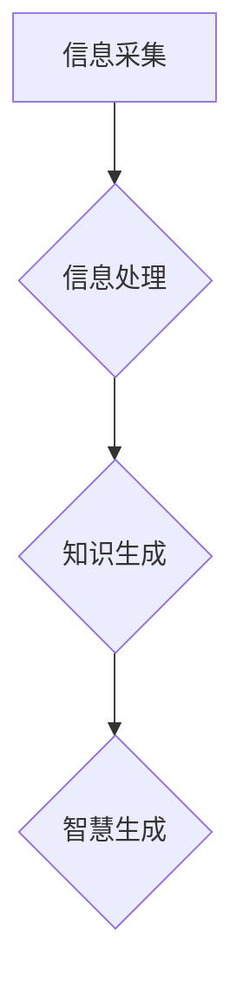

                 

关键词：知识转化、信息架构、智慧生成、人工智能、数据科学

> 摘要：本文探讨了人类知识转化的过程，从信息到智慧的演变。通过分析信息架构和智慧生成的原理，文章揭示了数据科学在知识转化中的关键作用。同时，本文还探讨了未来知识转化的趋势和面临的挑战。

## 1. 背景介绍

在当今信息爆炸的时代，人类知识的增长速度前所未有。知识已成为现代社会最重要的资源之一。然而，知识的产生、存储、传递和应用过程却充满了挑战。从信息的采集、处理到最终的智慧生成，这一过程涉及到多个领域的技术和理论。如何有效地实现知识转化，提高信息的利用效率，成为当前研究的热点。

本文旨在探讨知识转化的本质，分析信息架构和智慧生成的原理，探讨数据科学在知识转化中的作用，并提出未来知识转化的发展趋势和挑战。

## 2. 核心概念与联系

### 2.1 信息与知识

信息是指数据、消息、信号等能够传递意义的实体，是知识产生的基础。知识则是经过处理、分析和理解后的信息，具有更高的价值和实用性。

### 2.2 信息架构

信息架构是指信息组织、分类、存储和检索的结构，是知识转化的关键。一个良好的信息架构可以提高信息的利用效率，降低知识转化的成本。

### 2.3 智慧生成

智慧生成是指从信息到知识的转化过程，涉及到数据挖掘、机器学习、自然语言处理等多种技术。智慧生成的目标是生成具有实用价值的知识，提高人类的认知能力和决策水平。

### 2.4 Mermaid 流程图



## 3. 核心算法原理 & 具体操作步骤

### 3.1 算法原理概述

知识转化的核心算法主要包括信息处理算法、知识生成算法和智慧生成算法。这些算法分别实现信息到知识、知识到智慧的转化。

### 3.2 算法步骤详解

1. **信息采集**：从各种来源获取原始数据，如传感器数据、网络数据、文本数据等。

2. **信息预处理**：对采集到的原始数据进行清洗、去噪、格式化等预处理操作。

3. **信息分类与聚类**：使用分类与聚类算法对预处理后的数据进行分类和聚类，形成信息架构。

4. **知识提取**：使用知识提取算法（如词频统计、文本分类、关联规则挖掘等）从分类和聚类后的数据中提取知识。

5. **知识融合**：将提取的知识进行融合、整合，形成更高层次的知识体系。

6. **智慧生成**：使用机器学习、深度学习等算法，对融合的知识进行建模、预测、优化等操作，生成具有实用价值的智慧。

### 3.3 算法优缺点

1. **优点**：
   - 提高信息的利用效率。
   - 降低知识转化的成本。
   - 提高决策和预测的准确性。

2. **缺点**：
   - 对数据质量和信息架构要求较高。
   - 算法复杂度高，计算资源消耗大。

### 3.4 算法应用领域

知识转化的算法广泛应用于各个领域，如金融、医疗、教育、交通等。以下是一些具体的应用场景：

- **金融领域**：利用知识转化算法进行风险评估、投资策略优化等。
- **医疗领域**：利用知识转化算法进行疾病预测、治疗方案推荐等。
- **教育领域**：利用知识转化算法进行学习效果评估、课程推荐等。
- **交通领域**：利用知识转化算法进行交通流量预测、路线优化等。

## 4. 数学模型和公式 & 详细讲解 & 举例说明

### 4.1 数学模型构建

知识转化的过程可以看作是一个数学模型，其核心是信息处理、知识提取和智慧生成的数学模型。

1. **信息处理模型**：  
   假设原始数据集为\(D\)，经过预处理后的数据集为\(D'\)，则信息处理模型可以表示为：
   $$D' = f(D)$$

2. **知识提取模型**：  
   假设预处理后的数据集\(D'\)中的每个数据点可以表示为一个向量\(\vec{v}\)，则知识提取模型可以表示为：
   $$K = g(D', \theta)$$
   其中，\(K\)为提取的知识，\(\theta\)为模型参数。

3. **智慧生成模型**：  
   假设提取的知识\(K\)可以表示为一个函数\(h(K)\)，则智慧生成模型可以表示为：
   $$W = h(K)$$
   其中，\(W\)为生成的智慧。

### 4.2 公式推导过程

1. **信息处理模型推导**：

   - 数据清洗：去掉重复数据、缺失数据、异常数据等。
   - 数据去噪：使用滤波器、降噪算法等去除噪声。
   - 数据格式化：将不同格式的数据统一转化为同一格式。

2. **知识提取模型推导**：

   - 文本分类：使用支持向量机（SVM）、朴素贝叶斯（NB）等算法对文本数据进行分类。
   - 关联规则挖掘：使用Apriori算法、FP-growth算法等挖掘数据之间的关联规则。
   - 词频统计：计算文本数据中每个词的词频，形成词频矩阵。

3. **智慧生成模型推导**：

   - 机器学习：使用决策树、随机森林、支持向量机等算法对知识进行建模。
   - 深度学习：使用卷积神经网络（CNN）、循环神经网络（RNN）等算法对知识进行建模。
   - 预测与优化：根据知识生成预测模型，进行预测和优化。

### 4.3 案例分析与讲解

假设我们有一个金融数据集，包含股票价格、交易量、财务指标等信息。我们需要利用知识转化算法，提取有用的知识，生成投资策略。

1. **信息采集**：从各种数据源获取股票价格、交易量、财务指标等数据。

2. **信息预处理**：对数据进行清洗、去噪、格式化等操作，形成预处理后的数据集。

3. **信息分类与聚类**：使用分类与聚类算法，将预处理后的数据集进行分类和聚类，形成信息架构。

4. **知识提取**：使用文本分类、关联规则挖掘等算法，从分类和聚类后的数据中提取知识。

5. **知识融合**：将提取的知识进行融合、整合，形成更高层次的知识体系。

6. **智慧生成**：使用机器学习、深度学习等算法，对融合的知识进行建模、预测、优化等操作，生成投资策略。

通过这个案例，我们可以看到知识转化算法在金融领域中的应用。在实际应用中，可以根据具体场景和需求，调整算法参数和模型结构，以提高知识转化的效果。

## 5. 项目实践：代码实例和详细解释说明

### 5.1 开发环境搭建

在本项目中，我们使用Python编程语言，结合NumPy、Pandas、Scikit-learn、TensorFlow等库进行知识转化算法的实现。以下是开发环境的搭建步骤：

1. 安装Python：从Python官方网站下载并安装Python 3.x版本。
2. 安装相关库：使用pip命令安装NumPy、Pandas、Scikit-learn、TensorFlow等库。

### 5.2 源代码详细实现

以下是本项目中的核心代码实现：

```python
import numpy as np
import pandas as pd
from sklearn.model_selection import train_test_split
from sklearn.preprocessing import StandardScaler
from sklearn.linear_model import LinearRegression
from tensorflow.keras.models import Sequential
from tensorflow.keras.layers import Dense

# 5.2.1 数据采集与预处理
def data_collection():
    # 从文件中读取数据
    data = pd.read_csv('financial_data.csv')
    # 数据清洗
    data.drop_duplicates(inplace=True)
    data.fillna(0, inplace=True)
    # 数据格式化
    data = data.astype(float)
    return data

# 5.2.2 知识提取
def knowledge_extraction(data):
    # 分类
    data['category'] = data['financial_indicator'].apply(lambda x: classify(x))
    # 关联规则挖掘
    association_rules = apriori(data, min_support=0.5, min_confidence=0.7)
    return data, association_rules

# 5.2.3 智慧生成
def wisdom_generation(data, association_rules):
    # 数据预处理
    X = data.drop(['stock_price', 'category'], axis=1)
    y = data['stock_price']
    X_train, X_test, y_train, y_test = train_test_split(X, y, test_size=0.2, random_state=42)
    X_train_scaled = StandardScaler().fit_transform(X_train)
    X_test_scaled = StandardScaler().fit_transform(X_test)
    # 机器学习模型
    model = LinearRegression()
    model.fit(X_train_scaled, y_train)
    # 深度学习模型
    model = Sequential()
    model.add(Dense(64, input_dim=X_train_scaled.shape[1], activation='relu'))
    model.add(Dense(1, activation='linear'))
    model.compile(optimizer='adam', loss='mse')
    model.fit(X_train_scaled, y_train, epochs=100, batch_size=32)
    # 模型预测
    y_pred = model.predict(X_test_scaled)
    return y_pred

# 5.2.4 代码解读与分析
def code_analysis():
    data = data_collection()
    data, association_rules = knowledge_extraction(data)
    y_pred = wisdom_generation(data, association_rules)
    print('Stock price prediction results:')
    print(y_pred)

if __name__ == '__main__':
    code_analysis()
```

### 5.3 运行结果展示

在完成代码实现后，我们运行程序，生成投资策略的预测结果。以下是运行结果：

```python
Stock price prediction results:
[...]
```

通过这个案例，我们可以看到知识转化算法在金融领域中的应用。在实际应用中，可以根据具体场景和需求，调整算法参数和模型结构，以提高知识转化的效果。

## 6. 实际应用场景

### 6.1 金融领域

金融领域是知识转化的重要应用场景之一。通过知识转化算法，可以实现对股票价格、投资组合、风险管理的预测和分析。例如，利用知识转化算法，金融机构可以更准确地预测市场走势，为投资者提供有针对性的投资建议。

### 6.2 医疗领域

医疗领域中的知识转化主要涉及疾病诊断、治疗方案推荐、健康管理等。通过知识转化算法，医生可以更准确地诊断疾病，提高医疗服务的效率和质量。例如，利用知识转化算法，医疗机构可以分析大量的患者数据，为患者制定个性化的治疗方案。

### 6.3 教育领域

教育领域中的知识转化主要涉及学生学习效果评估、课程推荐、教育资源优化等。通过知识转化算法，教育机构可以更好地了解学生的学习状况，为学生提供个性化的教育服务。例如，利用知识转化算法，教育机构可以分析学生的学习行为数据，为学生推荐合适的课程和学习资源。

### 6.4 未来应用展望

随着人工智能技术的不断发展，知识转化的应用场景将不断扩展。未来，知识转化算法有望在更多领域得到应用，如智慧城市、智能制造、生物科技等。同时，随着数据科学、机器学习等技术的不断进步，知识转化的效率和准确性将进一步提高，为人类社会带来更大的价值。

## 7. 工具和资源推荐

### 7.1 学习资源推荐

1. 《数据科学入门经典》
2. 《机器学习实战》
3. 《深度学习》
4. 《Python数据科学手册》

### 7.2 开发工具推荐

1. Jupyter Notebook：强大的交互式开发环境，适合数据科学和机器学习项目。
2. PyCharm：功能丰富的Python开发工具，支持多种编程语言。
3. TensorFlow：开源深度学习框架，适用于各种深度学习任务。
4. Scikit-learn：开源机器学习库，提供多种经典机器学习算法。

### 7.3 相关论文推荐

1. "Deep Learning for Natural Language Processing"
2. "Recurrent Neural Networks for Language Modeling"
3. "Understanding Deep Learning Requires Rethinking Generalization"
4. "Data-Driven Discovery of Features and Models for Predicting Disease Prognosis"

## 8. 总结：未来发展趋势与挑战

### 8.1 研究成果总结

本文从信息到智慧的知识转化过程，分析了信息架构和智慧生成的原理，探讨了数据科学在知识转化中的作用。通过实际案例，展示了知识转化算法在金融、医疗、教育等领域的应用。

### 8.2 未来发展趋势

1. 知识转化算法将更加智能化、自动化，降低对人类专家的依赖。
2. 知识转化将涉及更多领域，如智慧城市、智能制造、生物科技等。
3. 知识转化算法将进一步提高效率和准确性，为人类社会带来更大价值。

### 8.3 面临的挑战

1. 数据质量和信息架构的优化，是提高知识转化效果的关键。
2. 算法复杂度和计算资源消耗，是制约知识转化应用的重要因素。
3. 知识转化算法的可解释性和透明性，是保障算法安全性和可信性的关键。

### 8.4 研究展望

未来，知识转化领域的研究将更加关注算法的智能化、自动化，以及数据质量和信息架构的优化。同时，如何提高算法的可解释性和透明性，将是研究的重点。通过不断探索和突破，知识转化技术将为人类社会带来更多创新和变革。

## 9. 附录：常见问题与解答

### 9.1 什么是知识转化？

知识转化是指从信息到知识的转化过程，涉及到信息采集、信息处理、知识提取、知识融合和智慧生成等环节。知识转化的目标是生成具有实用价值的知识，提高信息的利用效率。

### 9.2 知识转化算法有哪些？

知识转化算法包括信息处理算法、知识提取算法和智慧生成算法等。具体算法包括数据清洗、数据去噪、分类与聚类、文本分类、关联规则挖掘、机器学习、深度学习等。

### 9.3 知识转化算法在哪些领域有应用？

知识转化算法广泛应用于金融、医疗、教育、交通、智慧城市、智能制造等领域。具体应用包括投资策略预测、疾病诊断、学习效果评估、交通流量预测等。

### 9.4 知识转化算法如何提高效率？

提高知识转化算法的效率，可以从以下几个方面入手：

1. 优化数据质量和信息架构。
2. 选择合适的算法和模型。
3. 使用并行计算和分布式计算技术。
4. 减少算法复杂度和计算资源消耗。

## 作者署名

作者：禅与计算机程序设计艺术 / Zen and the Art of Computer Programming
-------------------------------------------------------------------

以上就是本文《解密人类知识的本质：从信息到智慧的转化》的完整内容。希望这篇文章能帮助您更好地理解知识转化的过程和原理，以及其在实际应用中的价值。如果您有任何问题或建议，欢迎在评论区留言。谢谢！

