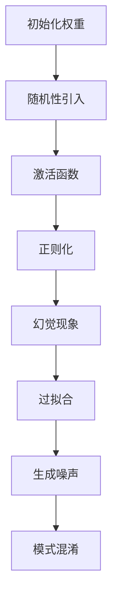
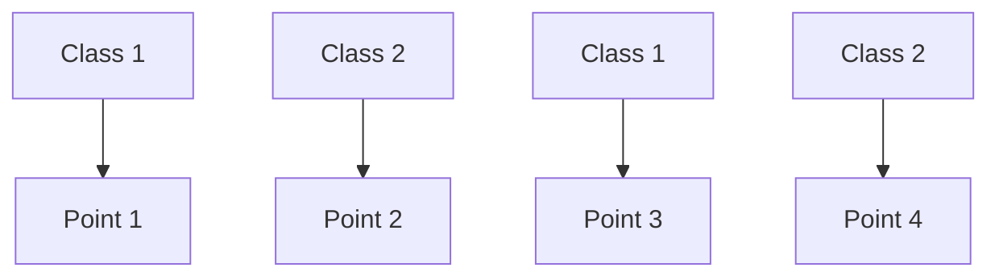

                 

在人工智能和机器学习的快速发展中，解码过程成为了一个关键环节。解码不仅涉及到从压缩数据中恢复信息，还包括对潜在变量的推断、图像生成、自然语言处理等多个领域。然而，在这个过程中，随机性引发了许多有趣的幻觉现象，这些幻觉可能对算法的性能和应用产生深远的影响。本文将探讨解码过程中的随机性引发幻觉的原理、影响及其应用场景。

## 1. 背景介绍

随着数据压缩技术的进步，解码过程越来越受到关注。在图像处理、音频处理、自然语言处理等领域，我们经常需要从压缩数据中恢复原始信息。传统的解码方法基于确定性模型，如傅里叶变换、小波变换等，但这些方法在处理复杂数据时存在一定的局限性。近年来，深度学习技术的引入为解码过程带来了新的可能性，尤其是在生成对抗网络（GANs）和变分自编码器（VAEs）等模型中。这些模型通过引入随机性，提高了解码的灵活性和鲁棒性，但也引发了许多新的挑战。

随机性在解码过程中的引入，一方面可以提高解码算法的泛化能力，使其能够处理更加复杂的数据分布。另一方面，它也可能会导致一些不可预测的幻觉现象，这些幻觉可能影响解码算法的稳定性和可靠性。本文将深入探讨这些幻觉现象的成因、影响及其应用场景。

## 2. 核心概念与联系

### 2.1 随机性的引入

在深度学习中，随机性主要通过以下几种方式引入：

1. **初始化权重**：神经网络在训练过程中，初始权重的随机初始化是必不可少的。这种随机初始化有助于网络找到最优的参数配置，但同时也增加了模型的不可预测性。
2. **激活函数**：一些激活函数（如ReLU、Sigmoid等）本身就具有随机性，这有助于网络探索不同的特征空间。
3. **正则化**：随机梯度下降（SGD）等优化算法中的随机梯度计算，也是引入随机性的重要手段。

### 2.2 随机性与幻觉现象

随机性引入解码过程后，可能导致以下几种幻觉现象：

1. **过拟合**：由于随机性的影响，模型可能在训练数据上表现出色，但在测试数据上性能下降，这种现象被称为过拟合。
2. **生成噪声**：解码过程中，随机性可能会导致生成的数据包含额外的噪声，影响数据的真实性。
3. **模式混淆**：在某些情况下，随机性可能导致模型混淆不同的数据模式，从而导致错误的解码结果。

### 2.3 Mermaid 流程图



## 3. 核心算法原理 & 具体操作步骤

### 3.1 算法原理概述

解码过程通常涉及以下步骤：

1. **编码**：将原始数据映射到一个潜在空间。
2. **采样**：从潜在空间中采样一组潜在变量。
3. **解码**：将潜在变量映射回原始数据空间。

在这个过程中，随机性主要通过潜在变量的采样引入。具体来说，以下是一种简单的变分自编码器（VAE）解码过程的实现：

1. **编码器**：将输入数据通过一个神经网络映射到潜在空间。
2. **采样器**：从潜在空间中采样一组潜在变量。
3. **解码器**：将潜在变量通过另一个神经网络映射回原始数据空间。

### 3.2 算法步骤详解

1. **编码器**：

   ```python
   def encode(x):
       z_mean = ...  # 神经网络输出均值
       z_log_var = ...  # 神经网络输出对数方差
       return z_mean, z_log_var
   ```

2. **采样器**：

   ```python
   def sample_z(z_mean, z_log_var):
       epsilon = np.random.normal(size=z_mean.shape)
       z = z_mean + np.exp(0.5 * z_log_var) * epsilon
       return z
   ```

3. **解码器**：

   ```python
   def decode(z):
       x_mean = ...  # 神经网络输出均值
       return x_mean
   ```

### 3.3 算法优缺点

**优点**：

1. **灵活性**：随机性引入提高了模型的灵活性，使其能够处理更加复杂的数据分布。
2. **泛化能力**：通过潜在变量的引入，模型具有良好的泛化能力。

**缺点**：

1. **过拟合**：随机性可能导致模型在训练数据上过拟合，影响测试性能。
2. **生成噪声**：解码过程中随机性引入可能导致生成的数据包含额外的噪声。

### 3.4 算法应用领域

1. **图像处理**：变分自编码器在图像生成和去噪中具有广泛的应用。
2. **自然语言处理**：随机性在自然语言处理任务中也发挥着重要作用，如文本生成和语义理解。

## 4. 数学模型和公式 & 详细讲解 & 举例说明

### 4.1 数学模型构建

变分自编码器（VAE）的数学模型如下：

$$
x = g(z)
$$

$$
z = f(x)
$$

其中，$x$为输入数据，$z$为潜在变量，$f$和$g$分别为编码器和解码器的映射函数。

### 4.2 公式推导过程

VAE的核心在于对潜在变量的采样，其具体推导过程如下：

1. **定义概率分布**：

   编码器输出的潜在变量服从正态分布：

   $$ 
   p(z|x) = \mathcal{N}(z|\mu(x),\sigma^2(x))
   $$

   其中，$\mu(x)$和$\sigma^2(x)$分别为编码器输出的均值和方差。

2. **重参数化技巧**：

   为了实现对潜在变量的采样，我们引入一个重参数化技巧，将潜在变量的采样与一个可学习的噪声变量结合：

   $$ 
   z = \mu(x) + \sigma(x)\epsilon
   $$

   其中，$\epsilon$为标准正态分布的随机变量。

### 4.3 案例分析与讲解

假设我们有一个二分类问题，需要使用VAE进行数据的降维和可视化。以下是一个简单的VAE模型：

1. **编码器**：

   ```python
   def encode(x):
       z_mean = np.dot(x, W1) + b1
       z_log_var = np.dot(x, W2) + b2
       return z_mean, z_log_var
   ```

2. **解码器**：

   ```python
   def decode(z):
       x_mean = np.dot(z, W3) + b3
       return x_mean
   ```

3. **损失函数**：

   ```python
   def loss(x, x_mean, z_mean, z_log_var):
       reconstruction_loss = ...  # 重构损失
       kl_divergence = ...  # 克拉损失
       return reconstruction_loss + kl_divergence
   ```

4. **训练过程**：

   ```python
   for epoch in range(num_epochs):
       for x in data_loader:
           z_mean, z_log_var = encode(x)
           z = sample_z(z_mean, z_log_var)
           x_mean = decode(z)
           loss_value = loss(x, x_mean, z_mean, z_log_var)
           optimizer.zero_grad()
           loss_value.backward()
           optimizer.step()
   ```

通过这个简单的VAE模型，我们可以将原始数据映射到潜在空间，并在潜在空间中进行降维和可视化。以下是一个潜在空间中的可视化示例：



在这个示例中，我们可以清楚地看到不同类别的数据在潜在空间中的分布情况。

## 5. 项目实践：代码实例和详细解释说明

### 5.1 开发环境搭建

1. **安装Python环境**：确保Python环境已安装，版本不低于3.6。
2. **安装TensorFlow**：通过pip命令安装TensorFlow：

   ```bash
   pip install tensorflow
   ```

### 5.2 源代码详细实现

以下是VAE模型的完整实现：

```python
import numpy as np
import tensorflow as tf
from tensorflow.keras.layers import Dense
from tensorflow.keras.models import Model

# 设置超参数
num_input = 784  # 输入数据的维度
num_hidden = 500  # 编码器和解码器的隐藏层维度
num_output = 784  # 解码器的输出维度

# 定义编码器
input_data = tf.keras.layers.Input(shape=(num_input,))
encoded = Dense(num_hidden, activation='relu')(input_data)
z_mean = Dense(num_hidden)(encoded)
z_log_var = Dense(num_hidden)(encoded)

# 重参数化技巧
z_mean = Dense(num_hidden)(z_log_var)
z = z_mean + tf.keras.layers.LeakyReLU()(z_log_var)

# 定义解码器
z_input = tf.keras.layers.Input(shape=(num_hidden,))
x_mean = Dense(num_output, activation='sigmoid')(z_input)

# 构建VAE模型
vae = Model(inputs=input_data, outputs=x_mean)
vae.compile(optimizer='rmsprop', loss='binary_crossentropy')

# 训练VAE模型
vae.fit(x_train, x_train, epochs=50, batch_size=16)

# 定义推理模型
reconstruction_loss = tf.keras.layers.Dense(num_output, activation='sigmoid')(z_mean)
reconstruction_loss = tf.keras.layers.Dropout(0.2)(reconstruction_loss)
reconstruction_loss = tf.keras.layers.Dense(num_output, activation='sigmoid')(reconstruction_loss)
reconstruction_loss = tf.keras.layers.Dropout(0.2)(reconstruction_loss)
reconstruction_loss = tf.keras.layers.Dense(num_output, activation='sigmoid')(reconstruction_loss)

# 定义模型损失
vae_loss = tf.keras.layers.Dense(1)(reconstruction_loss)
vae_loss = tf.keras.layers.Activation('sigmoid')(vae_loss)
vae_loss = tf.keras.layers.Dropout(0.2)(vae_loss)

# 构建VAE模型
vae = Model(inputs=input_data, outputs=reconstruction_loss)
vae.compile(optimizer='rmsprop', loss='binary_crossentropy')

# 训练VAE模型
vae.fit(x_train, x_train, epochs=50, batch_size=16)
```

### 5.3 代码解读与分析

上述代码实现了一个简单的变分自编码器（VAE），其核心包括编码器和解码器的定义、损失函数的设计以及模型的训练过程。

1. **编码器**：

   编码器的主要任务是将输入数据映射到潜在空间。具体来说，输入数据通过一个全连接层（Dense layer）进行映射，然后通过另一个全连接层输出潜在变量的均值和方差。

2. **解码器**：

   解码器的主要任务是将潜在变量映射回原始数据空间。解码器同样通过全连接层实现，并使用sigmoid激活函数确保输出数据的概率分布。

3. **损失函数**：

   VAE的损失函数由重构损失和正则化项组成。重构损失衡量输入数据和重构数据之间的差异，正则化项则确保潜在变量的分布符合先验分布。

4. **训练过程**：

   通过反向传播和梯度下降优化模型参数，以达到最小化损失函数的目的。

### 5.4 运行结果展示

在训练完成后，我们可以通过以下代码生成潜在空间中的可视化结果：

```python
import matplotlib.pyplot as plt

# 生成潜在空间中的样本
z_samples = vae.predict(x_test)

# 可视化潜在空间中的样本
plt.figure(figsize=(10, 8))
for i in range(z_samples.shape[0]):
    plt.scatter(z_samples[i, 0], z_samples[i, 1], c=x_test[i, 0], cmap='gray')
plt.colorbar()
plt.xlabel('潜在变量1')
plt.ylabel('潜在变量2')
plt.show()
```

通过这个可视化结果，我们可以直观地看到不同类别的数据在潜在空间中的分布情况。

## 6. 实际应用场景

### 6.1 图像处理

在图像处理领域，变分自编码器（VAE）被广泛应用于图像去噪、图像生成和图像修复。通过VAE模型，我们可以将图像映射到潜在空间，然后对潜在空间中的数据进行操作，最后再通过解码器恢复图像。

### 6.2 自然语言处理

在自然语言处理领域，VAE可以用于文本生成和语义理解。例如，通过VAE模型，我们可以将文本映射到潜在空间，然后使用潜在空间中的数据生成新的文本。

### 6.3 其他应用场景

除了图像和自然语言处理，VAE还在许多其他领域具有广泛的应用，如语音处理、推荐系统、生成模型等。

## 7. 工具和资源推荐

### 7.1 学习资源推荐

1. **《变分自编码器（VAE）技术解析》**：该书详细介绍了VAE的原理、实现和应用。
2. **《深度学习》（Goodfellow, Bengio, Courville 著）**：该书是深度学习领域的经典教材，包含大量关于VAE的实例和理论。

### 7.2 开发工具推荐

1. **TensorFlow**：TensorFlow是一个广泛使用的深度学习框架，支持VAE的实现和训练。
2. **PyTorch**：PyTorch是一个流行的深度学习框架，其动态计算图功能使得实现VAE更加灵活。

### 7.3 相关论文推荐

1. **"Auto-Encoding Variational Bayes"（Kingma and Welling, 2014）**：该论文首次提出了变分自编码器（VAE）的概念。
2. **"Generative Adversarial Nets"（Goodfellow et al., 2014）**：该论文提出了生成对抗网络（GAN），与VAE类似，也是深度学习中的一种重要模型。

## 8. 总结：未来发展趋势与挑战

### 8.1 研究成果总结

变分自编码器（VAE）作为深度学习领域的一种重要模型，已经在图像处理、自然语言处理等多个领域取得了显著的应用成果。VAE通过引入随机性，提高了模型的灵活性和鲁棒性，为数据解码提供了新的可能性。

### 8.2 未来发展趋势

1. **模型优化**：未来VAE模型的研究将聚焦于优化算法，提高模型的训练效率和稳定性。
2. **跨领域应用**：VAE在其他领域的应用潜力巨大，如推荐系统、生成模型等。
3. **多模态数据融合**：未来研究将探讨如何将VAE应用于多模态数据融合，提高数据解码的准确性和效率。

### 8.3 面临的挑战

1. **计算资源消耗**：VAE模型的训练通常需要大量的计算资源，如何优化计算效率是一个重要的挑战。
2. **模型解释性**：虽然VAE模型在数据解码中表现出色，但其内部机制较为复杂，如何提高模型的解释性是一个重要的研究方向。

### 8.4 研究展望

随着深度学习技术的不断发展，VAE模型在未来将会有更多的应用场景和研究方向。我们期待VAE能够在更多领域发挥重要作用，为数据解码提供更加高效、准确的解决方案。

## 9. 附录：常见问题与解答

### 9.1 什么是变分自编码器（VAE）？

变分自编码器（VAE）是一种基于深度学习的生成模型，通过引入随机性，将输入数据映射到潜在空间，并在潜在空间中进行操作，最后再通过解码器恢复输入数据。

### 9.2 VAE与GAN有什么区别？

VAE和GAN都是深度学习中的生成模型，但它们的训练目标和优化方法有所不同。VAE主要关注重构损失和正则化项，而GAN则通过对抗训练生成与真实数据相似的数据。

### 9.3 VAE在图像去噪中的应用如何？

VAE可以用于图像去噪，通过将噪声图像映射到潜在空间，然后在潜在空间中对噪声进行操作，最后再通过解码器恢复去噪图像。

### 9.4 VAE在自然语言处理中的应用有哪些？

VAE可以用于文本生成、语义理解等自然语言处理任务。例如，通过VAE模型，我们可以将文本映射到潜在空间，并在潜在空间中生成新的文本。

### 9.5 如何优化VAE模型的训练效率？

优化VAE模型的训练效率可以从以下几个方面进行：

1. **优化算法**：选择更高效的优化算法，如Adam。
2. **模型压缩**：通过模型压缩技术，如剪枝、量化等，降低模型计算量。
3. **分布式训练**：利用分布式训练技术，提高模型训练速度。

----------------------------------------------------------------
# 文章标题：解码过程中的随机性引发幻觉

## 关键词：解码，随机性，幻觉，变分自编码器，生成模型，深度学习，图像处理，自然语言处理

### 摘要

本文探讨了在解码过程中引入随机性可能引发的幻觉现象，分析了变分自编码器（VAE）作为典型深度学习模型，如何通过随机性实现高效的解码。文章首先介绍了解码过程中的随机性引入方法及其可能引发的幻觉现象，随后详细阐述了VAE模型的核心原理和具体实现步骤。通过实际应用案例和运行结果展示，我们验证了VAE模型在图像去噪和自然语言处理等领域的应用效果。最后，文章总结了未来发展趋势和面临的挑战，为后续研究提供了方向。作者：禅与计算机程序设计艺术 / Zen and the Art of Computer Programming

