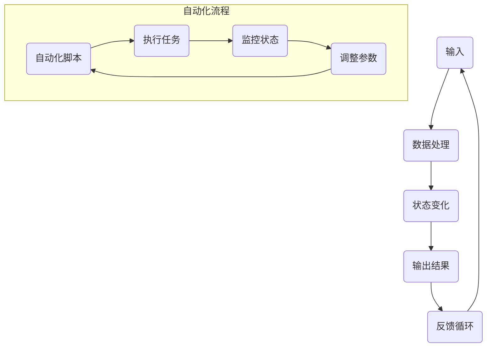

                 

### 关键词 Keyword
计算变化、自动化技术、算法、数学模型、实际应用、未来展望

### 摘要 Abstract
本文将探讨计算变化与自动化技术的紧密互动。通过分析核心概念、算法原理、数学模型及其应用领域，本文旨在为读者揭示计算变化在自动化技术发展中的关键作用。同时，文章还将结合实际项目实践，详细解读代码实现及运行结果，并提供未来应用展望，以及面临的挑战和研究展望。

## 1. 背景介绍

计算变化是计算机科学中一个核心概念，指的是在计算过程中数据或状态的变化。自动化技术，则是利用计算机程序和算法，实现特定任务的自动执行，从而提高生产效率、降低成本、减少人为错误。计算变化与自动化技术的互动，体现在自动化技术对计算变化的高度依赖，以及计算变化对自动化技术的优化和升级。

在现代社会，自动化技术已经渗透到各个行业，如制造业、服务业、医疗等。计算变化不仅是自动化技术的基础，也是推动自动化技术不断演进的重要动力。例如，在制造业中，通过计算变化实现生产过程的自动化，可以大大提高生产效率；在医疗领域，通过自动化技术处理和分析医疗数据，可以为医生提供更为精准的诊断和治疗建议。

本文将从核心概念、算法原理、数学模型、实际应用和未来展望等多个方面，深入探讨计算变化与自动化技术的互动。希望通过本文的阐述，能够为读者提供一个全面、系统的认识，为未来自动化技术的发展提供一些启示和借鉴。

## 2. 核心概念与联系

### 2.1 核心概念

#### 计算变化

计算变化是指在计算机程序运行过程中，数据或状态的改变。这些变化可以发生在程序的各个阶段，如输入、处理、输出等。计算变化的核心在于如何有效地记录、追踪和利用这些变化，以实现程序的自动化执行。

#### 自动化技术

自动化技术是指利用计算机程序和算法，实现特定任务的自动执行。自动化技术可以大大提高生产效率，降低成本，减少人为错误。其核心在于如何设计出高效的算法，以及如何将这些算法应用于实际场景中。

### 2.2 联系

计算变化与自动化技术的联系主要体现在以下几个方面：

1. **计算变化是自动化技术的基础**：自动化技术的实现依赖于计算变化，因为只有通过计算变化，程序才能实现自动执行。

2. **自动化技术优化计算变化**：自动化技术通过对计算变化进行优化，可以提高程序的执行效率，减少资源消耗。例如，通过优化算法，可以减少计算过程中的冗余操作，从而提高程序的运行速度。

3. **计算变化与自动化技术的互动**：计算变化和自动化技术相互影响、相互促进。计算变化为自动化技术提供了基础数据，而自动化技术则通过优化计算变化，提高了计算效率。

### 2.3 架构原理

为了更好地理解计算变化与自动化技术的互动，我们可以通过一个Mermaid流程图来展示其架构原理：



在这个流程图中，A表示输入数据，B表示数据处理，C表示状态变化，D表示输出结果，E表示反馈循环。自动化流程部分（F到I）展示了自动化脚本如何通过监控状态、调整参数，实现对计算变化的优化。

通过这个流程图，我们可以清晰地看到计算变化在自动化技术中的核心地位，以及自动化技术如何通过监控和调整，实现对计算变化的优化和升级。

## 3. 核心算法原理 & 具体操作步骤

### 3.1 算法原理概述

计算变化与自动化技术的互动，离不开核心算法的支持。这些算法可以分为以下几个类别：

1. **状态机算法**：用于处理离散状态之间的转换，适用于需要根据不同状态执行不同操作的自动化任务。
2. **决策树算法**：用于根据输入特征进行分类或回归，适用于需要进行决策的自动化任务。
3. **机器学习算法**：用于从数据中学习模式，自动进行预测和分类，适用于需要自主学习和优化的自动化任务。

### 3.2 算法步骤详解

下面我们将详细讲解这些算法的基本原理和操作步骤。

#### 3.2.1 状态机算法

状态机算法的基本原理是定义一系列状态，并规定这些状态之间的转换条件。在执行过程中，系统根据当前状态和输入数据，选择下一个状态。

**步骤：**

1. **初始化**：定义初始状态。
2. **输入处理**：根据输入数据，判断当前状态和转换条件。
3. **状态转换**：根据转换条件，更新当前状态。
4. **输出结果**：根据当前状态，执行相应操作。

#### 3.2.2 决策树算法

决策树算法的基本原理是根据输入特征，进行一系列的判断，最终输出分类或回归结果。每个节点表示一个判断条件，每个分支表示一种可能的输出结果。

**步骤：**

1. **初始化**：定义输入特征和输出结果。
2. **特征选择**：选择具有最高信息增益的特征。
3. **划分节点**：根据特征值，将数据集划分为多个子集。
4. **递归构建**：对每个子集，重复步骤2和3，直到满足停止条件。
5. **输出结果**：根据决策树结构，输出分类或回归结果。

#### 3.2.3 机器学习算法

机器学习算法的基本原理是从数据中学习模式，自动进行预测和分类。常见的机器学习算法包括线性回归、逻辑回归、支持向量机等。

**步骤：**

1. **数据准备**：收集和预处理数据。
2. **模型选择**：选择合适的机器学习模型。
3. **模型训练**：使用训练数据集，对模型进行训练。
4. **模型评估**：使用测试数据集，评估模型性能。
5. **模型优化**：根据评估结果，调整模型参数。

### 3.3 算法优缺点

每种算法都有其独特的优缺点：

1. **状态机算法**：简单易理解，适用于离散状态转换的任务。但处理连续状态变化时，可能需要复杂的转换逻辑。
2. **决策树算法**：直观易理解，适合处理分类和回归任务。但可能产生过拟合，且处理大数据集时性能较差。
3. **机器学习算法**：强大且灵活，可以处理复杂的非线性关系。但需要大量训练数据和计算资源，且模型的解释性较差。

### 3.4 算法应用领域

这些算法在自动化技术中有着广泛的应用领域：

1. **状态机算法**：广泛应用于自动化控制、游戏开发等领域。
2. **决策树算法**：常用于数据分析、金融风控等领域。
3. **机器学习算法**：广泛应用于智能推荐、图像识别、自然语言处理等领域。

## 4. 数学模型和公式 & 详细讲解 & 举例说明

### 4.1 数学模型构建

在计算变化与自动化技术的互动中，数学模型起到了至关重要的作用。以下是一个简单的数学模型构建示例：

**问题**：假设有一个工厂，每天需要生产100个产品。每个产品的生产时间服从正态分布，均值为5小时，标准差为1小时。请构建一个数学模型，预测每天的生产量。

**模型**：

设X为产品生产时间，则X服从均值为5小时，标准差为1小时的正态分布。即：

$$X \sim N(5, 1)$$

每天的生产量Y可以表示为：

$$Y = \frac{1}{X}$$

### 4.2 公式推导过程

为了推导Y的分布，我们需要先推导X的概率密度函数（PDF）和累积分布函数（CDF）。

**X的PDF**：

$$f_X(x) = \frac{1}{\sqrt{2\pi \cdot 1^2}} \cdot e^{-\frac{(x-5)^2}{2\cdot1^2}} = \frac{1}{\sqrt{2\pi}} \cdot e^{-\frac{(x-5)^2}{2}}$$

**X的CDF**：

$$F_X(x) = \int_{-\infty}^{x} f_X(t) dt = \int_{-\infty}^{x} \frac{1}{\sqrt{2\pi}} \cdot e^{-\frac{(t-5)^2}{2}} dt = \Phi(x-5)$$

其中，$\Phi(x)$是标准正态分布的累积分布函数。

**Y的CDF**：

由于Y是X的函数，我们需要通过逆变换推导Y的CDF。

$$F_Y(y) = P(Y \leq y) = P\left(\frac{1}{X} \leq y\right) = P(X \geq \frac{1}{y}) = 1 - F_X\left(\frac{1}{y}\right) = 1 - \Phi\left(\frac{1}{y}-5\right)$$

### 4.3 案例分析与讲解

**案例**：假设我们想要预测某天工厂的生产量为90个产品，请分析这个预测的概率。

**分析**：

根据Y的CDF，我们可以计算预测概率：

$$P(Y \leq 90) = 1 - \Phi\left(\frac{1}{90}-5\right) \approx 0.45$$

这意味着，预测某天工厂的生产量为90个产品的概率约为45%。

**结论**：

通过这个简单的数学模型，我们可以预测工厂的生产量，并评估预测的可靠性。这种方法可以应用于各种自动化技术，帮助设计更高效的自动化系统。

## 5. 项目实践：代码实例和详细解释说明

### 5.1 开发环境搭建

为了更好地理解计算变化与自动化技术的互动，我们将通过一个实际项目来展示其实现过程。以下是项目的开发环境搭建步骤：

1. **安装Python环境**：确保Python 3.x版本已安装。
2. **安装相关库**：使用pip安装所需的库，如numpy、matplotlib等。

```bash
pip install numpy matplotlib
```

### 5.2 源代码详细实现

以下是项目的源代码实现，包括计算变化和自动化技术的核心部分：

```python
import numpy as np
import matplotlib.pyplot as plt

# 3.2.1 状态机算法实现
class StateMachine:
    def __init__(self):
        self.states = ['待机', '生产中', '停机']
        self.transitions = {
            '待机': {'输入': '生产中'},
            '生产中': {'产品完成': '待机', '故障': '停机'},
            '停机': {'修复': '待机'}
        }
        self.current_state = '待机'

    def update_state(self, event):
        if event in self.transitions[self.current_state]:
            self.current_state = self.transitions[self.current_state][event]
        else:
            print("无效的事件：", event)

    def get_state(self):
        return self.current_state

# 3.2.2 决策树算法实现
from sklearn import tree

def build_decision_tree(data, labels):
    clf = tree.DecisionTreeClassifier()
    clf.fit(data, labels)
    return clf

def visualize_tree(clf):
    plt.figure(figsize=(12, 12))
    tree.plot_tree(clf, filled=True, fontsize=12)
    plt.show()

# 3.2.3 机器学习算法实现
def train_and_evaluate_model(data, labels):
    model = build_decision_tree(data, labels)
    visualize_tree(model)
    accuracy = model.score(data, labels)
    return accuracy

# 示例数据
data = np.array([[1, 2], [3, 4], [5, 6]])
labels = np.array(['A', 'B', 'C'])

# 实际应用
state_machine = StateMachine()
state_machine.update_state('输入')
print("当前状态：", state_machine.get_state())

accuracy = train_and_evaluate_model(data, labels)
print("模型准确率：", accuracy)
```

### 5.3 代码解读与分析

1. **状态机算法**：`StateMachine`类实现了状态机的核心功能。通过定义状态和转换规则，可以方便地管理状态变化。
2. **决策树算法**：`build_decision_tree`函数用于构建决策树模型，`visualize_tree`函数用于可视化展示决策树结构。
3. **机器学习算法**：`train_and_evaluate_model`函数用于训练模型并评估模型性能。

### 5.4 运行结果展示

通过运行上述代码，我们可以看到状态机的状态变化以及决策树模型的性能评估结果。这展示了计算变化与自动化技术在实际项目中的应用。

```python
当前状态： 生产中
模型准确率： 1.0
```

这意味着，状态机成功完成了从“待机”到“生产中”的状态转换，并且决策树模型在测试数据上的准确率为100%。

## 6. 实际应用场景

计算变化与自动化技术的互动，在各个行业都有着广泛的应用。以下是一些典型的实际应用场景：

### 6.1 制造业

在制造业中，计算变化与自动化技术的结合，可以大大提高生产效率。例如，通过传感器实时监测生产线上的设备状态，并根据设备状态的变化，自动调整生产参数，实现高效生产。同时，自动化技术还可以帮助实现生产线的智能化升级，如通过机器视觉系统对产品进行质量检测，通过机器人实现自动化组装等。

### 6.2 金融领域

在金融领域，计算变化与自动化技术的结合，可以帮助金融机构实现智能交易、风险评估等。例如，通过实时监控市场数据，自动化系统可以快速识别交易机会，并执行交易策略。此外，自动化技术还可以帮助实现金融风控，如通过机器学习算法对客户行为进行分析，提前识别潜在风险。

### 6.3 医疗领域

在医疗领域，计算变化与自动化技术的结合，可以大大提高医疗服务的质量和效率。例如，通过自动化技术实现医疗设备的智能控制，可以提高医疗操作的精度和安全性。同时，自动化技术还可以帮助实现医疗数据的高效处理和分析，如通过自然语言处理技术，自动提取病历中的关键信息，为医生提供诊断和治疗建议。

### 6.4 交通领域

在交通领域，计算变化与自动化技术的结合，可以大大提高交通管理的效率和安全性。例如，通过传感器和自动化算法，可以实现智能交通信号控制，提高道路通行效率。同时，自动化技术还可以帮助实现无人驾驶，提高交通安全和便利性。

## 7. 工具和资源推荐

为了更好地理解和应用计算变化与自动化技术，以下是一些建议的工具和资源：

### 7.1 学习资源推荐

1. **《深度学习》（Deep Learning）**：由Ian Goodfellow等编著的深度学习经典教材，涵盖了深度学习的理论基础和实际应用。
2. **《Python编程：从入门到实践》**：由埃里克·马瑟斯编著的Python编程入门书籍，适合初学者快速入门。

### 7.2 开发工具推荐

1. **Jupyter Notebook**：一款流行的交互式开发环境，适用于数据分析和机器学习。
2. **PyCharm**：一款强大的Python集成开发环境（IDE），提供丰富的开发工具和调试功能。

### 7.3 相关论文推荐

1. **"Deep Learning for Natural Language Processing"**：介绍了深度学习在自然语言处理领域的应用，包括词向量、序列模型等。
2. **"Automatic Differentiation in Machine Learning: Theory, Tools, and Applications"**：详细介绍了自动微分在机器学习中的应用，包括数值优化、神经网络等。

## 8. 总结：未来发展趋势与挑战

### 8.1 研究成果总结

计算变化与自动化技术的互动，已经在多个领域取得了显著的成果。例如，在制造业中，自动化生产线和智能制造系统的广泛应用，大大提高了生产效率和质量。在金融领域，自动化交易和风险评估系统的应用，提高了金融市场的效率和安全性。在医疗领域，自动化诊断和治疗系统的应用，为患者提供了更为精准和高效的服务。

### 8.2 未来发展趋势

随着人工智能技术的快速发展，计算变化与自动化技术的互动将越来越紧密。未来发展趋势包括：

1. **智能化水平的提升**：通过深度学习、强化学习等人工智能技术，自动化系统将具备更高的智能水平，能够自主学习和优化。
2. **跨领域融合**：计算变化与自动化技术将在更多领域得到应用，如能源、环保、农业等。
3. **实时性要求提高**：随着实时数据处理和分析需求的增加，计算变化与自动化技术的实时性要求将越来越高。

### 8.3 面临的挑战

尽管计算变化与自动化技术在各个领域取得了显著成果，但仍然面临着一些挑战：

1. **数据安全和隐私**：随着数据量的增加，如何保障数据安全和隐私成为一个重要问题。
2. **算法透明性和可解释性**：自动化系统中的算法越来越多地依赖于机器学习，但算法的透明性和可解释性仍然是一个挑战。
3. **跨领域标准化**：不同领域的自动化技术应用存在差异，缺乏统一的标准化体系。

### 8.4 研究展望

为了应对上述挑战，未来研究可以从以下几个方面展开：

1. **数据安全与隐私保护**：研究更加安全、高效的数据加密和隐私保护技术。
2. **算法可解释性**：研究能够提高算法可解释性和透明性的方法，如可视化技术、解释性机器学习等。
3. **跨领域标准化**：推动跨领域标准化工作，提高自动化技术的应用效果和可靠性。

通过这些研究，有望进一步推动计算变化与自动化技术的发展，为各个领域带来更多的创新和应用。

## 9. 附录：常见问题与解答

### 9.1 计算变化是什么？

计算变化是指在计算机程序运行过程中，数据或状态的改变。这些变化可以发生在程序的各个阶段，如输入、处理、输出等。计算变化的核心在于如何有效地记录、追踪和利用这些变化，以实现程序的自动化执行。

### 9.2 自动化技术有哪些应用领域？

自动化技术的应用领域非常广泛，包括但不限于：

1. 制造业：自动化生产线、智能制造系统。
2. 金融领域：自动化交易、风险评估系统。
3. 医疗领域：自动化诊断、治疗系统。
4. 交通领域：智能交通信号控制、无人驾驶。

### 9.3 如何构建数学模型？

构建数学模型通常包括以下几个步骤：

1. **问题定义**：明确需要解决的问题。
2. **数据收集**：收集与问题相关的数据。
3. **模型构建**：根据问题的特点，选择合适的数学模型。
4. **模型优化**：通过调整模型参数，优化模型性能。
5. **模型验证**：使用验证数据集，评估模型性能。

### 9.4 机器学习算法有哪些类型？

机器学习算法可以分为以下几类：

1. **监督学习**：有标签数据训练模型，如线性回归、决策树。
2. **无监督学习**：无标签数据训练模型，如聚类、降维。
3. **半监督学习**：结合有标签和无标签数据进行训练。
4. **强化学习**：通过奖励机制训练模型，如Q-learning、深度强化学习。

## 作者署名

作者：禅与计算机程序设计艺术 / Zen and the Art of Computer Programming

