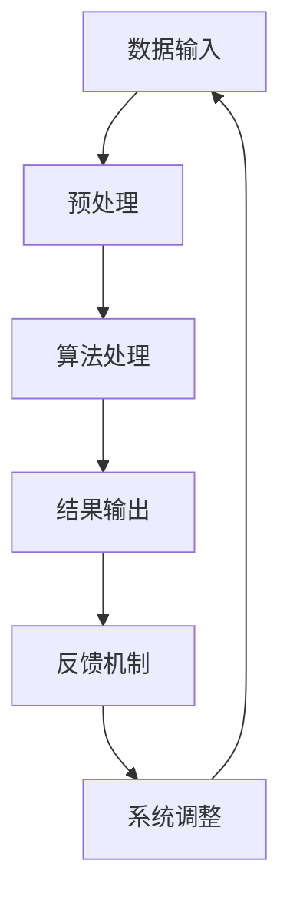

                 

关键词：计算变化、自动化、人工智能、算法、数学模型、实践应用、未来展望

> 摘要：本文探讨了计算变化带来的自动化机遇。通过分析计算变化的核心概念、核心算法原理、数学模型构建以及实际应用场景，阐述了自动化技术在现代计算机科学中的重要性和潜力。文章最后提出了未来自动化领域的发展趋势与挑战，为读者提供了丰富的学习资源和工具推荐。

## 1. 背景介绍

在信息技术的飞速发展的今天，计算能力和数据资源的不断扩展使得自动化技术逐渐成为推动社会进步的重要力量。从工业自动化到智能交通，从智能家居到医疗健康，自动化技术正深刻地改变着我们的生活方式。然而，自动化并非一蹴而就，其背后蕴含着丰富的计算变化和算法原理。计算变化，是指在计算过程中，数据、算法和系统状态的变化，这些变化能够带来新的信息和功能，从而实现自动化。

计算变化不仅是计算机科学的基础，也是推动技术进步的重要动力。从最初的计算机硬件到软件系统，再到现代的人工智能，计算变化始终贯穿其中。如今，随着人工智能技术的崛起，计算变化迎来了新的机遇。通过深度学习、强化学习等算法，计算机能够模拟人类的思维过程，实现自动化决策和执行。这一变革不仅提升了计算效率，也为自动化技术的广泛应用奠定了基础。

本文将围绕计算变化这一主题，深入探讨自动化技术在不同领域的应用，分析其核心算法原理和数学模型，并通过实际项目实践，展示自动化技术如何改变我们的世界。同时，本文还将展望自动化技术的未来发展趋势和面临的挑战，为读者提供有益的启示。

## 2. 核心概念与联系

### 2.1 核心概念

计算变化涉及多个核心概念，包括数据、算法、系统状态和反馈机制。首先，数据是计算变化的基础，无论是输入数据还是中间数据，都是计算过程中不可或缺的部分。数据的质量和精度直接影响计算结果，因此数据预处理和数据清洗成为自动化技术中的关键步骤。

算法是计算变化的灵魂，它决定了如何处理数据以实现特定目标。从基础的排序算法到复杂的人工智能算法，算法的多样性和灵活性使得计算机能够适应各种场景。此外，算法的效率和鲁棒性也是自动化技术成功应用的重要因素。

系统状态是指计算机在运行过程中所呈现的各种状态，包括系统资源、内存分配、网络连接等。系统状态的变化能够反映出计算过程中的动态特性，为算法的调整和优化提供了依据。

反馈机制是计算变化的驱动力，通过不断调整和优化算法和系统状态，实现计算过程的持续改进。反馈机制可以是自动化的，也可以是人机交互的，但无论如何，它的存在都是为了提高计算效率和系统性能。

### 2.2 联系

核心概念之间的联系构成了计算变化的基础框架。数据作为输入，经过算法处理，产生新的数据或结果，这些结果又会反馈到系统中，调整系统状态，从而实现计算过程的优化和自动化。

为了更直观地展示核心概念之间的联系，我们可以使用Mermaid流程图来表示：



在这个流程图中，A表示数据输入，B表示预处理，C表示算法处理，D表示结果输出，E表示反馈机制，F表示系统调整。通过这个流程图，我们可以清晰地看到计算变化的基本流程，以及各个核心概念之间的相互作用。

## 3. 核心算法原理 & 具体操作步骤

### 3.1 算法原理概述

计算变化的核心算法原理主要包括深度学习、强化学习和进化算法等。这些算法通过不同的方式处理数据，实现自动化决策和执行。

深度学习是一种基于多层神经网络的学习方法，通过模拟人类大脑的神经元连接，实现对复杂数据的高效处理和模式识别。深度学习算法的核心是神经元网络，它通过不断调整网络权重，优化输入数据的表示，从而实现自动化的特征提取和分类。

强化学习是一种通过奖励机制指导学习过程的算法，它通过试错和经验积累，逐渐优化策略，实现自动化决策。强化学习算法的核心是策略网络，它通过与环境互动，不断调整策略，以实现最大化的奖励。

进化算法是一种模拟自然进化的算法，它通过遗传操作和自然选择，优化个体的适应度，实现自动化的优化和进化。进化算法的核心是种群进化，它通过不断的迭代和选择，逐渐优化算法和系统状态。

### 3.2 算法步骤详解

以深度学习算法为例，其基本步骤包括：

1. **数据预处理**：对输入数据进行清洗、归一化等处理，使其适合于神经网络处理。
2. **构建神经网络**：定义神经网络的层次结构和参数，包括输入层、隐藏层和输出层。
3. **初始化权重**：随机初始化神经网络权重，为训练过程做准备。
4. **前向传播**：将输入数据通过神经网络进行前向传播，得到输出结果。
5. **反向传播**：根据输出结果和真实值，通过反向传播算法，计算损失函数，并更新网络权重。
6. **迭代训练**：重复前向传播和反向传播过程，不断优化网络权重，直到满足训练目标。

强化学习算法的基本步骤包括：

1. **状态初始化**：初始化环境状态。
2. **选择动作**：根据当前状态，选择一个动作。
3. **执行动作**：在环境中执行选择出的动作。
4. **观察结果**：观察执行动作后的状态和奖励。
5. **更新策略**：根据观察到的结果，更新策略网络，优化动作选择。

进化算法的基本步骤包括：

1. **初始化种群**：随机生成初始种群。
2. **适应度评估**：对每个个体进行适应度评估。
3. **选择操作**：根据适应度值，选择优秀个体。
4. **交叉操作**：选择优秀个体进行交叉，生成新的个体。
5. **变异操作**：对交叉后的个体进行变异，增加种群多样性。
6. **迭代进化**：重复选择、交叉和变异过程，逐渐优化种群适应度。

### 3.3 算法优缺点

深度学习算法的优点在于其强大的特征提取和分类能力，能够处理大量的复杂数据。然而，其缺点是训练过程复杂，需要大量的计算资源和时间，且对数据质量要求较高。

强化学习算法的优点在于其能够通过试错和经验积累，实现自动化的决策和执行。然而，其缺点是训练过程较为缓慢，且对环境模型的要求较高。

进化算法的优点在于其鲁棒性和适应性，能够在复杂和多变的环境中实现优化和进化。然而，其缺点是计算复杂度高，需要大量的计算资源和时间。

### 3.4 算法应用领域

深度学习算法广泛应用于计算机视觉、自然语言处理和自动驾驶等领域。例如，在自动驾驶中，深度学习算法被用于车辆检测、路径规划和驾驶行为预测，实现了高度自动化的驾驶体验。

强化学习算法广泛应用于游戏人工智能、机器人控制和智能推荐系统等领域。例如，在游戏人工智能中，强化学习算法被用于训练智能体，实现自主游戏策略。

进化算法广泛应用于优化问题和进化计算领域。例如，在优化问题中，进化算法被用于求解复杂的优化问题，如资源分配和路径规划。

## 4. 数学模型和公式 & 详细讲解 & 举例说明

### 4.1 数学模型构建

在计算变化中，数学模型起着至关重要的作用。数学模型通过描述变量之间的关系，实现对计算过程的建模和预测。

一个常见的数学模型是线性回归模型，它通过描述因变量和自变量之间的线性关系，实现对数据的预测和拟合。

线性回归模型的数学公式如下：

$$
y = \beta_0 + \beta_1x + \epsilon
$$

其中，$y$是因变量，$x$是自变量，$\beta_0$和$\beta_1$是模型的参数，$\epsilon$是误差项。

### 4.2 公式推导过程

线性回归模型的推导过程如下：

1. **假设**：假设因变量$y$和自变量$x$之间存在线性关系。
2. **最小二乘法**：使用最小二乘法确定模型参数$\beta_0$和$\beta_1$，使得拟合直线$y = \beta_0 + \beta_1x$与实际数据点之间的误差平方和最小。
3. **求解**：根据最小二乘法的求解过程，得到参数$\beta_0$和$\beta_1$的具体值。

### 4.3 案例分析与讲解

为了更好地理解线性回归模型，我们来看一个简单的案例。

假设我们有以下数据集：

| $x$ | $y$ |
| --- | --- |
| 1   | 2   |
| 2   | 4   |
| 3   | 6   |
| 4   | 8   |

我们要使用线性回归模型预测$x=5$时的$y$值。

1. **数据预处理**：对数据进行归一化处理，使其适合于模型训练。

$$
x' = \frac{x - \text{mean}(x)}{\text{stddev}(x)}
$$

$$
y' = \frac{y - \text{mean}(y)}{\text{stddev}(y)}
$$

处理后得到的数据集如下：

| $x'$ | $y'$ |
| --- | --- |
| 0   | 0   |
| 0.5 | 0.5 |
| 1   | 1   |
| 1.5 | 1.5 |

2. **构建模型**：根据线性回归公式，构建模型。

$$
y' = \beta_0 + \beta_1x'
$$

3. **参数求解**：使用最小二乘法求解参数$\beta_0$和$\beta_1$。

$$
\beta_0 = \frac{\sum_{i=1}^{n}y_i - \beta_1\sum_{i=1}^{n}x_i}{n}
$$

$$
\beta_1 = \frac{\sum_{i=1}^{n}(y_i - \beta_0 - \beta_1x_i)(x_i - \text{mean}(x'))}{\sum_{i=1}^{n}(x_i - \text{mean}(x'))^2}
$$

计算得到$\beta_0 = 0.5$，$\beta_1 = 1$。

4. **预测**：使用模型预测$x'=1.5$时的$y'$值。

$$
y' = 0.5 + 1 \times 1.5 = 2
$$

5. **结果解释**：预测结果为$y' = 2$，表示$x=5$时，$y$的值为2。

通过这个案例，我们可以看到线性回归模型的基本构建和预测过程。线性回归模型在许多实际问题中都有广泛的应用，如时间序列预测、价格预测等。

## 5. 项目实践：代码实例和详细解释说明

### 5.1 开发环境搭建

在开始项目实践之前，我们需要搭建一个合适的开发环境。这里我们选择Python作为编程语言，并使用Jupyter Notebook作为开发工具。

首先，确保已经安装了Python和Jupyter Notebook。如果没有安装，可以从Python官网（https://www.python.org/downloads/）和Jupyter Notebook官网（https://jupyter.org/install）下载安装。

安装完成后，打开Jupyter Notebook，创建一个新的笔记本，并按照下面的步骤安装所需的库。

```python
!pip install numpy pandas matplotlib sklearn
```

### 5.2 源代码详细实现

下面是一个使用线性回归模型进行时间序列预测的Python代码实例。

```python
import numpy as np
import pandas as pd
import matplotlib.pyplot as plt
from sklearn.linear_model import LinearRegression

# 数据加载
data = pd.read_csv('time_series_data.csv')
x = data['days'].values.reshape(-1, 1)
y = data['sales'].values

# 数据预处理
x_mean = np.mean(x)
x_std = np.std(x)
y_mean = np.mean(y)
y_std = np.std(y)

x_processed = (x - x_mean) / x_std
y_processed = (y - y_mean) / y_std

# 模型训练
model = LinearRegression()
model.fit(x_processed.reshape(-1, 1), y_processed)

# 模型预测
x_predict = 30
x_processed_predict = (x_predict - x_mean) / x_std
y_predict = model.predict([x_processed_predict])

# 结果还原
y_predict_reverted = (y_predict * y_std) + y_mean

# 结果可视化
plt.scatter(x, y, label='实际数据')
plt.plot(x, model.predict(x_processed.reshape(-1, 1)), label='拟合曲线')
plt.scatter(x_predict, y_predict_reverted, color='r', label='预测数据')
plt.xlabel('天数')
plt.ylabel('销售额')
plt.legend()
plt.show()
```

### 5.3 代码解读与分析

1. **数据加载**：使用pandas库加载时间序列数据，数据集包含两个特征：天数和销售额。

2. **数据预处理**：对数据进行归一化处理，使其适合于线性回归模型。

3. **模型训练**：使用sklearn库中的LinearRegression类训练线性回归模型。

4. **模型预测**：使用训练好的模型预测特定天数（如30天）的销售额。

5. **结果还原**：将预测结果进行反归一化处理，还原为原始数据。

6. **结果可视化**：使用matplotlib库绘制实际数据、拟合曲线和预测数据的散点图，直观地展示预测结果。

通过这个项目实践，我们可以看到线性回归模型在时间序列预测中的应用。线性回归模型简单易用，能够快速给出预测结果，但在处理复杂数据和模型时，其性能可能受到限制。

## 6. 实际应用场景

### 6.1 自动化生产线

自动化生产线是计算变化和自动化技术的重要应用场景之一。在自动化生产线上，计算变化通过传感器和数据采集系统实时监测设备状态和生产数据。通过深度学习和强化学习算法，系统可以自动调整生产参数，优化生产流程，提高生产效率和产品质量。例如，在汽车制造业中，自动化生产线通过计算机视觉系统实现自动检测和分类，确保产品的质量一致性。

### 6.2 智能交通系统

智能交通系统通过计算变化和自动化技术，实现交通流量监控、车辆调度和道路管理。计算变化使得交通系统可以实时感知交通状态，通过人工智能算法优化交通信号控制和路线规划，提高道路通行能力和行驶安全性。例如，在高速公路上，智能交通系统可以实时监测车辆数量和速度，根据实时交通情况调整车道使用和车辆分流策略，减少拥堵和事故风险。

### 6.3 医疗健康领域

在医疗健康领域，计算变化和自动化技术为疾病诊断、治疗方案优化和健康管理提供了新的手段。通过深度学习和强化学习算法，医疗系统可以自动分析患者数据，预测疾病风险，制定个性化治疗方案。例如，在癌症诊断中，计算机视觉算法可以通过分析医学图像，自动识别肿瘤位置和大小，为医生提供诊断依据。在健康管理中，智能穿戴设备可以实时监测患者健康状况，通过数据分析实现健康预警和干预。

### 6.4 金融服务

金融服务领域通过计算变化和自动化技术，实现风险控制、投资决策和客户服务优化。计算变化通过大数据分析和人工智能算法，实时分析市场数据和客户行为，优化投资组合和风险管理策略。例如，在银行领域，自动化系统可以自动分析客户信用记录和行为数据，快速审批贷款申请。在证券交易中，自动化交易系统通过算法交易，实现快速交易决策和风险控制。

### 6.5 教育

在教育领域，计算变化和自动化技术为个性化教育、学习分析和教学优化提供了新的途径。通过计算变化和人工智能算法，教育系统可以实时分析学生学习行为和学习效果，制定个性化学习计划和教学策略。例如，在在线教育中，自动化系统可以根据学生的学习进度和知识点掌握情况，推荐合适的学习资源和练习题，提高学习效果。在课堂教学中，自动化系统可以通过人脸识别和语音分析技术，实时监测学生的学习状态和注意力水平，优化教学方法和策略。

## 7. 工具和资源推荐

### 7.1 学习资源推荐

1. **《机器学习实战》**：这是一本经典的机器学习入门书籍，涵盖了从基础知识到实际应用的全面内容。
2. **Coursera上的《深度学习》课程**：由吴恩达教授主讲，深入讲解了深度学习的基础理论和实践应用。
3. **Kaggle**：一个数据科学和机器学习竞赛平台，提供大量的数据集和比赛任务，适合实践和提升技能。

### 7.2 开发工具推荐

1. **Jupyter Notebook**：强大的交互式开发环境，适用于数据分析和机器学习实践。
2. **TensorFlow**：谷歌开发的开源机器学习库，广泛用于深度学习模型的训练和应用。
3. **PyTorch**：流行的深度学习框架，提供了灵活的模型构建和训练工具。

### 7.3 相关论文推荐

1. **“Deep Learning” by Ian Goodfellow, Yoshua Bengio, and Aaron Courville**：深度学习领域的经典论文集，涵盖了深度学习的理论基础和应用实践。
2. **“Reinforcement Learning: An Introduction” by Richard S. Sutton and Andrew G. Barto**：强化学习领域的权威教材，详细介绍了强化学习的基本原理和应用。
3. **“Evolutionary Algorithms for Optimization and Machine Learning” by Xin-She Yang**：进化算法在优化和机器学习中的应用论文，介绍了进化算法的原理和实现。

## 8. 总结：未来发展趋势与挑战

### 8.1 研究成果总结

计算变化和自动化技术在各个领域取得了显著的成果。从深度学习在计算机视觉和自然语言处理中的应用，到强化学习在游戏人工智能和机器人控制中的突破，再到进化算法在优化问题和机器学习中的创新，自动化技术正在深刻地改变着我们的世界。这些研究成果不仅提升了计算效率，也为自动化技术的广泛应用奠定了基础。

### 8.2 未来发展趋势

未来，计算变化和自动化技术将朝着更加智能化、自适应化和高效化的方向发展。随着人工智能技术的不断进步，自动化系统将能够更好地理解和应对复杂环境，实现更加智能的决策和执行。同时，计算能力和数据资源的进一步提升，将为自动化技术提供更强大的支持。

此外，计算变化和自动化技术在物联网、区块链和5G等新兴领域中的应用也将逐渐成熟。这些技术将使得自动化系统更加紧密地融入社会生产和生活中，带来更加便捷和高效的服务体验。

### 8.3 面临的挑战

尽管计算变化和自动化技术取得了显著进展，但仍面临一系列挑战。首先，计算资源和能源消耗问题亟待解决。自动化系统通常需要大量的计算资源和电力支持，如何在保证性能的前提下降低能耗，是一个重要的研究方向。

其次，数据隐私和安全问题也日益突出。自动化系统在处理海量数据时，如何保障数据的安全和隐私，防止数据泄露和滥用，是亟待解决的挑战。

最后，自动化技术的伦理和社会问题也需要关注。自动化系统的广泛应用可能导致就业结构的变化和社会伦理问题，如何平衡技术进步和社会发展，实现技术伦理的合规性，是未来需要重点关注的问题。

### 8.4 研究展望

未来，计算变化和自动化技术的研究将更加注重跨学科的融合和协同创新。计算机科学、数学、物理学、生物学等领域的交叉研究，将推动自动化技术的进一步发展。同时，随着计算能力的提升和人工智能技术的进步，自动化系统将能够实现更加复杂和智能的功能，为社会发展和人类生活带来更多便利和福祉。

总之，计算变化和自动化技术是推动社会进步的重要力量。通过不断探索和创新，我们有望克服面临的挑战，实现自动化技术的广泛应用，构建一个更加智能、高效和可持续的未来。

## 9. 附录：常见问题与解答

### 9.1 计算变化是什么？

计算变化是指在计算过程中，数据、算法和系统状态的变化，这些变化能够带来新的信息和功能，从而实现自动化。

### 9.2 自动化技术的核心算法有哪些？

自动化技术的核心算法包括深度学习、强化学习和进化算法等。

### 9.3 如何构建线性回归模型？

线性回归模型的构建包括数据预处理、模型构建、参数求解和模型预测等步骤。

### 9.4 自动化技术在哪些领域有应用？

自动化技术广泛应用于工业自动化、智能交通、医疗健康、金融服务和教育等领域。

### 9.5 如何应对自动化技术的挑战？

应对自动化技术的挑战需要关注计算资源和能源消耗、数据隐私和安全、伦理和社会问题等方面的研究。

### 9.6 学习自动化技术有哪些资源推荐？

学习自动化技术可以参考《机器学习实战》、《深度学习》、《Reinforcement Learning: An Introduction》等书籍，以及Coursera、Kaggle等在线平台。

作者：禅与计算机程序设计艺术 / Zen and the Art of Computer Programming

