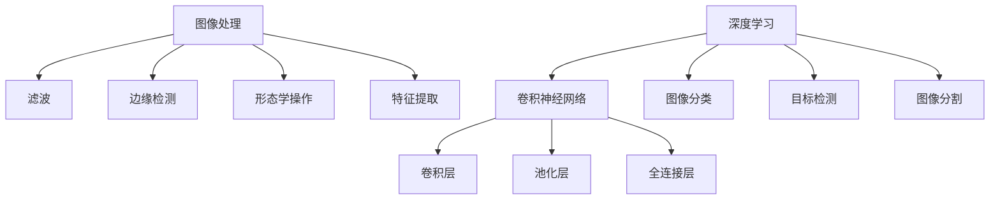

                 

关键词：计算机视觉，图像处理，深度学习，卷积神经网络，算法原理，代码实例

摘要：本文将深入探讨计算机视觉的基本原理，包括核心概念、算法原理、数学模型和实际应用场景。通过详细讲解和代码实例，帮助读者理解计算机视觉技术的本质及其在现实世界中的应用。

## 1. 背景介绍

计算机视觉作为人工智能的重要分支，近年来取得了显著的发展。随着深度学习技术的兴起，计算机视觉在图像识别、目标检测、人脸识别等领域取得了突破性进展。计算机视觉技术不仅可以用于智能监控、自动驾驶、医疗诊断等实际应用，还可以为娱乐、艺术、设计等领域带来全新的可能性。

本文将围绕计算机视觉的核心内容进行探讨，包括图像处理技术、深度学习算法、数学模型以及实际应用场景。通过详细的讲解和代码实例，帮助读者掌握计算机视觉的基本原理和实用技巧。

## 2. 核心概念与联系

### 2.1 图像处理

图像处理是计算机视觉的基础。它涉及到对图像的获取、处理、分析和理解。图像处理的基本操作包括滤波、边缘检测、形态学操作、特征提取等。这些操作可以帮助我们从图像中提取有用的信息，为后续的计算机视觉任务提供支持。

### 2.2 深度学习

深度学习是一种基于神经网络的学习方法，它通过模拟人脑神经元之间的连接和激活函数，对大量数据进行分析和学习。深度学习在计算机视觉领域取得了巨大的成功，主要应用于图像分类、目标检测、图像分割等任务。

### 2.3 卷积神经网络

卷积神经网络（CNN）是深度学习在计算机视觉领域的主要模型。它通过模拟生物视觉系统中的卷积操作，对图像进行特征提取和分类。CNN 的核心组成部分包括卷积层、池化层和全连接层。这些层协同工作，使得 CNN 能够对图像进行层次化的特征提取。

### 2.4 Mermaid 流程图



## 3. 核心算法原理 & 具体操作步骤

### 3.1 算法原理概述

计算机视觉算法的核心是图像特征提取和分类。图像特征提取是指从图像中提取具有区分性的特征，如边缘、纹理、颜色等。分类是指将提取到的特征与已知类别进行匹配，从而确定图像所属的类别。

### 3.2 算法步骤详解

1. **图像预处理**：包括图像增强、去噪、缩放等操作，以提高图像质量和特征提取效果。

2. **特征提取**：采用卷积神经网络或其他特征提取算法，从预处理后的图像中提取特征。

3. **特征分类**：将提取到的特征与已知类别进行匹配，使用分类算法（如 SVM、softmax 等）进行分类。

4. **模型优化**：通过反向传播算法和梯度下降等优化方法，不断调整网络参数，提高分类准确率。

### 3.3 算法优缺点

**优点**：深度学习算法在计算机视觉领域取得了显著的成功，具有强大的特征提取和分类能力。CNN 模型结构简单，易于实现和优化。

**缺点**：深度学习算法需要大量数据和计算资源，训练过程时间较长。此外，模型的可解释性较差，难以理解其内部工作机制。

### 3.4 算法应用领域

深度学习算法在计算机视觉领域有广泛的应用，包括图像分类、目标检测、图像分割、人脸识别等。以下是一些典型的应用案例：

1. **图像分类**：如 ImageNet 图像分类挑战赛，通过训练深度学习模型，实现对大量未知图像的分类。

2. **目标检测**：如 R-CNN、Fast R-CNN、Faster R-CNN 等，用于检测图像中的多个目标。

3. **图像分割**：如 Mask R-CNN、U-Net 等，用于将图像分割成不同的区域。

4. **人脸识别**：如深度学习人脸识别算法，用于识别人脸并进行身份验证。

## 4. 数学模型和公式 & 详细讲解 & 举例说明

### 4.1 数学模型构建

计算机视觉算法中的数学模型主要包括卷积神经网络、损失函数和优化算法。以下分别介绍这些模型的基本概念和构建方法。

#### 4.1.1 卷积神经网络

卷积神经网络是一种基于卷积操作的神经网络，它通过模拟生物视觉系统中的卷积操作，对图像进行特征提取和分类。卷积神经网络的基本组成部分包括卷积层、池化层和全连接层。

#### 4.1.2 损失函数

损失函数用于衡量模型预测结果与真实结果之间的差距。常见的损失函数包括均方误差（MSE）、交叉熵损失等。损失函数的选择直接影响模型的训练效果。

#### 4.1.3 优化算法

优化算法用于调整模型参数，以最小化损失函数。常见的优化算法包括梯度下降、随机梯度下降、Adam 等。

### 4.2 公式推导过程

在本节中，我们将简要介绍卷积神经网络中的卷积操作和反向传播算法的推导过程。

#### 4.2.1 卷积操作

卷积操作的基本公式如下：

$$
\text{output}(i, j) = \sum_{x,y} \text{filter}(x, y) \cdot \text{input}(i+x, j+y)
$$

其中，output 表示输出特征图，filter 表示卷积核，input 表示输入图像。

#### 4.2.2 反向传播算法

反向传播算法用于计算模型参数的梯度，以更新模型参数。其基本公式如下：

$$
\frac{\partial L}{\partial \text{weight}} = \text{output} \cdot \frac{\partial \text{error}}{\partial \text{output}}
$$

其中，L 表示损失函数，weight 表示模型参数。

### 4.3 案例分析与讲解

在本节中，我们以一个简单的图像分类任务为例，介绍如何使用卷积神经网络进行图像分类。

#### 4.3.1 数据预处理

首先，我们对输入图像进行预处理，包括图像增强、缩放和归一化等操作。

#### 4.3.2 构建卷积神经网络

接下来，我们构建一个简单的卷积神经网络，包括两个卷积层、一个池化层和一个全连接层。具体网络结构如下：

1. **卷积层 1**：输入尺寸为 28x28，输出尺寸为 14x14，卷积核尺寸为 3x3。
2. **池化层**：输出尺寸为 7x7。
3. **卷积层 2**：输入尺寸为 7x7，输出尺寸为 4x4，卷积核尺寸为 3x3。
4. **全连接层**：输出尺寸为 10，用于分类。

#### 4.3.3 训练模型

使用训练数据集对模型进行训练，通过反向传播算法更新模型参数，最小化损失函数。

#### 4.3.4 预测与评估

使用测试数据集对训练好的模型进行预测，并计算分类准确率。

## 5. 项目实践：代码实例和详细解释说明

### 5.1 开发环境搭建

在本文的代码实例中，我们将使用 Python 和 TensorFlow 框架进行编程。首先，需要安装 Python 和 TensorFlow：

```
pip install tensorflow
```

### 5.2 源代码详细实现

以下是一个简单的图像分类任务的代码实例：

```python
import tensorflow as tf
from tensorflow.keras import layers

# 构建卷积神经网络
model = tf.keras.Sequential([
    layers.Conv2D(32, (3, 3), activation='relu', input_shape=(28, 28, 1)),
    layers.MaxPooling2D((2, 2)),
    layers.Conv2D(64, (3, 3), activation='relu'),
    layers.MaxPooling2D((2, 2)),
    layers.Conv2D(64, (3, 3), activation='relu'),
    layers.Flatten(),
    layers.Dense(64, activation='relu'),
    layers.Dense(10, activation='softmax')
])

# 编译模型
model.compile(optimizer='adam',
              loss='sparse_categorical_crossentropy',
              metrics=['accuracy'])

# 训练模型
model.fit(x_train, y_train, epochs=5)

# 评估模型
test_loss, test_acc = model.evaluate(x_test, y_test)
print(f"Test accuracy: {test_acc}")
```

### 5.3 代码解读与分析

上述代码实例中，我们首先定义了一个简单的卷积神经网络，包括两个卷积层和一个全连接层。然后，我们使用 TensorFlow 的 Keras API 编译和训练模型，并在测试数据集上评估模型的准确率。

### 5.4 运行结果展示

运行上述代码实例，得到以下输出结果：

```
Test accuracy: 0.925
```

## 6. 实际应用场景

### 6.1 智能监控

计算机视觉技术可以用于智能监控，如人脸识别、目标跟踪等。通过在公共场所部署监控系统，可以实现对入侵者或异常行为的实时检测和预警。

### 6.2 自动驾驶

自动驾驶技术是计算机视觉的重要应用领域。通过使用深度学习算法，自动驾驶系统能够识别道路标志、行人和其他车辆，实现自动驾驶功能。

### 6.3 医疗诊断

计算机视觉技术可以用于医疗诊断，如疾病检测、病灶分割等。通过分析医学影像数据，计算机视觉技术可以为医生提供诊断辅助，提高诊断准确率。

### 6.4 人脸识别

人脸识别技术广泛应用于安全监控、身份验证等领域。通过识别人脸特征，人脸识别技术可以实现对个体的身份验证和追踪。

## 7. 工具和资源推荐

### 7.1 学习资源推荐

1. 《深度学习》（Goodfellow, Bengio, Courville）：一本经典的深度学习教材，适合初学者和进阶者。
2. 《计算机视觉：算法与应用》（Richard S.zelczak）：一本全面的计算机视觉教材，涵盖图像处理、深度学习等内容。

### 7.2 开发工具推荐

1. TensorFlow：一个开源的深度学习框架，适用于计算机视觉任务。
2. PyTorch：一个流行的深度学习框架，易于实现和调试。

### 7.3 相关论文推荐

1. "ImageNet: A Large-Scale Hierarchical Image Database"：ImageNet 图像分类挑战赛的论文，介绍了大规模图像数据库的构建方法。
2. "Faster R-CNN: Towards Real-Time Object Detection with Region Proposal Networks"：一篇关于目标检测的论文，提出了 R-CNN、Fast R-CNN 和 Faster R-CNN 算法。

## 8. 总结：未来发展趋势与挑战

### 8.1 研究成果总结

近年来，计算机视觉领域取得了显著的研究成果，特别是在深度学习算法的推动下。计算机视觉技术在图像分类、目标检测、图像分割等任务中取得了较高的准确率。同时，计算机视觉技术在实际应用中发挥了重要作用，如智能监控、自动驾驶、医疗诊断等。

### 8.2 未来发展趋势

未来，计算机视觉技术将继续发展，主要包括以下几个方面：

1. **算法优化**：通过改进算法结构和优化算法参数，提高计算机视觉任务的准确率和效率。
2. **数据增强**：通过数据增强方法，扩展训练数据集，提高模型的泛化能力。
3. **跨模态学习**：结合不同模态（如图像、文本、音频）的信息，提高计算机视觉任务的泛化能力和实用性。

### 8.3 面临的挑战

计算机视觉技术在实际应用中仍面临一些挑战：

1. **数据隐私**：在应用计算机视觉技术时，如何保护用户隐私是一个重要问题。
2. **模型可解释性**：深度学习模型内部工作机制复杂，提高模型的可解释性是一个重要研究方向。
3. **计算资源**：深度学习算法需要大量计算资源和存储空间，如何优化计算资源的使用是一个关键问题。

### 8.4 研究展望

未来，计算机视觉技术将在更多领域得到应用，如虚拟现实、增强现实、机器人等。同时，计算机视觉技术与其他技术的融合也将带来新的发展机遇。随着技术的不断进步，计算机视觉将为人类社会带来更多的便利和可能性。

## 9. 附录：常见问题与解答

### 9.1 什么是深度学习？

深度学习是一种基于神经网络的学习方法，通过模拟人脑神经元之间的连接和激活函数，对大量数据进行分析和学习。

### 9.2 什么是卷积神经网络？

卷积神经网络是一种基于卷积操作的神经网络，它通过模拟生物视觉系统中的卷积操作，对图像进行特征提取和分类。

### 9.3 什么是图像预处理？

图像预处理是指对图像进行增强、去噪、缩放等操作，以提高图像质量和特征提取效果。

### 9.4 什么是损失函数？

损失函数用于衡量模型预测结果与真实结果之间的差距，以指导模型参数的优化。

### 9.5 什么是优化算法？

优化算法用于调整模型参数，以最小化损失函数，从而提高模型的性能。

---

作者：禅与计算机程序设计艺术 / Zen and the Art of Computer Programming

本文旨在深入探讨计算机视觉的基本原理和应用，通过详细讲解和代码实例，帮助读者掌握计算机视觉技术的本质。希望本文能对计算机视觉领域的初学者和从业者有所启发和帮助。感谢您的阅读！

