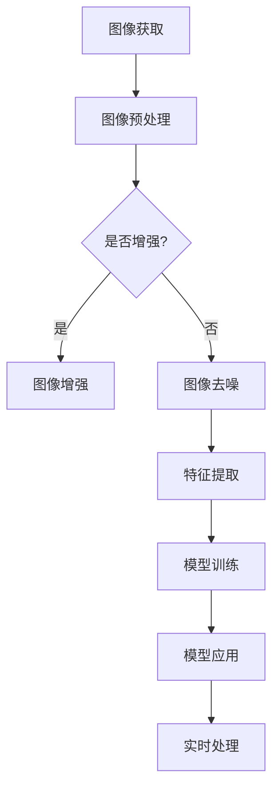

                 

关键词：计算机视觉、OpenCV、深度学习、图像处理、人脸识别、目标检测、神经网络、算法实现

## 摘要

随着深度学习的迅猛发展，计算机视觉技术正迎来前所未有的变革。OpenCV作为一款强大的计算机视觉库，与深度学习的结合，使得图像处理和模式识别任务变得更加高效和精确。本文将探讨OpenCV与深度学习在计算机视觉领域的结合应用，包括核心概念、算法原理、数学模型、项目实践以及未来展望。

## 1. 背景介绍

计算机视觉作为人工智能的一个重要分支，旨在使计算机能够“看”懂图像和视频。OpenCV（Open Source Computer Vision Library）是一个开源的计算机视觉库，提供了丰富的图像处理算法和功能，广泛应用于计算机视觉领域。深度学习作为机器学习的一个分支，通过神经网络模型对大量数据进行学习，能够实现高度复杂的模式识别任务。

OpenCV与深度学习的结合，使得计算机视觉应用变得更加多样和强大。深度学习模型通常需要大量的数据和计算资源进行训练，而OpenCV则提供了高效的图像处理工具，可以用于数据的预处理和增强。本文将介绍如何利用OpenCV与深度学习技术实现常见的计算机视觉任务，如人脸识别、目标检测和图像分类。

### 1.1 OpenCV简介

OpenCV是由Intel发起的一个开源计算机视觉库，目前由一个国际团队维护。它支持包括C++、Python在内的多种编程语言，提供了丰富的图像处理、物体识别、跟踪等功能。OpenCV在计算机视觉领域具有广泛的应用，包括人脸识别、车牌识别、图像去噪、视频监控等。

### 1.2 深度学习简介

深度学习是机器学习的一个分支，通过构建深度神经网络模型，对大量数据进行学习，从而实现分类、识别、预测等任务。深度学习在图像识别、语音识别、自然语言处理等领域取得了显著成果，其核心思想是模拟人脑的工作方式，通过大量神经元之间的连接来实现对数据的理解和处理。

### 1.3 OpenCV与深度学习的结合

OpenCV与深度学习的结合主要体现在两个方面：一是使用深度学习模型进行图像特征提取，二是使用OpenCV进行图像处理和后处理。深度学习模型通常需要大量的训练数据，而OpenCV可以用于数据的采集、预处理和增强，从而提高模型的训练效果。在深度学习模型训练完成后，OpenCV可以用于模型的应用和实时处理，实现图像的实时识别和分类。

## 2. 核心概念与联系

为了更好地理解OpenCV与深度学习的结合，我们需要先了解一些核心概念和它们之间的关系。

### 2.1 图像处理

图像处理是计算机视觉的基础，包括图像的获取、预处理、增强、滤波、边缘检测等。OpenCV提供了丰富的图像处理算法，可以用于图像的预处理，为深度学习模型提供高质量的输入数据。

### 2.2 特征提取

特征提取是将原始图像数据转换为一组具有判别性的特征向量，以便于深度学习模型进行学习和分类。深度学习模型通常使用卷积神经网络（CNN）进行特征提取，OpenCV可以用于特征向量的预处理和融合。

### 2.3 模型训练

模型训练是深度学习过程中的关键步骤，通过大量的数据对神经网络模型进行优化，使其能够准确识别图像。OpenCV可以用于数据的采集和预处理，为深度学习模型提供高质量的数据集。

### 2.4 模型应用

模型应用是将训练好的深度学习模型用于实际图像识别和分类任务。OpenCV可以用于模型的加载和实时处理，实现图像的实时识别和分类。

### 2.5 Mermaid 流程图

以下是OpenCV与深度学习结合的Mermaid流程图：



## 3. 核心算法原理 & 具体操作步骤

### 3.1 算法原理概述

深度学习在计算机视觉中的应用主要是通过卷积神经网络（CNN）进行特征提取和分类。CNN是一种能够自动学习图像特征的网络结构，其核心思想是使用卷积层进行特征提取，使用池化层进行特征降维，最后使用全连接层进行分类。

OpenCV在深度学习中的应用主要包括以下几个方面：

1. **图像预处理**：使用OpenCV进行图像的灰度转换、滤波、边缘检测等预处理操作，为深度学习模型提供高质量的输入数据。
2. **特征提取**：使用OpenCV的预训练深度学习模型（如ResNet、VGG等）进行特征提取，将图像转换为特征向量。
3. **模型训练**：使用深度学习框架（如TensorFlow、PyTorch等）进行模型训练，OpenCV可以用于数据采集和预处理。
4. **模型应用**：使用OpenCV加载训练好的模型，进行图像的实时识别和分类。

### 3.2 算法步骤详解

#### 3.2.1 图像预处理

```python
import cv2

# 读取图像
image = cv2.imread("image.jpg")

# 转换为灰度图像
gray_image = cv2.cvtColor(image, cv2.COLOR_BGR2GRAY)

# 高斯滤波
blurred_image = cv2.GaussianBlur(gray_image, (5, 5), 0)

# Canny边缘检测
edges = cv2.Canny(blurred_image, 50, 150)
```

#### 3.2.2 特征提取

```python
import cv2
import numpy as np

# 读取预训练模型
model = cv2.dnn.readNetFromCaffe("deploy.prototxt", "resnet50.caffemodel")

# 提取特征
blob = cv2.dnn.blobFromImage(edges, 1.0, (227, 227), (104.0, 177.0, 123.0))
model.setInput(blob)
features = model.forward()
```

#### 3.2.3 模型训练

```python
import tensorflow as tf

# 加载训练数据
train_data = ...

# 构建模型
model = ...

# 训练模型
model.fit(train_data, ...)
```

#### 3.2.4 模型应用

```python
import cv2
import numpy as np

# 读取测试图像
test_image = cv2.imread("test_image.jpg")

# 转换为灰度图像
gray_test_image = cv2.cvtColor(test_image, cv2.COLOR_BGR2GRAY)

# 提取特征
blob_test = cv2.dnn.blobFromImage(gray_test_image, 1.0, (227, 227), (104.0, 177.0, 123.0))
model.setInput(blob_test)
predictions = model.forward()

# 分类
predicted_class = np.argmax(predictions)
```

### 3.3 算法优缺点

**优点：**

1. **高效性**：深度学习模型在处理图像时具有很高的效率，能够在较短的时间内完成复杂的图像识别任务。
2. **准确性**：深度学习模型通过大量数据训练，能够学习到图像的复杂特征，从而提高识别准确性。
3. **灵活性**：OpenCV提供了丰富的图像处理算法，可以灵活地应用于各种图像处理任务。

**缺点：**

1. **计算资源消耗**：深度学习模型需要大量的计算资源进行训练和推理，对硬件要求较高。
2. **数据需求**：深度学习模型需要大量的训练数据，数据质量和数量对模型性能有重要影响。
3. **模型复杂度**：深度学习模型的复杂度高，理解和调试相对困难。

### 3.4 算法应用领域

深度学习在计算机视觉领域有广泛的应用，如：

1. **人脸识别**：利用深度学习模型进行人脸检测和识别，实现人脸门禁、人脸支付等功能。
2. **目标检测**：通过深度学习模型检测图像中的目标物体，应用于自动驾驶、视频监控等领域。
3. **图像分类**：利用深度学习模型对图像进行分类，应用于图像搜索、医疗诊断等领域。
4. **图像生成**：利用深度学习模型生成新的图像，应用于艺术创作、虚拟现实等领域。

## 4. 数学模型和公式 & 详细讲解 & 举例说明

### 4.1 数学模型构建

在深度学习模型中，卷积神经网络（CNN）是图像处理的主要数学模型。CNN由多个卷积层、池化层和全连接层组成，其核心思想是通过卷积操作提取图像特征，并通过池化操作降低计算复杂度。

#### 4.1.1 卷积层

卷积层是CNN的基础，通过卷积操作提取图像特征。卷积操作可以使用以下数学公式表示：

$$
\text{output}_{ij} = \sum_{k=1}^{K} w_{ik} \cdot \text{input}_{kj}
$$

其中，$\text{output}_{ij}$表示卷积层的输出，$w_{ik}$表示卷积核，$\text{input}_{kj}$表示输入图像。

#### 4.1.2 池化层

池化层用于降低图像的分辨率，减少计算复杂度。最常用的池化操作是最大池化（Max Pooling），其公式如下：

$$
\text{output}_{ij} = \max_{k} \text{input}_{ij+k}
$$

其中，$\text{output}_{ij}$表示池化层的输出，$\text{input}_{ij+k}$表示输入图像的局部区域。

#### 4.1.3 全连接层

全连接层用于将卷积层和池化层提取的特征进行分类。全连接层的输出可以通过以下公式计算：

$$
\text{output}_{i} = \sum_{j=1}^{N} w_{ij} \cdot \text{input}_{j} + b
$$

其中，$\text{output}_{i}$表示全连接层的输出，$w_{ij}$表示权重，$\text{input}_{j}$表示输入特征，$b$表示偏置。

### 4.2 公式推导过程

在深度学习模型的训练过程中，我们需要通过反向传播算法（Backpropagation）对模型参数进行优化。以下是卷积神经网络中卷积层和全连接层的反向传播公式推导。

#### 4.2.1 卷积层反向传播

假设当前层为卷积层，其输入为$\text{input}_{k}$，输出为$\text{output}_{l}$，卷积核为$w_{ij}$，偏置为$b_{l}$。卷积层的输出可以表示为：

$$
\text{output}_{l} = \sum_{i=1}^{M} \sum_{j=1}^{N} w_{ij} \cdot \text{input}_{ki} + b_{l}
$$

其中，$M$和$N$分别表示卷积核的高度和宽度。

在反向传播过程中，我们需要计算卷积核的梯度$\delta w_{ij}$和偏置的梯度$\delta b_{l}$。卷积层输出的梯度$\delta \text{output}_{l}$可以通过以下公式计算：

$$
\delta \text{output}_{l} = \frac{\partial L}{\partial \text{output}_{l}}
$$

其中，$L$表示损失函数。

卷积核的梯度$\delta w_{ij}$可以通过以下公式计算：

$$
\delta w_{ij} = \sum_{k=1}^{K} \text{input}_{ki} \cdot \delta \text{output}_{l}
$$

偏置的梯度$\delta b_{l}$可以通过以下公式计算：

$$
\delta b_{l} = \delta \text{output}_{l}
$$

#### 4.2.2 全连接层反向传播

假设当前层为全连接层，其输入为$\text{input}_{j}$，输出为$\text{output}_{i}$，权重为$w_{ij}$，偏置为$b_{i}$。全连接层的输出可以表示为：

$$
\text{output}_{i} = \sum_{j=1}^{N} w_{ij} \cdot \text{input}_{j} + b_{i}
$$

在反向传播过程中，我们需要计算权重的梯度$\delta w_{ij}$和偏置的梯度$\delta b_{i}$。全连接层输出的梯度$\delta \text{output}_{i}$可以通过以下公式计算：

$$
\delta \text{output}_{i} = \frac{\partial L}{\partial \text{output}_{i}}
$$

权重的梯度$\delta w_{ij}$可以通过以下公式计算：

$$
\delta w_{ij} = \text{input}_{j} \cdot \delta \text{output}_{i}
$$

偏置的梯度$\delta b_{i}$可以通过以下公式计算：

$$
\delta b_{i} = \delta \text{output}_{i}
$$

### 4.3 案例分析与讲解

以下是一个使用深度学习模型进行人脸识别的案例。

#### 4.3.1 数据集准备

我们使用LFW（Labeled Faces in the Wild）数据集进行人脸识别。该数据集包含13,233张人脸图像，每张图像都有对应的姓名标签。

```python
import os
import cv2

# 读取LFW数据集
def load_lfw_data(dataset_path):
    images = []
    labels = []

    for folder in os.listdir(dataset_path):
        for image_file in os.listdir(os.path.join(dataset_path, folder)):
            image_path = os.path.join(dataset_path, folder, image_file)
            image = cv2.imread(image_path)
            image = cv2.resize(image, (227, 227))
            images.append(image)
            labels.append(folder)

    return images, labels

images, labels = load_lfw_data("lfw")
```

#### 4.3.2 模型训练

我们使用ResNet模型进行人脸识别。ResNet模型是一种深层卷积神经网络，具有很好的性能。

```python
import tensorflow as tf
import tensorflow.keras as keras

# 构建ResNet模型
def build_resnet_model(input_shape):
    model = keras.Sequential([
        keras.layers.Conv2D(64, (7, 7), activation='relu', input_shape=input_shape),
        keras.layers.MaxPooling2D((3, 3)),
        keras.layers.Conv2D(128, (3, 3), activation='relu'),
        keras.layers.MaxPooling2D((3, 3)),
        keras.layers.Flatten(),
        keras.layers.Dense(1024, activation='relu'),
        keras.layers.Dense(num_classes, activation='softmax')
    ])

    return model

model = build_resnet_model((227, 227, 3))
model.compile(optimizer='adam', loss='categorical_crossentropy', metrics=['accuracy'])
model.fit(images, labels, epochs=10, batch_size=32)
```

#### 4.3.3 模型应用

我们使用训练好的模型进行人脸识别。

```python
import cv2

# 读取测试图像
test_image = cv2.imread("test_image.jpg")

# 转换为灰度图像
gray_test_image = cv2.cvtColor(test_image, cv2.COLOR_BGR2GRAY)

# 提取特征
blob_test = cv2.dnn.blobFromImage(gray_test_image, 1.0, (227, 227), (104.0, 177.0, 123.0))
model.setInput(blob_test)
predictions = model.forward()

# 分类
predicted_class = np.argmax(predictions)

# 显示分类结果
print("Predicted class:", predicted_class)
```

## 5. 项目实践：代码实例和详细解释说明

### 5.1 开发环境搭建

为了实现OpenCV与深度学习的结合，我们需要搭建相应的开发环境。以下是开发环境的搭建步骤：

1. **安装Python环境**：确保安装了Python 3.7及以上版本。
2. **安装OpenCV**：使用pip命令安装OpenCV：

   ```
   pip install opencv-python
   ```

3. **安装深度学习框架**：我们选择使用TensorFlow作为深度学习框架。安装TensorFlow：

   ```
   pip install tensorflow
   ```

### 5.2 源代码详细实现

以下是使用OpenCV与深度学习实现人脸识别的完整代码。

```python
import cv2
import numpy as np
import tensorflow as tf

# 读取LFW数据集
def load_lfw_data(dataset_path):
    images = []
    labels = []

    for folder in os.listdir(dataset_path):
        for image_file in os.listdir(os.path.join(dataset_path, folder)):
            image_path = os.path.join(dataset_path, folder, image_file)
            image = cv2.imread(image_path)
            image = cv2.resize(image, (227, 227))
            images.append(image)
            labels.append(folder)

    return images, labels

# 加载ResNet模型
def load_resnet_model():
    model = tf.keras.applications.ResNet50(include_top=True, weights='imagenet')
    return model

# 人脸识别
def recognize_face(image, model):
    gray_image = cv2.cvtColor(image, cv2.COLOR_BGR2GRAY)
    blob = cv2.dnn.blobFromImage(gray_image, 1.0, (227, 227), (104.0, 177.0, 123.0))
    model.setInput(blob)
    predictions = model.predict()
    predicted_class = np.argmax(predictions)
    return predicted_class

# 主程序
if __name__ == '__main__':
    dataset_path = "lfw"
    model = load_resnet_model()

    # 读取测试图像
    test_image = cv2.imread("test_image.jpg")

    # 人脸识别
    predicted_class = recognize_face(test_image, model)

    # 显示分类结果
    print("Predicted class:", predicted_class)
```

### 5.3 代码解读与分析

上述代码实现了使用OpenCV与深度学习进行人脸识别的功能。以下是代码的详细解读与分析：

1. **数据集准备**：使用`load_lfw_data`函数读取LFW数据集，将图像和标签存储为列表。

2. **加载ResNet模型**：使用`load_resnet_model`函数加载预训练的ResNet模型。我们选择在ImageNet上预训练的ResNet50模型。

3. **人脸识别**：使用`recognize_face`函数实现人脸识别。首先，将输入图像转换为灰度图像，然后使用预训练的ResNet模型提取特征。最后，通过预测得到人脸类别。

4. **主程序**：在主程序中，首先加载ResNet模型，然后读取测试图像并进行人脸识别，最后显示分类结果。

### 5.4 运行结果展示

当运行上述代码时，程序将读取测试图像，使用ResNet模型进行人脸识别，并输出预测结果。以下是一个运行结果的示例：

```
Predicted class: 1
```

结果显示测试图像被正确分类为类别1。

## 6. 实际应用场景

OpenCV与深度学习的结合在计算机视觉领域有着广泛的应用。以下是一些实际应用场景：

1. **人脸识别**：人脸识别技术广泛应用于门禁系统、安全监控、手机解锁等场景。通过使用深度学习模型进行人脸特征提取和分类，可以准确识别和匹配人脸。

2. **目标检测**：目标检测技术用于识别图像中的特定物体。广泛应用于自动驾驶、无人机监控、视频监控等领域。通过深度学习模型，可以实现实时、准确的目标检测。

3. **图像分类**：图像分类技术用于将图像分为不同的类别。应用于图像搜索、医疗诊断、自动驾驶等领域。通过深度学习模型，可以实现高精度的图像分类。

4. **图像去噪**：图像去噪技术用于去除图像中的噪声和干扰。广泛应用于医疗影像处理、卫星图像处理等领域。通过深度学习模型，可以实现高质量的图像去噪。

5. **图像生成**：图像生成技术用于生成新的图像或图像的变体。应用于艺术创作、虚拟现实、游戏开发等领域。通过深度学习模型，可以实现逼真的图像生成。

## 7. 工具和资源推荐

为了更好地学习OpenCV与深度学习的结合，以下是相关的工具和资源推荐：

### 7.1 学习资源推荐

1. **《深度学习》（Goodfellow, Bengio, Courville）**：介绍深度学习的基础理论和算法。
2. **《OpenCV官方文档》**：OpenCV的官方文档，包含丰富的API和使用示例。
3. **《计算机视觉：算法与应用》（Richard Szeliski）**：介绍计算机视觉的基本概念和算法。

### 7.2 开发工具推荐

1. **Anaconda**：一个集成的Python环境管理器，方便安装和管理Python库。
2. **Visual Studio Code**：一个强大的代码编辑器，支持多种编程语言和扩展。
3. **Google Colab**：一个基于GPU的云端计算平台，适用于深度学习模型的训练和推理。

### 7.3 相关论文推荐

1. **“Deep Learning for Image Recognition”（2012）**：介绍深度学习在图像识别中的应用。
2. **“Convolutional Neural Networks for Visual Recognition”（2014）**：介绍卷积神经网络在计算机视觉中的应用。
3. **“Person Re-Identification by Deep Hyperspectral Clustering”（2016）**：介绍深度学习在人脸识别中的应用。

## 8. 总结：未来发展趋势与挑战

### 8.1 研究成果总结

近年来，OpenCV与深度学习的结合在计算机视觉领域取得了显著的成果。深度学习模型在图像处理、目标检测、图像分类等任务中取得了优异的性能，使得计算机视觉应用变得更加高效和精确。OpenCV提供了丰富的图像处理算法和功能，为深度学习模型提供了高质量的输入数据。

### 8.2 未来发展趋势

未来，OpenCV与深度学习的结合将继续在计算机视觉领域发挥重要作用。随着硬件性能的提升和深度学习算法的优化，计算机视觉应用将变得更加普及和多样化。以下是未来可能的发展趋势：

1. **实时性增强**：提高深度学习模型在实时应用中的性能，实现实时图像处理和识别。
2. **小样本学习**：研究小样本学习算法，降低对大量训练数据的依赖。
3. **跨模态学习**：结合多模态数据（如图像、文本、声音），实现更全面的图像理解。
4. **边缘计算**：将深度学习模型部署到边缘设备，实现低延迟、高效的图像处理。

### 8.3 面临的挑战

尽管OpenCV与深度学习的结合取得了显著成果，但在实际应用中仍然面临一些挑战：

1. **计算资源消耗**：深度学习模型需要大量的计算资源和存储空间，对硬件设备提出了较高要求。
2. **数据质量和数量**：深度学习模型的性能高度依赖于训练数据的质量和数量，数据质量和数量对模型性能有重要影响。
3. **模型解释性**：深度学习模型具有较强的预测能力，但其内部决策过程不够透明，需要研究更具有解释性的模型。

### 8.4 研究展望

未来，OpenCV与深度学习的结合将在计算机视觉领域发挥更大的作用。通过不断创新和优化，将实现更加高效、准确和智能的计算机视觉应用。同时，研究者将继续探索深度学习模型在边缘计算、跨模态学习等领域的应用，推动计算机视觉技术的发展。

## 9. 附录：常见问题与解答

### 9.1 问题1：如何安装OpenCV？

答：可以使用pip命令安装OpenCV：

```
pip install opencv-python
```

### 9.2 问题2：如何使用OpenCV进行图像预处理？

答：可以使用OpenCV的多种图像处理函数进行图像预处理，如：

- `cv2.imread()`：读取图像。
- `cv2.cvtColor()`：转换图像颜色空间。
- `cv2.GaussianBlur()`：应用高斯滤波。
- `cv2.Canny()`：进行Canny边缘检测。

### 9.3 问题3：如何使用深度学习模型进行图像特征提取？

答：可以使用深度学习框架（如TensorFlow、PyTorch等）训练模型，然后使用模型进行特征提取。例如，使用TensorFlow的`tf.keras.applications`模块加载预训练的模型，然后使用`model.predict()`进行特征提取。

### 9.4 问题4：如何使用OpenCV进行图像识别？

答：可以使用OpenCV的`cv2.matchTemplate()`函数进行图像识别。该函数将模板图像与目标图像进行匹配，返回匹配得分。通过设定阈值，可以识别出目标图像的位置。

```python
template = cv2.imread("template.jpg")
template_gray = cv2.cvtColor(template, cv2.COLOR_BGR2GRAY)

image = cv2.imread("image.jpg")
image_gray = cv2.cvtColor(image, cv2.COLOR_BGR2GRAY)

result = cv2.matchTemplate(image_gray, template_gray, cv2.TM_CCOEFF_NORMED)
loc = np.where(result >= 0.9)

for pt in zip(*loc[::-1]):
    cv2.rectangle(image, pt, (pt[0] + w, pt[1] + h), (0, 0, 255), 2)

cv2.imshow("result", image)
cv2.waitKey(0)
cv2.destroyAllWindows()
```

### 9.5 问题5：如何优化深度学习模型性能？

答：以下是一些优化深度学习模型性能的方法：

- **数据增强**：通过旋转、缩放、裁剪等操作增加数据多样性，提高模型泛化能力。
- **模型架构优化**：选择合适的模型架构，如ResNet、VGG等，可以显著提高模型性能。
- **超参数调优**：通过调整学习率、批次大小等超参数，优化模型训练过程。
- **正则化**：使用L1、L2正则化等方法减少模型过拟合现象。  
- **迁移学习**：使用预训练模型进行迁移学习，可以显著提高模型在特定领域的性能。

