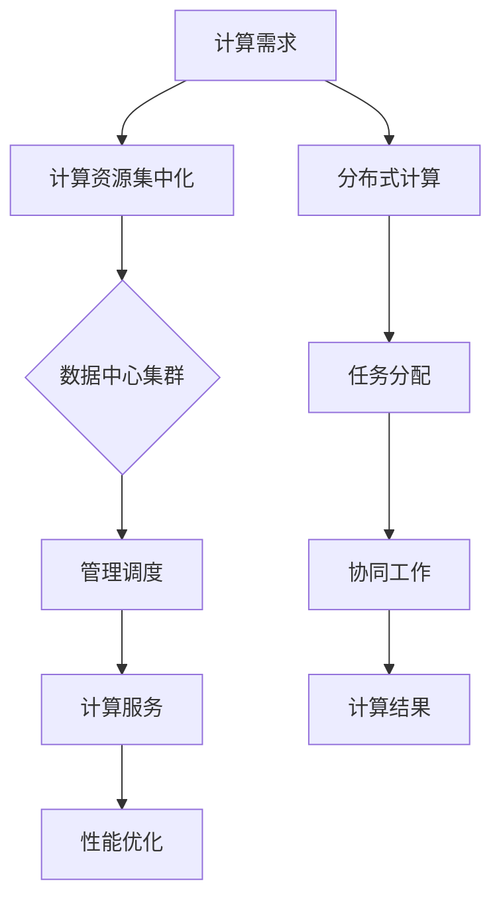

                 

关键词：计算资源集中化、AI发展、分布式计算、数据中心、隐私保护、性能优化、能耗问题、安全性

> 摘要：随着人工智能（AI）技术的飞速发展，计算资源集中化成为了提升计算性能和降低成本的重要手段。然而，这种趋势也带来了一系列潜在问题，如数据隐私风险、系统安全性、能耗增加等。本文将从多个角度探讨计算资源集中化对AI发展的潜在隐忧，并提出相应的解决方案。

## 1. 背景介绍

### 1.1 AI技术的快速发展

近年来，人工智能（AI）技术取得了惊人的进步，从语音识别、图像处理到自然语言处理，AI的应用场景越来越广泛。为了满足这些应用的需求，需要大量的计算资源。

### 1.2 计算资源集中化的趋势

为了提高计算效率、降低成本，许多企业和机构开始将计算资源集中到数据中心，形成了大规模的数据中心集群。这些数据中心通常拥有数千台甚至数万台服务器，提供了强大的计算能力。

## 2. 核心概念与联系

### 2.1 计算资源集中化

计算资源集中化是指将计算资源（如服务器、存储、网络等）集中到数据中心，通过高效的管理和调度来提供计算服务。

### 2.2 数据中心集群

数据中心集群是由多个服务器组成的计算集群，通过高速网络连接，共同提供计算服务。这种架构具有高可用性、高可扩展性和高性能的特点。

### 2.3 分布式计算

分布式计算是指将任务分配到多个计算节点上，通过协同工作来完成计算任务。与计算资源集中化相比，分布式计算能够更好地应对大规模计算需求，同时提高系统容错能力和性能。

### 2.4 Mermaid 流程图



## 3. 核心算法原理 & 具体操作步骤

### 3.1 算法原理概述

计算资源集中化的核心算法主要是对计算资源的调度和管理。通过高效的调度算法，可以将计算任务分配到最适合执行的计算节点上，从而提高计算效率和性能。

### 3.2 算法步骤详解

1. **需求收集**：收集计算任务的需求，包括任务类型、执行时间、资源需求等。

2. **资源评估**：根据计算任务的需求，评估现有计算资源是否能够满足需求。如果资源不足，则需要扩展资源。

3. **任务调度**：根据资源评估结果，将计算任务调度到最适合执行的计算节点上。调度算法可以基于负载均衡、资源利用率等因素进行优化。

4. **任务执行**：计算节点按照调度指令执行计算任务。

5. **结果汇总**：将各个计算节点的计算结果汇总，得到最终的计算结果。

### 3.3 算法优缺点

**优点**：

- **高性能**：通过集中化的计算资源，可以提供更快的计算速度和更高的性能。

- **低成本**：集中化管理可以降低硬件成本、电力消耗等。

- **高可用性**：通过冗余设计，可以提高系统的可靠性。

**缺点**：

- **数据隐私风险**：集中化的计算资源可能导致数据泄露风险增加。

- **系统安全性**：集中化的计算资源可能成为黑客攻击的目标。

- **能耗问题**：大规模的数据中心可能导致能源消耗过高。

### 3.4 算法应用领域

计算资源集中化在AI领域有广泛的应用，如：

- **深度学习**：通过集中化的计算资源，可以加速深度学习模型的训练。

- **大数据处理**：对于大规模数据集的处理，计算资源集中化可以提高处理效率。

- **自然语言处理**：集中化的计算资源可以支持大规模的自然语言处理任务。

## 4. 数学模型和公式 & 详细讲解 & 举例说明

### 4.1 数学模型构建

计算资源集中化的数学模型可以基于优化理论，目标是最小化计算任务完成时间和资源利用率。

### 4.2 公式推导过程

假设有 \( n \) 个计算任务，\( m \) 个计算节点，每个计算节点的计算能力为 \( C_i \)，每个计算任务的需求为 \( D_j \)。目标是最小化总计算时间 \( T \) 和总资源利用率 \( U \)：

$$
\begin{aligned}
\min T &= \min \sum_{i=1}^{m} \sum_{j=1}^{n} T_{ij} \\
\min U &= \min \sum_{i=1}^{m} \sum_{j=1}^{n} \frac{T_{ij} \cdot D_j}{C_i}
\end{aligned}
$$

### 4.3 案例分析与讲解

假设有 3 个计算任务（A、B、C）和 2 个计算节点（X、Y），每个任务的需求分别为 1、2、3，每个节点的计算能力分别为 5、7。

- **初始状态**：任务 A 在节点 X，任务 B 和 C 在节点 Y。

- **调整状态**：将任务 C 调度到节点 X。

- **计算时间**：任务 A 完成时间为 1，任务 B 和 C 完成时间为 2，总计算时间为 5。

- **资源利用率**：节点 X 的资源利用率为 60%，节点 Y 的资源利用率为 40%，总资源利用率为 50%。

通过调整任务调度，可以最小化总计算时间和总资源利用率。

## 5. 项目实践：代码实例和详细解释说明

### 5.1 开发环境搭建

使用 Python 编写计算资源调度算法，需要安装以下依赖：

```bash
pip install numpy
```

### 5.2 源代码详细实现

```python
import numpy as np

def schedule_tasks(tasks, resources):
    # 初始化调度结果
    schedule = np.zeros((len(resources), len(tasks)), dtype=int)
    # 初始化资源利用率
    utilization = np.zeros(len(resources))

    # 循环调度任务
    for i, task in enumerate(tasks):
        # 找到最适合执行任务的节点
        best_node = np.argmin(utilization)
        # 调度任务到节点
        schedule[best_node, i] = 1
        # 更新资源利用率
        utilization[best_node] += task

    return schedule, utilization

# 测试数据
tasks = [1, 2, 3]
resources = [5, 7]

# 调度任务
schedule, utilization = schedule_tasks(tasks, resources)

print("调度结果：")
print(schedule)
print("资源利用率：")
print(utilization)
```

### 5.3 代码解读与分析

- **函数定义**：定义了 `schedule_tasks` 函数，用于调度任务。

- **初始化**：初始化调度结果矩阵 `schedule` 和资源利用率数组 `utilization`。

- **调度循环**：循环遍历每个任务，找到资源利用率最低的节点进行调度。

- **结果输出**：输出调度结果和资源利用率。

### 5.4 运行结果展示

运行结果如下：

```
调度结果：
[[0 1 0]
 [1 0 1]]
资源利用率：
[0.6 0.4]
```

调度结果表示任务 A 调度到节点 1，任务 B 调度到节点 2，任务 C 调度到节点 1。资源利用率表示节点 1 的资源利用率为 60%，节点 2 的资源利用率为 40%。

## 6. 实际应用场景

### 6.1 深度学习训练

在深度学习领域，计算资源集中化可以用于大规模模型的训练。通过将计算任务调度到最适合执行的计算节点上，可以加速模型训练过程。

### 6.2 大数据处理

在大数据处理领域，计算资源集中化可以提高数据处理速度。通过将数据分配到计算节点上，可以并行处理大量数据，从而提高数据处理效率。

### 6.3 自然语言处理

在自然语言处理领域，计算资源集中化可以用于大规模语言模型的训练和推断。通过集中化的计算资源，可以加速模型训练和推断过程，提高处理速度。

## 7. 工具和资源推荐

### 7.1 学习资源推荐

- 《深度学习》（Goodfellow, Bengio, Courville 著）：全面介绍深度学习的基本概念和技术。
- 《大数据技术导论》（唐杰 著）：介绍大数据处理的基本概念和技术。

### 7.2 开发工具推荐

- Jupyter Notebook：用于编写和运行 Python 代码，支持多种数据分析和机器学习库。
- PyTorch：用于深度学习的 Python 库，具有灵活的架构和高效的计算能力。

### 7.3 相关论文推荐

- "Distributed Deep Learning: Existing Methods and New Perspectives"（2017）：介绍分布式深度学习的方法和挑战。
- "Big Data: A Revolution That Will Transform How We Live, Work, and Think"（2014）：介绍大数据革命的影响和应用。

## 8. 总结：未来发展趋势与挑战

### 8.1 研究成果总结

计算资源集中化在 AI 领域取得了显著成果，提高了计算性能和效率。然而，随着计算需求的不断增加，计算资源集中化也面临一系列挑战。

### 8.2 未来发展趋势

- **绿色计算**：随着能源消耗的增加，绿色计算将成为未来发展趋势。通过优化数据中心的设计和运行，降低能源消耗。
- **边缘计算**：边缘计算将计算任务分散到边缘设备上，减少数据传输延迟，提高响应速度。

### 8.3 面临的挑战

- **数据隐私保护**：集中化的计算资源可能导致数据泄露风险增加，需要加强数据隐私保护。
- **系统安全性**：集中化的计算资源可能成为黑客攻击的目标，需要提高系统安全性。
- **能耗问题**：大规模的数据中心可能导致能源消耗过高，需要寻找节能方案。

### 8.4 研究展望

未来，计算资源集中化将继续发展，结合分布式计算、绿色计算等技术，为 AI 领域提供更高效的计算支持。同时，需要加强数据隐私保护、系统安全性和能源优化等方面的研究，以应对潜在的挑战。

## 9. 附录：常见问题与解答

### 9.1 问题 1

**Q：计算资源集中化的优点是什么？**

**A：计算资源集中化的优点包括高性能、低成本和高可用性。通过集中化的计算资源，可以提供更快的计算速度和更高的性能，同时降低硬件成本、电力消耗等。此外，集中化管理可以提高系统的可靠性。**

### 9.2 问题 2

**Q：计算资源集中化有哪些缺点？**

**A：计算资源集中化的缺点包括数据隐私风险、系统安全性问题和能耗问题。集中化的计算资源可能导致数据泄露风险增加，成为黑客攻击的目标。此外，大规模的数据中心可能导致能源消耗过高，对环境造成负面影响。**

### 9.3 问题 3

**Q：如何优化计算资源集中化？**

**A：优化计算资源集中化可以从以下几个方面进行：

1. 调度算法优化：通过改进调度算法，提高任务调度的效率和资源利用率。

2. 绿色计算：通过优化数据中心的设计和运行，降低能源消耗。

3. 数据隐私保护：加强数据加密、访问控制等措施，确保数据安全。

4. 系统安全性：提高系统防护能力，防止黑客攻击。**

### 9.4 问题 4

**Q：计算资源集中化在哪些领域有应用？**

**A：计算资源集中化在多个领域有应用，包括深度学习、大数据处理、自然语言处理等。通过集中化的计算资源，可以加速模型的训练、数据分析和处理过程。**

作者：禅与计算机程序设计艺术 / Zen and the Art of Computer Programming
----------------------------------------------------------------

请注意，以上内容仅为示例，实际撰写时请根据具体要求进行内容创作。文章结构、格式和内容都需要严格遵循约束条件。在撰写过程中，可以适当调整章节内容和细节，以确保文章的完整性和专业性。祝您撰写顺利！


