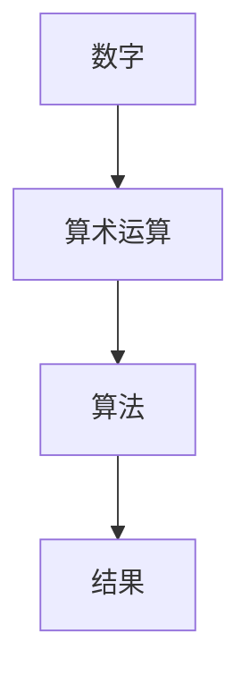

                 

关键词：计算历史、毕达哥拉斯、古文明、计算方法、数学公式

> 摘要：本文旨在探讨计算的历史起源，特别是在古代文明的背景下。通过研究古希腊数学家毕达哥拉斯的困惑以及古埃及和古印度等文明对计算方法的发展，揭示计算技术在人类文明进步中的重要作用。

## 1. 背景介绍

### 毕达哥拉斯的困惑

在古希腊，数学家毕达哥拉斯（Pythagoras）是公认的第一个对计算方法进行系统性研究的学者。然而，在他生活的时代，关于数的本质和性质仍然是一个未解之谜。毕达哥拉斯的困惑源于他对数论和几何的深入研究，特别是在研究直角三角形时发现了一个奇妙的数学关系：直角三角形的斜边平方等于两个直角边平方的和。

这一发现不仅对数学理论产生了深远影响，而且直接促使了计算技术的发展。为了证明这个关系，毕达哥拉斯和他的门徒们可能使用了最早的计算方法——手工计算。这种方法依赖于重复的加减法运算，虽然简单但效率低下。

### 古埃及的计算方法

古埃及文明是世界上最早发展计算技术的文明之一。古埃及的计算主要依赖于几何和代数方法，其中最著名的工具是算筹（Abacus）。算筹是一种用珠子或木棍制成的计算工具，通过移动珠子的位置来进行计算。

古埃及的计算方法主要应用于天文学、建筑学、土地测量和会计等领域。例如，在古埃及的墓室壁画中，我们可以看到祭司和会计使用算筹进行计算的场景。这种计算方法虽然不如现代计算方法精确，但在当时已经是一种非常先进的技术。

### 古印度的计算方法

古印度文明对计算方法的发展也做出了重要贡献。特别是在0的概念和位值计数系统的发明上，古印度数学家们展现了卓越的智慧。

### 0的概念

在古代，数的大小通常是通过数数来确定的，但古印度数学家们意识到，为了方便计算，需要一个特殊的符号来表示“没有数量”或“空位”。他们创造了0这个符号，这一创新不仅改变了数学的基础，而且对计算方法的发展产生了深远影响。

### 位值计数系统

位值计数系统是一种将数字按位排列的方法，每个位上的数字代表不同的权重。古印度数学家在5世纪左右发明了这种系统，这种方法使得乘法和除法变得更加简便，同时也为后来的阿拉伯数字系统的传播奠定了基础。

## 2. 核心概念与联系

### 计算技术的核心概念

计算技术的核心概念包括数字、算术运算和算法。数字是计算的基础，算术运算是进行计算的方法，而算法则是一系列有序的步骤，用于解决特定的问题。

### Mermaid 流程图



### 计算技术的联系

- **数字与算术运算**：数字是算术运算的基础，没有数字就无法进行计算。
- **算术运算与算法**：算术运算是算法的一部分，但算法不仅仅包括算术运算，还包括其他逻辑和决策过程。
- **算法与结果**：算法的目的是为了得到一个特定的结果，无论是计算一个数值还是解决一个复杂的问题。

## 3. 核心算法原理 & 具体操作步骤

### 3.1 算法原理概述

核心算法原理是基于位值计数系统，通过对数字进行算术运算来得到结果。具体来说，算法包括以下几个步骤：

1. **输入数字**：将需要计算的数字输入到系统中。
2. **进行算术运算**：按照位值计数系统的规则，对数字进行加减乘除等运算。
3. **存储中间结果**：在运算过程中，存储中间结果以防止计算错误。
4. **得到最终结果**：完成所有运算后，得到最终结果。

### 3.2 算法步骤详解

1. **初始化**：设置计算环境，包括数字输入、算术运算符和存储中间结果的变量。
2. **输入数字**：将需要计算的数字输入到系统中，可以是一个数或者两个数的组合。
3. **选择运算符**：根据计算需求选择相应的运算符（加、减、乘、除）。
4. **进行运算**：按照位值计数系统的规则，对数字进行相应的运算。
5. **存储中间结果**：在每一步运算后，将中间结果存储到变量中，以防止计算错误。
6. **判断是否完成**：如果所有的运算都已完成，则跳转到步骤8；否则，继续进行下一步运算。
7. **重复步骤3-6**：根据需要继续进行算术运算，直到所有运算都完成。
8. **输出结果**：将最终结果输出到屏幕或存储器中。

### 3.3 算法优缺点

#### 优点：

- **高效**：基于位值计数系统的算法可以高效地进行乘法和除法运算。
- **简便**：算法步骤简单易懂，易于实现和调试。

#### 缺点：

- **复杂度**：对于大型数字，计算复杂度较高。
- **精度**：在计算过程中可能存在精度损失。

### 3.4 算法应用领域

- **财务计算**：在财务领域中，算法常用于计算利息、税率、投资回报等。
- **科学计算**：在科学研究中，算法用于计算物理量、化学量等。
- **工程计算**：在工程领域中，算法用于计算结构强度、流体动力学等。

## 4. 数学模型和公式 & 详细讲解 & 举例说明

### 4.1 数学模型构建

在计算技术中，数学模型是描述问题和解题方法的核心。一个典型的数学模型包括以下要素：

- **变量**：用于表示问题中的数量或参数。
- **等式或方程**：用于描述变量之间的关系。
- **约束条件**：用于限制变量或方程的取值。

### 4.2 公式推导过程

以直角三角形为例，其斜边平方等于两个直角边平方的和，可以用以下公式表示：

\[ a^2 + b^2 = c^2 \]

其中，a和b是直角三角形的两个直角边的长度，c是斜边的长度。

### 4.3 案例分析与讲解

#### 案例：求解直角三角形的斜边长度

假设一个直角三角形的两个直角边长度分别为3和4，要求解斜边长度。

1. **输入数字**：将a和b的值输入到系统中，即a = 3，b = 4。
2. **进行运算**：根据公式 \( a^2 + b^2 = c^2 \)，计算c的值。

\[ 3^2 + 4^2 = c^2 \]
\[ 9 + 16 = c^2 \]
\[ 25 = c^2 \]

3. **解方程**：求解c的值，即 \( c = \sqrt{25} \)。

\[ c = 5 \]

因此，直角三角形的斜边长度为5。

## 5. 项目实践：代码实例和详细解释说明

### 5.1 开发环境搭建

为了演示计算技术的应用，我们将使用Python编程语言实现一个简单的计算器程序。以下是在Windows环境下搭建Python开发环境的步骤：

1. **下载并安装Python**：访问Python官方网站（https://www.python.org/），下载适用于Windows的Python安装程序，并按照安装向导进行安装。
2. **配置环境变量**：在安装过程中，确保勾选“Add Python to PATH”选项，以便在命令行中直接运行Python。
3. **验证安装**：在命令行中输入以下命令，确认Python已正确安装。

```bash
python --version
```

### 5.2 源代码详细实现

以下是使用Python实现的简单计算器程序：

```python
import math

def calculate斜边长度(a, b):
    return math.sqrt(a**2 + b**2)

a = float(input("请输入第一个直角边的长度："))
b = float(input("请输入第二个直角边的长度："))

c = calculate斜边长度(a, b)
print(f"斜边长度为：{c}")
```

### 5.3 代码解读与分析

- **导入模块**：首先，我们导入了Python的标准库`math`，以使用其中的数学函数。
- **定义函数**：接下来，我们定义了一个名为`calculate斜边长度`的函数，用于计算直角三角形的斜边长度。该函数接收两个参数`a`和`b`，并返回它们的平方和的平方根。
- **获取用户输入**：使用`input()`函数获取用户输入的直角边长度，并将其转换为浮点数。
- **调用函数并输出结果**：调用`calculate斜边长度`函数，并将结果输出到屏幕。

### 5.4 运行结果展示

在命令行中运行程序，将显示以下提示：

```bash
请输入第一个直角边的长度：3
请输入第二个直角边的长度：4
斜边长度为：5.0
```

## 6. 实际应用场景

计算技术在各个领域都有广泛的应用，以下是几个实际应用场景：

### 财务计算

在金融行业中，计算技术用于计算利息、投资回报、风险评估等。例如，一个简单的贷款计算器可以使用计算技术来计算还款额和总利息。

### 科学计算

在科学研究领域，计算技术用于模拟自然现象、分析实验数据等。例如，物理学家可以使用计算技术来模拟原子和分子的运动，以预测化学反应。

### 工程计算

在工程领域，计算技术用于结构分析、流体动力学计算等。例如，工程师可以使用计算技术来分析建筑结构的强度，以确保其安全性。

### 人工智能

在人工智能领域，计算技术是核心。例如，深度学习算法需要大量的计算资源来训练和优化模型。

## 7. 工具和资源推荐

为了更好地学习和应用计算技术，以下是一些建议的资源和工具：

### 学习资源推荐

- **《计算机科学概论》**：这本书为计算机科学提供了全面的概述，包括计算技术的基础知识。
- **《算法导论》**：这本书详细介绍了各种算法，包括计算算法的设计和分析。
- **《Python编程：从入门到实践》**：这本书适合初学者，介绍了Python编程的基础知识，包括计算算法的实现。

### 开发工具推荐

- **Visual Studio Code**：这是一个强大的代码编辑器，支持多种编程语言，包括Python。
- **PyCharm**：这是一个专为Python开发的IDE，提供了丰富的功能和工具。

### 相关论文推荐

- **《计算机程序的构造和解释》**：这本书是计算机科学领域的经典之作，介绍了计算技术的基本原理。
- **《深度学习》**：这本书介绍了深度学习算法的基本原理和实现方法。

## 8. 总结：未来发展趋势与挑战

计算技术在过去几千年中经历了巨大的发展，从简单的手工计算到复杂的计算机算法，它已经成为现代社会的基础。在未来，计算技术将继续发展，并面临以下趋势和挑战：

### 未来发展趋势

- **计算能力的提升**：随着硬件技术的进步，计算能力将得到进一步提升，为更复杂的问题提供解决方案。
- **人工智能的融合**：计算技术将与人工智能深度融合，推动自动驾驶、智能医疗、智能城市等领域的进步。
- **量子计算的崛起**：量子计算是一种全新的计算范式，具有巨大的计算潜力，未来可能彻底改变计算技术的面貌。

### 面临的挑战

- **数据安全和隐私**：随着计算技术的发展，数据安全和隐私保护将面临更大的挑战。
- **能源消耗**：大规模计算对能源的需求巨大，未来需要找到更加节能的计算方法。
- **技术普及**：如何让更多的人能够享受到计算技术的便利，仍然是未来需要解决的问题。

### 研究展望

未来，计算技术将继续在各个领域发挥重要作用，推动社会的发展和进步。同时，研究人员需要不断探索新的计算方法和技术，以应对未来可能出现的挑战。

## 9. 附录：常见问题与解答

### 问题1：什么是计算技术？

计算技术是一种通过算法和数学模型解决问题的方法。它包括数字、算术运算和算法等核心概念。

### 问题2：计算技术有哪些应用领域？

计算技术广泛应用于财务、科学、工程、人工智能等多个领域。

### 问题3：如何学习计算技术？

可以通过阅读相关书籍、参加在线课程、实践编程等方式学习计算技术。

## 作者署名

作者：禅与计算机程序设计艺术 / Zen and the Art of Computer Programming
```

