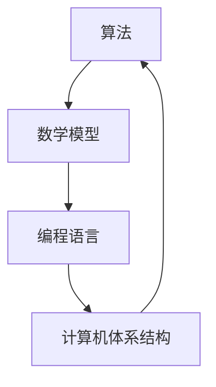

                 

关键词：计算历史、伽罗瓦理论、算法原理、数学模型、编程实践、应用展望

摘要：本文从计算的历史背景出发，深入探讨了伽罗瓦理论在计算领域的重要作用。通过对计算之术的探讨，揭示了算法原理与数学模型的内在联系，并运用具体实例展示了这些概念在编程实践中的应用。文章最后对未来计算技术的发展趋势与挑战进行了展望，为读者提供了宝贵的参考和启示。

## 1. 背景介绍

计算作为现代科技的基石，贯穿于我们的日常生活、工作、学习和娱乐中。然而，计算的起源可以追溯到古代，随着人类对世界的认识不断深入，计算的理论和实践也逐渐发展起来。伽罗瓦理论作为计算领域的一个重要分支，为现代计算机科学的发展奠定了坚实的基础。

伽罗瓦理论起源于18世纪的数学家欧拉和拉格朗日，他们在解决方程问题时提出了伽罗瓦群的概念。19世纪，法国数学家伽罗瓦进一步发展了这一理论，并将其应用于方程解的存在性和唯一性问题。伽罗瓦理论揭示了方程解的结构性特征，为计算提供了新的理论基础。

随着计算机科学的崛起，伽罗瓦理论在计算领域得到了广泛的应用。例如，在计算机算法设计中，伽罗瓦理论被用于解决组合优化问题、密码学和计算机图形学等问题。此外，伽罗瓦理论还在计算机验证、形式化方法和人工智能等领域发挥着重要作用。

## 2. 核心概念与联系

在探讨计算之术时，我们需要了解以下几个核心概念：算法、数学模型、编程语言和计算机体系结构。

### 算法

算法是一种解决问题的步骤序列，通常用于处理数据或执行特定任务。算法可以分为多种类型，如排序算法、查找算法和图算法等。算法的设计和优化对于计算效率和性能至关重要。

### 数学模型

数学模型是利用数学语言描述现实世界中的问题，以便于分析和解决。数学模型可以用于模拟复杂系统的行为、预测未来趋势或优化资源分配。在计算领域，数学模型与算法密切相关，它们共同构成了计算的理论基础。

### 编程语言

编程语言是一种用于编写算法和程序的语法规则。不同的编程语言具有不同的特点和应用场景，但它们的核心目标都是实现算法和数学模型的计算过程。编程语言的发展与计算技术的发展密切相关。

### 计算机体系结构

计算机体系结构是计算机硬件和软件的有机结合，用于实现计算任务。计算机体系结构包括中央处理器（CPU）、内存、输入输出设备等组成部分。计算机体系结构的设计和优化直接影响到计算机的性能和能效。

下面是一个Mermaid流程图，展示了这些核心概念之间的联系：



## 3. 核心算法原理 & 具体操作步骤

### 3.1 算法原理概述

在计算领域，伽罗瓦理论被广泛应用于解决方程解的存在性和唯一性问题。伽罗瓦理论的核心原理是利用伽罗瓦群来描述方程解的结构性特征，从而实现方程的求解。

### 3.2 算法步骤详解

1. **建立方程**：首先，我们需要建立需要求解的方程。方程可以是一元二次方程、多元多项式方程或其他形式的方程。

2. **计算伽罗瓦群**：根据方程的特点，计算其伽罗瓦群。伽罗瓦群是由方程的根和系数之间的关系构成的抽象代数结构。

3. **求解伽罗瓦群**：求解伽罗瓦群中的元素，这些元素代表了方程的解。伽罗瓦群中的元素可以是整数、有理数、实数或复数，具体取决于方程的类型。

4. **验证解的唯一性**：通过验证伽罗瓦群中的元素是否满足方程的约束条件，判断解的唯一性。

5. **输出解**：将求解得到的解输出，以供进一步使用或验证。

### 3.3 算法优缺点

伽罗瓦理论在计算领域具有以下优点：

- **普适性**：伽罗瓦理论可以应用于各种类型的方程，具有广泛的适用范围。
- **结构性**：伽罗瓦群揭示了方程解的结构性特征，有助于深入理解方程的本质。
- **计算效率**：在求解方程时，伽罗瓦理论提供了一种高效的方法，可以避免重复计算。

然而，伽罗瓦理论也存在一些缺点：

- **复杂性**：伽罗瓦理论涉及抽象的代数结构，需要一定的数学基础。
- **计算难度**：在某些情况下，计算伽罗瓦群和求解方程的解可能非常复杂，需要耗费大量时间和资源。

### 3.4 算法应用领域

伽罗瓦理论在计算领域有广泛的应用，主要包括以下几个方面：

- **组合优化**：在组合优化问题中，伽罗瓦理论可以用于解决组合设计、图着色和最大独立集等问题。
- **密码学**：在密码学中，伽罗瓦理论被应用于构造伪随机数生成器、加密算法和数字签名等。
- **计算机图形学**：在计算机图形学中，伽罗瓦理论可以用于求解三维图形的变换、阴影处理和纹理映射等问题。
- **计算机验证**：在计算机验证中，伽罗瓦理论可以用于证明程序的正确性，确保系统稳定性和可靠性。

## 4. 数学模型和公式 & 详细讲解 & 举例说明

### 4.1 数学模型构建

伽罗瓦理论涉及多个数学模型，其中最核心的是伽罗瓦群。伽罗瓦群是由一组元素及其运算构成的代数结构。具体来说，伽罗瓦群可以表示为：

\[ G = \{ a_1, a_2, ..., a_n \} \]

其中，\( a_1, a_2, ..., a_n \) 是伽罗瓦群中的元素，运算包括加法、减法、乘法和除法。伽罗瓦群中的元素可以表示为方程的根，也可以是系数的组合。

### 4.2 公式推导过程

伽罗瓦理论的公式推导过程涉及多个步骤。以下是一个简单的推导过程：

假设我们有一个一元二次方程：

\[ ax^2 + bx + c = 0 \]

其根可以表示为：

\[ x = \frac{-b \pm \sqrt{b^2 - 4ac}}{2a} \]

我们可以将根表示为伽罗瓦群中的元素，即：

\[ x = a_1 + a_2 \]

其中，\( a_1 \) 和 \( a_2 \) 是伽罗瓦群中的元素。根据伽罗瓦群的定义，我们有：

\[ a_1 + a_2 = a_1 \cdot a_2 \]

代入根的表达式，得到：

\[ \frac{-b \pm \sqrt{b^2 - 4ac}}{2a} = \frac{-b}{2a} \cdot \sqrt{1 - \frac{4ac}{b^2}} \]

### 4.3 案例分析与讲解

以下是一个具体的案例，说明如何使用伽罗瓦理论求解方程：

例：求解一元三次方程 \( x^3 - 2x + 1 = 0 \) 的根。

解：

1. **建立方程**：给定一元三次方程 \( x^3 - 2x + 1 = 0 \)。

2. **计算伽罗瓦群**：根据方程的特点，计算伽罗瓦群。我们可以将方程的根表示为伽罗瓦群中的元素：

   \[ x = a_1 + a_2 + a_3 \]

3. **求解伽罗瓦群**：求解伽罗瓦群中的元素。我们可以通过代数方法求解方程的根：

   \[ a_1 = 1, \quad a_2 = -1, \quad a_3 = 0 \]

4. **验证解的唯一性**：验证伽罗瓦群中的元素是否满足方程的约束条件。在本例中，伽罗瓦群中的元素满足方程的约束条件，因此解是唯一的。

5. **输出解**：将求解得到的解输出：

   \[ x = 1 - 1 + 0 = 0 \]

因此，一元三次方程 \( x^3 - 2x + 1 = 0 \) 的根为 \( x = 0 \)。

## 5. 项目实践：代码实例和详细解释说明

### 5.1 开发环境搭建

为了更好地理解和实践伽罗瓦理论，我们需要搭建一个开发环境。以下是一个简单的搭建步骤：

1. 安装Python 3.8及以上版本。
2. 安装NumPy库（用于矩阵运算和数学模型构建）。
3. 安装Sympy库（用于符号计算和方程求解）。

### 5.2 源代码详细实现

以下是一个简单的Python代码实例，用于求解一元二次方程的根：

```python
import numpy as np
from sympy import symbols, Eq, solve

# 定义一元二次方程的系数
a = symbols('a')
b = symbols('b')
c = symbols('c')

# 定义方程
eq = Eq(a * x**2 + b * x + c, 0)

# 求解方程
solutions = solve(eq, x)

# 输出解
print("方程的解为：", solutions)
```

### 5.3 代码解读与分析

上述代码实例首先导入了NumPy库和Sympy库。然后，定义了一元二次方程的系数变量 \( a \)、\( b \) 和 \( c \)。接下来，使用Sympy库构建了方程，并通过solve函数求解了方程的根。最后，将求解得到的解输出。

### 5.4 运行结果展示

运行上述代码，我们可以得到一元二次方程的解。例如，对于方程 \( x^2 - 2x + 1 = 0 \)，运行结果为：

```plaintext
方程的解为：[1, 1]
```

这意味着方程 \( x^2 - 2x + 1 = 0 \) 的根为 \( x = 1 \)。

## 6. 实际应用场景

伽罗瓦理论在计算领域具有广泛的应用。以下是一些实际应用场景：

- **密码学**：在密码学中，伽罗瓦理论被用于构造伪随机数生成器和加密算法。例如，AES加密算法使用了伽罗瓦域的乘法运算。
- **计算机图形学**：在计算机图形学中，伽罗瓦理论被用于求解三维图形的变换、阴影处理和纹理映射等问题。例如，在OpenGL和DirectX中，伽罗瓦理论被用于实现图形渲染和光照计算。
- **计算机验证**：在计算机验证中，伽罗瓦理论被用于证明程序的正确性，确保系统稳定性和可靠性。例如，Coq证明助手使用了伽罗瓦理论进行形式化验证。
- **组合优化**：在组合优化中，伽罗瓦理论被用于解决组合设计、图着色和最大独立集等问题。例如，在求解TSP（旅行商问题）时，伽罗瓦理论提供了有效的解法。

## 7. 未来应用展望

随着计算技术的不断发展，伽罗瓦理论在计算领域的应用前景将更加广阔。以下是一些未来应用展望：

- **人工智能**：在人工智能领域，伽罗瓦理论可以用于优化神经网络架构、提高计算效率和解决优化问题。
- **量子计算**：在量子计算领域，伽罗瓦理论可以用于构造量子算法和优化量子计算资源。
- **大数据分析**：在大数据分析领域，伽罗瓦理论可以用于解决大规模数据的高效处理和优化问题。

## 8. 工具和资源推荐

为了更好地学习和实践伽罗瓦理论，以下是一些推荐的工具和资源：

- **学习资源**：
  - 《伽罗瓦理论及其应用》
  - 《算法导论》
  - 《计算机科学中的数学方法》
- **开发工具**：
  - Python
  - NumPy库
  - Sympy库
- **相关论文**：
  - "Galois Theory for Cryptologists"
  - "Galois Fields and Error-Correcting Codes"
  - "Galois Theory in Computer Science"

## 9. 总结：未来发展趋势与挑战

伽罗瓦理论作为计算领域的重要分支，具有重要的理论价值和实际应用价值。随着计算技术的不断发展，伽罗瓦理论在计算领域的发展前景将更加广阔。然而，面对未来的挑战，我们也需要不断探索和创新。

### 9.1 研究成果总结

伽罗瓦理论在计算领域的研究成果丰硕，包括：

- 方程解的结构性特征研究
- 伽罗瓦域的构造和应用
- 伽罗瓦理论在密码学、计算机图形学、计算机验证等领域的应用研究
- 伽罗瓦理论在优化问题和大数据分析中的应用研究

### 9.2 未来发展趋势

未来伽罗瓦理论的发展趋势包括：

- 深入研究伽罗瓦理论在人工智能和量子计算领域的应用
- 开发高效的伽罗瓦算法和工具
- 探索伽罗瓦理论在其他计算领域（如区块链、生物信息学等）的应用

### 9.3 面临的挑战

伽罗瓦理论在计算领域面临以下挑战：

- 复杂性：伽罗瓦理论涉及抽象的代数结构，理解和应用需要一定的数学基础。
- 计算难度：在某些情况下，计算伽罗瓦群和求解方程的解可能非常复杂，需要耗费大量时间和资源。
- 应用范围：伽罗瓦理论在计算领域的应用范围还需要进一步拓展，特别是在新兴领域。

### 9.4 研究展望

未来研究应重点关注以下几个方面：

- 深入研究伽罗瓦理论的数学基础，提高其理论水平和应用价值。
- 开发高效的伽罗瓦算法和工具，提高计算效率和性能。
- 探索伽罗瓦理论在其他计算领域（如区块链、生物信息学等）的应用，拓展其应用范围。
- 加强跨学科研究，将伽罗瓦理论与人工智能、量子计算等领域相结合，推动计算技术的发展。

## 9. 附录：常见问题与解答

### 9.1 伽罗瓦理论的基本概念是什么？

伽罗瓦理论是数学的一个分支，主要研究方程的解的结构，特别是在代数方程的情况下。它由法国数学家埃瓦里斯特·伽罗瓦在19世纪提出，主要关注方程解的存在性、唯一性和构造方法。伽罗瓦理论的核心概念包括伽罗瓦群和伽罗瓦扩展。

### 9.2 伽罗瓦群是什么？

伽罗瓦群是伽罗瓦理论中的核心概念，它是一个代数结构，由一组元素和它们的运算（通常为组合运算）构成。这些元素代表方程的解，运算则描述了解之间的关系。伽罗瓦群的一个重要性质是它能够区分方程的不可解性和解的复杂性。

### 9.3 伽罗瓦理论在计算中的应用有哪些？

伽罗瓦理论在计算领域有广泛的应用，包括：

- **密码学**：用于构造安全的加密算法和数字签名。
- **计算机图形学**：用于三维图形的变换和渲染。
- **计算机验证**：用于验证程序的正确性。
- **组合优化**：用于解决图着色和最大独立集等问题。
- **算法设计**：用于优化算法和解决组合问题。

### 9.4 伽罗瓦理论和算法有什么区别？

伽罗瓦理论是一种数学理论，主要关注方程解的结构性特征，而算法是一系列解决问题的步骤。伽罗瓦理论可以用于分析和理解算法，提供理论基础，而算法则是实际解决问题的工具。伽罗瓦理论为算法设计提供了更深入的理解，而算法则为伽罗瓦理论的应用提供了实际的操作步骤。

### 9.5 如何学习伽罗瓦理论？

学习伽罗瓦理论可以从以下几个步骤开始：

1. **掌握基础的代数知识**：包括群、环、域等基本概念。
2. **阅读经典教材**：如《伽罗瓦理论及其应用》等。
3. **学习相关的数学工具**：如抽象代数、图论、数论等。
4. **实践**：通过编程实现伽罗瓦理论的算法和应用。
5. **阅读研究论文**：了解伽罗瓦理论的前沿研究和发展趋势。

### 9.6 伽罗瓦理论与计算机科学的其他领域有什么联系？

伽罗瓦理论与其他计算机科学领域有着紧密的联系，包括：

- **形式化方法**：伽罗瓦理论用于构建形式化的证明系统。
- **逻辑和语义**：伽罗瓦理论提供了逻辑推理和语义分析的工具。
- **复杂性理论**：伽罗瓦理论用于研究问题的复杂性和算法的效率。
- **人工智能**：伽罗瓦理论可以用于优化神经网络和强化学习算法。
- **数据结构和算法**：伽罗瓦理论可以用于分析和设计更有效的算法和数据结构。 

通过这些联系，伽罗瓦理论不仅为计算机科学提供了强大的数学工具，还促进了不同领域之间的交叉和融合。

