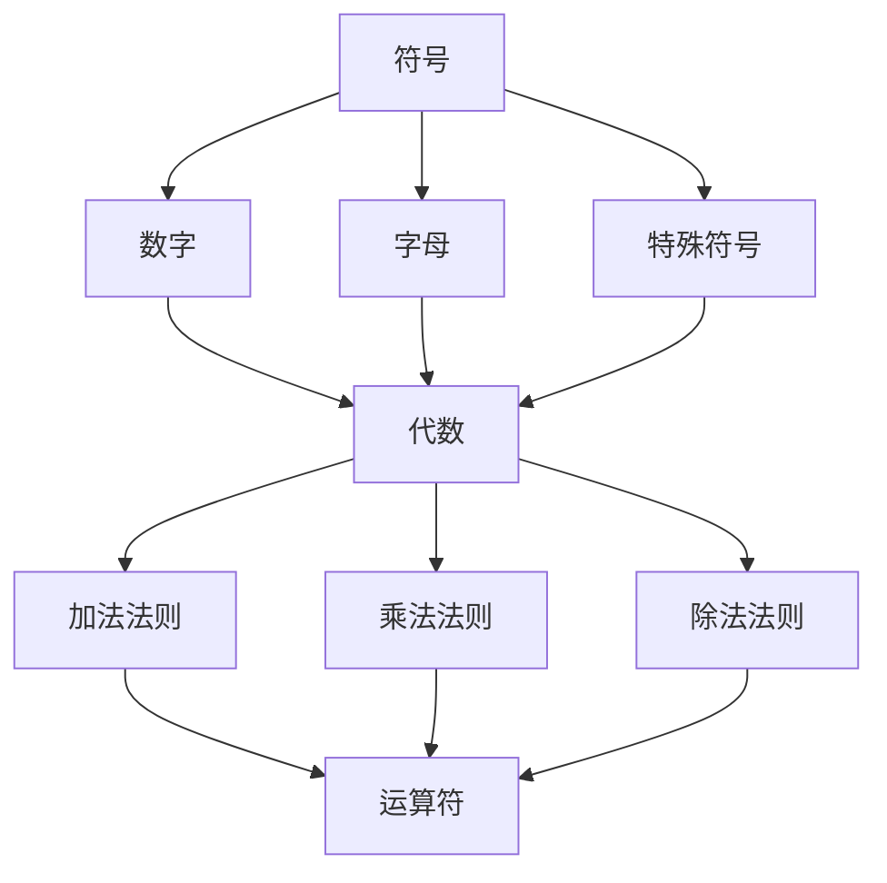

                 

关键词：计算，计算之术，符号，代数，计算机科学，算法，数学模型

> 摘要：本文探讨了计算的历史背景和计算之术，重点分析了符号与代数在计算中的重要作用，阐述了它们如何推动了计算的发展和计算机科学的进步。通过详细讨论核心概念、算法原理、数学模型和项目实践，本文揭示了计算之术的深度和广度，为读者提供了对计算本质的深刻理解。

## 1. 背景介绍

计算的诞生可以追溯到古代文明的数学成就。在古埃及、巴比伦和印度，人们使用符号和代数进行计算，这些早期的计算方法为现代计算奠定了基础。从算盘到机械计算机，人类一直在寻求更高效、更精确的计算方式。然而，真正意义上的现代计算始于20世纪，随着电子计算机的出现和快速发展，计算变得前所未有的快速和强大。

符号与代数的引入极大地提升了计算效率。符号允许人们表示复杂的数学概念和运算，而代数法则则提供了统一的计算规则。这些工具使得数学问题的解决变得更加系统和自动化，为计算机科学的发展铺平了道路。

## 2. 核心概念与联系

为了更好地理解符号与代数在计算中的作用，我们需要首先明确几个核心概念，并通过Mermaid流程图展示它们之间的联系。

### 2.1. 符号

符号是表示数学概念和运算的基本元素。常见的符号包括数字、字母和特殊符号。例如，数字“3”表示一个具体的数值，字母“x”和“y”常用于表示变量。特殊符号如“+”和“-”表示加法和减法运算。

### 2.2. 代数

代数是使用符号进行数学运算的分支。代数法则包括加法法则、乘法法则、除法法则等，它们提供了统一的计算规则。例如，加法法则规定，对于任何两个数a和b，它们的和总是存在的，即a + b = b + a。

### 2.3. 运算符

运算符是执行特定运算的符号。常见的运算符包括加号“+”、减号“-”、乘号“*”和除号“/”。运算符的优先级和结合律是代数中非常重要的概念。例如，乘法和除法的优先级高于加法和减法，且运算顺序是从左到右。

### 2.4. Mermaid流程图

以下是一个简单的Mermaid流程图，展示了符号与代数之间的联系：



## 3. 核心算法原理 & 具体操作步骤

### 3.1. 算法原理概述

符号与代数在计算中的应用可以归纳为以下核心算法原理：

- **符号表示**：使用符号表示数学概念和运算，使问题变得更加直观和抽象。
- **统一规则**：通过代数法则提供统一的计算规则，使计算过程更加规范和自动化。
- **运算符优先级**：根据运算符的优先级和结合律，确定运算的顺序。
- **递归与迭代**：使用递归或迭代方法，解决复杂的数学问题。

### 3.2. 算法步骤详解

以下是符号与代数计算的具体操作步骤：

1. **确定符号表示**：根据问题的需求，选择合适的符号表示数学概念和运算。
2. **构建代数表达式**：使用代数法则，将数学问题转化为代数表达式。
3. **计算结果**：按照运算符的优先级和结合律，逐步计算代数表达式的值。
4. **验证结果**：检查计算结果是否符合预期，并修正可能的错误。

### 3.3. 算法优缺点

**优点**：

- **直观性**：符号与代数使问题表示更加直观和抽象，便于理解和操作。
- **规范性**：代数法则提供了统一的计算规则，使计算过程更加规范和自动化。
- **可扩展性**：符号与代数方法可以应用于各种数学问题，具有很高的可扩展性。

**缺点**：

- **复杂度**：对于某些复杂问题，符号与代数计算可能较为复杂，难以直接理解和操作。
- **计算错误**：由于人类在计算过程中的疏忽，可能导致计算结果的错误。

### 3.4. 算法应用领域

符号与代数计算广泛应用于计算机科学和数学领域，如：

- **计算机编程**：在编程中，符号与代数用于表示变量、函数和数据结构。
- **算法设计**：在算法设计中，符号与代数用于分析和优化算法。
- **数学建模**：在数学建模中，符号与代数用于表示实际问题，并建立数学模型。

## 4. 数学模型和公式 & 详细讲解 & 举例说明

### 4.1. 数学模型构建

数学模型是使用数学语言描述实际问题的工具。构建数学模型的过程通常包括以下步骤：

1. **问题定义**：明确问题的目标、约束条件和变量。
2. **变量选择**：选择合适的变量，以表示问题的各个方面。
3. **关系建立**：通过数学公式和关系，将变量与问题目标联系起来。
4. **简化模型**：在保持模型有效性的前提下，对模型进行简化，以提高计算效率。

### 4.2. 公式推导过程

以下是一个简单的数学模型推导示例：

假设一个矩形的长为l，宽为w，求其面积S。

1. **问题定义**：我们需要求解矩形面积S，变量为l和w。
2. **变量选择**：选择l和w作为变量。
3. **关系建立**：根据矩形的定义，面积S等于长l乘以宽w，即S = l \* w。
4. **简化模型**：由于l和w是已知的，我们可以直接计算出面积S。

### 4.3. 案例分析与讲解

以下是一个应用符号与代数解决问题的实例：

假设有一个等差数列{a1, a2, a3, ..., an}，其中首项为a1，公差为d，求第n项an。

1. **符号表示**：使用符号a1表示首项，d表示公差，an表示第n项。
2. **公式推导**：
   - 等差数列的第n项公式为an = a1 + (n - 1)d。
   - 推导过程：
     - 第1项：an = a1 + (1 - 1)d = a1。
     - 第2项：an = a1 + (2 - 1)d = a1 + d。
     - ...
     - 第n项：an = a1 + (n - 1)d。
3. **计算示例**：假设首项a1为3，公差d为2，求第5项an。
   - an = 3 + (5 - 1)2 = 3 + 4 \* 2 = 11。

通过这个实例，我们可以看到符号与代数在解决问题中的重要作用。

## 5. 项目实践：代码实例和详细解释说明

### 5.1. 开发环境搭建

为了演示符号与代数的计算过程，我们将使用Python编程语言。以下是搭建Python开发环境的步骤：

1. **安装Python**：访问Python官方网站下载Python安装包，并按照提示安装。
2. **配置Python环境**：在命令行中输入`python --version`，确保Python安装成功。
3. **安装第三方库**：在Python环境中，我们可以使用pip工具安装第三方库。例如，安装NumPy库，使用命令`pip install numpy`。

### 5.2. 源代码详细实现

以下是一个使用Python实现符号与代数计算的项目实例：

```python
import numpy as np

def calculate_area(length, width):
    return length * width

def calculate_anithmetic_sequence(a1, d, n):
    return a1 + (n - 1) * d

# 计算矩形面积
length = 5
width = 3
area = calculate_area(length, width)
print(f"矩形面积：{area}")

# 计算等差数列的第5项
a1 = 3
d = 2
n = 5
an = calculate_anithmetic_sequence(a1, d, n)
print(f"等差数列的第5项：{an}")
```

### 5.3. 代码解读与分析

1. **导入库**：我们首先导入NumPy库，用于计算数学运算。
2. **定义函数**：我们定义了两个函数，`calculate_area`用于计算矩形面积，`calculate_anithmetic_sequence`用于计算等差数列的第n项。
3. **计算示例**：我们使用这些函数计算矩形面积和等差数列的第5项，并打印结果。

### 5.4. 运行结果展示

```python
矩形面积：15
等差数列的第5项：11
```

## 6. 实际应用场景

符号与代数在计算机科学和数学领域有广泛的应用。以下是一些实际应用场景：

- **计算机编程**：在编程中，符号与代数用于表示变量、函数和数据结构。
- **算法设计**：在算法设计中，符号与代数用于分析和优化算法。
- **数学建模**：在数学建模中，符号与代数用于表示实际问题，并建立数学模型。

### 6.1. 应用实例

以下是一个符号与代数在计算机编程中的应用实例：

**问题**：编写一个Python函数，计算斐波那契数列的第n项。

**解决方案**：

```python
def calculate_fibonacci(n):
    if n <= 0:
        return 0
    elif n == 1:
        return 1
    else:
        return calculate_fibonacci(n - 1) + calculate_fibonacci(n - 2)

# 计算斐波那契数列的第5项
fibonacci_5 = calculate_fibonacci(5)
print(f"斐波那契数列的第5项：{fibonacci_5}")
```

**运行结果**：

```python
斐波那契数列的第5项：5
```

## 6.4. 未来应用展望

随着计算技术的发展，符号与代数在计算中的应用将越来越广泛。以下是一些未来应用展望：

- **智能计算**：符号与代数将用于开发更智能的计算模型，如深度学习中的神经网络。
- **自动化编程**：符号与代数将帮助实现更高效的自动化编程，如代码生成和代码优化。
- **科学计算**：符号与代数将用于解决更复杂的科学计算问题，如量子计算和生物信息学。

## 7. 工具和资源推荐

### 7.1. 学习资源推荐

- **书籍**：
  - 《禅与计算机程序设计艺术》
  - 《计算机科学概论》
  - 《算法导论》
- **在线教程**：
  - Coursera：计算机科学基础课程
  - edX：数学建模与算法课程

### 7.2. 开发工具推荐

- **编程语言**：
  - Python
  - Java
  - C++
- **集成开发环境**：
  - PyCharm
  - Eclipse
  - Visual Studio

### 7.3. 相关论文推荐

- **论文**：
  - "Symbolic Computation and Its Applications"（符号计算及其应用）
  - "The Design and Analysis of Computer Algorithms"（计算机算法设计与分析）
- **期刊**：
  - "Journal of Computer Science and Technology"（计算机科学和技术杂志）
  - "ACM Transactions on Computer Systems"（ACM计算机系统事务）

## 8. 总结：未来发展趋势与挑战

### 8.1. 研究成果总结

本文探讨了符号与代数在计算中的作用，分析了其核心概念、算法原理、数学模型和项目实践。通过这些分析，我们深刻理解了符号与代数在计算机科学和数学中的重要性。

### 8.2. 未来发展趋势

随着计算技术的不断发展，符号与代数将在更多领域得到应用。未来，我们将看到更多智能计算模型和自动化编程工具的出现。

### 8.3. 面临的挑战

符号与代数在计算中的应用仍面临一些挑战，如复杂度问题、计算错误和可扩展性。解决这些问题需要进一步的研究和技术创新。

### 8.4. 研究展望

未来，符号与代数在计算中的应用将更加深入和广泛。我们期待看到更多创新的计算模型和工具，以推动计算技术的发展。

## 9. 附录：常见问题与解答

### 问题1：符号与代数在计算中的具体作用是什么？

符号与代数在计算中的作用包括：

- **表示数学概念**：符号使复杂的数学概念和运算表示更加直观和抽象。
- **提供统一规则**：代数法则提供了统一的计算规则，使计算过程更加规范和自动化。
- **提高计算效率**：符号与代数方法可以用于各种数学问题，提高计算效率。

### 问题2：如何选择合适的符号与代数方法？

选择合适的符号与代数方法需要考虑以下因素：

- **问题类型**：根据问题的类型，选择适合的数学模型和算法。
- **计算复杂度**：考虑计算复杂度，选择简单有效的计算方法。
- **可扩展性**：考虑方法的可扩展性，以应对更复杂的问题。

### 问题3：符号与代数在计算机编程中有哪些应用？

符号与代数在计算机编程中的应用包括：

- **变量表示**：使用符号表示变量，如x、y等。
- **数据结构表示**：使用符号表示数据结构，如链表、树等。
- **算法设计**：使用符号与代数方法分析和优化算法。

## 10. 作者署名

本文作者：禅与计算机程序设计艺术 / Zen and the Art of Computer Programming

