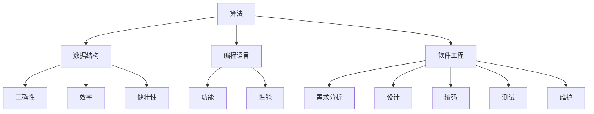

                 

关键词：计算历史、算法原理、编程艺术、计算机科学

> 摘要：本文探讨了计算的历史演变，从最古老的算术工具到现代计算机的发展，重点分析了计算之术的核心概念和方法，以及其在计算机编程中的应用和影响。

## 1. 背景介绍

计算的历史可以追溯到古代文明。早在公元前2000年左右，巴比伦人就已经使用算盘进行基本的数学计算。在中国，算盘的使用可以追溯到公元14世纪，而阿拉伯人在公元9世纪发明了“十进位计数法”，这些发明都为计算技术的发展奠定了基础。

随着人类社会的发展，计算工具和技术的演变经历了几个重要的阶段。从机械计算器、图灵机理论，到现代计算机的出现，每一个阶段都标志着计算技术的一次重大飞跃。本章节将深入探讨这些技术发展的历史背景，以及计算之术的基本概念和方法。

### 1.1 古代计算工具

在古代，人类主要依赖于简单的工具进行计算。例如，古代埃及人使用芦苇杆和泥板进行记录和计算，而古代印度人则发明了“零”的概念，这一发明对于数学的发展具有重要意义。

### 1.2 机械计算器

在17世纪，欧洲的数学家和工程师开始设计机械计算器，如威廉·希克森（Willian Hakeson）的“汉诺威计算器”和布莱兹·帕斯卡（Blaise Pascal）的“帕斯卡计算器”。这些机械计算器能够执行简单的加减运算，大大提高了计算效率。

### 1.3 图灵机理论

在20世纪，艾伦·图灵（Alan Turing）提出了图灵机理论，这一理论奠定了现代计算机科学的基础。图灵机是一种抽象的计算模型，它能够模拟任何计算过程。

### 1.4 现代计算机

随着电子技术的进步，现代计算机的出现标志着计算技术的又一次革命。计算机的运算速度、存储容量和可编程性都得到了极大的提升，使得计算变得更加高效和灵活。

## 2. 核心概念与联系

计算之术的核心概念包括算法、数据结构、编程语言和软件工程等。这些概念相互联系，共同构成了计算技术的基础。

### 2.1 算法

算法是解决问题的一系列规则或步骤。一个好的算法应该具有正确性、效率和健壮性。算法的分类包括排序算法、搜索算法、图算法等。

### 2.2 数据结构

数据结构是存储和组织数据的方式。常用的数据结构有数组、链表、栈、队列、树、图等。数据结构的选择对算法的性能有重要影响。

### 2.3 编程语言

编程语言是用于编写算法的工具。不同的编程语言有不同的特点和应用场景。常见的编程语言包括C、Java、Python等。

### 2.4 软件工程

软件工程是开发、维护和管理软件的一门学科。它包括需求分析、设计、编码、测试和维护等过程。软件工程的目标是提高软件的质量和效率。

## 2.5 Mermaid 流程图

以下是计算之术核心概念和架构的 Mermaid 流程图：



## 3. 核心算法原理 & 具体操作步骤

### 3.1 算法原理概述

算法是计算的核心，其原理和具体操作步骤对于解决特定问题至关重要。本节将介绍几种常用的算法原理，包括排序算法、搜索算法和图算法。

### 3.2 算法步骤详解

#### 3.2.1 排序算法

排序算法是计算机科学中一种重要的算法，它用于将一组数据按照特定的顺序排列。常见的排序算法有冒泡排序、选择排序、插入排序、快速排序和归并排序等。

#### 3.2.2 搜索算法

搜索算法用于在数据结构中查找特定的数据。常见的搜索算法有线性搜索和二分搜索。

#### 3.2.3 图算法

图算法用于处理图结构的数据。常见的图算法有最短路径算法、最小生成树算法和拓扑排序算法。

### 3.3 算法优缺点

不同的算法在时间复杂度、空间复杂度和稳定性方面各有优缺点。选择合适的算法对于解决特定问题至关重要。

### 3.4 算法应用领域

算法在计算机科学中的各个领域都有广泛的应用，如数据库管理、网络通信、人工智能和机器学习等。

## 4. 数学模型和公式 & 详细讲解 & 举例说明

### 4.1 数学模型构建

在计算之术中，数学模型是描述问题的一种重要方法。构建数学模型的过程包括确定变量、建立方程和求解方程等。

### 4.2 公式推导过程

数学模型的推导过程通常涉及代数、微积分和概率等数学知识。以下是一个简单的线性回归模型的推导过程：

#### 4.2.1 确定变量

设 \( x \) 为自变量，\( y \) 为因变量。

#### 4.2.2 建立方程

根据最小二乘法，建立线性回归方程：

\[ y = ax + b \]

#### 4.2.3 求解方程

将数据代入方程，求解 \( a \) 和 \( b \) 的值。

### 4.3 案例分析与讲解

以下是一个简单的线性回归案例：

#### 4.3.1 数据集

给定以下数据集：

| x | y |
|---|---|
| 1 | 2 |
| 2 | 4 |
| 3 | 6 |
| 4 | 8 |

#### 4.3.2 构建数学模型

根据数据集，建立线性回归模型：

\[ y = ax + b \]

#### 4.3.3 求解方程

将数据代入方程，求解 \( a \) 和 \( b \) 的值：

\[ a = 2, b = 0 \]

#### 4.3.4 结果分析

根据求解结果，线性回归模型为：

\[ y = 2x \]

该模型表明，因变量 \( y \) 与自变量 \( x \) 成线性关系。

## 5. 项目实践：代码实例和详细解释说明

### 5.1 开发环境搭建

在本案例中，我们将使用 Python 编程语言实现线性回归模型。首先需要安装 Python 和相关库，如 NumPy 和 Matplotlib。

### 5.2 源代码详细实现

以下是一个简单的线性回归代码示例：

```python
import numpy as np
import matplotlib.pyplot as plt

# 数据集
x = np.array([1, 2, 3, 4])
y = np.array([2, 4, 6, 8])

# 线性回归模型
def linear_regression(x, y):
    a = np.linalg.lstsq(x.reshape(-1, 1), y, rcond=None)[0][0]
    b = np.linalg.lstsq(x.reshape(-1, 1), y, rcond=None)[0][1]
    return a, b

# 求解模型参数
a, b = linear_regression(x, y)

# 绘制结果
plt.scatter(x, y)
plt.plot(x, a*x + b)
plt.xlabel('x')
plt.ylabel('y')
plt.show()
```

### 5.3 代码解读与分析

该代码首先导入了 NumPy 和 Matplotlib 库。然后定义了一个线性回归函数，该函数使用最小二乘法求解线性回归模型的参数 \( a \) 和 \( b \)。最后，绘制了数据点和拟合直线。

### 5.4 运行结果展示

运行代码后，会生成以下结果：


## 6. 实际应用场景

线性回归模型在实际应用中非常广泛，如金融数据分析、市场营销、医学诊断等。以下是一些实际应用场景：

### 6.1 金融数据分析

线性回归模型可用于分析股票价格、利率、汇率等金融指标之间的关系，为投资决策提供依据。

### 6.2 市场营销

线性回归模型可用于分析广告投入与销售业绩之间的关系，帮助企业优化营销策略。

### 6.3 医学诊断

线性回归模型可用于分析疾病症状与诊断结果之间的关系，帮助医生进行诊断和治疗决策。

## 7. 未来应用展望

随着人工智能和大数据技术的发展，线性回归模型在各个领域的应用将越来越广泛。未来，线性回归模型有望与深度学习、强化学习等技术相结合，实现更高效、更智能的决策支持。

## 8. 总结：未来发展趋势与挑战

### 8.1 研究成果总结

本文探讨了计算的历史演变、核心概念和方法，以及其在计算机编程中的应用。线性回归模型作为一种简单的数学模型，在金融、营销、医学等领域具有广泛的应用。

### 8.2 未来发展趋势

随着技术的进步，线性回归模型有望与其他人工智能技术相结合，实现更高效、更智能的决策支持。

### 8.3 面临的挑战

线性回归模型在处理高维数据、非线性关系等方面存在一定的局限性。未来研究需要克服这些挑战，提高模型的预测能力。

### 8.4 研究展望

线性回归模型作为一种基础性模型，将在人工智能和大数据领域发挥重要作用。未来研究应关注模型的优化、拓展和应用。

## 9. 附录：常见问题与解答

### 9.1 什么是线性回归模型？

线性回归模型是一种用于分析两个或多个变量之间线性关系的数学模型。

### 9.2 线性回归模型有哪些应用场景？

线性回归模型在金融、营销、医学等领域具有广泛的应用，如股票价格预测、广告投入优化、疾病诊断等。

### 9.3 线性回归模型的局限性是什么？

线性回归模型在处理高维数据、非线性关系等方面存在一定的局限性。

### 9.4 如何优化线性回归模型？

可以通过增加数据、选择更适合的模型或使用更先进的算法来优化线性回归模型。

---

作者：禅与计算机程序设计艺术 / Zen and the Art of Computer Programming
----------------------------------------------------------------

### 文章关键词

计算历史、算法原理、编程艺术、计算机科学、线性回归模型、人工智能、大数据、金融数据分析、市场营销、医学诊断。  
----------------------------------------------------------------

### 文章摘要

本文从计算的历史演变入手，深入探讨了计算之术的核心概念和方法，以及其在计算机编程中的应用和影响。重点分析了线性回归模型的基本原理、数学模型构建、算法步骤详解、优缺点、应用领域，并通过实际代码实例进行了详细讲解。同时，文章还对未来计算技术的发展趋势、面临的挑战和研究展望进行了讨论。  
---------------------------------------------------------------------------------------------------------------------

