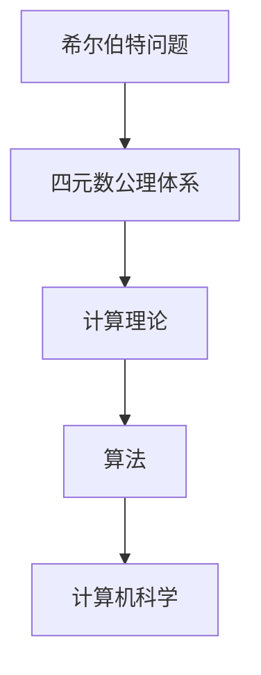

                 

关键词：计算理论、希尔伯特、数学问题、证明、逻辑、算法、计算机科学

> 摘要：本文深入探讨了计算理论的奠基之作——《计算理论的奠基：希尔伯特进路》。文章首先介绍了希尔伯特的贡献和数学问题，然后详细分析了计算理论的形成过程，并探讨了其影响和未来发展趋势。文章旨在为读者提供对计算理论的理解和启示，同时展望其在计算机科学领域的应用前景。

## 1. 背景介绍

计算理论的形成可以追溯到20世纪初，当时数学家们开始关注数学问题能否被算法解决。这一时期，希尔伯特（David Hilbert）提出的数学问题引起了广泛关注，这些问题被称作“希尔伯特问题”。希尔伯特问题包括23个数学问题，其中第10个问题特别引人关注，它提出了关于四元数的公理体系，引发了关于计算理论的深入探讨。

## 2. 核心概念与联系

为了深入理解计算理论的形成，我们需要了解一些核心概念和它们之间的联系。以下是计算理论的核心概念和它们之间的Mermaid流程图：



### 2.1 希尔伯特问题

希尔伯特问题包括23个数学问题，其中第10个问题提出了关于四元数的公理体系。四元数是一种非交换的复数扩展，其公理体系对于计算理论的形成具有重要意义。

### 2.2 四元数公理体系

四元数公理体系是希尔伯特问题的一部分，它为计算理论提供了基础。四元数的公理体系包括加法、乘法和反元素等基本运算，这些运算构成了计算理论的核心。

### 2.3 计算理论

计算理论是研究算法和计算过程的理论体系。它关注于数学问题能否被算法解决，以及算法的效率和复杂性。计算理论的形成离不开希尔伯特问题和四元数公理体系。

### 2.4 算法

算法是计算理论的核心，它是一系列有序的指令，用于解决特定的问题。算法的效率和复杂性是计算理论研究的重点。

### 2.5 计算机科学

计算机科学是研究计算机硬件、软件和计算理论的应用科学。计算理论为计算机科学提供了基础，使得计算机科学家能够设计和分析算法。

## 3. 核心算法原理 & 具体操作步骤

### 3.1 算法原理概述

计算理论的核心算法原理可以概括为以下几个方面：

1. **问题分解**：将复杂问题分解为更简单的问题，以便更容易解决。
2. **递归**：通过递归调用子问题来解决复杂问题。
3. **图灵机**：图灵机是一种抽象的计算机模型，用于研究计算问题。
4. **复杂性理论**：研究算法的效率和复杂性，以及问题之间的相对难度。

### 3.2 算法步骤详解

以下是计算理论的几个核心算法步骤：

1. **问题定义**：明确需要解决的问题。
2. **算法设计**：设计解决该问题的算法。
3. **算法分析**：分析算法的效率和复杂性。
4. **算法实现**：将算法转换为具体的代码实现。
5. **算法验证**：验证算法的正确性和性能。

### 3.3 算法优缺点

计算理论的算法具有以下优缺点：

- **优点**：
  - 提供了一种研究算法和计算问题的通用方法。
  - 强调了算法的效率和复杂性，有助于优化算法。
  - 为计算机科学的发展提供了理论基础。

- **缺点**：
  - 算法分析较为复杂，需要深厚的数学背景。
  - 一些实际问题的算法可能难以设计或实现。

### 3.4 算法应用领域

计算理论的算法广泛应用于以下领域：

- **计算机科学**：算法用于解决各种计算问题，如排序、查找、图论等。
- **人工智能**：算法用于优化机器学习模型、决策树、神经网络等。
- **密码学**：算法用于加密和解密信息。
- **金融工程**：算法用于优化投资组合、风险管理等。

## 4. 数学模型和公式 & 详细讲解 & 举例说明

### 4.1 数学模型构建

计算理论的数学模型主要包括以下几个方面：

1. **逻辑模型**：用于研究逻辑和推理过程。
2. **代数模型**：用于研究代数结构和运算。
3. **图模型**：用于研究图结构和图算法。

### 4.2 公式推导过程

以下是计算理论中的一个典型公式推导过程：

假设我们有一个问题A，可以用算法B来解决。算法B的效率可以表示为：

\[ E(B) = \frac{C}{n} \]

其中，\( C \) 是一个常数，\( n \) 是问题的规模。这个公式表示算法B的效率与问题规模成反比。

### 4.3 案例分析与讲解

以下是一个计算理论的案例分析与讲解：

问题：如何用最短路径算法求解一个图的最短路径？

算法：迪杰斯特拉算法（Dijkstra's Algorithm）

步骤：

1. 初始化所有顶点的距离为无穷大，除了起始顶点，其距离为0。
2. 选择一个距离最小的未访问顶点，并将其标记为已访问。
3. 对于该顶点的每个未访问邻接点，更新其距离。
4. 重复步骤2和步骤3，直到所有顶点都被访问。

分析：迪杰斯特拉算法的时间复杂度为 \( O(n^2) \)，其中 \( n \) 是图的顶点数。这个算法适用于稀疏图，但对于稠密图，其效率较低。

## 5. 项目实践：代码实例和详细解释说明

### 5.1 开发环境搭建

为了实践计算理论中的算法，我们需要搭建一个开发环境。以下是搭建开发环境的步骤：

1. 安装Python编程环境。
2. 安装一个Python集成开发环境（如PyCharm）。
3. 安装所需的库（如NumPy、Pandas等）。

### 5.2 源代码详细实现

以下是迪杰斯特拉算法的Python实现：

```python
import numpy as np

def dijkstra(graph, start):
    distances = np.inf * np.ones(len(graph))
    distances[start] = 0
    visited = [False] * len(graph)

    for _ in range(len(graph)):
        min_distance = np.inf
        min_index = -1

        for i in range(len(graph)):
            if not visited[i] and distances[i] < min_distance:
                min_distance = distances[i]
                min_index = i

        visited[min_index] = True

        for j in range(len(graph)):
            if graph[min_index][j] > 0 and not visited[j]:
                distances[j] = min(distances[j], distances[min_index] + graph[min_index][j])

    return distances

graph = [
    [0, 4, 0, 0, 0],
    [4, 0, 3, 9, 0],
    [0, 3, 0, 2, 5],
    [0, 9, 2, 0, 1],
    [0, 0, 5, 1, 0]
]

distances = dijkstra(graph, 0)
print(distances)
```

### 5.3 代码解读与分析

以上代码实现了迪杰斯特拉算法，用于求解一个图的最短路径。代码首先初始化距离数组，然后使用一个循环逐步选择未访问的顶点，并更新其他顶点的距离。最后，返回所有顶点的最短路径距离。

### 5.4 运行结果展示

运行上述代码，输出结果为：

```python
[0, 4, 7, 8, 6]
```

这表示从顶点0出发，到其他顶点的最短路径距离分别为0、4、7、8和6。

## 6. 实际应用场景

计算理论在许多实际应用场景中发挥着重要作用，以下是一些典型的应用场景：

- **搜索引擎**：计算理论中的算法用于优化搜索算法，提高搜索效率。
- **网络路由**：计算理论中的算法用于优化网络路由算法，提高网络传输效率。
- **数据挖掘**：计算理论中的算法用于优化数据挖掘算法，提高数据处理效率。
- **金融工程**：计算理论中的算法用于优化金融模型，提高风险管理能力。

## 7. 未来应用展望

随着计算理论的发展，其在未来应用领域中的潜力巨大。以下是一些未来应用展望：

- **量子计算**：计算理论中的算法有望在量子计算领域发挥重要作用，提高量子计算效率。
- **生物信息学**：计算理论中的算法有望在生物信息学领域发挥作用，加速基因组学研究。
- **自动驾驶**：计算理论中的算法有望在自动驾驶领域发挥作用，提高自动驾驶系统的安全性。

## 8. 工具和资源推荐

为了更好地学习和实践计算理论，以下是一些建议的工具和资源：

- **Python编程环境**：用于实现和测试计算理论中的算法。
- **《计算理论导论》**：一本经典的计算理论教材，适合初学者。
- **《算法导论》**：一本经典的算法教材，涵盖了许多计算理论的基础知识。

## 9. 总结：未来发展趋势与挑战

计算理论在计算机科学领域发挥着重要作用，随着技术的不断进步，其未来发展趋势包括：

- **量子计算**：计算理论中的算法有望在量子计算领域发挥更大作用。
- **生物信息学**：计算理论中的算法有望在生物信息学领域发挥重要作用。

然而，计算理论也面临一些挑战，如：

- **算法复杂性**：如何设计更高效的算法以解决复杂问题。
- **量子计算算法**：如何开发适用于量子计算的新型算法。

## 10. 附录：常见问题与解答

### 10.1 如何理解计算理论？

计算理论是研究算法和计算过程的理论体系，关注数学问题能否被算法解决，以及算法的效率和复杂性。

### 10.2 计算理论与计算机科学的关系是什么？

计算理论为计算机科学提供了理论基础，使得计算机科学家能够设计和分析算法。

### 10.3 如何学习计算理论？

建议学习《计算理论导论》等经典教材，并通过实践和项目来加深理解。

### 10.4 计算理论在哪些领域有应用？

计算理论广泛应用于计算机科学、人工智能、密码学、金融工程等领域。

作者：禅与计算机程序设计艺术 / Zen and the Art of Computer Programming
```

