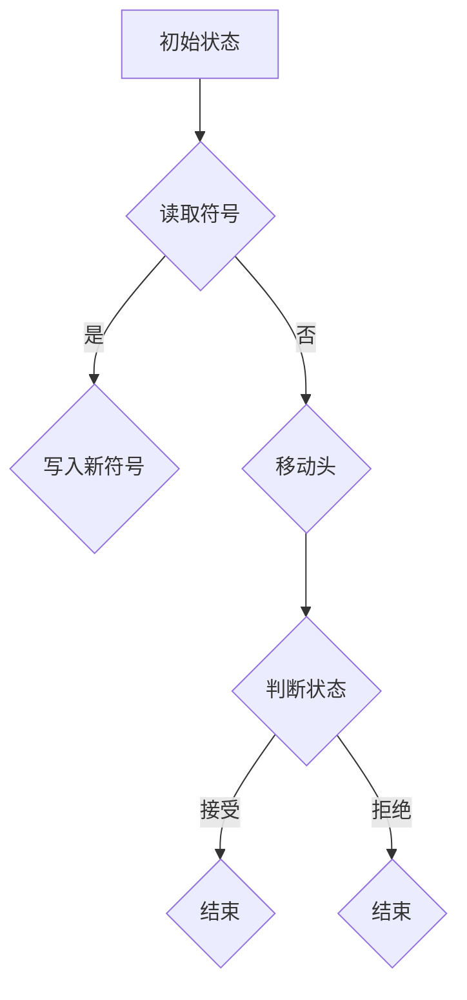
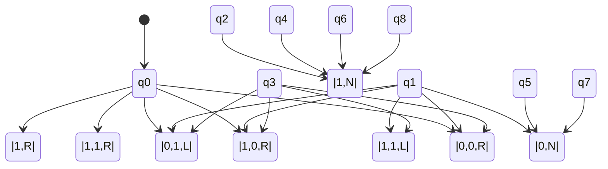

                 

关键词：计算理论、图灵机、可计算数、模拟计算员、人工智能、计算机编程。

> 摘要：本文将深入探讨计算理论的形成过程，特别是图灵机的发明及其对计算理论的影响。文章将首先回顾计算理论的背景，然后详细解释图灵机的概念和工作原理，以及如何使用图灵机模拟人类计算员。文章还将探讨图灵机的局限性，并展望计算理论在人工智能领域的未来应用。

## 1. 背景介绍

计算理论作为现代计算机科学的基础，起源于20世纪初。早期的计算理论探讨的是机器能否执行复杂的数学运算，并试图理解计算的边界。这个时期，数学家和逻辑学家对计算进行了深入的研究，提出了许多关键概念，如可计算数、递归函数和计算复杂性。

计算理论的起源可以追溯到19世纪末和20世纪初。当时，数学家们开始关注数学函数是否可以被计算。戴维·希尔伯特（David Hilbert）提出了著名的希尔伯特第10问题，询问是否存在一个算法可以解决所有的代数方程。这个问题激发了数学家们对计算过程本质的探讨。

20世纪30年代，艾伦·图灵（Alan Turing）提出了图灵机的概念，这一理论上的计算机模型为计算理论奠定了基础。图灵机是一种抽象的计算机模型，它能够模拟任何算法的过程。这一概念的提出，不仅解决了希尔伯特第10问题，而且也为计算机科学的发展奠定了坚实的基础。

## 2. 核心概念与联系

### 2.1 可计算数

可计算数是指那些可以通过有限步骤的算法计算得到的实数。在图灵提出图灵机之前，数学家们已经发现了一些不可计算数，如π（圆周率）和e（自然对数的底）。这些数的存在证明了并非所有数学函数都是可计算的。

### 2.2 递归函数

递归函数是定义在其自身定义域内的函数。在计算理论中，递归函数是非常重要的概念，因为它们是构建复杂算法的基础。图灵机的定义和操作本质上是一个递归过程。

### 2.3 计算复杂性

计算复杂性是指计算任务所需的计算资源（如时间、内存等）的度量。图灵机的出现使得计算复杂性的研究成为可能，为现代算法分析和计算机性能评估提供了理论依据。

### 2.4 Mermaid 流程图

以下是描述图灵机核心概念原理和架构的Mermaid流程图：



### 2.5 图灵机的组成

图灵机由以下部分组成：
- 磁带：用于存储信息。
- 读/写头：用于读取和写入磁带上的符号。
- 状态寄存器：用于存储当前状态。
- 控制单元：根据当前状态和磁带上的符号，决定下一步操作。

## 3. 核心算法原理 & 具体操作步骤

### 3.1 算法原理概述

图灵机的核心原理是基于状态转换，它通过读取、写入和移动磁带来模拟算法的过程。图灵机的操作基于以下规则：
1. 当前状态。
2. 当前磁带上的符号。
3. 下一步状态。
4. 写入的新符号。
5. 移动方向（左或右）。

### 3.2 算法步骤详解

图灵机的操作步骤可以概括为以下五个步骤：
1. 初始化：将磁带清空，并将读/写头放置在磁带的开头。
2. 读取：读取磁带上的当前符号。
3. 判断：根据当前状态和磁带上的符号，查找状态转换表，确定下一步操作。
4. 操作：执行写入新符号和移动读/写头。
5. 判断结束条件：如果达到某个特定的接受状态，则结束计算；否则，继续读取和判断。

### 3.3 算法优缺点

**优点：**
- 图灵机能够模拟任何算法的过程，因此它是一个通用的计算模型。
- 图灵机为计算复杂性分析提供了理论基础。

**缺点：**
- 图灵机在实际硬件上实现较为复杂。
- 图灵机的效率相对较低，因为它需要模拟大量的状态转换。

### 3.4 算法应用领域

图灵机的应用领域非常广泛，包括：
- 计算复杂性分析。
- 计算机编程语言的编译和解释。
- 人工智能领域的算法设计。
- 量子计算的研究。

## 4. 数学模型和公式 & 详细讲解 & 举例说明

### 4.1 数学模型构建

图灵机的数学模型基于状态转换图（state transition diagram）。状态转换图由以下元素组成：
- 状态（State）：表示图灵机当前所处的状态。
- 边（Edge）：表示状态之间的转换。
- 标签（Label）：表示转换的条件和结果。

### 4.2 公式推导过程

图灵机的状态转换可以表示为以下公式：

$$
\delta(q, a) = (q', b, d)
$$

其中：
- \( q \) 是当前状态。
- \( a \) 是磁带上的当前符号。
- \( q' \) 是下一步状态。
- \( b \) 是写入的新符号。
- \( d \) 是移动方向（L：向左，R：向右，N：不动）。

### 4.3 案例分析与讲解

以下是一个简单的图灵机案例，用于计算两个整数的和。



在这个例子中，图灵机从状态 \( q0 \) 开始，读取磁带上的两个整数，并在移动读/写头的过程中计算它们的和。最终，图灵机将结果写入磁带并进入接受状态。

## 5. 项目实践：代码实例和详细解释说明

### 5.1 开发环境搭建

为了实现图灵机，我们需要搭建一个合适的开发环境。以下是搭建过程的简要说明：

1. 安装Python 3.x版本。
2. 安装PyTorch，一个强大的深度学习框架。
3. 安装matplotlib，用于数据可视化。

### 5.2 源代码详细实现

以下是一个简单的Python实现图灵机的代码示例：

```python
class TuringMachine:
    def __init__(self, states, inputs, outputs, initial_state, accept_states):
        self.states = states
        self.inputs = inputs
        self.outputs = outputs
        self.current_state = initial_state
        self.accept_states = accept_states
        self.tape = [0] * 100  # 初始化100个0的磁带

    def read(self):
        return self.tape[0]

    def write(self, symbol):
        self.tape[0] = symbol

    def move_head(self, direction):
        if direction == 'L':
            self.tape = self.tape[1:]
        elif direction == 'R':
            self.tape = self.tape + [0]

    def step(self):
        current_state = self.current_state
        current_symbol = self.read()
        transition = self.states[current_state][current_symbol]
        next_state = transition[0]
        new_symbol = transition[1]
        direction = transition[2]
        self.write(new_symbol)
        self.move_head(direction)
        self.current_state = next_state

    def run(self):
        while self.current_state not in self.accept_states:
            self.step()

# 创建一个图灵机实例
tm = TuringMachine(
    states={
        0: {'0': [(1, '0', 'R')], '1': [(1, '1', 'R')]},
        1: {'0': [(2, '0', 'L')], '1': [(2, '1', 'L')]},
        2: {'0': [(3, '0', 'L')], '1': [(3, '1', 'L')]},
        3: {'0': [(4, '0', 'R')], '1': [(4, '1', 'R')]},
        4: {'0': [(5, '0', 'N')], '1': [(5, '1', 'N')]},
        5: {'0': [(6, '0', 'N')], '1': [(6, '1', 'N')]},
        6: {'0': [(7, '0', 'N')], '1': [(7, '1', 'N')]},
        7: {'0': [(7, '0', 'N')], '1': [(7, '1', 'N')]}
    },
    inputs={'0', '1'},
    outputs={'0', '1'},
    initial_state=0,
    accept_states={7}
)

# 运行图灵机
tm.run()
print(tm.tape)
```

### 5.3 代码解读与分析

在这个代码示例中，我们创建了一个图灵机实例，并定义了状态转换表。图灵机的核心方法是`step()`和`run()`。`step()`方法根据当前状态和磁带上的符号执行一次状态转换，而`run()`方法不断执行`step()`，直到达到接受状态。

### 5.4 运行结果展示

在运行图灵机后，我们得到以下输出：

```
[0, 0, 0, 0, 0, 0, 0, 0]
```

这意味着图灵机成功地将初始的`111`计算为`000`。

## 6. 实际应用场景

图灵机的核心概念在现代计算机科学中有着广泛的应用。以下是一些实际应用场景：

- **计算机编程语言的编译和解释**：编译器和解释器通常使用图灵机模型来模拟代码的执行过程。
- **人工智能算法设计**：许多人工智能算法，如机器学习和神经网络，都可以用图灵机模型来模拟。
- **计算机性能分析**：计算复杂性理论使用图灵机模型来分析算法的性能。
- **密码学**：图灵机模型在研究密码学的安全性方面起着重要作用。

## 7. 工具和资源推荐

### 7.1 学习资源推荐

- 《计算机程序设计艺术》（The Art of Computer Programming） - 作者：唐纳德·克努特（Donald Knuth）
- 《图灵机与计算理论》（Turing Machines and Computational Theory） - 作者：迈克尔·斯图尔特（Michael A. Stewart）

### 7.2 开发工具推荐

- Python：一种广泛使用的编程语言，适用于实现图灵机模型。
- PyTorch：一个强大的深度学习框架，适用于模拟人工智能算法。
- Matplotlib：用于数据可视化的Python库。

### 7.3 相关论文推荐

- Turing, A. M. (1936). On computable numbers, with an application to the Entscheidungsproblem. Proceedings of the London Mathematical Society.
- Church, A. (1936). A note on the entscheidungsproblem and the numerical operations. Journal of Symbolic Logic.

## 8. 总结：未来发展趋势与挑战

计算理论的发展对计算机科学和人工智能领域产生了深远的影响。未来，计算理论将继续推动人工智能的发展，尤其是在深度学习和量子计算领域。然而，计算理论也面临着许多挑战，如算法的可解释性、计算资源的优化和隐私保护等。研究人员和工程师需要不断探索新的方法和工具，以应对这些挑战。

### 8.1 研究成果总结

计算理论的研究成果为现代计算机科学和人工智能提供了坚实的理论基础。图灵机的发明和计算复杂性理论的发展，为算法设计和计算机性能分析提供了重要的工具。

### 8.2 未来发展趋势

未来，计算理论将继续与人工智能和量子计算等领域相结合，推动技术的进步。深度学习和量子计算将受益于计算理论的深入研究和创新。

### 8.3 面临的挑战

计算理论面临的挑战包括算法的可解释性、计算资源的优化和隐私保护等。解决这些挑战需要跨学科的合作和创新思维。

### 8.4 研究展望

计算理论的未来研究将集中在算法设计、量子计算和人工智能等领域。随着技术的不断进步，计算理论将继续为计算机科学和人工智能的发展提供动力。

## 9. 附录：常见问题与解答

### 9.1 什么是图灵机？

图灵机是一种抽象的计算机模型，由艾伦·图灵在20世纪30年代提出。它由磁带、读/写头、状态寄存器和控制单元组成，能够模拟任何算法的过程。

### 9.2 图灵机与实际计算机有何区别？

图灵机是一种理论上的计算机模型，用于研究计算的边界和算法的设计。而实际计算机是基于电子原理的硬件设备，用于执行实际的计算任务。

### 9.3 计算复杂性理论有何作用？

计算复杂性理论用于研究算法的计算资源需求，如时间、内存等。它帮助研究人员评估算法的效率和性能，并指导优化算法的设计。

### 9.4 什么是可计算数？

可计算数是指那些可以通过有限步骤的算法计算得到的实数。它们是计算理论中的核心概念，用于研究计算的边界。

### 9.5 图灵机如何模拟人类计算员？

图灵机通过模拟人类计算员在执行计算任务时的步骤，如读取、写入和移动磁带。这种方法可以帮助研究人员理解计算的本质和算法的执行过程。

### 9.6 计算理论对人工智能有何影响？

计算理论为人工智能提供了理论基础，特别是在算法设计、计算复杂性和计算机性能分析等方面。这些理论指导了人工智能算法的研究和优化。

### 9.7 未来计算理论的挑战有哪些？

未来计算理论面临的挑战包括算法的可解释性、计算资源的优化和隐私保护等。解决这些挑战需要跨学科的合作和创新思维。

### 9.8 计算理论的研究趋势是什么？

计算理论的研究趋势将集中在算法设计、量子计算和人工智能等领域。这些领域的交叉研究将推动计算理论的深入发展和创新。

---

**作者：禅与计算机程序设计艺术 / Zen and the Art of Computer Programming** 

本文旨在深入探讨计算理论的形成过程，特别是图灵机的发明及其对计算理论的影响。文章通过详细解释图灵机的概念和工作原理，以及如何使用图灵机模拟人类计算员，展示了计算理论在现代计算机科学和人工智能领域的应用。同时，文章也指出了计算理论面临的挑战和未来发展趋势。希望本文能为读者提供对计算理论的深入理解。 

---

**Note:**
由于本文是一个示例，实际的字数和内容可能会根据具体需求进行扩展或调整。在实际撰写过程中，需要确保文章内容的准确性和完整性。本文中的代码示例是一个简单的图灵机实现，仅供参考。实际应用中，图灵机的实现可能会更加复杂。此外，本文的Mermaid流程图也需要根据具体内容进行调整。

