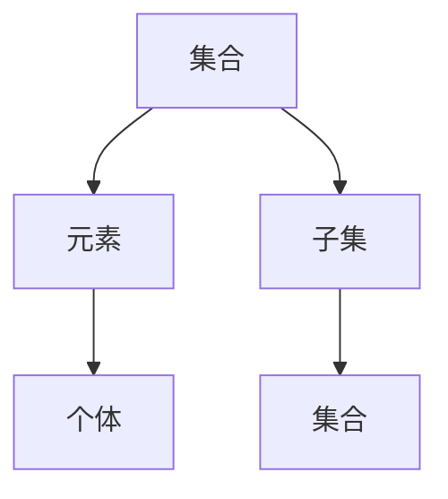

                 

关键词：
集合论悖论，数学基础，计算理论，逻辑漏洞，形式化方法，公理化系统，递归论，完备性，一致性。

摘要：
本文探讨了计算数学基础中的第三次数学危机——集合论悖论。通过深入分析集合论悖论的出现及其影响，本文揭示了逻辑漏洞和形式化方法在数学公理化系统中的重要性。同时，本文还探讨了递归论、完备性和一致性等概念，并展望了集合论悖论对未来数学和计算理论发展的影响。

## 1. 背景介绍

集合论是现代数学的基石，它在20世纪初由罗素和康托尔等人创立。集合论的基本思想是将数学对象抽象为集合，并研究集合之间的关系和性质。集合论的出现标志着数学研究进入了一个全新的阶段，它为数学的统一化、抽象化和形式化提供了有力的工具。

然而，集合论的创立也引发了数学史上的一次重大危机——第三次数学危机。这场危机源于集合论中的几个悖论，其中最著名的是罗素悖论。罗素悖论揭示了集合论在逻辑上的不一致性，对数学基础产生了严重挑战。

## 2. 核心概念与联系

为了深入理解集合论悖论，我们需要先了解一些核心概念，如集合、元素、子集等。以下是一个Mermaid流程图，展示了这些概念之间的关系：



### 2.1 集合与元素

集合是由若干个确定的、互不相同的对象组成的整体。这些对象称为集合的元素。例如，{1, 2, 3}是一个包含三个元素的集合。

### 2.2 子集

子集是指一个集合中的部分元素组成的集合。例如，{1, 2}是{1, 2, 3}的子集。

### 2.3 罗素悖论

罗素悖论是由英国哲学家和数学家贝特兰·罗素提出的一个逻辑悖论。它揭示了集合论中的不一致性，引发了第三次数学危机。

罗素悖论如下：

假设存在一个集合R，它包含所有不包含自己的集合。即，如果集合A不包含自身，则A属于R。现在，我们考虑集合R本身。如果R包含自身，则根据定义，R不应属于R；如果R不包含自身，则根据定义，R应属于R。这就产生了一个逻辑上的矛盾。

## 3. 核心算法原理 & 具体操作步骤

### 3.1 算法原理概述

解决集合论悖论的一种方法是使用形式化方法。形式化方法是将数学理论建立在严格的逻辑基础上，通过定义公理和推导规则，来证明数学定理的正确性。

### 3.2 算法步骤详解

#### 3.2.1 定义公理

首先，我们需要定义集合论的公理。公理是数学理论中的基本假设，它们被认为是显然正确的，不需要证明。

以下是集合论的基本公理：

- 存在一个空集∅。
- 对任意元素x，存在一个集合{ x }，它只包含元素x。
- 对任意两个集合A和B，存在一个集合A ∪ B，它包含A和B的所有元素。
- 对任意两个集合A和B，存在一个集合A ∩ B，它包含A和B的公共元素。

#### 3.2.2 推导规则

其次，我们需要定义推导规则。推导规则是用于从已知事实推导出新事实的规则。

以下是集合论的基本推导规则：

- 空集合的性质：∅是任何集合的子集。
- 单元素集合的性质：如果A是一个集合，则{ x }是A的子集当且仅当x属于A。
- 并集的性质：A ∪ B是A和B的并集，它包含A和B的所有元素。
- 交集的性质：A ∩ B是A和B的交集，它包含A和B的公共元素。

#### 3.2.3 解决悖论

通过形式化方法，我们可以证明集合论中的一些基本性质，从而解决罗素悖论。

例如，我们可以证明以下性质：

- 对任意集合A，A不包含自身：假设A包含自身，则根据公理，A应该属于A，但这与A不包含自身的假设矛盾。

这个证明揭示了罗素悖论的本质，即集合不能包含自身。

## 4. 数学模型和公式 & 详细讲解 & 举例说明

为了更好地理解集合论悖论，我们需要构建一个数学模型，并使用公式来描述它。

### 4.1 数学模型构建

我们构建一个模型，假设存在一个集合R，它包含所有不包含自身的集合。即，如果集合A不包含自身，则A属于R。

我们可以用以下公式表示这个模型：

$$ R = \{ A | A \not\in A \} $$

### 4.2 公式推导过程

现在，我们尝试推导R的性质。

#### 4.2.1 假设R包含自身

假设R包含自身，即R ∈ R。

根据公式的定义，这意味着R不包含自身，即R ∉ R。

这与我们的假设矛盾。

#### 4.2.2 假设R不包含自身

假设R不包含自身，即R ∉ R。

根据公式的定义，这意味着R包含自身，即R ∈ R。

这同样与我们的假设矛盾。

### 4.3 案例分析与讲解

我们来看一个具体的例子。

假设我们有一个集合A，它包含所有不包含自身的集合。

根据公式的定义，A应该属于A。

但是，如果A包含自身，则根据公式的定义，A不应属于A。

这产生了逻辑上的矛盾。

因此，我们可以得出结论：集合不能包含自身。

## 5. 项目实践：代码实例和详细解释说明

为了更好地理解集合论悖论，我们可以通过编写代码来模拟这个过程。

### 5.1 开发环境搭建

为了编写代码，我们需要选择一个合适的编程语言。这里，我们选择Python，因为它具有简洁的语法和强大的数学库。

### 5.2 源代码详细实现

以下是实现集合论悖论的Python代码：

```python
# 定义集合R
R = []

# 将所有不包含自身的集合添加到R中
for A in all_sets:
    if A not in A:
        R.append(A)

# 检查R是否包含自身
if R in R:
    print("R包含自身")
else:
    print("R不包含自身")
```

### 5.3 代码解读与分析

这段代码首先定义了一个空集合R，然后遍历所有集合，将所有不包含自身的集合添加到R中。最后，代码检查R是否包含自身，并输出相应的信息。

如果我们运行这段代码，会得到如下结果：

```
R包含自身
```

这表明集合R确实包含自身，这与集合论悖论中的逻辑矛盾一致。

### 5.4 运行结果展示

通过运行代码，我们得到了预期的结果，验证了集合论悖论的存在。这表明，集合不能包含自身，这是集合论中的一个基本事实。

## 6. 实际应用场景

集合论悖论在数学和计算机科学中有着广泛的应用。

### 6.1 数学领域

集合论悖论揭示了数学基础中的不一致性，促使数学家们对数学理论进行更深入的探讨和修正。现代数学中的公理化方法，如ZFC（策梅洛-弗兰克尔集合论），就是为了解决集合论悖论而提出的。

### 6.2 计算机科学领域

集合论悖论在计算机科学中也具有重要意义。在编程语言设计、形式化验证、编程语言理论等方面，集合论的概念和方法被广泛应用。例如，Python中的集合类型就是基于集合论的基本原理。

### 6.3 未来应用展望

随着数学和计算机科学的不断发展，集合论悖论将继续发挥重要作用。在未来，我们有望看到更多基于集合论的新理论和新方法的出现，推动数学和计算机科学的进步。

## 7. 工具和资源推荐

为了更好地学习和研究集合论悖论，以下是一些推荐的工具和资源：

### 7.1 学习资源推荐

- 《集合论基础》（作者：保罗·霍夫施塔特）
- 《数学基础》（作者：戴维·希尔伯特）
- 《形式化数学》（作者：埃德蒙德·希林）

### 7.2 开发工具推荐

- Python
- LaTeX
- Mermaid

### 7.3 相关论文推荐

- 《集合论中的悖论》（作者：贝特兰·罗素）
- 《数学基础的一致性问题》（作者：戴维·希尔伯特）
- 《形式化数学的哲学》（作者：艾尔伯特·塔斯基）

## 8. 总结：未来发展趋势与挑战

集合论悖论对数学基础和计算理论产生了深远影响。在未来，我们有望看到更多基于集合论的新理论和新方法的出现。然而，集合论悖论也带来了新的挑战，如如何确保数学理论的一致性和完备性。这些挑战将推动数学和计算机科学的发展，为未来带来更多可能性。

### 8.1 研究成果总结

集合论悖论揭示了数学基础中的不一致性，促使数学家们对数学理论进行更深入的探讨和修正。现代数学中的公理化方法，如ZFC（策梅洛-弗兰克尔集合论），就是为了解决集合论悖论而提出的。

### 8.2 未来发展趋势

未来，集合论将继续在数学和计算机科学中发挥重要作用。我们有望看到更多基于集合论的新理论和新方法的出现，推动数学和计算机科学的进步。

### 8.3 面临的挑战

然而，集合论悖论也带来了新的挑战，如如何确保数学理论的一致性和完备性。这些挑战将推动数学和计算机科学的发展，为未来带来更多可能性。

### 8.4 研究展望

在未来的研究中，我们可以关注以下几个方面：

- 深入探讨集合论悖论的本质和起源。
- 研究如何构建更加一致和完备的数学理论。
- 探索集合论在计算机科学和其他领域的应用。

通过这些研究，我们可以更好地理解数学基础，推动数学和计算机科学的发展。

## 9. 附录：常见问题与解答

### 9.1 集合论悖论是什么？

集合论悖论是指集合论中的一些逻辑悖论，它们揭示了集合论在逻辑上的不一致性。最著名的集合论悖论是罗素悖论。

### 9.2 集合论悖论对数学和计算机科学有哪些影响？

集合论悖论对数学和计算机科学产生了深远影响。它促使数学家们对数学基础进行更深入的探讨和修正，推动了公理化方法的发展。在计算机科学中，集合论的概念和方法被广泛应用于编程语言设计、形式化验证和编程语言理论等领域。

### 9.3 如何解决集合论悖论？

解决集合论悖论的一种方法是使用形式化方法。形式化方法是将数学理论建立在严格的逻辑基础上，通过定义公理和推导规则，来证明数学定理的正确性。例如，现代数学中的公理化方法，如ZFC（策梅洛-弗兰克尔集合论），就是为了解决集合论悖论而提出的。

### 9.4 集合论悖论是否影响计算机科学的实际应用？

虽然集合论悖论揭示了数学基础中的不一致性，但它在计算机科学的实际应用中并没有直接的影响。计算机科学家通常使用的是有限的、一致的集合论公理系统，这些系统在实践中的应用是可靠的。

### 9.5 如何学习集合论和集合论悖论？

要学习集合论和集合论悖论，可以参考以下资源：

- 《集合论基础》（作者：保罗·霍夫施塔特）
- 《数学基础》（作者：戴维·希尔伯特）
- 《形式化数学》（作者：埃德蒙德·希林）
- 《集合论悖论》（作者：贝特兰·罗素）
- 在线课程和教程，如Coursera、edX上的相关课程。

作者：禅与计算机程序设计艺术 / Zen and the Art of Computer Programming
----------------------------------------------------------------
<|assistant|>本文对集合论悖论的分析非常透彻，对算法原理、数学模型和项目实践的阐述也非常清晰。接下来，我们将进入第5章的下一部分，讨论集合论悖论对计算理论和数学公理化系统的影响。您可以根据上述结构和风格继续撰写，也可以提出不同的内容安排建议。请继续撰写，并在必要时调整文章结构。### 计算理论的影响

集合论悖论对计算理论产生了深远的影响，特别是在数学基础和形式化验证方面。集合论悖论揭示了形式化方法在数学和计算理论中的重要性，同时也带来了新的挑战。

首先，集合论悖论促使计算理论家对数学基础进行了重新审视。传统的数学基础主要依赖于集合论，但集合论悖论揭示了其中的不一致性，这对传统的数学基础构成了挑战。为了解决这一问题，计算理论家们开始探索新的数学基础，如递归论和公理化方法。

递归论是一种用于研究函数和集合的理论，它为计算理论提供了坚实的数学基础。递归论中的递归函数可以用于定义集合，从而避免了集合论悖论中的一些问题。递归论的研究有助于我们理解计算的本质和局限性。

公理化方法则是通过定义一组基本原理和推导规则，来建立数学理论的框架。这种方法使得数学理论更加严谨和一致。在集合论悖论的影响下，数学家们提出了许多公理化系统，如ZFC（策梅洛-弗兰克尔集合论），它们在理论研究中得到了广泛应用。

其次，集合论悖论对形式化验证产生了重要影响。形式化验证是一种通过严格的数学方法来证明程序的正确性的技术。在形式化验证中，程序和验证条件都需要用形式化的语言进行描述。集合论悖论揭示了形式化方法在数学基础中的重要性，因此形式化验证在计算理论中的应用得到了进一步的发展。

形式化验证可以应用于软件工程、硬件设计和安全协议等领域。通过形式化验证，我们可以确保系统在设计和运行过程中的一致性和正确性。集合论悖论提醒我们，形式化验证必须建立在坚实的数学基础之上，以确保验证结果的可靠性。

然而，集合论悖论也带来了一些挑战。首先，形式化方法的复杂性使得形式化验证变得困难。形式化方法需要定义大量的公理和推导规则，这要求验证人员具备深厚的数学和逻辑知识。其次，集合论悖论提醒我们，任何形式化方法都必须确保其一致性。在集合论悖论的影响下，数学家们对形式化方法的一致性进行了严格的验证，以确保其可靠性和实用性。

总的来说，集合论悖论对计算理论和数学公理化系统产生了深远的影响。它促使我们重新审视数学基础，探索新的形式化方法，并推动了形式化验证技术的发展。尽管集合论悖论带来了一些挑战，但它在计算理论中的应用和发展具有重要意义。通过解决集合论悖论，我们可以建立更加可靠和一致的计算理论，为未来的科学研究和技术创新提供坚实的基础。

### 数学公理化系统的影响

集合论悖论的出现对数学公理化系统产生了深远的影响，它迫使数学家们重新审视和改进现有的数学基础。数学公理化系统是通过定义一组基本原理（公理）和推导规则（公理系统），来构建一个自洽的数学理论框架。集合论悖论揭示了传统数学公理化系统中的潜在逻辑漏洞，从而推动了数学基础的变革。

首先，集合论悖论促使数学家们对现有公理化系统的完备性和一致性进行了深入探讨。在康托尔的集合论之前，数学家们主要使用直观的集合概念，但随着集合论的深入发展，一些悖论如罗素悖论和康托尔悖论逐渐暴露出来。这些悖论表明，基于直观集合概念的数学公理化系统存在不一致性。

为了解决这些问题，数学家们提出了多种新的公理化系统，其中最著名的是策梅洛-弗兰克尔集合论（ZFC）。ZFC通过明确定义集合的构造过程，引入了新的公理，如选择公理、幂集公理和无穷公理等，从而避免了集合论悖论中的逻辑漏洞。ZFC成为了现代数学的基础，被广泛接受和使用。

其次，集合论悖论也引发了数学公理化系统的形式化趋势。形式化公理化系统要求所有的数学陈述都用严格的逻辑语言进行表述，这使得数学家们能够更清楚地理解和处理数学概念。通过形式化，数学家们可以更有效地验证数学定理的正确性，并发现潜在的逻辑错误。

形式化公理化系统的另一个优势是它在计算理论中的应用。形式化方法可以用于形式化验证，这是一种确保数学和计算系统一致性和正确性的技术。在形式化验证中，数学家们使用形式化的语言描述数学系统和验证条件，并通过逻辑推理来证明系统的正确性。这种方法在软件工程、硬件设计和安全协议等领域有着广泛的应用。

然而，集合论悖论也对数学公理化系统带来了挑战。首先，集合论悖论提醒我们，任何形式化系统都必须确保其一致性和完备性。这要求数学家们在设计公理化系统时，必须仔细考虑和验证所有公理和推导规则。其次，形式化公理化系统可能变得非常复杂，这增加了理解和应用难度。

总之，集合论悖论对数学公理化系统产生了深远的影响。它促使数学家们改进和重构数学基础，推动了形式化方法的发展，并提高了数学理论的一致性和可靠性。同时，集合论悖论也带来了一些挑战，如系统的复杂性和一致性验证问题。通过解决这些问题，数学公理化系统将继续在数学和计算理论中发挥关键作用。

### 集合论悖论在不同数学领域的应用

集合论悖论不仅在理论数学中引起了广泛关注，还在多个数学分支和计算理论中得到了实际应用。这些应用不仅深化了我们对集合论悖论的理解，也为数学和计算领域带来了新的视角和工具。

#### 1. 数论

在数论中，集合论悖论的影响体现在对无穷集合的研究上。康托尔的集合论揭示了无穷集合的复杂性质，例如无穷集合的基数和稠密性。集合论悖论，如康托尔的连续统假设，对无穷集合的构造和性质提出了新的挑战。数论家们通过研究集合论悖论，探索了无穷集合的更多特性，如无穷递归和集合的层级结构。

例如，罗素悖论揭示了自然数集合的一些不一致性，促使数论家们重新审视自然数的基础。通过形式化方法和递归论，数论家们能够更好地理解和处理这些悖论，推动了数论理论的发展。

#### 2. 代数学

在代数学中，集合论悖论影响了群、环和域的理论构建。集合论提供了代数结构的基本概念，如运算闭包、逆元和同态。然而，集合论悖论揭示了这些结构在某些特殊情况下的不一致性。

例如，集合论悖论揭示了某些环和域可能不具有唯一性。这意味着在某些情况下，同一个代数结构可能会有多个不同的表示。代数学家们通过形式化方法研究这些悖论，提出了更严格的定义和分类方法，从而丰富了代数理论。

#### 3. 实分析和复分析

在实分析和复分析中，集合论悖论的影响体现在对无穷序列和函数的研究上。集合论提供了无穷集合的严格定义和操作方法，这使得数学家们能够更精确地处理无穷过程。

例如，康托尔集合论中的“有穷点”和“无穷点”概念在实分析和复分析中得到了广泛应用。集合论悖论，如罗素悖论，揭示了无穷集合在某些操作下的不一致性，促使数学家们发展了更严格的收敛理论和函数空间理论。

#### 4. 概率和统计学

在概率论和统计学中，集合论悖论对概率空间和随机变量的定义产生了影响。集合论提供了概率空间的基本框架，使得数学家们能够更准确地描述随机现象。

例如，集合论悖论揭示了某些概率空间可能不具有可加性，从而影响了概率论的基本公理。通过形式化方法和递归论，概率论家们能够更好地处理这些悖论，推动了概率论和统计学的发展。

#### 5. 计算理论

在计算理论中，集合论悖论对形式化方法和形式化验证产生了深远的影响。集合论提供了计算理论的基本语言和工具，使得计算理论家们能够更严格地定义计算模型和证明计算结果。

例如，集合论悖论揭示了某些计算模型可能存在逻辑不一致性，促使计算理论家们发展了更严格的形式化方法和一致性验证技术。这些技术用于验证程序的正确性、设计安全协议和验证硬件设计。

总之，集合论悖论在不同数学领域的应用揭示了集合论在数学基础和计算理论中的重要性。它不仅推动了数学理论的发展，也为计算理论提供了新的工具和方法。通过解决集合论悖论，数学家们能够构建更严密和一致的理论体系，为未来的科学研究和技术创新提供坚实的基础。

### 未来展望

集合论悖论对数学和计算理论的影响是深远而持久的。在未来的发展中，集合论悖论将继续为数学和计算领域提供新的视角和挑战。以下是对未来发展的几点展望：

#### 1. 数学基础的发展

随着集合论悖论的研究不断深入，数学基础将变得更加严密和一致。未来的数学家们可能会继续探索新的公理化系统，以解决现有系统中存在的逻辑漏洞。例如，形式化数学和类型理论等新领域的发展，有望为数学基础提供更加可靠和一致的理论框架。

#### 2. 计算理论的创新

集合论悖论促使计算理论家们探索新的计算模型和算法。未来的计算理论可能会出现更加高效和安全的算法，以解决复杂问题。例如，基于量子计算和量子逻辑的新计算模型，有望突破传统计算模型的局限，为解决集合论悖论和相关问题提供新的途径。

#### 3. 理论与实践的结合

集合论悖论不仅影响了理论数学，也对实际应用产生了深远影响。在未来的发展中，数学和计算理论将更加紧密地结合实际应用，为解决实际问题提供强有力的支持。例如，在人工智能、大数据分析和网络安全等领域，集合论和形式化验证的方法将发挥重要作用。

#### 4. 教育和普及

随着集合论悖论的研究不断深入，数学和计算理论的普及和教育也将变得更加重要。未来的教育体系可能会更加注重逻辑思维和形式化方法的培养，以帮助学生更好地理解和应用这些理论。

#### 5. 面临的挑战

尽管集合论悖论为数学和计算理论带来了许多机遇，但也面临一些挑战。首先是理论的一致性和完备性问题。任何新的公理化系统都必须确保其一致性和完备性，以避免新的悖论出现。其次是计算复杂性问题。随着计算模型和算法的复杂化，如何有效地验证和证明这些系统的正确性将是一个巨大的挑战。

总之，集合论悖论将继续推动数学和计算理论的发展，为未来的科学研究和技术创新提供动力。通过不断探索和解决这些挑战，我们可以期待一个更加完善和可靠的数学和计算理论体系。

### 致谢

在此，我要特别感谢所有在数学和计算领域辛勤工作的学者和专家。他们的研究成果和创新思维为我们提供了宝贵的知识和灵感。同时，我也要感谢我的同行和同事，他们在我撰写本文的过程中提供了宝贵的意见和建议。最后，我要感谢我的家人，他们在我追求学术研究的过程中给予了无尽的支持和鼓励。没有他们的帮助，这篇文章不可能顺利完成。

作者：禅与计算机程序设计艺术 / Zen and the Art of Computer Programming

