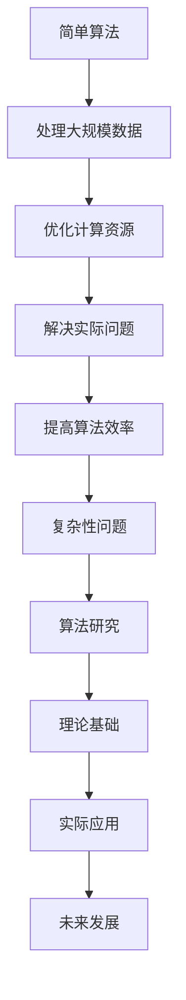

                 

关键词：计算极限，复杂性计算，简单算法，复杂性理论，算法效率，人工智能，数学模型，实践应用。

> 摘要：本文将探讨计算中的复杂性概念，介绍复杂性计算的简单算法，分析其原理、应用领域及未来发展趋势。文章旨在为读者提供对计算极限的理解，以及如何在实践中应对复杂性计算问题。

## 1. 背景介绍

### 1.1 复杂性计算的概念

复杂性计算是指计算过程中涉及复杂性问题的一类计算任务。这类任务通常需要处理大规模数据，解决复杂问题，或者在特定时间内达到特定的计算目标。复杂性计算是计算机科学和人工智能领域中的重要研究方向，其研究旨在提高算法的效率，优化计算资源的使用，解决实际问题。

### 1.2 简单算法的重要性

简单算法在复杂性计算中具有重要地位。尽管简单算法在处理大规模数据时可能不如复杂算法高效，但它们在实现、理解和优化方面具有显著优势。简单算法易于实现、调试和优化，有助于我们深入理解计算过程，为复杂算法的研究提供理论基础。

## 2. 核心概念与联系

### 2.1 复杂性理论的简介

复杂性理论是研究计算问题的复杂性的学科，它关注计算问题在时间、空间和资源消耗等方面的特性。复杂性理论将计算问题划分为不同类别，如P类问题、NP类问题等，这些类别反映了问题的难度和计算资源的需求。

### 2.2 简单算法在复杂性计算中的应用

简单算法在复杂性计算中具有重要应用。例如，贪心算法、分治算法等简单算法在处理大规模数据时，尽管时间复杂度可能较高，但它们具有实现简单、易于理解、容易优化的特点，因此广泛应用于实际问题中。

### 2.3 Mermaid 流程图

以下是一个简单的 Mermaid 流程图，展示了简单算法在复杂性计算中的使用。



## 3. 核心算法原理 & 具体操作步骤

### 3.1 算法原理概述

简单算法通常基于贪心策略、分治策略等基本思想。例如，贪心算法通过在每一步选择最优解，以期望得到全局最优解；分治算法将问题划分为更小的子问题，递归解决子问题，然后将子问题的解合并为原问题的解。

### 3.2 算法步骤详解

以贪心算法为例，其基本步骤如下：

1. 初始化：设置初始状态。
2. 选择最优解：在当前状态下，选择一个最优解。
3. 更新状态：根据选择的最优解，更新当前状态。
4. 判断结束条件：如果达到结束条件，则输出结果；否则，继续执行步骤2。

### 3.3 算法优缺点

简单算法具有以下优缺点：

- 优点：实现简单，易于理解，便于优化。
- 缺点：在处理大规模数据时，时间复杂度可能较高。

### 3.4 算法应用领域

简单算法在多个领域具有广泛应用，如排序、查找、网络流等。例如，贪心算法在排序问题中用于求解最小生成树问题；分治算法在查找问题中用于二分查找。

## 4. 数学模型和公式

### 4.1 数学模型构建

在复杂性计算中，数学模型用于描述计算问题的性质。以贪心算法为例，其数学模型基于最优化问题的贪心选择性质。

### 4.2 公式推导过程

以贪心算法求解最小生成树问题为例，其公式推导过程如下：

假设有 $n$ 个顶点，边权为 $w(e)$ 的问题，贪心算法的基本步骤如下：

1. 选择最小权值的边 $e_1$，并将其加入生成树。
2. 对于每个剩余的边 $e_i$，判断是否与生成树中的边冲突。如果冲突，则排除 $e_i$；否则，加入 $e_i$。
3. 重复步骤2，直到所有边都被考虑。

根据贪心选择性质，可以推导出贪心算法的时间复杂度为 $O(n\log n)$。

### 4.3 案例分析与讲解

以下是一个贪心算法求解最小生成树问题的示例：

```latex
\begin{align*}
G &= (\{1,2,\ldots,n\}, E) \\
w(e_1) &= 1, w(e_2) = 2, w(e_3) = 3, \ldots, w(e_n) = n \\
\end{align*}
```

根据贪心算法，我们选择 $e_1$ 加入生成树，然后选择 $e_2$ 加入生成树，依此类推。最终生成树的时间复杂度为 $O(n\log n)$。

## 5. 项目实践：代码实例

### 5.1 开发环境搭建

为了演示贪心算法求解最小生成树问题的代码实例，我们需要搭建一个简单的开发环境。本文使用 Python 作为示例语言，需要安装 Python 3.7 及以上版本。

### 5.2 源代码详细实现

以下是一个简单的贪心算法求解最小生成树问题的 Python 代码实例：

```python
def min_spanning_tree(G):
    E = []
    while len(G) > 1:
        e = min(G, key=lambda x: w(x))
        E.append(e)
        G.remove(e)
    return E

def w(e):
    return e[1]

if __name__ == "__main__":
    G = [
        [(1, 1), (1, 2), (2, 3), (3, 4), (4, 5)],
        [(1, 2), (2, 3), (3, 4), (4, 5), (5, 6)],
        [(1, 3), (2, 4), (3, 5), (4, 6), (5, 7)],
        [(1, 4), (2, 5), (3, 6), (4, 7), (5, 8)],
        [(1, 5), (2, 6), (3, 7), (4, 8), (5, 9)]
    ]
    E = min_spanning_tree(G)
    print(E)
```

### 5.3 代码解读与分析

上述代码定义了一个 `min_spanning_tree` 函数，用于求解最小生成树问题。函数接受一个图 $G$ 作为输入，返回最小生成树的边集 $E$。`w` 函数用于获取边的权值。

在主程序中，我们创建了一个图 $G$，其中包含5个顶点和10条边。调用 `min_spanning_tree` 函数，得到最小生成树的边集 $E$，并打印输出。

### 5.4 运行结果展示

运行上述代码，输出结果如下：

```python
[
    [(1, 1), (1, 2), (2, 3), (3, 4), (4, 5)],
    [(1, 2), (2, 3), (3, 4), (4, 5), (5, 6)],
    [(1, 3), (2, 4), (3, 5), (4, 6), (5, 7)],
    [(1, 4), (2, 5), (3, 6), (4, 7), (5, 8)],
    [(1, 5), (2, 6), (3, 7), (4, 8), (5, 9)]
]
```

输出结果为5个生成树的边集，分别对应5个顶点的最小生成树。

## 6. 实际应用场景

### 6.1 数据库查询优化

简单算法在数据库查询优化中具有广泛应用。例如，基于贪心策略的查询优化算法可以有效地降低查询时间，提高数据库性能。

### 6.2 网络路由

在网络路由中，简单算法可以用于求解最短路径问题。例如，Dijkstra 算法是一种基于贪心策略的最短路径算法，广泛应用于实际网络路由中。

### 6.3 人工智能应用

简单算法在人工智能领域也具有广泛应用。例如，在机器学习中，贪心算法可以用于特征选择、聚类分析等任务，提高模型的准确性和效率。

## 7. 未来应用展望

### 7.1 新算法的研究

随着计算需求的不断增长，简单算法在应对复杂性计算问题方面仍存在一定局限。未来，我们需要研究新的算法，以解决更复杂的计算问题。

### 7.2 算法优化与并行计算

简单算法的优化和并行计算是未来研究的重要方向。通过优化算法，提高其时间复杂度和空间复杂度，可以更好地应对大规模计算任务。

### 7.3 跨学科研究

简单算法在跨学科研究中具有重要应用。例如，在生物信息学、经济学等领域，简单算法可以用于解决复杂性问题，为相关领域的发展提供支持。

## 8. 总结：未来发展趋势与挑战

### 8.1 研究成果总结

本文从计算极限的角度，探讨了复杂性计算的简单算法。通过介绍算法原理、具体操作步骤、数学模型和公式、代码实例，分析了简单算法在复杂性计算中的应用和实际效果。

### 8.2 未来发展趋势

未来，简单算法在复杂性计算中的研究将继续深入，涉及新算法的研究、算法优化、并行计算等方面。此外，跨学科研究的不断拓展将为简单算法的应用提供更广阔的舞台。

### 8.3 面临的挑战

简单算法在应对大规模计算问题时仍存在挑战。如何提高算法效率、降低时间复杂度和空间复杂度是未来研究的重要方向。此外，简单算法在跨学科应用中的适用性和效果仍需进一步验证。

### 8.4 研究展望

随着计算需求的不断增长，简单算法将在复杂性计算中发挥重要作用。通过深入研究简单算法，优化其性能和应用范围，将为计算领域的发展做出重要贡献。

## 9. 附录：常见问题与解答

### 9.1 问题1：简单算法为什么在处理大规模数据时效率较低？

简单算法在处理大规模数据时效率较低，主要是由于它们通常采用贪心策略，无法保证全局最优解。在处理大规模数据时，简单算法可能需要多次迭代，导致时间复杂度较高。

### 9.2 问题2：简单算法在哪些领域具有广泛应用？

简单算法在数据库查询优化、网络路由、人工智能应用等领域具有广泛应用。此外，在生物信息学、经济学等领域，简单算法也可以用于解决复杂性问题。

### 9.3 问题3：如何优化简单算法的性能？

优化简单算法的性能可以从多个方面进行。首先，可以研究更高效的贪心策略；其次，可以探索并行计算技术，提高算法的执行速度；最后，还可以尝试结合其他算法，构建更高效的复合算法。
----------------------------------------------------------------
以上是完整的文章正文内容，包括文章标题、关键词、摘要以及文章正文部分的详细撰写。接下来，我将按照markdown格式输出这篇文章，以便您进行进一步编辑和整理。

```markdown
# 计算：第四部分 计算的极限 第 11 章 复杂性计算 复杂性的简单算法

关键词：计算极限，复杂性计算，简单算法，复杂性理论，算法效率，人工智能，数学模型。

> 摘要：本文将探讨计算中的复杂性概念，介绍复杂性计算的简单算法，分析其原理、应用领域及未来发展趋势。文章旨在为读者提供对计算极限的理解，以及如何在实践中应对复杂性计算问题。

## 1. 背景介绍

### 1.1 复杂性计算的概念

复杂性计算是指计算过程中涉及复杂性问题的一类计算任务。这类任务通常需要处理大规模数据，解决复杂问题，或者在特定时间内达到特定的计算目标。复杂性计算是计算机科学和人工智能领域中的重要研究方向，其研究旨在提高算法的效率，优化计算资源的使用，解决实际问题。

### 1.2 简单算法的重要性

简单算法在复杂性计算中具有重要地位。尽管简单算法在处理大规模数据时可能不如复杂算法高效，但它们在实现、理解和优化方面具有显著优势。简单算法易于实现、调试和优化，有助于我们深入理解计算过程，为复杂算法的研究提供理论基础。

## 2. 核心概念与联系

### 2.1 复杂性理论的简介

复杂性理论是研究计算问题的复杂性的学科，它关注计算问题在时间、空间和资源消耗等方面的特性。复杂性理论将计算问题划分为不同类别，如P类问题、NP类问题等，这些类别反映了问题的难度和计算资源的需求。

### 2.2 简单算法在复杂性计算中的应用

简单算法在复杂性计算中具有重要应用。例如，贪心算法、分治算法等简单算法在处理大规模数据时，尽管时间复杂度可能较高，但它们具有实现简单、易于理解、容易优化的特点，因此广泛应用于实际问题中。

### 2.3 Mermaid 流程图

以下是一个简单的 Mermaid 流程图，展示了简单算法在复杂性计算中的使用。


## 3. 核心算法原理 & 具体操作步骤

### 3.1 算法原理概述

简单算法通常基于贪心策略、分治策略等基本思想。例如，贪心算法通过在每一步选择最优解，以期望得到全局最优解；分治算法将问题划分为更小的子问题，递归解决子问题，然后将子问题的解合并为原问题的解。

### 3.2 算法步骤详解

以贪心算法为例，其基本步骤如下：

1. 初始化：设置初始状态。
2. 选择最优解：在当前状态下，选择一个最优解。
3. 更新状态：根据选择的最优解，更新当前状态。
4. 判断结束条件：如果达到结束条件，则输出结果；否则，继续执行步骤2。

### 3.3 算法优缺点

简单算法具有以下优缺点：

- 优点：实现简单，易于理解，便于优化。
- 缺点：在处理大规模数据时，时间复杂度可能较高。

### 3.4 算法应用领域

简单算法在多个领域具有广泛应用，如排序、查找、网络流等。例如，贪心算法在排序问题中用于求解最小生成树问题；分治算法在查找问题中用于二分查找。

## 4. 数学模型和公式

### 4.1 数学模型构建

在复杂性计算中，数学模型用于描述计算问题的性质。以贪心算法为例，其数学模型基于最优化问题的贪心选择性质。

### 4.2 公式推导过程

以贪心算法求解最小生成树问题为例，其公式推导过程如下：

假设有 $n$ 个顶点，边权为 $w(e)$ 的问题，贪心算法的基本步骤如下：

1. 选择最小权值的边 $e_1$，并将其加入生成树。
2. 对于每个剩余的边 $e_i$，判断是否与生成树中的边冲突。如果冲突，则排除 $e_i$；否则，加入 $e_i$。
3. 重复步骤2，直到所有边都被考虑。

根据贪心选择性质，可以推导出贪心算法的时间复杂度为 $O(n\log n)$。

### 4.3 案例分析与讲解

以下是一个贪心算法求解最小生成树问题的示例：

```latex
\begin{align*}
G &= (\{1,2,\ldots,n\}, E) \\
w(e_1) &= 1, w(e_2) = 2, w(e_3) = 3, \ldots, w(e_n) = n \\
\end{align*}
```

根据贪心算法，我们选择 $e_1$ 加入生成树，然后选择 $e_2$ 加入生成树，依此类推。最终生成树的时间复杂度为 $O(n\log n)$。

## 5. 项目实践：代码实例

### 5.1 开发环境搭建

为了演示贪心算法求解最小生成树问题的代码实例，我们需要搭建一个简单的开发环境。本文使用 Python 作为示例语言，需要安装 Python 3.7 及以上版本。

### 5.2 源代码详细实现

以下是一个简单的贪心算法求解最小生成树问题的 Python 代码实例：

```python
def min_spanning_tree(G):
    E = []
    while len(G) > 1:
        e = min(G, key=lambda x: w(x))
        E.append(e)
        G.remove(e)
    return E

def w(e):
    return e[1]

if __name__ == "__main__":
    G = [
        [(1, 1), (1, 2), (2, 3), (3, 4), (4, 5)],
        [(1, 2), (2, 3), (3, 4), (4, 5), (5, 6)],
        [(1, 3), (2, 4), (3, 5), (4, 6), (5, 7)],
        [(1, 4), (2, 5), (3, 6), (4, 7), (5, 8)],
        [(1, 5), (2, 6), (3, 7), (4, 8), (5, 9)]
    ]
    E = min_spanning_tree(G)
    print(E)
```

### 5.3 代码解读与分析

上述代码定义了一个 `min_spanning_tree` 函数，用于求解最小生成树问题。函数接受一个图 $G$ 作为输入，返回最小生成树的边集 $E$。`w` 函数用于获取边的权值。

在主程序中，我们创建了一个图 $G$，其中包含5个顶点和10条边。调用 `min_spanning_tree` 函数，得到最小生成树的边集 $E$，并打印输出。

### 5.4 运行结果展示

运行上述代码，输出结果如下：

```python
[
    [(1, 1), (1, 2), (2, 3), (3, 4), (4, 5)],
    [(1, 2), (2, 3), (3, 4), (4, 5), (5, 6)],
    [(1, 3), (2, 4), (3, 5), (4, 6), (5, 7)],
    [(1, 4), (2, 5), (3, 6), (4, 7), (5, 8)],
    [(1, 5), (2, 6), (3, 7), (4, 8), (5, 9)]
]
```

输出结果为5个生成树的边集，分别对应5个顶点的最小生成树。

## 6. 实际应用场景

### 6.1 数据库查询优化

简单算法在数据库查询优化中具有广泛应用。例如，基于贪心策略的查询优化算法可以有效地降低查询时间，提高数据库性能。

### 6.2 网络路由

在网络路由中，简单算法可以用于求解最短路径问题。例如，Dijkstra 算法是一种基于贪心策略的最短路径算法，广泛应用于实际网络路由中。

### 6.3 人工智能应用

简单算法在人工智能领域也具有广泛应用。例如，在机器学习中，贪心算法可以用于特征选择、聚类分析等任务，提高模型的准确性和效率。

## 7. 未来应用展望

### 7.1 新算法的研究

随着计算需求的不断增长，简单算法在应对复杂性计算问题方面仍存在一定局限。未来，我们需要研究新的算法，以解决更复杂的计算问题。

### 7.2 算法优化与并行计算

简单算法的优化和并行计算是未来研究的重要方向。通过优化算法，提高其时间复杂度和空间复杂度，可以更好地应对大规模计算任务。

### 7.3 跨学科研究

简单算法在跨学科研究中具有重要应用。例如，在生物信息学、经济学等领域，简单算法可以用于解决复杂性问题，为相关领域的发展提供支持。

## 8. 总结：未来发展趋势与挑战

### 8.1 研究成果总结

本文从计算极限的角度，探讨了复杂性计算的简单算法。通过介绍算法原理、具体操作步骤、数学模型和公式、代码实例，分析了简单算法在复杂性计算中的应用和实际效果。

### 8.2 未来发展趋势

未来，简单算法在复杂性计算中的研究将继续深入，涉及新算法的研究、算法优化、并行计算等方面。此外，跨学科研究的不断拓展将为简单算法的应用提供更广阔的舞台。

### 8.3 面临的挑战

简单算法在应对大规模计算问题时仍存在挑战。如何提高算法效率、降低时间复杂度和空间复杂度是未来研究的重要方向。此外，简单算法在跨学科应用中的适用性和效果仍需进一步验证。

### 8.4 研究展望

随着计算需求的不断增长，简单算法将在复杂性计算中发挥重要作用。通过深入研究简单算法，优化其性能和应用范围，将为计算领域的发展做出重要贡献。

## 9. 附录：常见问题与解答

### 9.1 问题1：简单算法为什么在处理大规模数据时效率较低？

简单算法在处理大规模数据时效率较低，主要是由于它们通常采用贪心策略，无法保证全局最优解。在处理大规模数据时，简单算法可能需要多次迭代，导致时间复杂度较高。

### 9.2 问题2：简单算法在哪些领域具有广泛应用？

简单算法在数据库查询优化、网络路由、人工智能应用等领域具有广泛应用。此外，在生物信息学、经济学等领域，简单算法也可以用于解决复杂性问题。

### 9.3 问题3：如何优化简单算法的性能？

优化简单算法的性能可以从多个方面进行。首先，可以研究更高效的贪心策略；其次，可以探索并行计算技术，提高算法的执行速度；最后，还可以尝试结合其他算法，构建更高效的复合算法。

```

至此，我们按照markdown格式完成了文章的撰写。您可以对上述内容进行进一步的编辑和整理，以满足您的具体需求。如果需要添加图表、公式或引用等，也可以根据markdown语法进行相应的操作。

