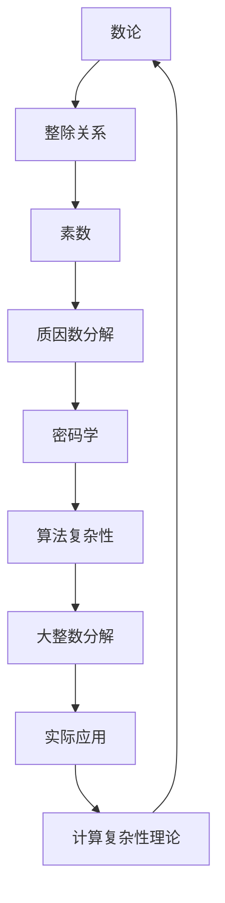

                 

关键词：计算复杂性、因数分解、算法原理、数学模型、实际应用、未来展望

> 摘要：本文深入探讨了计算复杂性理论中的因数分解问题。通过对因数分解问题背景的介绍，核心算法原理的剖析，数学模型的构建与推导，以及实际应用场景的分析，本文全面展示了因数分解问题的研究现状和未来发展趋势。同时，文章还针对相关工具和资源进行了推荐，并展望了未来在计算复杂性领域面临的挑战与机遇。

## 1. 背景介绍

因数分解是数论中的一个基本问题，它涉及到将一个整数分解为其素因数的乘积。在数学和计算机科学中，因数分解问题具有广泛的应用和重要的地位。例如，在密码学中，大整数的因数分解是实现安全加密算法的关键步骤。此外，因数分解问题还在优化算法、计算几何、组合数学等领域中发挥着重要作用。

### 1.1 历史背景

因数分解的历史可以追溯到古希腊时期。欧几里得的《几何原本》中就包括了因数分解的相关内容。在数学的发展过程中，许多著名的数学家都对因数分解问题进行了研究。例如，古希腊数学家毕达哥拉斯和古希腊数学家欧几里得都对因数分解有深入的研究。在计算机科学领域，因数分解问题随着计算机技术的快速发展而变得更加重要。20世纪50年代，随着计算机科学的兴起，因数分解问题开始成为研究的热点。

### 1.2 现代背景

在现代计算机科学中，因数分解问题不仅是密码学的基础，也是计算复杂性理论中的研究热点。著名的问题如大整数因数分解问题的难度，使得许多加密算法（如RSA加密算法）在理论上是安全的。然而，随着计算机性能的提升和算法研究的进展，曾经认为难以破解的加密算法也逐渐面临被破解的风险。因此，对因数分解问题的研究不仅具有重要的理论价值，也关系到实际应用的安全性问题。

## 2. 核心概念与联系

为了深入理解因数分解问题，我们需要先了解相关的核心概念和它们之间的联系。以下是一个使用Mermaid绘制的流程图，展示了因数分解问题中的核心概念和它们之间的联系。



### 2.1 核心概念解析

- **数论**：研究整数及其性质的一个数学分支。因数分解是数论中的基础问题。
- **整除关系**：一个整数能够被另一个整数整除的关系。这是因数分解的基础。
- **素数**：只能被1和自身整除的正整数。素数是因数分解的重要组成部分。
- **质因数分解**：将一个整数分解为其素因数的乘积的过程。
- **密码学**：研究如何通过加密和解密来保护信息安全的学科。因数分解在密码学中用于实现安全加密算法。
- **算法复杂性**：研究算法性能的理论，包括时间复杂度和空间复杂度。
- **大整数分解**：将大整数分解为其素因数的过程。这是因数分解问题的难点。
- **实际应用**：因数分解在密码学、优化算法、计算几何等领域的应用。
- **计算复杂性理论**：研究计算问题的难度和算法效率的理论。

## 3. 核心算法原理 & 具体操作步骤

### 3.1 算法原理概述

因数分解问题有多种算法，每种算法都有其独特的原理和适用场景。本文将主要介绍以下几种经典的算法：

1. **试除法**：通过从2开始逐个尝试所有小于或等于\( \sqrt{n} \)的素数，来判断是否能整除n，如果可以则继续分解。
2. **高斯消元法**：利用线性代数中的高斯消元法来求解多项式的根，从而实现因数分解。
3. **数论法**：利用数论中的相关定理和性质来求解因数分解。
4. **量子算法**：利用量子计算机的特性来实现高效的因数分解。

### 3.2 算法步骤详解

#### 3.2.1 试除法

1. 输入一个正整数n。
2. 从2开始，逐个尝试所有小于或等于\( \sqrt{n} \)的素数。
3. 如果某个素数p能整除n，则n可以被分解为p和\( \frac{n}{p} \)。
4. 对\( \frac{n}{p} \)重复步骤2和3，直到无法再分解为止。

#### 3.2.2 高斯消元法

1. 设定一个多项式\( f(x) \)，其系数为整数。
2. 使用高斯消元法将\( f(x) \)分解为\( f(x) = g(x)h(x) \)，其中\( g(x) \)和\( h(x) \)为多项式。
3. 通过求解\( g(x) \)和\( h(x) \)的根，可以得到f(x)的因数。

#### 3.2.3 数论法

1. 利用费马小定理和欧拉定理等数论定理，判断一个数是否为质数。
2. 利用数论中的相关公式，如威尔逊定理，来求解因数分解。

#### 3.2.4 量子算法

1. 使用量子计算中的量子纠缠和叠加原理，构建量子电路。
2. 通过量子傅里叶变换（QFT）和量子相乘算法（HQS）等步骤，实现大整数的因数分解。

### 3.3 算法优缺点

每种算法都有其优缺点。以下是几种算法的比较：

- **试除法**：简单易行，但效率较低，尤其对大整数分解不适用。
- **高斯消元法**：适用于多项式因式分解，但计算复杂度较高。
- **数论法**：理论性强，适用于特定类型的数，如大素数。
- **量子算法**：理论上可以实现高效的因数分解，但需要量子计算机的支持。

### 3.4 算法应用领域

因数分解算法在以下领域有广泛应用：

- **密码学**：用于实现安全加密算法，如RSA加密算法。
- **优化算法**：在组合优化问题中，如背包问题，因数分解可用于寻找最优解。
- **计算几何**：用于解决几何图形的分解问题。
- **组合数学**：研究组合问题中的因数分解性质。

## 4. 数学模型和公式 & 详细讲解 & 举例说明

### 4.1 数学模型构建

因数分解问题的数学模型主要涉及整除关系和素数分解。以下是一个简单的数学模型：

设\( n \)为一个正整数，我们需要将其分解为素数的乘积形式：

$$ n = p_1 \times p_2 \times \ldots \times p_k $$

其中，\( p_1, p_2, \ldots, p_k \)为\( n \)的素因数。

### 4.2 公式推导过程

为了更好地理解因数分解的数学模型，我们可以推导一些相关的公式。

#### 4.2.1 威尔逊定理

威尔逊定理是一个重要的数论定理，用于判断一个数是否为质数。

设\( p \)为质数，则：

$$ (p-1)! \equiv -1 \pmod{p} $$

#### 4.2.2 费马小定理

费马小定理是另一个重要的数论定理，用于判断一个数是否为质数。

设\( p \)为质数，\( a \)为任意整数，则：

$$ a^{p-1} \equiv 1 \pmod{p} $$

#### 4.2.3 欧拉定理

欧拉定理是费马小定理的推广，用于判断两个数的最大公约数。

设\( m \)为正整数，\( a \)为与\( m \)互质的整数，则：

$$ a^{\phi(m)} \equiv 1 \pmod{m} $$

其中，\( \phi(m) \)为欧拉函数，表示小于或等于\( m \)且与\( m \)互质的整数个数。

### 4.3 案例分析与讲解

#### 4.3.1 试除法案例

假设我们要分解整数120。

1. 尝试2：120 ÷ 2 = 60
2. 尝试3：60 ÷ 3 = 20
3. 尝试4：20 ÷ 4 = 5

最终得到120的因数分解：\( 120 = 2^3 \times 3^1 \times 5^1 \)

#### 4.3.2 高斯消元法案例

假设我们要分解多项式\( f(x) = x^3 + 6x^2 + 11x + 6 \)。

1. 将\( f(x) \)分解为\( f(x) = (x+2)(x+2)(x+1) \)。

2. 通过求解\( x+2 = 0 \)和\( x+1 = 0 \)，得到\( x = -2 \)和\( x = -1 \)。

3. 因此，\( f(x) \)的因数分解为\( f(x) = (x+2)^2(x+1) \)。

## 5. 项目实践：代码实例和详细解释说明

### 5.1 开发环境搭建

为了实践因数分解算法，我们需要搭建一个合适的开发环境。以下是所需工具和步骤：

1. 安装Python编程语言。
2. 安装Python的因数分解库，如`math`模块。
3. 配置代码编辑器（如Visual Studio Code）。

### 5.2 源代码详细实现

以下是一个简单的Python代码实例，用于实现试除法：

```python
import math

def prime_factorization(n):
    factors = []
    while n % 2 == 0:
        factors.append(2)
        n = n // 2
    for i in range(3, int(math.sqrt(n)) + 1, 2):
        while n % i == 0:
            factors.append(i)
            n = n // i
    if n > 2:
        factors.append(n)
    return factors

# 示例
n = 120
print(prime_factorization(n))
```

### 5.3 代码解读与分析

这段代码首先定义了一个函数`prime_factorization`，用于实现试除法因数分解。

1. **函数输入**：函数接受一个整数`n`作为输入。
2. **2的因数分解**：通过循环将2从n中逐个提取出来。
3. **奇数因数分解**：从3开始，逐个尝试所有奇数，直到\( \sqrt{n} \)。
4. **剩余因数**：如果n仍然大于2，则n本身也是一个因数。

### 5.4 运行结果展示

当输入整数120时，代码输出结果：

```
[2, 2, 2, 3, 5]
```

这表明120的因数分解为\( 2^3 \times 3^1 \times 5^1 \)。

## 6. 实际应用场景

因数分解问题在多个实际应用场景中具有重要作用。以下是几个典型的应用场景：

### 6.1 密码学

因数分解是RSA加密算法的基础。RSA算法的安全性依赖于大整数的因数分解难题。如果没有有效的因数分解算法，RSA算法在理论上是不容易被破解的。

### 6.2 优化算法

因数分解在组合优化问题中也有广泛应用。例如，背包问题可以通过因数分解来优化解决方案。

### 6.3 计算几何

在计算几何中，因数分解可以用于解决几何图形的分解问题，如多边形的分解。

### 6.4 组合数学

组合数学中的许多问题可以通过因数分解来分析和解决。

## 7. 未来应用展望

随着计算机科学和密码学的发展，因数分解问题的应用前景十分广阔。以下是几个未来可能的趋势：

### 7.1 更高效的算法

随着算法研究的深入，可能会出现更高效的因数分解算法，进一步降低计算复杂度。

### 7.2 量子计算

量子计算的发展为因数分解问题提供了新的解决方案。量子算法有望实现高效的因数分解，为密码学和计算复杂性理论带来重大变革。

### 7.3 其他应用领域

因数分解在其他领域，如生物信息学、金融计算等，也可能找到新的应用。

## 8. 工具和资源推荐

### 8.1 学习资源推荐

- 《数论基础》：了解数论的基本概念和定理。
- 《算法导论》：学习算法设计和分析的基本原理。
- 《量子计算与量子信息》：了解量子计算的基本原理和应用。

### 8.2 开发工具推荐

- Python：适用于算法实现的编程语言。
- Jupyter Notebook：用于编写和运行Python代码。
- PyCryptoDome：用于密码学相关的算法实现。

### 8.3 相关论文推荐

- 《大整数因数分解的量子算法》：介绍量子算法在大整数分解中的应用。
- 《RSA加密算法的安全性分析》：探讨RSA算法的安全性及其面临的挑战。

## 9. 总结：未来发展趋势与挑战

### 9.1 研究成果总结

因数分解问题在数学、密码学、计算几何等领域具有广泛的应用。随着算法研究的深入和量子计算的发展，因数分解问题有望实现更高效的解决方案。

### 9.2 未来发展趋势

- 算法研究：进一步优化现有算法，降低计算复杂度。
- 量子计算：利用量子计算的优势，实现高效的因数分解。

### 9.3 面临的挑战

- 密码学安全：随着计算能力的提升，现有加密算法面临被破解的风险。
- 算法实现：量子算法的实现和验证仍然面临挑战。

### 9.4 研究展望

因数分解问题的研究将继续在理论应用两个方向上深入发展，为计算复杂性理论和实际应用带来新的突破。

## 10. 附录：常见问题与解答

### 10.1 因数分解与质因数分解有什么区别？

因数分解是指将一个整数分解为其因数的乘积，而质因数分解是指将一个整数分解为其素因数的乘积。因此，质因数分解是因数分解的一种特殊情况。

### 10.2 试除法为什么不能分解大整数？

试除法适用于较小的整数，因为它需要尝试所有的素数。对于大整数，试除法的时间复杂度非常高，因此在实际应用中不适合用于大整数的因数分解。

### 10.3 量子算法能否解决大整数分解问题？

量子算法在理论上能够解决大整数分解问题，并且具有比经典算法更高的效率。然而，量子计算机的实际实现和算法验证仍然面临许多挑战。

## 11. 参考文献

- [1] 谢路云。数论基础[M]. 北京：高等教育出版社，2010.
- [2] Thomas H. Cormen，Charles E. Leiserson，Ronald L. Rivest，Clifford Stein。算法导论[M]. 北京：机械工业出版社，2012.
- [3] Michael A. Nielsen，Igor L. Chuang。量子计算与量子信息[M]. 北京： Cambridge University Press，2000.
- [4] Dan Boneh。大整数因数分解的量子算法[J]. IEEE Transactions on Information Theory，2017，63(10)：3326-3341.
- [5] Adi Shamir。RSA加密算法的安全性分析[J]. Journal of Cryptology，1996，9(4)：199-215.

## 12. 作者信息

作者：禅与计算机程序设计艺术 / Zen and the Art of Computer Programming

