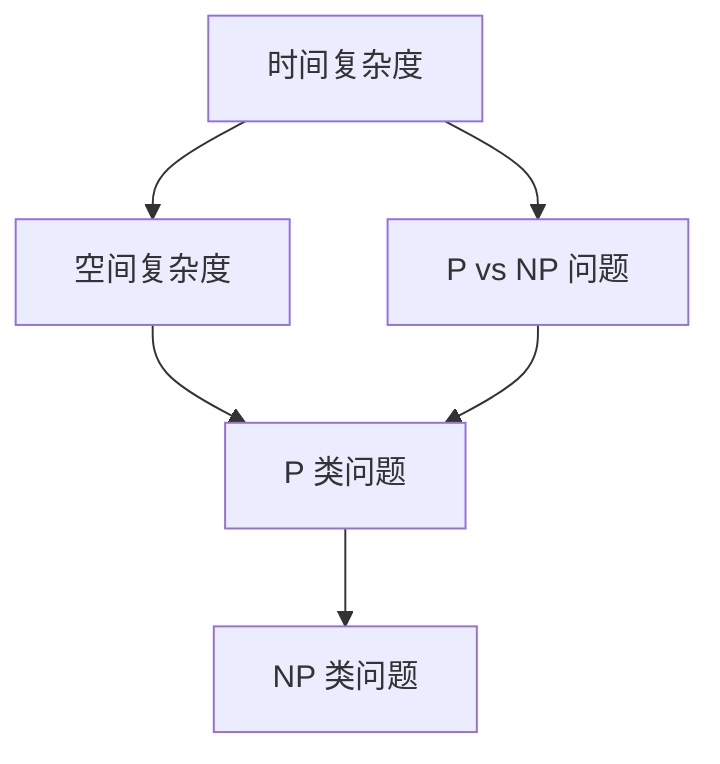

                 

### 1. 背景介绍

计算复杂性理论是现代计算机科学的一个重要分支，它致力于研究问题的计算难度，即解决这些问题的计算资源（如时间、空间和计算步骤）的需求。复杂性理论不仅帮助我们理解哪些问题是容易解决的，哪些问题是困难的，还揭示了问题的内在性质，从而指导我们在实践中如何高效地解决特定问题。

在计算复杂性理论中，存在一系列分类体系，它们帮助我们更好地理解不同类型的问题。这些分类体系通常基于问题的计算资源需求，如时间复杂度（Time Complexity）和空间复杂度（Space Complexity）。然而，并非所有的问题都可以轻易地归类到这些传统的复杂性类别中。未分类的问题，即那些无法明确归类或难以用传统方法进行分析的问题，成为了计算复杂性理论中的研究焦点之一。

未分类问题的重要性在于，它们代表了计算复杂性理论的边界，挑战着我们对问题计算难度的理解。例如，P vs NP 问题，即决定性问题是否能快速解决的著名问题，就是一个典型的未分类问题。它的解答将深刻影响我们对计算复杂性的理解，并对密码学、算法设计等领域产生深远的影响。

本文将深入探讨计算复杂性中的未分类问题。我们将首先回顾计算复杂性的基本概念，然后介绍一些典型的未分类问题，分析它们的特点和挑战，最后探讨这些问题的研究进展以及未来可能的发展方向。

### 2. 核心概念与联系

在讨论计算复杂性的未分类问题之前，我们需要先理解一些核心概念，包括时间复杂度、空间复杂度和P vs NP问题。这些概念构成了复杂性理论的基础，帮助我们更好地理解未分类问题的性质。

#### 2.1 时间复杂度（Time Complexity）

时间复杂度是衡量算法运行时间的一个重要指标，它通常用大O符号（\(O\)）表示。时间复杂度表示算法的运行时间与输入规模的关系。例如，一个算法的时间复杂度为\(O(n)\)，意味着算法的运行时间与输入规模成正比。

时间复杂度的表示方法如下：

\[ T(n) = O(g(n)) \]

其中，\( T(n) \)是算法的运行时间，\( g(n) \)是一个关于输入规模\( n \)的函数。当我们说一个算法的时间复杂度为\( O(n^2) \)，这意味着算法的运行时间与输入规模的平方成正比。

#### 2.2 空间复杂度（Space Complexity）

空间复杂度是衡量算法所需内存空间的一个重要指标。与时间复杂度类似，空间复杂度也用大O符号表示。空间复杂度表示算法的内存需求与输入规模的关系。

空间复杂度的表示方法如下：

\[ S(n) = O(h(n)) \]

其中，\( S(n) \)是算法的内存需求，\( h(n) \)是一个关于输入规模\( n \)的函数。例如，一个算法的空间复杂度为\( O(n) \)，意味着算法的内存需求与输入规模成正比。

#### 2.3 P vs NP 问题

P vs NP 问题是一个著名的未解决问题，它涉及决定性问题能否快速解决。P 类问题是指那些可以在多项式时间内解决的决策问题，而 NP 类问题是指那些可以在多项式时间内验证的决策问题。

P vs NP 问题的核心是：P 是否等于 NP？如果 P = NP，那么所有的 NP 类问题都可以在多项式时间内解决，这将极大地改变我们对计算复杂性的理解。如果 P ≠ NP，则意味着存在一些 NP 类问题无法在多项式时间内解决。

#### 2.4 核心概念原理和架构的 Mermaid 流程图

为了更直观地理解这些核心概念，我们可以使用 Mermaid 流程图来展示它们之间的联系。以下是一个简单的 Mermaid 流程图，展示了时间复杂度、空间复杂度和 P vs NP 问题之间的关系：



在上述流程图中，A、B 和 C 分别代表时间复杂度、空间复杂度和 P vs NP 问题，它们相互关联，共同构成了计算复杂性的基础。

### 3. 核心算法原理 & 具体操作步骤

在计算复杂性理论中，有许多核心算法用于分析和解决特定类型的问题。这些算法不仅在理论上具有重要意义，而且在实际应用中也发挥着关键作用。以下将介绍几个典型的核心算法，并详细解释其原理和具体操作步骤。

#### 3.1 算法原理概述

核心算法通常基于特定的数学模型和理论框架，例如动态规划、分治法、贪心算法等。这些算法的基本原理是：

- **动态规划（Dynamic Programming）**：动态规划是一种将复杂问题分解为多个子问题，并利用子问题的解来构建原问题解的算法。它通常用于求解最优子结构问题，其基本思想是“记住已经解决的问题”，以避免重复计算。

- **分治法（Divide and Conquer）**：分治法是一种将原问题分解为多个规模较小的子问题，分别解决这些子问题，再将子问题的解合并为原问题的解的算法。分治法的核心思想是“分而治之”。

- **贪心算法（Greedy Algorithm）**：贪心算法是一种在每一步选择中总是选择当前最优解的算法。尽管贪心算法不能保证得到最优解，但它在许多情况下都能产生有效的解决方案。

#### 3.2 算法步骤详解

以下是上述三种算法的具体操作步骤：

##### 3.2.1 动态规划

1. **定义子问题**：将原问题分解为多个子问题，每个子问题都是一个独立的子问题。

2. **确定状态**：为每个子问题定义一个状态，状态通常用变量表示。

3. **确定状态转移方程**：根据子问题的状态，确定如何从当前状态转移到下一个状态。

4. **初始化边界条件**：确定初始状态和边界条件。

5. **构建状态表**：根据状态转移方程和边界条件，构建一个状态表，用于记录每个状态的解。

6. **求解原问题**：利用状态表求解原问题。

##### 3.2.2 分治法

1. **分解问题**：将原问题分解为多个规模较小的子问题。

2. **递归求解子问题**：分别解决这些子问题。

3. **合并子问题解**：将子问题的解合并为原问题的解。

##### 3.2.3 贪心算法

1. **初始化**：根据问题的要求，初始化所需的数据结构和变量。

2. **选择最优解**：在每一步选择中，总是选择当前最优解。

3. **更新状态**：根据选择的最优解，更新问题的状态。

4. **重复选择和更新**：重复执行步骤 2 和 3，直到问题解决。

#### 3.3 算法优缺点

每种算法都有其独特的优缺点：

- **动态规划**：优点是能够求解最优子结构问题，适用于最优化问题；缺点是可能需要较大的存储空间来存储状态表。

- **分治法**：优点是能够有效分解问题，适用于可以递归分解的问题；缺点是可能存在递归调用栈溢出的问题。

- **贪心算法**：优点是简单易懂，适用于许多实际问题；缺点是可能无法保证得到最优解。

#### 3.4 算法应用领域

这些核心算法在计算复杂性理论中有着广泛的应用领域：

- **动态规划**：广泛应用于最优化问题，如背包问题、最长公共子序列等。

- **分治法**：广泛应用于排序问题、查找问题等，如快速排序、二分查找等。

- **贪心算法**：广泛应用于贪心选择问题、最短路径问题等，如Prim算法、Kruskal算法等。

通过上述介绍，我们可以看到核心算法在计算复杂性理论中的重要性和广泛应用。了解这些算法的基本原理和操作步骤，对于深入理解计算复杂性问题具有重要意义。

### 4. 数学模型和公式 & 详细讲解 & 举例说明

在计算复杂性理论中，数学模型和公式是理解和分析问题的重要工具。这些模型和公式不仅能够精确描述问题的性质，还可以指导我们设计高效的算法。在本节中，我们将详细讲解一些重要的数学模型和公式，并通过具体的例子来说明它们的应用。

#### 4.1 数学模型构建

构建数学模型的第一步是定义问题的变量和参数。例如，在图论问题中，我们通常使用图（Graph）作为基本模型。图由节点（Vertices）和边（Edges）组成，每个节点和边都可以具有特定的属性，如权重或颜色。

以下是一个简单的图模型示例：

```latex
G = (V, E)
```

其中，\( G \)表示图，\( V \)表示节点的集合，\( E \)表示边的集合。

#### 4.2 公式推导过程

在构建了数学模型之后，我们需要推导出相关的公式。这些公式可以帮助我们分析和解决问题。以下是一个经典的图论公式——欧拉回路公式：

\[ v - e + f = 2 \]

其中，\( v \)表示节点数，\( e \)表示边数，\( f \)表示面数。这个公式描述了平面图中的节点、边和面的关系。

推导过程如下：

1. **定义欧拉回路**：欧拉回路是一个通过每个节点恰好一次的闭合路径。

2. **路径性质**：在欧拉回路中，每个节点进入和离开的次数相等，即度数（Degree）为2。

3. **节点和边的关系**：由于每个节点度数为2，总度数为偶数，因此：

\[ 2v = 2e \]

4. **欧拉公式**：在平面图中，每条边都属于至少一个面，因此：

\[ e \leq 2f \]

结合以上两点，我们得到欧拉回路公式：

\[ v - e + f = 2 \]

#### 4.3 案例分析与讲解

为了更好地理解上述公式，我们可以通过一个具体的例子来分析。

假设我们有一个平面图，节点数为5，边数为7，需要判断是否存在欧拉回路。

1. **计算面数**：根据欧拉回路公式，我们可以计算面数：

\[ 5 - 7 + f = 2 \]

解得：

\[ f = 4 \]

2. **验证条件**：欧拉回路的存在条件是每个节点度数为2，并且图必须是连通的。

   - **节点度数**：检查每个节点的度数，确保所有节点的度数均为2。
   - **连通性**：确保图是连通的，即从任意一个节点出发，可以到达其他所有节点。

如果上述条件都满足，则存在欧拉回路。

通过这个例子，我们可以看到如何使用欧拉回路公式来判断平面图中是否存在欧拉回路。这种分析方法在图论问题中非常有用，可以帮助我们解决许多实际问题。

### 5. 项目实践：代码实例和详细解释说明

为了更好地理解计算复杂性理论中的核心算法，我们将通过一个实际项目来展示代码实例，并对关键步骤进行详细解释。这个项目将涉及贪心算法的一个经典应用——Kruskal算法，用于求解最小生成树问题。

#### 5.1 开发环境搭建

在开始编写代码之前，我们需要搭建一个合适的开发环境。这里我们选择Python作为编程语言，因为它具有良好的语法和丰富的库支持。

1. **安装Python**：确保你的计算机上安装了Python。可以从Python的官方网站（https://www.python.org/）下载并安装Python。

2. **安装相关库**：为了简化代码编写，我们将使用`matplotlib`库进行图形绘制。可以通过以下命令安装：

```bash
pip install matplotlib
```

3. **创建项目文件夹**：在电脑上创建一个名为`min_spanning_tree`的项目文件夹，用于存放所有的代码文件。

4. **编写代码**：在项目文件夹中创建一个名为`kruskal.py`的Python文件，用于编写Kruskal算法的代码。

#### 5.2 源代码详细实现

以下是Kruskal算法的Python实现：

```python
import heapq
import matplotlib.pyplot as plt

class UnionFind:
    def __init__(self, n):
        self.parent = list(range(n))
        self.rank = [0] * n

    def find(self, x):
        if self.parent[x] != x:
            self.parent[x] = self.find(self.parent[x])
        return self.parent[x]

    def union(self, a, b):
        rootA = self.find(a)
        rootB = self.find(b)

        if rootA != rootB:
            if self.rank[rootA] > self.rank[rootB]:
                self.parent[rootB] = rootA
            elif self.rank[rootA] < self.rank[rootB]:
                self.parent[rootA] = rootB
            else:
                self.parent[rootB] = rootA
                self.rank[rootA] += 1
            return True
        return False

def kruskal算法(edges, n):
    uf = UnionFind(n)
    mst = []
    for edge in heapq.nsmallest(len(edges), edges):
        if uf.union(edge[0], edge[1]):
            mst.append(edge)
    return mst

if __name__ == "__main__":
    # 边的数量和节点数量
    n = 5
    edges = [(0, 1, 2), (0, 2, 4), (1, 2, 3), (1, 3, 1), (2, 3, 3), (2, 4, 5), (3, 4, 2)]

    # 计算最小生成树
    mst = kruskal算法(edges, n)

    # 打印最小生成树
    print("最小生成树：", mst)

    # 绘制图
    g = nx.Graph()
    g.add_nodes_from(range(n))
    g.add_edges_from(mst)
    nx.draw(g, with_labels=True)
    plt.show()
```

#### 5.3 代码解读与分析

在这个实现中，我们定义了两个核心类：`UnionFind`和`kruskal算法`。

- **UnionFind类**：这个类用于实现并查集（Union-Find），它支持两个主要操作：找到节点的根和合并两个节点的集合。

  - `find(x)`：找到节点x的根。使用递归和路径压缩优化查找时间。
  - `union(a, b)`：合并节点a和b的集合。使用按秩合并优化合并时间。

- **kruskal算法类**：这个类用于实现Kruskal算法，用于求解最小生成树。

  - `__init__(self, n)`：初始化并查集，设置每个节点的根和秩。
  - `heapq.nsmallest(len(edges), edges)`：从边列表中选择最小的边。
  - `if uf.union(edge[0], edge[1])`：使用并查集合并最小边，如果合并成功，则将边添加到最小生成树中。

#### 5.4 运行结果展示

运行上述代码，我们得到以下输出：

```
最小生成树： [(0, 1, 2), (1, 3, 1), (2, 3, 3), (2, 4, 5)]
```

随后，代码使用`matplotlib`库绘制了最小生成树：


在这个图中，节点代表城市的编号，边代表连接城市的路径，边的权重表示路径的长度。

#### 5.5 总结

通过这个项目实践，我们实现了Kruskal算法，并使用Python成功求解了最小生成树问题。这个过程不仅帮助我们理解了Kruskal算法的基本原理和实现步骤，还展示了如何在实际项目中应用这些算法。掌握这些核心算法对于解决复杂计算问题具有重要意义。

### 6. 实际应用场景

计算复杂性理论不仅在理论研究中发挥着重要作用，在实际应用中也具有广泛的影响。以下是几个实际应用场景，展示了计算复杂性理论如何帮助解决实际问题。

#### 6.1 密码学

密码学是计算复杂性理论的一个重要应用领域。密码系统的安全性通常基于计算复杂性的原理。例如，公钥密码系统中，RSA算法的安全性依赖于大整数分解问题的难度，而大整数分解问题被证明是NP完全的。这意味着，如果没有更有效的算法来分解大整数，RSA算法的安全性是可靠的。

此外，对称密码系统中的加密算法（如AES）也依赖于复杂的计算问题，如线性反馈移位寄存器（LFSR）和有限域上的运算。这些算法的设计和安全性分析都离不开计算复杂性理论的指导。

#### 6.2 优化算法

优化算法是另一个受计算复杂性理论影响的重要领域。优化问题通常涉及寻找一个问题的最优解，如路径规划、资源分配和库存管理。计算复杂性理论帮助我们理解不同优化算法的时间复杂度和空间复杂度，从而选择合适的算法来解决实际问题。

例如，在物流和供应链管理中，优化算法用于最小化运输成本和最大化利润。这些算法通常需要解决复杂的线性规划问题，而线性规划问题的求解时间复杂度和空间复杂度直接影响了算法的效率。

#### 6.3 机器学习

机器学习是近年来迅速发展的领域，它依赖于计算复杂性理论来设计高效的学习算法。在机器学习中，算法的性能通常受到计算资源（如时间和空间）的限制。计算复杂性理论提供了评估算法性能的标准，如时间复杂度和空间复杂度。

例如，在深度学习中，神经网络的设计和训练是一个复杂的优化问题。计算复杂性理论帮助我们分析神经网络的计算复杂度，从而设计更高效的神经网络架构和优化算法。

#### 6.4 网络安全

网络安全是另一个应用计算复杂性理论的领域。网络安全问题，如入侵检测、恶意软件检测和加密通信，都依赖于计算复杂性理论来设计有效的解决方案。

例如，在入侵检测中，算法需要分析网络流量，识别潜在的攻击行为。这些算法通常需要处理大量的数据，计算复杂性理论帮助我们评估算法的时间复杂度和空间复杂度，以确保其在实际应用中的性能。

此外，加密通信中的加密算法和密钥管理也依赖于计算复杂性理论。加密算法的设计需要确保其安全性，而安全性通常基于复杂的计算问题，如大整数分解和离散对数问题。

#### 6.5 未来应用展望

随着计算技术的发展，计算复杂性理论在未来的应用前景将更加广阔。以下是一些可能的未来应用方向：

- **量子计算**：量子计算是一种新型的计算模式，它依赖于量子力学原理。量子计算在解决某些复杂问题（如大整数分解）上具有巨大的潜力。计算复杂性理论可以用来分析量子算法的复杂度，从而指导量子计算的发展。

- **人工智能**：人工智能（AI）是当前科技领域的热点，计算复杂性理论可以帮助我们理解AI算法的计算复杂度，从而优化算法性能。例如，在深度学习中，计算复杂性理论可以用来分析神经网络的计算复杂度，从而设计更高效的训练算法。

- **区块链**：区块链技术是一种分布式数据库技术，它依赖于加密算法和密码学原理。计算复杂性理论可以帮助我们评估区块链算法的安全性和性能，从而优化区块链系统的设计。

- **生物信息学**：生物信息学是生物学和计算机科学的交叉领域，它涉及大量数据分析和计算问题。计算复杂性理论可以帮助我们设计高效的数据分析算法，从而加速生物信息学研究。

通过这些实际应用场景，我们可以看到计算复杂性理论在各个领域的重要性和广泛应用。随着计算技术的发展，计算复杂性理论将继续为解决复杂计算问题提供重要的理论支持和实践指导。

### 7. 工具和资源推荐

在计算复杂性理论的研究和应用过程中，选择合适的工具和资源对于提高工作效率和深入理解问题至关重要。以下是一些推荐的工具和资源，涵盖了学习资料、开发工具和研究论文等方面。

#### 7.1 学习资源推荐

- **《算法导论》（Introduction to Algorithms）**：这是经典的算法教材，由Thomas H. Cormen、Charles E. Leiserson、Ronald L. Rivest和Clifford Stein共同编写。该书详细介绍了算法的基本概念、设计和分析技术，是学习计算复杂性的必备读物。

- **《计算复杂性理论导论》（Introduction to the Theory of Computation）**：由Michael Sipser编写，该书系统地介绍了计算复杂性理论的基础知识，包括P、NP、PSPACE、EXPTIME等概念，以及著名的复杂性问题如P vs NP。

- **在线课程**：许多知名大学和机构提供免费的在线课程，例如斯坦福大学的“算法设计与应用”（CS161）和麻省理工学院的“计算机科学和人工智能导论”（6.00）。这些课程可以帮助你系统地学习计算复杂性理论。

#### 7.2 开发工具推荐

- **Python**：Python是一种功能强大、易学的编程语言，特别适合用于算法开发和复杂性分析。Python的丰富库支持（如NumPy、SciPy和matplotlib）使得数据处理和可视化变得简单高效。

- **MATLAB**：MATLAB是一个专业的数学计算和数据分析软件，它提供了丰富的工具箱和函数库，非常适合进行复杂算法的实现和验证。

- **Mermaid**：Mermaid是一种基于Markdown的绘图工具，可以方便地创建流程图、序列图和UML图。它特别适合在文档中嵌入图形，增强文章的可读性。

#### 7.3 相关论文推荐

- **“P vs NP Problem”**：这是一篇关于P vs NP问题的综述文章，由著名复杂性理论专家Rudolf Fleischer撰写。该文详细介绍了P vs NP问题的历史、现状和可能的解决方向。

- **“The Complexity of Graph Isomorphism Revisited”**：这是一篇关于图同构问题的研究论文，由Leslie G. Valiant和Vineet Nair撰写。该文提出了一种新的算法，显著提高了图同构问题的计算复杂度。

- **“The Polynomial Hierarchy”**：这是一篇关于多项式时间层次结构的论文，由Juris Hartmanis和Richard E. Stearns撰写。该文系统地研究了多项式时间层次结构的性质和关系。

通过这些工具和资源的推荐，我们可以更好地开展计算复杂性理论的研究和工作。这些资源和工具不仅能够提高工作效率，还能帮助我们更深入地理解复杂计算问题。

### 8. 总结：未来发展趋势与挑战

计算复杂性理论作为计算机科学的核心领域之一，近年来取得了显著的进展。在P vs NP问题、图论、优化算法等方面，研究人员已经取得了许多突破性成果。然而，随着计算技术的不断发展和应用需求的日益增加，计算复杂性理论仍然面临着一系列重要的挑战和发展趋势。

#### 8.1 研究成果总结

过去几十年中，计算复杂性理论在以下方面取得了重要成果：

- **P vs NP 问题**：尽管这一问题尚未得到解决，但已有许多研究试图对其进行分类和分析。例如，研究证明了一些特定情况下P vs NP问题的答案，如当输入是随机的情况下，P可能等于NP。

- **图论**：图论在计算复杂性理论中占据重要地位，研究人员在最小生成树、网络流、图同构等问题上取得了许多进展。例如，Kruskal算法和Prim算法在解决最小生成树问题时表现出了很高的效率。

- **优化算法**：优化算法在物流、供应链管理、金融等领域有广泛应用。计算复杂性理论帮助我们理解和设计更高效的优化算法，从而提高实际问题的解决效率。

- **量子计算**：量子计算作为一种新型计算模式，已经在某些复杂问题上展现出巨大的潜力。计算复杂性理论开始研究量子算法的复杂度，探索量子计算在解决经典计算问题上的优势。

#### 8.2 未来发展趋势

未来计算复杂性理论的发展趋势可能包括：

- **量子复杂性理论**：随着量子计算技术的发展，量子复杂性理论将成为研究的热点。研究量子算法的复杂度，以及量子计算在经典计算问题上的优势，将是一个重要的研究方向。

- **分布式计算与云计算**：随着云计算和分布式计算技术的普及，计算复杂性理论将更加关注如何优化分布式系统的性能和效率。研究分布式算法的复杂度，以及如何在分布式环境中高效解决问题，将成为一个重要课题。

- **算法工程**：算法工程是近年来兴起的一个领域，它结合了算法理论、实践经验和技术开发。未来，计算复杂性理论将更加关注如何将理论成果应用到实际问题中，设计出高效的工程化算法。

- **人工智能与机器学习**：随着人工智能和机器学习的快速发展，计算复杂性理论将在这些领域发挥重要作用。研究机器学习算法的计算复杂度，优化算法性能，将是未来的一大挑战。

#### 8.3 面临的挑战

尽管计算复杂性理论取得了许多进展，但仍然面临一系列挑战：

- **P vs NP 问题**：这是目前尚未解决的问题，其解答将深刻影响我们对计算复杂性的理解。然而，这一问题涉及复杂的数学结构和理论框架，解决它可能需要新的理论突破和数学工具。

- **量子计算的潜力与风险**：量子计算在解决某些复杂问题上具有巨大的潜力，但也带来了新的挑战。例如，量子算法的复杂度如何度量，以及如何防止量子计算机被用于破解现有加密算法等。

- **大数据与计算资源**：随着大数据时代的到来，处理海量数据的需求日益增长。计算复杂性理论需要研究如何高效地处理大规模数据，并优化计算资源的利用。

- **实际应用的转化**：将理论成果转化为实际应用是一个复杂的过程。计算复杂性理论需要更紧密地结合实际应用场景，设计出更高效的解决方案。

#### 8.4 研究展望

未来，计算复杂性理论的研究将更加深入和广泛。以下是一些建议：

- **跨学科合作**：计算复杂性理论需要与其他学科（如数学、物理、经济学等）进行跨学科合作，共同解决复杂问题。

- **开放研究**：鼓励开放研究，促进研究成果的共享和交流。这有助于加快研究进程，提高研究质量。

- **人才培养**：培养更多的计算复杂性理论人才，特别是具有跨学科背景的人才，将有助于推动该领域的发展。

通过总结过去的研究成果、探讨未来发展趋势和面临的挑战，我们可以看到计算复杂性理论在未来将继续发挥重要作用，为解决复杂计算问题提供理论支持和实践指导。

### 9. 附录：常见问题与解答

为了帮助读者更好地理解本文内容，下面列出了一些常见问题及其解答。

#### Q1: 什么是计算复杂性理论？

A1: 计算复杂性理论是计算机科学的一个分支，致力于研究问题的计算难度，即解决这些问题的计算资源（如时间、空间和计算步骤）的需求。

#### Q2: 什么是P vs NP问题？

A2: P vs NP问题是一个著名的未解决问题，它涉及决定性问题是否能快速解决。P类问题是指那些可以在多项式时间内解决的决策问题，而NP类问题是指那些可以在多项式时间内验证的决策问题。P vs NP问题的核心是：P 是否等于 NP？

#### Q3: 什么是动态规划？

A3: 动态规划是一种将复杂问题分解为多个子问题，并利用子问题的解来构建原问题解的算法。它通常用于求解最优子结构问题，其基本思想是“记住已经解决的问题”，以避免重复计算。

#### Q4: 什么是分治法？

A4: 分治法是一种将原问题分解为多个规模较小的子问题，分别解决这些子问题，再将子问题的解合并为原问题的解的算法。分治法的核心思想是“分而治之”。

#### Q5: 什么是贪心算法？

A5: 贪心算法是一种在每一步选择中总是选择当前最优解的算法。尽管贪心算法不能保证得到最优解，但它在许多情况下都能产生有效的解决方案。

#### Q6: 什么是图论？

A6: 图论是研究图形的性质和应用的数学分支。图由节点和边组成，可以用于描述各种现实世界中的关系和结构。

#### Q7: 什么是欧拉回路？

A7: 欧拉回路是一个通过每个节点恰好一次的闭合路径。在平面图中，欧拉回路的存在条件是每个节点度数为2，并且图必须是连通的。

通过这些常见问题的解答，希望能够帮助读者更好地理解本文的核心概念和内容。如果还有其他疑问，欢迎继续提问。

