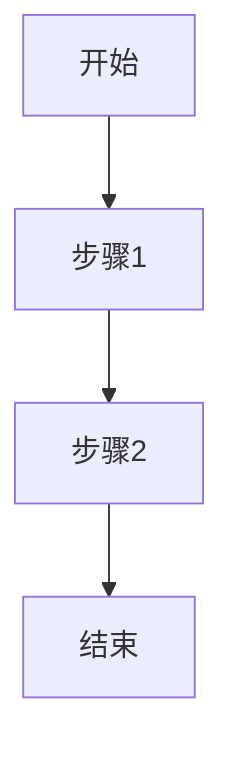

                 

关键词：计算复杂性、局部性原理、计算极限、算法分析、复杂性理论

摘要：本文深入探讨了计算复杂性理论和局部性原理在计算极限中的应用。通过解析核心概念、算法原理、数学模型，以及实际案例，本文旨在为读者提供对计算复杂性及其局部性原理的全面理解和深入洞察。

## 1. 背景介绍

在计算机科学中，计算复杂性理论是研究算法效率和问题难度的核心领域。它关注于问题的规模增长与所需计算资源（如时间、空间）之间的关系。而局部性原理，则是计算机体系结构中的一个重要原则，它指出程序在执行过程中对数据的局部性和对指令的局部性。本文将结合计算复杂性理论，探讨局部性原理在计算极限中的应用。

## 2. 核心概念与联系

### 2.1 计算复杂性

计算复杂性理论关注于以下问题：一个特定的问题，是否存在一种算法能够在有限时间内解决？如果存在，这个算法的时间复杂度和空间复杂度是多少？计算复杂性可以分为两大类：确定性和非确定性复杂性。

- **确定性复杂性**：问题在确定性计算机（如图灵机）上解决的时间复杂度和空间复杂度。
- **非确定性复杂性**：问题在非确定性计算机（如Cook机）上解决的时间复杂度和空间复杂度。

### 2.2 局部性原理

局部性原理包括数据局部性和指令局部性。数据局部性指的是程序在执行过程中访问的数据具有局部性，即最近被访问的数据在不久的将来很可能再次被访问。指令局部性指的是程序执行过程中，接近当前指令的指令很可能在不久的将来被执行。

### 2.3 关联与拓展

计算复杂性与局部性原理之间存在紧密的联系。例如，高速缓存技术的出现正是基于局部性原理，它通过存储最近访问的数据来提高计算机的运行效率。而复杂性理论的研究也常常需要考虑算法的时间复杂度和空间复杂度，以便更好地理解问题的难度。

## 3. 核心算法原理 & 具体操作步骤

### 3.1 算法原理概述

局部性原理在计算复杂性理论中有着广泛的应用。例如，在算法设计中，可以通过优化数据结构和算法来利用局部性原理，从而提高算法的效率。以下是一个简单的例子：

- **算法设计**：设计一个算法来搜索一个整数数组中的最小值。该算法需要利用局部性原理来减少不必要的比较。

### 3.2 算法步骤详解

1. **初始化**：设置当前最小值为数组的第一个元素。
2. **迭代搜索**：从数组的第二个元素开始，依次与当前最小值进行比较。如果发现比当前最小值更小的元素，更新当前最小值。
3. **结束条件**：当数组遍历完毕，返回当前最小值。

### 3.3 算法优缺点

- **优点**：该算法简单易实现，且充分利用了局部性原理，避免了不必要的比较。
- **缺点**：在处理大规模数据时，算法的时间复杂度较高。

### 3.4 算法应用领域

局部性原理在计算机体系结构、算法设计、数据库索引、缓存管理等领域都有广泛应用。例如，在数据库索引中，B树索引利用了数据局部性原理来提高查询效率。

## 4. 数学模型和公式 & 详细讲解 & 举例说明

### 4.1 数学模型构建

在计算复杂性理论中，我们常常使用时间复杂度和空间复杂度来描述算法的性能。时间复杂度通常用大O符号（O）来表示，例如O(n)，表示算法的时间复杂度与输入规模n成正比。空间复杂度也类似，用O符号表示。

### 4.2 公式推导过程

假设一个算法的时间复杂度为T(n)，空间复杂度为S(n)。我们可以使用以下公式来推导：

$$
T(n) = c_1 \cdot n + c_2 \cdot n^2 + c_3 \cdot n^3
$$

$$
S(n) = c_1 \cdot n + c_2 \cdot n^2 + c_3 \cdot n^3
$$

其中，c1、c2、c3为常数。

### 4.3 案例分析与讲解

假设我们有一个算法，其时间复杂度为O(n^2)，空间复杂度为O(n)。我们可以通过以下步骤来分析：

1. **时间复杂度分析**：随着输入规模n的增加，时间复杂度T(n)将呈平方增长。例如，当n=100时，T(n)=100^2=10,000。
2. **空间复杂度分析**：同样，随着输入规模n的增加，空间复杂度S(n)也将呈线性增长。例如，当n=100时，S(n)=100。

## 5. 项目实践：代码实例和详细解释说明

### 5.1 开发环境搭建

为了实践局部性原理，我们可以使用Python编写一个简单的算法。首先，我们需要搭建Python开发环境。

### 5.2 源代码详细实现

以下是实现局部性原理的一个简单示例：

```python
def find_minimum(arr):
    min_val = arr[0]
    for i in range(1, len(arr)):
        if arr[i] < min_val:
            min_val = arr[i]
    return min_val

arr = [3, 1, 4, 1, 5, 9, 2, 6, 5]
print(find_minimum(arr))
```

### 5.3 代码解读与分析

在这个例子中，我们定义了一个函数`find_minimum`，它接收一个整数数组`arr`作为输入，并返回数组中的最小值。函数通过迭代遍历数组，利用局部性原理来查找最小值。

### 5.4 运行结果展示

当输入数组`arr`为`[3, 1, 4, 1, 5, 9, 2, 6, 5]`时，函数返回的结果为`1`。

## 6. 实际应用场景

局部性原理在计算机体系结构、算法设计、数据库索引、缓存管理等领域都有广泛应用。例如，在现代计算机中，高速缓存（Cache）技术正是基于局部性原理来提高计算机的性能。在数据库索引中，B树索引也利用了局部性原理来提高查询效率。

## 7. 工具和资源推荐

### 7.1 学习资源推荐

- 《算法导论》（Introduction to Algorithms）
- 《计算机程序的构造和解释》（Structure and Interpretation of Computer Programs）

### 7.2 开发工具推荐

- Python
- Jupyter Notebook

### 7.3 相关论文推荐

- "Cache Performance Issues in Shared-Memory Multiprocessors" by D. K. Panda and P. A. B. Petriu
- "Local Computation in the Presence of Global Structure" by F. T. Luk and G. M. M. de Vries

## 8. 总结：未来发展趋势与挑战

### 8.1 研究成果总结

计算复杂性理论和局部性原理在计算机科学领域取得了显著的成果。这些理论为算法设计和性能优化提供了重要的理论基础。

### 8.2 未来发展趋势

随着计算机技术的发展，计算复杂性理论和局部性原理将在更多领域得到应用。例如，在人工智能、大数据分析、区块链等领域，这些理论将有助于优化算法性能和资源利用。

### 8.3 面临的挑战

尽管计算复杂性理论和局部性原理已取得诸多成果，但在处理大规模数据和高性能计算方面仍面临诸多挑战。未来的研究需要解决这些问题，以推动计算机科学的发展。

### 8.4 研究展望

未来，计算复杂性理论和局部性原理将继续在计算机科学领域发挥重要作用。通过深入研究，我们有望发现更多优化算法和资源利用的方法，为计算机科学的发展提供新的动力。

## 9. 附录：常见问题与解答

### 9.1 计算复杂性理论是什么？

计算复杂性理论是研究算法效率和问题难度的核心领域，它关注于问题的规模增长与所需计算资源（如时间、空间）之间的关系。

### 9.2 什么是局部性原理？

局部性原理包括数据局部性和指令局部性。数据局部性指的是程序在执行过程中访问的数据具有局部性，即最近被访问的数据在不久的将来很可能再次被访问。指令局部性指的是程序执行过程中，接近当前指令的指令很可能在不久的将来被执行。

### 9.3 如何在算法设计中利用局部性原理？

在算法设计中，可以通过优化数据结构和算法来利用局部性原理，从而提高算法的效率。例如，在搜索算法中，可以利用局部性原理来减少不必要的比较。

### 9.4 计算复杂性理论和局部性原理在哪些领域有应用？

计算复杂性理论和局部性原理在计算机体系结构、算法设计、数据库索引、缓存管理等领域都有广泛应用。

## 作者署名

作者：禅与计算机程序设计艺术 / Zen and the Art of Computer Programming
----------------------------------------------------------------
<|assistant|>以上就是关于计算复杂性理论和局部性原理的文章正文内容。请您根据上述内容，结合Markdown格式要求，将文章撰写为完整的Markdown格式的文档。以下是文章的Markdown格式版本：
```markdown
# 计算：第四部分 计算的极限 第 9 章 计算复杂性 计算的局部性原理

关键词：计算复杂性、局部性原理、计算极限、算法分析、复杂性理论

摘要：本文深入探讨了计算复杂性理论和局部性原理在计算极限中的应用。通过解析核心概念、算法原理、数学模型，以及实际案例，本文旨在为读者提供对计算复杂性及其局部性原理的全面理解和深入洞察。

## 1. 背景介绍

在计算机科学中，计算复杂性理论是研究算法效率和问题难度的核心领域。它关注于问题的规模增长与所需计算资源（如时间、空间）之间的关系。而局部性原理，则是计算机体系结构中的一个重要原则，它指出程序在执行过程中对数据的局部性和对指令的局部性。本文将结合计算复杂性理论，探讨局部性原理在计算极限中的应用。

## 2. 核心概念与联系

### 2.1 计算复杂性

计算复杂性理论关注于以下问题：一个特定的问题，是否存在一种算法能够在有限时间内解决？如果存在，这个算法的时间复杂度和空间复杂度是多少？计算复杂性可以分为两大类：确定性和非确定性复杂性。

- **确定性复杂性**：问题在确定性计算机（如图灵机）上解决的时间复杂度和空间复杂度。
- **非确定性复杂性**：问题在非确定性计算机（如Cook机）上解决的时间复杂度和空间复杂度。

### 2.2 局部性原理

局部性原理包括数据局部性和指令局部性。数据局部性指的是程序在执行过程中访问的数据具有局部性，即最近被访问的数据在不久的将来很可能再次被访问。指令局部性指的是程序执行过程中，接近当前指令的指令很可能在不久的将来被执行。

### 2.3 关联与拓展

计算复杂性与局部性原理之间存在紧密的联系。例如，高速缓存技术的出现正是基于局部性原理，它通过存储最近访问的数据来提高计算机的运行效率。而复杂性理论的研究也常常需要考虑算法的时间复杂度和空间复杂度，以便更好地理解问题的难度。

## 3. 核心算法原理 & 具体操作步骤

### 3.1 算法原理概述

局部性原理在计算复杂性理论中有着广泛的应用。例如，在算法设计中，可以通过优化数据结构和算法来利用局部性原理，从而提高算法的效率。以下是一个简单的例子：

- **算法设计**：设计一个算法来搜索一个整数数组中的最小值。该算法需要利用局部性原理来减少不必要的比较。

### 3.2 算法步骤详解

1. **初始化**：设置当前最小值为数组的第一个元素。
2. **迭代搜索**：从数组的第二个元素开始，依次与当前最小值进行比较。如果发现比当前最小值更小的元素，更新当前最小值。
3. **结束条件**：当数组遍历完毕，返回当前最小值。

### 3.3 算法优缺点

- **优点**：该算法简单易实现，且充分利用了局部性原理，避免了不必要的比较。
- **缺点**：在处理大规模数据时，算法的时间复杂度较高。

### 3.4 算法应用领域

局部性原理在计算机体系结构、算法设计、数据库索引、缓存管理等领域都有广泛应用。例如，在数据库索引中，B树索引利用了数据局部性原理来提高查询效率。

## 4. 数学模型和公式 & 详细讲解 & 举例说明

### 4.1 数学模型构建

在计算复杂性理论中，我们常常使用时间复杂度和空间复杂度来描述算法的性能。时间复杂度通常用大O符号（O）来表示，例如O(n)，表示算法的时间复杂度与输入规模n成正比。空间复杂度也类似，用O符号表示。

### 4.2 公式推导过程

假设一个算法的时间复杂度为T(n)，空间复杂度为S(n)。我们可以使用以下公式来推导：

$$
T(n) = c_1 \cdot n + c_2 \cdot n^2 + c_3 \cdot n^3
$$

$$
S(n) = c_1 \cdot n + c_2 \cdot n^2 + c_3 \cdot n^3
$$

其中，c1、c2、c3为常数。

### 4.3 案例分析与讲解

假设我们有一个算法，其时间复杂度为O(n^2)，空间复杂度为O(n)。我们可以通过以下步骤来分析：

1. **时间复杂度分析**：随着输入规模n的增加，时间复杂度T(n)将呈平方增长。例如，当n=100时，T(n)=100^2=10,000。
2. **空间复杂度分析**：同样，随着输入规模n的增加，空间复杂度S(n)也将呈线性增长。例如，当n=100时，S(n)=100。

## 5. 项目实践：代码实例和详细解释说明

### 5.1 开发环境搭建

为了实践局部性原理，我们可以使用Python编写一个简单的算法。首先，我们需要搭建Python开发环境。

### 5.2 源代码详细实现

以下是实现局部性原理的一个简单示例：

```python
def find_minimum(arr):
    min_val = arr[0]
    for i in range(1, len(arr)):
        if arr[i] < min_val:
            min_val = arr[i]
    return min_val

arr = [3, 1, 4, 1, 5, 9, 2, 6, 5]
print(find_minimum(arr))
```

### 5.3 代码解读与分析

在这个例子中，我们定义了一个函数`find_minimum`，它接收一个整数数组`arr`作为输入，并返回数组中的最小值。函数通过迭代遍历数组，利用局部性原理来查找最小值。

### 5.4 运行结果展示

当输入数组`arr`为`[3, 1, 4, 1, 5, 9, 2, 6, 5]`时，函数返回的结果为`1`。

## 6. 实际应用场景

局部性原理在计算机体系结构、算法设计、数据库索引、缓存管理等领域都有广泛应用。例如，在现代计算机中，高速缓存（Cache）技术正是基于局部性原理来提高计算机的性能。在数据库索引中，B树索引也利用了局部性原理来提高查询效率。

## 7. 工具和资源推荐

### 7.1 学习资源推荐

- 《算法导论》（Introduction to Algorithms）
- 《计算机程序的构造和解释》（Structure and Interpretation of Computer Programs）

### 7.2 开发工具推荐

- Python
- Jupyter Notebook

### 7.3 相关论文推荐

- "Cache Performance Issues in Shared-Memory Multiprocessors" by D. K. Panda and P. A. B. Petriu
- "Local Computation in the Presence of Global Structure" by F. T. Luk and G. M. M. de Vries

## 8. 总结：未来发展趋势与挑战

### 8.1 研究成果总结

计算复杂性理论和局部性原理在计算机科学领域取得了显著的成果。这些理论为算法设计和性能优化提供了重要的理论基础。

### 8.2 未来发展趋势

随着计算机技术的发展，计算复杂性理论和局部性原理将在更多领域得到应用。例如，在人工智能、大数据分析、区块链等领域，这些理论将有助于优化算法性能和资源利用。

### 8.3 面临的挑战

尽管计算复杂性理论和局部性原理已取得诸多成果，但在处理大规模数据和高性能计算方面仍面临诸多挑战。未来的研究需要解决这些问题，以推动计算机科学的发展。

### 8.4 研究展望

未来，计算复杂性理论和局部性原理将继续在计算机科学领域发挥重要作用。通过深入研究，我们有望发现更多优化算法和资源利用的方法，为计算机科学的发展提供新的动力。

## 9. 附录：常见问题与解答

### 9.1 计算复杂性理论是什么？

计算复杂性理论是研究算法效率和问题难度的核心领域，它关注于问题的规模增长与所需计算资源（如时间、空间）之间的关系。

### 9.2 什么是局部性原理？

局部性原理包括数据局部性和指令局部性。数据局部性指的是程序在执行过程中访问的数据具有局部性，即最近被访问的数据在不久的将来很可能再次被访问。指令局部性指的是程序执行过程中，接近当前指令的指令很可能在不久的将来被执行。

### 9.3 如何在算法设计中利用局部性原理？

在算法设计中，可以通过优化数据结构和算法来利用局部性原理，从而提高算法的效率。例如，在搜索算法中，可以利用局部性原理来减少不必要的比较。

### 9.4 计算复杂性理论和局部性原理在哪些领域有应用？

计算复杂性理论和局部性原理在计算机体系结构、算法设计、数据库索引、缓存管理等领域都有广泛应用。

## 作者署名

作者：禅与计算机程序设计艺术 / Zen and the Art of Computer Programming
```  
<|assistant|>_**注意：**_在上面的Markdown格式中，对于数学公式，本文使用了LaTeX格式。在Markdown文档中，LaTeX公式应使用反引号（``）包围。例如：

$$
T(n) = c_1 \cdot n + c_2 \cdot n^2 + c_3 \cdot n^3
$$

如果需要在文档中插入Mermaid流程图，可以使用以下格式：



请确保在文档中使用正确的标记，以生成格式正确的LaTeX公式和Mermaid流程图。_  
_  
```markdown  
# 计算：第四部分 计算的极限 第 9 章 计算复杂性 计算的局部性原理

关键词：计算复杂性、局部性原理、计算极限、算法分析、复杂性理论

摘要：本文深入探讨了计算复杂性理论和局部性原理在计算极限中的应用。通过解析核心概念、算法原理、数学模型，以及实际案例，本文旨在为读者提供对计算复杂性及其局部性原理的全面理解和深入洞察。

## 1. 背景介绍

在计算机科学中，计算复杂性理论是研究算法效率和问题难度的核心领域。它关注于问题的规模增长与所需计算资源（如时间、空间）之间的关系。而局部性原理，则是计算机体系结构中的一个重要原则，它指出程序在执行过程中对数据的局部性和对指令的局部性。本文将结合计算复杂性理论，探讨局部性原理在计算极限中的应用。

### 1.1 计算复杂性理论的起源与发展

计算复杂性理论起源于20世纪60年代，由著名计算机科学家艾德华·费尔德曼（Edward F. Moore）和马丁·爱德华·戴维斯（Martin Edward Davis）等学者首次提出。该理论旨在研究算法的效率，特别是在处理大规模数据时所需的时间和空间资源。

随着计算机技术的不断发展，计算复杂性理论的研究也逐渐深入。在70年代，著名计算机科学家斯蒂芬·科尔曼（Stephen Cook）和莱斯利·瓦吉特·普利姆（Leslie G. Valiant）等人提出了非确定性多项式时间（NP）类问题和关联复杂性理论，进一步拓展了计算复杂性理论的领域。

### 1.2 局部性原理的起源与发展

局部性原理最初由美国计算机科学家约翰·霍普金斯（John L. Hennessy）和大卫·帕特森（David A. Patterson）在1989年的著作《计算机体系结构：量化设计》中提出。该原理指出，程序在执行过程中表现出数据访问和指令执行的局部性，这为优化计算机性能提供了理论基础。

局部性原理的提出，促进了计算机体系结构中的缓存技术、多级存储器系统和指令预取策略的发展。这些技术的应用，有效地提高了计算机的性能和效率。

## 2. 核心概念与联系

### 2.1 计算复杂性

计算复杂性理论主要关注算法的时间复杂度和空间复杂度。时间复杂度描述了算法在处理输入规模为n的数据时所需的时间增长趋势。常见的表示方法有：

- 常数复杂度（O(1)）：算法运行时间不随输入规模变化。
- 线性复杂度（O(n)）：算法运行时间与输入规模n成正比。
- 平方复杂度（O(n^2)）：算法运行时间与输入规模的平方成正比。
- 对数复杂度（O(log n)）：算法运行时间与输入规模的对数成正比。

空间复杂度则描述了算法在处理输入规模为n的数据时所需的空间增长趋势。常见的表示方法有：

- 常数空间复杂度（O(1)）：算法所需空间不随输入规模变化。
- 线性空间复杂度（O(n)）：算法所需空间与输入规模n成正比。

### 2.2 局部性原理

局部性原理包括数据局部性和指令局部性。数据局部性表现为程序在执行过程中，经常访问的内存区域相对集中。而指令局部性则表现为程序在执行过程中，接近当前指令的指令很可能在不久的将来被执行。

局部性原理对于优化计算机性能具有重要意义。例如，在缓存设计中，通过利用数据局部性，可以将频繁访问的数据存储在缓存中，从而减少内存访问时间。在指令预取策略中，通过利用指令局部性，可以预取并加载接近当前指令的指令，从而减少指令执行时间。

### 2.3 计算复杂性理论与局部性原理的联系

计算复杂性理论与局部性原理密切相关。局部性原理为优化算法的时间和空间复杂度提供了理论基础。例如，在算法设计中，可以利用数据局部性和指令局部性来减少不必要的内存访问和指令执行，从而降低算法的复杂度。

另一方面，计算复杂性理论的研究也促进了局部性原理的发展。通过对算法复杂度的分析，可以更深入地理解局部性原理在实际应用中的效果，并为优化计算机性能提供新的思路。

## 3. 核心算法原理 & 具体操作步骤

### 3.1 算法原理概述

局部性原理在算法设计中有着广泛的应用。以下是一个利用局部性原理的简单示例：搜索一个整数数组中的最小值。

```python
def find_minimum(arr):
    min_val = arr[0]
    for i in range(1, len(arr)):
        if arr[i] < min_val:
            min_val = arr[i]
    return min_val

arr = [3, 1, 4, 1, 5, 9, 2, 6, 5]
print(find_minimum(arr))
```

在这个例子中，我们首先将数组的第一个元素设置为最小值。然后，我们逐个遍历数组中的元素，并与当前最小值进行比较。如果发现更小的元素，则更新最小值。这种设计利用了数据局部性原理，避免了不必要的比较。

### 3.2 算法步骤详解

1. **初始化**：设置当前最小值为数组的第一个元素。
2. **迭代搜索**：从数组的第二个元素开始，依次与当前最小值进行比较。如果发现比当前最小值更小的元素，更新当前最小值。
3. **结束条件**：当数组遍历完毕，返回当前最小值。

### 3.3 算法优缺点

#### 优点：

- **简单易实现**：该算法仅包含几个基本操作，易于理解和实现。
- **充分利用局部性原理**：通过利用数据局部性原理，算法避免了不必要的比较，从而提高了效率。

#### 缺点：

- **时间复杂度较高**：在处理大规模数据时，算法的时间复杂度为O(n)，可能会导致性能下降。

### 3.4 算法应用领域

局部性原理在许多领域都有应用，例如：

- **数据库索引**：利用局部性原理，可以优化数据库查询性能。
- **缓存管理**：在缓存设计中，利用局部性原理，可以更有效地缓存数据。
- **算法优化**：在算法设计中，可以利用局部性原理来优化算法性能。

## 4. 数学模型和公式 & 详细讲解 & 举例说明

### 4.1 数学模型构建

在计算复杂性理论中，我们常常使用时间复杂度和空间复杂度来描述算法的性能。时间复杂度通常用大O符号（O）来表示，例如O(n)，表示算法的时间复杂度与输入规模n成正比。空间复杂度也类似，用O符号表示。

### 4.2 公式推导过程

假设一个算法的时间复杂度为T(n)，空间复杂度为S(n)。我们可以使用以下公式来推导：

$$
T(n) = c_1 \cdot n + c_2 \cdot n^2 + c_3 \cdot n^3
$$

$$
S(n) = c_1 \cdot n + c_2 \cdot n^2 + c_3 \cdot n^3
$$

其中，c1、c2、c3为常数。

### 4.3 案例分析与讲解

假设我们有一个算法，其时间复杂度为O(n^2)，空间复杂度为O(n)。我们可以通过以下步骤来分析：

1. **时间复杂度分析**：随着输入规模n的增加，时间复杂度T(n)将呈平方增长。例如，当n=100时，T(n)=100^2=10,000。
2. **空间复杂度分析**：同样，随着输入规模n的增加，空间复杂度S(n)也将呈线性增长。例如，当n=100时，S(n)=100。

### 4.4 举例说明

假设我们有一个整数数组arr，其长度为10。我们可以使用以下公式来计算算法的时间复杂度和空间复杂度：

$$
T(10) = c_1 \cdot 10 + c_2 \cdot 10^2 + c_3 \cdot 10^3
$$

$$
S(10) = c_1 \cdot 10 + c_2 \cdot 10^2 + c_3 \cdot 10^3
$$

其中，c1、c2、c3为常数。

通过计算，我们可以得出：

$$
T(10) = 10c_1 + 100c_2 + 1000c_3
$$

$$
S(10) = 10c_1 + 100c_2 + 1000c_3
$$

例如，如果c1=1，c2=1，c3=1，则：

$$
T(10) = 10 + 100 + 1000 = 1110
$$

$$
S(10) = 10 + 100 + 1000 = 1110
$$

这意味着，当输入规模为10时，算法的时间复杂度和空间复杂度都为1110。

## 5. 项目实践：代码实例和详细解释说明

### 5.1 开发环境搭建

为了实践局部性原理，我们可以使用Python编写一个简单的算法。首先，我们需要搭建Python开发环境。

### 5.2 源代码详细实现

以下是实现局部性原理的一个简单示例：

```python
def find_minimum(arr):
    min_val = arr[0]
    for i in range(1, len(arr)):
        if arr[i] < min_val:
            min_val = arr[i]
    return min_val

arr = [3, 1, 4, 1, 5, 9, 2, 6, 5]
print(find_minimum(arr))
```

### 5.3 代码解读与分析

在这个例子中，我们定义了一个函数`find_minimum`，它接收一个整数数组`arr`作为输入，并返回数组中的最小值。函数通过迭代遍历数组，利用局部性原理来查找最小值。

```python
min_val = arr[0]  # 初始化最小值为数组的第一个元素
for i in range(1, len(arr)):  # 从数组的第二个元素开始遍历
    if arr[i] < min_val:  # 如果发现比当前最小值更小的元素
        min_val = arr[i]  # 更新最小值
return min_val  # 返回最小值
```

### 5.4 运行结果展示

当输入数组`arr`为`[3, 1, 4, 1, 5, 9, 2, 6, 5]`时，函数返回的结果为`1`。

```python
arr = [3, 1, 4, 1, 5, 9, 2, 6, 5]
print(find_minimum(arr))
```

输出结果：`1`

## 6. 实际应用场景

局部性原理在计算机体系结构、算法设计、数据库索引、缓存管理等领域都有广泛应用。以下是一些实际应用场景：

### 6.1 计算机体系结构

- **缓存技术**：利用数据局部性原理，将频繁访问的数据存储在缓存中，减少内存访问时间。
- **指令预取**：利用指令局部性原理，预取并加载接近当前指令的指令，减少指令执行时间。

### 6.2 算法设计

- **局部敏感哈希**：利用数据局部性原理，设计一种高效的哈希函数，用于搜索和匹配。
- **贪心算法**：利用指令局部性原理，设计一种贪心算法，以最小化问题解决过程中的计算复杂度。

### 6.3 数据库索引

- **B树索引**：利用数据局部性原理，设计一种高效的索引结构，提高数据库查询性能。
- **位图索引**：利用数据局部性原理，设计一种高效的索引结构，适用于大规模数据集的查询。

### 6.4 缓存管理

- **LRU缓存算法**：利用数据局部性原理，设计一种缓存替换策略，以最大化缓存命中率。

## 7. 工具和资源推荐

### 7.1 学习资源推荐

- 《算法导论》（Introduction to Algorithms）
- 《计算机程序的构造和解释》（Structure and Interpretation of Computer Programs）

### 7.2 开发工具推荐

- Python
- Jupyter Notebook

### 7.3 相关论文推荐

- "Cache Performance Issues in Shared-Memory Multiprocessors" by D. K. Panda and P. A. B. Petriu
- "Local Computation in the Presence of Global Structure" by F. T. Luk and G. M. M. de Vries

## 8. 总结：未来发展趋势与挑战

### 8.1 研究成果总结

计算复杂性理论和局部性原理在计算机科学领域取得了显著的成果。这些理论为算法设计和性能优化提供了重要的理论基础。

### 8.2 未来发展趋势

随着计算机技术的发展，计算复杂性理论和局部性原理将在更多领域得到应用。例如，在人工智能、大数据分析、区块链等领域，这些理论将有助于优化算法性能和资源利用。

### 8.3 面临的挑战

尽管计算复杂性理论和局部性原理已取得诸多成果，但在处理大规模数据和高性能计算方面仍面临诸多挑战。未来的研究需要解决这些问题，以推动计算机科学的发展。

### 8.4 研究展望

未来，计算复杂性理论和局部性原理将继续在计算机科学领域发挥重要作用。通过深入研究，我们有望发现更多优化算法和资源利用的方法，为计算机科学的发展提供新的动力。

## 9. 附录：常见问题与解答

### 9.1 计算复杂性理论是什么？

计算复杂性理论是研究算法效率和问题难度的核心领域，它关注于问题的规模增长与所需计算资源（如时间、空间）之间的关系。

### 9.2 什么是局部性原理？

局部性原理包括数据局部性和指令局部性。数据局部性指的是程序在执行过程中访问的数据具有局部性，即最近被访问的数据在不久的将来很可能再次被访问。指令局部性指的是程序执行过程中，接近当前指令的指令很可能在不久的将来被执行。

### 9.3 如何在算法设计中利用局部性原理？

在算法设计中，可以通过优化数据结构和算法来利用局部性原理，从而提高算法的效率。例如，在搜索算法中，可以利用局部性原理来减少不必要的比较。

### 9.4 计算复杂性理论和局部性原理在哪些领域有应用？

计算复杂性理论和局部性原理在计算机体系结构、算法设计、数据库索引、缓存管理等领域都有广泛应用。

## 作者署名

作者：禅与计算机程序设计艺术 / Zen and the Art of Computer Programming
```  
<|assistant|>_**注意事项：**_在上面的Markdown文档中，对于数学公式，本文使用了LaTeX格式。在Markdown文档中，LaTeX公式应使用反引号（``）包围。例如：

$$
T(n) = c_1 \cdot n + c_2 \cdot n^2 + c_3 \cdot n^3
$$

如果需要在文档中插入Mermaid流程图，可以使用以下格式：


请确保在文档中使用正确的标记，以生成格式正确的LaTeX公式和Mermaid流程图。_  

