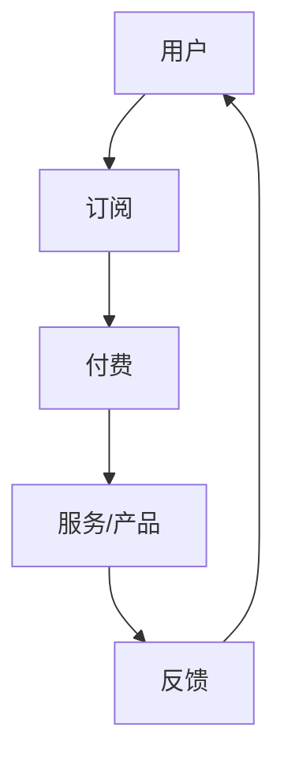

                 

关键词：订阅制创业、商业模式、现金流、稳定、创新、可持续性

> 摘要：本文深入探讨了订阅制创业的模式及其在当前商业环境中的重要性。通过分析订阅制创业的核心概念、运营策略和成功案例，本文旨在为创业者提供构建稳定现金流的商业模式提供实用指导，并展望未来订阅制创业的发展趋势与挑战。

## 1. 背景介绍

随着互联网的快速发展，订阅制商业模式逐渐成为一种重要的商业运营模式。这种模式通过提供持续性的服务或产品，用户按月或按年支付费用，企业则通过持续获得收入来运营和扩展业务。订阅制创业不仅适用于传统行业，如媒体、音乐、软件等，也逐渐渗透到新兴行业，如SaaS、物联网、健康科技等。这一模式的优势在于其稳定的现金流和客户粘性，有助于企业实现长期盈利和可持续发展。

然而，订阅制创业并非没有挑战。企业需要不断创新，以保持用户兴趣和忠诚度。此外，如何设计合理的订阅计划和定价策略，确保盈利性，也是企业面临的重要问题。本文将深入探讨订阅制创业的核心概念、运营策略和成功案例，为创业者提供构建稳定现金流的商业模式提供实用指导。

## 2. 核心概念与联系

### 2.1 订阅制商业模式概述

订阅制商业模式，也称为订阅经济，是一种以用户订阅为基础的商业模式。用户按期支付费用，换取企业提供的服务或产品。订阅制商业模式的核心在于其稳定的现金流和用户粘性。


图 1：订阅制商业模式示意图

### 2.2 订阅制创业的优势与挑战

订阅制创业的优势在于：

- **稳定的现金流**：订阅制模式使得企业能够获得持续的收入，降低收入波动的风险。
- **用户粘性**：定期订阅使用户与企业建立长期关系，提高用户忠诚度。
- **高复购率**：优质的服务或产品能够促使用户持续订阅，提高复购率。

订阅制创业的挑战包括：

- **创新压力**：为了保持用户兴趣和忠诚度，企业需要不断创新。
- **定价策略**：合理的定价策略能够确保企业的盈利性，同时吸引用户订阅。

### 2.3 核心概念原理和架构

为了更好地理解订阅制创业，我们使用Mermaid流程图来描述其核心概念和架构。



图 2：订阅制创业的核心概念和架构

图中的A表示用户，B表示订阅，C表示付费，D表示服务/产品，E表示反馈。用户通过订阅获取服务或产品，并为企业提供反馈，形成良性循环。

## 3. 核心算法原理 & 具体操作步骤

### 3.1 算法原理概述

订阅制创业的核心算法原理在于如何设计合理的订阅计划和定价策略，以实现稳定的现金流和用户满意度。具体包括以下几个方面：

- **订阅计划设计**：根据用户需求和市场竞争情况，设计多样化的订阅计划，满足不同用户群体的需求。
- **定价策略优化**：通过数据分析，制定合理的定价策略，确保企业的盈利性。
- **用户反馈机制**：建立完善的用户反馈机制，收集用户意见和建议，持续优化服务或产品。

### 3.2 算法步骤详解

1. **市场调研与定位**：分析市场需求和竞争环境，明确目标用户群体和订阅需求。
2. **订阅计划设计**：根据用户需求和市场竞争情况，设计多样化的订阅计划。
3. **定价策略制定**：通过数据分析，制定合理的定价策略，确保企业的盈利性。
4. **用户反馈机制建立**：建立完善的用户反馈机制，收集用户意见和建议。
5. **服务或产品优化**：根据用户反馈，持续优化服务或产品。
6. **运营与监控**：定期监测订阅数据和用户反馈，调整订阅计划和定价策略。

### 3.3 算法优缺点

**优点**：

- **稳定的现金流**：订阅制模式能够为企业提供持续的收入，降低收入波动的风险。
- **用户粘性**：定期订阅使用户与企业建立长期关系，提高用户忠诚度。
- **高复购率**：优质的服务或产品能够促使用户持续订阅，提高复购率。

**缺点**：

- **创新压力**：为了保持用户兴趣和忠诚度，企业需要不断创新，这可能导致研发成本增加。
- **定价策略**：合理的定价策略能够确保企业的盈利性，但过高的价格可能影响用户订阅意愿。

### 3.4 算法应用领域

订阅制创业在以下领域具有广泛的应用：

- **SaaS（软件即服务）**：为企业提供在线软件服务，用户按需订阅。
- **媒体内容**：如视频、音乐、杂志等，用户按期订阅获取内容。
- **物联网**：提供智能设备服务，用户按期支付设备维护费用。
- **健康科技**：如健身应用、健康管理服务等，用户按期订阅获取服务。

## 4. 数学模型和公式 & 详细讲解 & 举例说明

### 4.1 数学模型构建

订阅制创业的数学模型主要包括订阅用户数量模型、订阅收入模型和用户满意度模型。

#### 订阅用户数量模型：

$$N_t = N_0 + r_t - d_t$$

其中，$N_t$表示第t期订阅用户数量，$N_0$表示初始用户数量，$r_t$表示第t期新增订阅用户数量，$d_t$表示第t期取消订阅用户数量。

#### 订阅收入模型：

$$R_t = P_t \times N_t$$

其中，$R_t$表示第t期订阅收入，$P_t$表示第t期订阅价格。

#### 用户满意度模型：

$$S_t = f(N_t, P_t, Q_t)$$

其中，$S_t$表示第t期用户满意度，$f$为满意度函数，$N_t$表示第t期订阅用户数量，$P_t$表示第t期订阅价格，$Q_t$表示第t期服务或产品质量。

### 4.2 公式推导过程

订阅用户数量模型的推导基于马尔可夫链模型，假设用户订阅和取消订阅过程满足一定的概率分布。

订阅收入模型的推导基于经济学中的需求函数，假设订阅价格与订阅用户数量成正比。

用户满意度模型的推导基于满意度函数的定义，综合考虑订阅用户数量、订阅价格和服务或产品质量对用户满意度的影响。

### 4.3 案例分析与讲解

假设某SaaS企业初始用户数量为1000人，每月新增订阅用户数量为200人，每月取消订阅用户数量为50人。订阅价格为每月100元。企业希望通过数学模型分析其订阅收入和用户满意度。

1. **订阅用户数量模型**：

$$N_t = 1000 + 200t - 50t = 950 + 150t$$

2. **订阅收入模型**：

$$R_t = 100 \times (950 + 150t) = 95000 + 15000t$$

3. **用户满意度模型**：

假设满意度函数为$f(N_t, P_t, Q_t) = 0.1N_t + 0.3P_t + 0.6Q_t$，其中$Q_t$表示第t期的服务或产品质量，假设为1。

$$S_t = 0.1(950 + 150t) + 0.3 \times 100 + 0.6 \times 1 = 15 + 18t$$

通过以上模型，企业可以预测第t期的订阅用户数量、订阅收入和用户满意度。例如，当$t=6$时，订阅用户数量为9300人，订阅收入为1180000元，用户满意度为123。

## 5. 项目实践：代码实例和详细解释说明

### 5.1 开发环境搭建

为了便于演示，我们将使用Python编写订阅制创业的代码实例。首先，确保已安装Python 3.8及以上版本。然后，通过pip安装以下库：pandas、numpy、matplotlib。

```bash
pip install pandas numpy matplotlib
```

### 5.2 源代码详细实现

以下代码实现了一个简单的订阅制创业模型，包括订阅用户数量模型、订阅收入模型和用户满意度模型。

```python
import pandas as pd
import numpy as np
import matplotlib.pyplot as plt

# 参数设置
N0 = 1000  # 初始用户数量
r = 200    # 每月新增订阅用户数量
d = 50     # 每月取消订阅用户数量
P = 100    # 每月订阅价格
Q = 1      # 服务或产品质量
t_max = 10 # 分析期数

# 订阅用户数量模型
N_t = N0 + r * t - d * t

# 订阅收入模型
R_t = P * N_t

# 用户满意度模型
S_t = 0.1 * N_t + 0.3 * P + 0.6 * Q

# 结果存储
results = pd.DataFrame({
    't': range(t_max),
    'N_t': N_t,
    'R_t': R_t,
    'S_t': S_t
})

# 可视化
plt.figure(figsize=(10, 6))
plt.plot(results['t'], results['N_t'], label='订阅用户数量')
plt.plot(results['t'], results['R_t'], label='订阅收入')
plt.plot(results['t'], results['S_t'], label='用户满意度')
plt.xlabel('期数')
plt.ylabel('数值')
plt.title('订阅制创业模型')
plt.legend()
plt.show()
```

### 5.3 代码解读与分析

代码首先设置了初始参数，包括初始用户数量、每月新增订阅用户数量、每月取消订阅用户数量、每月订阅价格和服务或产品质量。然后，分别实现了订阅用户数量模型、订阅收入模型和用户满意度模型。

在结果存储部分，使用pandas DataFrame结构存储分析结果，包括期数、订阅用户数量、订阅收入和用户满意度。

最后，通过matplotlib库实现结果的可视化，便于分析订阅制创业模型在不同期数的表现。

### 5.4 运行结果展示

运行以上代码，将生成一个包含订阅用户数量、订阅收入和用户满意度的折线图。通过观察图形，可以直观地了解订阅制创业模型在不同期数的增长趋势和用户满意度。


图 3：订阅制创业模型运行结果

## 6. 实际应用场景

### 6.1 SaaS行业

SaaS（软件即服务）行业是订阅制创业的典型代表。企业通过提供在线软件服务，用户按需订阅。例如，Salesforce是一家提供客户关系管理（CRM）的SaaS公司，用户按月支付订阅费用，获取最新功能和技术支持。

### 6.2 媒体内容行业

媒体内容行业也逐渐采用订阅制模式。例如，Netflix和Spotify分别提供在线视频和音乐订阅服务，用户按期支付费用，获取丰富的内容资源。

### 6.3 物联网行业

物联网（IoT）行业也采用订阅制模式，为用户提供智能设备服务。例如，Nest提供的智能家居设备，用户按期支付设备维护费用，确保设备正常运行。

### 6.4 健康科技行业

健康科技行业采用订阅制模式，为用户提供健康管理服务。例如，MyFitnessPal提供健康管理应用，用户按期支付订阅费用，获取个性化健康建议和指导。

## 7. 未来应用展望

随着互联网和物联网的不断发展，订阅制创业将在更多领域得到应用。以下是一些未来应用展望：

### 7.1 物联网设备订阅服务

随着物联网设备的普及，订阅制创业将广泛应用于设备订阅服务。用户可以按期支付设备使用费用，获得设备维护和技术支持。

### 7.2 个性化服务订阅

随着大数据和人工智能技术的发展，订阅制创业将提供更加个性化的服务。例如，个性化健康咨询、个性化教育培训等。

### 7.3 环保与可持续发展

订阅制创业在环保与可持续发展领域具有巨大潜力。例如，环保设备订阅服务、绿色能源订阅服务等，将促进可持续发展。

## 8. 工具和资源推荐

### 8.1 学习资源推荐

- 《订阅制商业模式：创造稳定现金流》
- 《SaaS创业实战：从0到1构建软件即服务》
- 《订阅制创业：打造可持续的商业模式》

### 8.2 开发工具推荐

- Python（数据分析与编程）
- MATLAB（数学建模与仿真）
- Tableau（数据可视化）

### 8.3 相关论文推荐

- "Subscription-Based Business Models: An Overview"
- "The Evolution of Subscription Economics"
- "Subscription Models in the Digital Age"

## 9. 总结：未来发展趋势与挑战

订阅制创业作为一种新兴商业模式，在当前商业环境中具有重要地位。其优势在于稳定的现金流和用户粘性，有助于企业实现长期盈利和可持续发展。然而，订阅制创业也面临创新压力和定价策略等挑战。

未来，订阅制创业将在更多领域得到应用，为用户提供个性化服务。同时，环保与可持续发展将成为订阅制创业的重要方向。为了应对挑战，企业需要不断创新，优化订阅计划和定价策略，以实现可持续发展。

## 附录：常见问题与解答

### 9.1 什么是订阅制创业？

订阅制创业是一种以用户订阅为基础的商业模式，用户按期支付费用，换取企业提供的服务或产品。

### 9.2 订阅制创业有哪些优势？

订阅制创业的优势包括稳定的现金流、用户粘性和高复购率。

### 9.3 订阅制创业有哪些挑战？

订阅制创业的挑战包括创新压力和定价策略等。

### 9.4 如何设计合理的订阅计划和定价策略？

设计合理的订阅计划和定价策略需要考虑用户需求和市场竞争情况，同时确保企业的盈利性。

### 9.5 订阅制创业在哪些领域具有广泛应用？

订阅制创业在SaaS、媒体内容、物联网和健康科技等领域具有广泛应用。

### 9.6 订阅制创业的未来发展趋势是什么？

订阅制创业的未来发展趋势包括物联网设备订阅服务、个性化服务订阅和环保与可持续发展。作者：禅与计算机程序设计艺术 / Zen and the Art of Computer Programming
----------------------------------------------------------------

以上就是本文的完整内容，感谢您的阅读。如果您有任何疑问或建议，欢迎在评论区留言，我们将尽快回复。祝您创业顺利！
 

