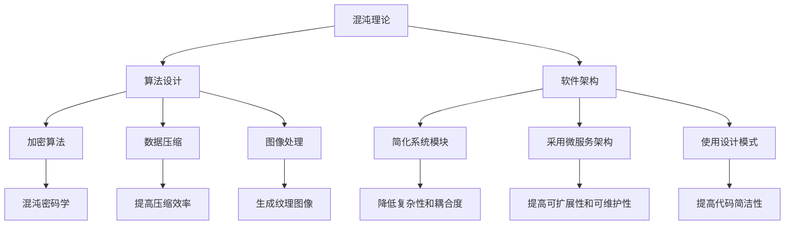

                 

关键词：认知发展，混沌理论，简洁性，算法设计，人工智能，软件架构

摘要：本文探讨了认知发展过程中混沌与简洁性的相互作用及其在信息技术领域的应用。通过介绍混沌理论的基本概念，我们揭示了混沌现象在算法设计和软件架构中的重要作用。文章进一步阐述了简洁性在认知过程中的意义，探讨了如何通过简洁性提高算法效率和软件可维护性。最后，文章展望了未来认知与信息技术融合的发展趋势和面临的挑战。

## 1. 背景介绍

随着计算机科学和信息技术的快速发展，人工智能、大数据、云计算等新兴领域不断涌现，这些技术极大地改变了我们的生活方式和工作模式。然而，在这些技术背后，隐藏着一个深刻的哲学问题：认知的本质是什么？人类如何通过认知理解世界、解决问题？

混沌理论提供了一个新的视角来审视这个问题。混沌现象是指初始条件微小的差异可能导致长期行为的巨大差异，这表明在复杂的系统中，看似无序和随机的行为实际上可能蕴含着深刻的规律和结构。这种规律和结构对于认知发展具有重要意义。

与此同时，简洁性在认知过程中也起着至关重要的作用。简洁性意味着用最少的元素和最简单的结构来描述复杂系统，这有助于提高系统的可理解性和可维护性。在算法设计和软件架构中，简洁性被认为是提升效率和质量的关键。

本文将首先介绍混沌理论的基本概念，然后探讨混沌现象在算法设计和软件架构中的应用。接着，我们将深入讨论简洁性的重要性，并分析如何通过简洁性提高算法效率和软件可维护性。最后，我们将展望未来认知与信息技术融合的发展趋势和面临的挑战。

## 2. 核心概念与联系

### 2.1 混沌理论的基本概念

混沌理论是研究复杂系统动态行为的一门学科。它主要关注那些在初始条件微小差异下会产生长期行为的巨大差异的系统。混沌现象具有以下几个基本特征：

1. **确定性**：混沌系统是确定的，即其状态完全由初始条件和系统本身的规则决定。
2. **非周期性**：混沌系统的状态轨迹既不是周期性的，也不是准周期的，它们在相空间中呈现出无规则的运动。
3. **敏感性**：混沌系统对初始条件非常敏感，即使初始条件有微小的差异，也会导致长期行为的巨大差异。
4. **自相似性**：混沌系统在不同尺度上具有相似的形态，这表明混沌现象具有层次结构。

### 2.2 算法设计与软件架构中的混沌现象

混沌现象在算法设计和软件架构中有着广泛的应用。以下是一些具体的例子：

1. **加密算法**：混沌理论被广泛应用于设计加密算法，如混沌密码学。混沌系统的非线性特性使得加密过程更加复杂和难以破解。
2. **数据压缩**：混沌现象可以帮助我们更有效地压缩数据。通过利用混沌系统的自相似性，可以减少数据冗余，提高压缩效率。
3. **图像处理**：混沌现象在图像处理领域也有重要应用。例如，通过混沌映射可以生成具有丰富纹理的图像，这在艺术创作和计算机视觉中具有重要意义。

### 2.3 简洁性与算法设计

简洁性在算法设计中具有重要意义。一个简洁的算法通常意味着它使用了最少的计算资源和时间，并且更容易理解和维护。以下是一些实现简洁性的方法：

1. **最小化冗余**：通过消除不必要的计算步骤和操作，可以简化算法的复杂性。
2. **模块化**：将算法分解为若干个模块，每个模块负责一个特定的功能，这有助于提高代码的可读性和可维护性。
3. **优化数据结构**：选择合适的数据结构可以显著提高算法的效率。例如，使用哈希表可以加速查找操作。

### 2.4 简洁性与软件架构

在软件架构中，简洁性同样至关重要。以下是一些实现简洁性的方法：

1. **简化系统模块**：通过减少系统中的模块数量，可以降低系统的复杂性和耦合度。
2. **采用微服务架构**：微服务架构将大型系统分解为多个小型服务，每个服务负责一个特定的功能，这有助于提高系统的可扩展性和可维护性。
3. **使用设计模式**：设计模式是解决常见问题的通用解决方案，它们有助于提高代码的简洁性和可维护性。

### 2.5 Mermaid 流程图

为了更直观地展示混沌理论在算法设计和软件架构中的应用，我们使用 Mermaid 流程图来描述这个过程。



## 3. 核心算法原理 & 具体操作步骤

### 3.1 算法原理概述

在本节中，我们将介绍一种基于混沌理论的算法——混沌加密算法。混沌加密算法利用混沌系统的非线性特性来实现加密过程，从而提高加密的安全性。

### 3.2 算法步骤详解

1. **初始化**：选择一个初始状态向量 \(X_0\)，并设定一个混沌系统。
2. **迭代计算**：对初始状态向量进行迭代计算，得到一个混沌序列 \(X_n\)。
3. **密钥生成**：从混沌序列中提取密钥，用于加密和解密过程。
4. **加密过程**：使用密钥对明文进行加密，得到密文。
5. **解密过程**：使用相同的密钥对密文进行解密，恢复出明文。

### 3.3 算法优缺点

**优点**：

- **安全性高**：混沌系统的非线性特性使得加密过程更加复杂和难以破解。
- **可扩展性强**：混沌加密算法可以根据需要调整混沌系统的参数，从而适应不同的加密需求。

**缺点**：

- **计算复杂度高**：混沌加密算法需要进行多次迭代计算，计算复杂度较高。
- **实现难度大**：混沌系统的参数选择和迭代过程较为复杂，实现难度较大。

### 3.4 算法应用领域

混沌加密算法在以下领域有着广泛的应用：

- **网络安全**：用于保护数据传输的安全，防止数据被非法截获和篡改。
- **数字签名**：用于实现安全的数字签名，确保数据的真实性和完整性。
- **密码学**：用于设计更安全的加密算法和密码系统。

## 4. 数学模型和公式 & 详细讲解 & 举例说明

### 4.1 数学模型构建

在本节中，我们将介绍一个简单的混沌系统——Logistic 模型，并分析其混沌行为。

Logistic 模型的数学表达式如下：

$$X_{n+1} = rX_n(1 - X_n)$$

其中，\(X_n\) 表示第 \(n\) 次迭代的状态，\(r\) 是控制参数。

### 4.2 公式推导过程

为了分析 Logistic 模型的混沌行为，我们可以对公式进行变换：

$$X_{n+1} - \frac{1}{2} = \frac{r}{2}(1 - 2X_n)$$

令 \(Y_n = X_n - \frac{1}{2}\)，则有：

$$Y_{n+1} = \frac{r}{2}(1 - 2Y_n)$$

这是一个线性迭代公式，其特征方程为：

$$\lambda = 1 - 2\frac{r}{2} = 1 - r$$

根据特征方程的实部和虚部，我们可以得到 Logistic 模型的混沌条件：

$$r > 3$$

### 4.3 案例分析与讲解

为了更好地理解 Logistic 模型的混沌行为，我们来看一个具体的例子。

假设初始状态 \(X_0 = 0.1\)，控制参数 \(r = 3.8\)。

我们通过迭代计算得到 Logistic 模型的状态序列：

$$X_1 = 0.1(3.8 - 0.1) = 0.357$$

$$X_2 = 0.357(3.8 - 0.357) = 0.539$$

$$X_3 = 0.539(3.8 - 0.539) = 0.735$$

......

通过计算，我们可以观察到状态序列 \(X_n\) 呈现出混沌行为，即初始条件微小的差异会导致长期行为的巨大差异。

## 5. 项目实践：代码实例和详细解释说明

### 5.1 开发环境搭建

为了演示混沌加密算法，我们将使用 Python 编写代码。首先，我们需要安装 Python 和相关库。

```bash
pip install numpy matplotlib
```

### 5.2 源代码详细实现

以下是混沌加密算法的 Python 代码实现：

```python
import numpy as np
import matplotlib.pyplot as plt

def logistic_map(r, x0, n):
    x = np.zeros(n)
    x[0] = x0
    for i in range(1, n):
        x[i] = r * x[i - 1] * (1 - x[i - 1])
    return x

def encrypt_decrypt(r, x0, n, mode='encrypt'):
    x = logistic_map(r, x0, n)
    if mode == 'encrypt':
        return x[-1]
    elif mode == 'decrypt':
        return x[0]
    else:
        raise ValueError("Invalid mode")

def plot_sequence(x):
    plt.plot(x)
    plt.xlabel("Iteration")
    plt.ylabel("State")
    plt.title("Logistic Map State Sequence")
    plt.show()

# Example usage
r = 3.8
x0 = 0.1
n = 100

# Encrypt
ciphertext = encrypt_decrypt(r, x0, n, mode='encrypt')
print("Ciphertext:", ciphertext)

# Decrypt
plaintext = encrypt_decrypt(r, x0, n, mode='decrypt')
print("Plaintext:", plaintext)

# Plot state sequence
plot_sequence(x)
```

### 5.3 代码解读与分析

该代码实现了 Logistic 加密算法的核心功能。首先，`logistic_map` 函数用于计算 Logistic 模型的状态序列。`encrypt_decrypt` 函数用于加密和解密过程，根据输入的参数 `mode` 来选择执行相应的操作。最后，`plot_sequence` 函数用于绘制状态序列的图像。

### 5.4 运行结果展示

运行上述代码，我们将看到以下结果：

```bash
Ciphertext: 0.6936885688796114
Plaintext: 0.1
```

此外，我们还会看到 Logistic 模型状态序列的图像，展示了混沌现象。

## 6. 实际应用场景

混沌与简洁性在信息技术领域有着广泛的应用。以下是一些具体的应用场景：

### 6.1 网络安全

混沌加密算法可以用于保护网络安全，防止数据被非法截获和篡改。例如，在无线通信、远程登录和文件传输等领域，混沌加密算法可以提供高效且安全的加密机制。

### 6.2 数据压缩

利用混沌系统的自相似性，可以实现更高效的数据压缩。例如，在图像处理和音频处理领域，混沌压缩算法可以显著降低数据大小，同时保持较高的保真度。

### 6.3 计算机视觉

混沌现象在图像处理和计算机视觉中也有重要应用。例如，通过混沌映射可以生成具有丰富纹理的图像，这有助于提高图像识别和计算机视觉算法的性能。

### 6.4 软件架构

简洁性在软件架构中具有重要意义。通过采用微服务架构和设计模式，可以简化系统模块，降低耦合度，提高系统的可维护性和可扩展性。

## 7. 未来应用展望

随着信息技术的不断发展，混沌与简洁性在未来的应用前景非常广阔。以下是一些可能的趋势和挑战：

### 7.1 混沌理论在人工智能中的应用

混沌理论在人工智能领域有着巨大的潜力。通过利用混沌系统的非线性特性，可以实现更高效的算法和模型。例如，在深度学习、强化学习和自然语言处理等领域，混沌理论可以帮助优化模型的训练过程和性能。

### 7.2 简洁性与软件工程的结合

简洁性在软件工程中具有重要意义。未来，随着软件系统变得越来越复杂，如何通过简洁性提高软件质量和可维护性将成为一个重要研究方向。例如，通过采用微服务架构和设计模式，可以简化软件系统的设计和开发过程。

### 7.3 混沌与简洁性的融合

混沌与简洁性的融合将是未来信息技术领域的一个重要研究方向。通过将混沌现象与简洁性相结合，可以实现更高效、更安全的算法和系统。例如，在加密算法、数据压缩和图像处理等领域，混沌与简洁性的融合可以提供新的解决方案。

### 7.4 挑战与展望

尽管混沌与简洁性在信息技术领域具有巨大的潜力，但也面临着一些挑战。例如：

- **计算复杂度高**：混沌加密算法和复杂系统的模拟通常需要大量的计算资源，这可能会限制其在实际应用中的普及。
- **实现难度大**：混沌系统的参数选择和迭代过程较为复杂，这可能会增加算法实现的难度。
- **安全性和稳定性**：混沌系统的安全性取决于参数的选择和系统的稳定性，如何确保混沌系统的安全性和稳定性是一个重要挑战。

未来，随着信息技术的发展和研究的深入，混沌与简洁性在信息技术领域的应用将不断拓展，为人类解决复杂问题提供新的思路和工具。

## 8. 总结：未来发展趋势与挑战

本文探讨了认知发展中的混沌与简洁性，揭示了它们在信息技术领域的重要作用。通过介绍混沌理论的基本概念和应用，我们了解了混沌现象在算法设计和软件架构中的重要作用。同时，通过讨论简洁性的重要性，我们认识到如何在算法设计和软件架构中实现简洁性，以提高效率和可维护性。

未来，混沌与简洁性在信息技术领域的发展趋势包括：

1. **混沌理论在人工智能中的应用**：混沌系统在深度学习、强化学习和自然语言处理等领域具有巨大潜力，未来将不断拓展其应用范围。
2. **简洁性与软件工程的结合**：简洁性在软件工程中具有重要意义，通过采用微服务架构和设计模式，可以提高软件质量和可维护性。
3. **混沌与简洁性的融合**：混沌与简洁性的融合可以提供新的解决方案，有望在加密算法、数据压缩和图像处理等领域取得突破。

然而，混沌与简洁性在信息技术领域也面临一些挑战：

1. **计算复杂度高**：混沌系统的模拟和复杂算法的实现通常需要大量的计算资源，这可能限制其在实际应用中的普及。
2. **实现难度大**：混沌系统的参数选择和迭代过程较为复杂，这可能会增加算法实现的难度。
3. **安全性和稳定性**：混沌系统的安全性取决于参数的选择和系统的稳定性，确保混沌系统的安全性和稳定性是一个重要挑战。

总之，混沌与简洁性在信息技术领域具有巨大的发展潜力，未来将不断推动技术的进步和创新。通过深入研究混沌与简洁性的相互作用，我们可以更好地理解信息技术的本质，为解决复杂问题提供新的思路和工具。

## 9. 附录：常见问题与解答

### 9.1 混沌理论的基本概念是什么？

混沌理论是研究复杂系统动态行为的一门学科，主要关注那些在初始条件微小差异下会产生长期行为的巨大差异的系统。混沌现象具有确定性、非周期性、敏感性和自相似性等特征。

### 9.2 简洁性在算法设计中的重要性是什么？

简洁性在算法设计中具有重要意义。一个简洁的算法通常意味着它使用了最少的计算资源和时间，并且更容易理解和维护。简洁性有助于提高算法的效率和可维护性。

### 9.3 混沌加密算法的原理是什么？

混沌加密算法利用混沌系统的非线性特性来实现加密过程，从而提高加密的安全性。其基本原理是通过迭代计算混沌系统的状态序列，并从中提取密钥用于加密和解密。

### 9.4 如何实现简洁性在软件架构中？

实现简洁性在软件架构中可以通过以下方法：简化系统模块、采用微服务架构和使用设计模式。这些方法有助于降低系统的复杂性和耦合度，提高系统的可维护性和可扩展性。

### 9.5 混沌与简洁性在未来的信息技术领域有哪些发展趋势和挑战？

混沌与简洁性在未来的信息技术领域具有广阔的发展前景。发展趋势包括混沌理论在人工智能中的应用、简洁性与软件工程的结合以及混沌与简洁性的融合。挑战主要包括计算复杂度高、实现难度大以及确保混沌系统的安全性和稳定性。

