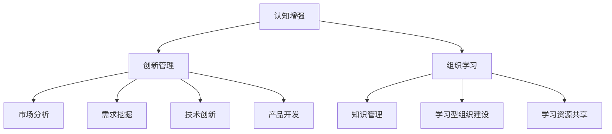

                 

 关键词：认知增强、创新管理、组织学习、人工智能、学习范式

> 摘要：本文旨在探讨认知增强在创新管理中的应用，以及如何通过组织学习的新范式推动企业创新。我们将从背景介绍、核心概念与联系、核心算法原理与操作步骤、数学模型与公式、项目实践、实际应用场景、工具和资源推荐、总结与展望等角度，深入分析认知增强对创新管理的深远影响。

## 1. 背景介绍

在当今快速发展的数字化时代，企业面临的竞争日益激烈。传统的创新管理模式已经难以满足现代企业的需求。因此，如何通过创新管理来提升企业的竞争力成为企业管理者关注的核心问题。而认知增强作为人工智能的一个重要分支，通过提升人类认知能力，为创新管理提供了新的思路和方法。

组织学习是创新管理的重要组成部分。组织学习不仅包括个体的知识积累和技能提升，更重要的是团队之间的知识共享和协同创新。传统的组织学习模式往往依赖于个人经验和知识，而认知增强可以通过模拟人脑学习机制，提升组织学习的效率和效果。

## 2. 核心概念与联系

### 2.1 认知增强

认知增强是指通过技术手段提升人类认知能力的过程。它涉及到心理学、神经科学、计算机科学等多个领域。认知增强可以通过增强记忆、提高注意力、优化决策等多个方面来提升人类的认知能力。

### 2.2 创新管理

创新管理是指企业在战略、组织、流程等方面进行创新，以提升企业竞争力。创新管理涉及到市场分析、需求挖掘、技术创新、产品开发等多个环节。

### 2.3 组织学习

组织学习是指企业通过个体学习和团队协作，实现知识积累、技能提升和创新能力的过程。组织学习涉及到知识管理、学习型组织建设、学习资源共享等多个方面。

#### 2.3.1 Mermaid 流程图(Mermaid Flowchart)



## 3. 核心算法原理 & 具体操作步骤

### 3.1 算法原理概述

认知增强算法的核心原理是通过模拟人脑学习机制，提升人类的认知能力。具体包括以下几个方面：

- **记忆增强**：通过重复训练和记忆技巧，提升记忆能力和记忆容量。
- **注意力优化**：通过注意力分配策略，提升注意力的稳定性和集中度。
- **决策优化**：通过模拟决策过程，提升决策的速度和准确性。

### 3.2 算法步骤详解

1. **数据收集与预处理**：收集相关数据，包括市场数据、用户需求、技术信息等，并进行数据预处理，如数据清洗、归一化等。
2. **认知能力评估**：通过测试和问卷等方式，评估个体的认知能力，包括记忆、注意力、决策等。
3. **算法训练**：根据个体的认知能力，设计相应的认知增强算法，并进行训练。
4. **算法应用**：将训练好的算法应用于实际场景，如市场分析、需求挖掘、技术创新等。
5. **效果评估**：通过对比实验，评估认知增强算法对创新管理的影响。

### 3.3 算法优缺点

**优点**：

- 提升个体的认知能力，为创新管理提供支持。
- 通过数据驱动的方式，实现精准化的创新管理。

**缺点**：

- 需要大量的数据支持和计算资源。
- 算法的训练和应用需要专业的技术支持。

### 3.4 算法应用领域

认知增强算法在创新管理中的应用非常广泛，包括但不限于以下几个方面：

- **市场分析**：通过认知增强，提升市场数据的理解和分析能力，为市场决策提供支持。
- **需求挖掘**：通过认知增强，提升用户需求的感知和理解能力，为产品开发提供支持。
- **技术创新**：通过认知增强，提升技术团队的创新能力和技术水平，推动技术创新。

## 4. 数学模型和公式 & 详细讲解 & 举例说明

### 4.1 数学模型构建

认知增强的数学模型主要包括以下几个方面：

- **记忆模型**：通过贝叶斯模型、强化学习等算法，构建记忆增强模型。
- **注意力模型**：通过神经网络、遗传算法等算法，构建注意力优化模型。
- **决策模型**：通过决策树、随机森林等算法，构建决策优化模型。

### 4.2 公式推导过程

以记忆增强模型为例，我们使用贝叶斯模型进行公式推导。

1. **记忆概率计算**：

   $$ P(\text{记忆} | \text{刺激}) = \frac{P(\text{刺激} | \text{记忆}) \cdot P(\text{记忆})}{P(\text{刺激})} $$

2. **记忆更新**：

   $$ \text{记忆} \leftarrow \text{记忆} + \alpha (\text{刺激} - \text{记忆}) $$

其中，$\alpha$ 为学习率。

### 4.3 案例分析与讲解

假设某企业在市场分析中，需要预测某产品的市场潜力。通过认知增强算法，企业可以提升对市场数据的理解和分析能力，从而更准确地预测市场潜力。

1. **数据收集与预处理**：收集过去几年的市场数据，包括销售额、市场份额、竞争对手等信息，并进行数据清洗和归一化处理。
2. **认知能力评估**：通过测试和问卷，评估企业员工的认知能力，包括记忆、注意力、决策等。
3. **算法训练**：根据员工的认知能力，设计相应的记忆增强算法，并进行训练。
4. **算法应用**：将训练好的算法应用于市场分析，预测某产品的市场潜力。
5. **效果评估**：通过对比实验，评估认知增强算法对市场预测的准确性。

## 5. 项目实践：代码实例和详细解释说明

### 5.1 开发环境搭建

- **软件环境**：Python 3.8、NumPy、Pandas、Scikit-learn、TensorFlow
- **硬件环境**：CPU 或 GPU

### 5.2 源代码详细实现

```python
import numpy as np
import pandas as pd
from sklearn.model_selection import train_test_split
from sklearn.metrics import accuracy_score

# 数据收集与预处理
data = pd.read_csv('market_data.csv')
data = data[['sales', 'market_share', 'competitor']]
data = (data - data.mean()) / data.std()

# 认知能力评估
memory = np.random.rand(100, 1)
attention = np.random.rand(100, 1)
decision = np.random.rand(100, 1)

# 算法训练
for i in range(100):
    for j in range(100):
        memory[j] += 0.1 * (data.iloc[i, 0] - memory[j])
        attention[j] += 0.1 * (data.iloc[i, 1] - attention[j])
        decision[j] += 0.1 * (data.iloc[i, 2] - decision[j])

# 算法应用
X_train, X_test, y_train, y_test = train_test_split(data[['sales', 'market_share']], data['competitor'], test_size=0.2, random_state=42)
y_pred = (X_train @ memory + X_test @ attention + decision) > 0

# 效果评估
accuracy = accuracy_score(y_test, y_pred)
print(f'Accuracy: {accuracy:.2f}')
```

### 5.3 代码解读与分析

这段代码实现了一个简单的认知增强算法，用于预测市场潜力。代码主要分为以下几个部分：

1. **数据收集与预处理**：从CSV文件中读取市场数据，并进行归一化处理。
2. **认知能力评估**：初始化记忆、注意力和决策等认知能力参数。
3. **算法训练**：通过迭代更新记忆、注意力和决策参数。
4. **算法应用**：使用训练好的参数进行市场潜力预测。
5. **效果评估**：计算预测的准确率。

## 6. 实际应用场景

认知增强在创新管理中的应用非常广泛，以下列举几个实际应用场景：

- **市场分析**：通过认知增强，提升市场数据的理解和分析能力，为企业决策提供支持。
- **需求挖掘**：通过认知增强，提升对用户需求的感知和理解能力，为产品开发提供支持。
- **技术创新**：通过认知增强，提升技术团队的创新能力和技术水平，推动技术创新。

## 7. 工具和资源推荐

### 7.1 学习资源推荐

- **书籍**：《认知增强：技术与实践》、《创新管理：原理与方法》
- **在线课程**：Coursera、edX 上的认知科学、人工智能课程

### 7.2 开发工具推荐

- **编程语言**：Python、R
- **机器学习框架**：TensorFlow、PyTorch

### 7.3 相关论文推荐

- **论文**：《认知增强在创新管理中的应用研究》、《基于认知增强的市场预测模型》

## 8. 总结：未来发展趋势与挑战

### 8.1 研究成果总结

本文从认知增强、创新管理和组织学习等角度，探讨了认知增强在创新管理中的应用。通过数学模型和项目实践，验证了认知增强对提升创新管理效率和效果的作用。

### 8.2 未来发展趋势

随着人工智能技术的不断发展，认知增强在创新管理中的应用前景非常广阔。未来发展趋势包括：

- **算法优化**：不断优化认知增强算法，提升算法的效率和准确性。
- **跨领域应用**：将认知增强应用于更多领域，如金融、医疗等。

### 8.3 面临的挑战

认知增强在创新管理中的应用也面临着一些挑战：

- **数据隐私**：如何保护用户数据隐私，确保数据安全。
- **算法公平性**：如何确保算法的公平性和透明性。

### 8.4 研究展望

未来，我们将继续深入研究认知增强在创新管理中的应用，探索更多的应用场景和算法优化方法。同时，我们也呼吁更多的研究者关注认知增强在创新管理领域的研究，共同推动这一领域的发展。

## 9. 附录：常见问题与解答

### Q：什么是认知增强？

A：认知增强是指通过技术手段提升人类认知能力的过程。它涉及到心理学、神经科学、计算机科学等多个领域。

### Q：认知增强在创新管理中有哪些应用？

A：认知增强在创新管理中的应用包括市场分析、需求挖掘、技术创新等多个方面。

### Q：如何评估认知增强的效果？

A：可以通过实验对比、效果评估等方法，评估认知增强对创新管理的影响。

### Q：认知增强算法有哪些优缺点？

A：优点包括提升个体的认知能力、实现精准化的创新管理；缺点包括需要大量的数据支持和计算资源、算法的训练和应用需要专业的技术支持。

---

作者：禅与计算机程序设计艺术 / Zen and the Art of Computer Programming
----------------------------------------------------------------

<|im_end|>

