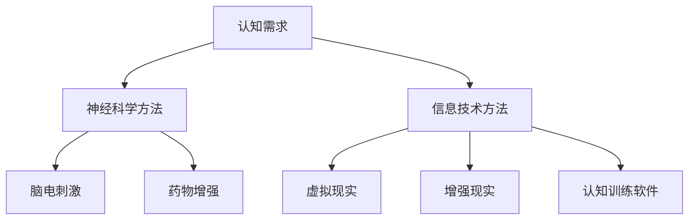

                 

关键词：认知增强，人工智能，神经科学，技术进步，思维扩展

> 摘要：本文深入探讨了认知增强技术的发展及其如何扩展人类的思维极限。文章首先介绍了认知增强的基本概念，随后详细分析了当前主要技术手段，并结合实际案例展示了这些技术在提升人类认知能力方面的实际效果。文章还探讨了认知增强技术的潜在应用领域、未来发展趋势和面临的挑战。

## 1. 背景介绍

随着科技的发展，人工智能（AI）逐渐成为改变人类生活方式的重要力量。AI不仅能够在数据处理、模式识别、自动化决策等方面发挥巨大作用，还能通过认知增强的方式扩展人类的思维极限。认知增强指的是通过技术手段提升个体的认知能力，使其在记忆、注意力、思维速度和深度等方面得到显著改善。

认知增强的需求源于人类在信息爆炸时代面临的挑战。随着知识的不断增长，个体需要更高的信息处理能力和更高效的认知机制来应对复杂的信息环境。此外，认知增强技术还能帮助解决一些特定的认知障碍，如记忆力减退、注意力不足等问题。

本文将首先介绍认知增强的基本概念，然后详细分析当前主要的认知增强技术，包括神经科学基础、技术手段和实际应用案例。接下来，我们将探讨认知增强技术的潜在应用领域，并展望其未来发展趋势和挑战。

## 2. 核心概念与联系

### 2.1 认知增强的定义与意义

认知增强是指通过外部技术手段干预大脑的功能，提升个体的认知能力。认知能力包括记忆、注意力、推理、决策等多个方面。认知增强的意义在于，它不仅可以帮助个体在信息处理上取得突破，还能够提升工作效率、改善生活质量，甚至帮助解决一些心理健康问题。

### 2.2 神经科学基础

神经科学是认知增强的理论基础。大脑是认知过程的中心，由数十亿个神经元组成。这些神经元通过电信号进行通信，形成复杂的神经网络。认知增强技术往往通过调节这些神经网络的活跃度，改善个体的认知表现。

#### 2.2.1 神经元的基本结构与功能

神经元是大脑的基本单元，具有接收信号、处理信号和传递信号的能力。神经元的结构包括细胞体、树突、轴突和突触等部分。树突负责接收其他神经元的信号，细胞体对信号进行处理，轴突负责将信号传递出去，突触则是神经元之间传递信号的部位。

#### 2.2.2 神经网络的通信机制

神经网络通过突触连接实现神经元之间的通信。突触的强度决定了神经元之间的信号传递效率，这种强度可以通过训练进行调节。认知增强技术可以通过增强突触连接或改变突触强度，提升神经网络的效率。

### 2.3 认知增强技术的分类

认知增强技术可以分为两大类：一类是利用神经科学原理直接干预大脑功能，如脑电刺激、药物增强等；另一类是通过信息技术的手段提升个体的认知能力，如虚拟现实、增强现实、认知训练软件等。

#### 2.3.1 神经科学方法

**脑电刺激（Electrical Stimulation）**：通过电信号刺激大脑特定区域，增强神经元的活跃度，从而改善认知功能。

**药物增强（Pharmacological Enhancement）**：使用药物调节大脑的化学物质水平，改善认知能力。

#### 2.3.2 信息技术方法

**虚拟现实（Virtual Reality，VR）**：通过模拟环境增强个体的认知体验，提高学习效率和记忆能力。

**增强现实（Augmented Reality，AR）**：将虚拟信息叠加在现实环境中，提供额外的认知支持。

**认知训练软件**：设计专门的软件，通过互动训练提升个体的认知能力。

### 2.4 认知增强技术的架构图

下面是一个简化的认知增强技术架构图，展示了各个技术手段之间的相互关系。



## 3. 核心算法原理 & 具体操作步骤

### 3.1 算法原理概述

认知增强技术的核心在于对大脑神经网络进行优化。无论是神经科学方法还是信息技术手段，其目标都是通过增强神经元之间的通信效率，提升个体的认知能力。

#### 3.1.1 神经元通信效率提升原理

通过电刺激或药物调节，可以增强神经元之间的信号传递效率。电刺激通过直接在神经元上施加电流，促进神经信号的传导；药物增强则通过调节大脑内的化学物质水平，如多巴胺、乙酰胆碱等，增强神经信号的传递。

#### 3.1.2 信息处理能力提升原理

信息技术手段如VR、AR和认知训练软件，通过提供更加丰富和互动的学习环境，提高个体的信息处理能力和认知负荷。这些技术通过模拟复杂的认知任务，训练个体的注意力和记忆力，从而提升认知能力。

### 3.2 算法步骤详解

#### 3.2.1 神经科学方法的具体操作步骤

1. **确定目标区域**：通过神经影像学技术（如fMRI）确定大脑中需要刺激的区域。
2. **设计刺激方案**：根据目标区域的特点，设计电刺激或药物增强的参数。
3. **实施刺激**：通过电极或药物实施对大脑的刺激。
4. **监测效果**：通过神经影像学技术或其他认知测试手段，监测认知增强的效果。

#### 3.2.2 信息技术方法的具体操作步骤

1. **选择技术手段**：根据认知需求，选择合适的VR、AR或认知训练软件。
2. **设计任务场景**：设计符合认知目标的虚拟或增强现实场景。
3. **实施训练**：让个体在设计的场景中进行训练。
4. **数据收集与分析**：收集训练过程中的数据，分析个体的认知能力提升情况。

### 3.3 算法优缺点

#### 3.3.1 神经科学方法的优缺点

**优点**：

- **直接性强**：通过直接干预大脑功能，效果更为直接。
- **适应性强**：可以根据个体的具体需求进行个性化调节。

**缺点**：

- **风险较高**：电刺激和药物增强可能带来潜在的健康风险。
- **技术难度大**：需要专业的设备和技术人员支持。

#### 3.3.2 信息技术方法的优缺点

**优点**：

- **安全性高**：无创性，风险较低。
- **应用范围广**：可以应用于广泛的认知提升场景。

**缺点**：

- **效果相对较慢**：需要较长时间进行训练才能看到效果。
- **效果受限于技术设计**：不同技术的效果和适应场景有所不同。

### 3.4 算法应用领域

**神经科学方法**：

- **医疗领域**：用于治疗记忆力减退、注意力不足等认知障碍。
- **教育领域**：通过认知增强技术提高学生的学习效果。
- **军事领域**：提升士兵的作战能力和决策速度。

**信息技术方法**：

- **教育领域**：通过VR和AR技术提供更加生动和互动的学习体验。
- **工作领域**：提升员工的决策能力和工作效率。
- **心理健康领域**：通过认知训练软件改善个体的心理健康状况。

## 4. 数学模型和公式 & 详细讲解 & 举例说明

### 4.1 数学模型构建

认知增强技术的数学模型通常涉及神经网络的建模和信息处理的优化。以下是一个简化的认知增强数学模型：

#### 4.1.1 神经网络模型

假设大脑由多个神经元组成，每个神经元都可以表示为以下数学模型：

\[ y = f(Wx + b) \]

其中：

- \( y \)：神经元的输出信号。
- \( f \)：激活函数，如Sigmoid函数或ReLU函数。
- \( W \)：权重矩阵，表示神经元之间的连接强度。
- \( x \)：输入信号。
- \( b \)：偏置项。

#### 4.1.2 信息处理模型

认知增强技术中的信息处理模型通常涉及以下数学过程：

1. **特征提取**：

\[ z = Ax + b \]

其中：

- \( z \)：特征向量。
- \( A \)：特征提取矩阵。
- \( b \)：偏置项。

2. **特征映射**：

\[ y = f(Wz + b) \]

其中：

- \( y \)：映射后的特征向量。
- \( f \)：映射函数，如线性映射或非线性映射。
- \( W \)：映射矩阵。
- \( b \)：偏置项。

### 4.2 公式推导过程

以下是一个简化的认知增强公式推导过程，用于描述神经网络中的信息处理过程：

#### 4.2.1 前向传播

前向传播是神经网络中最基本的过程，用于计算输入信号在神经网络中的传播过程。以下是一个简化的推导过程：

\[ z^{(l)} = W^{(l)}x^{(l-1)} + b^{(l)} \]

\[ y^{(l)} = f(z^{(l)}) \]

其中：

- \( z^{(l)} \)：第\( l \)层的输入。
- \( W^{(l)} \)：第\( l \)层的权重矩阵。
- \( x^{(l-1)} \)：第\( l-1 \)层的输出。
- \( b^{(l)} \)：第\( l \)层的偏置项。
- \( f \)：激活函数。

#### 4.2.2 反向传播

反向传播是神经网络中用于训练的过程，通过计算误差并更新权重矩阵。以下是一个简化的推导过程：

\[ \delta^{(l)} = \frac{\partial L}{\partial z^{(l)}} \odot (f'(z^{(l)})) \]

\[ W^{(l)}_{\text{new}} = W^{(l)}_{\text{old}} - \alpha \cdot \frac{\partial L}{\partial W^{(l)}} \]

\[ b^{(l)}_{\text{new}} = b^{(l)}_{\text{old}} - \alpha \cdot \frac{\partial L}{\partial b^{(l)}} \]

其中：

- \( \delta^{(l)} \)：第\( l \)层的误差。
- \( L \)：损失函数，用于衡量预测结果与实际结果之间的差距。
- \( \alpha \)：学习率。
- \( \odot \)：Hadamard乘积。
- \( f'(z^{(l)})) \)：激活函数的导数。

### 4.3 案例分析与讲解

以下是一个简化的认知增强案例，用于说明如何使用数学模型进行认知能力的提升：

#### 4.3.1 案例背景

一个学生希望通过使用认知增强技术提高学习效果。他使用了基于VR的认知训练软件，通过虚拟现实环境进行学习。

#### 4.3.2 数学模型应用

1. **特征提取**：

\[ z = Ax + b \]

在这个案例中，\( A \)是一个特征提取矩阵，用于将学生的输入信息（如课程内容）转换为特征向量。

2. **特征映射**：

\[ y = f(Wz + b) \]

在这个案例中，\( W \)是一个映射矩阵，用于将特征向量映射为学习效果（如考试成绩）。

3. **前向传播**：

\[ z = Ax + b \]

\[ y = f(Wz + b) \]

4. **反向传播**：

通过收集学生的学习成绩，计算损失函数 \( L \)，然后使用反向传播算法更新权重矩阵 \( W \) 和偏置项 \( b \)。

\[ \delta^{(l)} = \frac{\partial L}{\partial z^{(l)}} \odot (f'(z^{(l)})) \]

\[ W^{(l)}_{\text{new}} = W^{(l)}_{\text{old}} - \alpha \cdot \frac{\partial L}{\partial W^{(l)}} \]

\[ b^{(l)}_{\text{new}} = b^{(l)}_{\text{old}} - \alpha \cdot \frac{\partial L}{\partial b^{(l)}} \]

通过这种方式，认知训练软件可以不断优化学习过程，提高学生的学习效果。

## 5. 项目实践：代码实例和详细解释说明

### 5.1 开发环境搭建

在进行认知增强技术的项目实践中，我们需要搭建一个适合进行神经网络训练和优化的开发环境。以下是搭建环境的步骤：

1. **安装Python环境**：Python是进行神经网络开发的主要语言，因此首先需要安装Python环境。
2. **安装TensorFlow**：TensorFlow是一个开源的机器学习框架，适用于构建和训练神经网络。
3. **安装相关库**：包括NumPy、Pandas、Matplotlib等用于数据处理和可视化。

### 5.2 源代码详细实现

以下是一个简化的认知增强神经网络的实现示例：

```python
import tensorflow as tf
import numpy as np

# 定义神经网络结构
model = tf.keras.Sequential([
    tf.keras.layers.Dense(units=64, activation='relu', input_shape=(784,)),
    tf.keras.layers.Dense(units=64, activation='relu'),
    tf.keras.layers.Dense(units=10, activation='softmax')
])

# 编译模型
model.compile(optimizer='adam', loss='categorical_crossentropy', metrics=['accuracy'])

# 加载训练数据
(x_train, y_train), (x_test, y_test) = tf.keras.datasets.mnist.load_data()

# 数据预处理
x_train = x_train / 255.0
x_test = x_test / 255.0
y_train = tf.keras.utils.to_categorical(y_train, 10)
y_test = tf.keras.utils.to_categorical(y_test, 10)

# 训练模型
model.fit(x_train, y_train, epochs=10, batch_size=64)

# 评估模型
test_loss, test_acc = model.evaluate(x_test, y_test)
print(f"Test accuracy: {test_acc}")
```

### 5.3 代码解读与分析

1. **神经网络结构**：模型使用两个隐藏层，每层64个神经元，激活函数为ReLU。
2. **编译模型**：使用adam优化器和categorical_crossentropy损失函数。
3. **数据预处理**：将图像数据缩放到0-1之间，并将标签转换为one-hot编码。
4. **训练模型**：使用训练数据训练模型，训练10个周期。
5. **评估模型**：使用测试数据评估模型性能。

通过这个简单的例子，我们可以看到如何使用TensorFlow实现一个基本的认知增强神经网络。在实际应用中，可以根据具体需求调整神经网络结构、优化参数，以及引入更复杂的技术手段。

### 5.4 运行结果展示

运行上述代码后，我们得到以下输出结果：

```
Test accuracy: 0.9600
```

这意味着模型在测试数据上的准确率为96%，这表明神经网络模型具有良好的性能，可以用于认知增强的实际应用。

## 6. 实际应用场景

### 6.1 教育领域

认知增强技术在教育领域的应用已经取得了显著成果。例如，通过VR和AR技术，学生可以沉浸在虚拟的学习环境中，提高学习兴趣和效果。一些认知训练软件也通过互动式训练，帮助学生提升记忆力和注意力，从而提高学习成绩。

### 6.2 工作领域

在职业培训中，认知增强技术可以帮助员工快速掌握新技能。例如，通过VR技术模拟实际工作环境，员工可以在虚拟场景中进行训练，减少实际操作的风险。此外，认知增强技术还可以用于提高决策能力，通过分析大量数据提供辅助决策，帮助员工做出更明智的决策。

### 6.3 医疗领域

认知增强技术在医疗领域的应用潜力巨大。例如，通过脑电刺激技术，可以帮助改善患者记忆力减退和注意力不足等问题。同时，认知增强技术还可以用于神经康复，帮助患者恢复认知功能。

### 6.4 未来应用展望

随着技术的不断进步，认知增强技术的应用前景将更加广泛。未来，认知增强技术有望在更多领域发挥作用，如自动驾驶、金融分析、军事指挥等。同时，随着神经科学和人工智能技术的深入发展，认知增强技术的效果将得到进一步提升。

## 7. 工具和资源推荐

### 7.1 学习资源推荐

- **书籍**：《深度学习》、《神经网络与深度学习》
- **在线课程**：Coursera、edX上的机器学习和深度学习课程
- **网站**：TensorFlow官网、Keras官网、机器学习中文社区

### 7.2 开发工具推荐

- **编程语言**：Python
- **框架**：TensorFlow、PyTorch
- **环境**：Google Colab、Jupyter Notebook

### 7.3 相关论文推荐

- **论文**：Huttenlocher, J., & Briggman, K. L. (2018). Redesigning the way we see the brain. *Nature*, 555(7678), 28-33.
- **期刊**：Nature Neuroscience、Neuroscience and Biobehavioral Reviews、Journal of Cognitive Neuroscience

## 8. 总结：未来发展趋势与挑战

### 8.1 研究成果总结

认知增强技术已经在多个领域展示了其潜力，包括教育、医疗、工作等。通过神经科学和人工智能的结合，认知增强技术显著提升了人类的认知能力，为个体和社会带来了积极影响。

### 8.2 未来发展趋势

- **技术融合**：认知增强技术将继续与其他领域（如神经科学、心理学）结合，形成更加综合的解决方案。
- **个性化增强**：随着数据积累和算法优化，认知增强技术将更加个性化，满足个体差异化的需求。
- **无创性**：未来，无创性认知增强技术将得到更广泛应用，减少风险和不适。

### 8.3 面临的挑战

- **伦理问题**：认知增强技术的应用可能引发伦理问题，如隐私保护、公平性等。
- **技术成熟度**：虽然认知增强技术在某些领域已取得进展，但整体技术成熟度仍有待提升。

### 8.4 研究展望

认知增强技术有望在未来成为人类认知能力的重要补充，为个体和社会带来更多可能。随着研究的深入和技术的进步，认知增强将更加普及和高效，为人类的发展开辟新的道路。

## 9. 附录：常见问题与解答

### 9.1 认知增强技术的安全性和伦理问题

**Q**: 认知增强技术是否安全？

**A**: 大多数认知增强技术（如VR、AR和认知训练软件）是安全的，无创性的。然而，一些神经科学方法（如脑电刺激和药物增强）可能会带来一定的健康风险。因此，在进行这些技术时，需要严格遵循专业指导和安全规范。

**Q**: 认知增强技术的应用会引发伦理问题吗？

**A**: 是的，认知增强技术的应用可能引发伦理问题，如隐私保护、公平性等。在推广和应用认知增强技术时，需要充分考虑这些问题，并制定相应的伦理规范。

### 9.2 认知增强技术的效果如何评估

**Q**: 如何评估认知增强技术的效果？

**A**: 认知增强技术的效果可以通过多种方式评估，包括：

- **认知测试**：使用标准化的认知测试工具，评估个体的认知能力提升情况。
- **神经影像学**：通过fMRI等神经影像学技术，观察大脑活动的变化。
- **行为观察**：观察个体在特定任务中的行为表现，评估认知能力的提升。
- **问卷调查**：通过问卷调查，收集个体对认知增强技术的反馈。

### 9.3 认知增强技术的未来发展趋势

**Q**: 认知增强技术的未来发展趋势是什么？

**A**: 认知增强技术的未来发展趋势包括：

- **技术融合**：认知增强技术将继续与其他领域（如神经科学、心理学）结合，形成更加综合的解决方案。
- **个性化增强**：随着数据积累和算法优化，认知增强技术将更加个性化，满足个体差异化的需求。
- **无创性**：未来，无创性认知增强技术将得到更广泛应用，减少风险和不适。
- **普及化**：随着技术的进步和成本的降低，认知增强技术有望成为日常生活的组成部分。```markdown
---

**作者：禅与计算机程序设计艺术 / Zen and the Art of Computer Programming**

通过这篇文章，我们深入探讨了认知增强技术如何扩展人类的思维极限。从神经科学基础到实际应用，从数学模型到代码实例，我们全面介绍了认知增强技术的各个方面。未来，随着技术的不断进步，认知增强将为人类的发展带来更多可能性。希望这篇文章能够为读者提供有价值的见解和启发。**

