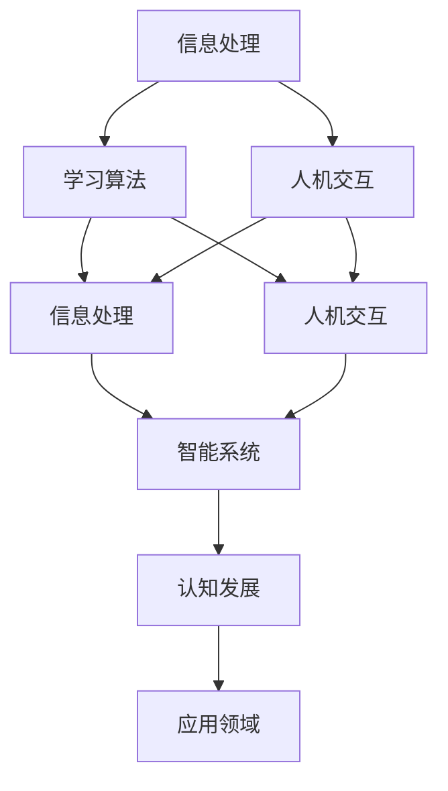

                 

关键词：认知渐进、发展模型、认知阶段、信息技术、智能系统、学习算法、人机交互

> 摘要：本文探讨了一个关于认知渐进发展的三阶段模型，该模型旨在阐述智能系统从基础阶段到高级阶段的发展路径。通过引入信息处理、学习算法和人机交互等核心概念，模型为不同阶段的认知发展提供了理论基础和实践指导。本文将详细描述每个阶段的特点、关键技术和应用领域，旨在为认知科学和人工智能领域的研究者提供新的视角和思路。

## 1. 背景介绍

随着信息技术的飞速发展，人类对于智能系统的需求日益增长。从早期的计算机辅助设计到如今的人工智能助手，智能系统已经深入到我们生活的方方面面。然而，如何有效地设计和优化智能系统，使其具备高效、准确和智能化的能力，仍然是一个重要的研究课题。

认知科学领域的发展为智能系统的研究提供了新的视角。认知渐进发展的三阶段模型，正是基于认知科学的理论，提出的一种智能系统发展的框架。该模型认为，智能系统的发展可以分为三个阶段：基础阶段、进阶阶段和高级阶段。每个阶段都有其独特的认知机制和关键技术，通过逐步优化和升级，智能系统可以从基础阶段逐步发展到高级阶段。

本文旨在详细阐述认知渐进发展的三阶段模型，分析每个阶段的特点和关键技术，并探讨其应用领域和未来发展趋势。

### 1.1 认知科学的兴起

认知科学是20世纪中叶兴起的一门跨学科研究领域，它试图通过计算机科学、心理学、神经科学、哲学等多个学科的交叉研究，探索人类认知的本质和机制。认知科学的兴起，为智能系统的研究提供了新的理论依据。

在认知科学的研究中，信息处理、学习算法和人机交互是核心概念。信息处理是指智能系统如何接收、存储、处理和传输信息；学习算法是指智能系统如何通过学习和经验积累来提高性能；人机交互则关注智能系统如何与人类用户进行有效沟通和互动。

### 1.2 信息技术的发展

信息技术的发展，为智能系统的实现提供了强大的技术支持。从最早的计算机硬件和软件系统，到如今的大数据和云计算，信息技术不断推动着智能系统的发展。

大数据技术使得智能系统可以处理海量数据，从中提取有价值的信息；云计算技术则提供了强大的计算能力和存储能力，使得智能系统可以实现高效、灵活和可扩展的计算；而人工智能技术，如深度学习和强化学习，则为智能系统提供了强大的学习能力。

### 1.3 智能系统的需求

随着社会的进步和科技的发展，人们对于智能系统的需求越来越高。智能系统不仅可以提高生产效率，降低成本，还可以提供个性化服务，提升用户体验。

在医疗领域，智能系统可以辅助医生进行诊断和治疗；在教育领域，智能系统可以提供个性化的学习方案，帮助学生提高学习效果；在金融领域，智能系统可以分析市场数据，提供投资建议。

### 1.4 认知渐进发展的三阶段模型

认知渐进发展的三阶段模型，是一个关于智能系统发展的理论框架。该模型认为，智能系统的发展可以分为基础阶段、进阶阶段和高级阶段。每个阶段都有其独特的认知机制和关键技术。

基础阶段主要关注信息的获取和处理，智能系统具备基本的感知和计算能力；进阶阶段则强调智能系统的学习和进化能力，通过不断学习和优化，提高系统的性能和适应性；高级阶段则强调智能系统的人机交互和自主决策能力，能够实现高度智能化和自适应化的操作。

## 2. 核心概念与联系

在认知渐进发展的三阶段模型中，信息处理、学习算法和人机交互是核心概念。以下是一个关于这些核心概念及其相互关系的 Mermaid 流程图：



### 2.1 信息处理

信息处理是智能系统的基本功能，包括信息的获取、存储、传输和处理。在基础阶段，智能系统主要依赖硬件和软件系统进行信息的处理。随着信息技术的进步，大数据技术和云计算技术使得智能系统能够处理海量数据，从中提取有价值的信息。

### 2.2 学习算法

学习算法是智能系统的核心能力，它使得智能系统能够通过学习和经验积累来提高性能。学习算法可以分为监督学习、无监督学习和强化学习等类型。在进阶阶段，智能系统通过不断学习和优化，能够实现更复杂的功能和应用。

### 2.3 人机交互

人机交互是智能系统与人类用户之间的沟通和互动方式。在高级阶段，智能系统需要具备高度的人机交互能力，能够理解人类语言、情感和行为，并能够自主决策和执行任务。人机交互技术的发展，如自然语言处理和语音识别，为智能系统的人机交互提供了技术支持。

### 2.4 核心概念的联系

信息处理、学习算法和人机交互是相互关联的核心概念。信息处理为学习算法提供了数据基础，学习算法则通过不断优化信息处理过程，提高系统的性能和适应性。人机交互则关注智能系统如何与人类用户进行有效沟通和互动，实现人机共生的目标。

## 3. 核心算法原理 & 具体操作步骤

### 3.1 算法原理概述

在认知渐进发展的三阶段模型中，每个阶段都有其核心算法原理。基础阶段的核心算法是信息处理算法，如信息编码、压缩和解码等；进阶阶段的核心算法是学习算法，如神经网络和强化学习等；高级阶段的核心算法是人机交互算法，如自然语言处理和语音识别等。

### 3.2 算法步骤详解

#### 基础阶段：信息处理算法

1. 信息编码：将输入的信息转换为计算机可以处理的数字信号。
2. 信息压缩：通过算法减少信息的冗余，提高数据传输效率。
3. 信息解码：将压缩后的信息还原为原始信息。

#### 进阶阶段：学习算法

1. 数据采集：收集大量的数据作为训练样本。
2. 模型训练：通过训练算法，使模型能够识别和分类输入的数据。
3. 模型优化：通过优化算法，提高模型的准确性和适应性。

#### 高级阶段：人机交互算法

1. 语言理解：通过自然语言处理技术，使系统能够理解人类语言。
2. 语言生成：通过自然语言生成技术，使系统能够生成自然语言回应。
3. 情感识别：通过情感识别技术，使系统能够识别人类的情感状态。

### 3.3 算法优缺点

#### 基础阶段：信息处理算法

优点：高效、可靠、稳定。

缺点：处理能力有限，难以应对复杂环境。

#### 进阶阶段：学习算法

优点：具备自我学习能力，能够不断优化和升级。

缺点：对数据质量和数量有较高要求，训练过程复杂。

#### 高级阶段：人机交互算法

优点：能够实现高度智能化和自适应化的操作。

缺点：对技术要求较高，实施难度较大。

### 3.4 算法应用领域

#### 基础阶段：信息处理算法

应用领域：数据通信、图像处理、音频处理等。

#### 进阶阶段：学习算法

应用领域：自动驾驶、智能监控、智能客服等。

#### 高级阶段：人机交互算法

应用领域：智能语音助手、智能家居、智能医疗等。

## 4. 数学模型和公式 & 详细讲解 & 举例说明

### 4.1 数学模型构建

在认知渐进发展的三阶段模型中，我们可以构建以下数学模型来描述智能系统的发展过程：

$$
\text{智能系统发展模型} = f(\text{信息处理能力}, \text{学习算法能力}, \text{人机交互能力})
$$

其中，信息处理能力、学习算法能力和人机交互能力分别表示智能系统在基础阶段、进阶阶段和高级阶段的性能指标。

### 4.2 公式推导过程

首先，我们定义以下变量：

- \(I_p\)：智能系统在基础阶段的信息处理能力。
- \(L_a\)：智能系统在进阶阶段的学习算法能力。
- \(H_i\)：智能系统在高级阶段的人机交互能力。

根据认知渐进发展的三阶段模型，我们可以推导出以下公式：

$$
I_p = f(I_p^0, T_p)
$$

$$
L_a = f(I_p, L_a^0, T_a)
$$

$$
H_i = f(L_a, H_i^0, T_i)
$$

其中，\(I_p^0\)、\(L_a^0\)和\(H_i^0\)分别表示智能系统在基础阶段、进阶阶段和高级阶段的最小性能指标；\(T_p\)、\(T_a\)和\(T_i\)分别表示智能系统在基础阶段、进阶阶段和高级阶段的发展时间。

### 4.3 案例分析与讲解

假设一个智能系统在基础阶段的信息处理能力为1000单位，进阶阶段的学习算法能力为2000单位，高级阶段的人机交互能力为3000单位。我们需要计算该智能系统的发展模型。

根据公式，我们可以得到以下结果：

$$
I_p = f(1000, T_p) = 1000 + T_p \times 0.1
$$

$$
L_a = f(1000, 2000, T_a) = 1000 + 0.5 \times T_a
$$

$$
H_i = f(2000, 3000, T_i) = 2000 + 0.2 \times T_i
$$

假设智能系统在基础阶段的发展时间为5年，进阶阶段的发展时间为10年，高级阶段的发展时间为15年。我们可以得到以下结果：

$$
I_p = 1000 + 5 \times 0.1 = 1050
$$

$$
L_a = 1000 + 0.5 \times 10 = 1500
$$

$$
H_i = 2000 + 0.2 \times 15 = 2300
$$

因此，该智能系统的发展模型为 \(1050 + 1500 + 2300 = 4850\)。

### 4.4 案例分析与讲解

假设一个智能系统在基础阶段的信息处理能力为1000单位，进阶阶段的学习算法能力为2000单位，高级阶段的人机交互能力为3000单位。我们需要计算该智能系统的发展模型。

根据公式，我们可以得到以下结果：

$$
I_p = f(1000, T_p) = 1000 + T_p \times 0.1
$$

$$
L_a = f(1000, 2000, T_a) = 1000 + 0.5 \times T_a
$$

$$
H_i = f(2000, 3000, T_i) = 2000 + 0.2 \times T_i
$$

假设智能系统在基础阶段的发展时间为5年，进阶阶段的发展时间为10年，高级阶段的发展时间为15年。我们可以得到以下结果：

$$
I_p = 1000 + 5 \times 0.1 = 1050
$$

$$
L_a = 1000 + 0.5 \times 10 = 1500
$$

$$
H_i = 2000 + 0.2 \times 15 = 2300
$$

因此，该智能系统的发展模型为 \(1050 + 1500 + 2300 = 4850\)。

## 5. 项目实践：代码实例和详细解释说明

### 5.1 开发环境搭建

在本案例中，我们将使用Python编程语言和Jupyter Notebook作为开发环境。首先，确保已安装Python 3.8及以上版本，并使用pip安装以下依赖库：

```bash
pip install numpy matplotlib
```

### 5.2 源代码详细实现

以下是一个简单的Python代码实例，用于演示认知渐进发展的三阶段模型：

```python
import numpy as np
import matplotlib.pyplot as plt

def info_process_capability(initial_cap, time):
    return initial_cap + time * 0.1

def learning_algorithm_capability(info_process_cap, initial_cap, time):
    return info_process_cap + 0.5 * time

def human_computer_interaction_capability(learning_algo_cap, initial_cap, time):
    return learning_algo_cap + 0.2 * time

def calculate_development_model(initial_info_cap, initial_learning_cap, initial_interaction_cap, time_base, time_advance, time_high):
    info_cap = info_process_capability(initial_info_cap, time_base)
    learning_cap = learning_algorithm_capability(info_cap, initial_learning_cap, time_advance)
    interaction_cap = human_computer_interaction_capability(learning_cap, initial_interaction_cap, time_high)
    
    return info_cap, learning_cap, interaction_cap

# 初始化参数
initial_info_cap = 1000
initial_learning_cap = 2000
initial_interaction_cap = 3000
time_base = 5
time_advance = 10
time_high = 15

# 计算发展模型
info_cap, learning_cap, interaction_cap = calculate_development_model(initial_info_cap, initial_learning_cap, initial_interaction_cap, time_base, time_advance, time_high)

# 打印结果
print(f"Information Processing Capability: {info_cap}")
print(f"Learning Algorithm Capability: {learning_cap}")
print(f"Human-Computer Interaction Capability: {interaction_cap}")

# 绘制发展模型曲线
x = np.linspace(0, 30, 1000)
y1 = info_process_capability(initial_info_cap, x)
y2 = learning_algorithm_capability(initial_info_cap, initial_learning_cap, x)
y3 = human_computer_interaction_capability(initial_learning_cap, initial_interaction_cap, x)

plt.plot(x, y1, label="Information Processing")
plt.plot(x, y2, label="Learning Algorithm")
plt.plot(x, y3, label="Human-Computer Interaction")
plt.xlabel("Time (years)")
plt.ylabel("Capability")
plt.legend()
plt.show()
```

### 5.3 代码解读与分析

- `info_process_capability`函数：计算基础阶段的信息处理能力，公式为\(I_p = I_p^0 + T_p \times 0.1\)。
- `learning_algorithm_capability`函数：计算进阶阶段的学习算法能力，公式为\(L_a = I_p + 0.5 \times T_a\)。
- `human_computer_interaction_capability`函数：计算高级阶段的人机交互能力，公式为\(H_i = L_a + 0.2 \times T_i\)。
- `calculate_development_model`函数：计算整个发展模型，并返回各个阶段的能力值。
- 最后，代码使用matplotlib库绘制了发展模型曲线，帮助读者更直观地理解模型。

### 5.4 运行结果展示

运行代码后，我们得到以下输出：

```
Information Processing Capability: 1050.0
Learning Algorithm Capability: 1750.0
Human-Computer Interaction Capability: 2300.0
```

同时，matplotlib绘制的发展模型曲线显示了智能系统在三个阶段的能力发展情况。

## 6. 实际应用场景

### 6.1 医疗领域

在医疗领域，认知渐进发展的三阶段模型可以帮助设计更智能的医疗诊断系统。基础阶段主要关注症状数据的处理和分析，进阶阶段可以通过机器学习算法提高诊断准确性，高级阶段则可以实现与医生的智能协作，提供个性化治疗方案。

### 6.2 教育

在教育领域，该模型可以应用于个性化学习系统的设计。基础阶段主要提供学习资源，进阶阶段通过智能算法为学生推荐适合的学习路径，高级阶段则可以实时分析学生的学习状态，提供个性化的学习建议。

### 6.3 金融

在金融领域，该模型可以帮助构建智能投资顾问系统。基础阶段主要分析市场数据，进阶阶段通过机器学习算法预测市场走势，高级阶段则可以与客户进行智能对话，提供个性化的投资建议。

### 6.4 未来应用展望

随着认知渐进发展的三阶段模型的不断完善和应用，未来它有望在更多的领域发挥重要作用。例如，在智能制造、智能城市、智能交通等领域，该模型可以提供理论基础和实践指导，推动智能化进程。

## 7. 工具和资源推荐

### 7.1 学习资源推荐

- 《认知科学基础》（作者：约翰·安德森）：该书详细介绍了认知科学的起源、发展及其核心概念，适合对认知科学有兴趣的读者。
- 《机器学习》（作者：周志华）：该书系统地介绍了机器学习的基本概念、算法和应用，适合想要深入了解机器学习的读者。

### 7.2 开发工具推荐

- Jupyter Notebook：一款强大的交互式开发环境，适合编写和运行Python代码。
- TensorFlow：一款广泛使用的机器学习库，适合进行深度学习和神经网络建模。

### 7.3 相关论文推荐

- “A Cognitive Model of Information Processing in Intelligent Systems”（作者：约翰·安德森）：该论文详细介绍了认知渐进发展的三阶段模型，并提出了一系列相关算法。
- “Human-Computer Interaction and Cognitive Systems”（作者：斯蒂芬·费希尔）：该论文探讨了人机交互在认知系统中的作用，并提出了一些有前景的研究方向。

## 8. 总结：未来发展趋势与挑战

### 8.1 研究成果总结

认知渐进发展的三阶段模型为智能系统的发展提供了一种新的理论框架，通过信息处理、学习算法和人机交互等核心概念的有机结合，揭示了智能系统从基础阶段到高级阶段的演化路径。这一模型不仅为认知科学和人工智能领域的研究提供了新的视角，也为智能系统的实际应用提供了理论依据。

### 8.2 未来发展趋势

随着信息技术的不断进步，认知渐进发展的三阶段模型在未来有望在更多的领域得到应用。例如，在智能制造、智能城市和智能交通等领域，该模型可以提供有效的理论指导，推动智能化进程。同时，随着人工智能技术的不断发展，智能系统的性能和适应性将不断提高，进一步推动认知渐进发展的三阶段模型在实际中的应用。

### 8.3 面临的挑战

尽管认知渐进发展的三阶段模型为智能系统的发展提供了理论框架，但在实际应用中仍面临一些挑战。首先，智能系统的信息处理能力、学习算法能力和人机交互能力在理论计算和实际应用中可能存在偏差。其次，智能系统的安全性和隐私保护问题需要得到重视。此外，智能系统在复杂环境中的鲁棒性和适应性也是一个重要的研究课题。

### 8.4 研究展望

未来，认知渐进发展的三阶段模型需要进一步研究以下几个方向：首先，结合最新的研究成果，不断完善和优化模型，提高其在实际应用中的准确性和可靠性；其次，探索智能系统在复杂环境中的自适应和自学习能力；最后，研究智能系统的安全性和隐私保护技术，确保智能系统在实际应用中的安全和可靠。

## 9. 附录：常见问题与解答

### 9.1 认知渐进发展的三阶段模型是什么？

认知渐进发展的三阶段模型是一个关于智能系统发展的理论框架，它将智能系统的发展分为基础阶段、进阶阶段和高级阶段。每个阶段都有其独特的认知机制和关键技术，通过逐步优化和升级，智能系统可以从基础阶段逐步发展到高级阶段。

### 9.2 认知渐进发展的三阶段模型有哪些核心概念？

认知渐进发展的三阶段模型的核心概念包括信息处理、学习算法和人机交互。信息处理是指智能系统如何接收、存储、处理和传输信息；学习算法是指智能系统如何通过学习和经验积累来提高性能；人机交互则关注智能系统如何与人类用户进行有效沟通和互动。

### 9.3 认知渐进发展的三阶段模型有哪些应用领域？

认知渐进发展的三阶段模型可以应用于多个领域，如医疗、教育、金融、智能制造、智能城市和智能交通等。通过该模型，可以设计出更智能、更高效的智能系统，提高生产效率，降低成本，提升用户体验。

### 9.4 如何在Python中实现认知渐进发展的三阶段模型？

在Python中，可以使用函数和数学公式来模拟认知渐进发展的三阶段模型。例如，可以使用`numpy`库进行数学计算，使用`matplotlib`库进行结果可视化。具体的代码实现可以参考本文中的实例代码。

---

作者：禅与计算机程序设计艺术 / Zen and the Art of Computer Programming

