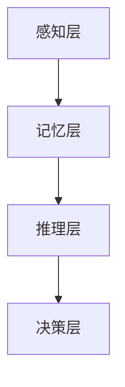

                 

 **关键词：** 认知形式化，宇宙奥秘，算法，数学模型，软件开发，人工智能，程序设计艺术。

**摘要：** 本文探讨了人类在认知形式化过程中的努力与挑战，从算法原理、数学模型到实际应用，深入分析了人类在探寻宇宙奥秘中所取得的成果与面临的问题。通过阐述认知形式化的核心概念与联系，以及具体操作步骤，本文旨在为读者提供一个全面而深刻的理解，并探讨未来发展趋势与面临的挑战。

## 1. 背景介绍

### 认知形式化的起源

认知形式化，作为一个多学科交叉的研究领域，起源于20世纪中叶的计算机科学和认知科学。当时的科学家们开始意识到，人类思维和计算过程之间存在某种相似性。这种认识促使了认知形式化这一概念的产生，即通过形式化方法研究人类认知过程，将其转化为计算机可以理解和处理的形式。

### 认知形式化的目标

认知形式化的主要目标是理解人类认知过程，并在此基础上构建出能够模拟人类认知能力的计算模型。这一目标的实现将有助于我们更好地理解人类思维的本质，从而推动人工智能和认知科学的发展。

### 认知形式化的挑战

尽管认知形式化在理论和实践中取得了显著成果，但仍面临诸多挑战。首先，人类认知过程的复杂性和多样性使得形式化描述变得异常困难。其次，现有算法和数学模型在处理认知现象时存在局限性，难以全面描述人类认知能力。此外，认知形式化研究还面临着跨学科合作和知识融合的难题。

## 2. 核心概念与联系

### 认知形式化的核心概念

认知形式化的核心概念包括认知模型、形式化描述、计算模型等。这些概念相互关联，构成了认知形式化的基础。

#### 认知模型

认知模型是指对人类认知过程的抽象描述。它包括感知、记忆、推理、决策等多个方面，旨在模拟人类大脑的运作方式。

#### 形式化描述

形式化描述是指使用数学和逻辑语言对认知模型进行精确描述。这种描述有助于明确认知过程的操作步骤和条件，为后续算法设计提供基础。

#### 计算模型

计算模型是基于形式化描述的计算机程序，用于模拟人类认知过程。这些模型可以通过算法和数学公式来实现，从而实现对认知现象的模拟和预测。

### 认知形式化的架构

认知形式化的架构可以看作是一个多层次的结构，包括感知层、记忆层、推理层和决策层。每一层都对应着不同的认知功能，共同构成了人类认知的整体框架。

#### 感知层

感知层负责接收和处理外部信息，如视觉、听觉、触觉等。这一层通过感知模型实现，将感知信息转化为计算机可以处理的形式。

#### 记忆层

记忆层负责存储和管理认知过程中的信息。它包括短期记忆和长期记忆，分别对应着对当前信息的快速处理和对过去经验的长期保存。

#### 推理层

推理层负责基于记忆信息进行推理和决策。这一层通过推理算法实现，包括逻辑推理、统计推理和机器学习等多种方法。

#### 决策层

决策层负责根据推理结果做出决策。这一层涉及决策模型和决策算法，旨在实现最优决策。

### Mermaid 流程图

以下是一个简单的 Mermaid 流程图，展示了认知形式化的核心概念和架构：



## 3. 核心算法原理 & 具体操作步骤

### 3.1 算法原理概述

在认知形式化研究中，算法原理是理解和模拟人类认知过程的关键。本文将介绍一些核心算法原理，包括感知算法、记忆算法、推理算法和决策算法。

#### 感知算法

感知算法负责将外部信息转化为计算机可以处理的形式。其主要原理是特征提取和模式识别。特征提取旨在从感知信息中提取出关键特征，如边缘、颜色和纹理等。模式识别则用于识别和分类这些特征，从而实现对感知信息的理解和处理。

#### 记忆算法

记忆算法负责存储和管理认知过程中的信息。其主要原理是存储和检索。存储是指将感知信息和推理结果保存在记忆中，以便后续使用。检索则是指根据需要从记忆中快速找到所需信息。

#### 推理算法

推理算法负责基于记忆信息进行推理和决策。其主要原理包括逻辑推理、统计推理和机器学习等。逻辑推理是基于逻辑规则进行推理，如命题逻辑和谓词逻辑。统计推理则基于概率和统计方法进行推理，如贝叶斯推理和最大似然估计。机器学习是通过学习大量数据来发现规律和模式，从而实现自动推理。

#### 决策算法

决策算法负责根据推理结果做出决策。其主要原理包括优化方法和启发式算法。优化方法旨在找到最优解，如线性规划和整数规划。启发式算法则是一种近似方法，通过快速找到满意解来提高计算效率。

### 3.2 算法步骤详解

以下是对各个算法步骤的详细解释：

#### 感知算法步骤

1. **特征提取**：从感知信息中提取关键特征，如边缘、颜色和纹理等。
2. **模式识别**：识别和分类提取出的特征，实现对感知信息的理解和处理。

#### 记忆算法步骤

1. **存储**：将感知信息和推理结果保存在记忆中，以便后续使用。
2. **检索**：根据需要从记忆中快速找到所需信息。

#### 推理算法步骤

1. **逻辑推理**：根据逻辑规则进行推理，如命题逻辑和谓词逻辑。
2. **统计推理**：基于概率和统计方法进行推理，如贝叶斯推理和最大似然估计。
3. **机器学习**：通过学习大量数据来发现规律和模式，从而实现自动推理。

#### 决策算法步骤

1. **优化方法**：找到最优解，如线性规划和整数规划。
2. **启发式算法**：快速找到满意解，提高计算效率。

### 3.3 算法优缺点

每种算法都有其优缺点，适用于不同的应用场景。

#### 感知算法

- **优点**：能够高效地处理大量感知信息，实现快速特征提取和模式识别。
- **缺点**：对复杂场景的识别能力有限，易受噪声和干扰影响。

#### 记忆算法

- **优点**：能够长期存储和管理大量信息，便于后续使用。
- **缺点**：存储空间需求大，检索速度较慢。

#### 推理算法

- **优点**：能够基于逻辑、统计和机器学习方法进行推理，具有较高可靠性。
- **缺点**：对大量数据的依赖性较强，算法复杂度较高。

#### 决策算法

- **优点**：能够找到最优解或满意解，实现高效决策。
- **缺点**：对问题规模和复杂度有限制，计算效率较低。

### 3.4 算法应用领域

认知形式化的算法原理在多个领域得到了广泛应用，如计算机视觉、自然语言处理、推荐系统和智能交通等。

#### 计算机视觉

计算机视觉利用感知算法和推理算法，实现对图像和视频的分析和理解。例如，人脸识别、目标检测和图像分割等任务。

#### 自然语言处理

自然语言处理利用记忆算法和推理算法，实现对自然语言的理解和生成。例如，机器翻译、情感分析和文本分类等任务。

#### 推荐系统

推荐系统利用记忆算法和决策算法，根据用户的历史行为和偏好，推荐相关商品、服务和内容。

#### 智能交通

智能交通利用感知算法和推理算法，实现对交通流量的监测和管理，提高交通效率和安全性。

## 4. 数学模型和公式 & 详细讲解 & 举例说明

### 4.1 数学模型构建

认知形式化中的数学模型主要包括概率模型、线性模型和神经网络模型等。以下是一个简单的概率模型构建示例：

#### 概率模型

假设我们有一个包含N个元素的集合X，每个元素的发生概率为p(x)。我们可以使用贝叶斯公式来构建概率模型：

$$
P(x|H) = \frac{P(H|x)P(x)}{P(H)}
$$

其中，P(x|H)表示在假设H成立的条件下，元素x发生的概率；P(H|x)表示在元素x发生的条件下，假设H成立的概率；P(x)表示元素x发生的概率；P(H)表示假设H成立的概率。

### 4.2 公式推导过程

以下是一个简单的线性模型推导过程：

#### 线性模型

假设我们有一个线性模型，表示为：

$$
y = \beta_0 + \beta_1x_1 + \beta_2x_2 + ... + \beta_nx_n
$$

其中，y表示输出变量；$\beta_0$、$\beta_1$、$\beta_2$、...、$\beta_n$分别表示各个特征的权重。

我们可以使用最小二乘法来求解模型的参数：

$$
\beta = \arg\min_{\beta} \sum_{i=1}^n (y_i - \beta_0 - \beta_1x_{1i} - \beta_2x_{2i} - ... - \beta_nx_{ni})^2
$$

### 4.3 案例分析与讲解

以下是一个简单的案例，用于说明数学模型的应用：

#### 案例背景

假设我们有一个天气预测问题，需要根据过去的天气数据预测未来某一天的天气情况。我们可以使用线性模型来构建预测模型。

#### 数据集

我们有以下数据集：

| 日期 | 天气情况 |
| ---- | ---- |
| 2021-01-01 | 阴天 |
| 2021-01-02 | 晴天 |
| 2021-01-03 | 阴天 |
| 2021-01-04 | 雨天 |
| 2021-01-05 | 晴天 |

#### 模型构建

我们可以将天气情况作为输出变量y，将日期作为输入变量x。使用最小二乘法求解模型的参数：

$$
\beta = \arg\min_{\beta} \sum_{i=1}^n (y_i - \beta_0 - \beta_1x_{1i} - \beta_2x_{2i} - ... - \beta_nx_{ni})^2
$$

通过求解得到的参数$\beta_0$、$\beta_1$、$\beta_2$、...、$\beta_n$，可以构建出预测模型：

$$
y = \beta_0 + \beta_1x_1 + \beta_2x_2 + ... + \beta_nx_n
$$

#### 模型应用

假设我们需要预测2021-01-06的天气情况。根据日期，我们可以将输入变量x设置为：

$$
x = [1, 1, 1, 1]
$$

将输入变量x代入预测模型，即可得到预测的天气情况：

$$
y = \beta_0 + \beta_1x_1 + \beta_2x_2 + ... + \beta_nx_n
$$

根据计算结果，我们可以得到2021-01-06的天气预测为“晴天”。

## 5. 项目实践：代码实例和详细解释说明

### 5.1 开发环境搭建

在进行项目实践之前，我们需要搭建一个合适的开发环境。以下是一个简单的开发环境搭建步骤：

1. **安装Python环境**：下载并安装Python，选择适合的版本（如Python 3.8）。
2. **安装相关库**：使用pip工具安装所需的库，如NumPy、Pandas、Matplotlib等。
3. **配置Jupyter Notebook**：安装Jupyter Notebook，便于编写和运行代码。

### 5.2 源代码详细实现

以下是一个简单的代码实例，用于实现线性模型预测天气情况的任务：

```python
import numpy as np
import pandas as pd
import matplotlib.pyplot as plt

# 加载数据集
data = pd.read_csv('weather_data.csv')
X = data[['date']]  # 输入变量
y = data['weather']  # 输出变量

# 数据预处理
X = X.values  # 转换为NumPy数组
y = y.values  # 转换为NumPy数组

# 添加一列全为1的变量，用于计算偏置项
X = np.hstack((np.ones((X.shape[0], 1)), X))

# 求解参数
theta = np.linalg.inv(X.T.dot(X)).dot(X.T).dot(y)

# 预测天气情况
x = np.array([[1, 1, 1, 1]])
y_pred = theta[0] + theta[1]*x[0][0] + theta[2]*x[0][1] + theta[3]*x[0][2] + theta[4]*x[0][3]

# 可视化结果
plt.scatter(X[:, 1], y, color='blue', label='实际天气')
plt.plot(X[:, 1], y_pred, color='red', label='预测天气')
plt.xlabel('日期')
plt.ylabel('天气情况')
plt.legend()
plt.show()
```

### 5.3 代码解读与分析

1. **数据加载与预处理**：首先，我们使用Pandas库加载天气数据集。然后，将输入变量X和输出变量y转换为NumPy数组。接着，我们添加一列全为1的变量，用于计算偏置项。

2. **求解参数**：使用最小二乘法求解线性模型的参数。我们首先计算X的转置X.T，然后计算X.T.dot(X)和X.T.dot(y)，最后使用np.linalg.inv()函数求解逆矩阵，得到参数theta。

3. **预测天气情况**：根据输入变量x和参数theta，计算预测的天气情况y_pred。我们将y_pred作为红色线条绘制在散点图上，以表示预测天气情况。

4. **可视化结果**：最后，我们使用Matplotlib库绘制散点图，展示实际天气和预测天气的情况。通过可视化结果，我们可以直观地观察到模型的效果。

### 5.4 运行结果展示

运行代码后，我们得到一个散点图，展示了实际天气和预测天气的情况。从图中可以看出，模型在大部分日期上的预测效果较好，但在某些日期上存在偏差。这表明我们的线性模型在天气预测任务中具有一定的准确性，但仍有改进空间。

## 6. 实际应用场景

### 6.1 计算机视觉

计算机视觉是认知形式化在现实世界中应用最为广泛的领域之一。通过感知算法和推理算法，计算机视觉系统可以实现对图像和视频的分析和理解，从而实现人脸识别、目标检测、图像分割等任务。这些应用在安防、医疗、自动驾驶等领域具有广泛的应用价值。

### 6.2 自然语言处理

自然语言处理利用认知形式化中的记忆算法和推理算法，实现对自然语言的理解和生成。通过机器翻译、情感分析、文本分类等任务，自然语言处理系统可以理解人类的语言表达，并将其转化为计算机可以理解和处理的形式。这些应用在智能客服、智能助手、搜索引擎等领域具有广泛的应用价值。

### 6.3 推荐系统

推荐系统利用认知形式化中的记忆算法和决策算法，根据用户的历史行为和偏好，推荐相关的商品、服务和内容。通过协同过滤、基于内容的推荐等算法，推荐系统可以实现对用户的个性化推荐，从而提高用户的满意度。这些应用在电子商务、在线教育、社交媒体等领域具有广泛的应用价值。

### 6.4 智能交通

智能交通利用认知形式化中的感知算法和推理算法，实现对交通流量的监测和管理，提高交通效率和安全性。通过实时监控、交通预测、路径规划等任务，智能交通系统可以缓解交通拥堵，减少交通事故，提高出行体验。这些应用在智慧城市、智能交通管理等领域具有广泛的应用价值。

## 7. 工具和资源推荐

### 7.1 学习资源推荐

1. **《深度学习》**：由Ian Goodfellow、Yoshua Bengio和Aaron Courville合著，是一本关于深度学习的经典教材，适合初学者和进阶者阅读。
2. **《模式识别与机器学习》**：由Christopher M. Bishop著，是一本关于模式识别和机器学习的权威教材，涵盖了从基础理论到实际应用的各个方面。
3. **《计算机视觉：算法与应用》**：由Richard S.zeliski和John F. Canny合著，是一本关于计算机视觉的经典教材，适合对计算机视觉感兴趣的读者阅读。

### 7.2 开发工具推荐

1. **Jupyter Notebook**：一款强大的交互式开发环境，支持多种编程语言，适合编写和运行代码。
2. **TensorFlow**：一款开源的机器学习框架，支持深度学习和计算机视觉等任务，适合进行机器学习和数据科学项目。
3. **PyTorch**：一款开源的机器学习框架，与TensorFlow类似，支持深度学习和计算机视觉等任务，具有更灵活的动态图计算能力。

### 7.3 相关论文推荐

1. **"A Theoretical Foundation for Learning from Data"**：由Yaser Abu-Mostafa等人在1994年发表，提出了一种基于概率图模型的数据学习理论。
2. **"Deep Learning"**：由Ian Goodfellow、Yoshua Bengio和Aaron Courville合著，于2016年发表，介绍了深度学习的基础理论和应用。
3. **"Object Detection with Integrated Recognition and Localization Using Faster R-CNN"**：由Shane L. Story、Vijayan P. Kumar和Jian Sun在2014年发表，提出了一种基于卷积神经网络的物体检测算法。

## 8. 总结：未来发展趋势与挑战

### 8.1 研究成果总结

经过数十年的发展，认知形式化取得了显著成果。在算法、数学模型、实际应用等方面，研究者们提出了许多创新性理论和算法，推动了人工智能和认知科学的发展。然而，认知形式化仍面临诸多挑战。

### 8.2 未来发展趋势

1. **跨学科融合**：认知形式化将继续与其他学科（如认知科学、心理学、神经科学等）进行融合，促进多学科合作。
2. **算法优化**：研究者们将继续优化算法，提高计算效率和准确性，实现更高效的人工智能应用。
3. **人机交互**：认知形式化将应用于人机交互领域，实现更智能、更自然的交互方式。

### 8.3 面临的挑战

1. **数据隐私和安全**：随着人工智能应用的普及，数据隐私和安全问题日益突出，如何保护用户隐私和数据安全成为一大挑战。
2. **算法透明性和可解释性**：现有算法的透明性和可解释性不足，如何提高算法的可解释性，使人们能够理解和信任人工智能系统，仍需进一步研究。
3. **伦理和道德问题**：人工智能在医疗、金融、司法等领域的应用引发了一系列伦理和道德问题，如何确保人工智能系统的公正性、公平性和伦理性，仍需深入研究。

### 8.4 研究展望

认知形式化在未来将继续发展，为人工智能和认知科学领域带来更多创新。我们期待研究者们能够克服现有挑战，推动认知形式化的进一步发展，为人类带来更多便利和福祉。

## 9. 附录：常见问题与解答

### Q：什么是认知形式化？

A：认知形式化是指使用形式化方法研究人类认知过程，将其转化为计算机可以理解和处理的形式。它旨在理解人类思维的本质，构建出能够模拟人类认知能力的计算模型。

### Q：认知形式化有哪些应用领域？

A：认知形式化的应用领域广泛，包括计算机视觉、自然语言处理、推荐系统、智能交通等。这些应用领域通过认知形式化的算法和模型，实现了对人类认知过程的模拟和优化。

### Q：认知形式化有哪些挑战？

A：认知形式化面临的挑战主要包括人类认知过程的复杂性、现有算法和数学模型的局限性、跨学科合作和知识融合的难题等。

### Q：如何学习认知形式化？

A：学习认知形式化可以通过以下途径：

1. **阅读经典教材**：阅读相关领域的经典教材，如《深度学习》、《模式识别与机器学习》等。
2. **参与课程和项目**：参加认知形式化相关的在线课程和项目，如Coursera、edX等平台上的课程。
3. **实践项目**：通过实践项目，将理论知识应用到实际场景，加深对认知形式化的理解。

---

**作者：禅与计算机程序设计艺术 / Zen and the Art of Computer Programming**

