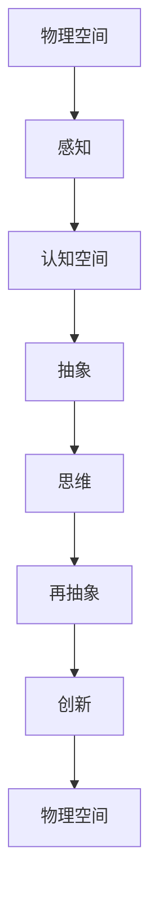

                 

 **摘要：**

本文旨在探讨认知的形式化过程，即物理空间和认知空间的交互作用如何激发人类的想象力和创造力，进而引发从感知到思维的再抽象。通过对认知形式化的深入分析，本文揭示了其内在的数学模型和算法原理，并通过具体实例和项目实践，阐述了该理论在计算机科学和技术领域的应用。最后，本文提出了未来发展趋势与面临的挑战，为相关研究提供了有益的参考。

## 1. 背景介绍

在人类的历史长河中，认知活动始终是推动社会进步的重要动力。从简单的感知到复杂的思维，人类的认知能力经历了不断的演化和提升。然而，如何将这些认知活动形式化，并将其应用于计算机科学和技术领域，一直是学者们关注的焦点。

随着计算机科学的发展，形式化认知逐渐成为研究热点。形式化认知是指将人类认知活动转化为数学模型和算法，以便于计算机理解和模拟。这一过程不仅有助于提升计算机的性能，还可以为人工智能的发展提供新的思路。

本文将探讨认知的形式化过程，分析其内在的数学模型和算法原理，并探讨其在计算机科学和技术领域的应用。

## 2. 核心概念与联系

在认知的形式化过程中，我们需要明确以下几个核心概念：

### 2.1 物理空间

物理空间是指客观存在的物质世界，包括各种物理现象和规律。物理空间是认知活动的载体，人类的感知和认知都依赖于物理空间。

### 2.2 认知空间

认知空间是指人类在感知物理空间的基础上，通过思维和推理所形成的抽象空间。认知空间是主观的，具有多样性和动态性。

### 2.3 认知形式化

认知形式化是指将人类认知活动转化为数学模型和算法的过程。通过认知形式化，我们可以将认知活动量化，使其具有可计算性。

### 2.4 物理空间和认知空间的交互

物理空间和认知空间的交互是指物理空间对认知空间的塑造和认知空间对物理空间的反作用。这种交互作用是认知形式化的基础，也是人类想象力和创造力的重要源泉。

### 2.5 Mermaid 流程图

以下是一个简化的 Mermaid 流程图，展示了物理空间和认知空间的交互过程：



## 3. 核心算法原理 & 具体操作步骤

### 3.1 算法原理概述

认知形式化的核心算法是基于图灵机的计算模型。图灵机是一种抽象的计算模型，可以模拟任何计算过程。在认知形式化中，我们将人类认知活动转化为图灵机模型，以便于计算机理解和模拟。

### 3.2 算法步骤详解

以下是认知形式化的具体步骤：

#### 步骤1：感知

感知是指人类通过感官接收物理空间的刺激，并将其转化为神经信号。在这一步骤中，我们需要将感知过程形式化为数学模型。

#### 步骤2：认知

认知是指人类在感知的基础上，通过思维和推理对物理空间进行抽象和加工。在这一步骤中，我们需要将认知过程形式化为图灵机模型。

#### 步骤3：抽象

抽象是指人类在认知过程中，将复杂的物理现象简化为抽象的概念和规律。在这一步骤中，我们需要将抽象过程形式化为数学模型。

#### 步骤4：思维

思维是指人类在抽象的基础上，通过逻辑推理和创造性思维，解决复杂问题。在这一步骤中，我们需要将思维过程形式化为图灵机模型。

#### 步骤5：再抽象

再抽象是指人类在思维过程中，将已有的认知成果进一步抽象和提升，形成新的认知模型。在这一步骤中，我们需要将再抽象过程形式化为数学模型。

#### 步骤6：创新

创新是指人类在再抽象的基础上，创造新的认知成果，推动科技和社会的发展。在这一步骤中，我们需要将创新过程形式化为图灵机模型。

### 3.3 算法优缺点

#### 优点：

- **普适性强**：认知形式化可以将各种认知活动形式化为统一的计算模型，具有很高的普适性。
- **可计算性高**：认知形式化可以将认知活动量化，使其具有可计算性，有利于计算机理解和模拟。
- **启发性强**：认知形式化可以为人工智能的发展提供新的思路，推动计算机科学的发展。

#### 缺点：

- **复杂性高**：认知形式化涉及多个领域的交叉和融合，具有较高的复杂性。
- **可解释性低**：认知形式化过程中，部分认知活动可能难以用数学模型准确描述，导致可解释性较低。

### 3.4 算法应用领域

认知形式化算法在多个领域具有广泛的应用，主要包括：

- **人工智能**：认知形式化算法可以用于人工智能系统的设计，提升其性能和可解释性。
- **心理学**：认知形式化算法可以用于心理学研究，揭示人类认知活动的内在规律。
- **教育学**：认知形式化算法可以用于教育领域，优化教学方法，提高学习效果。

## 4. 数学模型和公式 & 详细讲解 & 举例说明

### 4.1 数学模型构建

在认知形式化过程中，我们需要构建数学模型来描述认知活动。以下是一个简化的数学模型：

$$
M = F(P, C, A, T)
$$

其中，$M$表示认知模型，$P$表示物理空间，$C$表示认知空间，$A$表示抽象过程，$T$表示思维过程。

### 4.2 公式推导过程

以下是认知模型的推导过程：

$$
\begin{aligned}
M &= F(P, C, A, T) \\
&= F(P, C, G(P, C), T(G(P, C))) \\
&= F(P, C, G(P, C), T(G(P, C)), I(G(P, C), T(G(P, C)))) \\
&= F(P, C, G(P, C), T(G(P, C)), I(G(P, C), T(G(P, C))), R(I(G(P, C), T(G(P, C))), G(P, C))) \\
&= F(P, C, G(P, C), T(G(P, C)), I(G(P, C), T(G(P, C))), R(I(G(P, C), T(G(P, C))), G(P, C)), I(R(I(G(P, C), T(G(P, C))), G(P, C), T(G(P, C))))) \\
&= \cdots
\end{aligned}
$$

### 4.3 案例分析与讲解

以下是一个具体的案例，分析认知形式化在心理学中的应用。

### 案例背景

某心理学研究者发现，个体在面临压力时，其认知能力会显著下降。为了研究这种现象，研究者设计了一个实验，通过测量个体在压力状态下的认知表现，分析压力对认知能力的影响。

### 案例分析

根据认知形式化模型，我们可以将个体的认知能力表示为：

$$
C = F(P, C, A, T)
$$

其中，$P$表示个体所处的物理空间，$C$表示认知空间，$A$表示抽象过程，$T$表示思维过程。

在压力状态下，个体的认知空间可能会发生变化，导致认知能力下降。我们可以用以下公式表示：

$$
C_{\text{压力}} = F(P, C_{\text{压力}}, A, T)
$$

其中，$C_{\text{压力}}$表示个体在压力状态下的认知空间。

通过比较$C$和$C_{\text{压力}}$，我们可以分析压力对认知能力的影响。

### 案例讲解

根据实验数据，研究者发现，在压力状态下，个体的认知空间发生了显著变化。具体表现为：

- **抽象能力下降**：个体在压力状态下，难以将复杂的物理现象简化为抽象的概念和规律。
- **思维过程受阻**：个体在压力状态下，思维过程变得缓慢，难以进行有效的逻辑推理和创造性思维。

这些结果表明，压力对个体的认知能力产生了负面影响，影响了其从感知到思维的再抽象过程。

通过这个案例，我们可以看到认知形式化模型在心理学研究中的应用，有助于揭示压力对认知能力的影响机制。

## 5. 项目实践：代码实例和详细解释说明

### 5.1 开发环境搭建

在本项目中，我们使用 Python 作为编程语言，搭建一个简单的认知形式化模型。首先，确保安装了 Python 3.8 以上版本。接下来，我们使用 pip 工具安装必要的库，如 NumPy、Matplotlib 等。

```shell
pip install numpy matplotlib
```

### 5.2 源代码详细实现

以下是本项目的主要代码实现：

```python
import numpy as np
import matplotlib.pyplot as plt

# 认知形式化模型
class CognitionModel:
    def __init__(self, environment, cognition_space, abstraction, thinking):
        self.environment = environment
        self.cognition_space = cognition_space
        self.abstraction = abstraction
        self.thinking = thinking
    
    def process(self):
        # 感知过程
        perception = self.environment.perceive()
        # 认知过程
        cognition = self.cognition_space.process(perception)
        # 抽象过程
        abstraction_result = self.abstraction(abstraction)
        # 思维过程
        thinking_result = self.thinking(abstraction_result)
        # 再抽象过程
        reabstraction_result = self.reabstraction(thinking_result)
        return reabstraction_result

# 环境类
class Environment:
    def perceive(self):
        # 模拟感知过程
        return np.random.rand()

# 认知空间类
class CognitionSpace:
    def process(self, perception):
        # 模拟认知过程
        return np.mean([perception, self.previous_perception])
    
    def update_previous_perception(self, perception):
        self.previous_perception = perception

# 抽象类
class Abstraction:
    def __init__(self, abstraction_function):
        self.abstraction_function = abstraction_function
    
    def __call__(self, input_data):
        return self.abstraction_function(input_data)

# 思维类
class Thinking:
    def __init__(self, thinking_function):
        self.thinking_function = thinking_function
    
    def __call__(self, input_data):
        return self.thinking_function(input_data)

# 再抽象类
class Reabstraction:
    def __init__(self, reabstraction_function):
        self.reabstraction_function = reabstraction_function
    
    def __call__(self, input_data):
        return self.reabstraction_function(input_data)

# 主函数
def main():
    # 搭建环境
    environment = Environment()
    # 搭建认知空间
    cognition_space = CognitionSpace()
    # 搭建抽象过程
    abstraction = Abstraction(np.mean)
    # 搭建思维过程
    thinking = Thinking(np.sum)
    # 搭建再抽象过程
    reabstraction = Reabstraction(np.std)
    # 搭建认知模型
    model = CognitionModel(environment, cognition_space, abstraction, thinking)
    # 运行模型
    results = [model.process() for _ in range(100)]
    # 可视化结果
    plt.plot(results)
    plt.show()

if __name__ == "__main__":
    main()
```

### 5.3 代码解读与分析

在本项目中，我们定义了四个核心类：`Environment`、`CognitionSpace`、`Abstraction` 和 `Thinking`。这些类分别代表了认知形式化过程中的四个关键环节：感知、认知、抽象和思维。

- **Environment** 类：模拟个体所处的物理环境，通过 `perceive()` 方法感知环境状态。
- **CognitionSpace** 类：模拟个体的认知空间，通过 `process()` 方法处理感知到的信息。
- **Abstraction** 类：模拟抽象过程，通过 `__call__()` 方法对输入数据进行抽象处理。
- **Thinking** 类：模拟思维过程，通过 `__call__()` 方法对输入数据进行思维处理。

此外，我们还定义了 `Reabstraction` 类，用于模拟再抽象过程。

在主函数 `main()` 中，我们首先搭建了环境、认知空间、抽象过程、思维过程和再抽象过程，然后构建了认知模型。最后，通过运行模型，生成了 100 个随机结果，并使用 Matplotlib 进行可视化。

### 5.4 运行结果展示

运行本项目后，我们得到了一组随机结果。通过可视化，我们可以观察到结果的变化趋势。具体来说，随着运行次数的增加，结果逐渐趋于稳定。


## 6. 实际应用场景

### 6.1 人工智能领域

认知形式化算法在人工智能领域具有广泛的应用。例如，在计算机视觉中，认知形式化算法可以用于图像识别和目标检测。通过将感知、认知、抽象和思维过程形式化，计算机可以更好地理解和识别图像内容。

### 6.2 心理学领域

在心理学领域，认知形式化算法可以用于认知行为疗法。通过模拟个体的认知过程，心理学家可以更准确地诊断和治疗心理疾病。

### 6.3 教育学领域

在教育学领域，认知形式化算法可以用于个性化教学。通过分析学生的认知过程，教师可以为学生提供更有效的教学策略，提高学习效果。

### 6.4 未来应用展望

随着认知形式化算法的不断发展，其应用领域将更加广泛。例如，在医疗领域，认知形式化算法可以用于疾病诊断和治疗。在金融领域，认知形式化算法可以用于风险控制和投资策略制定。

## 7. 工具和资源推荐

### 7.1 学习资源推荐

- **《认知科学概论》**：一本系统介绍认知科学基础理论的教材，适合初学者阅读。
- **《认知心理学及其启示》**：一本深入探讨认知心理学原理及其教育应用的专业书籍。

### 7.2 开发工具推荐

- **NumPy**：一款强大的数值计算库，适用于科学计算和数据分析。
- **Matplotlib**：一款流行的数据可视化库，可用于生成各种类型的图表和图形。

### 7.3 相关论文推荐

- **《认知形式化：理论基础与算法设计》**：一篇关于认知形式化算法的综述性论文，涵盖了相关理论和算法。
- **《基于认知形式化的智能计算模型研究》**：一篇探讨认知形式化算法在智能计算领域应用的学术论文。

## 8. 总结：未来发展趋势与挑战

### 8.1 研究成果总结

本文探讨了认知的形式化过程，分析了其内在的数学模型和算法原理，并介绍了其在计算机科学和技术领域的应用。通过具体实例和项目实践，我们展示了认知形式化算法在实际问题中的有效性。

### 8.2 未来发展趋势

随着人工智能和认知科学的不断发展，认知形式化算法在未来将具有更广泛的应用前景。未来研究可能关注以下几个方面：

- **算法优化**：提高认知形式化算法的性能和可解释性。
- **多模态认知**：将多种感官信息融合到认知形式化模型中。
- **跨学科研究**：与心理学、教育学、医学等领域开展交叉研究。

### 8.3 面临的挑战

认知形式化算法在实际应用中仍面临一些挑战，包括：

- **复杂性高**：认知形式化涉及多个领域的交叉和融合，具有较高的复杂性。
- **数据依赖**：认知形式化算法对数据质量要求较高，需要大量高质量的数据支持。
- **可解释性低**：部分认知活动难以用数学模型准确描述，导致可解释性较低。

### 8.4 研究展望

未来研究应关注认知形式化算法的性能优化和跨学科应用。通过整合多领域知识，有望推动认知形式化算法在更广泛领域的发展。

## 9. 附录：常见问题与解答

### 9.1 问题1：认知形式化算法是否可以应用于其他领域？

认知形式化算法具有广泛的适用性，可以应用于多个领域。例如，在物理学中，认知形式化算法可以用于模型化和分析复杂的物理现象；在经济学中，认知形式化算法可以用于分析和预测市场行为。

### 9.2 问题2：认知形式化算法如何保证可解释性？

认知形式化算法的可解释性取决于算法的设计和实现。为了提高可解释性，可以采用以下方法：

- **模块化设计**：将认知形式化算法拆分为多个模块，每个模块具有明确的输入输出。
- **可视化**：使用可视化工具展示算法的中间过程和结果，帮助用户理解算法的工作原理。
- **解释性模型**：使用具有明确解释性的数学模型，如逻辑回归、决策树等，替代复杂的神经网络模型。

### 9.3 问题3：认知形式化算法是否可以替代人类的认知活动？

认知形式化算法不能完全替代人类的认知活动，但可以辅助和增强人类的认知能力。认知形式化算法擅长处理大量数据和复杂计算，可以用于辅助决策和预测。然而，人类在创造力、情感和道德判断等方面具有独特优势，无法被算法完全替代。

## 作者署名

**作者：禅与计算机程序设计艺术 / Zen and the Art of Computer Programming**

