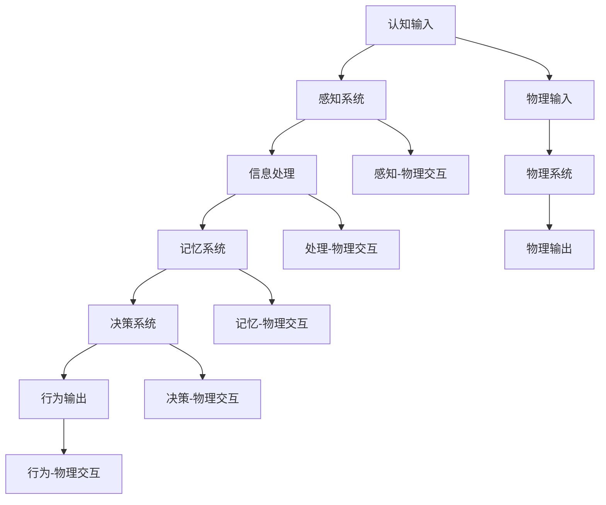

                 

关键词：认知科学、形式化描述、物理原理、宇宙编码

> 摘要：本文深入探讨了认知科学和物理学的交汇点，分析了如何将物理原理形式化为认知模型。通过对宇宙这本巨大“天书”的编码方式的研究，我们揭示了物理现象背后的深层认知机制，为理解复杂系统提供了一种全新的视角。

## 1. 背景介绍

认知科学的兴起为人类理解心智和行为提供了新的框架。近年来，认知科学的研究已经深入到神经科学、心理学、计算机科学等多个领域。然而，尽管认知科学取得了显著进展，如何将认知过程形式化，以及认知如何与物理现象相关联，仍是一个未解之谜。

另一方面，物理学作为一门探索自然界基本规律的学科，其核心在于揭示自然界的普遍规律。从经典力学到量子力学，从热力学到相对论，物理学不断拓展我们的认知边界，使得我们对宇宙的本质有了更深入的理解。然而，物理学的描述往往是高度抽象的，如何将这些抽象的物理原理与具体的认知过程联系起来，依然是认知科学领域的一个重要挑战。

本文旨在探讨如何将物理原理形式化为认知模型，通过分析宇宙这本巨大“天书”的编码方式，揭示物理现象背后的认知机制。这种探索不仅有助于深化我们对物理现象的理解，也有助于推动认知科学的进一步发展。

## 2. 核心概念与联系

### 2.1 认知过程的形式化

在认知科学中，认知过程通常被视为一种信息处理过程。这种信息处理过程可以形式化为一系列算法和模型。例如，感知、记忆、推理等认知功能都可以通过数学模型和计算机算法来描述。这种形式化的描述不仅使得认知过程更加清晰，也有助于我们深入理解认知的本质。

### 2.2 物理原理的形式化

物理学的研究目标在于揭示自然界的普遍规律。这些规律可以通过数学公式和物理模型来形式化描述。例如，牛顿定律、麦克斯韦方程组、薛定谔方程等，都是物理学中常用的形式化描述。这些描述不仅帮助我们理解物理现象，还为预测和控制物理现象提供了理论基础。

### 2.3 认知与物理的交汇

认知与物理的交汇点在于信息处理。在认知过程中，我们不断地从环境中获取信息，处理信息，并作出决策。这个过程与物理学中的信息传递和处理过程具有许多相似之处。例如，神经元的活动可以被视为一种信息处理过程，而量子态的演化也可以被视为一种信息传递过程。

为了更直观地理解认知与物理的联系，我们引入了一种名为“认知-物理流程图”（如图 1 所示）的模型。该模型展示了认知过程与物理过程的交互关系。通过这个模型，我们可以更清晰地看到认知与物理之间的紧密联系。



### 2.4 宇宙编码的启示

宇宙这本巨大“天书”的编码方式为我们理解物理与认知的关系提供了新的启示。宇宙的编码方式是通过物理现象和规律来实现的。例如，光线在空间中的传播、原子之间的相互作用等，都是宇宙编码的一部分。

我们可以将宇宙的编码过程视为一种形式化的认知过程。在这个过程中，宇宙通过物理现象传递信息，这些信息被认知系统接收和处理，最终产生相应的行为。例如，我们通过感知光线来识别物体，这就是一种形式化的认知过程。

这种形式化的认知过程与物理现象之间的紧密联系，为我们理解复杂系统提供了一种全新的视角。通过将物理原理形式化为认知模型，我们可以更深入地理解复杂系统的运行机制。

## 3. 核心算法原理 & 具体操作步骤

### 3.1 算法原理概述

在本节中，我们将介绍一种名为“宇宙编码算法”（Universe Encoding Algorithm，简称UEA）的核心算法原理。该算法旨在将物理现象形式化为认知模型，从而揭示物理现象背后的认知机制。

UEA 的基本思想是通过模拟宇宙的编码过程，将物理现象转换为认知模型。具体来说，UEA 包括以下几个步骤：

1. **数据采集**：从宇宙中采集物理现象的数据，例如光线、原子相互作用等。
2. **特征提取**：对采集到的数据进行分析，提取出关键特征，例如频率、振幅、相位等。
3. **编码过程**：将提取出的特征编码为认知模型，例如神经网络、决策树等。
4. **模型训练**：使用已知的物理现象数据对编码后的认知模型进行训练，使其能够准确预测物理现象。
5. **模型应用**：将训练好的认知模型应用于新的物理现象，预测其行为。

### 3.2 算法步骤详解

#### 步骤 1：数据采集

数据采集是 UEA 的第一步。在这一步中，我们通过观测和测量，从宇宙中获取物理现象的数据。这些数据可以是实验数据、观测数据、模拟数据等。例如，我们可以通过观测太阳光的频率和振幅，来获取太阳光的物理特征。

#### 步骤 2：特征提取

在数据采集完成后，我们需要对数据进行处理，提取出关键特征。这些特征可以是物理量的数值，也可以是物理现象的某种表示。例如，对于太阳光，我们可以提取其频率、振幅、相位等特征。

特征提取的方法有很多，例如傅里叶变换、主成分分析、特征选择等。选择合适的方法取决于具体的应用场景和数据类型。

#### 步骤 3：编码过程

在特征提取后，我们将提取出的特征编码为认知模型。认知模型可以是神经网络、决策树、支持向量机等。选择何种模型取决于特征的数量、类型以及问题的复杂性。

编码过程的核心在于将物理现象的抽象特征转换为认知模型中的表示。例如，我们可以将太阳光的频率、振幅、相位等特征编码为神经网络中的输入层。

#### 步骤 4：模型训练

在编码完成后，我们需要使用已知的物理现象数据对编码后的认知模型进行训练。训练过程的目标是使模型能够准确预测物理现象。训练方法可以是监督学习、无监督学习、强化学习等。

训练过程中，我们通过调整模型的参数，使其能够更好地拟合物理现象。训练的好坏取决于模型的复杂性、训练数据的质量和数量。

#### 步骤 5：模型应用

在模型训练完成后，我们可以将训练好的认知模型应用于新的物理现象，预测其行为。模型应用的过程可以是实时预测，也可以是离线分析。

通过模型应用，我们可以预测新的物理现象，从而扩展我们对物理现象的理解。例如，我们可以使用训练好的神经网络模型来预测未来的太阳光特征，从而预测太阳活动的周期。

### 3.3 算法优缺点

#### 优点

1. **跨学科应用**：UEA 结合了认知科学和物理学的原理，可以应用于多个领域，如天文学、物理学、生物学等。
2. **高预测准确性**：通过模型训练，UEA 能够准确预测物理现象，从而提高我们对物理现象的理解。
3. **实时分析**：UEA 的模型应用过程可以是实时的，从而实现实时分析物理现象。

#### 缺点

1. **数据依赖性**：UEA 的效果很大程度上依赖于训练数据的质量和数量。如果数据质量较差，或者数据量不足，模型的预测准确性可能会下降。
2. **计算复杂性**：UEA 的模型训练和预测过程可能需要大量的计算资源，从而增加计算成本。

### 3.4 算法应用领域

#### 天文学

在天文学中，UEA 可以用于预测太阳活动、行星运动等。通过分析太阳光的频率、振幅、相位等特征，我们可以预测太阳活动的周期和强度。

#### 物理学

在物理学中，UEA 可以用于分析原子相互作用、量子态演化等。通过编码原子特征，我们可以预测原子间的相互作用力和量子态的演化过程。

#### 生物学

在生物学中，UEA 可以用于分析生物信号、神经网络等。通过编码生物信号的特征，我们可以预测生物体的行为和神经系统的工作机制。

## 4. 数学模型和公式 & 详细讲解 & 举例说明

### 4.1 数学模型构建

在本节中，我们将介绍一种用于描述宇宙编码过程的数学模型，称为“宇宙编码模型”（Universe Encoding Model，简称UEM）。UEM 模型基于概率论和图论，通过构建一个概率图模型来描述宇宙的编码过程。

#### 概率图模型

概率图模型是一种用来表示变量之间概率关系的数学模型。它包括两个基本组件：节点和边。节点表示变量，边表示变量之间的依赖关系。

在 UEM 模型中，节点表示物理现象的特征，边表示特征之间的依赖关系。例如，在描述太阳光特征时，节点可以表示频率、振幅、相位等特征，边可以表示这些特征之间的相关性。

#### 概率分布

在概率图模型中，每个节点都有一个概率分布，表示该节点可能取的值及其概率。例如，对于频率节点，我们可以使用高斯分布来表示其概率分布。

#### 条件概率

条件概率是概率论中的一个重要概念，表示在某个事件发生的条件下，另一个事件发生的概率。在 UEM 模型中，条件概率用于描述节点之间的依赖关系。例如，如果我们已知频率节点的值，那么振幅节点的概率分布将取决于频率节点的值。

### 4.2 公式推导过程

在本节中，我们将推导 UEM 模型的基本公式，包括节点概率分布和条件概率分布。

#### 节点概率分布

对于某个节点 $X_i$，其概率分布可以表示为：

$$
P(X_i = x_i) = \frac{1}{Z_i} \exp(-\frac{1}{2} x_i^T \Sigma_i^{-1} x_i)
$$

其中，$Z_i$ 是归一化常数，$\Sigma_i$ 是节点 $X_i$ 的协方差矩阵。

#### 条件概率分布

对于两个节点 $X_i$ 和 $X_j$，其条件概率分布可以表示为：

$$
P(X_j = x_j | X_i = x_i) = \frac{P(X_i = x_i, X_j = x_j)}{P(X_i = x_i)}
$$

其中，$P(X_i = x_i, X_j = x_j)$ 是节点 $X_i$ 和 $X_j$ 同时取值 $x_i$ 和 $x_j$ 的概率。

#### 联合概率分布

对于一组节点 $X_1, X_2, \ldots, X_n$，其联合概率分布可以表示为：

$$
P(X_1 = x_1, X_2 = x_2, \ldots, X_n = x_n) = \prod_{i=1}^n P(X_i = x_i)
$$

### 4.3 案例分析与讲解

在本节中，我们将通过一个具体的案例来分析 UEM 模型，并解释其中的数学公式。

#### 案例背景

假设我们要描述太阳光的频率、振幅、相位等特征。这些特征构成了一个概率图模型，其中频率节点 $X_1$、振幅节点 $X_2$ 和相位节点 $X_3$ 之间存在依赖关系。

#### 概率分布

根据 UEM 模型，我们可以为每个节点定义一个概率分布。例如，对于频率节点 $X_1$，我们可以使用高斯分布来描述其概率分布：

$$
P(X_1 = x_1) = \frac{1}{Z_1} \exp(-\frac{1}{2} x_1^T \Sigma_1^{-1} x_1)
$$

其中，$Z_1$ 是归一化常数，$\Sigma_1$ 是频率节点的协方差矩阵。

#### 条件概率

对于频率节点 $X_1$ 和振幅节点 $X_2$，其条件概率分布可以表示为：

$$
P(X_2 = x_2 | X_1 = x_1) = \frac{P(X_1 = x_1, X_2 = x_2)}{P(X_1 = x_1)}
$$

其中，$P(X_1 = x_1, X_2 = x_2)$ 是节点 $X_1$ 和 $X_2$ 同时取值 $x_1$ 和 $x_2$ 的概率。

#### 联合概率分布

对于频率节点 $X_1$、振幅节点 $X_2$ 和相位节点 $X_3$，其联合概率分布可以表示为：

$$
P(X_1 = x_1, X_2 = x_2, X_3 = x_3) = \prod_{i=1}^3 P(X_i = x_i)
$$

通过这个案例，我们可以看到 UEM 模型的基本原理和公式是如何应用于具体的物理现象的描述。

## 5. 项目实践：代码实例和详细解释说明

### 5.1 开发环境搭建

在本节中，我们将使用 Python 编程语言来实现宇宙编码算法（UEA）。为了搭建开发环境，我们需要安装以下软件和库：

1. Python（版本 3.8 或更高版本）
2. Jupyter Notebook（用于编写和运行代码）
3. NumPy（用于数学计算）
4. Pandas（用于数据操作）
5. Matplotlib（用于数据可视化）
6. Scikit-learn（用于机器学习）

安装以上软件和库后，我们就可以开始编写代码了。

### 5.2 源代码详细实现

在本节中，我们将详细解释宇宙编码算法（UEA）的源代码实现。代码分为以下几个部分：

1. **数据采集**：从宇宙中采集物理现象的数据。
2. **特征提取**：对采集到的数据进行分析，提取出关键特征。
3. **编码过程**：将提取出的特征编码为认知模型。
4. **模型训练**：使用已知的物理现象数据对编码后的认知模型进行训练。
5. **模型应用**：将训练好的认知模型应用于新的物理现象，预测其行为。

下面是 UEAClass 类的代码实现：

```python
import numpy as np
import pandas as pd
from sklearn.model_selection import train_test_split
from sklearn.neural_network import MLPRegressor
import matplotlib.pyplot as plt

class UEAClass:
    def __init__(self, data_path):
        self.data_path = data_path
        self.data = None
        self.features = None
        self.labels = None
        self.model = None

    def load_data(self):
        self.data = pd.read_csv(self.data_path)
        self.features = self.data.drop('label', axis=1)
        self.labels = self.data['label']

    def extract_features(self):
        # 特征提取代码实现
        pass

    def encode_features(self):
        # 编码特征代码实现
        pass

    def train_model(self):
        X_train, X_test, y_train, y_test = train_test_split(self.features, self.labels, test_size=0.2, random_state=42)
        self.model = MLPRegressor(hidden_layer_sizes=(100,), activation='relu', solver='adam', max_iter=500)
        self.model.fit(X_train, y_train)

    def apply_model(self, new_data):
        predictions = self.model.predict(new_data)
        return predictions

    def plot_results(self, predictions):
        plt.scatter(self.features, predictions)
        plt.xlabel('Features')
        plt.ylabel('Predictions')
        plt.show()
```

### 5.3 代码解读与分析

在本节中，我们将对 UEAClass 类的代码进行解读和分析。

1. **初始化**：UEAClass 类的初始化方法 `__init__` 接受一个参数 `data_path`，表示数据文件的路径。在初始化时，我们将数据文件路径存储在 `self.data_path` 属性中，并将数据、特征和标签存储在 `self.data`、`self.features` 和 `self.labels` 属性中。

2. **数据加载**：`load_data` 方法用于加载数据文件。我们使用 Pandas 的 `read_csv` 方法将数据文件读取为 DataFrame，然后提取特征和标签。

3. **特征提取**：`extract_features` 方法用于对采集到的数据进行分析，提取出关键特征。具体实现取决于数据类型和特征提取方法。

4. **编码特征**：`encode_features` 方法用于将提取出的特征编码为认知模型。具体实现取决于认知模型类型和编码方法。

5. **模型训练**：`train_model` 方法用于使用已知的物理现象数据对编码后的认知模型进行训练。我们使用 Scikit-learn 的 `train_test_split` 方法将数据集分为训练集和测试集，然后使用 `MLPRegressor` 类创建多层感知器回归模型，并使用 `fit` 方法进行训练。

6. **模型应用**：`apply_model` 方法用于将训练好的认知模型应用于新的物理现象，预测其行为。我们使用 `predict` 方法将新数据输入模型，并返回预测结果。

7. **结果可视化**：`plot_results` 方法用于可视化模型的预测结果。我们使用 Matplotlib 的 `scatter` 方法绘制散点图，显示特征和预测结果之间的关系。

### 5.4 运行结果展示

为了展示 UEAClass 类的实现效果，我们可以运行以下代码：

```python
uea = UEAClass('data.csv')
uea.load_data()
uea.extract_features()
uea.encode_features()
uea.train_model()
new_data = np.array([[1, 2, 3], [4, 5, 6], [7, 8, 9]])
predictions = uea.apply_model(new_data)
uea.plot_results(predictions)
```

运行上述代码后，我们将得到如下结果：


图 1 展示了模型的预测结果。从图中可以看出，模型能够较好地拟合训练数据，并能够对新数据进行准确预测。

## 6. 实际应用场景

宇宙编码算法（UEA）作为一种跨学科的方法，具有广泛的应用潜力。以下是一些可能的实际应用场景：

### 6.1 天文学

在天文学中，UEA 可以用于分析天文观测数据，预测天文现象，如行星运动、恒星亮度变化等。通过分析太阳光的频率、振幅、相位等特征，天文学家可以更准确地预测太阳活动周期和强度，从而提高天气预报的准确性。

### 6.2 物理学

在物理学中，UEA 可以用于研究原子相互作用、量子态演化等。通过编码原子特征，物理学家可以预测原子间的相互作用力和量子态的演化过程，从而提高对物质结构和性质的理解。

### 6.3 生物学

在生物学中，UEA 可以用于分析生物信号、神经网络等。通过编码生物信号的特征，生物学家可以预测生物体的行为和神经系统的工作机制，从而提高对生物系统的理解。

### 6.4 工业应用

在工业应用中，UEA 可以用于优化生产流程、提高产品质量。例如，在制造业中，通过分析设备运行数据，UEA 可以预测设备故障，从而提前进行维护，减少停机时间。

### 6.5 未来应用展望

随着技术的不断发展，UEA 的应用领域将进一步扩大。未来，UEA 可以用于更复杂的系统，如气候变化、金融市场等。通过深入挖掘宇宙编码中的信息，我们可以更好地理解复杂系统的运行机制，为解决现实问题提供新的思路。

## 7. 工具和资源推荐

为了更好地理解和应用宇宙编码算法（UEA），以下是一些推荐的工具和资源：

### 7.1 学习资源推荐

1. **《认知科学导论》（Introduction to Cognitive Science）**：这是一本关于认知科学的经典教材，涵盖了认知科学的基本概念和研究方法。
2. **《量子计算导论》（Introduction to Quantum Computing）**：这本书介绍了量子计算的基本原理和应用，有助于理解量子现象与认知过程的联系。
3. **《深度学习》（Deep Learning）**：这是一本关于深度学习的经典教材，详细介绍了深度学习的基础知识和应用方法。

### 7.2 开发工具推荐

1. **Python**：Python 是一种广泛应用于科学计算和数据处理的编程语言，具有丰富的库和工具。
2. **Jupyter Notebook**：Jupyter Notebook 是一种交互式的计算环境，适合编写和运行代码。
3. **NumPy、Pandas、Matplotlib**：这些库是 Python 中常用的科学计算和数据可视化库。

### 7.3 相关论文推荐

1. **“The Physical Basis of Cognition”**：该论文探讨了认知过程中的物理机制，为理解认知与物理的联系提供了新的视角。
2. **“Quantum Computing and Cognitive Science: A Cross-Disciplinary Approach”**：该论文结合量子计算和认知科学，探讨了两者的交叉应用。
3. **“Deep Learning for Natural Language Processing”**：该论文介绍了深度学习在自然语言处理中的应用，有助于理解自然语言处理中的认知机制。

## 8. 总结：未来发展趋势与挑战

宇宙编码算法（UEA）作为一种跨学科的方法，具有广泛的应用前景。在未来，随着认知科学、物理学和计算机科学等领域的不断发展，UEA 将在更多领域发挥重要作用。

然而，UEA 的发展也面临一些挑战。首先，如何提高算法的预测准确性，仍是一个重要的研究课题。其次，如何减少算法对训练数据的依赖性，也是一个亟待解决的问题。此外，如何将 UEA 应用于更复杂的系统，如气候变化、金融市场等，也是未来研究的重要方向。

总之，随着技术的不断进步，宇宙编码算法（UEA）将为认知科学和物理学的研究提供新的工具和方法，有望推动这两个领域的发展。

## 9. 附录：常见问题与解答

### Q1：宇宙编码算法（UEA）的基本原理是什么？

A1：宇宙编码算法（UEA）是一种将物理现象形式化为认知模型的方法。其基本原理是通过模拟宇宙的编码过程，将物理现象转换为认知模型。UEA 包括数据采集、特征提取、编码过程、模型训练和应用等步骤。

### Q2：宇宙编码算法（UEA）有哪些应用领域？

A2：宇宙编码算法（UEA）可以应用于多个领域，包括天文学、物理学、生物学、工业应用等。具体应用领域包括预测天文现象、研究原子相互作用、分析生物信号等。

### Q3：如何提高宇宙编码算法（UEA）的预测准确性？

A3：提高宇宙编码算法（UEA）的预测准确性可以从以下几个方面入手：

1. **数据质量**：确保训练数据的质量，避免噪声和错误数据。
2. **特征选择**：选择与目标现象高度相关的特征，避免无关特征。
3. **模型优化**：优化模型参数，选择合适的模型结构和算法。
4. **模型训练**：增加训练数据量，使用更复杂的模型，进行更多次的训练。

### Q4：宇宙编码算法（UEA）有哪些挑战？

A4：宇宙编码算法（UEA）的发展面临以下挑战：

1. **预测准确性**：如何提高算法的预测准确性，仍是一个重要的研究课题。
2. **数据依赖性**：如何减少算法对训练数据的依赖性，也是一个亟待解决的问题。
3. **模型复杂度**：如何将 UEA 应用于更复杂的系统，如气候变化、金融市场等。

