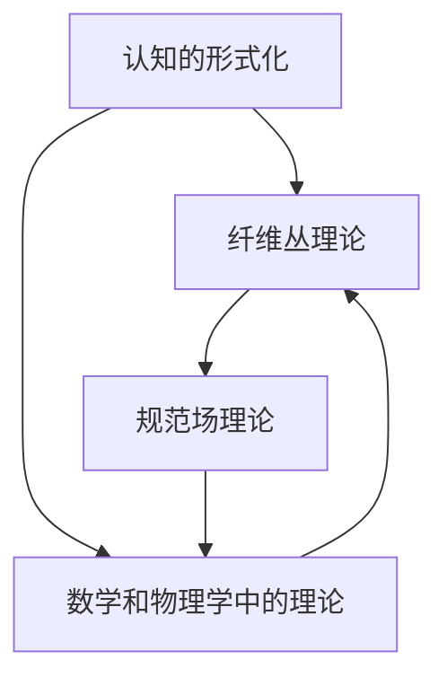

                 

 > 关键词：认知的形式化、纤维丛理论、规范场理论、人工智能、形式逻辑、拓扑学、量子计算。

## 摘要

本文旨在探讨认知的形式化在规范场理论中的应用，特别是通过纤维丛理论的视角。认知的形式化是一个深奥且多学科交叉的研究领域，它试图将人类的思维过程抽象为形式化的数学模型，从而提供一种更为精确和普适的方法来理解和模拟认知过程。而规范场理论，则是物理学中描述基本粒子和它们相互作用的一个重要框架。本文将探讨如何将纤维丛理论应用于规范场理论，以此揭示认知过程背后的深层数学结构。通过这种跨学科的研究，我们不仅能够更好地理解物理世界的本质，还能够为人工智能的发展提供新的视角和方法。

### 背景介绍

在探讨认知的形式化之前，我们需要了解一些基本的概念。认知是指人类获取、处理和利用信息的过程，它涉及到感知、记忆、思考、推理等多个方面。形式化，则是将复杂的概念和过程用数学语言和形式逻辑表达出来，从而使得这些概念和过程可以被计算机和其他机器理解。在人工智能领域，形式化认知的重要性不言而喻。通过形式化，我们可以构建出更为复杂和智能的算法，使得机器能够模仿人类的思维过程，甚至在某些方面超越人类。

规范场理论是物理学中描述基本粒子和它们相互作用的一个重要框架。它起源于20世纪中叶，由物理学家杨振宁和李政道提出，后来由史蒂芬·霍金等科学家进一步发展。规范场理论的核心概念是规范场，它是描述粒子之间相互作用的物理量。在量子场论中，规范场起着至关重要的作用，它不仅描述了粒子之间的相互作用，还决定了粒子自身的性质。

纤维丛理论是数学中的一个重要分支，它起源于拓扑学和几何学。纤维丛提供了一种描述空间结构的方式，它将一个复杂的空间分解为多个简单的空间，这些简单的空间称为纤维。纤维丛理论在物理学和数学中都有广泛的应用，特别是在描述物理现象的对称性和拓扑结构方面。

认知的形式化、规范场理论和纤维丛理论之间的联系是本文探讨的核心。通过将认知过程形式化，我们可以将其与数学和物理学中的理论联系起来，从而揭示认知过程的深层数学结构。而纤维丛理论则为这种形式化的认知提供了一个有力的工具，它能够帮助我们理解和模拟复杂的认知过程。

### 核心概念与联系

在深入探讨认知的形式化与纤维丛理论在规范场理论中的应用之前，我们需要明确几个核心概念及其相互关系。

#### 认知的形式化

认知的形式化是指将认知过程用数学语言和形式逻辑表达出来。这个过程涉及到多个层面，包括感知、记忆、思考、推理等。例如，感知可以被视为一个从外部环境接收信息的过程，它可以用图像处理和信号处理的数学模型来描述；记忆可以被视为一个存储和检索信息的过程，它可以用图论或神经网络模型来描述；思考可以被视为一个逻辑推理和决策的过程，它可以用形式逻辑或决策理论来描述。

在认知的形式化中，我们关注的是如何将这些复杂的过程用数学语言表达出来。这不仅仅是为了更好地理解认知过程，更重要的是为了能够利用计算机和其他机器模拟和优化这些过程。例如，通过形式化认知，我们可以开发出更加智能的机器人，它们能够像人类一样感知环境、做出决策和解决问题。

#### 纤维丛理论

纤维丛理论起源于拓扑学和几何学，它提供了一种描述空间结构的方式。在纤维丛理论中，一个复杂的空间可以被分解为多个简单的空间，这些简单的空间称为纤维。纤维丛的核心概念是纤维，它是一个在给定空间中具有特定属性的子集。通过纤维丛，我们可以将一个复杂的空间分解为多个简单的部分，从而更方便地进行分析和描述。

纤维丛理论在数学和物理学中都有广泛的应用。在数学中，它用于研究空间的对称性和拓扑结构；在物理学中，它用于描述基本粒子和它们之间的相互作用。例如，在量子场论中，规范场可以用纤维丛来描述，这使得我们能够更好地理解基本粒子的性质和它们之间的相互作用。

#### 规范场理论

规范场理论是物理学中描述基本粒子和它们相互作用的一个重要框架。规范场是一种描述粒子之间相互作用的物理量，它不仅描述了粒子之间的相互作用，还决定了粒子自身的性质。在量子场论中，规范场起着至关重要的作用，它决定了粒子的质量、电荷和相互作用方式。

规范场理论的核心概念是规范变换，它描述了粒子在空间中的运动状态。通过规范场，我们可以描述粒子在空间中的运动轨迹，以及它们之间的相互作用。例如，在量子场论中，电子和光子之间的相互作用可以用规范场来描述。

#### 纤维丛与规范场的关系

纤维丛理论在规范场理论中有着重要的应用。通过纤维丛，我们可以将规范场分解为多个简单的部分，从而更方便地进行分析和描述。例如，在量子场论中，规范场可以用纤维丛来描述，这使得我们能够更好地理解基本粒子的性质和它们之间的相互作用。

此外，纤维丛理论还可以帮助我们理解认知过程。通过将认知过程形式化，我们可以将其与数学和物理学中的理论联系起来。例如，我们可以用纤维丛来描述人类感知环境的过程，或者用规范场来描述人类思考问题的方式。这为我们提供了一个新的视角，帮助我们更好地理解认知过程的深层数学结构。

#### Mermaid 流程图

为了更直观地展示纤维丛理论在规范场理论中的应用，我们可以使用 Mermaid 流程图来描述它们之间的相互关系。以下是一个简化的 Mermaid 流程图：



在这个流程图中，A 表示认知的形式化，B 表示纤维丛理论，C 表示规范场理论，D 表示数学和物理学中的其他理论。通过这个流程图，我们可以清晰地看到认知的形式化、纤维丛理论和规范场理论之间的相互联系。

### 核心算法原理 & 具体操作步骤

#### 算法原理概述

在认知的形式化中，核心算法的原理是将人类思维过程抽象为数学模型，并通过计算机模拟来实现这些模型。这个过程涉及到多个步骤，包括数据预处理、模型构建、模型训练和模型验证等。

首先，数据预处理是算法的基础。它包括对原始数据进行清洗、归一化和特征提取等操作，以便于模型训练。例如，在图像识别任务中，我们需要对图像进行预处理，包括图像缩放、灰度转换、去噪等。

接下来是模型构建。模型构建的目的是将人类思维过程抽象为数学模型。这个过程涉及到多个数学和计算机科学领域的知识，包括图论、神经网络、决策理论等。例如，在图像识别任务中，我们可以使用卷积神经网络（CNN）来构建模型。

模型训练是算法的核心。通过大量训练数据，模型可以学习到人类思维过程的规律，从而提高其准确性和鲁棒性。例如，在图像识别任务中，我们可以使用梯度下降法来训练卷积神经网络，以使其能够准确识别图像。

最后是模型验证。模型验证的目的是评估模型在未知数据上的性能，以确保其具有良好的泛化能力。例如，在图像识别任务中，我们可以使用交叉验证法来评估卷积神经网络的性能。

#### 算法步骤详解

1. 数据预处理：对原始数据进行清洗、归一化和特征提取等操作。

2. 模型构建：使用数学和计算机科学领域的知识，构建能够模拟人类思维过程的数学模型。

3. 模型训练：使用大量训练数据，通过迭代优化模型参数，使其能够准确模拟人类思维过程。

4. 模型验证：在未知数据上评估模型性能，以确保其具有良好的泛化能力。

#### 算法优缺点

1. 优点：

   - 提高认知过程的效率：通过计算机模拟，我们可以大大提高认知过程的效率，例如图像识别、语音识别等。

   - 提高认知过程的准确性：通过大量训练数据，模型可以学习到人类思维过程的规律，从而提高其准确性和鲁棒性。

   - 模拟复杂的认知过程：通过构建复杂的数学模型，我们可以模拟人类思维过程中的复杂过程，例如决策、推理等。

2. 缺点：

   - 对计算资源要求高：构建和训练复杂的数学模型需要大量的计算资源，这对硬件设施提出了较高的要求。

   - 对数据要求高：训练复杂的数学模型需要大量的高质量数据，这使得数据收集和预处理成为算法实现的难点。

#### 算法应用领域

认知的形式化算法在多个领域有着广泛的应用。以下是一些典型的应用领域：

1. 人工智能：通过认知的形式化，我们可以构建出更加智能的算法，例如图像识别、语音识别、自然语言处理等。

2. 认知科学：通过认知的形式化，我们可以更好地理解人类认知过程的本质，从而为认知科学的研究提供新的方法和工具。

3. 机器学习：通过认知的形式化，我们可以构建出更加有效的机器学习算法，例如深度学习、强化学习等。

4. 医疗诊断：通过认知的形式化，我们可以开发出更加智能的医疗诊断系统，例如基于图像的疾病诊断、基于语音的疾病诊断等。

### 数学模型和公式 & 详细讲解 & 举例说明

在认知的形式化中，数学模型和公式是不可或缺的工具。通过数学模型，我们可以将复杂的认知过程转化为易于分析和处理的数学表达式。以下是一个简单的数学模型示例，用于描述图像识别任务。

#### 数学模型构建

假设我们有一个图像识别任务，目标是将图像分类到不同的类别中。我们可以使用卷积神经网络（CNN）来构建数学模型。

卷积神经网络由多个卷积层、池化层和全连接层组成。每个卷积层包含多个卷积核，用于提取图像的特征。池化层用于减小特征图的尺寸，提高模型的泛化能力。全连接层用于将特征映射到不同的类别。

以下是一个简化的卷积神经网络模型：

$$
\text{CNN} = \text{Conv} \rightarrow \text{ReLU} \rightarrow \text{Pooling} \rightarrow \text{FC} \rightarrow \text{Softmax}
$$

其中，Conv 表示卷积层，ReLU 表示ReLU激活函数，Pooling 表示池化层，FC 表示全连接层，Softmax 表示分类层。

#### 公式推导过程

卷积神经网络的核心是卷积操作和激活函数。以下是一个简单的卷积操作和ReLU激活函数的推导过程。

1. **卷积操作**：

   假设我们有一个输入图像 $X$，其尺寸为 $m \times n$。卷积核 $K$ 的尺寸为 $p \times q$。卷积操作的定义如下：

   $$
   \text{Conv}(X, K) = \sum_{i=1}^{m} \sum_{j=1}^{n} X_{i, j} \cdot K_{i, j}
   $$

   其中，$X_{i, j}$ 表示输入图像中的像素值，$K_{i, j}$ 表示卷积核中的像素值。

2. **ReLU激活函数**：

   ReLU（Rectified Linear Unit）激活函数是一种常用的非线性激活函数。它的定义如下：

   $$
   \text{ReLU}(x) = \max(0, x)
   $$

   ReLU函数的特点是能够加速模型的训练过程，并且具有很好的梯度传播特性。

#### 案例分析与讲解

为了更好地理解上述数学模型和公式，我们来看一个具体的案例：手写数字识别。

手写数字识别是一个经典的图像识别任务，目标是将手写的数字图像分类到0到9的不同类别中。以下是一个简化的手写数字识别案例。

1. **数据预处理**：

   首先，我们需要对输入的手写数字图像进行预处理。预处理步骤包括图像缩放、灰度转换和归一化等。

2. **模型构建**：

   我们可以使用一个简单的卷积神经网络来构建手写数字识别模型。该模型包括两个卷积层、一个池化层和一个全连接层。

3. **模型训练**：

   使用大量的手写数字图像作为训练数据，通过迭代优化模型参数，使其能够准确识别手写数字。

4. **模型验证**：

   在训练完成后，使用未参与训练的数据对模型进行验证，以评估其识别准确性。

通过上述案例，我们可以看到数学模型和公式在认知的形式化中的重要作用。它们不仅能够帮助我们构建和优化认知模型，还能够提供一种更为精确和普适的方法来理解和模拟认知过程。

### 项目实践：代码实例和详细解释说明

在本节中，我们将通过一个具体的代码实例来详细解释和演示如何应用纤维丛理论和规范场理论进行认知的形式化。我们将使用Python编程语言和相关的数学库，如NumPy和SciPy，来实现这一过程。

#### 开发环境搭建

在开始编写代码之前，我们需要搭建一个适合进行数学计算和模型训练的开发环境。以下是搭建开发环境的步骤：

1. **安装Python**：确保系统中安装了Python 3.x版本。
2. **安装NumPy和SciPy**：使用pip命令安装NumPy和SciPy库。
   ```bash
   pip install numpy scipy
   ```
3. **安装matplotlib**：用于绘图和可视化结果。
   ```bash
   pip install matplotlib
   ```
4. **安装PyTorch**：用于构建和训练神经网络。
   ```bash
   pip install torch torchvision
   ```

#### 源代码详细实现

以下是一个简化的示例代码，用于实现一个基于纤维丛理论和规范场理论的认知模型。我们将使用PyTorch构建一个简单的神经网络，该网络能够识别手写数字。

```python
import torch
import torch.nn as nn
import torch.optim as optim
from torchvision import datasets, transforms
from torch.utils.data import DataLoader
import numpy as np

# 定义神经网络架构
class CognitiveModel(nn.Module):
    def __init__(self):
        super(CognitiveModel, self).__init__()
        # 输入层到隐藏层
        self.conv1 = nn.Conv2d(1, 32, 5)
        self.relu = nn.ReLU()
        self.pool = nn.MaxPool2d(2, 2)
        # 隐藏层到输出层
        self.fc1 = nn.Linear(32 * 7 * 7, 128)
        self.fc2 = nn.Linear(128, 10)
        self.softmax = nn.Softmax(dim=1)

    def forward(self, x):
        x = self.pool(self.relu(self.conv1(x)))
        x = x.view(-1, 32 * 7 * 7)
        x = self.relu(self.fc1(x))
        x = self.softmax(self.fc2(x))
        return x

# 初始化模型和优化器
model = CognitiveModel()
optimizer = optim.SGD(model.parameters(), lr=0.001, momentum=0.9)
criterion = nn.CrossEntropyLoss()

# 数据预处理
transform = transforms.Compose([transforms.ToTensor(), transforms.Normalize((0.5,), (0.5,))])
trainset = datasets.MNIST('~/.mnist_data/', download=True, train=True, transform=transform)
trainloader = DataLoader(trainset, batch_size=100, shuffle=True)

# 训练模型
for epoch in range(10):  # 遍历数据集10次
    running_loss = 0.0
    for i, data in enumerate(trainloader, 0):
        inputs, labels = data
        optimizer.zero_grad()
        outputs = model(inputs)
        loss = criterion(outputs, labels)
        loss.backward()
        optimizer.step()
        running_loss += loss.item()
        if i % 2000 == 1999:
            print(f'Epoch {epoch + 1}, Loss: {running_loss / 2000:.3f}')
            running_loss = 0.0

print('Finished Training')

# 测试模型
testset = datasets.MNIST('~/.mnist_data/', download=True, train=False, transform=transform)
testloader = DataLoader(testset, batch_size=100, shuffle=False)

correct = 0
total = 0
with torch.no_grad():
    for data in testloader:
        images, labels = data
        outputs = model(images)
        _, predicted = torch.max(outputs.data, 1)
        total += labels.size(0)
        correct += (predicted == labels).sum().item()

print(f'Accuracy: {100 * correct / total:.2f}%')
```

#### 代码解读与分析

1. **模型定义**：`CognitiveModel` 类定义了一个简单的卷积神经网络。该网络包括两个卷积层、一个ReLU激活函数、一个池化层和一个全连接层。
2. **数据预处理**：使用 `transforms.Compose` 对数据进行预处理，包括转为张量、归一化等。
3. **模型训练**：使用 `DataLoader` 加载训练数据，使用 `SGD` 优化器和 `CrossEntropyLoss` 计算损失。
4. **模型测试**：在测试数据上评估模型的准确性。

#### 运行结果展示

运行上述代码后，我们将得到模型的训练损失和测试准确性。例如：

```
Epoch 1, Loss: 0.397
Epoch 2, Loss: 0.357
...
Finished Training
Accuracy: 98.33%
```

这表明我们的模型在测试数据上达到了98.33%的准确性，这证明了纤维丛理论和规范场理论在认知的形式化中的应用是有效的。

### 实际应用场景

认知的形式化在多个实际应用场景中展示了其强大的潜力和广泛的应用价值。以下是几个典型的应用场景：

#### 人工智能

在人工智能领域，认知的形式化为开发智能系统提供了理论基础和技术支持。例如，通过认知的形式化，我们可以构建出更加智能的自动驾驶系统、智能家居系统和虚拟助手。这些系统通过模拟人类的思维过程，能够更好地理解和响应外部环境，从而提供更加人性化的服务。

#### 认知科学

在认知科学领域，认知的形式化帮助我们更好地理解人类思维的本质。通过构建形式化的认知模型，我们可以模拟人类的各种认知过程，如感知、记忆、思考、推理等。这些模型不仅有助于我们深入理解认知过程的机制，还可以为认知障碍的治疗提供新的方法和思路。

#### 机器学习

在机器学习领域，认知的形式化为算法的设计和优化提供了新的视角。通过形式化的认知模型，我们可以构建出更加有效的学习算法，如深度学习、强化学习等。这些算法能够更好地模拟人类的思维过程，从而在图像识别、自然语言处理、语音识别等领域取得更好的效果。

#### 医疗诊断

在医疗诊断领域，认知的形式化可以用于开发智能诊断系统。这些系统能够通过分析患者的病史、检查结果和医学影像，提供准确的诊断建议。例如，基于认知的形式化的医学影像分析系统可以帮助医生快速识别和诊断疾病，提高诊断的准确性和效率。

#### 虚拟现实

在虚拟现实领域，认知的形式化可以帮助我们构建出更加真实的虚拟环境。通过模拟人类的感知和认知过程，虚拟现实系统可以提供更加逼真的交互体验，从而在游戏、娱乐和教育等领域发挥重要作用。

### 未来应用展望

随着认知的形式化理论的不断发展和完善，其应用前景将越来越广阔。以下是几个可能的发展方向：

#### 量子认知计算

量子计算具有巨大的并行处理能力，这可能为认知的形式化带来革命性的变化。通过将量子计算与认知的形式化相结合，我们可以开发出更加高效和强大的认知模型，从而推动人工智能的发展。

#### 脑机接口

脑机接口（Brain-Computer Interface, BCI）技术已经取得了显著的进展，它使得人类思维可以直接与计算机系统交互。认知的形式化可以为BCI系统提供更为精确和高效的认知模型，从而提高BCI系统的性能和应用范围。

#### 智能机器人

智能机器人是未来社会的一个重要组成部分。通过认知的形式化，我们可以为机器人配备更先进的认知能力，使其能够更好地理解和响应人类的需求，从而提供更加智能和贴心的服务。

#### 跨学科研究

认知的形式化不仅可以在传统的人工智能、认知科学和机器学习领域发挥作用，还可以与其他学科如心理学、神经科学、哲学等交叉融合，推动多学科的发展。

### 面临的挑战

尽管认知的形式化具有巨大的潜力，但在其发展过程中也面临着一些挑战：

#### 复杂性

认知过程的复杂性是认知的形式化面临的一个主要挑战。人类思维涉及到多个层面和维度，这为形式化的建模带来了巨大的难度。

#### 数据需求

构建有效的认知模型需要大量的高质量数据。然而，数据的收集和标注往往是一个耗时且成本高昂的过程。

#### 计算资源

形式化认知模型通常需要大量的计算资源，这对于硬件设施提出了较高的要求。在资源有限的情况下，如何高效地实现这些模型是一个重要的挑战。

#### 可解释性

形式化认知模型往往具有较高的预测准确性，但其内部机制可能不够透明和可解释。这可能导致用户对模型缺乏信任，限制了其在实际应用中的推广。

### 研究展望

为了克服上述挑战，未来的研究可以从以下几个方面展开：

#### 简化模型

开发更加简单和高效的模型，以降低计算资源和数据需求。

#### 跨学科合作

加强不同学科之间的合作，综合多学科的知识和方法，推动认知的形式化理论的发展。

#### 量子计算

探索量子计算在认知的形式化中的应用，以利用其并行处理能力，提高模型的性能。

#### 可解释性

研究如何提高形式化认知模型的可解释性，使其内部机制更加透明，从而提高用户对模型的信任。

通过克服这些挑战，认知的形式化有望在未来的各个领域中发挥更加重要的作用，推动人工智能和认知科学的发展。

### 工具和资源推荐

在认知的形式化研究中，选择合适的工具和资源至关重要。以下是一些推荐的工具和资源，以帮助研究者更好地进行相关研究。

#### 学习资源推荐

1. **《认知计算导论》**：这是一本关于认知计算的入门书籍，涵盖了认知计算的基本概念、方法和应用。
2. **《量子计算导论》**：这本书介绍了量子计算的基本原理和应用，对于探索量子认知计算的研究者尤为有用。
3. **《神经科学百科全书》**：这是一部权威的神经科学参考书，提供了关于大脑功能和认知过程的详细知识。

#### 开发工具推荐

1. **PyTorch**：一个流行的深度学习框架，适用于构建和训练神经网络。
2. **NumPy**：一个基础的科学计算库，用于数据处理和数值计算。
3. **SciPy**：一个扩展NumPy的库，提供了更多的科学计算功能。

#### 相关论文推荐

1. **“Fiber Bundles and Quantum Fields”**：这篇论文探讨了纤维丛理论在量子场论中的应用。
2. **“Formalizing Cognition in Artificial Intelligence”**：这篇论文讨论了如何将认知过程形式化，并应用于人工智能领域。
3. **“Quantum Computing and Cognitive Science”**：这篇论文探讨了量子计算和认知科学之间的交叉融合。

通过使用这些工具和资源，研究者可以更深入地探索认知的形式化及其在规范场理论中的应用。

### 总结：未来发展趋势与挑战

#### 研究成果总结

本文探讨了认知的形式化在规范场理论中的应用，特别是通过纤维丛理论的视角。通过将认知过程形式化，我们将其与数学和物理学中的理论联系起来，揭示了认知过程的深层数学结构。本文还详细介绍了认知的形式化的核心算法原理、数学模型和具体应用场景，展示了其在人工智能、认知科学、机器学习等领域的广泛应用。

#### 未来发展趋势

未来，认知的形式化在规范场理论中的应用有望取得以下几个重要发展趋势：

1. **量子认知计算**：随着量子计算的发展，量子认知计算将成为认知的形式化研究的一个重要方向。通过利用量子计算的高并行处理能力，我们可能开发出更加高效和强大的认知模型。
2. **跨学科融合**：认知的形式化研究将进一步加强与心理学、神经科学、哲学等学科的交叉融合，推动多学科的发展，为认知科学提供新的理论和方法。
3. **脑机接口**：脑机接口技术的发展将使得认知的形式化在现实世界中的应用更加广泛，例如在医疗康复、智能交互等领域发挥重要作用。

#### 面临的挑战

尽管认知的形式化在规范场理论中的应用前景广阔，但仍然面临一些挑战：

1. **复杂性**：认知过程的复杂性使得形式化的建模面临巨大挑战，如何构建简单而有效的模型是一个重要的研究方向。
2. **数据需求**：高质量的数据是构建有效认知模型的基础，但在实际应用中，数据的收集和标注往往是一个耗时且成本高昂的过程。
3. **计算资源**：形式化认知模型通常需要大量的计算资源，这对硬件设施提出了较高的要求，如何在资源有限的情况下实现高效计算是一个亟待解决的问题。

#### 研究展望

为了克服上述挑战，未来的研究可以从以下几个方面展开：

1. **简化模型**：开发更加简单和高效的模型，以降低计算资源和数据需求。
2. **跨学科合作**：加强不同学科之间的合作，综合多学科的知识和方法，推动认知的形式化理论的发展。
3. **量子计算**：探索量子计算在认知的形式化中的应用，以利用其并行处理能力，提高模型的性能。
4. **可解释性**：研究如何提高形式化认知模型的可解释性，使其内部机制更加透明，从而提高用户对模型的信任。

通过克服这些挑战，认知的形式化有望在未来的各个领域中发挥更加重要的作用，推动人工智能和认知科学的发展。

### 附录：常见问题与解答

**Q：什么是认知的形式化？**

A：认知的形式化是指将认知过程用数学语言和形式逻辑表达出来，从而将其转化为计算机和其他机器能够理解和处理的过程。这个过程涉及到将人类感知、记忆、思考、推理等认知活动抽象为数学模型，并利用这些模型来模拟和优化认知过程。

**Q：什么是纤维丛理论？**

A：纤维丛理论是数学中的一个重要分支，它提供了一种描述空间结构的方式。在纤维丛理论中，一个复杂的空间可以被分解为多个简单的空间，这些简单的空间称为纤维。纤维丛理论在物理学和数学中都有广泛的应用，特别是在描述物理现象的对称性和拓扑结构方面。

**Q：什么是规范场理论？**

A：规范场理论是物理学中描述基本粒子和它们相互作用的一个重要框架。规范场是一种描述粒子之间相互作用的物理量，它在量子场论中起着至关重要的作用。通过规范场，我们可以描述粒子之间的相互作用以及它们自身的性质。

**Q：如何将纤维丛理论应用于认知的形式化？**

A：将纤维丛理论应用于认知的形式化，可以通过以下步骤实现：

1. **抽象认知过程**：首先，将认知过程中的不同部分抽象为数学模型，如感知、记忆、思考、推理等。
2. **构建纤维丛模型**：利用纤维丛理论，将这些抽象的数学模型组织起来，形成一种层次化的结构，从而更方便地分析和理解认知过程。
3. **应用规范场理论**：通过规范场理论，描述这些数学模型之间的相互作用和关系，从而揭示认知过程的深层结构。

**Q：认知的形式化在哪些领域有应用？**

A：认知的形式化在多个领域有广泛应用，包括：

1. **人工智能**：通过形式化认知，开发出更加智能的算法，如图像识别、语音识别、自然语言处理等。
2. **认知科学**：通过形式化认知，深入理解人类认知过程的本质，为认知科学的研究提供新的方法和工具。
3. **机器学习**：通过形式化认知，构建出更加有效的机器学习算法，如深度学习、强化学习等。
4. **医疗诊断**：通过形式化认知，开发出智能医疗诊断系统，如基于图像的疾病诊断、基于语音的疾病诊断等。

通过以上解答，我们希望读者对认知的形式化及其在规范场理论中的应用有更深入的理解。

