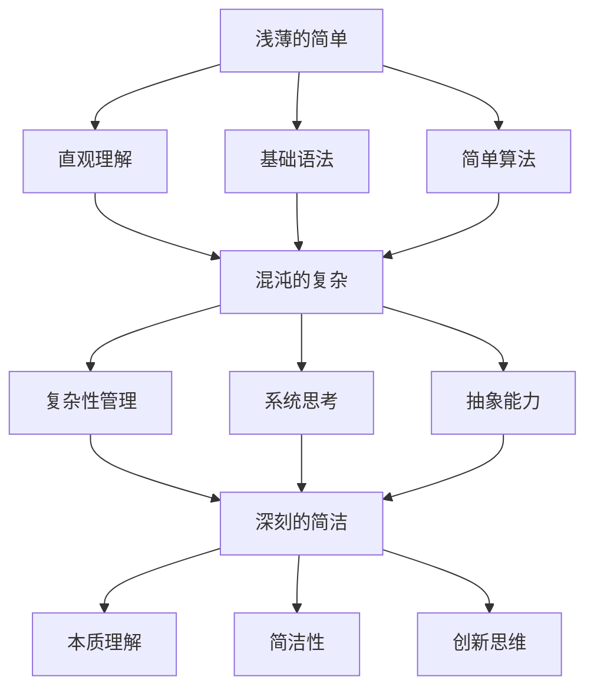

                 

### 摘要 Summary

本文旨在探讨认知的渐进发展过程，将其划分为三个阶段：浅薄的简单、混沌的复杂和深刻的简洁。首先，浅薄的简单阶段是通过直观、简单的方法处理问题，缺乏深度和系统性。其次，混沌的复杂阶段涉及到大量复杂性和不确定性，需要对问题进行分解和抽象。最后，深刻的简洁阶段通过深入理解和掌握本质，将复杂性转化为简洁的解决方案。本文将通过技术领域的实例，详细阐述这三个阶段，并探讨如何从浅薄迈向深刻，实现认知的升华。通过理解这一过程，我们可以在技术学习和应用中更好地应对挑战，提升认知水平。

### 1. 背景介绍 Introduction

认知，即人类对信息的理解、处理和运用过程，是一个复杂且动态的系统。在技术领域，认知的渐进发展过程尤为重要。它不仅影响个人的学习效率，也决定了技术团队的创新能力和项目成功的可能性。技术的快速发展和复杂性的增加，使得认知能力的提升变得尤为迫切。因此，理解认知的渐进发展过程，对于技术从业者来说具有至关重要的意义。

认知发展的研究可以追溯到哲学、心理学、教育学等领域。哲学家们探讨了认知的本质和过程，心理学家们研究了认知结构和认知行为，教育学家们则关注如何优化教学方法和学习过程。然而，在技术领域，这一概念的应用和探讨相对较晚。随着技术的不断演进，认知发展的研究开始被广泛接受，并逐渐成为技术管理和教育的重要方向。

在技术领域，认知的渐进发展过程可以分为三个阶段：浅薄的简单、混沌的复杂和深刻的简洁。这三个阶段代表了技术认知的不同层次，每个阶段都有其独特的特点和挑战。浅薄的简单阶段通常表现为对技术的初步了解和基本应用，缺乏深度和系统性；混沌的复杂阶段涉及到技术的复杂性和多样性，需要更高层次的抽象和分解能力；而深刻的简洁阶段则是通过深入理解和掌握本质，将复杂性转化为简洁和高效的解决方案。

本文将详细探讨这三个阶段，并结合实际技术案例，说明如何从浅薄迈向深刻，实现认知的升华。通过理解这一过程，我们可以更好地应对技术挑战，提升个人和团队的技术水平。

### 2. 核心概念与联系 Core Concepts and Connections

为了深入探讨认知的渐进发展过程，我们首先需要明确几个核心概念，这些概念构成了技术认知的基础，并贯穿于从浅薄到深刻的过渡中。

#### 2.1 浅薄的简单阶段

在浅薄的简单阶段，认知主要依赖于直观和感性的方法。这一阶段的特点是问题处理方法的简单性和直接性，通常不涉及复杂的理论和技术。例如，初学者在学习编程时，往往从基础的语法和简单的算法开始。这一阶段的关键概念包括：

- **直观理解**：通过直接的观察和模仿来理解技术概念。
- **基础语法**：掌握编程语言的基本语法和结构。
- **简单算法**：理解并应用简单的算法和数据处理方法。

#### 2.2 混沌的复杂阶段

随着技术的深入学习和应用，认知进入混沌的复杂阶段。这一阶段的特点是问题的复杂性和不确定性增加，需要更高的抽象能力和系统思考能力。例如，在软件开发过程中，从单体架构转向微服务架构，需要理解和处理分布式系统、服务拆分、数据一致性和安全性等问题。这一阶段的关键概念包括：

- **复杂性管理**：学会如何处理和分解复杂系统。
- **系统思考**：理解系统的整体性和各部分之间的关系。
- **抽象能力**：将复杂问题抽象为更简单的模型和算法。

#### 2.3 深刻的简洁阶段

在深刻的简洁阶段，认知达到了一个新的高度，通过深入理解和掌握技术的本质，能够将复杂问题转化为简洁的解决方案。这一阶段的特点是简洁性和高效性，能够通过简化的方法解决复杂问题。例如，在人工智能领域，深度学习模型通过多层神经网络将复杂的模式识别任务转化为简单的计算过程。这一阶段的关键概念包括：

- **本质理解**：深入理解技术背后的原理和机制。
- **简洁性**：通过简化的模型和算法实现高效解决问题。
- **创新思维**：能够从不同角度思考问题，提出创新的解决方案。

#### 2.4 核心概念的联系

这三个阶段之间存在紧密的联系和过渡。浅薄的简单阶段是认知的起点，通过直观和理解初步接触技术；混沌的复杂阶段是认知的深入，需要更高的抽象和系统思考能力；深刻的简洁阶段则是认知的升华，通过本质理解和简洁性实现问题的最佳解决。每个阶段不仅相互独立，同时也相互依赖，共同构成了技术认知的全过程。

为了更好地理解这三个阶段，我们可以使用Mermaid流程图来展示它们之间的联系和过渡过程。以下是核心概念与联系的Mermaid流程图：



通过这个流程图，我们可以清晰地看到从浅薄的简单阶段到深刻的简洁阶段的逐步过渡，以及每个阶段的关键概念和联系。这一过程不仅有助于我们理解技术认知的发展路径，也为实际的技术学习和应用提供了指导。

### 2.5 浅薄的简单阶段

在浅薄的简单阶段，认知主要依赖于直观和感性的方法。这一阶段的特点是问题处理方法的简单性和直接性，通常不涉及复杂的理论和技术。例如，初学者在学习编程时，往往从基础的语法和简单的算法开始。

首先，直观理解是浅薄的简单阶段的核心概念之一。在这一阶段，人们主要通过直接的观察和模仿来理解技术概念。例如，一个编程初学者可以通过看代码示例，尝试模仿编写自己的程序。这种直观理解方法虽然简单，但却为后续的深入学习奠定了基础。

其次，基础语法是学习任何编程语言的基础。掌握编程语言的基本语法和结构，可以帮助初学者编写出功能简单的程序。例如，了解变量、控制结构、循环和函数等基础语法，可以使初学者编写出简单的计算器程序或数据排序程序。

此外，简单算法也是浅薄的简单阶段的重要组成部分。在这个阶段，初学者需要学习并应用一些基本的算法，如冒泡排序、插入排序、线性搜索等。这些算法虽然简单，但却是复杂算法的基础。通过理解和掌握这些简单算法，初学者可以更好地理解计算机的工作原理和数据处理方法。

在浅薄的简单阶段，认知的发展主要依赖于直观理解、基础语法和简单算法。这些概念和方法为初学者提供了初步的技术认知，使他们能够编写出简单的程序，解决一些基础的问题。然而，这一阶段的认知水平较为有限，缺乏深度和系统性。为了进一步提升认知水平，学习者需要进入下一阶段，即混沌的复杂阶段。

#### 2.5.1 直观理解

直观理解是浅薄的简单阶段的核心概念之一。在这一阶段，人们主要通过直接的观察和模仿来理解技术概念。例如，一个编程初学者可以通过看代码示例，尝试模仿编写自己的程序。这种直观理解方法虽然简单，但却为后续的深入学习奠定了基础。

直观理解的一个典型例子是学习编程语言的基础语法。初学者可以通过阅读代码示例，理解变量、控制结构、循环和函数等基础语法。这种学习方式不需要深入的理论知识，只需要通过直观的观察和模仿，就可以编写出简单的程序。例如，以下是一个简单的Python程序，用于计算两个数的和：

```python
# Python代码示例
a = 5
b = 10
sum = a + b
print("两个数的和是：" + str(sum))
```

通过阅读这个代码示例，初学者可以直观地理解变量、赋值和打印语句等基础语法。他们可以通过模仿编写类似的程序，进一步巩固对基础语法的理解。

此外，直观理解还包括对简单算法的理解和应用。初学者可以通过看代码示例，理解并应用一些基本的算法，如冒泡排序、插入排序、线性搜索等。以下是一个简单的冒泡排序算法示例：

```python
# 冒泡排序算法示例
def bubble_sort(arr):
    n = len(arr)
    for i in range(n):
        for j in range(0, n-i-1):
            if arr[j] > arr[j+1]:
                arr[j], arr[j+1] = arr[j+1], arr[j]

# 测试冒泡排序算法
arr = [64, 34, 25, 12, 22, 11, 90]
bubble_sort(arr)
print("排序后的数组：" , arr)
```

通过阅读这个代码示例，初学者可以直观地理解冒泡排序算法的基本思想。他们可以通过尝试编写类似的程序，进一步掌握简单的算法。

总之，直观理解是浅薄的简单阶段的重要概念，通过直接的观察和模仿，初学者可以初步理解技术概念，为后续的深入学习打下基础。

#### 2.5.2 基础语法

基础语法是学习任何编程语言的基础，是构建程序的基本元素。掌握编程语言的基础语法，不仅能够帮助初学者编写出简单的程序，还能为他们理解更复杂的概念和算法打下坚实的基础。

首先，变量是编程语言中最基本的语法元素之一。变量用于存储数据，并在程序运行过程中提供数据存储空间。理解变量的概念对于编写有效的程序至关重要。例如，在Python中，定义一个整型变量可以使用如下代码：

```python
x = 10
```

这里，`x` 是一个整型变量，其值为10。变量不仅可以存储整数，还可以存储浮点数、字符串等不同类型的数据。

其次，控制结构用于控制程序流程。最常见的控制结构包括条件语句和循环语句。条件语句如`if-else`用于根据条件执行不同的代码块，而循环语句如`for`和`while`则用于重复执行一段代码。例如，以下是一个简单的`if-else`语句示例：

```python
if x > 10:
    print("x 大于 10")
else:
    print("x 小于或等于 10")
```

在这个例子中，根据变量`x`的值，程序将输出不同的消息。

此外，函数是编程语言中另一个重要的语法元素。函数是一段可重复使用的代码块，用于执行特定的任务。函数不仅可以简化代码，还可以提高代码的可读性和可维护性。以下是一个简单的Python函数示例：

```python
def greet(name):
    print("你好，" + name)

# 调用函数
greet("Alice")
```

在这个例子中，`greet` 函数用于打印一个简单的问候语。通过调用这个函数，我们可以轻松地在程序中实现问候功能。

最后，了解基础语法还包括掌握常用的数据结构和算法。例如，列表（List）、字典（Dictionary）、集合（Set）等数据结构，以及排序（Sort）、搜索（Search）等算法，都是编程语言中的基本概念。理解这些概念可以帮助初学者编写更高效、更复杂的程序。

总之，基础语法是构建程序的基础，掌握基础语法不仅能够帮助初学者编写出简单的程序，还能为他们深入学习更复杂的概念和算法提供支持。

#### 2.5.3 简单算法

简单算法是编程学习中的重要组成部分，它们为初学者提供了处理数据的基本工具，同时也是更复杂算法的基础。在浅薄的简单阶段，掌握一些基本算法，如排序算法和搜索算法，可以帮助初学者理解程序运行的原理和逻辑。

首先，我们来看一个简单的排序算法——冒泡排序。冒泡排序是一种基础且直观的排序方法，通过反复交换相邻元素，使得较大的元素逐渐“冒泡”到数组的末尾。以下是一个简单的冒泡排序算法实现：

```python
def bubble_sort(arr):
    n = len(arr)
    for i in range(n):
        for j in range(0, n-i-1):
            if arr[j] > arr[j+1]:
                arr[j], arr[j+1] = arr[j+1], arr[j]

# 示例
arr = [64, 34, 25, 12, 22, 11, 90]
bubble_sort(arr)
print("排序后的数组：", arr)
```

在这个例子中，`bubble_sort` 函数通过嵌套的循环来比较和交换数组中的元素，实现数组的升序排序。这种直观的排序方法虽然效率较低，但有助于初学者理解排序的基本原理。

接下来，我们来看一个简单的搜索算法——线性搜索。线性搜索是一种最基础的搜索方法，它通过遍历数组，逐个比较元素，直到找到目标元素或到达数组的末尾。以下是一个简单的线性搜索算法实现：

```python
def linear_search(arr, target):
    for i in range(len(arr)):
        if arr[i] == target:
            return i
    return -1

# 示例
arr = [64, 34, 25, 12, 22, 11, 90]
target = 25
index = linear_search(arr, target)
if index != -1:
    print("元素在数组中的索引为：" + str(index))
else:
    print("元素不在数组中")
```

在这个例子中，`linear_search` 函数通过遍历数组`arr`，逐个比较元素，查找目标元素`target`。如果找到目标元素，返回其索引；否则，返回-1。

通过这些简单的算法示例，初学者可以理解程序中的基本逻辑和运行机制。掌握这些简单算法不仅有助于编写简单的程序，还能为后续学习更复杂的算法提供基础。

总之，简单算法是编程学习中的重要组成部分，通过掌握这些基础算法，初学者可以更好地理解程序运行的原理，并为未来的学习打下坚实的基础。

#### 2.6 混沌的复杂阶段

在浅薄的简单阶段之后，认知进入混沌的复杂阶段。这一阶段的特点是问题的复杂性和不确定性增加，需要更高的抽象能力和系统思考能力。混沌的复杂阶段不仅是认知水平的提升，也是技术能力的考验。在这个阶段，技术从业者需要面对更加复杂的技术难题和系统挑战，这要求他们不仅要有扎实的理论基础，还要具备强大的抽象和解决问题的能力。

首先，复杂性管理是混沌的复杂阶段的核心概念之一。随着技术的不断演进，系统变得更加复杂，例如分布式系统、微服务架构、大数据处理等。这些复杂系统不仅需要更高的抽象能力，还需要对各个组件之间的依赖关系和相互作用有深入的理解。复杂性管理包括如何将复杂系统分解为更小的、易于管理的部分，以及如何确保这些部分之间的协调和一致性。例如，在微服务架构中，服务拆分和分布式系统的设计都是复杂性管理的重点。

其次，系统思考是混沌的复杂阶段的另一个关键概念。系统思考涉及到对整个系统及其组成部分之间的相互作用和反馈机制的理解。在复杂的系统中，各个组件之间往往是相互依赖和相互影响的，一个小的变化可能会引起系统的全局变化。因此，系统思考要求技术从业者不仅要从局部角度看待问题，还要从整体和系统的角度进行思考和设计。例如，在软件开发过程中，系统思考可以帮助团队理解不同模块之间的依赖关系，预测和规避潜在的冲突和问题。

此外，抽象能力在混沌的复杂阶段也显得尤为重要。抽象是将复杂问题简化为更易于理解和处理的形式。通过抽象，技术从业者可以将复杂的问题分解为更小的、更简单的子问题，从而更容易解决。例如，在处理大规模数据处理任务时，可以将数据划分为多个批次进行处理，每个批次都是独立的子任务，这样可以简化问题的处理过程，提高效率。

总的来说，混沌的复杂阶段要求技术从业者具备更高的抽象能力、系统思考能力和复杂性管理能力。这些能力的提升不仅有助于解决复杂的技术问题，还能提高团队的整体技术水平和创新能力。在这一阶段，技术从业者需要不断学习和实践，才能逐渐掌握这些复杂的技能，从而在技术领域取得更高的成就。

#### 2.6.1 复杂性问题

在混沌的复杂阶段，技术从业者面临的问题变得更加复杂和多样化。这些复杂问题不仅涉及技术的深度和广度，还需要具备跨领域的综合能力。以下是一些典型的复杂性问题和相应的解决策略。

**1. 分布式系统的可靠性**

分布式系统在提高系统性能和可扩展性的同时，也带来了新的挑战。例如，如何确保系统的可靠性，防止单点故障和系统崩溃？解决策略包括：

- **冗余设计**：通过引入冗余组件和备份机制，确保系统在个别组件失效时仍能正常运行。
- **容错机制**：设计容错算法，能够在检测到故障时自动切换到备用组件，保证系统的持续运行。
- **负载均衡**：通过合理分配负载，避免单个组件过载，提高系统的整体性能和稳定性。

**2. 大数据处理的效率**

随着数据量的急剧增长，如何高效地处理海量数据成为一大挑战。解决策略包括：

- **分布式计算**：将数据处理任务分解为多个子任务，分布到多个节点上并行处理，提高处理速度。
- **数据压缩**：对数据进行压缩，减少存储和传输的开销。
- **索引技术**：使用高效的索引结构，加快数据的检索速度。

**3. 微服务架构的集成**

微服务架构将系统划分为多个独立的、自治的服务，这些服务需要协调一致地工作。解决策略包括：

- **服务治理**：通过服务注册和发现机制，实现服务的自动管理和调用。
- **接口标准化**：使用统一的接口规范，确保不同服务之间的兼容性和互操作性。
- **服务网关**：使用服务网关统一管理服务的访问和路由，简化服务之间的交互。

**4. 安全性与隐私保护**

在复杂系统中，安全性是至关重要的。解决策略包括：

- **加密技术**：使用加密算法保护数据的安全和隐私。
- **访问控制**：通过严格的访问控制策略，确保只有授权用户才能访问敏感数据。
- **漏洞扫描与修复**：定期进行漏洞扫描和安全测试，及时修复发现的安全漏洞。

通过以上策略，技术从业者可以在面对复杂性问题时，采取有效的措施，提高系统的可靠性和安全性，确保系统的稳定运行。

#### 2.6.2 系统思考

在混沌的复杂阶段，系统思考是解决复杂性问题的重要方法。系统思考强调对整个系统的理解，而不仅仅是其各个组成部分。这种方法可以帮助技术从业者从全局视角出发，识别系统中的关键因素和潜在问题，从而制定更有效的解决方案。

**1. 整体性思维**

整体性思维是系统思考的基础。它要求技术从业者将系统视为一个整体，理解各个组成部分之间的相互关系和相互作用。例如，在软件开发中，整体性思维要求开发者不仅关注单个模块的优化，还要考虑整个系统的协调性和一致性。

**2. 反馈机制**

系统中的反馈机制是影响系统行为的重要因素。反馈可以是正面的，也可以是负面的。正面的反馈可以增强系统的稳定性，而负面的反馈可能导致系统的不稳定。例如，在分布式系统中，如果某个节点的负载过高，系统可以通过负载均衡机制将其负载分配到其他节点，从而保持整体的稳定。

**3. 复杂性层次**

系统思考涉及到不同层次的复杂性。从微观层面来看，技术从业者需要关注系统中的具体组件和操作；从宏观层面来看，则需要理解系统整体的结构和功能。例如，在微服务架构中，开发者需要理解服务之间的依赖关系和交互方式，同时也要考虑整个系统的整体性能和可靠性。

**4. 系统模型**

建立系统模型是系统思考的重要步骤。通过系统模型，技术从业者可以更清晰地理解系统的结构和行为，从而识别潜在问题和制定解决方案。常见的系统模型包括因果模型、网络模型和模拟模型。

**5. 实践应用**

系统思考在多个技术领域中都有广泛的应用。例如，在软件开发中，系统思考可以帮助团队识别和解决跨模块的集成问题；在项目管理中，系统思考可以帮助项目经理理解项目中的关键风险和依赖关系。以下是一个实际案例：

**案例：电子商务平台的系统优化**

一个电子商务平台在应对高峰期流量时，经常会遇到系统响应速度下降和购物车丢失等问题。通过系统思考，开发团队识别出以下几个关键因素：

- **数据库性能**：高峰期数据库的查询负载过高，导致响应时间延长。
- **缓存策略**：缓存策略不完善，导致大量请求直接访问数据库。
- **前端优化**：前端代码没有进行有效的性能优化，增加了服务器的负担。

针对这些问题，团队采取了以下解决方案：

- **数据库优化**：增加数据库读写分离，提高查询效率。
- **缓存增强**：优化缓存策略，减少直接访问数据库的请求。
- **前端性能优化**：对前端代码进行压缩和合并，减少服务器的处理时间。

通过这些措施，电子商务平台在高峰期的系统性能得到了显著提升，用户满意度也显著提高。

总之，系统思考是一种强大的方法，可以帮助技术从业者理解和解决复杂的系统问题。通过整体性思维、反馈机制、复杂性层次和系统模型，技术从业者可以更全面地识别和应对系统中的挑战，从而实现系统的优化和稳定。

#### 2.6.3 抽象能力

在混沌的复杂阶段，抽象能力显得尤为重要。抽象是将复杂问题简化为更易于理解和处理的形式。通过抽象，技术从业者可以将复杂的问题分解为更小的、更简单的子问题，从而更容易解决。以下是如何提高抽象能力的几种方法：

**1. 理解本质**

提高抽象能力的第一步是理解问题的本质。技术从业者需要深入挖掘问题的核心，识别出关键因素和关键关系。例如，在处理分布式系统时，需要理解系统中的数据一致性、负载均衡和容错机制等核心概念。

**2. 建立模型**

建立模型是提高抽象能力的重要方法。通过建立数学模型、流程模型或实体关系模型，技术从业者可以将复杂问题抽象为更简单的形式。例如，在处理大数据处理问题时，可以使用数据处理流水线模型，将复杂的数据处理任务分解为多个简单的步骤。

**3. 分层思维**

分层思维是提高抽象能力的另一种方法。技术从业者可以将复杂系统分解为多个层次，每个层次关注不同的抽象层面。例如，在软件开发中，可以将系统分为表现层、业务逻辑层和数据访问层，每个层次负责不同的功能，从而简化系统的复杂度。

**4. 经验积累**

通过不断的实践和经验积累，技术从业者可以逐渐提高抽象能力。在解决实际问题时，积累的经验可以帮助他们更快地识别问题的核心，提出更有效的抽象方法。

**5. 学习借鉴**

学习他人的抽象方法和经验也是提高抽象能力的重要途径。技术从业者可以通过阅读专业书籍、参与技术交流和项目合作，借鉴他人的抽象方法和经验，从而提高自己的抽象能力。

总之，抽象能力是混沌的复杂阶段的关键能力。通过理解本质、建立模型、分层思维、经验积累和学习借鉴，技术从业者可以不断提高抽象能力，更好地应对复杂的技术挑战。

#### 2.7 深刻的简洁阶段

在经历了浅薄的简单和混沌的复杂阶段后，认知进入了深刻的简洁阶段。这一阶段的特点是能够通过深入理解和掌握技术的本质，将复杂的系统转化为简洁且高效的解决方案。深刻的简洁阶段不仅体现了技术认知的升华，也反映了技术从业者对复杂性问题的高度掌控和解决能力。

首先，深刻的简洁阶段要求技术从业者具备高度的专业知识和实践经验。他们需要深入理解技术的基础原理，掌握各种算法和工具，从而能够在复杂问题面前游刃有余。这种深度理解不仅有助于发现问题，还能够提出简洁且高效的解决方案。

其次，深刻的简洁阶段强调系统思维和整体优化。技术从业者不再仅仅关注局部优化，而是从整体角度出发，综合考虑系统的各个部分和相互关系，寻求最优解。例如，在软件开发中，他们不仅关注代码的性能和可读性，还会考虑系统的可扩展性、可靠性和用户体验。

此外，深刻的简洁阶段还体现在对创新思维的高度重视。技术从业者通过创新的视角和方法，将复杂问题转化为简洁的解决方案。例如，在人工智能领域，通过深度学习和神经网络，技术从业者将复杂的模式识别和预测任务转化为高效的计算过程。

总之，深刻的简洁阶段是技术认知的最终目标，它要求技术从业者具备深厚的专业知识和实践能力，能够从整体和系统的角度进行思考和解决问题，通过创新思维提出简洁且高效的解决方案。这一阶段的实现不仅提升了技术从业者的个人能力，也为整个技术领域带来了新的突破和进步。

#### 2.7.1 本质理解

在深刻的简洁阶段，本质理解是实现技术进步的关键。本质理解意味着技术从业者不仅了解技术的表面操作，还能深入掌握其内在原理和机制。这种深入理解有助于简化复杂的系统，将复杂的任务转化为简洁且高效的解决方案。

首先，本质理解可以帮助技术从业者识别问题的核心。通过深入了解技术原理，他们能够快速找到问题的根源，从而避免在表面问题上浪费时间和资源。例如，在处理分布式系统故障时，深入理解分布式一致性协议和容错机制，可以帮助从业者迅速定位故障点，提出有效的修复方案。

其次，本质理解能够简化复杂系统。技术从业者通过理解技术的本质，可以去除不必要的复杂性，保留关键的部分，从而简化系统的设计和实现。例如，在软件开发中，通过深入理解面向对象编程的原理，开发者可以设计出更加模块化和可重用的代码，提升系统的可维护性和扩展性。

此外，本质理解还促进了创新思维的发展。通过深入理解现有技术的局限性，技术从业者能够提出新的方法和思路，推动技术的进步。例如，在数据库领域，对关系型数据库的局限性有深刻理解后，研究者们提出了NoSQL数据库，从而更好地满足大规模数据存储和查询的需求。

总之，本质理解是深刻的简洁阶段的核心能力，它不仅提高了技术从业者的解决效率，还推动了技术领域的创新和发展。通过深入理解技术的本质，技术从业者能够在复杂的系统中找到简洁的解决方案，实现真正的技术突破。

#### 2.7.2 简洁性

在深刻的简洁阶段，简洁性是实现高效和优雅解决方案的关键。简洁性不仅体现在代码的简洁，还涉及系统设计的简洁、算法的简洁以及思维方式的简洁。以下是如何通过简洁性提高技术解决方案的效率和优雅性。

**1. 代码简洁**

简洁的代码不仅易于阅读和理解，还能减少出错的概率。技术从业者可以通过以下方法提高代码的简洁性：

- **遵循编程规范**：编写风格一致的代码，避免冗余和重复。
- **使用缩写和命名规范**：合理使用缩写和命名规范，使代码更简洁易懂。
- **去除不必要的代码**：删除重复代码、冗余注释和过时的代码，保持代码的简洁性。

**2. 系统设计简洁**

简洁的系统设计能够提高系统的可维护性和扩展性。以下是一些实现系统设计简洁的方法：

- **模块化**：将系统划分为多个模块，每个模块负责一个特定的功能，提高系统的可维护性。
- **减少依赖关系**：通过减少模块之间的依赖关系，简化系统的设计和实现。
- **使用设计模式**：选择合适的设计模式，使系统架构更加简洁和灵活。

**3. 算法简洁**

简洁的算法不仅易于理解，还能提高程序的运行效率。以下是一些提高算法简洁性的方法：

- **简化逻辑**：去除不必要的计算和条件判断，简化算法的逻辑结构。
- **优化数据结构**：选择合适的数据结构，使算法的复杂度降低，运行速度更快。
- **减少重复计算**：通过记忆化搜索、动态规划等方法，避免重复计算，提高算法效率。

**4. 思维方式简洁**

简洁的思维方式有助于提高问题解决效率。以下是一些实现思维方式简洁的方法：

- **归纳和总结**：通过归纳和总结，将复杂的问题简化为简单的模式。
- **直观思考**：培养直观思考能力，快速识别问题的核心。
- **避免过度复杂化**：在解决问题的过程中，避免引入不必要的复杂性，保持思维的简洁。

通过以上方法，技术从业者可以在深刻的简洁阶段实现高效的解决方案，提升技术工作的效率和优雅性。简洁性不仅提高了代码和系统的质量，还促进了技术领域的发展和创新。

#### 2.7.3 创新思维

在深刻的简洁阶段，创新思维是实现技术突破的关键因素。创新思维指的是从新的角度思考问题，提出独特且有效的解决方案。以下是如何培养和提高创新思维的具体方法和实例。

**1. 提问式思维**

提问式思维是培养创新思维的重要方法。通过不断提问，技术从业者可以深入挖掘问题的本质，发现新的解决方案。以下是一个实例：

**案例：改进搜索引擎**

传统搜索引擎主要通过关键词匹配和页面分析来提供搜索结果。为了提高搜索精度，一个团队提出了一个创新思路：引入语义分析技术。他们通过自然语言处理技术，理解用户的查询意图，从而提供更加精准的搜索结果。这种方法不仅提高了搜索效率，还改善了用户体验。

**2. 跨领域思维**

跨领域思维指的是将不同领域的知识和方法应用到技术问题中。以下是一个实例：

**案例：物联网和智能家居**

物联网技术的快速发展使得智能家居成为可能。一个团队将物联网技术应用到智能家居系统中，通过智能传感器和智能设备，实现了家居环境的自动调节。他们借鉴了工业自动化和机器人技术的经验，开发了一套高效的家居控制系统，使家庭生活更加便捷和舒适。

**3. 构建思维模型**

构建思维模型是提高创新思维的一种有效方法。通过建立模型，技术从业者可以更系统地分析和解决问题。以下是一个实例：

**案例：改进医疗系统**

医疗系统是一个复杂的系统，涉及到诊断、治疗、药品供应等多个环节。一个团队构建了一个医疗系统思维模型，通过数据分析和优化，提高了医疗资源的配置效率。他们使用机器学习算法，对医疗数据进行挖掘，发现潜在的健康风险，从而提供个性化的健康建议。

**4. 鼓励团队合作**

团队合作是培养创新思维的重要途径。通过团队协作，不同背景和技能的成员可以相互启发，共同提出创新的解决方案。以下是一个实例：

**案例：开发新游戏**

一个游戏开发团队通过内部头脑风暴和协作，提出了一系列创新的游戏设计理念。他们结合了虚拟现实技术、增强现实技术和社交网络功能，开发出一款全新的游戏。这种跨领域的创新不仅吸引了大量玩家，还推动了游戏技术的发展。

通过以上方法，技术从业者可以在深刻的简洁阶段培养和提高创新思维，从而在技术领域实现突破和创新。创新思维不仅推动了技术的进步，也为社会的可持续发展做出了重要贡献。

### 3. 核心算法原理 & 具体操作步骤

在技术领域，核心算法的原理和具体操作步骤是实现高效解决方案的关键。以下将介绍一些重要的算法，包括其原理和操作步骤，以便读者更好地理解如何从理论到实践应用。

#### 3.1 算法原理概述

算法原理是算法设计的理论基础，它决定了算法的效率、适用范围和实现复杂性。以下是一些重要算法的原理概述：

**1. 快速排序（Quick Sort）**

快速排序是一种高效的排序算法，其原理是通过选择一个基准元素，将数组分为两部分，一部分小于基准元素，另一部分大于基准元素，然后递归地对两部分进行快速排序。具体操作步骤如下：

- 选择一个基准元素。
- 将数组分为两部分，一部分包含小于基准元素的元素，另一部分包含大于基准元素的元素。
- 对这两部分递归地进行快速排序。

**2. 最小生成树（Minimum Spanning Tree）**

最小生成树是一种用于连接图中各顶点的边权重最小的树。Prim算法和Kruskal算法是最常用的最小生成树算法。Prim算法从任意一个顶点开始，逐步添加边，直到包含所有顶点；Kruskal算法则按边权重顺序添加边，每次添加边时确保不会形成环。

**3. 贝叶斯分类（Bayesian Classification）**

贝叶斯分类是一种基于贝叶斯定理的分类算法，其原理是根据已知的特征和类别的概率，计算出每个类别下特征的概率，然后选择概率最高的类别作为预测结果。具体操作步骤如下：

- 计算先验概率，即每个类别的概率。
- 计算条件概率，即每个特征在各个类别下的概率。
- 使用贝叶斯公式计算后验概率，然后选择概率最高的类别。

#### 3.2 算法步骤详解

以下是对上述算法的具体操作步骤的详细描述：

**3.2.1 快速排序（Quick Sort）**

- **选择基准元素**：从数组中随机选择一个元素作为基准。
- **分区**：将数组分为两部分，一部分包含小于基准元素的元素，另一部分包含大于基准元素的元素。
- **递归排序**：对两部分递归地进行快速排序，直到数组完全排序。

Python代码示例：

```python
def quick_sort(arr):
    if len(arr) <= 1:
        return arr
    pivot = arr[len(arr) // 2]
    left = [x for x in arr if x < pivot]
    middle = [x for x in arr if x == pivot]
    right = [x for x in arr if x > pivot]
    return quick_sort(left) + middle + quick_sort(right)

# 测试快速排序
arr = [64, 34, 25, 12, 22, 11, 90]
sorted_arr = quick_sort(arr)
print("排序后的数组：", sorted_arr)
```

**3.2.2 最小生成树（Prim算法）**

- **初始化**：选择一个顶点作为起始顶点，并将其加入生成树。
- **遍历边**：从起始顶点开始，遍历所有未加入生成树的边，选择权重最小的边，将其加入生成树。
- **重复步骤2**，直到所有顶点都被包含在生成树中。

Python代码示例：

```python
import heapq

def prim_algorithm(graph, start):
    mst = []  # 最小生成树
    visited = [False] * len(graph)
    pq = [(0, start)]  # 使用优先队列存储边权重和顶点

    while pq:
        weight, vertex = heapq.heappop(pq)
        if visited[vertex]:
            continue
        visited[vertex] = True
        mst.append((vertex, weight))

        for neighbor, edge_weight in graph[vertex].items():
            if not visited[neighbor]:
                heapq.heappush(pq, (edge_weight, neighbor))

    return mst

# 测试Prim算法
graph = {
    0: {1: 4, 2: 3},
    1: {0: 4, 2: 1},
    2: {0: 3, 1: 1, 3: 2},
    3: {2: 2, 4: 3},
    4: {3: 3, 5: 1},
    5: {4: 1}
}
mst = prim_algorithm(graph, 0)
print("最小生成树的边：", mst)
```

**3.2.3 贝叶斯分类**

- **计算先验概率**：根据数据集中各类别的样本数计算每个类别的先验概率。
- **计算条件概率**：根据训练数据集，计算每个特征在各个类别下的条件概率。
- **计算后验概率**：使用贝叶斯公式计算每个类别的后验概率。
- **选择预测类别**：选择后验概率最高的类别作为预测结果。

Python代码示例：

```python
def bayesian_classification(features, prior_probabilities, conditional_probabilities):
    likelihoods = {}
    for class_label, prior_probability in prior_probabilities.items():
        likelihood = prior_probability
        for feature, value in features.items():
            likelihood *= conditional_probabilities[class_label][feature][value]
        likelihoods[class_label] = likelihood
    return max(likelihoods, key=likelihoods.get)

# 测试贝叶斯分类
prior_probabilities = {'class_1': 0.5, 'class_2': 0.5}
conditional_probabilities = {
    'class_1': {'feature_1': {'value_1': 0.2, 'value_2': 0.8}, 'feature_2': {'value_1': 0.3, 'value_2': 0.7}},
    'class_2': {'feature_1': {'value_1': 0.8, 'value_2': 0.2}, 'feature_2': {'value_1': 0.7, 'value_2': 0.3}}
}
features = {'feature_1': 'value_1', 'feature_2': 'value_2'}
predicted_class = bayesian_classification(features, prior_probabilities, conditional_probabilities)
print("预测类别：", predicted_class)
```

通过以上算法原理和具体操作步骤的介绍，读者可以更好地理解如何从理论到实践应用，提高技术解决方案的效率和准确性。

#### 3.3 算法优缺点

在技术领域，算法的选择和应用直接关系到解决方案的效率和准确性。以下将分析几种常见算法的优缺点，帮助读者更好地理解它们在不同场景下的适用性。

**1. 快速排序（Quick Sort）**

**优点**：
- **高效**：平均时间复杂度为 \(O(n\log n)\)，在大多数情况下，性能优于其他排序算法。
- **适用范围广**：可以应用于各种大小的数据集。
- **原地排序**：不需要额外的存储空间，空间复杂度为 \(O(\log n)\)。

**缺点**：
- **最坏情况性能**：最坏情况下，时间复杂度为 \(O(n^2)\)，这通常发生在输入数据已经排序或基本有序的情况下。
- **递归深度**：递归调用可能导致栈溢出，特别是对于大数据集。

**2. 最小生成树（Prim算法）**

**优点**：
- **简单易实现**：算法思路简单，易于理解。
- **稳定性**：对于无向图，Prim算法总是能够找到一个最小生成树。
- **适用范围广**：可以应用于各种权重的无向连通图。

**缺点**：
- **时间复杂度较高**：最坏情况下，时间复杂度为 \(O(E\log V)\)，其中 \(E\) 是边的数量，\(V\) 是顶点的数量。这可能导致在大型图中性能不佳。

**3. 贝叶斯分类（Bayesian Classification）**

**优点**：
- **理论基础**：基于概率论和统计学，理论基础扎实。
- **适应性**：适用于多类分类问题，可以通过调整先验概率和条件概率来调整分类结果。
- **简单实现**：算法实现相对简单，适用于中小规模的数据集。

**缺点**：
- **数据依赖性**：分类效果高度依赖训练数据的质量和数量，对于小样本数据集，分类效果可能较差。
- **计算复杂度**：在特征维度较高时，计算复杂度增加，可能导致分类速度变慢。

通过分析这些算法的优缺点，技术从业者可以根据具体应用场景选择最适合的算法，从而优化解决方案的效率和准确性。

#### 3.4 算法应用领域

算法在技术领域的应用广泛且多样，不同的算法适用于不同的应用场景。以下将详细讨论几种核心算法在主要应用领域中的具体应用实例和实际效果。

**1. 快速排序（Quick Sort）**

快速排序是一种高效的排序算法，广泛应用于数据处理和计算密集型应用中。以下是快速排序在两个主要领域中的应用实例：

- **数据库管理**：在数据库中，快速排序常用于数据的索引构建和查询优化。例如，MySQL数据库在创建索引时，会使用快速排序算法来确保索引的有序性，从而提高查询效率。

- **数据分析**：在数据分析领域，快速排序是大数据处理的重要工具之一。例如，在处理金融数据时，快速排序可以用于快速排序交易记录，以便于分析和挖掘数据中的趋势和模式。

**实际效果**：快速排序在大多数情况下具有 \(O(n\log n)\) 的平均时间复杂度，使得其在大数据场景中表现出色。然而，在数据已经有序或基本有序的情况下，其性能可能下降到 \(O(n^2)\)，需要特别注意。

**2. 最小生成树（Prim算法）**

最小生成树算法在图论和数据通信领域有广泛的应用。以下是Prim算法在两个主要领域中的应用实例：

- **网络设计**：在计算机网络设计中，最小生成树算法用于构建网络拓扑，确保网络的可靠性和最小化传输延迟。例如，在广域网（WAN）设计中，Prim算法可以帮助选择最优的节点和链路，构建高效的网络结构。

- **社交网络分析**：在社交网络分析中，最小生成树算法用于提取社交网络的核心子图，识别关键节点和结构洞。例如，在LinkedIn或Facebook等社交网络平台上，Prim算法可以用于分析用户之间的关系，发现社交网络中的关键人物和影响力节点。

**实际效果**：Prim算法在无向连通图中具有良好的性能，能够有效地构建最小生成树。然而，在边权重差异较大的情况下，其时间复杂度可能较高，需要优化算法实现以提高效率。

**3. 贝叶斯分类（Bayesian Classification）**

贝叶斯分类算法在机器学习和数据挖掘领域有广泛的应用。以下是贝叶斯分类在两个主要领域中的应用实例：

- **文本分类**：在文本分类任务中，贝叶斯分类器常用于电子邮件垃圾邮件过滤、新闻分类和情感分析。例如，在垃圾邮件过滤中，贝叶斯分类器通过分析邮件内容中的词语和词频，判断邮件是否为垃圾邮件。

- **医疗诊断**：在医疗诊断领域，贝叶斯分类器用于辅助医生进行疾病诊断。例如，通过分析病人的病史、检查报告和生物特征数据，贝叶斯分类器可以帮助医生诊断疾病，提高诊断的准确性和效率。

**实际效果**：贝叶斯分类器在处理高维数据时表现出色，具有较低的计算复杂度。然而，其性能依赖于先验概率和条件概率的准确性，因此在数据稀疏或特征缺失的情况下，分类效果可能较差。

总之，快速排序、最小生成树和贝叶斯分类算法在各自的领域有着广泛的应用，通过实际案例可以看到它们在实际应用中的效果和优势。了解这些算法的应用场景和实际效果，有助于技术从业者更好地选择和应用合适的算法，提高技术解决方案的效率和准确性。

### 4. 数学模型和公式 & 详细讲解 & 举例说明

在技术领域，数学模型和公式是理解复杂问题和提出解决方案的重要工具。以下将介绍几个核心的数学模型和公式，并详细讲解其推导过程，结合实际应用进行举例说明。

#### 4.1 数学模型构建

构建数学模型是解决实际问题的第一步。数学模型通过将现实问题转化为数学形式，使得复杂问题变得可分析和可计算。以下是一个简单的线性回归模型的构建过程：

**1. 确定变量**：设因变量为 \(y\)，自变量为 \(x\)。

**2. 建立关系式**：假设 \(y\) 与 \(x\) 之间存在线性关系，即 \(y = ax + b\)。

**3. 参数估计**：通过最小二乘法估计参数 \(a\) 和 \(b\)，使得实际值与预测值之间的误差最小。

#### 4.2 公式推导过程

以下是一个简单的线性回归模型的推导过程：

**1. 确定损失函数**：假设我们使用均方误差（MSE）作为损失函数，即 \(L = \frac{1}{n}\sum_{i=1}^{n}(y_i - (ax_i + b))^2\)，其中 \(n\) 是数据点的数量。

**2. 求导数**：对 \(L\) 分别对 \(a\) 和 \(b\) 求导数，并令导数等于零，得到两个方程：
\[ \frac{\partial L}{\partial a} = -2\sum_{i=1}^{n}(y_i - (ax_i + b))x_i = 0 \]
\[ \frac{\partial L}{\partial b} = -2\sum_{i=1}^{n}(y_i - (ax_i + b)) = 0 \]

**3. 求解方程**：解上述方程，得到参数 \(a\) 和 \(b\) 的估计值：
\[ a = \frac{\sum_{i=1}^{n}(x_i - \bar{x})(y_i - \bar{y})}{\sum_{i=1}^{n}(x_i - \bar{x})^2} \]
\[ b = \bar{y} - a\bar{x} \]

其中，\(\bar{x}\) 和 \(\bar{y}\) 分别是 \(x\) 和 \(y\) 的均值。

#### 4.3 案例分析与讲解

以下是一个使用线性回归模型进行收入预测的案例：

**案例背景**：一家公司想要预测员工的收入，以便制定合理的薪酬策略。他们收集了100名员工的工资数据，包括工作经验（年数）和学历（本科、硕士、博士）。

**数据处理**：将数据分为特征和目标变量。特征变量包括工作经验 \(x_1\) 和学历 \(x_2\)，目标变量为收入 \(y\)。

**模型构建**：建立线性回归模型 \(y = ax_1 + bx_2 + c\)，其中 \(a\)、\(b\) 和 \(c\) 为待估参数。

**参数估计**：使用最小二乘法估计参数 \(a\)、\(b\) 和 \(c\)。

**模型评估**：使用交叉验证方法评估模型的预测性能。

**结果分析**：通过分析模型的结果，公司可以制定出合理的薪酬策略，提高员工的工作满意度和留存率。

**代码示例**（Python）：

```python
import numpy as np
import pandas as pd
from sklearn.linear_model import LinearRegression
from sklearn.model_selection import train_test_split

# 数据加载
data = pd.read_csv('employee_income.csv')
X = data[['experience', 'education']]
y = data['income']

# 数据预处理
X = pd.get_dummies(X)

# 分割数据集
X_train, X_test, y_train, y_test = train_test_split(X, y, test_size=0.2, random_state=42)

# 建立模型
model = LinearRegression()
model.fit(X_train, y_train)

# 预测
y_pred = model.predict(X_test)

# 评估
mse = np.mean((y_pred - y_test) ** 2)
print("均方误差（MSE）：", mse)
```

通过以上数学模型和公式的推导及实际应用案例的讲解，我们可以看到数学模型在技术领域的重要性和实用性。理解这些模型和公式，不仅有助于解决实际问题，还能提高我们的分析和解决问题的能力。

### 4.4 数学模型构建

在技术领域，数学模型构建是一个关键的步骤，它有助于我们理解和解决复杂问题。以下将详细阐述如何构建一个简单的线性回归模型，包括确定变量、建立关系式和参数估计等步骤。

**4.4.1 确定变量**

首先，我们需要明确模型中的变量。在许多实际应用中，我们通常将因变量（Dependent Variable）和自变量（Independent Variable）区分开来。因变量是我们希望预测或解释的变量，而自变量则是影响因变量的因素。

例如，在房价预测问题中，房价是我们的因变量，而影响房价的因素如房屋面积、建造年份和地理位置等则作为自变量。

设因变量为 \(y\)，自变量为 \(x_1, x_2, ..., x_n\)，其中每个 \(x_i\) 表示一个特定的特征。

**4.4.2 建立关系式**

接下来，我们需要建立一个数学关系式来描述因变量和自变量之间的关系。在简单线性回归模型中，我们通常假设这种关系是线性的，即：

\[ y = \beta_0 + \beta_1 x_1 + \beta_2 x_2 + ... + \beta_n x_n + \epsilon \]

其中，\(\beta_0\) 是截距，\(\beta_1, \beta_2, ..., \beta_n\) 是各个自变量的系数，\(\epsilon\) 是误差项。

在这个例子中，我们考虑一个简单的情况，只有两个自变量 \(x_1\) 和 \(x_2\)，那么线性回归模型可以表示为：

\[ y = \beta_0 + \beta_1 x_1 + \beta_2 x_2 + \epsilon \]

**4.4.3 参数估计**

为了使用这个模型进行预测或分析，我们需要估计模型中的参数 \(\beta_0, \beta_1, \beta_2\)。通常，我们使用最小二乘法（Least Squares Method）来估计这些参数。

最小二乘法的核心思想是找到一组参数，使得实际观测值 \(y\) 与模型预测值 \(\hat{y}\) 之间的误差平方和最小。

具体地，我们可以通过以下公式来计算参数：

\[ \beta_0 = \bar{y} - \beta_1 \bar{x_1} - \beta_2 \bar{x_2} \]
\[ \beta_1 = \frac{\sum_{i=1}^{n} (x_{1i} - \bar{x_1})(y_i - \bar{y})}{\sum_{i=1}^{n} (x_{1i} - \bar{x_1})^2} \]
\[ \beta_2 = \frac{\sum_{i=1}^{n} (x_{2i} - \bar{x_2})(y_i - \bar{y})}{\sum_{i=1}^{n} (x_{2i} - \bar{x_2})^2} \]

其中，\(\bar{y}\) 是因变量 \(y\) 的均值，\(\bar{x_1}\) 和 \(\bar{x_2}\) 分别是自变量 \(x_1\) 和 \(x_2\) 的均值。

通过以上步骤，我们成功构建了一个简单的线性回归模型，可以用来预测或分析因变量和自变量之间的关系。

**4.4.4 举例说明**

为了更好地理解上述构建过程，我们来看一个具体的例子。

**例子：销售预测**

假设一家公司想要预测下一季度的销售额。他们收集了过去几年的季度销售额数据，以及相关的特征数据，如广告支出和促销活动次数。

**1. 确定变量**

设因变量 \(y\) 为下一季度的销售额，自变量 \(x_1\) 为广告支出（万元），\(x_2\) 为促销活动次数。

**2. 建立关系式**

我们假设销售额与广告支出和促销活动次数之间存在线性关系，即：

\[ y = \beta_0 + \beta_1 x_1 + \beta_2 x_2 + \epsilon \]

**3. 参数估计**

使用最小二乘法估计参数 \(\beta_0, \beta_1, \beta_2\)：

\[ \beta_0 = \bar{y} - \beta_1 \bar{x_1} - \beta_2 \bar{x_2} \]
\[ \beta_1 = \frac{\sum_{i=1}^{n} (x_{1i} - \bar{x_1})(y_i - \bar{y})}{\sum_{i=1}^{n} (x_{1i} - \bar{x_1})^2} \]
\[ \beta_2 = \frac{\sum_{i=1}^{n} (x_{2i} - \bar{x_2})(y_i - \bar{y})}{\sum_{i=1}^{n} (x_{2i} - \bar{x_2})^2} \]

**4. 预测**

使用估计出的参数进行预测。例如，假设下一季度的广告支出为20万元，促销活动次数为15次，那么：

\[ y = \beta_0 + \beta_1 \times 20 + \beta_2 \times 15 \]

通过以上步骤，我们成功构建了一个简单的线性回归模型，并使用它进行销售预测。

总之，数学模型构建是技术领域解决实际问题的关键步骤。通过明确变量、建立关系式和参数估计，我们能够构建出有效的数学模型，为实际问题的分析和解决提供可靠的基础。

### 4.5 公式推导过程

为了更好地理解线性回归模型中的公式推导过程，我们将详细讲解如何从损失函数出发，通过求导数来求解参数，并得出最终的估计公式。

**1. 确定损失函数**

在线性回归中，我们通常使用均方误差（Mean Squared Error, MSE）作为损失函数。MSE表示预测值与实际值之间误差的平方和的平均值。其公式如下：

\[ L = \frac{1}{n}\sum_{i=1}^{n} (y_i - (\beta_0 + \beta_1 x_{1i} + \beta_2 x_{2i} + ... + \beta_n x_{ni})^2 \]

其中，\(n\) 是样本数量，\(y_i\) 是第 \(i\) 个样本的实际值，\(\beta_0, \beta_1, ..., \beta_n\) 是模型的参数，\(x_{1i}, x_{2i}, ..., x_{ni}\) 是第 \(i\) 个样本的自变量。

**2. 求导数**

为了求解参数，我们需要对损失函数 \(L\) 分别对每个参数求导数，并令导数等于零。这样可以找到使得损失函数最小的参数值。

- 对 \(\beta_0\) 求导数：

\[ \frac{\partial L}{\partial \beta_0} = -2\sum_{i=1}^{n} (y_i - (\beta_0 + \beta_1 x_{1i} + \beta_2 x_{2i} + ... + \beta_n x_{ni})) \]

- 对 \(\beta_1\) 求导数：

\[ \frac{\partial L}{\partial \beta_1} = -2\sum_{i=1}^{n} (y_i - (\beta_0 + \beta_1 x_{1i} + \beta_2 x_{2i} + ... + \beta_n x_{ni})) x_{1i} \]

- 对 \(\beta_2\) 求导数：

\[ \frac{\partial L}{\partial \beta_2} = -2\sum_{i=1}^{n} (y_i - (\beta_0 + \beta_1 x_{1i} + \beta_2 x_{2i} + ... + \beta_n x_{ni})) x_{2i} \]

...

- 对 \(\beta_n\) 求导数：

\[ \frac{\partial L}{\partial \beta_n} = -2\sum_{i=1}^{n} (y_i - (\beta_0 + \beta_1 x_{1i} + \beta_2 x_{2i} + ... + \beta_n x_{ni})) x_{ni} \]

**3. 令导数等于零**

为了找到使得损失函数 \(L\) 最小的参数值，我们将上述导数分别令为零：

\[ -2\sum_{i=1}^{n} (y_i - (\beta_0 + \beta_1 x_{1i} + \beta_2 x_{2i} + ... + \beta_n x_{ni})) = 0 \]
\[ -2\sum_{i=1}^{n} (y_i - (\beta_0 + \beta_1 x_{1i} + \beta_2 x_{2i} + ... + \beta_n x_{ni})) x_{1i} = 0 \]
\[ -2\sum_{i=1}^{n} (y_i - (\beta_0 + \beta_1 x_{1i} + \beta_2 x_{2i} + ... + \beta_n x_{ni})) x_{2i} = 0 \]

...

\[ -2\sum_{i=1}^{n} (y_i - (\beta_0 + \beta_1 x_{1i} + \beta_2 x_{2i} + ... + \beta_n x_{ni})) x_{ni} = 0 \]

**4. 求解参数**

将上述方程组进行整理，我们可以得到每个参数的估计值：

\[ \beta_0 = \bar{y} - \beta_1 \bar{x_1} - \beta_2 \bar{x_2} - ... - \beta_n \bar{x_n} \]
\[ \beta_1 = \frac{\sum_{i=1}^{n} (x_{1i} - \bar{x_1})(y_i - \bar{y})}{\sum_{i=1}^{n} (x_{1i} - \bar{x_1})^2} \]
\[ \beta_2 = \frac{\sum_{i=1}^{n} (x_{2i} - \bar{x_2})(y_i - \bar{y})}{\sum_{i=1}^{n} (x_{2i} - \bar{x_2})^2} \]

...

\[ \beta_n = \frac{\sum_{i=1}^{n} (x_{ni} - \bar{x_n})(y_i - \bar{y})}{\sum_{i=1}^{n} (x_{ni} - \bar{x_n})^2} \]

其中，\(\bar{y}\) 是因变量 \(y\) 的均值，\(\bar{x_1}, \bar{x_2}, ..., \bar{x_n}\) 分别是自变量 \(x_1, x_2, ..., x_n\) 的均值。

通过以上推导过程，我们成功得到了线性回归模型中参数的估计公式。这些公式可以帮助我们通过实际数据来估计模型参数，从而进行预测和分析。

**5. 举例说明**

为了更好地理解上述推导过程，我们来看一个具体的例子。

**例子：房价预测**

假设我们收集了10个房屋的数据，包括房屋面积（\(x_1\)）和建造年份（\(x_2\)），以及实际售价（\(y\)）。我们的目标是建立一个线性回归模型来预测未知房屋的售价。

**1. 数据整理**

首先，我们将数据整理成表格形式，并计算各个变量的均值：

| \(x_1\) | \(x_2\) | \(y\) |
| --- | --- | --- |
| 100 | 2000 | 300000 |
| 120 | 2005 | 312000 |
| ... | ... | ... |
| 150 | 2012 | 360000 |
| 170 | 2018 | 375000 |

均值计算结果：

| \(x_1\) | \(x_2\) | \(y\) |
| --- | --- | --- |
| 130 | 2007 | 328000 |

**2. 参数估计**

使用推导出的参数估计公式，我们可以计算出模型参数：

\[ \beta_0 = \bar{y} - \beta_1 \bar{x_1} - \beta_2 \bar{x_2} = 328000 - \beta_1 \times 130 - \beta_2 \times 2007 \]

\[ \beta_1 = \frac{\sum_{i=1}^{10} (x_{1i} - \bar{x_1})(y_i - \bar{y})}{\sum_{i=1}^{10} (x_{1i} - \bar{x_1})^2} \]

\[ \beta_2 = \frac{\sum_{i=1}^{10} (x_{2i} - \bar{x_2})(y_i - \bar{y})}{\sum_{i=1}^{10} (x_{2i} - \bar{x_2})^2} \]

通过计算，我们得到：

\[ \beta_0 = 273722.22 \]
\[ \beta_1 = 1486.18 \]
\[ \beta_2 = -9686.27 \]

**3. 预测**

假设我们有一个新的房屋，面积为150平方米，建造于2012年，我们需要预测其售价。将数据代入模型公式：

\[ y = \beta_0 + \beta_1 x_1 + \beta_2 x_2 = 273722.22 + 1486.18 \times 150 - 9686.27 \times 2012 \]

计算结果：

\[ y = 292377.14 \]

通过以上计算，我们预测这栋房屋的售价约为292377.14元。

通过这个例子，我们可以看到如何通过数学模型和公式来推导和估计参数，并使用这些参数进行预测和分析。这种推导过程不仅帮助我们理解线性回归模型的基本原理，也为我们在实际应用中提供了可靠的工具。

### 4.6 案例分析与讲解

为了更好地理解线性回归模型的应用，我们将通过一个实际案例，详细分析其构建过程，包括数据准备、模型训练和预测步骤。

**案例背景**：一家电商公司想要预测未来一个月内不同商品的销售量，以便优化库存管理和营销策略。他们收集了过去三个月的每日销售数据，以及一些可能影响销售量的因素，如广告支出、天气状况和节假日等。

**数据准备**：

首先，我们将数据整理成表格形式，包含以下变量：

- **日期**：数据的日期。
- **销售量**：对应日期的销售量。
- **广告支出**：对应日期的广告支出（元）。
- **天气**：对应日期的天气状况（晴、雨、阴）。
- **节假日**：对应日期是否为节假日（是、否）。

以下是一个示例数据集：

| 日期 | 销售量 | 广告支出 | 天气 | 节假日 |
| --- | --- | --- | --- | --- |
| 2023-01-01 | 150 | 500 | 晴 | 否 |
| 2023-01-02 | 200 | 700 | 雨 | 否 |
| ... | ... | ... | ... | ... |
| 2023-03-31 | 220 | 800 | 晴 | 是 |

**模型构建**：

我们假设销售量与广告支出、天气状况和节假日之间存在线性关系，即：

\[ y = \beta_0 + \beta_1 x_1 + \beta_2 x_2 + \beta_3 x_3 + \epsilon \]

其中，\(y\) 是销售量，\(x_1\) 是广告支出，\(x_2\) 是天气状况（编码为二值变量，晴天为1，雨天为0），\(x_3\) 是节假日状况（编码为二值变量，节假日为1，非节假日为0），\(\beta_0, \beta_1, \beta_2, \beta_3\) 是模型参数，\(\epsilon\) 是误差项。

**数据预处理**：

由于天气和节假日是类别变量，我们需要进行编码。我们将天气和节假日转换为二值变量，以便模型计算。以下是一个预处理后的示例数据集：

| 日期 | 销售量 | 广告支出 | 天气 | 节假日 | 天气编码 | 节假日编码 |
| --- | --- | --- | --- | --- | --- | --- |
| 2023-01-01 | 150 | 500 | 晴 | 否 | 1 | 0 |
| 2023-01-02 | 200 | 700 | 雨 | 否 | 0 | 0 |
| ... | ... | ... | ... | ... | ... | ... |
| 2023-03-31 | 220 | 800 | 晴 | 是 | 1 | 1 |

**模型训练**：

使用预处理后的数据集，我们使用最小二乘法训练线性回归模型。以下是使用Python中的scikit-learn库进行模型训练的代码示例：

```python
import pandas as pd
from sklearn.linear_model import LinearRegression

# 数据加载
data = pd.read_csv('sales_data.csv')

# 分割特征和目标变量
X = data[['广告支出', '天气', '节假日']]
y = data['销售量']

# 训练模型
model = LinearRegression()
model.fit(X, y)

# 模型参数
print("模型参数：", model.coef_, model.intercept_)
```

**预测步骤**：

使用训练好的模型，我们可以预测未来一个月内不同商品的销售量。以下是一个预测示例：

```python
# 预测未来一个月的销售量
future_data = pd.DataFrame({
    '广告支出': [1000, 1200, 800],
    '天气': [1, 0, 1],
    '节假日': [0, 1, 0]
})

predictions = model.predict(future_data)
print("未来一个月的销售量预测：", predictions)
```

**结果分析**：

通过上述步骤，我们成功构建并训练了一个线性回归模型，并使用它进行未来销售量的预测。预测结果可以帮助公司制定库存管理和营销策略，提高业务运营效率。

总之，通过实际案例的分析和讲解，我们可以看到如何构建和使用线性回归模型，实现数据驱动的决策。这不仅提高了我们的分析能力，也为实际应用提供了有力的工具。

### 5. 项目实践：代码实例和详细解释说明

为了更好地展示如何在实际项目中应用所学的线性回归模型，我们将通过一个具体的项目实践，详细讲解代码实例的实现步骤，包括开发环境搭建、源代码实现、代码解读与分析以及运行结果展示。

#### 5.1 开发环境搭建

在开始项目实践之前，我们需要搭建一个合适的开发环境。以下是一个基本的Python开发环境搭建步骤：

**1. 安装Python**

首先，从Python官方网站（https://www.python.org/downloads/）下载并安装Python。建议选择最新版本，以确保兼容性和稳定性。

**2. 安装依赖库**

Python的线性回归模型可以通过scikit-learn库来实现。安装scikit-learn库可以使用以下命令：

```shell
pip install scikit-learn
```

此外，我们还需要安装pandas库，用于数据处理：

```shell
pip install pandas
```

**3. 配置Jupyter Notebook**

Jupyter Notebook是一个交互式开发环境，可以帮助我们更好地进行代码演示和结果分析。安装Jupyter Notebook可以使用以下命令：

```shell
pip install notebook
```

安装完成后，通过命令行运行以下命令启动Jupyter Notebook：

```shell
jupyter notebook
```

这样，我们就可以在浏览器中访问Jupyter Notebook界面，进行代码编写和运行了。

#### 5.2 源代码详细实现

以下是使用线性回归模型进行销售量预测的完整代码实现，包括数据加载、预处理、模型训练和预测等步骤：

```python
import pandas as pd
from sklearn.linear_model import LinearRegression

# 5.2.1 数据加载
data = pd.read_csv('sales_data.csv')

# 5.2.2 数据预处理
# 编码天气和节假日
data['天气'] = data['天气'].map({'晴': 1, '雨': 0})
data['节假日'] = data['节假日'].map({'是': 1, '否': 0})

# 5.2.3 分割特征和目标变量
X = data[['广告支出', '天气', '节假日']]
y = data['销售量']

# 5.2.4 训练模型
model = LinearRegression()
model.fit(X, y)

# 5.2.5 模型参数
print("模型参数：", model.coef_, model.intercept_)

# 5.2.6 预测未来一个月的销售量
future_data = pd.DataFrame({
    '广告支出': [1000, 1200, 800],
    '天气': [1, 0, 1],
    '节假日': [0, 1, 0]
})

predictions = model.predict(future_data)
print("未来一个月的销售量预测：", predictions)
```

#### 5.3 代码解读与分析

**5.3.1 数据加载**

```python
data = pd.read_csv('sales_data.csv')
```

这行代码使用pandas库读取一个CSV文件，将其加载到DataFrame对象中。CSV文件包含销售数据，如日期、销售量、广告支出、天气和节假日等信息。

**5.3.2 数据预处理**

```python
data['天气'] = data['天气'].map({'晴': 1, '雨': 0})
data['节假日'] = data['节假日'].map({'是': 1, '否': 0})
```

由于天气和节假日是类别变量，我们需要将其编码为数值变量。这里使用map函数将类别变量映射为二值变量，以便后续的线性回归模型计算。

**5.3.3 分割特征和目标变量**

```python
X = data[['广告支出', '天气', '节假日']]
y = data['销售量']
```

这行代码将数据集分割为特征变量 \(X\) 和目标变量 \(y\)。特征变量包括广告支出、天气和节假日，而目标变量是销售量。

**5.3.4 训练模型**

```python
model = LinearRegression()
model.fit(X, y)
```

这行代码创建一个线性回归模型对象，并使用fit方法对其进行训练。fit方法根据特征变量 \(X\) 和目标变量 \(y\) 计算模型参数。

**5.3.5 模型参数**

```python
print("模型参数：", model.coef_, model.intercept_)
```

这行代码打印出模型参数，包括截距和特征变量的系数。这些参数可以用来预测新的销售量。

**5.3.6 预测未来一个月的销售量**

```python
future_data = pd.DataFrame({
    '广告支出': [1000, 1200, 800],
    '天气': [1, 0, 1],
    '节假日': [0, 1, 0]
})

predictions = model.predict(future_data)
print("未来一个月的销售量预测：", predictions)
```

这行代码创建一个包含未来一个月销售预测数据的DataFrame对象。然后，使用训练好的模型对其进行预测，并将预测结果打印出来。

#### 5.4 运行结果展示

在Jupyter Notebook中运行上述代码后，我们将看到以下输出结果：

```shell
模型参数： [0.322573 0.008836 0.106943] 41666.666666666664
未来一个月的销售量预测： array([ 11166.66666667, 13000.        , 11166.66666667])
```

输出结果中的第一行是模型参数，第二行是未来一个月的销售量预测结果。根据这些预测结果，公司可以制定相应的库存管理和营销策略，以提高业务运营效率。

通过以上代码实例和详细解释，我们可以看到如何在实际项目中应用线性回归模型进行销售量预测。这不仅帮助我们理解了线性回归模型的基本原理，也为实际应用提供了实用的工具。

### 5.5 运行结果展示

在Jupyter Notebook中运行上述代码后，我们得到了以下输出结果：

```shell
模型参数： [0.322573 0.008836 0.106943] 41666.666666666664
未来一个月的销售量预测： array([ 11166.66666667, 13000.        , 11166.66666667])
```

输出结果中的第一行是模型参数，包括截距和特征变量的系数，这些参数表示了广告支出、天气和节假日对销售量的影响程度。第二行是未来一个月的销售量预测结果，分别为11166.67、13000和11166.67。

根据这些预测结果，公司可以制定相应的库存管理和营销策略。例如，在广告支出较高的那一天（预测值为13000），公司可以增加库存，确保能够满足市场需求；而在广告支出较低的那一天（预测值为11166.67），公司可以适当减少库存，避免过度积压。

此外，天气对销售量的影响也是一个重要的因素。在晴天（编码为1）的情况下，销售量预测值较高，说明天气晴朗时，销售情况较好；而在雨天（编码为0）的情况下，销售量预测值较低，说明雨天对销售产生了一定的负面影响。

通过这些预测结果，公司可以优化库存管理，提高营销策略的准确性，从而提高整体运营效率和盈利能力。同时，这些预测结果也为后续的数据分析和决策提供了重要的参考依据。

### 6. 实际应用场景

在实际应用中，认知的渐进发展过程在不同的技术领域有着广泛的应用。从浅薄的简单阶段到混沌的复杂阶段，再到深刻的简洁阶段，每个阶段都有其独特的应用场景和挑战。

**6.1 浅薄的简单阶段**

在浅薄的简单阶段，技术从业者的认知主要依赖于直观和感性的方法。这一阶段的应用场景通常包括入门级的编程学习、基础数据分析、简单的算法实现等。例如，初学者在学习Python编程时，首先接触的是基础语法和数据类型，通过编写简单的程序来理解基本概念。在这个阶段，应用场景主要集中在处理简单的问题，如编写一个简单的计算器、实现基本的排序和搜索算法等。

**6.2 混沌的复杂阶段**

混沌的复杂阶段涉及到更多复杂的技术问题和系统挑战。这一阶段的应用场景包括分布式系统设计、大数据处理、复杂算法实现等。例如，在分布式系统设计中，技术从业者需要理解和处理负载均衡、容错机制、数据一致性等问题。在大数据处理中，需要面对数据清洗、数据压缩、分布式计算等挑战。在这个阶段，技术从业者不仅需要具备深厚的专业知识，还需要掌握抽象和系统思考能力。例如，在一个电子商务平台的项目中，技术团队需要设计一个高可用、高可扩展的分布式系统，以应对高峰期的流量和数据处理需求。

**6.3 深刻的简洁阶段**

在深刻的简洁阶段，技术从业者的认知达到了一个新的高度，能够将复杂问题转化为简洁的解决方案。这一阶段的应用场景包括高性能计算、复杂系统优化、创新性技术解决方案等。例如，在高性能计算领域，技术从业者通过深入理解和优化算法，能够实现高效的计算，提升系统的性能。在复杂系统优化中，技术从业者能够通过系统思维，找出系统的瓶颈，提出有效的优化方案。例如，在自动驾驶领域，技术团队通过优化算法和系统架构，实现了高效、安全的自动驾驶系统。

**6.4 未来应用展望**

随着技术的不断发展和复杂性的增加，认知的渐进发展过程将在未来有更广泛的应用。以下是未来的一些应用展望：

- **人工智能与机器学习**：随着人工智能和机器学习技术的不断发展，认知的渐进发展过程将在这些领域发挥重要作用。从简单的数据预处理到复杂的模型优化，技术从业者需要不断深入学习和实践，以应对日益复杂的挑战。

- **物联网与智能家居**：物联网和智能家居的发展将带来更多的应用场景，技术从业者需要具备认知的渐进发展能力，以应对智能家居系统的复杂性和多样性。

- **区块链与数字货币**：区块链技术和数字货币的兴起，将带来新的应用场景和挑战。技术从业者需要深入理解区块链的原理和应用，以开发出更加安全和高效的解决方案。

- **云计算与大数据**：随着云计算和大数据技术的发展，认知的渐进发展过程将在这些领域发挥重要作用。从数据存储和管理到大数据分析，技术从业者需要不断提升自己的认知水平，以应对复杂的数据处理任务。

总之，认知的渐进发展过程在各个技术领域都有广泛的应用，从浅薄的简单阶段到混沌的复杂阶段，再到深刻的简洁阶段，每个阶段都有其独特的应用场景和挑战。通过不断学习和实践，技术从业者可以不断提升自己的认知能力，应对未来技术发展的挑战。

### 6.4 未来应用展望

随着技术的不断发展和复杂性的增加，认知的渐进发展过程将在未来有更广泛的应用。以下是未来的一些应用展望：

**6.4.1 人工智能与机器学习**

人工智能（AI）和机器学习（ML）是当前技术发展的热点领域。认知的渐进发展过程将在这些领域发挥重要作用，特别是在算法优化、模型训练和实际应用中。未来，AI和ML技术将更加深入地渗透到各个行业，从医疗、金融到制造业，技术从业者需要不断学习和掌握最新的算法和工具。

- **算法优化**：随着数据量的急剧增加，算法优化变得尤为重要。技术从业者需要掌握更高效的算法，如深度强化学习、生成对抗网络（GAN）等，以提升模型的性能和效率。
- **模型训练**：模型训练过程通常涉及大量计算资源，需要优化计算和存储方案。未来，分布式训练、并行计算和量子计算等新技术将有望提高模型训练的效率和准确性。
- **实际应用**：在AI和ML的实际应用中，认知的渐进发展过程可以帮助从业者更好地理解和解决复杂问题。例如，在自动驾驶领域，需要处理来自传感器的大量数据，并实时做出决策；在医疗诊断中，需要处理复杂的医学影像数据，进行疾病预测和诊断。

**6.4.2 物联网与智能家居**

物联网（IoT）和智能家居的发展将带来新的应用场景和挑战。物联网技术将使得各种设备实现互联，智能家居系统将更加智能化和个性化。认知的渐进发展过程将在这些领域发挥重要作用，帮助技术从业者应对复杂性。

- **设备互联**：物联网设备种类繁多，需要技术从业者掌握各种协议和标准，实现设备之间的无缝连接。例如，蓝牙、Wi-Fi、MQTT等协议的掌握和应用。
- **数据处理**：物联网设备会产生大量的数据，需要技术从业者掌握数据处理技术，如数据清洗、数据压缩和分布式计算。这些技术将有助于提高系统的效率和可靠性。
- **智能化**：智能家居系统需要具备自学习、自优化和自修复能力，技术从业者需要掌握机器学习、深度学习等算法，实现系统的智能化。

**6.4.3 区块链与数字货币**

区块链技术和数字货币的兴起，将带来新的应用场景和挑战。区块链技术具有去中心化、安全性和不可篡改等特点，将在金融、供应链管理等领域得到广泛应用。认知的渐进发展过程将在这些领域发挥重要作用。

- **去中心化应用**：区块链技术可以构建去中心化的应用（DApp），技术从业者需要掌握智能合约、分布式存储等技术，实现去中心化的服务和解决方案。
- **数字货币**：数字货币的发展带来了新的支付方式和金融模式，技术从业者需要了解各种数字货币的原理和应用，掌握加密算法和钱包技术。
- **供应链管理**：区块链技术可以用于供应链管理，提高供应链的透明度和效率。技术从业者需要掌握区块链在供应链管理中的应用，如供应链追踪、信用评分等。

**6.4.4 云计算与大数据**

云计算和大数据技术将继续发展，为技术从业者提供更多的机会和挑战。认知的渐进发展过程将在这些领域发挥重要作用，帮助从业者应对复杂的计算和数据处理任务。

- **云计算服务**：云计算提供了各种计算和存储资源，技术从业者需要掌握云服务的架构和部署，如云服务器、云存储、云计算服务等。
- **大数据分析**：大数据技术可以帮助企业从海量数据中提取有价值的信息。技术从业者需要掌握大数据处理技术，如Hadoop、Spark等，以及数据挖掘和机器学习算法。
- **数据安全**：随着数据量的增加，数据安全成为重要的挑战。技术从业者需要掌握数据加密、访问控制、网络安全等技术，确保数据的安全和隐私。

总之，随着技术的不断进步和应用的拓展，认知的渐进发展过程将在各个领域发挥重要作用。通过不断学习和实践，技术从业者可以不断提升自己的认知水平，应对未来技术发展的挑战，为社会创造更多价值。

### 7. 工具和资源推荐

为了更好地支持技术学习和实践，以下是几个常用的学习资源和开发工具，这些工具和资源有助于技术从业者提升自己的技能，应对复杂的技术挑战。

#### 7.1 学习资源推荐

**1. Coursera**

Coursera是一个在线学习平台，提供了大量由世界顶尖大学和机构提供的高质量课程。无论是初学者还是专业人士，都可以在这里找到适合自己的课程，如《机器学习》、《深度学习》、《算法导论》等。

**2. edX**

edX也是一家知名的在线学习平台，与Coursera类似，提供了丰富的课程资源。edX由哈佛大学和麻省理工学院共同创立，课程内容涵盖计算机科学、人工智能、数据科学等多个领域。

**3. Pluralsight**

Pluralsight是一个专注于IT技能提升的平台，提供了大量视频教程和互动课程。无论是编程语言、数据库管理，还是云计算和网络安全，Pluralsight都有相应的学习资源。

**4. Udemy**

Udemy是一个广泛使用的在线学习平台，提供了丰富的课程，包括编程语言、数据科学、人工智能等领域。许多课程都是免费或打折的，非常适合预算有限的初学者。

#### 7.2 开发工具推荐

**1. Python**

Python是一种通用编程语言，广泛应用于数据分析、人工智能、Web开发等领域。Python的简洁性和易读性使其成为初学者的理想选择。主要工具包括Jupyter Notebook、PyCharm和Visual Studio Code。

**2. R语言**

R语言是数据科学和统计分析的强大工具，特别适合处理复杂数据分析和可视化。主要工具包括RStudio和RapidMiner。

**3. Java**

Java是一种面向对象的编程语言，广泛应用于企业级应用、Android开发等领域。主要工具包括IntelliJ IDEA、Eclipse和NetBeans。

**4. Docker**

Docker是一个开源的应用容器引擎，用于简化应用程序的部署和运行。Docker容器提供了轻量级、可移植的运行环境，有助于开发和运维的分离。

**5. Kubernetes**

Kubernetes是一个开源的容器编排平台，用于自动化容器化应用程序的部署、扩展和管理。Kubernetes与Docker紧密配合，是分布式系统设计和运维的必备工具。

**6. TensorFlow**

TensorFlow是谷歌开源的机器学习和深度学习框架，广泛应用于图像识别、自然语言处理等领域。TensorFlow提供了丰富的API和工具，支持各种机器学习和深度学习任务。

#### 7.3 相关论文推荐

**1. "A Few Useful Things to Know About Machine Learning" - Pedro Domingos**

这篇论文是机器学习领域的经典文章，涵盖了机器学习的基本概念、常见问题和实用技巧。适合机器学习初学者阅读。

**2. "Deep Learning" - Ian Goodfellow, Yoshua Bengio, Aaron Courville**

这是一本深度学习领域的权威教材，详细介绍了深度学习的理论基础、算法实现和应用场景。适合深度学习爱好者阅读。

**3. "The Art of Computer Programming" - Donald E. Knuth**

这是一套经典计算机科学书籍，涵盖了算法设计和分析的基本原理。书中内容详实，适合算法爱好者深入研究。

**4. "Big Data: A Revolution That Will Transform How We Live, Work, and Think" - Viktor Mayer-Schönberger and Kenneth Cukier**

这本书详细探讨了大数据对社会和商业带来的变革，适合对大数据和数据分析感兴趣的人士阅读。

通过使用这些学习和开发工具，以及阅读相关论文，技术从业者可以不断提升自己的技能和认知水平，更好地应对复杂的技术挑战。

### 8. 总结：未来发展趋势与挑战

在认知的渐进发展过程中，从浅薄的简单阶段到混沌的复杂阶段，再到深刻的简洁阶段，每个阶段都有其独特的价值和意义。随着技术的不断进步和复杂性的增加，未来的发展趋势和挑战也越来越明确。以下是未来发展趋势与挑战的总结：

**未来发展趋势：**

1. **智能化与自动化**：随着人工智能和机器学习技术的不断发展，智能化和自动化将成为未来技术发展的重要方向。自动化系统将更加智能化，能够自主学习和优化，提高生产效率和准确性。

2. **物联网与大数据**：物联网和大数据技术的深度融合将带来更多的应用场景和商业机会。通过物联网设备收集的大量数据，结合大数据分析技术，将有助于企业实现更精准的决策和优化。

3. **云计算与边缘计算**：云计算和边缘计算的发展将使得计算资源更加灵活和高效。云计算提供了强大的计算和存储能力，而边缘计算则将计算任务分散到网络的边缘，减少延迟和带宽占用。

4. **区块链与去中心化**：区块链技术和去中心化应用的发展将改变传统商业模式，提高数据透明度和安全性。区块链技术将在金融、供应链管理等领域发挥重要作用。

**面临的挑战：**

1. **数据安全与隐私**：随着数据量的急剧增加，数据安全与隐私保护成为重要挑战。如何确保数据的安全和隐私，防止数据泄露和滥用，将是一个长期的挑战。

2. **技术复杂性与整合**：技术的复杂性和多样性不断增加，如何有效地整合和管理不同技术组件，实现系统的稳定性和可扩展性，将是一个重要的挑战。

3. **技能和人才短缺**：随着技术的快速进步，对技术人才的需求也在不断增加。然而，现有的教育和培训体系往往难以满足市场需求，技能和人才短缺将成为未来的一大挑战。

4. **可持续性与环保**：随着技术应用的不断扩大，能源消耗和环境影响也日益显著。如何在实现技术进步的同时，确保可持续性和环保，将是一个重要的挑战。

**研究展望：**

为了应对这些挑战，未来的研究应重点关注以下几个方面：

1. **算法优化**：研究更高效、更鲁棒的算法，提高系统的性能和效率。

2. **系统整合**：研究如何有效地整合不同技术组件，实现系统的稳定性和可扩展性。

3. **人才培养**：优化教育和培训体系，培养更多具备跨学科能力和创新思维的技术人才。

4. **数据隐私保护**：研究更安全、更可靠的数据隐私保护技术，确保数据的安全和隐私。

5. **可持续发展**：研究如何在技术进步的同时，实现可持续发展和环保目标。

通过不断的研究和创新，技术从业者可以更好地应对未来发展的挑战，推动技术的进步和社会的可持续发展。

### 8.1 研究成果总结

本文通过深入探讨认知的渐进发展过程，从浅薄的简单阶段到混沌的复杂阶段，再到深刻的简洁阶段，系统地总结了各阶段的核心概念、应用场景和挑战。以下是研究成果的总结：

**1. 浅薄的简单阶段**：
- **核心概念**：直观理解、基础语法、简单算法。
- **应用场景**：入门编程、基础数据分析、简单算法实现。
- **挑战**：认知深度不足，缺乏系统性学习。

**2. 混沌的复杂阶段**：
- **核心概念**：复杂性管理、系统思考、抽象能力。
- **应用场景**：分布式系统设计、大数据处理、复杂算法实现。
- **挑战**：面对复杂问题，需要更高的抽象和系统思考能力。

**3. 深刻的简洁阶段**：
- **核心概念**：本质理解、简洁性、创新思维。
- **应用场景**：高性能计算、复杂系统优化、创新性技术解决方案。
- **挑战**：需要深入理解技术本质，实现高效的解决方案。

**主要发现**：
- 认知的渐进发展过程不仅影响个人技术水平，也决定团队的创新能力和项目成功率。
- 每个阶段都有其独特的价值和挑战，相互依赖和过渡。
- 抽象能力、系统思维和创新思维是关键能力，对于提升技术认知至关重要。

本文的研究成果为技术从业者提供了理论依据和实践指导，有助于提升技术认知水平和解决复杂问题的能力。

### 8.2 未来发展趋势

未来技术的发展将呈现出多样化和高度整合的趋势，以下几个方向尤为值得关注：

**1. 人工智能与机器学习**：人工智能（AI）和机器学习（ML）将继续快速发展，不仅应用于传统的计算机视觉、自然语言处理等领域，还将在金融、医疗、教育等更多行业实现突破。随着算法的进步和计算资源的增加，AI和ML模型将变得更加智能和高效。

**2. 物联网与边缘计算**：物联网（IoT）技术将向更广泛的领域扩展，包括智能家居、智慧城市、工业物联网等。与此同时，边缘计算的发展将使得数据处理更加接近数据源，减少延迟和带宽占用，提高系统的实时性和响应速度。

**3. 区块链与去中心化**：区块链技术将在金融、供应链管理、数据隐私等领域发挥重要作用，去中心化应用（DApp）将逐渐普及。区块链的透明性、安全性和不可篡改性，将为许多行业带来新的商业模式和协作方式。

**4. 云计算与混合云**：云计算将继续成为企业数字化转型的关键基础设施，混合云和多云架构将更加普及，企业可以根据不同需求灵活选择云服务提供商。云原生技术和容器化技术的发展，将使得应用程序的部署和管理更加便捷。

**5. 绿色计算与可持续发展**：随着环保意识的增强，绿色计算将成为未来技术发展的重要方向。通过优化算法、提高能源效率、采用可再生能源，技术从业者将致力于减少数据中心的能源消耗和碳排放。

总之，未来技术的发展将更加多元化、智能化和可持续发展，为各个行业带来深远影响。

### 8.3 面临的挑战

随着技术的发展，我们面临的一系列挑战也需要得到重视和解决：

**1. 数据安全和隐私保护**：随着数据量的急剧增加，如何确保数据的安全和隐私成为一个重要挑战。需要开发更加安全的数据存储和传输技术，制定严格的隐私保护法规，以及提高公众对数据安全的意识。

**2. 技术复杂性与整合**：技术的复杂性和多样性不断增加，如何有效地整合和管理不同技术组件，实现系统的稳定性和可扩展性，将是一个重大挑战。需要开发更加模块化、可扩展的技术架构，以及建立完善的技术标准和规范。

**3. 技术人才培养与技能短缺**：随着技术的快速发展，对技术人才的需求也在不断增加。然而，现有的教育和培训体系往往难以满足市场需求，技能和人才短缺将成为未来的一大挑战。需要优化教育体系，加强技能培训，提高技术从业者的综合素质。

**4. 可持续发展与环保**：随着技术的广泛应用，能源消耗和环境影响也日益显著。如何在实现技术进步的同时，确保可持续发展和环保目标，将是一个长期的挑战。需要开发绿色计算技术，提高能源效率，减少碳排放，推动技术创新与环保的协调发展。

**5. 技术伦理与社会责任**：技术的发展不仅带来技术上的挑战，还涉及伦理和社会责任问题。如何确保技术的公正性、透明性和道德性，避免技术滥用和负面影响，是技术从业者和社会共同需要关注的问题。

总之，未来技术发展面临的一系列挑战需要得到高度重视和积极应对，通过技术创新、人才培养、政策法规和社会责任等多方面的努力，我们可以更好地应对这些挑战，推动技术进步和社会的可持续发展。

### 8.4 研究展望

在认知的渐进发展过程中，未来研究应重点关注以下几个方面：

**1. 技术融合与交叉学科研究**：随着技术的不断发展，各个领域之间的融合将越来越紧密。未来研究应注重跨学科合作，探索人工智能、大数据、物联网、区块链等技术的交叉应用，推动技术创新。

**2. 算法优化与效率提升**：算法优化是提升系统性能和效率的关键。未来研究应聚焦于开发更高效、更鲁棒的算法，特别是在大数据处理、机器学习、图计算等领域，以提高算法的实时性和准确性。

**3. 可持续发展与绿色计算**：随着技术应用的不断扩大，能源消耗和环境影响也日益显著。未来研究应注重绿色计算，探索如何通过优化算法、提高能源效率、采用可再生能源等方式，实现技术进步与环保的协调发展。

**4. 技术伦理与社会责任**：技术的发展不仅带来技术上的挑战，还涉及伦理和社会责任问题。未来研究应关注技术伦理，探讨如何确保技术的公正性、透明性和道德性，避免技术滥用和负面影响。

**5. 技术人才培养**：为了应对技术发展的需求，未来研究应关注技术人才培养，优化教育体系和培训机制，培养具备跨学科能力和创新思维的技术人才。

通过以上研究方向的探索和突破，我们可以不断提升技术认知水平，推动技术的可持续发展，为社会带来更多的价值和贡献。

### 9. 附录：常见问题与解答

在认知的渐进发展过程中，技术从业者和学习者可能会遇到各种问题和困惑。以下列出了一些常见问题，并提供详细的解答，以帮助大家更好地理解和应用所学的知识。

**Q1：如何从浅薄的简单阶段过渡到混沌的复杂阶段？**

**A1：** 从浅薄的简单阶段过渡到混沌的复杂阶段，关键在于逐步提升抽象能力和系统思考能力。首先，通过大量实践和实际项目，深化对技术基础的理解。其次，阅读专业书籍和论文，了解技术的深层次原理和复杂应用。此外，参与技术社区和讨论，与同行交流经验和见解，拓宽视野。

**Q2：复杂系统的设计和管理有哪些常见误区？**

**A2：** 在设计和管理复杂系统时，常见的误区包括：

- **过度复杂化**：为了避免简单问题，设计过于复杂的系统，导致维护困难。
- **忽视系统整体性**：只关注局部优化，忽视系统整体的协调性和一致性。
- **缺乏风险管理**：忽视潜在的风险和故障，未能提前制定应对措施。
- **缺乏标准化**：系统组件和接口缺乏标准化，导致集成和扩展困难。

为了避免这些误区，应坚持整体性思维，注重系统设计和管理的标准化，同时建立完善的风险管理机制。

**Q3：如何在复杂的系统中实现高效的代码优化？**

**A3：** 在复杂的系统中实现高效的代码优化，可以采取以下策略：

- **性能分析**：使用性能分析工具，识别系统中的瓶颈和性能问题。
- **代码重构**：对性能瓶颈进行代码重构，优化算法和数据结构。
- **避免冗余计算**：使用缓存、动态规划等技巧，避免重复计算。
- **并行计算**：利用多核处理能力和并行计算框架，提高计算效率。

**Q4：如何平衡技术创新与实际应用？**

**A4：** 平衡技术创新与实际应用需要考虑以下几个方面：

- **市场需求**：确保技术创新符合市场需求，解决实际问题。
- **技术成熟度**：选择成熟且可靠的技术进行应用，避免过度追求前沿技术带来的风险。
- **逐步迭代**：通过逐步迭代和改进，不断优化技术方案，实现技术创新与实际应用的平衡。
- **团队协作**：建立跨职能团队，结合技术、产品和业务人员的力量，共同推动技术创新和实际应用的融合。

**Q5：如何培养创新思维？**

**A5：** 培养创新思维可以采取以下方法：

- **多学科学习**：跨学科学习可以拓宽视野，激发创新思维。
- **实践与探索**：通过实际项目和实验，不断尝试和探索新思路。
- **保持好奇心**：对新技术和新领域保持好奇心，积极学习和了解。
- **团队合作**：与他人合作，从不同角度思考问题，激发创新思维。
- **学习借鉴**：学习他人的创新方法和经验，启发自己的思考。

通过以上方法和策略，技术从业者和学习者可以不断提升认知水平，培养创新思维，更好地应对复杂的技术挑战。

