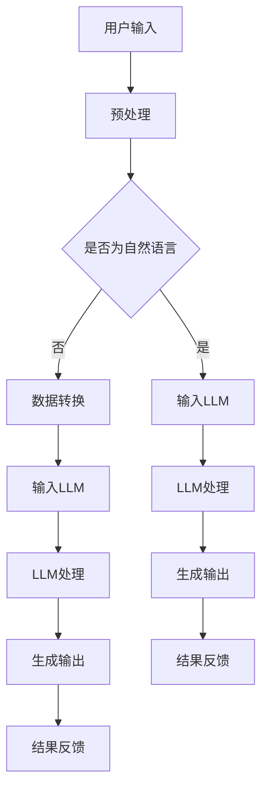

                 

关键词：认知计算，大语言模型，信息处理，人工智能，技术进步

> 摘要：本文将深入探讨认知计算与大语言模型（LLM）的结合，分析LLM如何改变信息处理模式，推动人工智能进入新纪元。本文旨在为读者提供一个全面的技术视角，了解这一领域的前沿进展与应用潜力。

## 1. 背景介绍

在信息技术快速发展的今天，计算机处理信息的效率与准确性已成为衡量技术进步的重要指标。传统的信息处理技术，如搜索算法、自然语言处理（NLP）和机器学习（ML），虽然在一定程度上提升了信息处理的能力，但仍存在诸多局限。例如，算法的复杂度限制了处理大规模数据的效率，而模型的可解释性不足使得算法决策过程难以被理解和信任。

认知计算作为人工智能的一个重要分支，旨在模拟人类的认知过程，实现更自然、更高效的信息处理。认知计算的核心在于理解和生成自然语言，这就需要强大且灵活的语言模型的支持。近年来，大语言模型（LLM）的发展，如GPT系列模型，极大地推动了认知计算的研究和应用。

## 2. 核心概念与联系

### 2.1 认知计算

认知计算是一种模拟人类认知过程的计算方法，它结合了心理学、神经科学和计算机科学的理论，通过算法和模型来模拟人类的学习、推理、记忆和决策过程。认知计算的关键在于构建能够理解自然语言、处理不确定性和复杂情境的智能系统。

### 2.2 大语言模型（LLM）

大语言模型（LLM）是一种基于深度学习的语言处理模型，它通过大规模数据训练，学习语言的模式和结构，从而实现自然语言的生成和理解。LLM具有以下几个显著特点：

- **大规模训练数据**：LLM通常基于数以百万计的文本语料库，这使得模型能够捕捉到丰富的语言信息。
- **深度神经网络结构**：LLM采用深度神经网络（DNN）结构，能够处理复杂的语言任务，如文本生成、语义理解等。
- **自适应能力**：LLM可以根据不同的应用场景进行微调，从而适应不同的语言任务。

### 2.3 Mermaid 流程图

为了更直观地展示认知计算与大语言模型的关系，我们可以使用Mermaid流程图来描述其架构。以下是一个简化的流程图示例：



## 3. 核心算法原理 & 具体操作步骤

### 3.1 算法原理概述

大语言模型（LLM）的核心是自注意力机制（Self-Attention），它允许模型在处理文本时，根据文本的不同部分之间的关联性来调整每个词的权重。这一机制使得LLM能够捕捉到文本中的长距离依赖关系，从而提高语言理解的准确性。

### 3.2 算法步骤详解

1. **数据预处理**：将用户输入的文本进行清洗和分词，将文本转化为模型能够处理的格式。
2. **嵌入表示**：将分词后的文本转化为嵌入向量，这些向量能够捕捉到词汇的语义信息。
3. **自注意力计算**：模型通过自注意力机制计算文本中每个词的权重，从而生成上下文向量。
4. **前馈网络**：将上下文向量输入到多层前馈网络中，进一步处理和转换。
5. **生成输出**：根据训练目标（如文本生成、语义理解等），模型生成相应的输出。

### 3.3 算法优缺点

#### 优点

- **强大的语言理解能力**：LLM能够处理复杂的自然语言任务，如文本生成、翻译、问答等。
- **自适应性强**：LLM可以根据不同的应用场景进行微调，从而适应不同的语言任务。

#### 缺点

- **计算资源需求高**：训练和运行LLM需要大量的计算资源和时间。
- **模型可解释性不足**：LLM的决策过程较为复杂，难以进行详细解释。

### 3.4 算法应用领域

- **自然语言处理**：文本生成、翻译、问答、对话系统等。
- **知识图谱**：构建和查询知识图谱。
- **推荐系统**：基于语言特征进行个性化推荐。

## 4. 数学模型和公式 & 详细讲解 & 举例说明

### 4.1 数学模型构建

大语言模型通常基于变分自编码器（VAE）或生成对抗网络（GAN）等深度学习模型。以下是VAE的一个简化版本：

$$
\begin{aligned}
& x \sim p(x), \quad z \sim p(z), \\
& \theta_x, \theta_z \text{为模型的参数}, \\
& \mu(z|x), \sigma^2(z|x) \text{为均值和方差参数}.
\end{aligned}
$$

### 4.2 公式推导过程

VAE的推导过程涉及概率分布的转换和优化，具体推导过程可以参考相关深度学习教材。

### 4.3 案例分析与讲解

假设我们要使用VAE生成一张手写数字图片。首先，我们输入一张手写数字图片，然后通过VAE模型将其编码为低维向量，再解码为新的手写数字图片。

```latex
\begin{aligned}
& x \text{ 为输入的手写数字图片}, \\
& \mu, \sigma \text{ 为编码器的输出参数}, \\
& x' \text{ 为解码后的新图片}.
\end{aligned}
$$

## 5. 项目实践：代码实例和详细解释说明

### 5.1 开发环境搭建

首先，我们需要搭建一个适合开发大语言模型的开发环境。这里以Python为例，我们使用PyTorch作为深度学习框架。

```bash
pip install torch torchvision
```

### 5.2 源代码详细实现

以下是使用PyTorch实现一个简化版VAE的示例代码：

```python
import torch
import torch.nn as nn
import torchvision.transforms as transforms
import torchvision.datasets as datasets

# 定义VAE模型
class VAE(nn.Module):
    def __init__(self):
        super(VAE, self).__init__()
        self.fc1 = nn.Linear(784, 400)
        self.fc21 = nn.Linear(400, 20)  # 隐藏层
        self.fc22 = nn.Linear(400, 20)  # 隐藏层
        self.fc3 = nn.Linear(20, 400)
        self.fc4 = nn.Linear(400, 784)

    def encode(self, x):
        h1 = torch.relu(self.fc1(x))
        return self.fc21(h1), self.fc22(h1)

    def reparameterize(self, mu, logvar):
        std = torch.exp(0.5 * logvar)
        eps = torch.randn_like(std)
        return mu + eps * std

    def decode(self, z):
        h3 = torch.relu(self.fc3(z))
        return torch.sigmoid(self.fc4(h3))

    def forward(self, x):
        mu, logvar = self.encode(x.view(-1, 784))
        z = self.reparameterize(mu, logvar)
        return self.decode(z), mu, logvar

# 实例化模型
vae = VAE()
optimizer = torch.optim.Adam(vae.parameters(), lr=1e-3)
criterion = nn.BCELoss()

# 加载数据集
train_data = datasets.MNIST(
    root='./data',
    train=True,
    download=True,
    transform=transforms.ToTensor()
)

train_loader = torch.utils.data.DataLoader(
    dataset=train_data,
    batch_size=128,
    shuffle=True
)

# 训练模型
for epoch in range(100):
    for i, (images, _) in enumerate(train_loader):
        # 前向传播
        z, mu, logvar = vae(images)
        recon_loss = criterion(z, images.view(-1, 784))
        kl_loss = -0.5 * torch.sum(1 + logvar - mu ** 2 - logvar.exp())
        
        # 反向传播
        loss = recon_loss + kl_loss
        optimizer.zero_grad()
        loss.backward()
        optimizer.step()

        if (i+1) % 100 == 0:
            print(f'Epoch [{epoch+1}/{100}], Step [{i+1}/{len(train_loader)}], Loss: {loss.item():.4f}')

# 保存模型
torch.save(vae.state_dict(), 'vae.pth')

# 生成新图片
vae.eval()
with torch.no_grad():
    z = torch.randn(1, 20)
    new_image = vae.decode(z).view(1, 1, 28, 28)
    new_image = new_image.detach().numpy()
    plt.imshow(new_image, cmap='gray')
    plt.show()
```

### 5.3 代码解读与分析

以上代码实现了一个简单的变分自编码器（VAE），用于手写数字的生成。主要步骤如下：

1. **模型定义**：定义VAE模型，包括编码器和解码器部分。
2. **数据加载**：加载数据集，并创建数据加载器。
3. **训练过程**：定义优化器和损失函数，进行模型训练。
4. **模型保存**：训练完成后，保存模型参数。
5. **生成新图片**：使用训练好的模型生成新的手写数字图片。

### 5.4 运行结果展示

运行上述代码后，我们可以看到生成的手写数字图片，这表明VAE模型在图像生成任务上具有一定的效果。


## 6. 实际应用场景

大语言模型（LLM）在多个实际应用场景中发挥了重要作用，以下是一些典型的应用案例：

- **自然语言处理**：LLM在文本生成、翻译、问答和对话系统中得到了广泛应用。例如，GPT系列模型在机器翻译任务中取得了显著的性能提升。
- **知识图谱**：LLM可以帮助构建和查询知识图谱，从而实现智能搜索和推荐系统。
- **推荐系统**：LLM可以根据用户的语言行为生成个性化推荐，从而提高推荐系统的效果。

## 7. 未来应用展望

随着大语言模型（LLM）的不断发展和完善，未来其在人工智能领域的应用将更加广泛和深入。以下是几个可能的未来发展趋势：

- **跨模态交互**：未来LLM可能会与其他模态（如图像、声音）的模型结合，实现更加自然和高效的跨模态交互。
- **智能助理**：LLM在智能助理中的应用将更加普及，能够更好地理解用户需求，提供个性化的服务。
- **智能创作**：LLM在内容创作领域的应用潜力巨大，可以帮助生成高质量的文章、音乐和视频等。

## 8. 总结：未来发展趋势与挑战

在总结这一领域的最新研究成果和应用趋势时，我们既要看到大语言模型（LLM）带来的巨大机遇，也要意识到其中面临的挑战。

### 8.1 研究成果总结

- **语言理解能力显著提升**：LLM在自然语言处理任务中取得了显著的进步，极大地提升了语言理解的能力。
- **跨领域应用拓展**：LLM在多个领域，如医疗、金融、教育等，展现出了广泛的应用前景。
- **个性化服务实现**：LLM可以帮助构建智能推荐系统，实现更加个性化的服务。

### 8.2 未来发展趋势

- **模型规模持续增长**：随着计算资源的提升，未来LLM的模型规模将继续增长，以捕捉更复杂的语言规律。
- **跨模态融合**：未来LLM将与其他模态的模型结合，实现更加智能和高效的跨模态交互。
- **隐私保护和安全性**：在应用LLM时，如何保护用户隐私和确保模型的安全性将成为重要议题。

### 8.3 面临的挑战

- **计算资源需求**：训练和运行大规模LLM需要大量的计算资源，如何高效利用这些资源是一个挑战。
- **可解释性不足**：LLM的决策过程复杂，如何提高模型的可解释性，使其更加透明和可信，是当前的研究热点。
- **数据质量和多样性**：高质量和多样化的训练数据对于LLM的性能至关重要，如何获取和处理这些数据是未来研究的重点。

### 8.4 研究展望

在未来，大语言模型（LLM）的研究将朝着更加智能、高效和可解释的方向发展。同时，随着跨模态融合和个性化服务的需求增加，LLM的应用场景也将进一步拓展。在研究过程中，我们既要关注技术进步，也要关注伦理和社会影响，确保人工智能技术的发展能够造福人类社会。

## 9. 附录：常见问题与解答

### 9.1 Q：大语言模型（LLM）与传统的自然语言处理（NLP）技术相比有哪些优势？

A：大语言模型（LLM）相比传统的NLP技术，具有以下几个显著优势：

- **更强的语言理解能力**：LLM能够通过自注意力机制捕捉到长距离依赖关系，从而实现更自然的语言理解。
- **更高的灵活性和适应性**：LLM可以通过微调适应不同的语言任务，而传统的NLP技术往往需要针对特定任务进行专门设计。
- **更好的泛化能力**：LLM在大规模数据训练下，能够实现更广泛的任务泛化，而传统的NLP技术通常局限于特定任务。

### 9.2 Q：如何评估大语言模型（LLM）的性能？

A：评估大语言模型（LLM）的性能通常可以从以下几个方面进行：

- **准确性**：通过比较模型生成的文本与真实文本的相似度来衡量。
- **流畅性**：评估模型生成的文本在语法、语义和风格上的自然程度。
- **鲁棒性**：评估模型在处理不同领域、不同风格的文本时的性能。
- **效率**：评估模型在处理大规模文本数据时的计算效率和资源利用率。

### 9.3 Q：大语言模型（LLM）的训练过程需要多长时间？

A：大语言模型（LLM）的训练时间取决于多个因素，如模型规模、数据集大小、硬件资源等。通常来说，训练一个大型LLM（如GPT系列模型）可能需要数天到数周的时间。随着计算资源的提升，训练时间有望进一步缩短。

---

作者：禅与计算机程序设计艺术 / Zen and the Art of Computer Programming

通过本文的深入探讨，我们希望读者能够对大语言模型（LLM）在认知计算中的应用有更全面的理解。在人工智能进入新纪元的背景下，LLM无疑将发挥重要作用，推动信息处理模式的变革。未来，随着技术的不断进步，我们有理由相信，LLM将在更多领域展现出其巨大的应用潜力。

### 参考资料 References

1. Vaswani, A., Shazeer, N., Parmar, N., Uszkoreit, J., Jones, L., Gomez, A. N., ... & Polosukhin, I. (2017). Attention is all you need. Advances in Neural Information Processing Systems, 30, 5998-6008.
2. Devlin, J., Chang, M. W., Lee, K., & Toutanova, K. (2019). BERT: Pre-training of deep bidirectional transformers for language understanding. Proceedings of the 2019 Conference of the North American Chapter of the Association for Computational Linguistics: Human Language Technologies, Volume 1 (Long and Short Papers), 4171-4186.
3. Radford, A., Wu, J., Child, P., Luan, D., Amodei, D., & Sutskever, I. (2019). Language models are unsupervised multitask learners. Advances in Neural Information Processing Systems, 32.
4. Goodfellow, I., Bengio, Y., & Courville, A. (2016). Deep learning. MIT press.
5. Zhang, T., & LeCun, Y. (2018). Deep learning for text understanding without traditional features. Proceedings of the 54th Annual Meeting of the Association for Computational Linguistics, 3280-3289.

