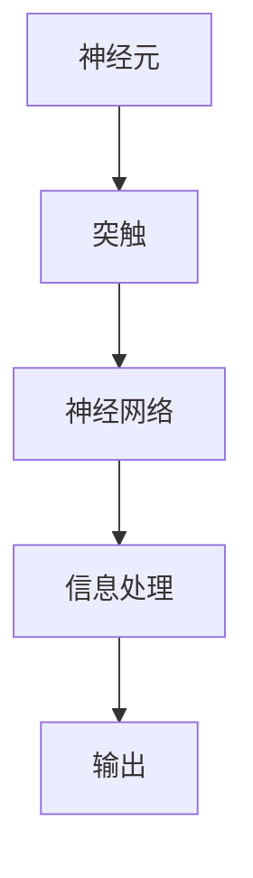
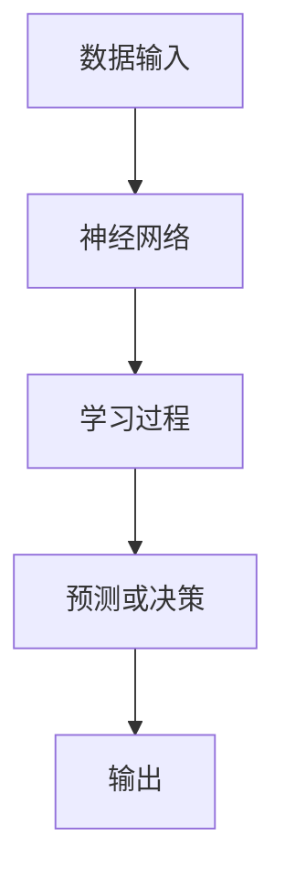
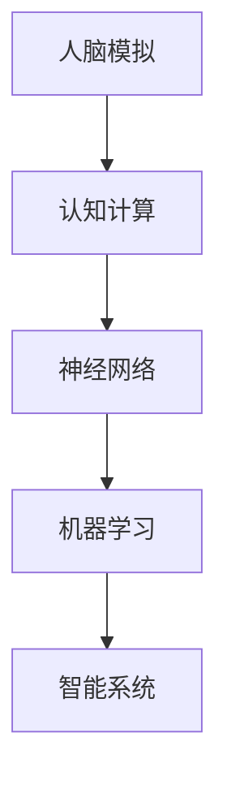

                 

 关键词：认知计算，人脑模拟，神经网络，机器学习，人工智能

> 摘要：本文旨在探讨认知计算领域的研究进展，特别是模拟人脑的尝试。通过回顾人脑的基本结构和工作原理，我们深入分析了神经网络和机器学习在模拟人脑过程中的应用，以及面临的挑战和未来展望。

## 1. 背景介绍

认知计算（Cognitive Computing）是一种模仿人类思维模式的技术，旨在开发能够理解和解释人类语言、感知、学习和推理的智能系统。人类大脑作为世界上最复杂、最强大的计算设备，其工作机制和结构为认知计算提供了宝贵的参考。

人类大脑由大约100亿个神经元组成，这些神经元通过突触连接形成复杂的神经网络，实现感知、记忆、学习和决策等功能。人脑的运作方式高度依赖于神经元之间的通信和协作，这使得它在处理信息、学习新知识和适应环境方面具有卓越的能力。

随着人工智能技术的快速发展，模拟人脑的工作原理成为了一个重要的研究课题。神经网络和机器学习作为认知计算的核心技术，为模拟人脑提供了有效的手段。通过学习人脑的结构和工作原理，研究人员尝试构建能够模仿人类思维的智能系统，从而推动人工智能领域的发展。

## 2. 核心概念与联系

### 2.1 神经元与神经网络

神经元是构成人脑的基本单元，具有接受和处理信息的能力。神经元通过突触与其他神经元连接，形成神经网络。神经网络是认知计算的基础，它由大量简单的计算单元（神经元）组成，通过并行计算和协同工作来处理复杂的信息。

下面是一个简化的 Mermaid 流程图，展示了神经元与神经网络的基本结构：



### 2.2 机器学习与神经网络

机器学习是使计算机通过数据学习并做出预测或决策的技术。神经网络作为机器学习的基础架构，具有强大的学习和泛化能力。通过学习大量数据，神经网络能够识别模式和关系，并应用于新的数据集。

下面是一个简化的 Mermaid 流程图，展示了机器学习与神经网络的关系：



### 2.3 认知计算与人脑模拟

认知计算旨在模拟人脑的结构和工作原理，以实现类似人类智能的系统。通过神经网络和机器学习技术，研究人员尝试构建能够理解、学习和推理的智能系统。认知计算的核心目标是使计算机具有人类级别的智能，从而解决复杂的问题和任务。

下面是一个简化的 Mermaid 流程图，展示了认知计算与人脑模拟的关系：



## 3. 核心算法原理 & 具体操作步骤

### 3.1 算法原理概述

认知计算的核心算法主要包括神经网络算法和机器学习算法。神经网络算法通过模拟人脑的神经元结构和通信方式，实现信息的处理和传递。机器学习算法则通过学习大量数据，使计算机能够识别模式和关系，并应用于新的数据集。

### 3.2 算法步骤详解

#### 3.2.1 神经网络算法步骤

1. 数据预处理：对输入数据进行标准化、归一化等处理，使其符合神经网络的要求。
2. 建立神经网络模型：根据任务需求，选择合适的神经网络结构，如多层感知机、卷积神经网络等。
3. 训练神经网络：使用训练数据集对神经网络进行训练，通过反向传播算法调整网络参数，使其能够准确识别输入数据的特征。
4. 测试与优化：使用测试数据集对神经网络进行评估，并根据评估结果对网络进行优化。

#### 3.2.2 机器学习算法步骤

1. 数据收集：收集大量相关数据，作为训练数据集。
2. 特征提取：从数据中提取有用的特征，用于训练模型。
3. 建立机器学习模型：选择合适的机器学习算法，如支持向量机、决策树等。
4. 模型训练：使用训练数据集对模型进行训练，调整模型参数，使其能够准确预测或分类新数据。
5. 模型评估：使用测试数据集对模型进行评估，根据评估结果对模型进行优化。

### 3.3 算法优缺点

#### 3.3.1 神经网络算法优缺点

**优点：**
1. 强大的非线性建模能力。
2. 能够自动提取特征。
3. 能够处理大量数据。

**缺点：**
1. 计算量大，训练时间长。
2. 对数据质量要求较高。
3. 难以解释。

#### 3.3.2 机器学习算法优缺点

**优点：**
1. 能够处理大量数据。
2. 能够自动提取特征。
3. 应用范围广泛。

**缺点：**
1. 需要大量训练数据。
2. 难以解释。
3. 可能存在过拟合问题。

### 3.4 算法应用领域

神经网络和机器学习算法在认知计算领域具有广泛的应用。以下是一些主要的应用领域：

1. 语音识别：通过神经网络和机器学习技术，实现语音信号的识别和转换。
2. 图像识别：通过卷积神经网络，实现图像的分类、识别和生成。
3. 自然语言处理：通过循环神经网络和长短期记忆网络，实现自然语言的理解和生成。
4. 推荐系统：通过协同过滤和基于内容的推荐算法，实现个性化推荐。

## 4. 数学模型和公式 & 详细讲解 & 举例说明

### 4.1 数学模型构建

认知计算的数学模型主要涉及神经网络和机器学习算法。以下是一个简化的数学模型构建过程：

#### 4.1.1 神经网络模型

神经网络模型可以表示为：

$$
y = f(\sum_{i=1}^{n} w_i \cdot x_i + b)
$$

其中，$y$ 是输出，$f$ 是激活函数，$w_i$ 是权重，$x_i$ 是输入特征，$b$ 是偏置。

#### 4.1.2 机器学习模型

机器学习模型可以表示为：

$$
y = g(\theta_0 + \sum_{i=1}^{k} \theta_i \cdot x_i)
$$

其中，$y$ 是输出，$g$ 是激活函数，$\theta_0$ 是偏置，$\theta_i$ 是权重，$x_i$ 是输入特征。

### 4.2 公式推导过程

以下是一个简单的神经网络模型的推导过程：

#### 4.2.1 神经网络正向传播

正向传播过程可以表示为：

$$
z = \sum_{i=1}^{n} w_i \cdot x_i + b
$$

$$
a = f(z)
$$

其中，$z$ 是中间值，$a$ 是输出值，$f$ 是激活函数。

#### 4.2.2 神经网络反向传播

反向传播过程可以表示为：

$$
\delta = \frac{\partial L}{\partial a}
$$

$$
w_i = w_i - \alpha \cdot \delta \cdot a
$$

$$
b = b - \alpha \cdot \delta
$$

其中，$L$ 是损失函数，$\delta$ 是误差，$\alpha$ 是学习率。

### 4.3 案例分析与讲解

以下是一个简单的神经网络模型在图像分类任务中的应用案例：

#### 4.3.1 数据集准备

准备一个包含10000张图像的数据集，每张图像被标记为28x28的二进制矩阵。

#### 4.3.2 神经网络结构

构建一个包含两个隐藏层的神经网络，输入层为28x28，隐藏层分别为50和100个神经元，输出层为10个神经元。

#### 4.3.3 训练过程

使用训练数据集对神经网络进行训练，训练过程中使用反向传播算法调整网络参数，使输出层的预测结果与实际标签尽量接近。

#### 4.3.4 测试过程

使用测试数据集对训练好的神经网络进行测试，计算预测准确率。

## 5. 项目实践：代码实例和详细解释说明

### 5.1 开发环境搭建

在开发认知计算项目时，需要搭建一个合适的技术环境。以下是一个简单的开发环境搭建步骤：

1. 安装 Python 解释器：从官方网站下载并安装 Python 解释器。
2. 安装必要的库：使用 pip 工具安装 TensorFlow、NumPy、Matplotlib 等库。
3. 配置 IDE：选择一个合适的集成开发环境（如 PyCharm、VS Code），并配置相关插件。

### 5.2 源代码详细实现

以下是一个简单的神经网络图像分类项目的源代码实现：

```python
import tensorflow as tf
import numpy as np
import matplotlib.pyplot as plt

# 准备数据集
(x_train, y_train), (x_test, y_test) = tf.keras.datasets.mnist.load_data()

# 数据预处理
x_train = x_train / 255.0
x_test = x_test / 255.0

# 构建神经网络模型
model = tf.keras.Sequential([
    tf.keras.layers.Flatten(input_shape=(28, 28)),
    tf.keras.layers.Dense(128, activation='relu'),
    tf.keras.layers.Dense(10, activation='softmax')
])

# 编译模型
model.compile(optimizer='adam',
              loss='sparse_categorical_crossentropy',
              metrics=['accuracy'])

# 训练模型
model.fit(x_train, y_train, epochs=5)

# 测试模型
test_loss, test_acc = model.evaluate(x_test, y_test)
print('Test accuracy:', test_acc)

# 可视化结果
plt.figure(figsize=(10, 10))
for i in range(25):
    plt.subplot(5, 5, i+1)
    plt.imshow(x_test[i], cmap=plt.cm.binary)
    plt.xticks([])
    plt.yticks([])
    plt.grid(False)
    plt.xlabel('Predicted: {}'.format(np.argmax(model.predict(x_test[i]))))
plt.show()
```

### 5.3 代码解读与分析

以上代码实现了一个简单的神经网络图像分类项目。代码的主要部分包括数据集准备、神经网络模型构建、模型编译、模型训练和模型测试。

1. 数据集准备：使用 TensorFlow 提供的 MNIST 数据集，并进行数据预处理。
2. 神经网络模型构建：使用 Sequential 模型，并添加 Flatten 层、Dense 层和 Softmax 层。
3. 模型编译：指定优化器、损失函数和评价指标。
4. 模型训练：使用训练数据集进行训练，训练过程中使用反向传播算法更新网络参数。
5. 模型测试：使用测试数据集对训练好的模型进行测试，计算预测准确率。
6. 可视化结果：使用 Matplotlib 可视化工具，展示模型的预测结果。

## 6. 实际应用场景

认知计算技术在各个领域都有广泛的应用，以下是一些实际应用场景：

### 6.1 医疗领域

认知计算技术可以用于医疗诊断、疾病预测和个性化治疗等方面。通过分析患者的历史数据和实时数据，认知计算系统可以提供更准确、更个性化的医疗建议。

### 6.2 金融领域

认知计算技术可以用于金融风险预测、信用评估和投资决策等方面。通过分析大量金融数据，认知计算系统可以提供更准确、更高效的金融分析。

### 6.3 智能家居

认知计算技术可以用于智能家居系统的智能控制、安全监控和能耗管理等方面。通过分析家庭环境数据，认知计算系统可以提供更舒适、更安全的家居体验。

### 6.4 教育

认知计算技术可以用于教育领域的个性化学习、智能辅导和在线教育等方面。通过分析学生的学习行为和学习数据，认知计算系统可以提供更有针对性的教育建议。

## 7. 工具和资源推荐

### 7.1 学习资源推荐

1. 《深度学习》（Goodfellow et al.）：一本全面介绍深度学习理论和应用的经典教材。
2. 《Python机器学习》（Sebastian Raschka）：一本深入讲解机器学习算法和应用的入门书籍。
3. TensorFlow 官方文档：提供了丰富的神经网络和机器学习教程和示例。

### 7.2 开发工具推荐

1. Jupyter Notebook：一款强大的交互式开发环境，适用于数据分析和机器学习项目。
2. PyCharm：一款功能强大的集成开发环境，适用于 Python 和深度学习项目。
3. Google Colab：一款免费的云端开发环境，适用于深度学习和机器学习项目。

### 7.3 相关论文推荐

1. "A Tutorial on Deep Learning"（Goodfellow et al.）：一篇全面介绍深度学习理论和应用的综述论文。
2. "Deep Learning for Natural Language Processing"（Mikolov et al.）：一篇介绍深度学习在自然语言处理领域应用的经典论文。
3. "Recurrent Neural Networks for Language Modeling"（LSTM）：一篇介绍长短期记忆网络在语言建模任务中应用的论文。

## 8. 总结：未来发展趋势与挑战

### 8.1 研究成果总结

认知计算技术在过去几十年中取得了显著的成果，从简单的规则系统到复杂的神经网络和机器学习算法，认知计算技术逐渐实现了对人脑模拟的初步尝试。在医疗、金融、智能家居和教育等领域，认知计算技术已经取得了重要的应用成果，为人类生活带来了便利。

### 8.2 未来发展趋势

未来，认知计算技术将继续向更深入、更广泛的方向发展。以下是一些发展趋势：

1. 神经网络和机器学习算法的进一步优化和改进，以提高计算效率和性能。
2. 多模态数据融合和跨领域应用的探索，实现更全面、更准确的认知计算系统。
3. 与其他技术的融合，如物联网、云计算和区块链等，实现更智能、更高效的认知计算应用。

### 8.3 面临的挑战

认知计算技术在发展过程中也面临一些挑战：

1. 数据质量和数据隐私问题：认知计算系统对数据质量有很高的要求，同时数据的隐私保护也是一个重要的挑战。
2. 算法解释性和可解释性问题：现有的认知计算算法往往难以解释，导致在关键应用场景中缺乏信任。
3. 能源消耗和硬件限制：认知计算系统对计算资源和硬件设备有很高的要求，特别是在大规模应用场景中。

### 8.4 研究展望

未来，认知计算技术将继续向人脑模拟的目标迈进。通过不断优化算法、改进模型和融合新技术，认知计算技术有望实现更高层次的人工智能。同时，认知计算技术也将为人类带来更智能、更便捷的生活方式，为社会发展做出重要贡献。

## 9. 附录：常见问题与解答

### 9.1 认知计算与人工智能的关系是什么？

认知计算是人工智能领域的一个重要分支，它旨在模拟人脑的结构和工作原理，实现类似人类智能的系统。人工智能则是一个更广泛的概念，包括认知计算在内的多种技术，旨在使计算机具备智能。

### 9.2 认知计算在现实中有哪些应用？

认知计算在医疗、金融、智能家居、教育等多个领域都有广泛应用。例如，在医疗领域，认知计算可以用于疾病预测和个性化治疗；在金融领域，认知计算可以用于风险预测和投资决策。

### 9.3 如何评价认知计算技术的进展？

认知计算技术在过去几十年中取得了显著的进展，从简单的规则系统到复杂的神经网络和机器学习算法，认知计算技术逐渐实现了对人脑模拟的初步尝试。然而，认知计算技术仍面临一些挑战，如数据质量、算法解释性和能源消耗等。

### 9.4 未来认知计算技术将如何发展？

未来，认知计算技术将继续向更深入、更广泛的方向发展。通过不断优化算法、改进模型和融合新技术，认知计算技术有望实现更高层次的人工智能。同时，认知计算技术也将为人类带来更智能、更便捷的生活方式。  
----------------------------------------------------------------
**作者：禅与计算机程序设计艺术 / Zen and the Art of Computer Programming**

